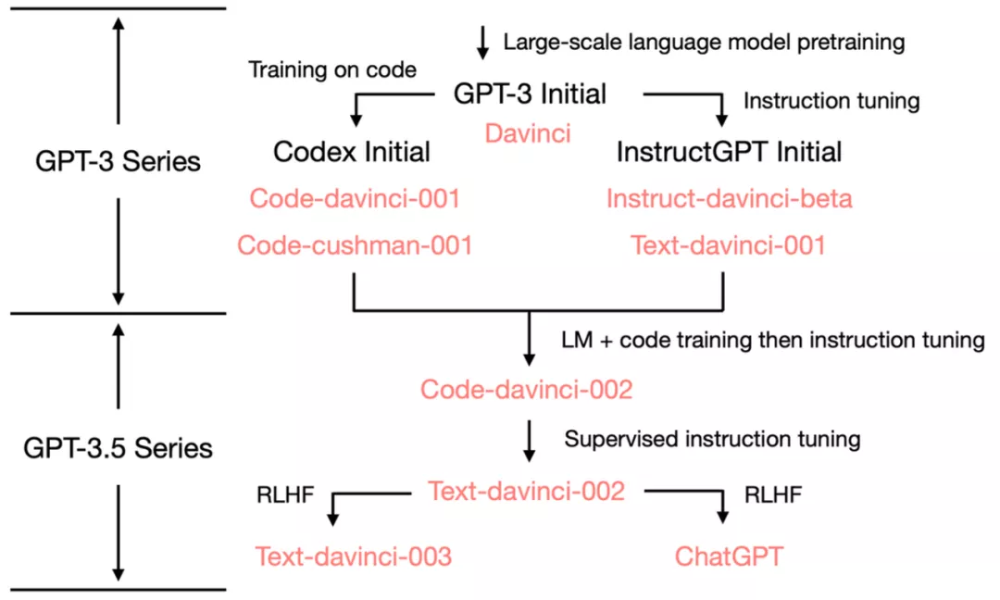
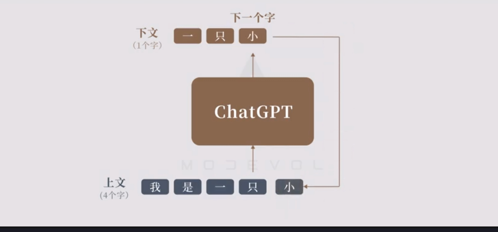
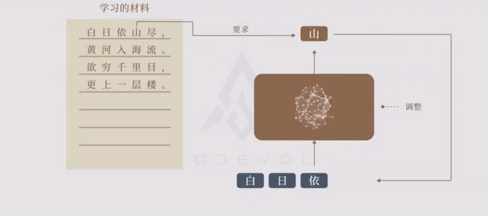
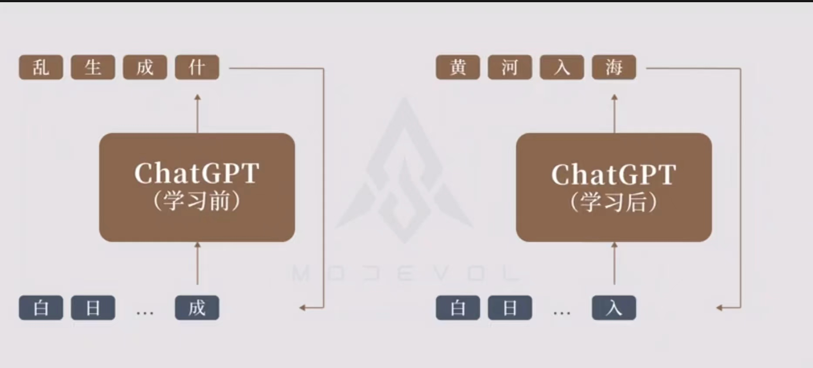
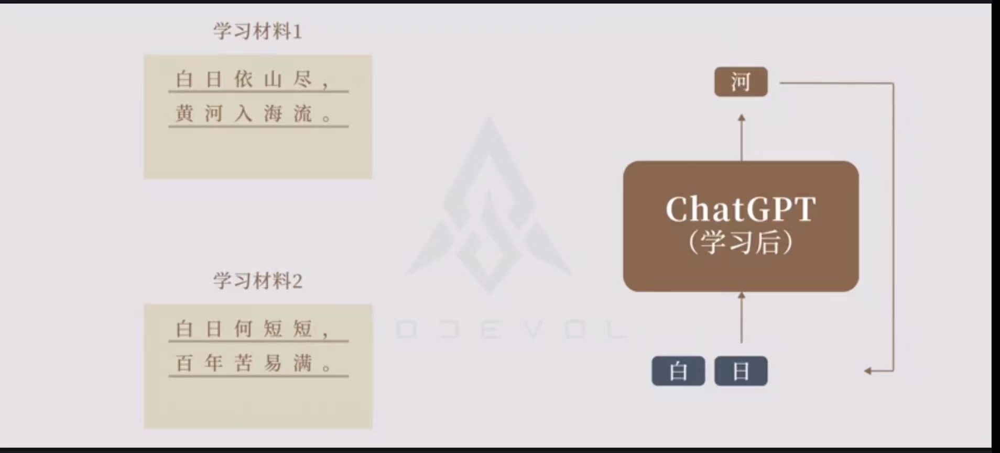
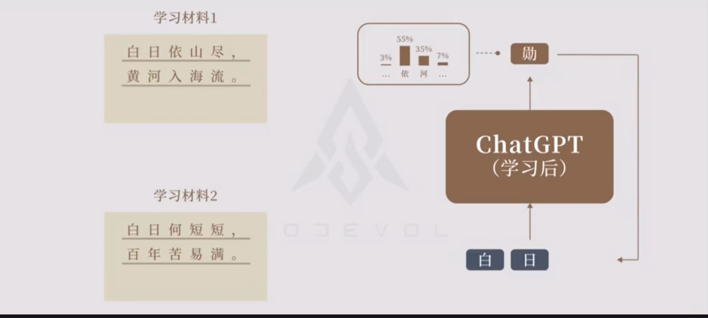
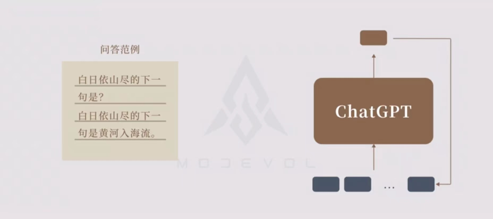

## Chatgpt

### 概念

LLM

什么是 GPT

chatGPT

GPT

### 历史

### 原理

#### GPT

单字接龙

训练方式

高质量的文本进行训练

训练前后对比

相同上文

通过概率的方式预测下一个字。因此，每次回答都不一样。

如何回答问题

通过问题范例进行训练，能面对同一问题的各种变体，能够回答正确的原因目前是无法解释的。也即涌现。

依赖优质种类丰富的大数据

#### ChatGPT

开卷有益

不受约束

模板规范 -- 预训练

1、答不知道

2、指出错误

3、回答原因

4、屏蔽有害信息

语境内学习 -- transformer 架构（未解之谜）

In-Context Learning（ICL），也是一种新的范式，指在不进行参数更新的情况下，只在输入中加入几个示例就能让模型进行学习

思维链 -- 分治思想

猜测是因为代码训练得到

涌现 -- 量变到质变

缺点：过于模板化，限制创造力

创意引导 -- RLHF

与搜索引擎的区别

缺点

1、胡编乱造

2、无法直接修改，只能通过再次训练（提示工程）

3、高度依赖数据

模型质量

1、数据质量

2、偏好

### ChatGPT 的意义

1、业界统一了方法，基于统计的方法

chatgpt 是星星之火，而燎原之火才刚刚开始，这也是 ChatGPT 的意义

ChatGPT 的价值

1、人的的价值 

知识的积累和传递，18 世纪懂微积分的全世界不到 10 人

2、ChatGPT 可以学习所有人类历史的显性知识

目前在人脑内的隐性知识无法还无法学习，而显性知识知识冰山一角

3、人类打破语言壁垒

### OpenAI 的思考

### 工具

浏览器插件：https://github.com/chathub-dev/chathub

### 参考

https://zhuanlan.zhihu.com/p/597264009

https://zhuanlan.zhihu.com/p/597263206