## ChatGPT

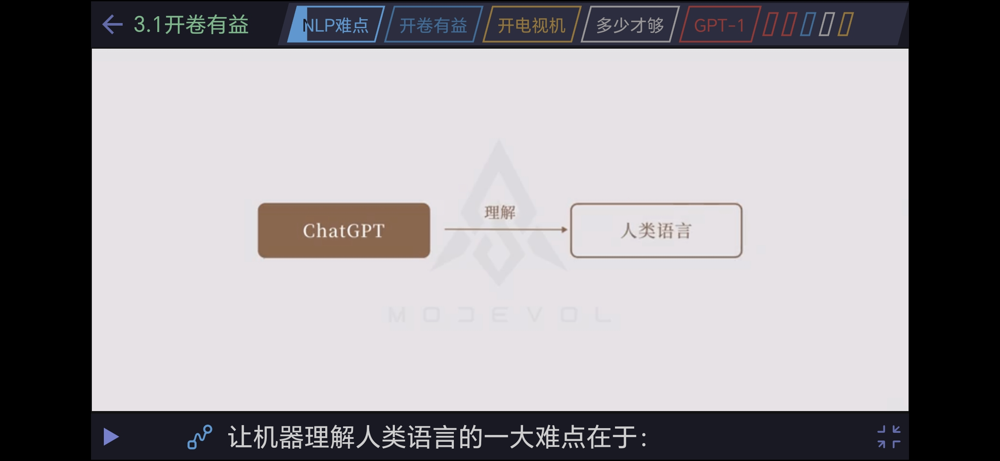

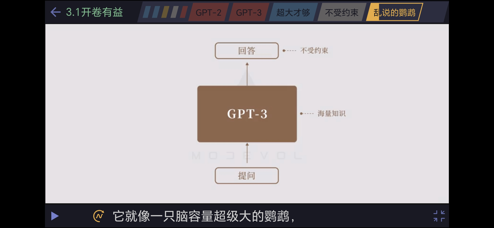

### 概念

LLM：Large Language Model

### 什么是 GPT

### 历史

NLP发展阶段

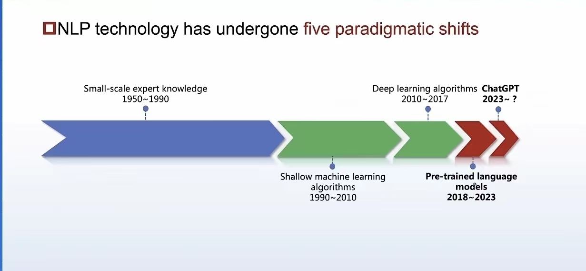

大模型发展

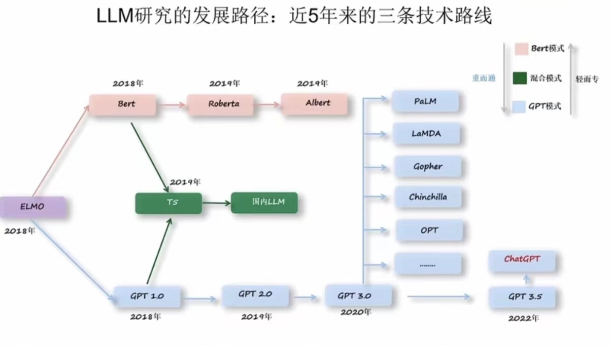

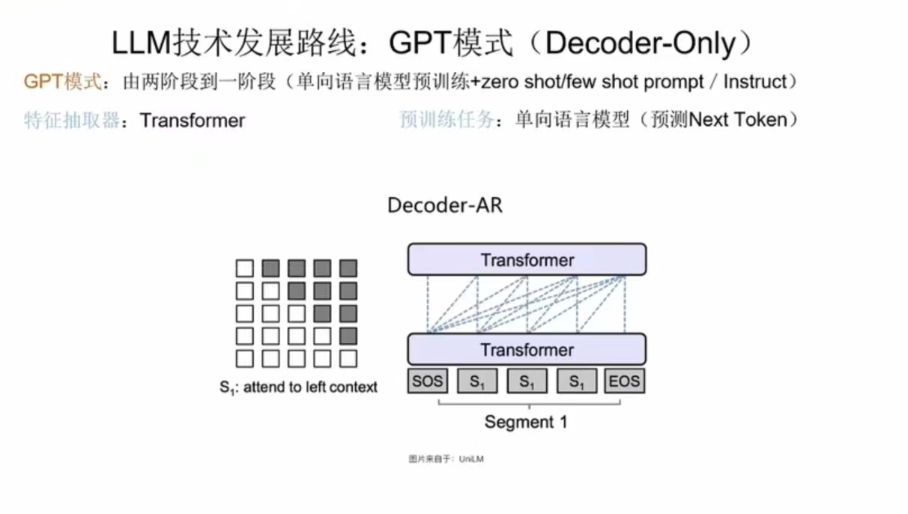

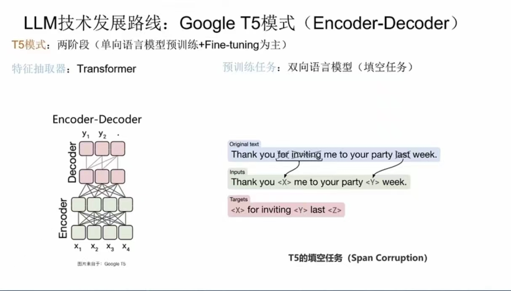

GPT 发展

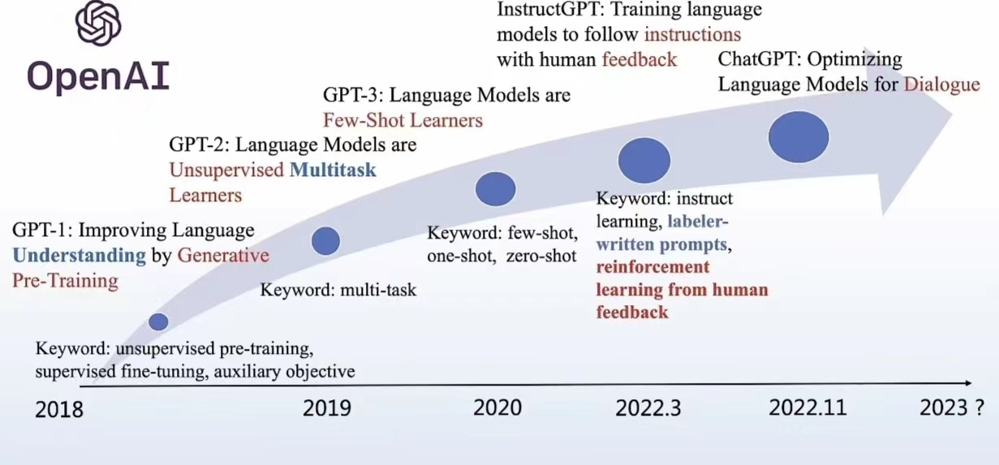

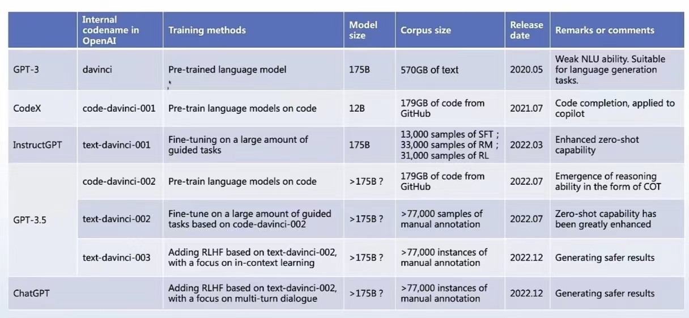

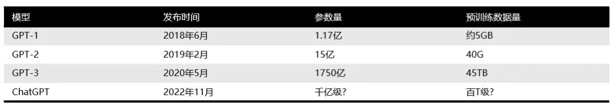

### GPT 原理

1、单字接龙

训练方式

通过海量高质量的文本进行训练，GPT3 的训练数据是 45T，一本100万字的英文书大约1 MB，相当于 4500万本书，美国国家图书馆藏不足 4000万。全世界每年出版 200万本书。高质量的数据消耗完，GPT 能达到怎样的水平？

训练前后对比

2、相同上文

通过概率的方式预测下一个字。因此，每次回答都不一样。

3、如何回答问题

通过问题范例进行训练，能面对同一问题的各种变体，能够回答正确的原因目前是无法解释的。也即涌现。

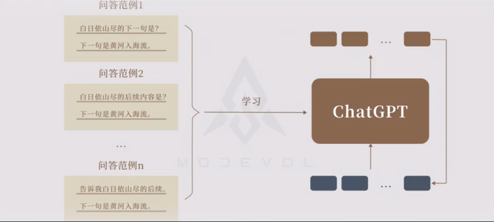

举一反三

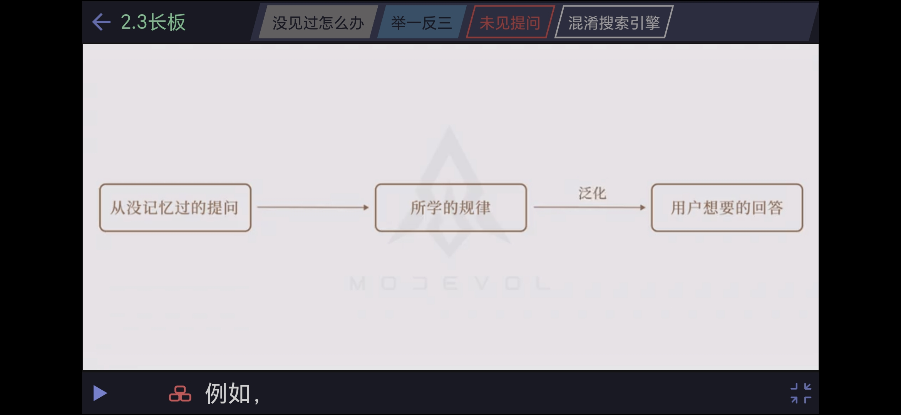

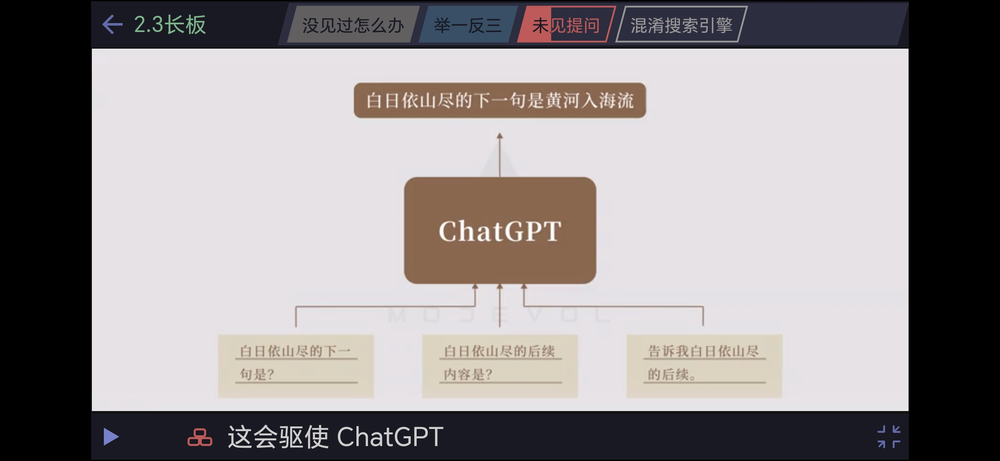

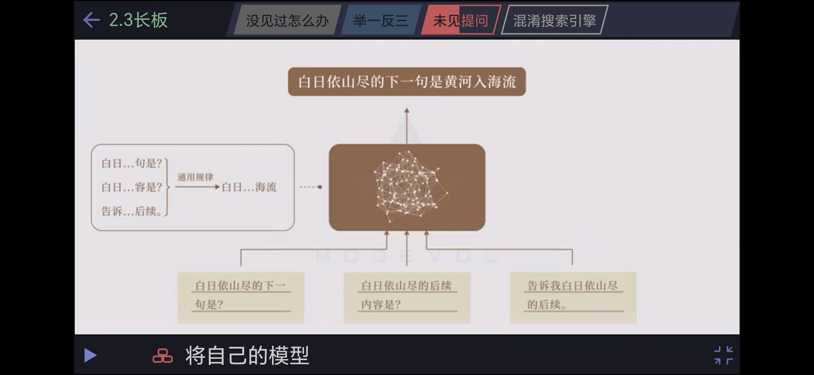

与搜索引擎的区别

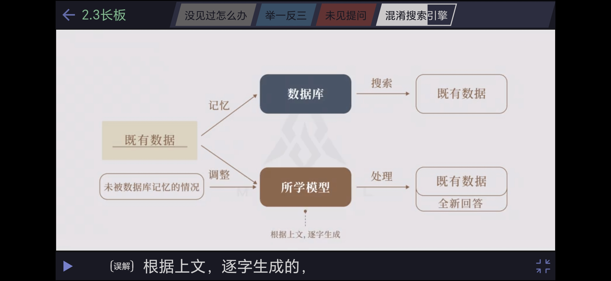

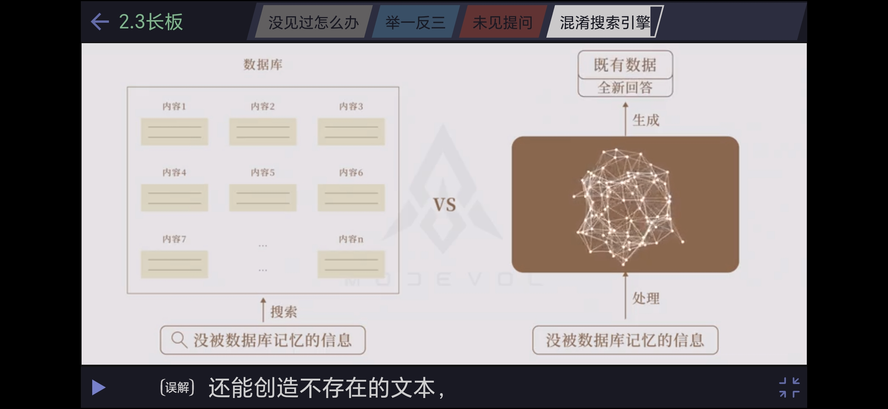

### ChatGPT 原理

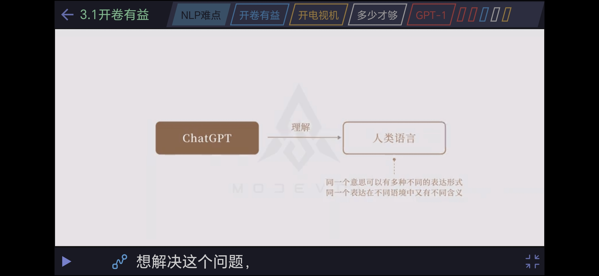

开卷有益

不受约束

模板规范 -- 预训练

1、答不知道

2、指出错误

3、回答原因

4、屏蔽有害信息

语境内学习 -- transformer 架构（未解之谜）

In-Context Learning（ICL），也是一种新的范式，指在不进行参数更新的情况下，只在输入中加入几个示例就能让模型进行学习

思维链 -- 分治思想

猜测是因为代码训练得到

涌现 -- 量变到质变

缺点：过于模板化，限制创造力

创意引导 -- RLHF

与搜索引擎的区别

缺点

1、胡编乱造

2、无法直接修改，只能通过再次训练（提示工程）

3、高度依赖数据

模型质量

1、数据质量

2、偏好

### ChatGPT 的意义

1、业界统一了方法，基于统计的方法

chatgpt 是星星之火，而燎原之火才刚刚开始，这也是 ChatGPT 的意义

### 范式转变

ChatGPT 的价值

1、人的的价值 

知识的积累和传递，18 世纪懂微积分的全世界不到 10 人

2、ChatGPT 可以学习所有人类历史的显性知识

目前在人脑内的隐性知识无法还无法学习，而显性知识知识冰山一角

3、人类打破语言壁垒

### OpenAI 的思考

### 工具

浏览器插件：https://github.com/chathub-dev/chathub

总结文档  [ChatDOC - Chat with your documents](https://chatdoc.com/) 

### 意义

GPT 的三篇论文加起来的引用数不到 Bert 的一半，由此可知，在 GPT 正式出圈之前，Bert 才是主流方向。因此，chatGPT 是一次机器学习算法的统一，说明统计方法的有效性，从最近各大厂商开始发布各种大模型可知一斑。

### 思考

隐性的知识

chatGPT 核心在于处理显性的信息，然后输出为知识。因此，显性的，简单的信息处理必然被 chatGPT 替代。那么，chatGPT 可以基于已有信息萃取大量隐性知识和经验吗？

因为显性的知识在整个人类的知识中只是沧海一粟。大量的经验和知识隐藏在人脑中，尤其是越核心的知识和经验，越是在少数人脑中，越不可能从互联网获取。当人工智能和生物技术（比如脑机接口）合二为一的时候，才是人类的悲剧。

关于人类筛选器

创意类工作的核心是对于未知组合的计算量是非常大的，而被称为艺术的作品都是通过人类大量的超长时间的计算而迸发出来的。对于艺术类这种样本不多的情况，Few Shot 是否能生效？

### 展望

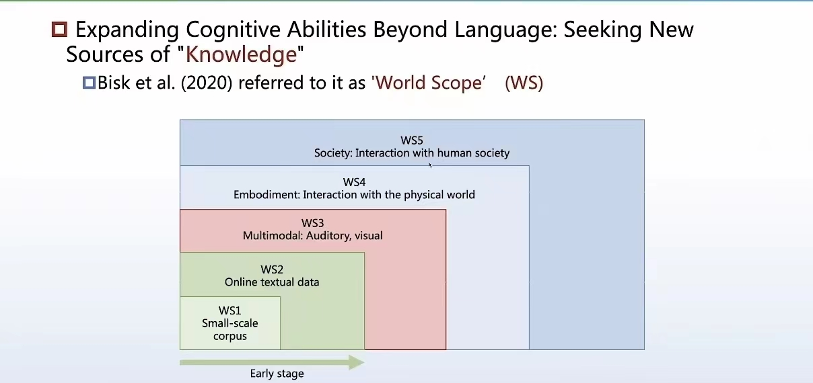

### 参考

https://zhuanlan.zhihu.com/p/597264009

https://zhuanlan.zhihu.com/p/597263206

http://pretrain.nlpedia.ai/

https://lifearchitect.ai/

https://www.bilibili.com/video/BV1MY4y1R7EN/