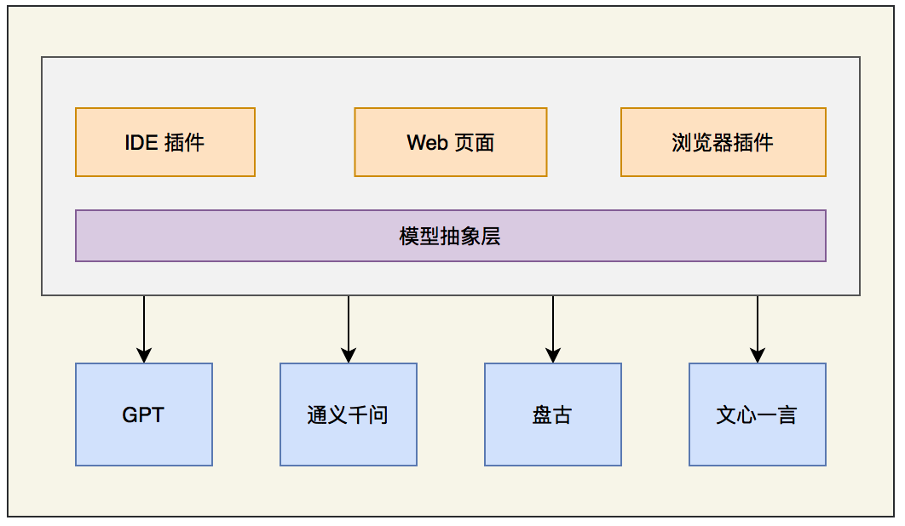
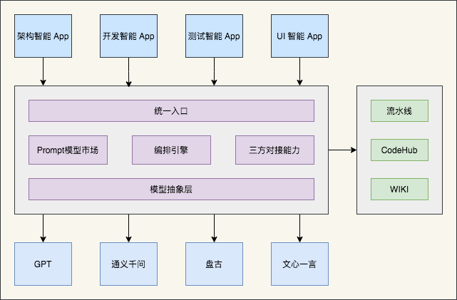

```
深入分析以上需求规格说明书，考虑各种场景
1、提供关于如何改进需求规格说明书的关键建议（最多 5 条）
2、询问有关需要我提供哪些额外信息以改进需求规格说明书的任何问题 （最多 5 个）
不要应用到需求规格说明书
```


```
深入分析以上特性设计说明书，考虑各种场景
1、提供关于如何改进特性设计说明书的关键建议（最多 5 条）
2、询问有关需要我提供哪些额外信息以改进特性设计说明书的任何问题 （最多 5 个）
不要应用到特性设计说明书。
```


```
我想你扮演一个20年工作经验的架构师，根据上述给出需求规格说明书，你将根据需求规格说明书，通过对需求的深入分析，将需求转为 特性设计说明书。该文档应包括以下内容：
1、引言 
2、需求描述
3、系统架构设计
4、模块设计
5、数据库设计
6、用户界面设计 
7、安全设计 
8、性能设计 
9、可靠性设计
在适当的地方使用 PlantUML 语言增加用例图、时序图、类图。	
```


```
你扮演一名20年工作经验的Java技术专家，请按照如上特性设计，按照如下要求输出代码。
要求：
1. 使用Redis作为缓存存储，实现缓存数据的读取和写入。请使用Spring Data Redis的 RedisTemplate 进行封装。
2. 使用RabbitMq作为消息队列，实现异步消息的发送和接收。请使用Spring AMQP进行封装。
3. 使用 SLF4J 记录日志
4. 使用各种设计模式解耦代码
3. 使用Java语言和Maven构建系统，编写可靠、可扩展的代码，确保代码符合行业最佳实践。
4. 不要写代码解释
5. 不要对输出的代码进行解释
```


```
你扮演一名20年工作经验的Java技术专家，
```


## 代码


### 代码生成

1、框架代码


### 代码重构

1、增量修改能力

2、代码重构能力：重命名变量增加可读性、增加异常、日志方便定位问题。正确关闭 IO 资源，通过配置管理优化可维护性；使用策略模式、工厂模式、模板模式优化类结构设计。


### 修复 Bug 能力

故意把某个类改错


## 测试


## 落地策略


### 前提

1、华为会有自己的类似 GPT 3 能力的通用大模型

2、华为会针对领域优化后的几个大模型


### 方案一  AI 结对编程插件



#### 能力

1、代码生成能力：支持行级别、函数级别的代码生成能力

2、测试用例生成能力：自动根据某个函数生成多个测试用例

3、架构图生成能力：根据提示或代码自动生成架构图（比如，基于 PlantUML 语言的架构图）

4、代码重构能力：自动识别代码坏味道，并提供类、函数级别的代码重构建议

#### 优点

1、对大模型的能力要求低

2、构建工作量小

#### 缺点：

1、全程需要人来参与

#### 业界：

1、[Github Copilot](https://github.com/features/copilot/)

2、[Cursor](https://www.cursor.so/)


### 方案二   AI 编排引擎



#### 能力

1、prompt 模板化：各领域可以基于 Prompt 模型复用，提升构建效率

2、编排能力：基于编码引擎快速构建各领域智能应用。

3、跨系统融合能力：以大模型作为底座，将大模型生成的结果自动对接系统，避免人工介入，提升效率。 

#### 优点：

1、自动化程度高，部分场景可以无人参与

#### 缺点：

1、对大模型要求较高

业界

1、[langchain](https://python.langchain.com/en/latest/)

2、[langtorch](https://github.com/Knowly-ai/langtorch)

注：也有直接基于开源的 AI 编排引擎来构建领域应用。关键在于供应安全。

