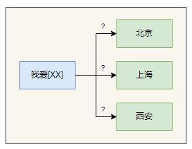
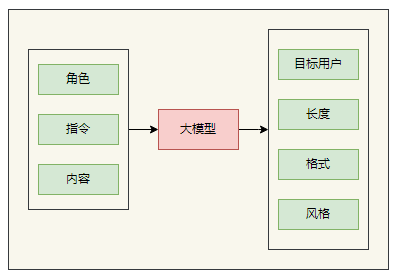

prompt-engineer


### 背景


目前学术界一般将 NLP 任务的发展分为四个阶段即 NLP 四范式：

1. 第一范式：基于传统机器学习模型的范式，主要依赖于各种各样的特征工程(Feature Engineer)来提取数据中的特征并用机器学习模型来解决问题；
2. 第二范式：基于深度学习模型的范式，将设计模型所需做的特征工程工作改成了架构工程(Architecture Engineer)，也就是设计更合适的模型架构，相比于第一范式，模型准确有所提高，特征工程的工作也有所减少；
3. 第三范式：基于预训练模型 + finetuning 的范式，BERT等大规模的预训练模型的引入让NLP的范式变成了预训练和微调，我们解决NLP问题的方式就变成了用预训练好的模型，加入几个简单的层进行下游任务的微调。如 BERT + finetuning 的 NLP 任务，相比于第二范式，模型准确度显著提高，但是模型也随之变得更大，但小数据集就可训练出好模型；
4. 第四范式：基于预训练模型 + Prompt + 预测的范式。过程包括Pre-train, Prompt和Predict三个步骤，其中的主要工作被称为Prompt Engineer。如 GPT + Prompt 的范式相比于第三范式，模型训练所需的训练数据显著减少。

在整个 NLP 领域，你会发现整个发展是朝着精度更高、少监督，甚至无监督的方向发展的，而 Prompt Learning 是目前学术界最新的研究成果。

### 什么是提示工程（prompt engineering）



你觉得答案是什么？ [答案](https://sharegpt.com/c/u5yTIT5)

提示学习是在大型语言模型中使用设计合适的提示文本来引导生成结果的技术。通过将人类指导信息嵌入到模型输入中，提示学习能够指导模型按照特定要求生成语言或文本结果。通过合理的提示设计，我们可以引导模型生成符合预期的结果，提高输出的质量和可控性。提示学习结合了领域专家的知识和模型的生成能力，形成了一种人机协同的优势。

### 为什么需要提示工程（prompt engineering）

1. 增加控制性：大模型的生成能力很强，但输出结果可能不符合预期，通过引入人类指导和任务要求，提示工程可以增加对生成结果的控制性，确保输出满足特定需求。
2. 提高可解释性：提示工程可以帮助解释模型生成的结果，使其更易理解和可信。
3. 提升效率：合理设计的提示可以缩小搜索空间，使模型更快地生成满足要求的结果。

总之，提示工程是一种重要的 AI 技术：
* 如果你是 AI 产品用户，可以通过这个技术，充分发挥 AI 产品的能力，获得更好的体验，从而提高工作效率。
* 如果你是产品设计师，或者研发人员，你可以通过它来设计和改进 AI 系统的提示，从而提高 AI 系统的性能和准确性，为用户带来更好的 AI 体验。

### 要不要学提示工程

现在 AI 的发展还比较早期，了解和学习提示学习的价值相对比较大。


### 提示组成



**输入数据**：用户输入的内容或问题。

1. 角色扮演：模型扮演的角色。比如，假设你是一个软件专家（或AI专家），拥有多个学位的博士。
2. 指令：模型执行的特定任务或指令。比如写代码，写单元测试，生成用例，重构等等。
3. 内容：简洁精确地结构化表达要做到事情。

**输出指示**：指定输出的类型或格式。

1. 目标用户：内容面向的用户。比如，软件工程毕业生，程序员小白、软件专家
2. 格式：输出内容的格式。注对 json 和 markdown 格式支持最好
3. 长度范围：输出内容的长度。比如不多于100字，不少于 200字。
4. 风格：输入内容的风格。比如搞笑的，轻松的，正式的，口语的，适合口播的，学术的，书面的等等。更多问gpt

[由浅入深的示例](https://sharegpt.com/c/O94ziJJ)

### 最重要的提示

LLM 对公开训练过的数据自带上下文

LLM 对私有领域数据一无所知

### 提示工程的类型

* 零样本提示（zero shot prompt ）
* 少样本提示（few shot prompt）
* 思维链（chain-of-thought）

### 模型

不同任务使用不同模型

1. **代码生成：code-davinci-002**
2. **文本生成：text-davinci-003**

### 要点

1、上下文的长度是有限制的

gpt3.5 是4096，GPT4分为 GPT-8K 和 GPT-32k，大多数模型为2k左右

2、指令和内容分开

```
比如
总结下面一段文字 文字: """ 这里输入文字 """
```

3、不要说“不要xxx”，而是说“要xxx”

4、对于公共的知识只需要描述名称，对于私有领域，需要交代详细背景。不确定，找GPT确认

5、用英文提问：最后加上 respond in chinese（建议）

6、复杂问题：可以通过在结尾增加“让我们一步步思考（Let's think step by step）" 或者 “在解决问题之前我们必须回答哪些子问题？”

7、启发式优化：可以让 GPT 给你优化

8、提示词不是万能的

### 提示工程的难点

1. 领域知识：业务和技术语言的理解
2. 结构化表达能力：
3. 抽象能力：

### 代码

1. [解释代码](https://sharegpt.com/c/IWwoRpy)

2、[写注释](https://sharegpt.com/c/TdP1dz2)

3、生成代码

[提示后生成1](https://sharegpt.com/c/oDOdPhh)

[提示后生成2](https://sharegpt.com/c/P3qo4UC)

[错误 csv 文件解析1](https://sharegpt.com/c/wQtdOWg)

[正确 csv 文件解析](https://sharegpt.com/c/8Kwlclu)

4、[基于已有代码生成代码](https://sharegpt.com/c/LqsKDFQ)

5、[重构代码](https://sharegpt.com/c/Uaa5SPF)

6、[测试代码](https://sharegpt.com/c/WgGyOyA)

### 提示词的能力边界

* [个人学习助手](https://sharegpt.com/c/Tc4Uq3L)

### 其他示例

* [费曼学习](https://www.aishort.top/prompt/188)
* [辅助编程](https://www.aishort.top/prompt/218)
* [引导式 AI](https://www.aishort.top/prompt/255)
* [深度思考助手](https://www.aishort.top/prompt/206)

### 提示工程的难点

1. 准确描述能力
2. 抽象能力
3. 业务领域知识

### 总结

提示工程的是一种入门简单，但是深入比较难得实践学科。

### 参考

* https://www.promptingguide.ai/zh 
* https://github.com/JushBJJ/Mr.-Ranedeer-AI-Tutor
* https://arxiv.org/pdf/2305.11430.pdf
* https://help.openai.com/en/articles/6654000-best-practices-for-prompt-engineering-with-openai-api
* https://platform.openai.com/docs/guides/gpt-best-practices/six-strategies-for-getting-better-results

### 附录

### 名词

1. 上下文：与任务或生成目标相关的文本或信息。
2. 会话：一般只与大模型交互的会话。需要注意的是，通过 API 调用默认不带上下文，通过 web 页面交互，默认带了上下文。
3. token：是大模型理解语言的最小单元，与日常的单词不一定一一对应。
注：有问题多问 chatgpt

### 代理

* https://poe.com  推荐免费稳定的代理
* https://github.com/xx025/carrot  代理汇总，更新不及时
* https://www.perplexity.ai/

### 提示工程教程

* https://www.promptingguide.ai/zh
* https://github.com/thinkingjimmy/Learning-Prompt
* https://github.com/dair-ai/Prompt-Engineering-Guide
* https://github.com/trigaten/Learn_Prompting
* https://github.com/f/awesome-chatgpt-prompts
* https://help.openai.com/en/articles/6654000-best-practices-for-prompt-engineering-with-openai-api
* 深入浅出Prompt Learning要旨及常用方法
* https://www.youtube.com/watch?v=dOxUroR57xs
* https://platform.openai.com/docs/introduction
* https://github.com/acheong08/ChatGPT
* https://github.com/PlexPt/awesome-chatgpt-prompts-zh
* learnprompting.org/zh-Hans/docs/intro
* learningprompt.wiki/docs
* github.com/yzfly/awesome-chatgpt-zh
* github.com/yzfly/wonderful-prompts
* prompt-patterns.phodal.com/
* https://learn.microsoft.com/en-us/azure/cognitive-services/openai/concepts/advanced-prompt-engineering?pivots=programming-language-chat-completions#specifying-the-output-structure
* https://github.com/RimaBuilds/Master-coding-prompts-with-ChatGPT


### 提示词案例

* https://flowgpt.com/
* https://www.aishort.top/
* https://promptperfect.jina.ai/
* https://datalearner.notion.site/datalearner/500-Best-ChatGPT-Prompts-843a319bec1a40bc9fb131ae88304bf3
* https://prompts.chat/
* https://prompt.noonshot.com/
* https://prompthero.com/chatgpt-prompts

### GPT 应用

* https://cosoh.com/
* https://flowus.cn/  知识管理
* https://www.jasper.ai/  写作（收费）
* https://www.copy.ai/  写作（收费）
* https://nav.newzone.top/
* https://www.explainthis.io/zh-hans/ai-toolkit

### GPT 客户端

* https://github.com/GaiZhenbiao/ChuanhuChatGPT
* https://github.com/lencx/nofwl
* https://github.com/Bin-Huang/chatbox

### 相关论文

* https://arxiv.org/abs/2005.14165
* https://zhuanlan.zhihu.com/p/615197354
* https://arxiv.org/abs/2202.12837
* https://arxiv.org/pdf/2109.01652.pdf
* RLHF https://arxiv.org/abs/1706.03741
* https://arxiv.org/abs/2205.11916
* https://arxiv.org/abs/2205.11916
* https://arxiv.org/pdf/2203.11171.pdf
* https://arxiv.org/pdf/2110.08387.pdf
* https://arxiv.org/abs/2211.01910
* https://arxiv.org/abs/2205.11916
* https://arxiv.org/abs/2010.15980
* https://arxiv.org/abs/2101.00190
* https://arxiv.org/abs/2104.08691
* https://arxiv.org/abs/2211.01910
* https://arxiv.org/abs/2302.11520
* https://arxiv.org/abs/2210.03629 
* https://arxiv.org/abs/2302.00923
* https://arxiv.org/abs/2302.08043
* https://zhuanlan.zhihu.com/p/597586623
* https://zhuanlan.zhihu.com/p/617193230
* https://zhuanlan.zhihu.com/p/615198869
* https://www.futurepedia.io/