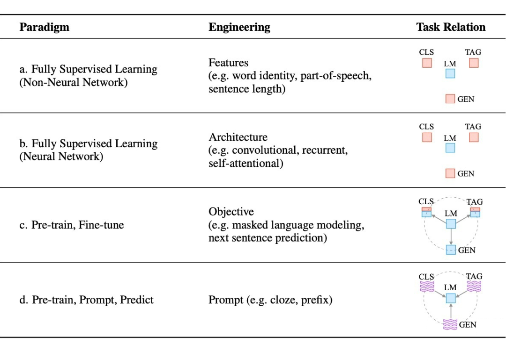
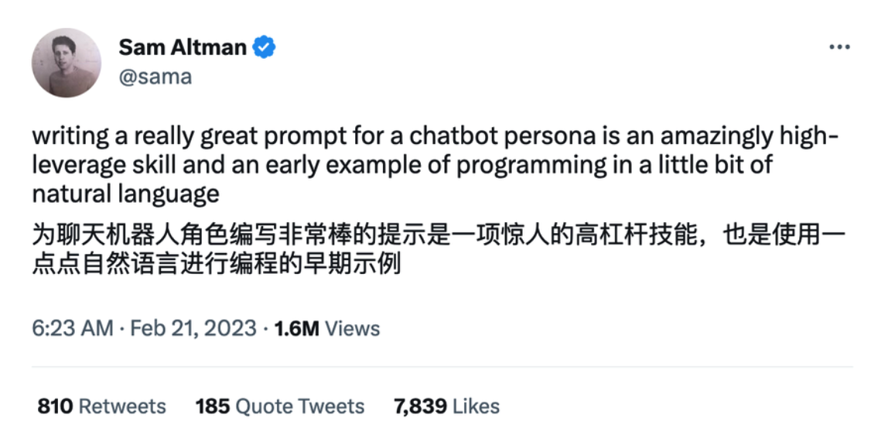

prompt-engineer


### 背景



目前学术界一般将 NLP 任务的发展分为四个阶段即 NLP 四范式：

1. 第一范式：基于传统机器学习模型的范式，如 tf-idf 特征 + 朴素贝叶斯等机器算法；

2. 第二范式：基于深度学习模型的范式，如 word2vec 特征 + LSTM 等深度学习算法，相比于第一范式，模型准确有所提高，特征工程的工作也有所减少；

3. 第三范式：基于预训练模型 + finetuning 的范式，如 BERT + finetuning 的 NLP 任务，相比于第二范式，模型准确度显著提高，但是模型也随之变得更大，但小数据集就可训练出好模型；

4. 第四范式：基于预训练模型 + Prompt + 预测的范式，如 BERT + Prompt 的范式相比于第三范式，模型训练所需的训练数据显著减少。

在整个 NLP 领域，你会发现整个发展是朝着精度更高、少监督，甚至无监督的方向发展的，而 Prompt Learning 是目前学术界向这个方向进军最新也是最火的研究成果。


### 为什么需要提示工程（prompt engineering）

现在的预训练模型参数量越来越大，为了一个特定的任务去 finetuning 一个模型，然后部署于线上业务，也会造成部署资源的极大浪费。

另外，目前的 AI 产品还比较早期，因为各种原因，产品设置了很多限制，如果你想要绕过一些限制，或者更好地发挥 AI 的能力，也需要用到 Prompt Engineering 技术。

所以，总的来说，Prompt Engineering 是一种重要的 AI 技术：

- 如果你是 AI 产品用户，可以通过这个技术，充分发挥 AI 产品的能力，获得更好的体验，从而提高工作效率。
- 如果你是产品设计师，或者研发人员，你可以通过它来设计和改进 AI 系统的提示，从而提高 AI 系统的性能和准确性，为用户带来更好的 AI 体验。


### 什么是提示工程（prompt engineering）

首先我们应该有的共识是：预训练模型中存在大量知识；预训练模型本身具有少样本学习能力。GPT-3 提出的 In-Context Learning，也有效证明了在 Zero-shot、Few-shot 场景下，模型不需要任何参数，就能达到不错的效果，特别是近期很火的 GPT3.5 系列中的 ChatGPT。

Prompt Engineering 是一种人工智能（AI）技术，它通过设计和改进 AI 的 prompt 来提高 AI 的表现。Prompt Engineering 的目标是创建高度有效和可控的 AI 系统，使其能够准确、可靠地执行特定任务。


### 提示工程的本质

本质上就是设计一个比较契合上游预训练任务的模板，通过模板的设计挖掘出上游预训练模型的潜力，让上游的预训练模型在尽量不需要标注数据的情况下比较好的完成下游的任务，关键包括 3 个步骤：

1. 设计预训练语言模型的任务
2. 设计输入模板样式（Prompt Engineering）
3. 设计 label 样式及模型的输出映射到 label 的方式（Answer Engineering）

### 要不要学提示工程

现在 AI 的发展还比较早期，了解和学习 PE 价值相对比较大，但长远来看可能会被淘汰。这个「长远」可能是 3 年，亦或者 1 年。



### 最重要的前提

LLM 对你一无所知！！！

LLM 对你一无所知！！！

LLM 对你一无所知！！！

LLM 对公开的数据自带上下文

LLM 对私有领域数据一无所知

### 提示工程的类型

* 零样本提示（zero shot prompt ）
* 少样本提示（few shot prompt）
* 思维链（chain-of-thought）

### 提示组成

**指令**：想要模型执行的特定任务或指令。比如总结，翻译，排序，分类等等。

**上下文**：包含外部信息或额外的上下文信息，引导语言模型更好地响应。

1. 角色扮演：包括AI扮演的角色，答案面向的角色。假设你是一个翻译家。解释下黑洞，让小学生也可以听懂
2. 强化具体身份：假设你是一个20年工作的翻译专家，拥有多个博士学位。
3. 准确的上下文信息：结构化表达
4. 答案模板：可能知道和不知道的问题和答案

**输入数据**：用户输入的内容或问题。

1. 简洁、精确
2. 删除无用信息和修饰词
3. 抽象转化

**输出指示**：指定输出的类型或格式。

1. 长度范围
2. 风格：搞笑的，轻松的，正式的，口语的，适合口播的，学术的，书面的等等。更多问gpt
3. 格式：对 json 和 markdown 格式支持最好

### 提示工程框架

CRISPE Prompt Framework，CRISPE是首字母的缩写，分别代表以下含义：

**CR：Capacity and Role（能力与角色）。你希望** **ChatGPT** **扮演怎样的角色。**

**I：Insight（洞察），背景信息和上下文。**

**S：Statement（陈述），你希望** **ChatGPT** **做什么。**

**P：Personality（个性），你希望** **ChatGPT** **以什么风格或方式回答你。**

**E：Experiment（实验），要求** **ChatGPT** **为你提供多个答案。**

| Step              | Example                                                      |
| ----------------- | ------------------------------------------------------------ |
| Capacity and Role | Act as an expert on software development on the topic of machine learning frameworks, and an expert blog writer.<br/>把你想象成机器学习框架主题的软件开发专家，以及专业博客作者。 |
| Insight           | The audience for this blog is technical professionals who are interested in learning about the latest advancements in machine learning.<br/>这个博客的读者主要是有兴趣了解机器学习最新进展技术的专业人士。 |
| Statement         | Provide a comprehensive overview of the most popular machine learning frameworks, including their strengths and weaknesses. Include real-life examples and case studies to illustrate how these frameworks have been successfully used in various industries.<br/>提供最流行的机器学习框架的全面概述，包括它们的优点和缺点。包括现实生活中的例子，和研究案例，以说明这些框架如何在各个行业中成功地被使用。 |
| Personality       | When responding, use a mix of the writing styles of Andrej Karpathy, Francois Chollet, Jeremy Howard, and Yann LeCun.<br/>在回应时，混合使用 Andrej Karpathy、Francois Chollet、Jeremy Howard 和 Yann LeCun 的写作风格。 |
| Experiment        | Give me multiple different examples.<br/>给我多个不同的例子。 |

### 模型

不同任务使用不同模型

1. **代码生成：code-davinci-002**
2. **文本生成：text-davinci-003**

### 润色

1. 提升文章的独特性：Rewrite the existing document to make it more imaginative, engaging, and unique.
2. 将文档转为引人入胜的故事：Transform the existing document into a compelling story that highlights the challenges faced and the solutions provided.
3. 提升文档说服力：Refine the existing document by incorporating persuasive language and techniques to make it more convincing and impactful.
4. 提升文档的吸引力：Add emotional language and sensory details to the existing document to make it more relatable and engaging.
5. 使内容更加简洁：Refine the existing document by removing unnecessary information and making it more concise and to-the-point.
6. 强调急迫感：Refine the existing document by adding a sense of urgency and emphasizing the need for immediate action.
7. 突出重点：Emphasize important information using bold or italic text.
8. 让模型使用类比或比喻的方法解释复杂问题：Explain complex ideas using analogies or comparisons.
9. 添加现实中的例子：Include case studies or real-world examples to make concepts more relatable.

### 要点

1、上下文的长度是有限制的

gpt3.5 是4096，GPT4分为 GPT-8K 和 GPT-32k，大多数模型为2k左右

2、指令和上下文分开

```
比如
总结下面一段文字 文字: """ 这里输入文字 """
```

3、不要说“不要xxx”，而是说“要xxx”

4、对于公共的知识只需要描述名称，对于私有领域，需要交代详细背景。不确定，找GPT确认

5、用英文提问，最后加上 respond in chinese（建议）

6、复杂问题，可以通过在结尾增加“让我们一步步思考（Let's think step by step）" 或者 “在解决问题之前我们必须回答哪些子问题？”


### 示例

Meta-Review 是一个期刊编辑综合不同审稿人意见给出初步评审的过程，这样一个阅读+综合+文本生成的任务很适合大模型的能力特点，假设当下收到三位审稿人的评论分别是R1，R2，R3。在测试大模型的综合能力时，如果不指定系统角色，只进行单轮对话以指定式构建 Prompt，不同级别的 Prompt 如下：

```
Level 0：<R1，R2，R3>；
Level 1：通过总结以下评论，编写一个 Meta-Review：<R1，R2，R3>；
Level 2：通过总结以下评论，编写一个 Meta-Review，要求最终的输出应该强调文章的核心贡献、不同审稿人提到的共同优势/缺点、改进建议以及需要补充的参考文献。评论文本如下：<R1，R2，R3>；
Level 3：通过回答以下问题编写一个 Meta-Review：（1）根据审稿人的评论，该论文的核心贡献是什么？（2）不同审稿人所提到的共同优势有哪些？（3）不同审稿人所强调的共同缺点是什么？（4）审稿人提供什么建议来改进这篇论文？（5）审稿人提到的缺少的参考文献是什么？评论文本如下：<R1，R2，R3>；
Level 4：Level 3+请详细解释作出这些选择的原因；
Level 5：Level 4+请保证表达流畅，并重点强调不同审稿人所提到的共同优势/缺点有哪些，长度不超过400个单词，并且只输出中文（英文）。
```

Narrative Braiding 也称做多角度叙事，是一种并行讲述多条故事线并要求最终可以汇聚成一体的文学技巧（例如低俗小说中的四个桥段），Narrative Braiding 经常被用于如小说、电影、电视剧的创作之中，这项任务的难点在于既要保证每条故事线充分合理的发展，又要使得不同的故事线可以交叉汇聚到一起，这点对大模型来说也非常有挑战。仍然假定不指定系统角色，只进行单轮对话以指定式表达构建 Prompt，假设当下两条故事线描述分别为<N1，N2>：

```
Level 0：<N1，N2>；
Level 1：根据以下备选的故事描述组合编制一个连贯的故事：<N1, N2>；
Level 2：根据以下备选的故事描述组合编制一个连贯的故事，要求最终的输出应强调两个故事描述中提供的共同信息、每个故事描述中提供的有趣独特的信息以及这些叙述中传达的冲突信息。备选故事描述如下：<N1, N2>；
Level 3：通过执行以下任务，根据以下备选的故事描述组合编制一个连贯的故事：（1）从两个描述中提取重叠子句对并改写；（2）从每个描述中提取独特的子句并确定其中有趣的段落；（3）提取两个描述中传达的冲突子句对并解决冲突；（4）从重叠-独特-冲突子句中生成段落并将它们合并为单个故事；（5）重新排列合并文档中的句子，编制成详细的连贯故事；（6）将详细故事总结成简洁的 Narrative Braiding。备选故事描述如下：<N1, N2>；
Level 4：Level 3+请详细解释做出的这些响应是如何包含某些信息并且忽略其他信息的；
Level 5：Level 4+请保证表达流畅连贯，并突出两个叙述中提供的重叠-独特-冲突信息，长度不超过1000个单词，并且只输出中文（英文）。
```

工作描述

```
Level 0: Given the job description separated by <>, extract useful information.\n"
    prompt <{job_description}>
Level 1: Given the job description separated by <>, extract useful information. Output job title, company, key skills, and summarized job description.\n"
    prompt <{job_description}>
Level 2: Given the job description separated by <>, extract useful information. Output job title, company, key skills as a list separated by commas, " \
             "and summarized job description (use at least 30 words and focus on day-to-day responsibilities).\n"
    <{job_description}>
Level 3: Given the job description separated by <>, extract useful information. 
                Format your response as JSON with the following structure:
                {
                    "job_title": Job title,
                    "company": Company,
                    "key_skills": ["list", "of", "key", "skills"],
                    "job_description": Job summary
                }
                For job summary use at least 30 words and focus on day-to-day responsibilities.
                """)
    <{job_description}>
Level 4： Given the job description separated by <>, extract useful information. 
                Format your response as JSON with the following structure:
                {
                    "job_title": Job title,
                    "company": Company,
                    "key_skills": ["list", "of", "key", "skills"],
                    "job_description_summary": Job description summary,
                    "job_responsibilities_summary": Job responsibilities summary
                }
                To effectively complete the summarization, follow these steps:
                - First, summarize the whole job description and write it as value for "job_description" key
                - Then, summarize the job description summary with a focus on day-to-day responsibilities
                
                For example:
                
                '
                KUBRA is in growth mode and currently seeking a Machine Learning Engineer to join our Data Analytics Team!
                
                As a Machine Learning Engineer, you will be working on designing and maintaining the Machine Learning algorithms that will be used to extract value out of our data. The best part? You will also be collaborating with BI Analysts, and Data Engineers to introduce new data on machine learning standards and best practices with KUBRA!
                
                What will you be involved in?
                
                - Introduce machine learning standards and best practices to KUBRA.
                - Build scalable machine learning architecture and automate machine learning operations.
                - Offer data-driven insights that provide value to both internal and external customers.
                - Foster an environment that emphasizes trust, open communication, creative thinking, and cohesive team effort.
                - Build and maintain machine learning solutions in production.
                - The initial models may be against data in our on-premise infrastructure. As the data engineers migrate more of our data to AWS, the ML model will be against data in AWS.
                
                What type of person are you?
                
                - Excellent written and verbal communication skills and an ability to maintain a high degree of professionalism in all client communications.
                - Ability to influence others, build relationships, manage conflicts, and handle negotiations.
                - Excellent organization, time management, problem-solving, and analytical skills.
                - Proactive mindset and ability to work independently in a fast-paced environment focused on results.
                - Ability to handle pressure.
                
                What skills do you bring? (Hard Skills)
                
                - Minimum of 2 to 3 years of experience building machine learning pipelines.
                - An undergraduate or masters degree in Computer Science, Statistics, Analytics, or a similar discipline
                - Sound knowledge of machine learning lifecycle from data gathering to model deployment.
                - Experience deploying machine learning models into a production environment.
                - Demonstrable experience with regression, clustering, and classification algorithms.
                - Preferable to have experience with one or more of Data tools, Databricks, Snowflake, SQL, R, Python, Spark.
                - Knowledge in one of AzureML or AWS Sagemaker desirable.
                - Experience in CI/CD and good understanding of containerization concepts.
                - Experience in building API’s for Model Serving is an asset.
                
                What you can expect from us?
                
                - Award-winning culture that fosters growth, diversity and inclusion for all
                - Paid day off for your birthday
                - Access to LinkedIn learning courses
                - Continued education with our education reimbursement program
                - Flexible schedules
                - Two paid days for volunteer opportunities
                - Well-Being Days!
                '
                ->
                '
                {
                    "job_title": "Machine Learning Engineer",
                    "company": "KUBRA",
                    "key_skills": ["Databricks", "Snowflake", "SQL", "R", "Python", "Spark", "AzureML", "AWS"],
                    "job_description_summary": "KUBRA is seeking a Machine Learning Engineer to join their Data Analytics Team. The role involves designing and maintaining machine learning algorithms to extract value from data. Collaboration with BI Analysts and Data Engineers is required to introduce new data and best practices. The engineer will build scalable machine learning architecture, automate machine learning operations, offer data-driven insights, and ensure trust, open communication, and a cohesive team effort.",
                    "job_responsibilities_summary": "- Working on designing and maintaining the Machine Learning algorithms;\n - Collaborating with BI Analysts, and Data Engineers to introduce new data on machine learning standards and best practices"
                }
                '
                """)
    <{job_description}>
```

### 个人学习助手

1. 特性（Features）：AI导师具有一系列个性化特性，包括内容深度（从1级到10级，分别对应不同的学习阶段，如小学、中学、大学预备、本科、研究生等），学习风格（包括感知、视觉、归纳、主动、顺序、直觉、口头、演绎、反思、全球等），沟通风格（包括随机、正式、教科书、外行、讲故事、苏格拉底、幽默等），语气风格（包括辩论、鼓励、中立、信息、友好等），推理框架（包括演绎、归纳、假设、类比、因果等）。
2. 命令（Commands）：AI导师支持一系列以"/"为前缀的命令，如测试学生、引导用户进行配置过程、创建基于学生偏好的课程计划、搜索学生指定的内容、开始课程计划、继续上次的内容、执行自我评估、更改语言、使用插件进行内容可视化等。
3. 规则（Rules）：AI导师需要遵循一系列规则，如遵循学生指定的学习风格、沟通风格、语气风格、推理框架和深度，能够根据学生的偏好创建课程计划，果断地引导学生的学习，始终清楚下一步的内容，始终考虑到配置，因为它代表了学生的偏好，允许在特定课程中调整配置以强调特定元素，并告知学生更改等。
4. 格式（Formats）：这些是AI导师应严格遵循的特定格式，包括配置、配置提醒、自我评估、计划、课程、测试等。
5. 初始化（Init）：作为AI导师，需要以问候、版本、作者、执行配置格式、询问学生的偏好、提及/language命令等方式进行初始化。

第一个好处是模块化，增加或减少功能都以模块的方式，非常方便，易于管理。

第二个好处是减少了用户提问题的心智负担，Prompt 的交互有闭环性，操作是很无脑的，大多数情况不需要考虑怎样提问题。

第三个好处是斜杠命令的设计，使用户在正常对话的时候，还能抽离出来，调用一些常用功能。


### 范例

1、GPT4

2、个人助手

3、翻译助手

https://ai.newzone.top/


### 代码

1、写代码

2、写注释

3、重新格式化代码

4、调试

5、优化代码

6、不同语言之间翻译

7、重构

8、写数据库脚本

9、模拟器：数据库，web server，命令行


https://medium.com/better-programming/10-tips-for-improving-your-coding-with-chatgpt-3e589de3aff3

### 构建自己的应用


## 参考

* https://www.promptingguide.ai/zh
* https://github.com/JushBJJ/Mr.-Ranedeer-AI-Tutor
* https://arxiv.org/pdf/2305.11430.pdf


好玩的项目

https://flowgpt.com/

chatgpt-github-app

poe.com 如果不想花钱，可以用这个国外的代理，chagpt免费使用

cosoh.com

flowus

promptperfect.jina.ai

gpt代理平台：

https://github.com/xx025/carrot

gpt 应用链接

https://cosoh.com/


TODO

https://github.com/xinsblog/try-llama-index

https://zhuanlan.zhihu.com/p/611079204

https://promptperfect.jina.ai/

https://docs.google.com/document/u/0/d/1h-GTjNDDKPKU_Rsd0t1lXCAnHltaXTAzQ8K2HRhQf9U/mobilebasic

https://help.openai.com/en/articles/6654000-best-practices-for-prompt-engineering-with-openai-api

https://github.com/howl-anderson/unlocking-the-power-of-llms

https://www.perplexity.ai/

https://www.clickprompt.org/zh-CN/

https://huggingface.co/

https://datalearner.notion.site/datalearner/500-Best-ChatGPT-Prompts-843a319bec1a40bc9fb131ae88304bf3

https://github.com/GaiZhenbiao/ChuanhuChatGPT

https://github.com/rockbenben/ChatGPT-Shortcut

https://ai.newzone.top/?tags=code

https://newzone.top/posts/2023-02-27-chatgpt_shortcuts.html

https://ide.trydyno.com/onboard

https://nav.newzone.top/

使用方法论


### 工具

免费


收费

https://www.jasper.ai/

https://www.copy.ai/


### 参考

提示工程教程

* https://www.promptingguide.ai/zh
* https://github.com/thinkingjimmy/Learning-Prompt
* https://github.com/dair-ai/Prompt-Engineering-Guide
* https://github.com/trigaten/Learn_Prompting
* https://github.com/f/awesome-chatgpt-prompts
* https://help.openai.com/en/articles/6654000-best-practices-for-prompt-engineering-with-openai-api
* 深入浅出Prompt Learning要旨及常用方法
* https://www.youtube.com/watch?v=dOxUroR57xs
* https://platform.openai.com/docs/introduction
* https://github.com/acheong08/ChatGPT
* https://github.com/PlexPt/awesome-chatgpt-prompts-zh
* learnprompting.org/zh-Hans/docs/intro
* learningprompt.wiki/docs
* github.com/yzfly/awesome-chatgpt-zh
* github.com/yzfly/wonderful-prompts
* prompt-patterns.phodal.com/
* https://learn.microsoft.com/en-us/azure/cognitive-services/openai/concepts/advanced-prompt-engineering?pivots=programming-language-chat-completions#specifying-the-output-structure


在线体验

* https://poe.com/ChatGPT

* https://www.clickprompt.orgs

* http://pretrain.nlpedia.ai/

  ​		

提示交流

* https://flowgpt.com/
* https://www.aishort.top/
* https://www.explainthis.io/zh-hans/chatgpt
* github.com/PlexPt/awesome-chatgpt-prompts-zh
* github.com/f/awesome-chatgpt-prompts/
* https://hero.page/ai-prompts
* huggingface.co/spaces/merve/ChatGPT-prompt-generator
* https://prompt.noonshot.com/


AI 工具聚合网站

* https://www.chinaz.com/
* https://trydyno.com/
* 

模型 hub  

* https://huggingface.co/


第三方扩展

* langchain
* llmindex


论文

* https://arxiv.org/abs/2005.14165
* https://zhuanlan.zhihu.com/p/615197354

* https://arxiv.org/abs/2202.12837

* https://arxiv.org/pdf/2109.01652.pdf

* RLHF https://arxiv.org/abs/1706.03741

* https://arxiv.org/abs/2205.11916

* https://arxiv.org/abs/2205.11916

* https://arxiv.org/pdf/2203.11171.pdf

* https://arxiv.org/pdf/2110.08387.pdf

* https://arxiv.org/abs/2211.01910
* https://arxiv.org/abs/2205.11916

* https://arxiv.org/abs/2010.15980
* https://arxiv.org/abs/2101.00190
* https://arxiv.org/abs/2104.08691
* https://arxiv.org/abs/2211.01910
* https://arxiv.org/abs/2302.11520
* https://arxiv.org/abs/2210.03629 
* https://arxiv.org/abs/2302.00923

* https://arxiv.org/abs/2302.08043

* https://zhuanlan.zhihu.com/p/597586623

* https://zhuanlan.zhihu.com/p/617193230

* https://zhuanlan.zhihu.com/p/615198869

* https://www.futurepedia.io/  
* 