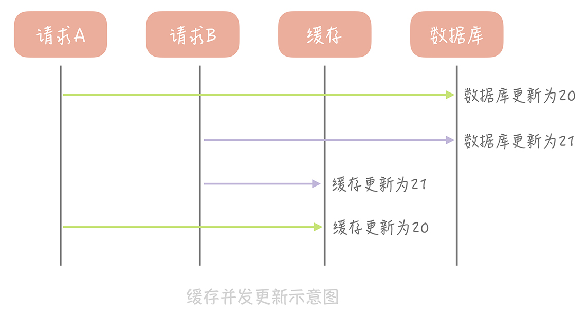

1、容量有限：2-8 原理

2、速度快：比磁盘介质访问速度快


## 缓存分类

静态缓存

分布式缓存

热点本地缓存


### 缺点

首先，缓存比较适合于读多写少的业务场景，并且数据最好带有一定的热点属性。

其次，缓存会给整体系统带来复杂度，并且会有数据不一致的风险。

再次，之前提到缓存通常使用内存作为存储介质，但是内存并不是无限的。

最后，缓存会给运维也带来一定的成本


要点：

1. 监控缓存命中率


## 池化技术

数据连接池

线程池

对象池

内存管理对象池


## 本地缓存

Guava

Ehcache

Caffine


## 分布式缓存


### 读写策略

1、缓存命中

2、缓存缺失

3、缓存更新


缓存不一致的情况

主要原因

1. 不是原子操作
2. 不支持事务

写操作可能组合

1. 写数据库、写缓存
2. 删缓存、写数据库 
3. 写数据库、删缓存 
4. 写缓存、写数据库 


情况一、先写数据库、再写缓存



由于在调用方没有加锁，并发更新导致数据不一致。

对于新建数据，用此方法是 OK 的。


情况二、删除缓存、写数据库


情况三、写数据库、删除缓存


此外

1、 删除缓存和删除数据库不能同时成功，比如写数据库成功了，删缓存失败了，怎么办？

2、


#### Cache Aside


写数据

1. 更新（或删除）数据库中的记录；

2. 删除缓存记录

读数据；

2. 如果缓存不命中，则从数据库中查询数据；
3. 查询到数据后，将数据写入到缓存中，并且返回给用户。
3. 如果缓存命中，则直接返回数据；


Cache Aside 存在的最大的问题是当写入比较频繁时，缓存中的数据会被频繁地清理，这样会对缓存的命中率有一些影响。解决办法

1. 一种做法是在更新数据时也更新缓存，只是在更新缓存前先加一个分布式锁，因为这样在同一时间只允许一个线程更新缓存，就不会产生并发问题了。当然这么做对于写入的性能会有一些影响；
2. 另一种做法同样也是在更新数据时更新缓存，只是给缓存加一个较短的过期时间，这样即使出现缓存不一致的情况，缓存的数据也会很快过期，对业务的影响也是可以接受。


特点：可靠性高


#### Read/Write Through

原理

Write Through 的策略是这样的：先查询要写入的数据在缓存中是否已经存在，如果已经存在，则更新缓存中的数据，并且由缓存组件同步更新到数据库中，如果缓存中数据不存在，我们把这种情况叫做“Write Miss（写失效）”。

一般来说，我们可以选择两种“Write Miss”方式：一个是“Write Allocate（按写分配）”，做法是写入缓存相应位置，再由缓存组件同步更新到数据库中；另一个是“No-write allocate（不按写分配）”，做法是不写入缓存中，而是直接更新到数据库中。

在 Write Through 策略中，我们一般选择“No-write allocate”方式，原因是无论采用哪种“Write Miss”方式，我们都需要同步将数据更新到数据库中，而“No-write allocate”方式相比“Write Allocate”还减少了一次缓存的写入，能够提升写入的性能。


Read Through 策略就简单一些，它的步骤是这样的：先查询缓存中数据是否存在，如果存在则直接返回，如果不存在，则由缓存组件负责从数据库中同步加载数据。


Read Through/Write Through 策略的特点是由缓存节点而非用户来和数据库打交道，在我们开发过程中相比 Cache Aside 策略要少见一些，原因是我们经常使用的分布式缓存组件，无论是 Memcached 还是 Redis 都不提供写入数据库，或者自动加载数据库中的数据的功能。而我们在使用本地缓存的时候可以考虑使用这种策略，

我们看到 Write Through 策略中写数据库是同步的，这对于性能来说会有比较大的影响，因为相比于写缓存，同步写数据库的延迟就要高很多了。那么我们可否异步地更新数据库？这就是我们接下来要提到的“Write Back”策略。


特点：性能高


场景

比较适合你在实现本地缓存组件的时候使用；


#### Write Back（写回）策略

这个策略的核心思想是在写入数据时只写入缓存，并且把缓存块儿标记为“脏”的。而脏块儿只有被再次使用时才会将其中的数据写入到后端存储中。需要注意的是，在“Write Miss”的情况下，我们采用的是“Write Allocate”的方式，也就是在写入后端存储的同时要写入缓存，这样我们在之后的写请求中都只需要更新缓存即可，而无需更新后端存储了，

 write back策略的完整读策略是这样的：如果缓存命中，则直接返回；如果缓存不命中，则重新找一个缓存块儿，如果这个缓存块儿是脏的，那么写入后端存储，并且把后端存储中的数据加载到缓存中；如果不是脏的，那么就把后端存储中的数据加载到缓存，然后标记缓存非脏。

我将 Write back 策略的示意图放在了下面：


缺点：因为缓存一般使用内存，而内存是非持久化的，所以一旦缓存机器掉电，就会造成原本缓存中的脏块儿数据丢失。所以你会发现系统在掉电之后，之前写入的文件会有部分丢失。

使用场景：你在向低速设备写入数据的时候，可以在内存里先暂存一段时间的数据，甚至做一些统计汇总，然后定时地刷新到低速设备上。比如说，你在统计你的接口响应时间的时候，需要将每次请求的响应时间打印到日志中，然后监控系统收集日志后再做统计。但是如果每次请求都打印日志无疑会增加磁盘 I/O，那么不如把一段时间的响应时间暂存起来，经过简单的统计平均耗时，每个耗时区间的请求数量等等，然后定时地，批量地打印到日志中。

备注：还要一种是在缓存过期的时候写入数据库。


读模式


读写模式

同步模式

异步模式


## 缓存穿透

缓存穿透是指查询一个一定不存在的数据，因为缓存中也无该数据的信息，则会直接去数据库层进行查询，从系统层面来看像是穿透了缓存层直接达到db，从而称为缓存穿透，没有了缓存层的保护，这种查询一定不存在的数据对系统来说可能是一种危险，如果有人恶意用这种一定不存在的数据来频繁请求系统，不，准确的说是攻击系统，请求都会到达数据库层导致db瘫痪从而引起系统故障。

一般来说，我们的核心缓存的命中率要保持在 99% 以上，非核心缓存的命中率也要尽量保证在 90%，如果低于这个标准你可能就需要优化缓存的使用方式了。

### 原因

1. 空值
2. 更新数据库前，删除了缓存

### 解决办法

### 空值缓存

一种比较简单的解决办法，在第一次查询完不存在的数据后，将该key与对应的空值也放入缓存中，只不过设定为较短的失效时间，例如几分钟，这样则可以应对短时间的大量的该key攻击，设置为较短的失效时间是因为该值可能业务无关，存在意义不大，且该次的查询也未必是攻击者发起，没有久存储的必要，故可以早点失效。

```java
Object nullValue = new Object();
try {
  Object valueFromDB = getFromDB(uid); //从数据库中查询数据
  if (valueFromDB == null) {
    cache.set(uid, nullValue, 10);   //如果从数据库中查询到空值，就把空值写入缓存，设置较短的超时时间
  } else {
    cache.set(uid, valueFromDB, 1000);
  }
} catch(Exception e) {
  cache.set(uid, nullValue, 10);
}
```


空值缓存的问题及解决办法

第一，空值做了缓存，意味着缓存层中存了更多的键，需要更多的内存空间 ( 如果是攻击，问题更严重 )，比较有效的方法是针对这类数据设置一个较短的过期时间，让其自动剔除。 如果恶意攻击者不停的换不存在的 key，那你的缓存里面一段时间会有**非常多的key**，内存的消耗也是非常可观的。甚至会导致你的缓存进行换出操作，把一些正常的数据换出。针对这种情况，如果 key 的可能性非常多就用 Bloom Filter。

第二，缓存层和存储层的数据会有一段时间窗口的不一致，可能会对业务有一定影响。例如过期时间设置为 5 分钟，如果此时存储层添加了这个数据，那此段时间就会出现缓存层和存储层数据的不一致，此时可以利用消息系统或者其他方式清除掉缓存层中的空对象。


### bloom filter

1970 年布隆提出了一种布隆过滤器的算法，用来判断一个元素是否在一个集合中。这种算法由一个二进制数组和一个 Hash 算法组成。它的基本思路如下：

我们把集合中的每一个值按照提供的 Hash 算法算出对应的 Hash 值，然后将 Hash 值对数组长度取模后得到需要计入数组的索引值，并且将数组这个位置的值从 0 改成 1。在判断一个元素是否存在于这个集合中时，你只需要将这个元素按照相同的算法计算出索引值，如果这个位置的值为 1 就认为这个元素在集合中，否则则认为不在集合中。

下图是布隆过滤器示意图，我来带你分析一下图内的信息。


当业务系统有查询请求的时候，首先去 BloomFilter 中查询该 key 是否存在。若不存在，则说明数据库中也不存在该数据，因此缓存都不要查了，直接返回null。若存在，则继续执行后续的流程，先前往缓存中查询，缓存中没有的话再前往数据库中的查询。guava中有实现BloomFilter算法


布隆过滤器拥有极高的性能，无论是写入操作还是读取操作，时间复杂度都是 O(1) 是常量值。在空间上，相对于其他数据结构它也有很大的优势，比如，20 亿的数组需要 2000000000/8/1024/1024 = 238M 的空间，而如果使用数组来存储，假设每个用户 ID 占用 4 个字节的空间，那么存储 20 亿用户需要 2000000000 * 4 / 1024 / 1024 = 7600M 的空间，是布隆过滤器的 32 倍。


#### 要点

bloom filter 用一个单独的服务来部署。服务启动时需要初始化数据，将数据库中数据初始化到过滤器中。后续将布隆过滤器定期写到磁盘中，防止服务重启导致丢失。

#### 缺陷及解决方案

所有的缺陷来自于 hash 碰撞

1. 在判断元素是否在集合中时有一定的出错几率
   解决方案：使用多个Hash算法计算出多个hash值，只有多个hash值对应的数组中的值都为1时，才认为元素在储存中
2. 不支持删除元素
   解决方案：数组中不再只是0和1，而是一个计数，比如如果元素A和B同时命中了一个数组索引，那么这个位置的值就为2，但这种方式会增加空间的消耗

#### 场景

只有在存在海量查询数据库中，不存在数据的请求时才会使用，在使用时也要关注布隆过滤器对内存空间的消耗；

1. 缓存穿透

2. 一些资讯app的新闻展示中，给用户推送新的资讯用来过滤掉那些用户已经浏览过的记录


key 的重复率低的情况下使用 Bloom Filter，key 的重复率比较高的情况下，使用空置缓存


### 狗桩效应

当有一个极热点的缓存项，它一旦失效会有大量请求穿透到数据库，这会对数据库造成瞬时极大的压力，是缓存穿透的极端情况。

极热点数据的缓存，可以启动线程去监控key的过期时间，在快要过期之前重新加载数据。无需等待缓存过期失效了再去被动加载

1. 在代码中控制在某一个热点缓存项失效之后启动一个后台线程，穿透到数据库，将数据加载到缓存中，在缓存未加载之前，所有访问这个缓存的请求都不再穿透而直接返回。
2. 在代码中控制在某一个热点缓存项失效之前启动一个后台线程，穿透到数据库，将数据加载到缓存中，在缓存未加载之前，所有访问这个缓存的请求都不再穿透而直接返回。
3. 通过在 Memcached 或者 Redis 中设置分布式锁，只有获取到锁的请求才能够穿透到数据库。

## 缓存雪崩

在普通的缓存系统中一般例如 redis、memcache 等中，我们会给缓存设置一个失效时间，但是如果所有的缓存的失效时间相同，那么在同一时间失效时或者缓存系统未知原因宕机，所有系统的请求都会发送到数据库层，db可能无法承受如此大的压力导致系统崩溃。

解决办法：

分布式缓存：缓存系统的高可用，如 Redis Sentinel 和 Redis Cluster。

线程互斥：只让一个线程构建缓存，其他线程等待构建缓存的线程执行完，重新从缓存获取数据才可以，每个时刻只有一个线程在执行请求，减轻了db的压力，但缺点也很明显，降低了系统的qps。

交错失效时间：这种方法时间比较简单粗暴，既然在同一时间失效会造成请求过多雪崩，那我们错开不同的失效时间即可从一定长度上避免这种问题，在缓存进行失效时间设置的时候，从某个适当的值域中随机一个时间作为失效时间即可。

Hystrix：熔断、降级、限流


## 缓存击穿

在热点的缓存到达失效时间时，此时可能依然会有大量的请求到达系统，没有了缓存层的保护，这些请求同样的会到达db从而可能引起故障。

击穿与雪崩的区别即在于击穿是对于特定的热点数据来说，而雪崩是全部数据。


当第一个数据库查询请求发起后，就将缓存中该数据上锁；此时到达缓存的其他查询请求将无法查询该字段，从而被阻塞等待；当第一个请求完成数据库查询，并将数据更新值缓存后，释放锁；此时其他被阻塞的查询请求将可以直接从缓存中查到该数据。

当某一个热点数据失效后，只有第一个数据库查询请求发往数据库，其余所有的查询请求均被阻塞，从而保护了数据库。但是，由于采用了互斥锁，其他请求将会阻塞等待，此时系统的吞吐量将会下降。这需要结合实际的业务考虑是否允许这么做。

互斥锁可以避免某一个热点数据失效导致数据库崩溃的问题，而在实际业务中，往往会存在一批热点数据同时失效的场景。那么，对于这种场景该如何防止数据库过载呢？

解决办法：

二级缓存：对于热点数据进行二级缓存，并对于不同级别的缓存设定不同的失效时间，则请求不会直接击穿缓存层到达数据库。

LRU算法：根据数据的历史访问记录来进行淘汰数据，其核心思想是“如果数据最近被访问过，那么将来被访问的几率也更高”。

LRU-K算法拥有更好的解决措施，LRU-K需要多维护一个队列或者更多，用于记录所有缓存数据被访问的历史。只有当数据的访问次数达到K次的时候，才将数据放入缓存。当需要淘汰数据时，LRU-K会淘汰第K次访问时间距当前时间最大的数据。

 互斥锁 (mutex key)：这种方案思路比较简单，但是存在一定的隐患，如果构建缓存过程出现问题或者时间较长，可能会存在死锁和线程池阻塞的风险，但是这种方法能够较好的降低后端存储负载并在一致性上做的比较好。单机使用锁，集群使用分布式锁。

实例

```java
@Repository
public class CacheTemplateService {
    
	@Autowired
	private JedisCluster jedisCluster;
	
	public <T> T query(String key, CacheLoader<T> cacheLoader, Integer seconds) {
		String json = jedisCluster.get(id);
        
        TypeReference<T> clazz = cacheLoader.rawType();
		if (json == null || "".equals(json) || "null".equals(json)) {
            Striped<Lock> striped = Striped.lazyWeakLock(1024);
            Lock lock = striped.get(key);
            try {
                lock.lock();
                if (json != null && "".equals(json) && "null".equalsIgnoreCase(json)) {
                    return JSON.parseObject(json, clazz);
                }
                T t = cacheLoader.load();
                jedisCluster.set(key, JSON.toJSONString(t));
                jedisCluster.expire(key, seconds != null ? seconds.intValue() : 60);
                return t;
            } finally {
                lock.unlock();
            }
		}
		return JSON.parseObject(json, clazz);	
    }
    
    public <T> T query(String key, CacheLoader<T> cacheLoader) {
        return query(key, cacheLoader, null);
    }
}

public abstract class CacheLoader<T> {

	public TypeReference<T> rawType() {
		return new TypeReference<T>() {
	};
       
    public abstract T load();

	}
}


public class UserManager {
    @Autowired
	private UserDao userDao;
	
    public User getUser(String id) {
        return CacheServiceTemplate.query(id, new ClassLoader<User>() {
                                       @Override
                                       public User load() {
                                           return UserDao.getUser(id);
                                       }
                                   });
    }
}

//https://stackoverflow.com/questions/11124539/how-to-acquire-a-lock-by-a-key
//https://stackoverflow.com/questions/5639870/simple-java-name-based-locks/28723518#28723518

```


” 永远不过期 “：这种方案由于没有设置真正的过期时间，实际上已经不存在热点 key 产生的一系列危害，但是会存在数据不一致的情况，同时代码复杂度会增大。

https://blog.csdn.net/haoxin963/article/details/83245113

https://juejin.im/post/5b604b9ef265da0f62639001?utm_source=gold_browser_extension


缓存容量控制


1. 缓存过期机制

* 固定时间
* 指数衰减
* 惰性删除与定期清理

1. 缓存雪崩

在缓存失效期间，大量数据直接访问数据库

解决办法:

2. 缓存穿透

缓存没有命中, 直接访问后端

默认情况下, 数据本身不存在的数据都会到后端, 但是如果数据在后端也不存在，那么该如何处理这种情况 ?

将没有数据的缓存用特定数据类型来保存，这样就避免了不存在的数据导致缓存穿透而遭受攻击。


4. 缓存预热


5. 多级缓存


6. 分布式缓存

7. 缓存置换

8. 

##参考

nginx
redis
memcache

https://tech.meituan.com/2017/03/17/cache-about.html

https://github.com/apache/ignite

https://en.wikipedia.org/wiki/Cache_(computing)#/media/File:Write-through_with_no-write-allocation.svg
https://en.wikipedia.org/wiki/Cache_(computing)#/media/File:Write-back_with_write-allocation.svg

### FAQ

1、在高并发情况下。那么可能会出现以下情况：主从同步的情况下，从库没来得及同步。大量的读请求返回的是从库的旧数据。而这个时候读的数据会被动写入缓存。如何解决？

如果更新频繁，可以加分布式锁，让单一线程可以更新这条数据；或者设置短的过期时间，让可能出现的不一致数据尽快过期


#### Redis只读缓存和使用直写策略的读写缓存，这两种缓存都会把数据同步写到后端数据库中，它们的区别在于：

1、使用只读缓存时，是先把修改写到后端数据库中，再把缓存中的数据删除。当下次访问这个数据时，会以后端数据库中的值为准，重新加载到缓存中。这样做的优点是，数据库和缓存可以保证完全一致，并且缓存中永远保留的是经常访问的热点数据。缺点是每次修改操作都会把缓存中的数据删除，之后访问时都会先触发一次缓存缺失，然后从后端数据库加载数据到缓存中，这个过程访问延迟会变大。

2、使用读写缓存时，是同时修改数据库和缓存中的值。这样做的优点是，被修改后的数据永远在缓存中存在，下次访问时，能够直接命中缓存，不用再从后端数据库中查询，这个过程拥有比较好的性能，比较适合先修改又立即访问的业务场景。但缺点是在高并发场景下，如果存在多个操作同时修改同一个值的情况，可能会导致缓存和数据库的不一致。

3、当使用只读缓存时，如果修改数据库失败了，那么缓存中的数据也不会被删除，此时数据库和缓存中的数据依旧保持一致。而使用读写缓存时，如果是先修改缓存，后修改数据库，如果缓存修改成功，而数据库修改失败了，那么此时数据库和缓存数据就不一致了。如果先修改数据库，再修改缓存，也会产生上面所说的并发场景下的不一致。

我个人总结，只读缓存是牺牲了一定的性能，优先保证数据库和缓存的一致性，它更适合对于一致性要求比较要高的业务场景。而如果对于数据库和缓存一致性要求不高，或者不存在并发修改同一个值的情况，那么使用读写缓存就比较合适，它可以保证更好的访问性能。