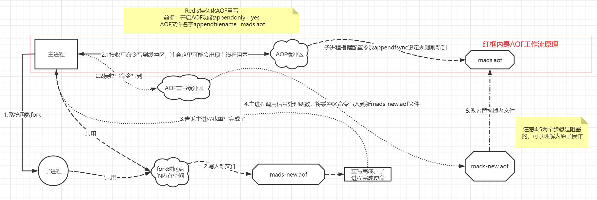

##AOF





### 为什么需要 AOF

redis 会宕机，redis 宕机之后，依靠后端数据重建缓存的缺点：

1、后端压力倍增，可能发生雪崩效应。

2、时间太长


### AOF 写入

实现原理

1、数据内容：AOF 保存的是执行过程中的命令。

2、数据格式是啥？简单编码的文本格式

2、保存时机：命令执行完之后

2、保存期间是否可以处理新的请求，如果可以，新数据如何处理？


结合上面继续深入，如果置的是每1秒同步一次数据，在线上大批量写请求下aof_buf有大量数据需要同步，此时       就会对磁盘进行高频写入，磁盘IO就变成了瓶颈，就会出现上次的同步动作还没完成，主进程又接收到大批写命令写到了缓冲区，此时redis为了保证aof文件安全性,会阻塞主线程，直到上次fsync同步完成。
主进程吧数据写入到aof_buf后会对比上次fsync操作时间，此时有两种情况：
1、如果距离上次fsync操作时间大于2S则阻塞主进程直到fsync结束
2、如果距上次操作时间小于2S则主进程直接返回
这里虽然我们配置的是每秒同步一次，但是实际上不是丢失1S的数据，实际上可能丢失2S数据，这里请细品

#### 回写会策略

1、always：同步写

2、everysec：每秒写

3、no：依赖操作系统


### AOF 加载


```c

FILE *fp = fopen(filename,"r");	
server.aof_state = AOF_OFF;
fakeClient = createFakeClient();
startLoading(fp);

if (fp.startWith("REDIS")) {
		fseek(fp,0,SEEK_SET);
} else {
		fseek(fp,0,SEEK_SET);
		rioInitWithFile(&rdb,fp);
		rdbLoadRio(&rdb,NULL,1);
}

while(1) {
		fgets(buf,sizeof(buf),fp)
		argc = atoi(buf+1);
		fakeClient->argc = argc;
		fakeClient->argv = argv;
		for (j = 0; j < argc; j++) {
				char *readres = fgets(buf,sizeof(buf),fp);
				len = strtol(buf+1,NULL,10);
				argsds = sdsnewlen(SDS_NOINIT,len);
				fread(argsds,len,1,fp)
				argv[j] = createObject(OBJ_STRING,argsds);
				fread(buf,2,1,fp)	
		}
		cmd = lookupCommand(argv[0]->ptr);
		fakeClient->cmd = cmd;
    if (fakeClient->flags & CLIENT_MULTI &&
         fakeClient->cmd->proc != execCommand)
    {
         queueMultiCommand(fakeClient);
    } else {
         cmd->proc(fakeClient);
    }
    
}
```


### AOF 重写

#### 原因，AOF存在大量的重复

1、添加新的记录时间越长

2、文件越大恢复时间增长


#### 过程

在子进程执行AOF重写期间。服务器进程需要执行以下3个动作：

1. 执行客户端命令
2. 执行后追加到AOF缓冲区
3. 执行后追加到AOF重写缓冲区

执行完上述3个操作后可以保证：

- AOF缓冲区内容会定期被写入和同步到AOF文件，对现有AOF文件处理正常进行
- 子进程开始，服务器执行的所有写命令都会进入AOF重写缓冲区

子进程完成AOF重写后，它向父进程发送一个信号，父进程收到信号后会调用一个信号处理函数，该函数把AOF重写缓冲区的命令追加到新AOF文件中然后替换掉现有AOF文件。父进程处理完毕后可以继续接受客户端命令调用，可以看出在AOF后台重写过程中只有这个信号处理函数会阻塞服务器进程。

| 时间 | 服务器进程（父进程）                                       | 子进程                        |
| :--- | :--------------------------------------------------------- | :---------------------------- |
| T1   | 执行命令 SET K1 V1                                         |                               |
| T2   | 执行命令 SET K1 V1                                         |                               |
| T3   | 执行命令 SET K1 V1                                         |                               |
| T4   | 创建子进程，执行AOF文件重写                                | 开始AOF重写                   |
| T5   | 执行命令 SET K2 V2                                         | 执行重写                      |
| T6   | 执行命令 SET K3 V3                                         | 执行重写                      |
| T7   | 执行命令 SET K4 V4                                         | 完成AOF重写，向父进程发送信号 |
| T8   | 接收到信号，将T5 T6 T7 服务器的写命令追加到新的AOF文件末尾 |                               |
| T9   | 用新的AOF替换旧的AOF                                       |                               |

T8 T9执行的任务会阻塞服务器处理命令。

PS:AOF重写并不需要对原有AOF文件进行任何的读取，写入，分析等操作。这个功能是通过读取服务器当前的数据库状态来实现的。

#### 时机

1、auto-aof-rewrite-min-size: 表示运行AOF重写时文件的最小大小，默认为64MB
2、auto-aof-rewrite-percentage: 这个值的计算方法是：当前AOF文件大小和上一次重写后AOF文件大小的差值，再除以上一次重写后AOF文件大小。也就是当前AOF文件比上一次重写后AOF文件的增量大小，和上一次重写后AOF文件大小的比值。

AOF文件大小同时超出上面这两个配置项时，会触发AOF重写。

#### 优点

由于命令执行过程中，对同一个 key 执行多次操作，会带来存储空间的浪费，因此，通过AOF 重写可以压缩 AOF 文件的大小，加快恢复速度。

#### 缺点

阻塞主线程：创建子进程会阻塞主进程

如何保证，重写过程中，新数据的处理


1、新的子进程：依赖创建子进程的 COW 机制。子进程与父进程共享内存表。

2、AOF重写缓冲保存重写过程中执行的操作


### 思考题

1、为什么先执行命令后写 AOF 日志

| 维度 | 先写日志后执行命令                                           | 先执行命令后写日志                 |
| ---- | ------------------------------------------------------------ | ---------------------------------- |
| 缺点 | 需要对日志校验，增加了消耗（因为很可能由于宕机，导致写了一半，导致恢复出错） | 丢失数据                           |
| 缺点 | 写日志是磁盘 IO 操作，可能会阻塞主线程。                     | 给下一个操作带来阻塞风险           |
| 优点 |                                                              | 命令执行完，才写日志，不需要校验。 |
| 优点 |                                                              | 不会阻塞当前写操作                 |


2、AOF 重写过程中潜在的阻塞点？

a、fork子进程，fork这个瞬间一定是会阻塞主线程的。fork子进程需要拷贝进程必要的数据结构，其中有一项就是拷贝内存页表（虚拟内存和物理内存的映射索引表），这个拷贝过程会消耗大量CPU资源，拷贝完成之前整个进程是会阻塞的，阻塞时间取决于整个实例的内存大小，实例越大，内存页表越大，fork阻塞时间越久。

b、fork出的子进程指向与父进程相同的内存地址空间，此时子进程就可以执行AOF重写，把内存中的所有数据写入到AOF文件中。但是此时父进程依旧是会有流量写入的，如果父进程操作的是一个已经存在的key，那么这个时候父进程就会真正拷贝这个key对应的内存数据，申请新的内存空间，这样逐渐地，父子进程内存数据开始分离，父子进程逐渐拥有各自独立的内存空间。因为内存分配是以页为单位进行分配的，默认4k，如果父进程此时操作的是一个bigkey，重新申请大块内存耗时会变长，可能会产阻塞风险。另外，如果操作系统开启了内存大页机制(Huge Page，页面大小2M)，那么父进程申请内存时阻塞的概率将会大大提高，所以在Redis机器上需要关闭Huge Page机制。Redis每次fork生成RDB或AOF重写完成后，都可以在Redis log中看到父进程重新申请了多大的内存空间。

c、在AOF重写期间，Redis运行的命令会被积累在缓冲区，待AOF重写结束后会进行回放，在高并发情况下缓冲区积累可能会很大，这样就会导致阻塞，Redis后来通过Linux管道技术让aof期间就能同时进行回放，这样aof重写结束后只需要回放少量剩余的数据即可

3、AOF 重写也有一个重写日志，为什么它不共享使用 AOF 本身的日志呢？

AOF重写不复用AOF本身的日志，一个原因是父子进程写同一个文件必然会产生竞争问题，控制竞争就意味着会影响父进程的性能。二是如果AOF重写过程中失败了，那么原本的AOF文件相当于被污染了，无法做恢复使用。所以Redis AOF重写一个新文件，重写失败的话，直接删除这个文件就好了，不会对原先的AOF文件产生影响。等重写完成之后，直接替换旧文件即可。

4、如果一个key设置了过期时间，在利用AOF文件恢复数据时，key已经过期了这个是如何处理的呢？

AOF文件中key的过期时间会保存为绝对时间，在恢复时会以绝对的过期时间写入，如果key已经过期，redis不会分配内存空间


### 附录


重写伪代码

```python
def aof_rewrite(new_aof_file_name):
    # 创建新 AOF 文件
    f = create_file(new_aof_file_name)
 
    # 遍历数据库
    for db in redisServer.db:
        # 忽略空数据库
        if db.is_empty(): continue
 
        # 写入SELECT 命令，指定数据库号码
        f.write_command("SELECT" + db.id)
 
        # 遍历数据库中的所有键
        for key in db:
            # 忽略已过期的键
            if key.is_expired(): continue
 
            # 根据键的类型对键进行重写
            if key.type == String:
                rewrite_string(key)
            elif key.type == List:
                rewrite_list(key)
            elif key.type == Hash:
                rewrite_hash(key)
            elif key.type == Set:
                rewrite_set(key)
            elif key.type == SortedSet:
                rewrite_sorted_set(key)
 
            # 如果键带有过期时间，那么过期时间也要被重写
            if key.have_expire_time():
                rewrite_expire_time(key)
 
        # 写入完毕，关闭文件
    f.close()
 
def rewrite_string(key):
        # 使用GET 命令获取字符串键的值
        value = GET(key)
        # 使用SET 命令重写字符串键
        f.write_command(SET, key, value)
 
def rewrite_list(key):
        # 使用LRANGE 命令获取列表键包含的所有元素
        item1, item2, ..., itemN = LRANGE(key, 0, -1)
        # 使用RPUSH 命令重写列表键
        f.write_command(RPUSH, key, item1, item2, ..., itemN)
 
def rewrite_hash(key):
    # 使用HGETALL 命令获取哈希键包含的所有键值对
    field1, value1, field2, value2, ..., fieldN, valueN = HGETALL(key)
    # 使用HMSET 命令重写哈希键
    f.write_command(HMSET, key, field1, value1, field2, value2, ..., fieldN, valueN)
 
def rewrite_set(key);
    # 使用SMEMBERS 命令获取集合键包含的所有元素
    elem1, elem2, ..., elemN = SMEMBERS(key)
    # 使用SADD 命令重写集合键
    f.write_command(SADD, key, elem1, elem2, ..., elemN)
def rewrite_sorted_set(key):
    # 使用ZRANGE 命令获取有序集合键包含的所有元素
    member1, score1, member2, score2, ..., memberN, scoreN = ZRANGE(key, 0, -1,"WITHSCORES")
    # 使用ZADD 命令重写有序集合键
    f.write_command(ZADD, key, score1, member1, score2, member2, ..., scoreN, memberN)
 
def rewrite_expire_time(key):
    # 获取毫秒精度的键过期时间戳
    timestamp = get_expire_time_in_unixstamp(key)
    # 使用PEXPIREAT 命令重写键的过期时间
    f.write_command(PEXPIREAT, key, timestamp)
```

注：**REDIS_AOF_REWRITE_ITEMS_PER_CMD常量的值为64**，这也就是说，如果一个**列表、 哈希表、集合、有序集合对应的**键包含了超过64个元素，那么重写程序会用多条**列表、 哈希表、集合、有序集合对应的**命令来记录这个集 合，并且每条命令设置的元素数量也为64个。例如：在重写时，一个集合键包含了超过64个元素，那么重写程序会用多条SADD命令来记录这个集 合，并且每条命令设置的元素数量也为64个：


### 实现要点

#### AOF 缓冲区

 AOF 重写 Buffer 是一个 List，每个节点结构如下，大小为 10MB。

```c
    typedef struct aofrwblock {
        unsigned long used, free;
        char buf[AOF_RW_BUF_BLOCK_SIZE];
    } aofrwblock;
```


#### 写 AOF 缓冲区

1、将命令写入 server.aof_buf

2、将命令写入 server.aof_rewrite_buf_blocks，注册文件描述符（server.aof_pipe_write_data_to_child）的可写事件，当该描述符可写时，遍历 server.aof_rewrite_buf_blocks 的每个元素, 将每个元素的 used 部分数据写入 server.aof_pipe_write_data_to_child

3、注册可写事件，当 server.aof_rewrite_buf_blocks,block 可写时，将 server.aof_rewrite_buf_blocks 写入 server.aof_pipe_write_data_to_child

#### AOF 重写

1、创建 pipe，父子进程间通过 pipe 通信

2、子进程重写 AOF。如果配置了 server.aof_use_rdb_preamble，写 RDB 到临时文件。否则写 AOF 到临时文件。

注：

AOF 和 RDB 不能同时执行。


#### 父子进程通信

    server.aof_pipe_write_data_to_child = fds[1];
    server.aof_pipe_read_data_from_parent = fds[0];
    server.aof_pipe_write_ack_to_parent = fds[3]; // AOF 重写完成，发送!给父进程
    server.aof_pipe_read_ack_from_child = fds[2]; 
    server.aof_pipe_write_ack_to_child = fds[5];
    server.aof_pipe_read_ack_from_parent = fds[4]; // 从父进程读应答，应该也为!


48ECF6116322E658B6B65C2139E96935F1B743FA

#### 子进程重写 AOF

1、创建临时文件（temp-rewriteaof-bg-[子进程pid].aof）

2、如果配置了 server.aof_use_rdb_preamble，写 RDB 到临时文件。否则写 AOF 到临时文件之后，刷盘

3、从父进程的 aof_pipe_read_ack_from_parent 读数据，写入 server.aof_child_diff

4、写!给server.aof_pipe_write_ack_to_parent

5、读!从server.aof_pipe_read_ack_from_parent

6、从父进程的 aof_pipe_read_ack_from_parent 读数据，写入 server.aof_child_diff

7、将aof_child_diff写入 aof 临时文件，刷盘

8、关闭临时文件（temp-rewriteaof-bg-[子进程pid].aof）

9、将临时文件（temp-rewriteaof-bg-[子进程pid].aof）重命名为 aof 文件

注：在重写过程中，父进程收到的数据写入server.aof_rewrite_buf_blocks，之后写入 aof_pipe_write_data_to_child，子进程从 aof_pipe_read_data_from_parent 读数据，写入 server.aof_child_diff。

#### 写 AOF 文件的过程

```java
int rewriteAppendOnlyFileRio(rio *aof) {
    dictIterator *di = NULL;
    dictEntry *de;
    size_t processed = 0;
    int j;

    for (j = 0; j < server.dbnum; j++) {
        char selectcmd[] = "*2\r\n$6\r\nSELECT\r\n";
        redisDb *db = server.db+j;
        dict *d = db->dict;
        if (dictSize(d) == 0) continue;
        di = dictGetSafeIterator(d);

        /* SELECT the new DB */
        if (rioWrite(aof,selectcmd,sizeof(selectcmd)-1) == 0) goto werr;
        if (rioWriteBulkLongLong(aof,j) == 0) goto werr;

        /* Iterate this DB writing every entry */
        while((de = dictNext(di)) != NULL) {
            sds keystr;
            robj key, *o;
            long long expiretime;

            keystr = dictGetKey(de);
            o = dictGetVal(de);
            initStaticStringObject(key,keystr);

            expiretime = getExpire(db,&key);
            
            /* Save the key and associated value */
            if (o->type == OBJ_STRING) {
                /* Emit a SET command */
                char cmd[]="*3\r\n$3\r\nSET\r\n";
                if (rioWrite(aof,cmd,sizeof(cmd)-1) == 0) goto werr;
                /* Key and value */
                if (rioWriteBulkObject(aof,&key) == 0) goto werr;
                if (rioWriteBulkObject(aof,o) == 0) goto werr;
            } else if (o->type == OBJ_LIST) {
                if (rewriteListObject(aof,&key,o) == 0) goto werr;
            } else if (o->type == OBJ_SET) {
                if (rewriteSetObject(aof,&key,o) == 0) goto werr;
            } else if (o->type == OBJ_ZSET) {
                if (rewriteSortedSetObject(aof,&key,o) == 0) goto werr;
            } else if (o->type == OBJ_HASH) {
                if (rewriteHashObject(aof,&key,o) == 0) goto werr;
            } else if (o->type == OBJ_STREAM) {
                if (rewriteStreamObject(aof,&key,o) == 0) goto werr;
            } else if (o->type == OBJ_MODULE) {
                if (rewriteModuleObject(aof,&key,o) == 0) goto werr;
            } else {
                serverPanic("Unknown object type");
            }
            /* Save the expire time */
            if (expiretime != -1) {
                char cmd[]="*3\r\n$9\r\nPEXPIREAT\r\n";
                if (rioWrite(aof,cmd,sizeof(cmd)-1) == 0) goto werr;
                if (rioWriteBulkObject(aof,&key) == 0) goto werr;
                if (rioWriteBulkLongLong(aof,expiretime) == 0) goto werr;
            }
            /* Read some diff from the parent process from time to time. */
            if (aof->processed_bytes > processed+AOF_READ_DIFF_INTERVAL_BYTES) {
                processed = aof->processed_bytes;
                aofReadDiffFromParent();
            }
            dictReleaseIterator(di);
        di = NULL;
    }
    return C_OK;

werr:
    if (di) dictReleaseIterator(di);
    return C_ERR;
}
```


文件


```
    /* ----------------------------------------------------------------------------
     * AOF rewrite buffer implementation.
     *
     * The following code implement a simple buffer used in order to accumulate
     * changes while the background process is rewriting the AOF file.
     *
     * We only need to append, but can not just use realloc with a large block
     * because 'huge' reallocs are not always handled as one could expect
     * (via remapping of pages at OS level) but may involve copying data.
     *
     * For this reason we use a list of blocks, every block is
     * AOF_RW_BUF_BLOCK_SIZE bytes.
     * ------------------------------------------------------------------------- */


    /* AOF persistence */
    int aof_state;                  : AOF_(ON|OFF|WAIT_REWRITE) */
    int aof_fsync;                  : AOF_FSYNC_EVERYSEC | AOF_
    char *aof_filename;             : AOF 文件名
    int aof_no_fsync_on_rewrite;    /* Don't fsync if a rewrite is in prog. */
    int aof_rewrite_perc;           /* Rewrite AOF if % growth is > M and... */
    off_t aof_rewrite_min_size;     /* the AOF file is at least N bytes. */
    off_t aof_rewrite_base_size;    /* AOF size on latest startup or rewrite. */
    off_t aof_current_size;         : AOF 大小 byte 为单位
    int aof_rewrite_scheduled;      : 0 : 如果子进程创建成功 1:
    pid_t aof_child_pid;            : 进行 AOF 重写的子进程号
    list *aof_rewrite_buf_blocks;   : 当将一个命令写 AOF 文件时, 如果当前写 AOF 文件正在进行时, 就将该命令写入此 aof_rewrite_buf_blocks.
    sds aof_buf                     : 当 aof_state 为 AOF_ON, 将相关命令字符串写入 aof_buf, 参考 feedAppendOnlyFile
    int aof_fd;                     : 在刷新的时候, 将 aof_buf 的内容写入该 aof_fd
    int aof_selected_db;            : 当前选中的 db id, 参考 feedAppendOnlyFile
    time_t aof_flush_postponed_start; /* UNIX time of postponed AOF flush */
    time_t aof_last_fsync;            /* UNIX time of last fsync() */
    time_t aof_rewrite_time_last;   /* Time used by last AOF rewrite run. */
    time_t aof_rewrite_time_start   : AOF 重写开始时间. 父进程记录
    int aof_lastbgrewrite_status;   /* C_OK or C_ERR */
    unsigned long aof_delayed_fsync;  /* delayed AOF fsync() counter */
    int aof_rewrite_incremental_fsync;/* fsync incrementally while rewriting? */
    int aof_last_write_status;      /* C_OK or C_ERR */
    int aof_last_write_errno;       /* Valid if aof_last_write_status is ERR */
    int aof_load_truncated;         /* Don't stop on unexpected AOF EOF. */
    /* AOF pipes used to communicate between parent and child during rewrite. */
    int aof_pipe_write_data_to_child; // 
    int aof_pipe_read_data_from_parent; // 从这个管道读父进程的数据
    int aof_pipe_write_ack_to_parent; // AOF 重写完成，发送!给父进程
    int aof_pipe_read_ack_from_child; // 从父进程读应答，应该也为!
    int aof_pipe_write_ack_to_child;
    int aof_pipe_read_ack_from_parent;
    int aof_stop_sending_diff       : 如果为 1, 父进程停止发送数据给子进程.  如果为 0, 父进程可以发送数据给子进程
    /* If true stop sending accumulated diffs
                                      to child process. */
    sds aof_child_diff;             /* AOF diff accumulator child side. */
    stat_fork_time  : 创建子进程的时间
    stat_fork_rate  : 创建子进程的时间内, 内存分配的大小.
```


2. 服务端的 ServerCon 线程中, 如果 pid = server.aof_child_pid, 将
server.aof_rewrite_buf_blocks 的数据写入 server.aof_filename
(文件名为 temp-rewriteaof-bg-[server.aof_child_pid].aof, fd 是 aof_fd),
参考 backgroundRewriteDoneHandler

3. 将 server.aof_filename 的数据初始化一个 fakeClient->argv

4.  如果 aof_buf = AOF_ON, 将 cmd, argv, argc 相关信息写入 server.aof_buf;
    如果子进程正在写, 将相关信息写如 server.aof_rewrite_buf_blocks

5.  在刷新的时候, 将 server.aof_buf 内容写入 server.aof_fd


写的时候将 server.aof_rewrite_buf_blocks 写入 server.aof_pipe_write_data_to_child

aof 文件名: temp-rewriteaof-bg-[child_pid].aof 其中 child_pid 为子进程 id.

fsync 同步策略: AOF_FSYNC_EVERYSEC


void aofChildWriteDiffData(aeEventLoop *el, int fd, void *privdata, int mask)

    遍历 server.aof_rewrite_buf_blocks 的每个元素, 将每个元素的 used
    部分数据写入 server.aof_pipe_write_data_to_child
    
    遍历 server.aof_rewrite_buf_blocks 中每个元素 block:
    如果 block 为 null 或者 server.aof_stop_sending_diff 不为 0, 删除 server.aof_pipe_write_data_to_child 的可写事件, 之后返回.
    否则, 从 server.aof_rewrite_buf_blocks 的第一个元素开始, 将其数据写入 server.aof_pipe_write_data_to_child
    
    问题, block 为 null, 是否应该停止写 aof 返回?

void aofRewriteBufferAppend(unsigned char *s, unsigned long len)

    将长度为 len 的 s 写入 server.aof_rewrite_buf_blocks
    
    找到 server.aof_rewrite_buf_blocks 最后一个 block.
    1. 如果该 block free 的部分不够 len, 就新分配一个 aofrwblock
    2. 如果该 block free 的部分够 len, 直接将 s 拷贝到 block 的 free 部分.
    重复 1,2 直到复制完成.


ssize_t aofRewriteBufferWrite(int fd)

    将 server.aof_rewrite_buf_blocks 的数据写入 fd
    
    将 server.aof_rewrite_buf_blocks 的每个 block 的 used 写入 fd.
    这里问题: 为什么其中一个 write 一次写不完全就返回?

void stopAppendOnly(void)

    appendonly yes 变为 appendonly no
    重置 aofrwblock, 杀死子进程, 停止 AOF 写, 子进程和父进程的 pipe.
    
    删除文件事件 server.aof_pipe_read_ack_from_child 的读事件
    删除文件事件 server.aof_pipe_write_data_to_child 的写事件
    
    关闭如下 fd.
    server.aof_pipe_write_data_to_child
    server.aof_pipe_read_data_from_parent
    server.aof_pipe_write_ack_to_parent
    server.aof_pipe_read_ack_from_child
    server.aof_pipe_write_ack_to_child
    server.aof_pipe_read_ack_from_parent
    
    server.aof_child_pid = -1;
    server.aof_rewrite_time_start = -1;

int startAppendOnly(void)

    appendonly no 变为 appendonly yes
    
    server.aof_last_fsync
    server.aof_fd = server.aof_filename,
    
    rewriteAppendOnlyFileBackground


void flushAppendOnlyFile(int force)

    1. 强制模式 :
    2. 非强制模式 :
    如果 AOF 同步策略是 AOF_FSYNC_EVERYSEC, 并且在同步过程中,
    
    1. 将 aof_buf 的内容写入 aof_fd.
    2. 将 写入的长度增加到 server.aof_current_size 中
    3. 每次最短 2 s 刷新一次

sds catAppendOnlyGenericCommand(sds dst, int argc, robj **argv)

    dst + "*" + 1+argc + "\r\n"
        + "$" + len(argv[0]) + argv[0] + "\r\n"
        + "$" + len(argv[1]) + argv[1] + "\r\n"
    
    将 argc, argv 的每个元素增加到 dst 后面,　格式见后

sds catAppendOnlyExpireAtCommand(sds buf, struct redisCommand *cmd, robj *key, robj *seconds)

    返回 buf + "*3\r\n$9PEXPIREAT\r\n$" + len(key) + key + "\r\n$" + len(seconds) + seconds*1000 + now_ms

void feedAppendOnlyFile(struct redisCommand *cmd, int dictid, robj **argv, int argc)

    设置 server.aof_selected_db 为 dictid
    
    如果是 EXPIRE, PEXPIRE, EXPIREAT (Translate EXPIRE/PEXPIRE/EXPIREAT into PEXPIREAT)
    "*2\r\n$6SELECT\r\n$" + len(dictid) + "\r\n" + dictid + "\r\n"
    + "*3\r\n$9PEXPIREAT\r\n$" + len(argv[1]) + argv[1] + "\r\n$" + len(argv[2]) + argv[2]*1000 + now_ms
    
    如果是 setexCommand, psetexCommand, (Translate SETEX/PSETEX to SET and PEXPIREAT)
    "*2\r\n$6SELECT\r\n$" + len(dictid) + "\r\n" + dictid + "\r\n"
    + "*4\r\n$3SET\r\n$" + len(argv[1]) + argv[1] + "\r\n$" + len(argv[3]) + argv[3] + "\r\n"
    + "*3\r\n$9PEXPIREAT\r\n$" + len(argv[1]) + argv[1] + "\r\n$" + len(argv[2]) + argv[2]*1000 + now_ms
    
    否则
    "*2\r\n$6SELECT\r\n$" + len(dictid) + "\r\n" + dictid + "\r\n"
        + "*" + 1+argc + "\r\n"
        + "$" + len(argv[0]) + argv[0] + "\r\n"
        + "$" + len(argv[1]) + argv[1] + "\r\n"
    
    如果 server.aof_state == AOF_ON 将如上字符串写入 server.aof_buf,
    如果子进程在写, 将如实字符串写入 server.aof_rewrite_buf_blocks

struct client *createFakeClient(void)

    创建并初始化一个 client 对象

void freeFakeClientArgv(struct client *c)

    是否 client->argv 对象

void freeFakeClient(struct client *c)

    是否 client 对象

int loadAppendOnlyFile(char *filename)

    主要用于恢复
    
    读文件 filename 初始化 fakeClient 的 argc, argv,
    如果 argv[0] 不在 server->commands 中, 退出, 否则 调用 argv[0]->proc(fakeClient)
    关闭 filename, 是否 fakeClient
    
    期间每 1000 次循环, 处理一次客户端请求.

ssize_t aofReadDiffFromParent(void)

    将 server.aof_pipe_read_data_from_parent, buf 读的数据加入 server.aof_child_diff,
    返回读到的数据的大小

int rewriteAppendOnlyFile(char *filename)

    0. 创建临时文件 temp-rewriteaof-[getpid()].aof
    1. 遍历所有的 db, 将每个 db 的数据依次写入 . 刷新写操作到磁盘
    2. 如果超过 1 s 或 1s 内有 20 ms 超时(连续的每次 1 ms), 将 server.aof_pipe_read_data_from_parent,buf
    读的数据加入 server.aof_child_diff, 退出
    3. 给父进程发送 "!" 通知父进程不要发送增量数据.
    4. 超时 10 s，等待父进程的 "!" 应答
    5. 如果超过 1 s 或 1s 内有 20 ms 超时(连续的每次 1 ms), 将 server.aof_pipe_read_data_from_parent,buf
    读的数据加入 server.aof_child_diff, 退出
    6. 将 server.aof_child_diff 中的数据写入临时文件
    7. 刷新文件缓存数据到磁盘, 并关闭临时文件
    8. 重命名临时文件为 filename
    
    格式: "*2\r\n$6\r\nSELECT\r\n$" + len(j) + "\r\n" + j + "\r\n"
    (j 为数据库的索引) + (server.db + j)->dict 的所有元素


void aofChildPipeReadable(aeEventLoop *el, int fd, void *privdata, int mask)

    父进程读到子进程发送的 "!", 父进程应答 "!", 表明停止写数据给子进程.
    删除该读事件

int aofCreatePipes(void)

    创建 3 个管道,
    1. 父进程写数据到子进程, 子进程读数据从父进程, 并且是异步的.
    2.
    3.
    
    注册事件
    
    server.aof_pipe_write_data_to_child : 父进程写 AOF 数据的到子进程
    server.aof_pipe_read_data_from_parent : 子进程读 AOF 数据从父进程
    server.aof_pipe_write_ack_to_parent : 子进程写 "!" 给父进程
    server.aof_pipe_read_ack_from_child :
    server.aof_pipe_write_ack_to_child  : 父进程写 "!" 给子进程
    server.aof_pipe_read_ack_from_parent : 读父进程的 "!" 应答
    server.aof_stop_sending_diff = 0;

void aofClosePipes(void)

    关闭 aofCreatePipes 创建的管道

int rewriteAppendOnlyFileBackground(void)

    1. 如果当前有背景进程在进行 aof 写操作, 返回.(server.aof_child_pid 不为 -1)
    2. 创建父进程和子进程的管道
    3. 子进程将 server.db 的数据写入 temp-rewriteaof-bg-[子进程pid].aof, 退出子进程
       父进程记录 fork 时间, 速率, 子进程号, 禁止 dict 的重哈希, 设置 aof_selected_db
       为 -1.
    
        dictEmpty(server.repl_scriptcache_dict,NULL);
        listRelease(server.repl_scriptcache_fifo);
        server.repl_scriptcache_fifo = listCreate();

void bgrewriteaofCommand(client *c)

    如果 server.aof_child_pid != -1, 返回 rewrite 已经在进行中
    如果 server.rdb_child_pid != -1, server.aof_rewrite_scheduled = 1,
    如果 写 aof 成功, 返回 aof 写开始
    否则返回错误

void aofRemoveTempFile(pid_t childpid)

    unlink 文件 temp-rewriteaof-bg-[childpid].aof


void aofUpdateCurrentSize(void)

    设置 server.aof_current_size 为 server.aof_fd 文件的大小

void backgroundRewriteDoneHandler(int exitcode, int bysignal)

    1. 将 server.aof_rewrite_buf_blocks 的数据写入
    temp-rewriteaof-bg-[server.aof_child_pid].aof 文件
    2. 将 temp-rewriteaof-bg-[server.aof_child_pid].aof 重命名为
    server.aof_filename
    3. 将 server.aof_fd 为 temp-rewriteaof-bg-[server.aof_child_pid].aof 的 fd
    4. 根据 server.aof_fsync 的刷新策略对 temp-rewriteaof-bg-[server.aof_child_pid].aof 的 fd 进行刷新
    5. 设置 server.aof_current_size 和 server.aof_rewrite_base_size 为 server.aof_fd 文件的大小
    6. 清除 server.aof_buf
    7. 如果 server.aof_state 是 AOF_WAIT_REWRITE 设置为 AOF_ON;
    8. 如果 修订文件 fd 不为 -1, 通过另外一个线程关闭.


https://mirrors.aliyun.com/ubuntu-releases/20.04/ubuntu-20.04.1-desktop-amd64.iso

https://mirrors.aliyun.com/ubuntu-releases/20.04/ubuntu-20.04.1-desktop-amd64.iso

https://mirrors.aliyun.com/ubuntu-releases/20.04/ubuntu-20.04.1-desktop-amd64.iso