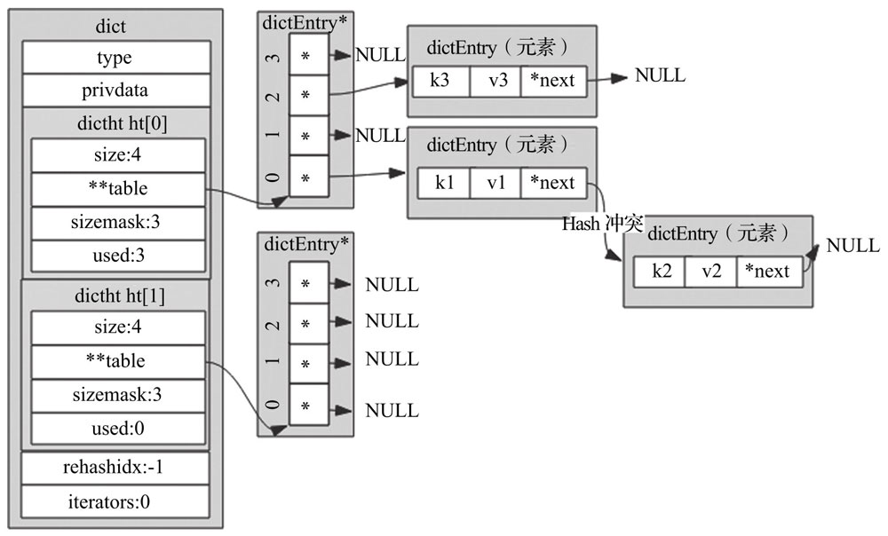
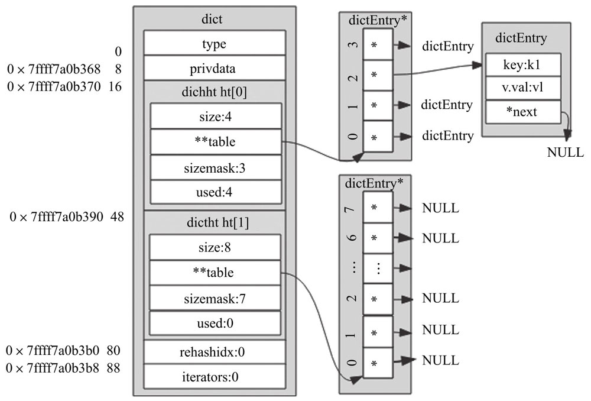
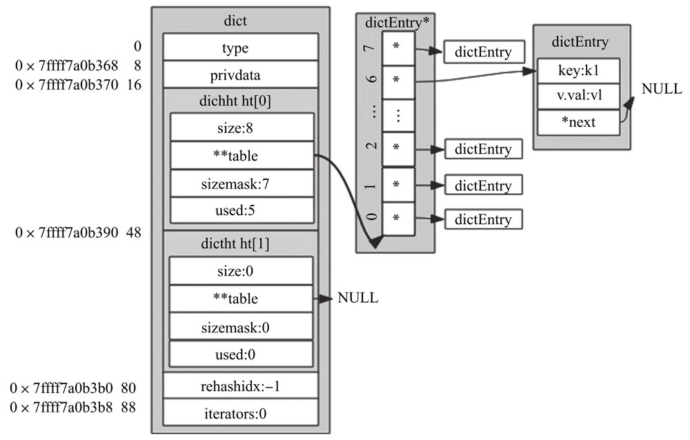
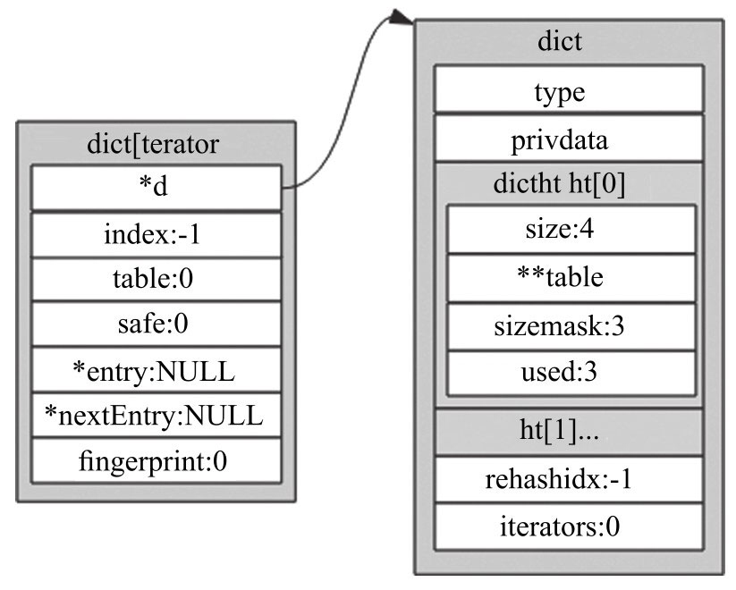

dict

## 目标

1. O(1) 的查找速度
2. 键值对中键的类型可以是字符串、整型、浮点型
3. 键值对中值的类型可以是String，Hash，List，Set，SortSet

## 实现思路

在所有的数据结构里面，只有数组可以根据下标做到 O(1)。既然选择数组作为基本结构，那么，如何实现呢？有哪些问题需要解决？


如何确定下标？计算 hash

hash 函数如何设计？

浮点型如何计算 Hash？将浮点型当做字符串

下标超过容量如何处理？取余

hash 冲突如何解决？开链法

扩容算法和缩容算法？扩容小于 1M，增加为原来的 2 倍，大于 1M，每次增加 1M。当容量小于 10%时进行缩容

扩容和缩容过程中的遍历如何处理？同时遍历 h[0]，h[1]

重哈希的时机：每次查找的时候、定时任务

### 哈希函数

### Times33

现在几乎所有流行的HashMap都采用了DJB Hash Function，俗称“Times33”算法

``` c
static unsigned int dictGenHashFunction(const unsigned char* buf, int len) {
	unsigned int hash = 6381;
  while (len--) {
    hash = ((hash << 5) + hash) + (*buf++)
  }
  return hash;
}
```


### siphash


## 数据结构



```c
typedef struct dictEntry {
    void *key;
    union {
        void *val;
        uint64_t u64;
        int64_t s64;
        double d;
    } v;
    struct dictEntry *next;
} dictEntry;

typedef struct dictType {
    uint64_t (*hashFunction)(const void *key);
    void *(*keyDup)(void *privdata, const void *key);
    void *(*valDup)(void *privdata, const void *obj);
    int (*keyCompare)(void *privdata, const void *key1, const void *key2);
    void (*keyDestructor)(void *privdata, void *key);
    void (*valDestructor)(void *privdata, void *obj);
} dictType;

/* This is our hash table structure. Every dictionary has two of this as we
 * implement incremental rehashing, for the old to the new table. */
typedef struct dictht {
    dictEntry **table;
    unsigned long size;
    unsigned long sizemask;
    unsigned long used;
} dictht;

typedef struct dict {
    dictType *type;
    void *privdata;
    dictht ht[2];
    long rehashidx; /* rehashing not in progress if rehashidx == -1 */
    unsigned long iterators; /* number of iterators currently running */
} dict;
```

其中

1. ht[2]：正常只使用 ht[0]，在 rehash 的时候，会将新的值放入 ht[1]

2. rehashidx：如果正在 rehash，该值为当前 rehash 执行到 ht[0]的索引

3. sizemask：始终为 size-1
4. iterators：当前运行的安全迭代器数，当有安全迭代器运行是会暂定 rehash。keys 使用安全迭代器，sort 使用普通迭代器。


##  核心 API

### 初始化

```c
static void _dictReset(dictht *ht)
{
    ht->table = NULL;
    ht->size = 0;
    ht->sizemask = 0;
    ht->used = 0;
}

/* Create a new hash table */
dict *dictCreate(dictType *type,
        void *privDataPtr)
{
    dict *d = zmalloc(sizeof(*d));

    _dictInit(d,type,privDataPtr);
    return d;
}

/* Initialize the hash table */
int _dictInit(dict *d, dictType *type,
        void *privDataPtr)
{
    _dictReset(&d->ht[0]);
    _dictReset(&d->ht[1]);
    d->type = type;
    d->privdata = privDataPtr;
    d->rehashidx = -1;
    d->iterators = 0;
    return DICT_OK;
}
```

初始化非常简单，不赘述。

### 插入元素

插入元素步骤：

1、找到 key 对应的索引。如果没有在重哈希，只查找 ht[0]；如果在重哈希，ht[0] 和 ht[1] 都查找。

2、如果已经存在，返回 DICT_ERR；如果不存在，创建 dictEntry

3、如果没有在重哈希，将 dictEntry 加入 ht[0]，如果正在重哈希，将 dictEntry 加入 ht[1]


```c
int dictAdd(dict *d, void *key, void *val)
{
    dictEntry *entry = dictAddRaw(d,key,NULL);

    if (!entry) return DICT_ERR;
    dictSetVal(d, entry, val);
    return DICT_OK;
}

// 找到元素索引，采用头插法创建 dictEntry 并插入 ht
dictEntry *dictAddRaw(dict *d, void *key, dictEntry **existing)
{
    long index;
    dictEntry *entry;
    dictht *ht;

    if (dictIsRehashing(d)) _dictRehashStep(d);

    /* Get the index of the new element, or -1 if
     * the element already exists. */
    if ((index = _dictKeyIndex(d, key, dictHashKey(d,key), existing)) == -1)
        return NULL;

    /* Allocate the memory and store the new entry.
     * Insert the element in top, with the assumption that in a database
     * system it is more likely that recently added entries are accessed
     * more frequently. */
    ht = dictIsRehashing(d) ? &d->ht[1] : &d->ht[0];
    // 头插法
    entry = zmalloc(sizeof(*entry));
    entry->next = ht->table[index];
    ht->table[index] = entry;
    ht->used++;

    /* Set the hash entry fields. */
    dictSetKey(d, entry, key);
    return entry;
}

// 找到 key 对应的索引，如果已经存在，返回 -1.
static long _dictKeyIndex(dict *d, const void *key, uint64_t hash, dictEntry **existing)
{
    unsigned long idx, table;
    dictEntry *he;
    if (existing) *existing = NULL;

    /* Expand the hash table if needed */
    if (_dictExpandIfNeeded(d) == DICT_ERR)
        return -1;
    for (table = 0; table <= 1; table++) {
        idx = hash & d->ht[table].sizemask;
        /* Search if this slot does not already contain the given key */
        he = d->ht[table].table[idx];
        while(he) {
            if (key==he->key || dictCompareKeys(d, key, he->key)) {
                if (existing) *existing = he;
                return -1;
            }
            he = he->next;
        }
        // 如果没有reHash，就不遍历 ht[1] 了
        if (!dictIsRehashing(d)) break;
    }
    return idx;
}
```


### Hash 函数

使用 siphash 和 siphash_nocase 两种 hash 函数算法


### 扩容

#### 扩容条件

满足如下条件之一

1、总元素个数大于哈希桶个数并且重哈希开关是打开的

2、总元素个数大于哈希桶个数的5倍, 强制进行重哈希

```c
static int _dictExpandIfNeeded(dict *d)
{
    /* Incremental rehashing already in progress. Return. */
    if (dictIsRehashing(d)) return DICT_OK;

    /* If the hash table is empty expand it to the initial size. */
    if (d->ht[0].size == 0) return dictExpand(d, DICT_HT_INITIAL_SIZE);

    /* If we reached the 1:1 ratio, and we are allowed to resize the hash
     * table (global setting) or we should avoid it but the ratio between
     * elements/buckets is over the "safe" threshold, we resize doubling
     * the number of buckets. */
    if (d->ht[0].used >= d->ht[0].size &&
        (dict_can_resize ||
         d->ht[0].used/d->ht[0].size > dict_force_resize_ratio))
    {
        return dictExpand(d, d->ht[0].used*2);
    }
    return DICT_OK;
}
```


#### 渐进式扩容






扩容步骤

1. 如果是首次初始化，初始化容量 为 4。
2. 如果不是首次初始化，将新申请的 dictEntry 放在 ht[1]

```java
int dictExpand(dict *d, unsigned long size)
{
    /* the size is invalid if it is smaller than the number of
     * elements already inside the hash table */
    if (dictIsRehashing(d) || d->ht[0].used > size)
        return DICT_ERR;

    dictht n; /* the new hash table */
    unsigned long realsize = _dictNextPower(size);

    /* Rehashing to the same table size is not useful. */
    if (realsize == d->ht[0].size) return DICT_ERR;

    /* Allocate the new hash table and initialize all pointers to NULL */
    n.size = realsize;
    n.sizemask = realsize-1;
    n.table = zcalloc(realsize*sizeof(dictEntry*));
    n.used = 0;

    /* Is this the first initialization? If so it's not really a rehashing
     * we just set the first hash table so that it can accept keys. */
    if (d->ht[0].table == NULL) {
        d->ht[0] = n;
        return DICT_OK;
    }

    /* Prepare a second hash table for incremental rehashing */
    d->ht[1] = n;
    d->rehashidx = 0;
    return DICT_OK;
}
```


1、扩容过程中，调用如下函数中，都会将 h[0] 中一个bucket的数据迁移到 h[1]。dictAddRaw\dictGenericDelete\dictFind\dictGetRandomKey\dictGetSomeKeys

2、后台任务

每次花费 1 ms，以 100 为批次，将 ht[0] 数据迁移到 ht[1]


```c
int dictRehashMilliseconds(dict *d, int ms) {
    long long start = timeInMilliseconds();
    int rehashes = 0;

    while(dictRehash(d,100)) {
        rehashes += 100;
        if (timeInMilliseconds()-start > ms) break;
    }
    return rehashes;
}

int dictRehash(dict *d, int n) {
    int empty_visits = n*10; /* Max number of empty buckets to visit. */
    if (!dictIsRehashing(d)) return 0;

    while(n-- && d->ht[0].used != 0) {
        dictEntry *de, *nextde;

        /* Note that rehashidx can't overflow as we are sure there are more
         * elements because ht[0].used != 0 */
        assert(d->ht[0].size > (unsigned long)d->rehashidx);
        // 找到空余的 bucket
        while(d->ht[0].table[d->rehashidx] == NULL) {
            d->rehashidx++;
            if (--empty_visits == 0) return 1;
        }
        de = d->ht[0].table[d->rehashidx];
        // ht[0] 的元素迁移到 ht[1]
        while(de) {
            uint64_t h;

            nextde = de->next;
            /* Get the index in the new hash table */
            h = dictHashKey(d, de->key) & d->ht[1].sizemask;
            de->next = d->ht[1].table[h];
            d->ht[1].table[h] = de;
            d->ht[0].used--;
            d->ht[1].used++;
            de = nextde;
        }
        d->ht[0].table[d->rehashidx] = NULL;
        d->rehashidx++;
    }

    /* Check if we already rehashed the whole table... */
    if (d->ht[0].used == 0) {
        zfree(d->ht[0].table);
        d->ht[0] = d->ht[1];
        _dictReset(&d->ht[1]);
        d->rehashidx = -1;
        return 0;
    }

    /* More to rehash... */
    return 1;
}        
```


### 缩容

当负载因子小于 0.1 的时候，进行缩容。方法与扩容一样。唯一不一样的是一个是扩大，一个是缩小。

### 全遍历

要求

1. 不重复出现
2. 不遗漏

遍历方式

全遍历：一次命令执行完就遍历完整个数据。比如keys

间断遍历：每次只取一部分数据，分多次遍历。比如 hscan

#### 迭代器



dict 实现了 dictIterator 

```java
typedef struct dictIterator {
    dict *d;
    long index;
    int table, safe;
    dictEntry *entry, *nextEntry;
    /* unsafe iterator fingerprint for misuse detection. */
    long long fingerprint;
} dictIterator;
```

其中：

table：ht 的索引

safe：表示是否为安全模式

fingerprint：字典指纹


#### 迭代模式

安全迭代器：遍历过程中，删除数据。通过限制 rehash 来支持迭代过程中的删除

普通迭代器：只遍历数据。整个迭代过程中不能有修改操作，通过 fingerprint 来检查。

```java
dictIterator *dictGetIterator(dict *d)
{
    dictIterator *iter = zmalloc(sizeof(*iter));

    iter->d = d;
    iter->table = 0;
    iter->index = -1;
    iter->safe = 0;
    iter->entry = NULL;
    iter->nextEntry = NULL;
    return iter;
}

dictIterator *dictGetSafeIterator(dict *d) {
    dictIterator *i = dictGetIterator(d);

    i->safe = 1;
    return i;
}

dictEntry *dictNext(dictIterator *iter)
{
    while (1) {
        if (iter->entry == NULL) {
            dictht *ht = &iter->d->ht[iter->table];
            if (iter->index == -1 && iter->table == 0) {
                // 安全模式，当 iter->d->iterators 不为 0 时，才可以 rehash
                if (iter->safe)
                    iter->d->iterators++;
                else
                    iter->fingerprint = dictFingerprint(iter->d);
            }
            iter->index++;
            if (iter->index >= (long) ht->size) {
                if (dictIsRehashing(iter->d) && iter->table == 0) {
                    iter->table++;
                    iter->index = 0;
                    ht = &iter->d->ht[1];
                } else {
                    break;
                }
            }
            iter->entry = ht->table[iter->index];
        } else {
            iter->entry = iter->nextEntry;
        }
        if (iter->entry) {
            /* We need to save the 'next' here, the iterator user
             * may delete the entry we are returning. */
            iter->nextEntry = iter->entry->next;
            return iter->entry;
        }
    }
    return NULL;
}

void dictReleaseIterator(dictIterator *iter)
{
    if (!(iter->index == -1 && iter->table == 0)) {
        if (iter->safe)
            iter->d->iterators--;
        else
            // 检查指纹是否相同
            assert(iter->fingerprint == dictFingerprint(iter->d));
    }
    zfree(iter);
}
```


字典指纹

```c
long long dictFingerprint(dict *d) {
    long long integers[6], hash = 0;
    int j;

    integers[0] = (long) d->ht[0].table;
    integers[1] = d->ht[0].size;
    integers[2] = d->ht[0].used;
    integers[3] = (long) d->ht[1].table;
    integers[4] = d->ht[1].size;
    integers[5] = d->ht[1].used;

    /* We hash N integers by summing every successive integer with the integer
     * hashing of the previous sum. Basically:
     *
     * Result = hash(hash(hash(int1)+int2)+int3) ...
     *
     * This way the same set of integers in a different order will (likely) hash
     * to a different number. */
    for (j = 0; j < 6; j++) {
        hash += integers[j];
        /* For the hashing step we use Tomas Wang's 64 bit integer hash. */
        hash = (~hash) + (hash << 21); // hash = (hash << 21) - hash - 1;
        hash = hash ^ (hash >> 24);
        hash = (hash + (hash << 3)) + (hash << 8); // hash * 265
        hash = hash ^ (hash >> 14);
        hash = (hash + (hash << 2)) + (hash << 4); // hash * 21
        hash = hash ^ (hash >> 28);
        hash = hash + (hash << 31);
    }
    return hash;
}
```


### 间断遍历

间断遍历过程中会如下如下三种情况

1. 从迭代开始都迭代结束，散列表没有rehash操作
2. 从迭代开始都迭代结束，散列表进行了扩容或缩容操作，且恰好为两次迭代间隔期完成了 rehash 操作
3. 从迭代开始到结束，某次或某几次迭代时，散列表正在进行 rehash

解决办法：reverse binary iterator 方法

```c
            v |= ~m1;
            v = rev(v);
            v++;
            v = rev(v);
```

这里比较巧妙。主要在于利用了 size 为 2 的 n 次方。扩容是，数据只能从之前的索引为 n 变为 2*n+1。

比如，长度为 4 的字典，扩容到 8，0 的元素一部分搬移到 4，1 的元素搬移到5，以此类推。

```c
unsigned long dictScan(dict *d,
                       unsigned long v,
                       dictScanFunction *fn,
                       dictScanBucketFunction* bucketfn,
                       void *privdata)
{
    dictht *t0, *t1;
    const dictEntry *de, *next;
    unsigned long m0, m1;

    if (dictSize(d) == 0) return 0;

    // 没有进行重哈希
    if (!dictIsRehashing(d)) {
        t0 = &(d->ht[0]);
        m0 = t0->sizemask;

        /* Emit entries at cursor */
        if (bucketfn) bucketfn(privdata, &t0->table[v & m0]);
        de = t0->table[v & m0];
        while (de) {
            next = de->next;
            fn(privdata, de);
            de = next;
        }

        /* Set unmasked bits so incrementing the reversed cursor
         * operates on the masked bits */
        v |= ~m0;
        /* Increment the reverse cursor */
        v = rev(v);
        v++;
        v = rev(v);

    } else { //执行了重哈希
        t0 = &d->ht[0];
        t1 = &d->ht[1];
        // 先遍历小表，再遍历大表。
        /* Make sure t0 is the smaller and t1 is the bigger table */
        if (t0->size > t1->size) {
            t0 = &d->ht[1];
            t1 = &d->ht[0];
        }

        m0 = t0->sizemask;
        m1 = t1->sizemask;

        /* Emit entries at cursor */
        if (bucketfn) bucketfn(privdata, &t0->table[v & m0]);
        de = t0->table[v & m0];
        while (de) {
            next = de->next;
            fn(privdata, de);
            de = next;
        }

        /* Iterate over indices in larger table that are the expansion
         * of the index pointed to by the cursor in the smaller table */
        do {
            /* Emit entries at cursor */
            if (bucketfn) bucketfn(privdata, &t1->table[v & m1]);
            de = t1->table[v & m1];
            while (de) {                
                 next = de->next;
                fn(privdata, de);
                de = next;
            }

            /* Increment the reverse cursor not covered by the smaller mask.*/
            //
            v |= ~m1;
            v = rev(v);
            v++;
            v = rev(v);

            /* Continue while bits covered by mask difference is non-zero */
        } while (v & (m0 ^ m1));
    }

    return v;
}      
```

例外情况：

如果在遍历过程中进行了两次扩容或缩容，则可能出现重复元素的情况，不过概率很低。

## API 概览

| 函数             | 作用                 | 时间复杂度 |
| ---------------- | -------------------- | ---------- |
| dictCreate       | 创建一个字典         | O(1)       |
| dictAdd          | 增加一个元素         | O(1)       |
| dictReplace      | 替换已有元素         | O(1)       |
| dictFetchValue   | 查找一个元素的值     | O(1)       |
| dictGetRandomKey | 随机返回一个键       | O(1)       |
| dictDelete       | 删除指定就键值       | O(1)       |
| dictRelease      | 释放字典及其所有元素 | O(N)       |

## 总结

redis 的字典与 java 8 中的 hashmap 属于同样的结构，实现大同小异，但是在具体细节地方，还是有稍微的区别，列举如下：

与 Java8 HashMap 对比

| 维度       | redis dict                                                   | HashMap                               |
| ---------- | ------------------------------------------------------------ | ------------------------------------- |
| 初始化容量 | 4                                                            | 16                                    |
| hash 函数  | 自定义                                                       | 取余                                  |
| 重哈希条件 | 总元素个数大于哈希桶个数并且重哈希开关是打开的；或总元素个数大于哈希桶个数的5倍, 强制进行重哈希 | 元素数大于负载因子                    |
| 遍历       | 普通遍历，安全遍历                                           | 普通遍历                              |
| 扩容机制   | 渐进式                                                       | 渐进式                                |
| hash 冲突  | 开链法，头插法                                               | 尾插法，链表在长度超过 8 时使用红黑树 |
| 缩容       | 容量小于 10%时                                               | 不支持                                |
| 监控       | 离散程度的统计                                               | 没有                                  |
|            |                                                              |                                       |

## 参考

http://www.nowamagic.net/academy/detail/3008010

## 思考题

1、为什么 hash 表的容量是 2 的 n 次方？

rehash 可以减少数据迁移量，而且数据迁移是确定性的。比如 4扩容为 8，如果 hashCode 为 7，之前在索引 3，现在在索引 7，之前在索引 2，现在在索引 6。

2、如果在重哈希过程中，有大量的值加入，需要再次重哈希，如何处理？

这种情况不存在。因为扩容为之前的两倍，假设扩容之后，一直有元素增加，由于每次增加元素都会导致重哈希一个 bucket，因此，结果就是重哈希之后继续重哈希，并不存在重哈希过程中还要重哈希的情况。

3、简述渐进式重哈希

首先，全局哈希表的扩容，是指表本身的扩容，并不涉及表中指向的数据扩容（数据占大量内存空间）。

reash 过程中，Redis 仍然正常处理客户端请求，每处理一个请求时，从哈希表 1 中的第一个索引位置开始，顺带着将这个索引位置上的所有 entries 拷贝到哈希表 2 中；等处理下一个请求时，再顺带拷贝哈希表 1 中的下一个索引位置的 entries。

rehash的过程中，其实并没有发生数据的copy，而是移动，因为所有的操作都是指针。例如，原来在全局哈希表1的哈希桶1的数据（ENTRY），移动的时候，只需通过新的hash计算，然后将其地址赋给全局哈希表2的相应哈希桶即可，

因为在进行渐进式 rehash 的过程中， 字典会同时使用 ht[0] 和 ht[1] 两个哈希表， 所以在渐进式 rehash 进行期间， 字典的删除（delete）、查找（find）、更新（update）等操作会在两个哈希表上进行： 比如说， 要在字典里面查找一个键的话， 程序会先在 ht[0] 里面进行查找， 如果没找到的话， 就会继续到 ht[1] 里面进行查找， 诸如此类。
另外， 在渐进式 rehash 执行期间， 新添加到字典的键值对一律会被保存到 ht[1] 里面， 而 ht[0] 则不再进行任何添加操作： 这一措施保证了 ht[0] 包含的键值对数量会只减不增， 并随着 rehash 操作的执行而最终变成空表。


