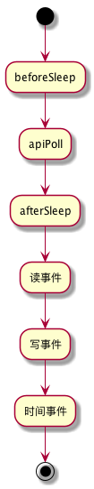

eventloop

本文基于 redis  3.5.x 版本

### EventLoop

#### 数据结构

```java

/* A fired event */
typedef struct aeFiredEvent {
    int fd;
    int mask;
} aeFiredEvent;


/* State of an event based program */
typedef struct aeEventLoop {
    int maxfd;   // events 和 fired 的大小
    int setsize; // events 和 fired 的容量
    long long timeEventNextId; // 唯一标记一个 timeEvent，依次递增，-1 表示删除
    time_t lastTime;     /* Used to detect system clock skew */
    aeFileEvent *events; // 所有注册的文件事件，以 fd 为索引
    aeFiredEvent *fired; // 需要处理的文件事件数组
    aeTimeEvent *timeEventHead; // 时间事件的链表头。时间事件包括定时时间和一次性事件
    int stop; // 是否终止执行
    void *apidata; // 对应 aeApiState
    aeBeforeSleepProc *beforesleep; // 等待文件事件前的回调函数
    aeBeforeSleepProc *aftersleep;  // 文件事件返回（超时或有文件可读写）的回调函数
} aeEventLoop;
```


#### 初始化

核心在于初始化 eventLoop->events 和 eventLoop->fired，初始化大小为 setsize，需要说明的是，events 和  fired 是支持扩容的。

```c
aeEventLoop *aeCreateEventLoop(int setsize) {
    aeEventLoop *eventLoop;
    int i;

    if ((eventLoop = zmalloc(sizeof(*eventLoop))) == NULL) goto err;
    eventLoop->events = zmalloc(sizeof(aeFileEvent)*setsize);
    eventLoop->fired = zmalloc(sizeof(aeFiredEvent)*setsize);
    if (eventLoop->events == NULL || eventLoop->fired == NULL) goto err;
    eventLoop->setsize = setsize;
    eventLoop->lastTime = time(NULL);
    eventLoop->timeEventHead = NULL;
    eventLoop->timeEventNextId = 0;
    eventLoop->stop = 0;
    eventLoop->maxfd = -1;
    eventLoop->beforesleep = NULL;
    eventLoop->aftersleep = NULL;
    if (aeApiCreate(eventLoop) == -1) goto err;
    /* Events with mask == AE_NONE are not set. So let's initialize the
     * vector with it. */
    for (i = 0; i < setsize; i++)
        eventLoop->events[i].mask = AE_NONE;
    return eventLoop;

err:
    if (eventLoop) {
        zfree(eventLoop->events);
        zfree(eventLoop->fired);
        zfree(eventLoop);
    }
    return NULL;
}
```


#### 处理流程

1、在等待文件事件前执行 beforesleep 函数

2、等待 x 毫秒。x 为下一个时间事件的等待的毫秒数。如果有时间事件需要立即执行，立即唤醒。

3、由于超时或者文件事件唤醒，执行 aftersleep 函数

4、处理文件读事件

5、处理文件写事件

6、执行时间事件。时间事件分为一次性和定时。对于一次性任务，返回 AE_NOMORE，执行完后从时间事件队列中删除。对于定时任务，返回下次执行时间（下次执行距离当前时间的毫秒数）。



```c
int aeProcessEvents(aeEventLoop *eventLoop, int flags)
{
    int processed = 0, numevents;

    if (!(flags & AE_TIME_EVENTS) && !(flags & AE_FILE_EVENTS)) return 0;

    if (eventLoop->maxfd != -1 ||
        ((flags & AE_TIME_EVENTS) && !(flags & AE_DONT_WAIT))) {
        int j;
        aeTimeEvent *shortest = NULL;
        struct timeval tv, *tvp;

        // 可以等待，找到最近需要执行的时间事件
        if (flags & AE_TIME_EVENTS && !(flags & AE_DONT_WAIT))
            shortest = aeSearchNearestTimer(eventLoop);
        if (shortest) {
            long now_sec, now_ms;

            aeGetTime(&now_sec, &now_ms);
            tvp = &tv;

            // 最近时间距离当前事件的毫秒数
            long long ms =
                (shortest->when_sec - now_sec)*1000 +
                shortest->when_ms - now_ms;

            if (ms > 0) {
                tvp->tv_sec = ms/1000;
                tvp->tv_usec = (ms % 1000)*1000;
            } else {
                tvp->tv_sec = 0;
                tvp->tv_usec = 0;
            }
        } else {
            if (flags & AE_DONT_WAIT) {
                tv.tv_sec = tv.tv_usec = 0;
                tvp = &tv;
            } else {
                /* Otherwise we can block */
                tvp = NULL; /* wait forever */
            }
        }

        //如果下一个时间事件将在 x 毫秒处理，那么，poll 将最多等待 x 毫秒检查是否有文件事件后唤醒。如果 x 为 0，立即唤醒
        numevents = aeApiPoll(eventLoop, tvp);

        // 唤醒后执行的函数
        if (eventLoop->aftersleep != NULL && flags & AE_CALL_AFTER_SLEEP)
            eventLoop->aftersleep(eventLoop);

        for (j = 0; j < numevents; j++) {
            aeFileEvent *fe = &eventLoop->events[eventLoop->fired[j].fd];
            int mask = eventLoop->fired[j].mask;
            int fd = eventLoop->fired[j].fd;
            int fired = 0; /* Number of events fired for current fd. */

            int invert = fe->mask & AE_BARRIER;

            if (!invert && fe->mask & mask & AE_READABLE) {
                fe->rfileProc(eventLoop,fd,fe->clientData,mask);
                fired++;
            }

            /* Fire the writable event. */
            if (fe->mask & mask & AE_WRITABLE) {
                if (!fired || fe->wfileProc != fe->rfileProc) {
                    fe->wfileProc(eventLoop,fd,fe->clientData,mask);
                    fired++;
                }
            }

            /* If we have to invert the call, fire the readable event now
             * after the writable one. */
            if (invert && fe->mask & mask & AE_READABLE) {
                if (!fired || fe->wfileProc != fe->rfileProc) {
                    fe->rfileProc(eventLoop,fd,fe->clientData,mask);
                    fired++;
                }
            }

            processed++;
        }
    }
    /* Check time events */
    if (flags & AE_TIME_EVENTS)
        processed += processTimeEvents(eventLoop);

    return processed; /* return the number of processed file/time events */
}

void aeMain(aeEventLoop *eventLoop) {
    eventLoop->stop = 0;
    while (!eventLoop->stop) {
        if (eventLoop->beforesleep != NULL)
            eventLoop->beforesleep(eventLoop);
        aeProcessEvents(eventLoop, AE_ALL_EVENTS|AE_CALL_AFTER_SLEEP);
    }
}
```


### 文件事件


#### 数据结构

```c
typedef struct aeFileEvent {
    int mask; /* one of AE_(READABLE|WRITABLE|BARRIER) */
    aeFileProc *rfileProc;
    aeFileProc *wfileProc;
    void *clientData;
} aeFileEvent;

typedef void aeFileProc(struct aeEventLoop *eventLoop, int fd, void *clientData, int mask);

int aeCreateFileEvent(aeEventLoop *eventLoop, int fd, int mask,
        aeFileProc *proc, void *clientData);
void aeDeleteFileEvent(aeEventLoop *eventLoop, int fd, int mask);
int aeGetFileEvents(aeEventLoop *eventLoop, int fd);
```


#### 创建文件事件

1、文件描述符

2、关注的事件 mask

3、读写函数

4、自定义数据

```c
int aeCreateFileEvent(aeEventLoop *eventLoop, int fd, int mask,
        aeFileProc *proc, void *clientData)
{
    if (fd >= eventLoop->setsize) {
        errno = ERANGE;
        return AE_ERR;
    }
    aeFileEvent *fe = &eventLoop->events[fd];

    if (aeApiAddEvent(eventLoop, fd, mask) == -1)
        return AE_ERR;
    fe->mask |= mask;
    if (mask & AE_READABLE) fe->rfileProc = proc;
    if (mask & AE_WRITABLE) fe->wfileProc = proc;
    fe->clientData = clientData;
    if (fd > eventLoop->maxfd)
        eventLoop->maxfd = fd;
    return AE_OK;
}
```


#### 删除文件事件

1、找到 fd 对应的 aeFileEvent

2、删除对 mask 事件的关注

3、如果 fd 没有任何事件，并且是最大fd，删除无用的描述符

```java
void aeDeleteFileEvent(aeEventLoop *eventLoop, int fd, int mask)
{
    if (fd >= eventLoop->setsize) return;
    aeFileEvent *fe = &eventLoop->events[fd];
    if (fe->mask == AE_NONE) return;

    /* We want to always remove AE_BARRIER if set when AE_WRITABLE
     * is removed. */
    if (mask & AE_WRITABLE) mask |= AE_BARRIER;

    aeApiDelEvent(eventLoop, fd, mask);
    fe->mask = fe->mask & (~mask);
    if (fd == eventLoop->maxfd && fe->mask == AE_NONE) {
        /* Update the max fd */
        int j;

        for (j = eventLoop->maxfd-1; j >= 0; j--)
            if (eventLoop->events[j].mask != AE_NONE) break;
        eventLoop->maxfd = j;
    }
}
```


包括


### 时间事件


#### 数据结构

```c
typedef struct aeTimeEvent {
    long long id; // 当为 AE_DELETED_EVENT_ID 时，时间事件会从链表删除。
    long when_sec; /* seconds */
    long when_ms; /* milliseconds */
    aeTimeProc *timeProc;
    aeEventFinalizerProc *finalizerProc; // 删除当前时间事件的处理函数
    void *clientData;
    struct aeTimeEvent *prev; // 双向链表
    struct aeTimeEvent *next;
} aeTimeEvent;

typedef int aeTimeProc(struct aeEventLoop *eventLoop, long long id, void *clientData)
  
long long aeCreateTimeEvent(aeEventLoop *eventLoop, long long milliseconds,
        aeTimeProc *proc, void *clientData,
        aeEventFinalizerProc *finalizerProc);
int aeDeleteTimeEvent(aeEventLoop *eventLoop, long long id);
```


#### 创建时间事件

1、初始化 aeTimeEvent

2、采用头插法将 aeTimeEvent 加入 aeEventLoop 中。

```c
long long aeCreateTimeEvent(aeEventLoop *eventLoop, long long milliseconds,
        aeTimeProc *proc, void *clientData,
        aeEventFinalizerProc *finalizerProc)
{
    long long id = eventLoop->timeEventNextId++;
    aeTimeEvent *te;

    te = zmalloc(sizeof(*te));
    if (te == NULL) return AE_ERR;
    te->id = id;
    aeAddMillisecondsToNow(milliseconds,&te->when_sec,&te->when_ms);
    te->timeProc = proc;
    te->finalizerProc = finalizerProc;
    te->clientData = clientData;
    te->prev = NULL;
    te->next = eventLoop->timeEventHead;
    if (te->next)
        te->next->prev = te;
    eventLoop->timeEventHead = te;
    return id;
}
```


#### 搜索最近需要执行的时间事件

1、遍历链表，找到距离当前时间最近的 timeEvent。

算法复杂度为 O(N)，由于 redis 中时间事件非常有限，因此，不存在性能瓶颈。

```c
static aeTimeEvent *aeSearchNearestTimer(aeEventLoop *eventLoop)
{
    aeTimeEvent *te = eventLoop->timeEventHead;
    aeTimeEvent *nearest = NULL;

    while(te) {
        if (!nearest || te->when_sec < nearest->when_sec ||
                (te->when_sec == nearest->when_sec &&
                 te->when_ms < nearest->when_ms))
            nearest = te;
        te = te->next;
    }
    return nearest;
}
```


#### 时间事件处理流程

依次遍历所有 timeEvent

1、如果已经标记为删除，从链表中删除

2、如果时间事件执行时间比当前早，执行时间事件回调函数

```c
static int processTimeEvents(aeEventLoop *eventLoop) {
    int processed = 0;
    aeTimeEvent *te;
    long long maxId;
    time_t now = time(NULL);

    /* If the system clock is moved to the future, and then set back to the
     * right value, time events may be delayed in a random way. Often this
     * means that scheduled operations will not be performed soon enough.
     *
     * Here we try to detect system clock skews, and force all the time
     * events to be processed ASAP when this happens: the idea is that
     * processing events earlier is less dangerous than delaying them
     * indefinitely, and practice suggests it is. */
    if (now < eventLoop->lastTime) {
        te = eventLoop->timeEventHead;
        while(te) {
            te->when_sec = 0;
            te = te->next;
        }
    }
    eventLoop->lastTime = now;

    te = eventLoop->timeEventHead;
    maxId = eventLoop->timeEventNextId-1;
    while(te) {
        long now_sec, now_ms;
        long long id;

        /* Remove events scheduled for deletion. */
        if (te->id == AE_DELETED_EVENT_ID) {
            aeTimeEvent *next = te->next;
            if (te->prev)
                te->prev->next = te->next;
            else
                eventLoop->timeEventHead = te->next;
             if (te->next)
                te->next->prev = te->prev;
            if (te->finalizerProc)
                te->finalizerProc(eventLoop, te->clientData);
            zfree(te);
            te = next;
            continue;
        }

        /* Make sure we don't process time events created by time events in
         * this iteration. Note that this check is currently useless: we always
         * add new timers on the head, however if we change the implementation
         * detail, this check may be useful again: we keep it here for future
         * defense. */
        if (te->id > maxId) {
            te = te->next;
            continue;
        }
        aeGetTime(&now_sec, &now_ms);
        if (now_sec > te->when_sec ||
            (now_sec == te->when_sec && now_ms >= te->when_ms))
        {
            int retval;

            id = te->id;
            retval = te->timeProc(eventLoop, id, te->clientData);
            processed++;
            if (retval != AE_NOMORE) {
                aeAddMillisecondsToNow(retval,&te->when_sec,&te->when_ms);
            } else {
                te->id = AE_DELETED_EVENT_ID;
            }
        }
        te = te->next;
    }
    return processed;
}
```

### Epoll 的实现

epoll 的实现就是对  epoll_create，epoll_ctl和 epoll_wait 的封装。可以作为 epoll 的示例代码。实现很简单，不再赘述。


### 总结

####  EventLoop

```
aeEventLoop
    events   = setsize * aeFileEvent
    fired    = setsize * aeFiredEvent
    apidata  = aeApiState
                    epfd   = epoll_create(1024)
                    events = setsize * epoll_event
```

其中

1. events : 记录当出现可读和可写事件时的回调函数
2. apidata->events : 保持从 epoll 获取的事件，可读，可写
3. fired  : 记录某次 epoll_wait 调用，返回的事件

注：如果连续两次调用 aeApiPoll, fired 中保持的后一次的事件会覆盖前一次事件，
因此，在调用 aeApiPoll 时，确保 fired 中之前的事件已经被处理完，否则，会导致丢事件的
问题出现

#### 关于时间事件

所有的 timer 事件是一个链表，每个增加一个 timer 事件，就加入 aeEventLoop->timeEventHead 链表头

删除 timer 事件是 O(n) 的，因此，当 timer 非常多的时候，性能不会好, 解决办法是用红黑树
查找 timer 事件是 O(n) 的，因此，当 timer 非常多的时候，性能不会好, 解决办法是用红黑树

总之，eventloop 的实现可以用简单粗暴来形容。对于 redis 单线程的场景可以满足，所谓合适就是最好的。更加精巧的实现是 nginx。

### 思考题

1、如何避免时间处理函数一直执行？

2、AE_BARRIER 的作用是啥？


### 附录

### 注册的文件事件

```c
// AOF 相关
aeCreateFileEvent(server.el, server.aof_pipe_write_data_to_child, AE_WRITABLE, aofChildWriteDiffData, NULL)
aeCreateFileEvent(server.el, fds[2], AE_READABLE, aofChildPipeReadable, NULL)

// 集群相关
aeCreateFileEvent(server.el, server.cfd[j], AE_READABLE,clusterAcceptHandler, NULL)
aeCreateFileEvent(server.el,cfd,AE_READABLE,clusterReadHandler,link)
aeCreateFileEvent(server.el,link->fd,AE_WRITABLE|AE_BARRIER,clusterWriteHandler,link)
aeCreateFileEvent(server.el,link->fd,AE_READABLE,clusterReadHandler,link)

// 网络相关
aeCreateFileEvent(server.el,fd,AE_READABLE,readQueryFromClient, c)
aeCreateFileEvent(server.el, c->fd, ae_flags,sendReplyToClient, c)
aeCreateFileEvent(server.el,c->fd,AE_READABLE,readQueryFromClient,c)

// 备份相关
aeCreateFileEvent(server.el, slave->fd, AE_WRITABLE,sendReplyToClient, slave)
aeCreateFileEvent(server.el, slave->fd, AE_WRITABLE, sendBulkToSlave, slave)
aeCreateFileEvent(server.el,fd, AE_READABLE,readSyncBulkPayload,NULL)
aeCreateFileEvent(server.el,fd,AE_READABLE|AE_WRITABLE,syncWithMaster,NULL)
aeCreateFileEvent(server.el, newfd, AE_READABLE,readQueryFromClient, server.master)
aeCreateFileEvent(server.el, newfd, AE_WRITABLE,sendReplyToClient, server.master)

// 哨兵相关
aeCreateFileEvent(loop,e->fd,AE_READABLE,redisAeReadEvent,e)
aeCreateFileEvent(loop,e->fd,AE_WRITABLE,redisAeWriteEvent,e)

// Server 相关
aeCreateFileEvent(server.el, server.ipfd[j], AE_READABLE,acceptTcpHandler,NULL)
aeCreateFileEvent(server.el,server.sofd,AE_READABLE,acceptUnixHandler,NULL)
aeCreateFileEvent(server.el, server.module_blocked_pipe[0], AE_READABLE,moduleBlockedClientPipeReadable,NULL)
```

### 注册的时间事件

```c
aeCreateTimeEvent(server.el,period,moduleTimerHandler,NULL,NULL)
aeCreateTimeEvent(server.el, 1, serverCron, NULL, NULL)
```