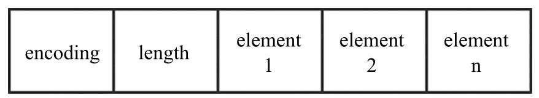
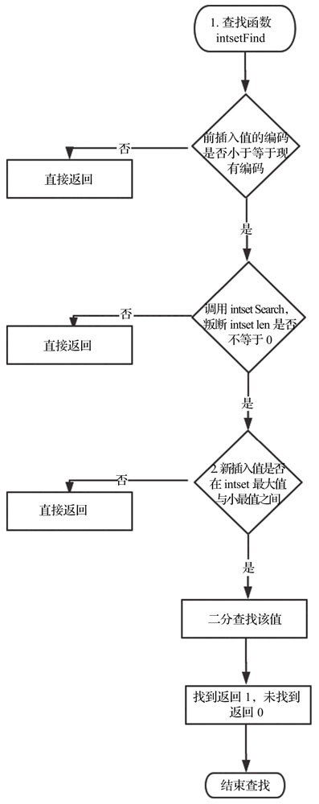
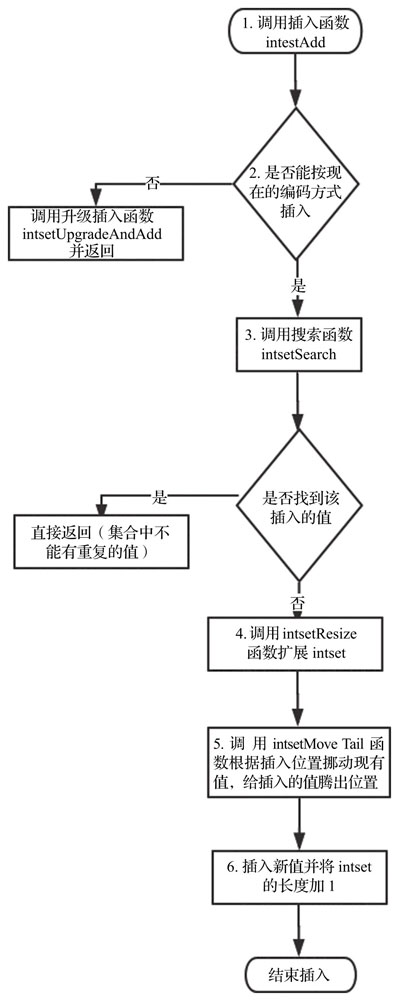
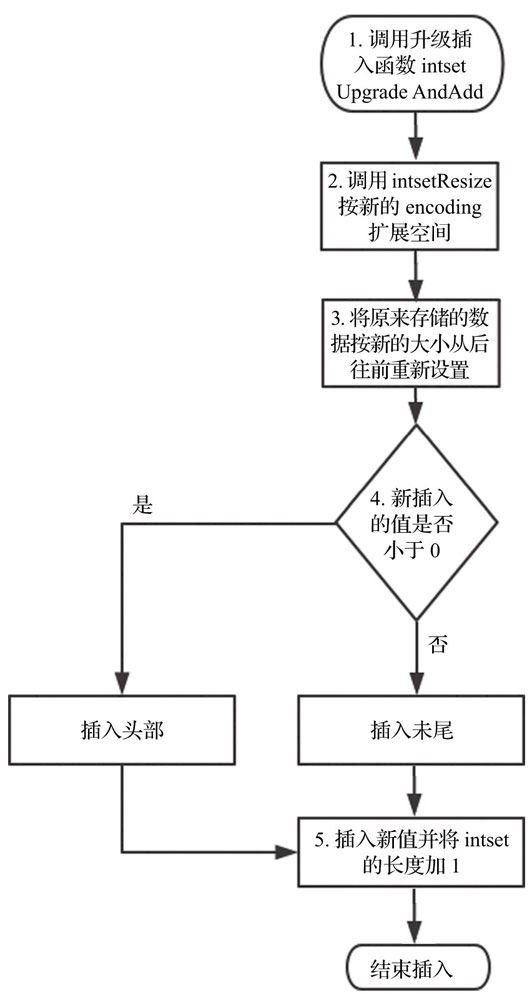
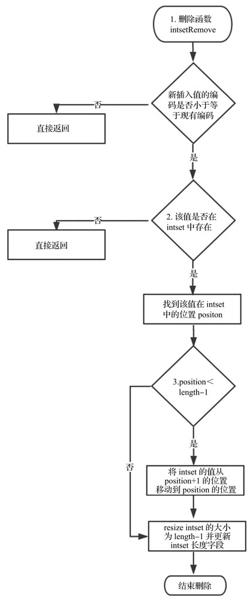

intset


### 目标

1. 对整数类型的 set 的优化 

实现思路

1. 对不同长度类型的整数使用不同长度
2. 数组 + 排序，二分查找
3. 去重 

### 数据结构

```c
typedef struct intset {
    uint32_t encoding; // 每个元素长度
    uint32_t length;   // 元素个数
    int8_t contents[]; // 具体元素
} intset;
```



#### 长度

1.  v > INT32_MAX  或 v < INT32_MIN，占用 8 字节
2. v < INT16_MIN 或 v > INT16_MAX，占用 4 字节
3. INT16_MIN < v < INT16_MAX，占用 2 字节

```c
/* Note that these encodings are ordered, so:
 * INTSET_ENC_INT16 < INTSET_ENC_INT32 < INTSET_ENC_INT64. */
#define INTSET_ENC_INT16 (sizeof(int16_t))
#define INTSET_ENC_INT32 (sizeof(int32_t))
#define INTSET_ENC_INT64 (sizeof(int64_t))

/* Return the required encoding for the provided value. */
static uint8_t _intsetValueEncoding(int64_t v) {
    if (v < INT32_MIN || v > INT32_MAX)
        return INTSET_ENC_INT64;
    else if (v < INT16_MIN || v > INT16_MAX)
        return INTSET_ENC_INT32;
    else
        return INTSET_ENC_INT16;
}
```


#### 数据迁移

当数据长度超过范围，需要适配长度。比如，初始化范围在 INT16_MIN < v < INT16_MAX，那么，每个元素占用 2 个字节，如果新增加的数字长度超过这个范围，就需要对每个元素扩容，比如，扩展成 4 个字节。这其中涉及到数据的迁移。需要非常注意。

### 核心 API

#### 初始化

```c
intset *intsetNew(void) {
    intset *is = zmalloc(sizeof(intset));
    is->encoding = intrev32ifbe(INTSET_ENC_INT16);
    is->length = 0;
    return is;
}
```

很简单，不再赘述

#### 查找

**根据索引查找**

由于 is->content 为数组，可以直接根据索引定位。

```c
static int64_t _intsetGetEncoded(intset *is, int pos, uint8_t enc) {
    int64_t v64;
    int32_t v32;
    int16_t v16;

    if (enc == INTSET_ENC_INT64) {
        memcpy(&v64,((int64_t*)is->contents)+pos,sizeof(v64));
        memrev64ifbe(&v64);
        return v64;
    } else if (enc == INTSET_ENC_INT32) {
        memcpy(&v32,((int32_t*)is->contents)+pos,sizeof(v32));
        memrev32ifbe(&v32);
        return v32;
    } else {
        memcpy(&v16,((int16_t*)is->contents)+pos,sizeof(v16));
        memrev16ifbe(&v16);
        return v16;
    }
}

/* Return the value at pos, using the configured encoding. */
static int64_t _intsetGet(intset *is, int pos) {
    return _intsetGetEncoded(is,pos,intrev32ifbe(is->encoding));
}
```


**根据值查找**

1. 如果待查找元素大于 intset 的最大值，小于 intset 的最小值，返回 0
2. 否则，使用二分法查找，没有找到返回 0，找到返回 1。pos 指向比 value 小且最接近 value 的值

```c
uint8_t intsetFind(intset *is, int64_t value) {
    uint8_t valenc = _intsetValueEncoding(value);
    return valenc <= intrev32ifbe(is->encoding) && intsetSearch(is,value,NULL);
}

static uint8_t intsetSearch(intset *is, int64_t value, uint32_t *pos) {
    int min = 0, max = intrev32ifbe(is->length)-1, mid = -1;
    int64_t cur = -1;

    /* The value can never be found when the set is empty */
    if (intrev32ifbe(is->length) == 0) {
        if (pos) *pos = 0;
        return 0;
    } else {
        /* Check for the case where we know we cannot find the value,
         * but do know the insert position. */
        if (value > _intsetGet(is,max)) { // 大于最大值
            if (pos) *pos = intrev32ifbe(is->length);
            return 0;
        } else if (value < _intsetGet(is,0)) { // 小于最小值
            if (pos) *pos = 0;
            return 0;
        }
    }
    // 二分查找
    while(max >= min) {
        mid = ((unsigned int)min + (unsigned int)max) >> 1;
        cur = _intsetGet(is,mid);
        if (value > cur) {
            min = mid+1;
        } else if (value < cur) {
            max = mid-1;
        } else {
            break;
        }
    }

    if (value == cur) {
        if (pos) *pos = mid;
        return 1;
    } else {
        if (pos) *pos = min;
        return 0;
    }
}    
```



#### 插入

1. 如果新的元素在已有元素的范围内，找到元素，容量加 1，移动元素，设置元素值
2. 如果新的元素不在已有元素的范围内，扩容每个元素、移动元素，设置元素值。


```c
intset *intsetAdd(intset *is, int64_t value, uint8_t *success) {
    uint8_t valenc = _intsetValueEncoding(value);
    uint32_t pos;
    if (success) *success = 1;

    // value 打破已有元素长度
    if (valenc > intrev32ifbe(is->encoding)) {
        // 将 value 插入
        return intsetUpgradeAndAdd(is,value);
    } else { 
        // 已经存在，直接返回
        if (intsetSearch(is,value,&pos)) {
            if (success) *success = 0;
            return is;
        }

        // 容量加 1
        is = intsetResize(is,intrev32ifbe(is->length)+1);
        // 移动元素
        if (pos < intrev32ifbe(is->length)) intsetMoveTail(is,pos,pos+1);
    }

    // 设置元素的值
    _intsetSet(is,pos,value);
    // 更新元素数量
    is->length = intrev32ifbe(intrev32ifbe(is->length)+1);
    return is;
}

/* Upgrades the intset to a larger encoding and inserts the given integer. */
static intset *intsetUpgradeAndAdd(intset *is, int64_t value) {
    uint8_t curenc = intrev32ifbe(is->encoding);
    uint8_t newenc = _intsetValueEncoding(value);
    int length = intrev32ifbe(is->length);
    // 小于 0 表示小于数组第一个数，大于 0，表示大于数组最后一个元素
    int prepend = value < 0 ? 1 : 0;

    // 设置新的元素长度
    is->encoding = intrev32ifbe(newenc);
    // 扩容
    is = intsetResize(is,intrev32ifbe(is->length)+1);

    // 从后往前覆盖，避免内存相互覆盖的问题。
    while(length--)
        _intsetSet(is,length+prepend,_intsetGetEncoded(is,length,curenc));

    // value 为第一个元素
    if (prepend)
        _intsetSet(is,0,value);
    else
        // value 为最后一个元素
        _intsetSet(is,intrev32ifbe(is->length),value);
    is->length = intrev32ifbe(intrev32ifbe(is->length)+1);
    return is;
}

static void intsetMoveTail(intset *is, uint32_t from, uint32_t to) {
    void *src, *dst;
    uint32_t bytes = intrev32ifbe(is->length)-from;
    uint32_t encoding = intrev32ifbe(is->encoding);

    if (encoding == INTSET_ENC_INT64) {
        src = (int64_t*)is->contents+from;
        dst = (int64_t*)is->contents+to;
        bytes *= sizeof(int64_t);
    } else if (encoding == INTSET_ENC_INT32) {
        src = (int32_t*)is->contents+from;
        dst = (int32_t*)is->contents+to;
        bytes *= sizeof(int32_t);
    } else {
        src = (int16_t*)is->contents+from;
        dst = (int16_t*)is->contents+to;
        bytes *= sizeof(int16_t);
    }
    memmove(dst,src,bytes);
}
```






#### 删除

1. 如果新的元素大于当前元素长度，或者没有找到，返回 inset 本身
2. 此时，元素已经找到。移动元素，缩容，更新元素个数

```c
intset *intsetRemove(intset *is, int64_t value, int *success) {
    uint8_t valenc = _intsetValueEncoding(value);
    uint32_t pos;
    if (success) *success = 0;

    if (valenc <= intrev32ifbe(is->encoding) && intsetSearch(is,value,&pos)) {
        uint32_t len = intrev32ifbe(is->length);

        /* We know we can delete */
        if (success) *success = 1;

        /* Overwrite value with tail and update length */
        if (pos < (len-1)) intsetMoveTail(is,pos+1,pos);
        is = intsetResize(is,len-1);
        is->length = intrev32ifbe(len-1);
    }
    return is;
}
```



### API 概览


### 总结

适合小规模数据，原因如下

1. 每次增加元素都扩容 1个元素，每次删除元素都所有一个元素

2. 涉及元素范围变化，整个数组需要重新分配

以上两项设计开销不可忽略。

### 参考

无

### 思考题