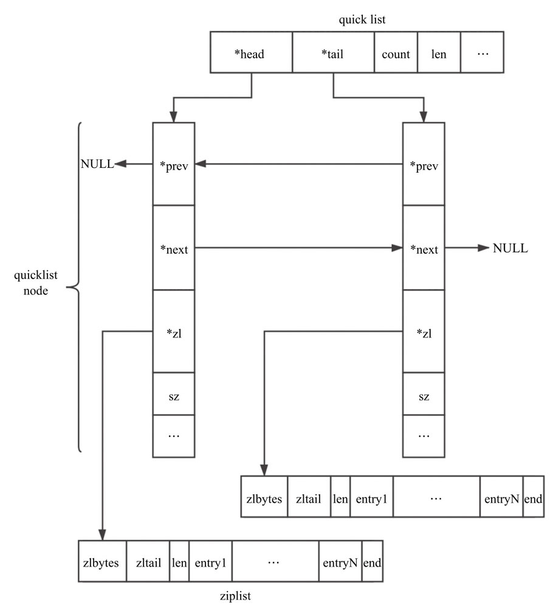

quicklist


redis 3.2 引入，3.2 之前使用 adlist

### 目标


### 核心思想

#### 数据压缩

节点压缩

Redis 允许对中间的 quicklistNode节点进行压缩，通过修改 list-compress-depth 进行配置，即设置 compress 参数，该项具体含义是两端各有 compress 个节点不压缩。

ziplist 压缩

为了进一步压缩 ziplist所占空间，redis 允许对 ziplist所占用的空间进一步压缩，压缩后的数据分为多个片段，每个片段两部分：一部分解释字段，一部分数据。


### 数据结构

```c

typedef struct quicklist {
    quicklistNode *head;
    quicklistNode *tail;
    unsigned long count;        /* total count of all entries in all ziplists */
    unsigned long len;          /* number of quicklistNodes */
    int fill : 16;              /* fill factor for individual nodes */
    unsigned int compress : 16; /* depth of end nodes not to compress;0=off */
} quicklist;

typedef struct quicklistNode {
    struct quicklistNode *prev;
    struct quicklistNode *next;
    unsigned char *zl;
    unsigned int sz;             /* ziplist size in bytes */
    unsigned int count : 16;     /* count of items in ziplist */
    unsigned int encoding : 2;   /* RAW==1 or LZF==2 */
    unsigned int container : 2;  /* NONE==1 or ZIPLIST==2 */
    unsigned int recompress : 1; /* was this node previous compressed? */
    unsigned int attempted_compress : 1; /* node can't compress; too small */
    unsigned int extra : 10; /* more bits to steal for future usage */
} quicklistNode;

// 当 ziplist 使用 LZF 
typedef struct quicklistLZF {
    unsigned int sz; /* LZF size in bytes*/
    char compressed[];
} quicklistLZF;

typedef struct quicklistEntry {
    const quicklist *quicklist; // 对应的 quicklist
    quicklistNode *node;        // 对应的 quicklistNode
    unsigned char *zi;					// ziplist
    unsigned char *value;       // 字符串内容
    long long longval;
    unsigned int sz;
    int offset;  // 相对于整个 ziplist 的偏移
} quicklistEntry;
```




其中 fil 由 list-max-ziplist-size 控制

| 数值 | 含义                          |
| ---- | ----------------------------- |
| >0   | 每个ziplist最多含有的数据项数 |
| -1   | Ziplist 节点最大为 4KB        |
| -2   | Ziplist 节点最大为 8KB        |
| -3   | Ziplist 节点最大为 16KB       |
| -4   | Ziplist 节点最大为 32KB       |
| -5   | Ziplist 节点最大为 64KB       |


### 核心 API

#### 初始化

```c
quicklist *quicklistCreate(void) {
    struct quicklist *quicklist;

    quicklist = zmalloc(sizeof(*quicklist));
    quicklist->head = quicklist->tail = NULL;
    quicklist->len = 0;
    quicklist->count = 0;
    quicklist->compress = 0;
    quicklist->fill = -2;
    return quicklist;
}

quicklist *quicklistNew(int fill, int compress) {
    quicklist *quicklist = quicklistCreate();
    quicklistSetOptions(quicklist, fill, compress);
    return quicklist;
}

void quicklistSetOptions(quicklist *quicklist, int fill, int depth) {
    quicklistSetFill(quicklist, fill);
    quicklistSetCompressDepth(quicklist, depth);
}

#define COMPRESS_MAX (1 << 16)
void quicklistSetCompressDepth(quicklist *quicklist, int compress) {
    if (compress > COMPRESS_MAX) {
        compress = COMPRESS_MAX;
    } else if (compress < 0) {
        compress = 0;
    }
    quicklist->compress = compress;
}

#define FILL_MAX (1 << 15)
void quicklistSetFill(quicklist *quicklist, int fill) {
    if (fill > FILL_MAX) {
        fill = FILL_MAX;
    } else if (fill < -5) {
        fill = -5;
    }
    quicklist->fill = fill;
}
```


#### 插入元素

两种情况

1、当前头节点允许插入，利用 ziplist 的 push 接口插入

2、当前头节点不允许插入，新建 quickNode 并插入

```c
void quicklistPush(quicklist *quicklist, void *value, const size_t sz,
                   int where) {
    if (where == QUICKLIST_HEAD) {
        quicklistPushHead(quicklist, value, sz);
    } else if (where == QUICKLIST_TAIL) {
        quicklistPushTail(quicklist, value, sz);
    }
}

/*
 * quicklist：列表
 * value ：待插入的数据
 * sz : value 的长度
 */
int quicklistPushHead(quicklist *quicklist, void *value, size_t sz) {
    quicklistNode *orig_head = quicklist->head;
    // 可以继续插入
    if (likely(
            _quicklistNodeAllowInsert(quicklist->head, quicklist->fill, sz))) {
        quicklist->head->zl =
            ziplistPush(quicklist->head->zl, value, sz, ZIPLIST_HEAD);
        quicklistNodeUpdateSz(quicklist->head);
    } else { // 不可用插入
        quicklistNode *node = quicklistCreateNode();
        node->zl = ziplistPush(ziplistNew(), value, sz, ZIPLIST_HEAD);

        quicklistNodeUpdateSz(node);
        // node 插入 quicklist->head 前面
        _quicklistInsertNodeBefore(quicklist, quicklist->head, node);
    }
    quicklist->count++;
    quicklist->head->count++;
    return (orig_head != quicklist->head);
}

REDIS_STATIC void _quicklistInsertNodeBefore(quicklist *quicklist,
                                             quicklistNode *old_node,
                                             quicklistNode *new_node) {
    __quicklistInsertNode(quicklist, old_node, new_node, 0);
}

REDIS_STATIC void __quicklistInsertNode(quicklist *quicklist,
                                        quicklistNode *old_node,
                                        quicklistNode *new_node, int after) {
    if (after) {
        // new_node 插入 old_node 后面，并更新 quicklist->tail
        new_node->prev = old_node;
        if (old_node) {
            new_node->next = old_node->next;
            if (old_node->next)
                old_node->next->prev = new_node;
            old_node->next = new_node;
        }
        if (quicklist->tail == old_node)
            quicklist->tail = new_node;
    } else {
        // new_node 插入 old_node 前面，并更新 quicklist->tail
        new_node->next = old_node;
        if (old_node) {
            new_node->prev = old_node->prev;
            if (old_node->prev)
                old_node->prev->next = new_node;
            old_node->prev = new_node;
        }
        if (quicklist->head == old_node)
            quicklist->head = new_node;
    }
    /* If this insert creates the only element so far, initialize head/tail. */
    if (quicklist->len == 0) {
        quicklist->head = quicklist->tail = new_node;
    }

    if (old_node)
        quicklistCompress(quicklist, old_node);

    quicklist->len++;
}


#define quicklistCompress(_ql, _node)                                          \
    do {                                                                       \
        if ((_node)->recompress)                                               \
            quicklistCompressNode((_node));                                    \
        else                                                                   \
            __quicklistCompress((_ql), (_node));                               \
    } while (0)
```


是否允许插入头节点

```c

#define SIZE_SAFETY_LIMIT 8192
#define sizeMeetsSafetyLimit(sz) ((sz) <= SIZE_SAFETY_LIMIT)

REDIS_STATIC int _quicklistNodeAllowInsert(const quicklistNode *node,
                                           const int fill, const size_t sz) {
    if (unlikely(!node))
        return 0;

    int ziplist_overhead;
    /* size of previous offset */
    if (sz < 254)
        ziplist_overhead = 1;
    else
        ziplist_overhead = 5;

    /* size of forward offset */
    if (sz < 64)
        ziplist_overhead += 1;
    else if (likely(sz < 16384))
        ziplist_overhead += 2;
    else
        ziplist_overhead += 5;

    /* new_sz overestimates if 'sz' encodes to an integer type */
    unsigned int new_sz = node->sz + sz + ziplist_overhead;
    if (likely(_quicklistNodeSizeMeetsOptimizationRequirement(new_sz, fill)))
        return 1;
    else if (!sizeMeetsSafetyLimit(new_sz))
        return 0;
    else if ((int)node->count < fill)
        return 1;
    else
        return 0;
}

/* Optimization levels for size-based filling */
static const size_t optimization_level[] = {4096, 8192, 16384, 32768, 65536};

REDIS_STATIC int _quicklistNodeSizeMeetsOptimizationRequirement(const size_t sz,
                                               const int fill) {
    if (fill >= 0)
        return 0;

    size_t offset = (-fill) - 1;
    if (offset < (sizeof(optimization_level) / sizeof(*optimization_level))) {
        if (sz <= optimization_level[offset]) {
            return 1;
        } else {
            return 0;
        }
    } else {
        return 0;
    }
}
```


#### 删除元素

删除一个元素，常规套路

```c
void quicklistDelEntry(quicklistIter *iter, quicklistEntry *entry) {
    quicklistNode *prev = entry->node->prev;
    quicklistNode *next = entry->node->next;
    int deleted_node = quicklistDelIndex((quicklist *)entry->quicklist,
                                         entry->node, &entry->zi);

    /* after delete, the zi is now invalid for any future usage. */
    iter->zi = NULL;

    /* If current node is deleted, we must update iterator node and offset. */
    if (deleted_node) {
        if (iter->direction == AL_START_HEAD) {
            iter->current = next;
            iter->offset = 0;
        } else if (iter->direction == AL_START_TAIL) {
            iter->current = prev;
            iter->offset = -1;
        }
    }
    /* else if (!deleted_node), no changes needed.
     * we already reset iter->zi above, and the existing iter->offset
     * doesn't move again because:
     *   - [1, 2, 3] => delete offset 1 => [1, 3]: next element still offset 1
     *   - [1, 2, 3] => delete offset 0 => [2, 3]: next element still offset 0
     *  if we deleted the last element at offet N and now
     *  length of this ziplist is N-1, the next call into
     *  quicklistNext() will jump to the next node. */
}

REDIS_STATIC int quicklistDelIndex(quicklist *quicklist, quicklistNode *node,
                                   unsigned char **p) {
    int gone = 0;

    node->zl = ziplistDelete(node->zl, p);
    node->count--;
    if (node->count == 0) {
        gone = 1;
        __quicklistDelNode(quicklist, node);
    } else {
        quicklistNodeUpdateSz(node);
    }
    quicklist->count--;
    /* If we deleted the node, the original node is no longer valid */
    return gone ? 1 : 0;
}
```


删除一个节点

```c
REDIS_STATIC void __quicklistDelNode(quicklist *quicklist,
                                     quicklistNode *node) {
    // 链表删除基本操作
    if (node->next)
        node->next->prev = node->prev;
    if (node->prev)
        node->prev->next = node->next;

    if (node == quicklist->tail) {
        quicklist->tail = node->prev;
    }

    if (node == quicklist->head) {
        quicklist->head = node->next;
    }

    /* If we deleted a node within our compress depth, we
     * now have compressed nodes needing to be decompressed. */
    __quicklistCompress(quicklist, NULL);

    quicklist->count -= node->count;

    zfree(node->zl);
    zfree(node);
    quicklist->len--;
}
```


删除一个区间

```c
int quicklistDelRange(quicklist *quicklist, const long start,
                      const long count) {
    if (count <= 0)
        return 0;

    unsigned long extent = count; /* range is inclusive of start position */

    if (start >= 0 && extent > (quicklist->count - start)) {
        /* if requesting delete more elements than exist, limit to list size. */
        extent = quicklist->count - start;
    } else if (start < 0 && extent > (unsigned long)(-start)) {
        /* else, if at negative offset, limit max size to rest of list. */
        extent = -start; /* c.f. LREM -29 29; just delete until end. */
    }

    quicklistEntry entry;
    if (!quicklistIndex(quicklist, start, &entry))
        return 0;

    D("Quicklist delete request for start %ld, count %ld, extent: %ld", start,
      count, extent);
    quicklistNode *node = entry.node;
    /* iterate over next nodes until everything is deleted. */
    while (extent) {
        quicklistNode *next = node->next;

        unsigned long del;
        int delete_entire_node = 0;
        if (entry.offset == 0 && extent >= node->count) {
            /* If we are deleting more than the count of this node, we
             * can just delete the entire node without ziplist math. */
            delete_entire_node = 1;
            del = node->count;
        } else if (entry.offset >= 0 && extent >= node->count) {
            /* If deleting more nodes after this one, calculate delete based
             * on size of current node. */
            del = node->count - entry.offset;
        } else if (entry.offset < 0) {
            /* If offset is negative, we are in the first run of this loop
             * and we are deleting the entire range
             * from this start offset to end of list.  Since the Negative
             * offset is the number of elements until the tail of the list,
             * just use it directly as the deletion count. */
            del = -entry.offset;

            /* If the positive offset is greater than the remaining extent,
             * we only delete the remaining extent, not the entire offset.
             */
            if (del > extent)
                del = extent;
        } else {
            /* else, we are deleting less than the extent of this node, so
             * use extent directly. */
            del = extent;
        }
        
        D("[%ld]: asking to del: %ld because offset: %d; (ENTIRE NODE: %d), "
          "node count: %u",
          extent, del, entry.offset, delete_entire_node, node->count);

        if (delete_entire_node) {
            __quicklistDelNode(quicklist, node);
        } else {
            quicklistDecompressNodeForUse(node);
            node->zl = ziplistDeleteRange(node->zl, entry.offset, del);
            quicklistNodeUpdateSz(node);
            node->count -= del;
            quicklist->count -= del;
            quicklistDeleteIfEmpty(quicklist, node);
            if (node)
                quicklistRecompressOnly(quicklist, node);
        }

        extent -= del;

        node = next;

        entry.offset = 0;
    }
    return 1;
}       
```


#### 更新元素


```c
int quicklistReplaceAtIndex(quicklist *quicklist, long index, void *data,
                            int sz) {
    quicklistEntry entry;
    if (likely(quicklistIndex(quicklist, index, &entry))) {
        /* quicklistIndex provides an uncompressed node */
        entry.node->zl = ziplistDelete(entry.node->zl, &entry.zi);
        entry.node->zl = ziplistInsert(entry.node->zl, entry.zi, data, sz);
        quicklistNodeUpdateSz(entry.node);
        quicklistCompress(quicklist, entry.node);
        return 1;
    } else {
        return 0;
    }
}
```

很简单，不再赘述

#### 查找


````c
quicklistIter *quicklistGetIteratorAtIdx(const quicklist *quicklist,
                                         const int direction,
                                         const long long idx) {
    quicklistEntry entry;

    if (quicklistIndex(quicklist, idx, &entry)) {
        quicklistIter *base = quicklistGetIterator(quicklist, direction);
        base->zi = NULL;
        base->current = entry.node;
        base->offset = entry.offset;
        return base;
    } else {
        return NULL;
    }
}
````


### API 概览


### 总结


### 思考题

