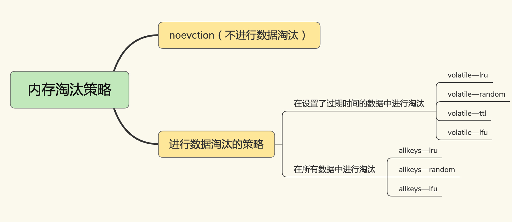

Redis-cachce-eliminate


内存淘汰策略





### 如何识别淘汰数据

noeviction：redis 在使用的内存空间超过 maxmemory 值时，并不会淘汰数据

volatile-ttl： 在筛选时，会针对设置了过期时间的键值对，根据过期时间的先后进行删除，越早过期的越先被删除。volatile-random 就像它的名称一样，在设置了过期时间的键值对中，进行随机删除。

volatile-lru： 使用 LRU 算法筛选设置了过期时间的键值对。

volatile-lfu： 使用 LFU 算法选择设置了过期时间的键值对。

allkeys-random： 从所有键值对中随机选择并删除数据；

allkeys-lru： 使用 LRU 算法在所有数据中进行筛选。

allkeys-lfu： 使用 LFU 算法在所有数据中进行筛选。


### 如何处理淘汰的数据

1、判断是否为脏数据（与后端数据对比）

2、如何脏数据，写回数据库


### Redis 的 LRU 算法

Redis 默认会记录每个数据的最近一次访问的时间戳（由键值对数据结构 RedisObject 中的 lru 字段记录）。然后，Redis 在决定淘汰的数据时，第一次会随机选出 N 个数据（参考下面配置项），把它们作为一个候选集合。接下来，Redis 会比较这 N 个数据的 lru 字段，把 lru 字段值最小的数据从缓存中淘汰出去。


配置项

```
CONFIG SET maxmemory-samples 100
```


