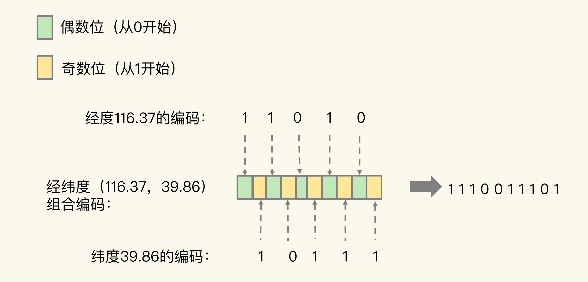

redis-geo

### GeoHash 算法

1、将经（纬）度划分为 2^N 份。从 0 开始，依次递增，得到经度和维度的编码

2、对经（纬）度的编码进行组合：最终编码值的偶数位上依次是经度的编码值，奇数位上依次是纬度的编码值，其中，偶数位从 0 开始，奇数位从 1 开始。

其中：

1、经度范围：-180，180

2、纬度范围：-85.05112878，85.05112878

### 参考

https://graphics.stanford.edu/~seander/bithacks.html#InterleaveBMN

http://stackoverflow.com/questions/4909263