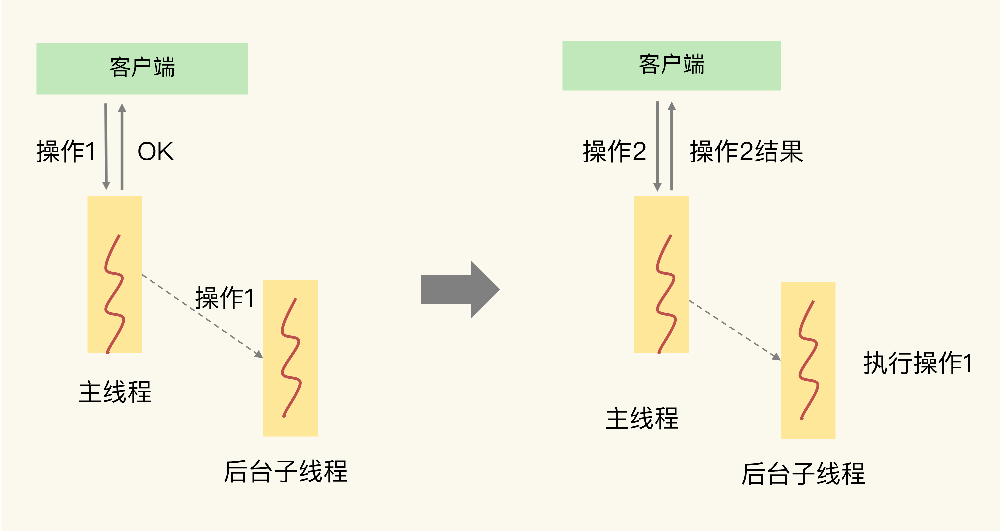

## Redis 变慢的原因

### Redis是多线程还是单线程

Redis 的单线程指 Redis 的网络 IO 和键值对读写由一个线程来完成的（这是 Redis 对外提供键值对存储服务的主要流程），Redis 的持久化、异步删除、集群数据同步等功能是由其他线程而不是主线程来执行的，所以严格来说，Redis 并不是单线程

### 为什么用单线程？
多线程会有共享资源的并发访问控制问题，为了避免这些问题，Redis 采用了单线程的模式，而且采用单线程对于 Redis 的内部实现的复杂度大大降低

### 为什么单线程就挺快？
1.Redis 大部分操作是在内存上完成，并且采用了高效的数据结构如哈希表和跳表
2.Redis 采用多路复用，能保证在网络 IO 中可以并发处理大量的客户端请求，实现高吞吐率

### Redis 6.0 版本为什么又引入了多线程？
Redis 的瓶颈不在 CPU ，而在内存和网络，内存不够可以增加内存或通过数据结构等进行优化
但 Redis 的网络 IO 的读写占用了发部分 CPU 的时间，如果可以把网络处理改成多线程的方式，性能会有很大提升
所以总结下 Redis 6.0 版本引入多线程有两个原因
1.充分利用服务器的多核资源
2.多线程分摊 Redis 同步 IO 读写负荷

### 如何判断 Redis 变慢了

1、本机执行 redis-cli --intrinsic-latency 120 测量 redis 的本机性能基线

2、iperf 测量跨网络的基线

2、如果你观察到的 Redis 运行时延迟是其基线性能的 2 倍及以上，就可以认定 Redis 变慢了

3、观察 slowlog

4、latency monitor 工具

### Redis 变慢的因素：

任意一个请求在server中一旦发生耗时，都会影响整个server的性能，也就是说后面的请求都要等前面这个耗时请求处理完成，自己才能被处理到。耗时的操作包括以下几种：

客户端交互

1、bigkey操作：写入一个bigkey在分配内存时需要消耗更多的时间，同样，删除bigkey释放内存同样会产生耗时；`redis-cli -h $host -p $port --bigkeys`
2、使用复杂度为 O(N)的命令：一般为集合全查询和聚合操作。例如SMEMBERS,HGETALL,KEYS,SORT/SUNION/ZUNIONSTORE，例如lrange key 0 -1一次查询全量数据；
3、大量key集中过期：Redis的过期机制也是在主线程中执行的，大量key集中过期会导致处理一个请求时，耗时都在删除过期key，耗时变长；
4、清空数据操作。FLUSHDB，FLUSHALL

5、大量并发请求：虽然采用IO多路复用机制，但是读写客户端数据依旧是同步IO，只能单线程依次读取客户端的数据，无法利用到CPU多核。

服务端

1、fork操作：主从全量同步生成RDB、AOF 重写、写RDB，虽然采用fork子进程生成数据快照，但fork这一瞬间也是会阻塞整个线程的，实例越大，阻塞时间越久；`redis info中latest_fork_usec`

2、淘汰策略：淘汰策略也是在主线程执行的，当内存超过Redis内存上限后，每次写入都需要淘汰一些key，也会造成耗时变长；

3、内存碎片整理：内存碎片整理会占用一定的CPU，并且在数据拷贝的时候是阻塞的。

4、服务端缓存客户端读写的缓冲区溢出：

磁盘读写

1、AOF日志同步写（配置为always）：每次写入都需要把这个操作刷到磁盘，写磁盘的速度远比写内存慢，会拖慢Redis的性能。

2、内存不够，导致 swap

主从同步

1、清空已有数据库FLUSHDB

2、从节点加载 RDB 文件

3、主从节点之间的缓冲区溢出：输入缓冲区溢出，输出缓冲区溢出

集群数据复制

1、迁移 bigKey

2、主从同步的输出缓冲区溢出。复制积压缓冲区溢出。

·g、rehash 操作

2、并发量非常大时，单线程读写客户端IO数据存在性能瓶颈，虽然采用IO多路复用机制，但是读写客户端数据依旧是同步IO，只能单线程依次读取客户端的数据，无法利用到CPU多核。

针对问题1，一方面需要业务人员去规避，一方面Redis在4.0推出了lazy-free机制，把bigkey释放内存的耗时操作放在了异步线程中执行，降低对主线程的影响。

针对问题2，Redis在6.0推出了多线程，可以在高并发场景下利用CPU多核多线程读写客户端数据，进一步提升server性能，当然，只是针对客户端的读写是并行的，每个命令的真正操作依旧是单线程的。

增删查改

1、集合全量查询和聚合操作，比如O(N)：SCAN 命令分批读取

2、删除bigkey操作，释放大量内存：UNLINK

3、清空数据库。 FLUSHDB，FLUSHALL ：增加 ASYNC

4、Hash 冲突

IO 操作

1、RDB 文件太大：一般 2-4G 左右

2、AOF 回写策略：子进程

3、加载 RDB  文件：无解

网络延迟

1、主从同步

2、不同节点间槽位同步

不可异步化的

1、加载RDB 文件

2、全量查询和聚合操作

结论

Redis 4.0 之前，用一些折中方案。

Redis 4.0 之后，通过相关的异步命令、。

## 附录

### 思考题

#### 关于SCAN讨论最多的问题就是，Redis在做Rehash时，会不会漏key或返回重复的key。

在使用SCAN命令时，不会漏key，但可能会得到重复的key，这主要和Redis的Rehash机制有关。Redis的所有key存在一个全局的哈希表中，如果存入的key慢慢变多，在达到一定阈值后，为了避免哈希冲突导致查询效率降低，这个哈希表会进行扩容。与之对应的，key数量逐渐变少时，这个哈希表会缩容以节省空间。

1、为什么不会漏key？Redis在SCAN遍历全局哈希表时，采用*高位进位法*的方式遍历哈希桶（可网上查询图例，一看就明白），当哈希表扩容后，通过这种算法遍历，旧哈希表中的数据映射到新哈希表，依旧会保留原来的先后顺序，这样就可以保证遍历时不会遗漏也不会重复。

2、为什么SCAN会得到重复的key？这个情况主要发生在哈希表缩容。已经遍历过的哈希桶在缩容时，会映射到新哈希表没有遍历到的位置，所以继续遍历就会对同一个key返回多次。

SCAN是遍历整个实例的所有key，另外Redis针对Hash/Set/Sorted Set也提供了HSCAN/SSCAN/ZSCAN命令，用于遍历一个key中的所有元素，建议在获取一个bigkey的所有数据时使用，避免发生阻塞风险。

但是使用HSCAN/SSCAN/ZSCAN命令，返回的元素数量与执行SCAN逻辑可能不同。执行SCAN $cursor COUNT $count时一次最多返回count个数的key，数量不会超过count。

但Hash/Set/Sorted Set元素数量比较少时，底层会采用intset/ziplist方式存储，如果以这种方式存储，在执行HSCAN/SSCAN/ZSCAN命令时，会无视count参数，直接把所有元素一次性返回，也就是说，得到的元素数量是会大于count参数的。当底层转为哈希表或跳表存储时，才会真正使用发count参数，最多返回count个元素。

此外，

Redis cluster模式下不支持跨节点的SCAN操作，要想得到整个集群的SCAN结果，可以遍历每个节点，分别进行SCAN操作，然后在客户端合并结果。

另外有一个方法，是可以用Hash Tag，也就是在键值对的key中使用花括号{}，例如{user:}1, {user:}2这样。Redis cluster会针对花括号中的部分进行哈希，这样可以把具有相同前缀的key分配到同一个哈希槽里面。不过，这个方法的潜在风险是：大量相同前缀的key被分配到同一个哈希槽里面了，会导致数据在哈希槽之间分布不均衡。如果要用这个方法，需要评估下key的分布情况。

#### redis 过期 key 机制

Redis 键值对的 key 可以设置过期时间。默认情况下，Redis 每 100 毫秒会删除一些过期 key，具体的算法如下：采样 ACTIVE_EXPIRE_CYCLE_LOOKUPS_PER_LOOP 个数的 key，并将其中过期的 key 全部删除；如果超过 25% 的 key 过期了，则重复删除的过程，直到过期 key 的比例降至 25% 以下。ACTIVE_EXPIRE_CYCLE_LOOKUPS_PER_LOOP 是 Redis 的一个参数，默认是 20，那么，一秒内基本有 200 个过期 key 会被删除。这一策略对清除过期 key、释放内存空间很有帮助。如果每秒钟删除 200 个过期 key，并不会对 Redis 造成太大影响。但是，如果触发了上面这个算法的第二条，Redis 就会一直删除以释放内存空间。

#### AOF 导致阻塞的原因

AOF 重写会对磁盘进行大量 IO 操作，同时，fsync 又需要等到数据写到磁盘后才能返回，所以，当 AOF 重写的压力比较大时，就会导致 fsync 被阻塞。虽然 fsync 是由后台子线程负责执行的，但是，主线程会监控 fsync 的执行进度。当主线程使用后台子线程执行了一次 fsync，需要再次把新接收的操作记录写回磁盘时，如果主线程发现上一次的 fsync 还没有执行完，那么它就会阻塞。所以，如果后台子线程执行的 fsync 频繁阻塞的话（比如 AOF 重写占用了大量的磁盘 IO 带宽），主线程也会阻塞，导致 Redis 性能变慢。

由于 fsync 后台子线程和 AOF 重写子进程的存在，主 IO 线程一般不会被阻塞。但是，如果在重写日志时，AOF 重写子进程的写入量比较大，fsync 线程也会被阻塞，进而阻塞主线程，导致延迟增加。

其实，在有些场景中（例如 Redis 用于缓存），数据丢了还可以从后端数据库中获取，并不需要很高的数据可靠性。如果业务应用对延迟非常敏感，但同时允许一定量的数据丢失，那么，可以把配置项 no-appendfsync-on-rewrite 设置为 yes，如下所示：

#### swap 导致阻塞

通常，触发 swap 的原因主要是物理机器内存不足，对于 Redis 而言，有两种常见的情况：Redis 实例自身使用了大量的内存，导致物理机器的可用内存不足；和 Redis 实例在同一台机器上运行的其他进程，在进行大量的文件读写操作。文件读写本身会占用系统内存，这会导致分配给 Redis 实例的内存量变少，进而触发 Redis 发生 swap。

这里有个重要的地方，当出现百 MB，甚至 GB 级别的 swap 大小时，就表明，此时，Redis 实例的内存压力很大，很有可能会变慢。所以，swap 的大小是排查 Redis 性能变慢是否由 swap 引起的重要指标

#### 内存碎片的成因及解决方案

成因

内因：内存分配器策略。每个分片是 2 的 n 次方

外因：Redis 的大小不一的键值对和键值对修改删除带来的内存空间变化。

判断标准

info memory 中的 mem_fragmentation_ratio = used_memory_rss/ used_memory

mem_fragmentation_ratio 大于 1 但小于 1.5 属于正常，大于 1.5 就需要采取一些措施处理了

配置方法

config set activedefrag yes

1、active-defrag-ignore-bytes 100mb ：表示内存碎片的字节数达到 100MB 时，开始清理；

2、active-defrag-threshold-lower 10：表示内存碎片空间占操作系统分配给 Redis 的总空间比例达到 10% 时，开始清理。

3、active-defrag-cycle-min 25： 表示自动清理过程所用 CPU 时间的比例不低于 25%，保证清理能正常开展；

4、active-defrag-cycle-max 75：表示自动清理过程所用 CPU 时间的比例不高于 75%，一旦超过，就停止清理，从而避免在清理时，大量的内存拷贝阻塞 Redis，导致响应延迟升高。

#### 如果 mem_fragmentation_ratio 小于 1 了，Redis 的内存使用是什么情况呢？会对 Redis 的性能和内存空间利用率造成什么影响？

mem_fragmentation_ratio小于1，说明used_memory_rss小于了used_memory，这意味着操作系统分配给Redis进程的物理内存，要小于Redis实际存储数据的内存

swap：Redis没有足够的物理内存可以使用了，这会导致Redis一部分内存数据会被换到Swap中，之后当Redis访问Swap中的数据时，延迟会变大，性能下降。

内存空白页：实例启动后分配器分配一定大小的内存空间没进行写入所以操作系统实际上并没给此分配空间映射任何页面导致的初始阶段RSS小于实际used,且通过批量往节点中增加数据,内存碎片率会升高至1之上。

#### 缓冲区溢出原理分析

服务器和客户端缓冲区溢出

输入缓冲区

成因：

1、写入 bigkey

2、服务端处理请求的速度过慢，导致阻塞。

解决输入缓冲区溢出问题：

client list 中的 qbuf + qbuf-free 为客户端缓冲大小（固定最大值为 1G，不可变）。

1、避免 bigkey 写入

2、提高服务端处理请求速度

3、控制客户端端数量：每个客户端都占用相同的大小。客户端越多，占用 buf 越多。

输出缓冲区

成因：

1、返回 bigkey 的内容

2、monitor 命令

3、缓冲区大小设置不合理

解决办法：

1、避免 bigkey 操作返回大量数据结果；

2、避免在线上环境中持续使用 MONITOR 命令。

3、使用 client-output-buffer-limit 设置合理的缓冲区大小上限，或是缓冲区连续写入时间和写入量上限。

主从集群中全量复制

成因

1、在全量复制时，从节点接收和加载 RDB 较慢，同时主节点接收到了大量的写命令，写命令在复制缓冲区中就会越积越多，最终导致溢出。

解决办法

1、控制主节点保存的数据量大小，一般为 2-4G

2、设置 client-output-buffer-limit 配置项。`config set client-output-buffer-limit slave 512mb 128mb 60`

3、控制从节点数量。复制缓冲区是所有从节点复制缓冲区之和。

主从集群中的增量复制

成因

1、复制积压缓冲区是一个大小有限的环形缓冲区。当主节点把复制积压缓冲区写满后，会覆盖缓冲区中的旧命令数据。如果从节点还没有同步这些旧命令数据，就会造成主从节点间重新开始执行全量复制。

解决办法

1、调整 repl_backlog_size 的大小

总结

1、针对命令数据发送过快过大的问题

对于普通客户端来说可以避免 bigkey

对于复制缓冲区来说，就是避免过大的 RDB 文件。

2、针对命令数据处理较慢的问题

减少 Redis 主线程上的阻塞操作，例如使用异步的删除操作。

3、针对缓冲区空间过小的问题

使用 client-output-buffer-limit 配置项设置合理的输出缓冲区、复制缓冲区和复制积压缓冲区大小。

输入缓冲区的大小默认是固定的，我们无法通过配置来修改它，除非直接去修改 Redis 源码。

4、pipeline 中命令缓冲区也会导致缓冲区溢出。

另外，主从同步延迟，数据积压在主库上的从库输出缓冲区中，这个缓冲区内存占用变大，不会超过maxmemory导致淘汰数据。只有普通客户端和订阅客户端的输出缓冲区内存增长，超过maxmemory时，才会淘汰数据。