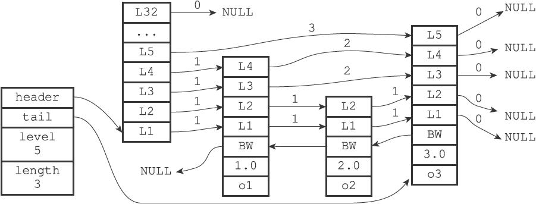
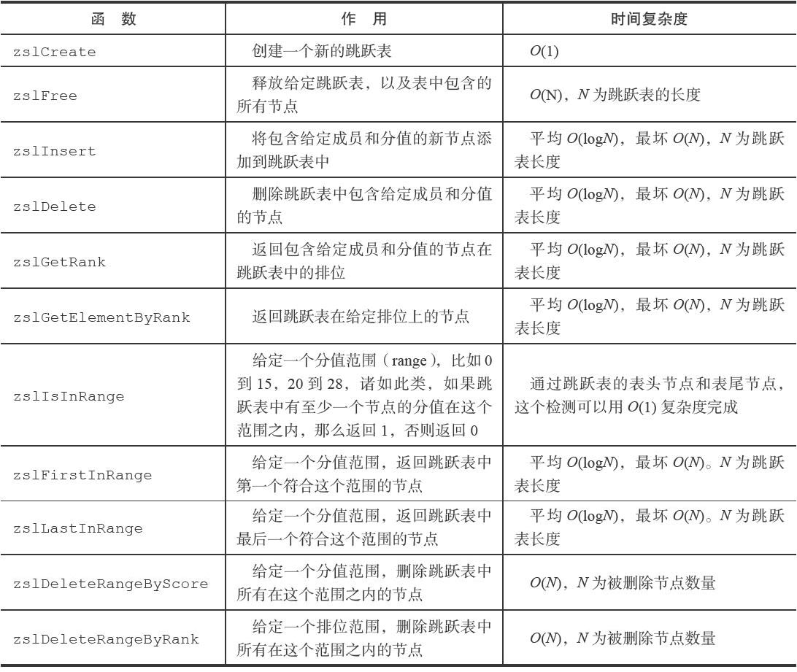

skiplist

##目标

有序链表

## 实现思路

跳跃表

## 特点

1. 分层索引
2. 以空间换取查找速度
3. 算法复杂度 平均 O(logN)，最坏 O(N)

## 数据结构



### 跳跃表节点

```c
#define ZSKIPLIST_MAXLEVEL 64 /* Should be enough for 2^64 elements */
#define ZSKIPLIST_P 0.25      /* Skiplist P = 1/4 */

typedef struct zskiplistNode {
    sds ele;
    double score;
    struct zskiplistNode *backward;
    struct zskiplistLevel {
        struct zskiplistNode *forward;
        unsigned long span;
    } level[];
} zskiplistNode;
```

其中：

* ele：存储字符串

* score：ele 排序的依据。如果 score 相同，比较 ele 的字典序

* backward：后退指针，只能指向当节点最底层的前一个节点，头节点和第一个节点的 backward 指向 NULL。反向遍历时使用该指针

* length：元素个数

* level：柔性数组，每个节点的长度不一样。从 1 开始，最大 64

* forward：当前节点的下一个节点，**这里的节点指的是 zskiplistNode，在理解插入是非常关键**。

* span：forward 指向的节点与当前节点的跨度，不同 level 的 span 不一样


### 跳跃表结构

```c
typedef struct zskiplist {
    struct zskiplistNode *header, *tail;
    unsigned long length;
    int level;
} zskiplist;
```

其中：

* header：跳跃表的头节点，头节点比较特殊，level 为 64，ele 为 NULL，score 为 0，不计入总长度。
* tail：尾节点
* length：跳跃表长度（不包括头节点）
* level：跳跃表的高度，初始化为 1

### 核心 API

### 创建跳表

```java
/* Create a skiplist node with the specified number of levels.
 * The SDS string 'ele' is referenced by the node after the call. */
zskiplistNode *zslCreateNode(int level, double score, sds ele) {
    zskiplistNode *zn =
        zmalloc(sizeof(*zn)+level*sizeof(struct zskiplistLevel));
    zn->score = score;
    zn->ele = ele;
    return zn;
}

/* Create a new skiplist. */
zskiplist *zslCreate(void) {
    int j;
    zskiplist *zsl;

    zsl = zmalloc(sizeof(*zsl));
    zsl->level = 1;
    zsl->length = 0;
    zsl->header = zslCreateNode(ZSKIPLIST_MAXLEVEL,0,NULL);
    for (j = 0; j < ZSKIPLIST_MAXLEVEL; j++) {
        zsl->header->level[j].forward = NULL;
        zsl->header->level[j].span = 0;
    }
    zsl->header->backward = NULL;
    zsl->tail = NULL;
    return zsl;
}
```


### 层高

```c
int zslRandomLevel(void) {
    int level = 1;
    while ((random()&0xFFFF) < (ZSKIPLIST_P * 0xFFFF))
        level += 1;
    return (level<ZSKIPLIST_MAXLEVEL) ? level : ZSKIPLIST_MAXLEVEL;
}
```

幂次定律：

层高的期望，P = ZSKIPLIST_P = 0.25

1. 节点层高为 1 的概率 (1-p)
2. 节点层高为 2 的概率 p*(1-p)
3. 节点层高为 3 的概率 p^2*(1-p)
4. ...
5. 节点层高为 n  的概率 p^n*(1-p)

期望

E = 1 * (1-p) + 2 * p*(1-p) + ... + p^2 * (1-p)

   =  (1 - p^(n+1))/(1-p)

   = 1/(1-p)

### 插入节点

#### 插入步骤

1、查找要插入的位置

2、调整跳跃表的高度

3、插入节点

4、调整 backward


```java
zskiplistNode *zslInsert(zskiplist *zsl, double score, sds ele) {
    zskiplistNode *update[ZSKIPLIST_MAXLEVEL], *x;
    unsigned int rank[ZSKIPLIST_MAXLEVEL];
    int i, level;

    serverAssert(!isnan(score));
    x = zsl->header;
    for (i = zsl->level-1; i >= 0; i--) {
        /* store rank that is crossed to reach the insert position */
        rank[i] = i == (zsl->level-1) ? 0 : rank[i+1];
        while (x->level[i].forward &&
                (x->level[i].forward->score < score ||
                    (x->level[i].forward->score == score &&
                    sdscmp(x->level[i].forward->ele,ele) < 0)))
        {
            rank[i] += x->level[i].span;
            x = x->level[i].forward;
        }
        // 这里的 update[i] 为 zskiplistNode。而不是 zskiplistLevel
        update[i] = x;
    }
    /* we assume the element is not already inside, since we allow duplicated
     * scores, reinserting the same element should never happen since the
     * caller of zslInsert() should test in the hash table if the element is
     * already inside or not. */
    level = zslRandomLevel();
    if (level > zsl->level) {
        for (i = zsl->level; i < level; i++) {
            rank[i] = 0;
            update[i] = zsl->header;
            update[i]->level[i].span = zsl->length; // update[i] 的 span 也即 zsl->header->level[i].span
        }
        zsl->level = level;
    }
    x = zslCreateNode(level,score,ele);
    // 1. 更新关联节点的 level 属性
    for (i = 0; i < level; i++) {
        // 链表的插入
        x->level[i].forward = update[i]->level[i].forward;
        update[i]->level[i].forward = x;

        /* update span covered by update[i] as x is inserted here */
        // 难点：
        x->level[i].span = update[i]->level[i].span - (rank[0] - rank[i]);
        update[i]->level[i].span = (rank[0] - rank[i]) + 1;
    }

    /* increment span for untouched levels */
    for (i = level; i < zsl->level; i++) {
        update[i]->level[i].span++;
    }

  	// 2. 更新管理节点的 backward
    x->backward = (update[0] == zsl->header) ? NULL : update[0];
    if (x->level[0].forward)
        x->level[0].forward->backward = x;
    else
        zsl->tail = x;
    zsl->length++;
    return x;
}
```

核心在于理解 rank 和 update 的意义：

update[i]：被更新节点在第 i 层的前一个节点，在插入节点的时候，用于更新节点指针。

rank[i]：从header 节点到 update[i] 节点所经历的 span 之和


### 删除节点

1、查找需要更新的节点

2、设置 span 和 forward

```c
void zslDeleteNode(zskiplist *zsl, zskiplistNode *x, zskiplistNode **update) {
    int i;
    // 更新 forward 和 span
    for (i = 0; i < zsl->level; i++) {
        if (update[i]->level[i].forward == x) {
            update[i]->level[i].span += x->level[i].span - 1;
            update[i]->level[i].forward = x->level[i].forward;
        } else {
            update[i]->level[i].span -= 1;
        }
    }
    // 更新 backward
    if (x->level[0].forward) {
        x->level[0].forward->backward = x->backward;
    } else {
        zsl->tail = x->backward;
    }
    // 调整高度
    while(zsl->level > 1 && zsl->header->level[zsl->level-1].forward == NULL)
        zsl->level--;
    zsl->length--;
}

int zslDelete(zskiplist *zsl, double score, sds ele, zskiplistNode **node) {
    zskiplistNode *update[ZSKIPLIST_MAXLEVEL], *x;
    int i;

    x = zsl->header;
    // 查找要删除的节点
    for (i = zsl->level-1; i >= 0; i--) {
        while (x->level[i].forward &&
                (x->level[i].forward->score < score ||
                    (x->level[i].forward->score == score &&
                     sdscmp(x->level[i].forward->ele,ele) < 0)))
        {
            x = x->level[i].forward;
        }
        update[i] = x;
    }
    /* We may have multiple elements with the same score, what we need
     * is to find the element with both the right score and object. */
    // 删除节点
    x = x->level[0].forward;
    if (x && score == x->score && sdscmp(x->ele,ele) == 0) {
        zslDeleteNode(zsl, x, update);
        if (!node)
            zslFreeNode(x);
        else
            *node = x;
        return 1;
    }
    return 0; /* not found */
}
```


## API 概览



```c
zskiplist *zslCreate(void);
void zslFree(zskiplist *zsl);
zskiplistNode *zslInsert(zskiplist *zsl, double score, sds ele);
unsigned char *zzlInsert(unsigned char *zl, sds ele, double score);
int zslDelete(zskiplist *zsl, double score, sds ele, zskiplistNode **node);
zskiplistNode *zslFirstInRange(zskiplist *zsl, zrangespec *range);
zskiplistNode *zslLastInRange(zskiplist *zsl, zrangespec *range);
```

## 总结

Redis 的 skiplist 整体代码量很小，难点在于插入节点的理解。

从可扩展性来说，skiplist 的实现不够抽象。当前只支持 sds，改进点包括：ele 可以用 void，然后，比较操作使用函数指针。

### 参考

Skip Lists: A Probabilistic Alternative to Balanced Trees 做了如下修改

1. 允许重复的 score
2. 不是通过 key 比较而是 satellite data
3. level 1 是一个双向链表，主要是支持 ZREVRANGE 操作

## 思考题

1. 谈谈 skiplist 的特性
2. 简单描述 skiplist 的查找元素过程
3. 简单描述 skiplist 的插入和删除元素过程