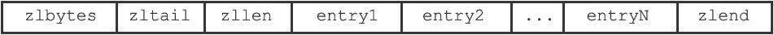
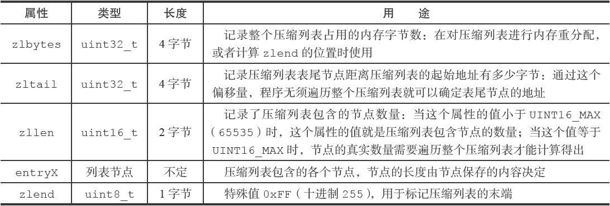
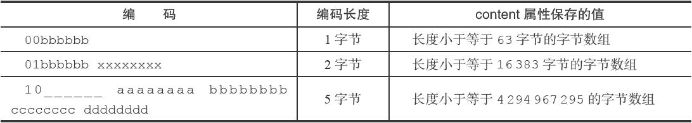
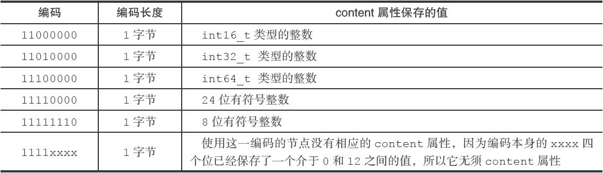
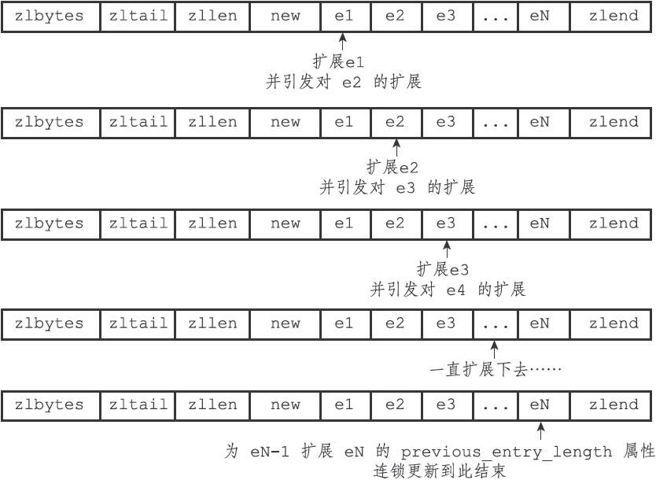
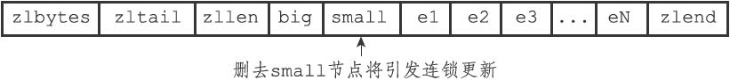
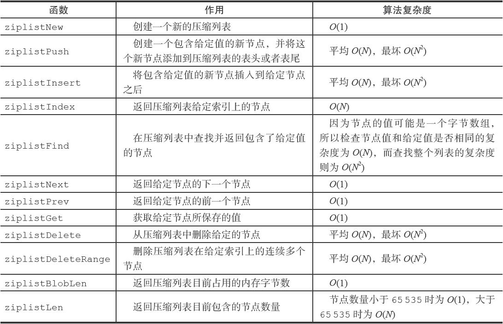

ziplist

08-02： 当前看之前的笔记，并不能支撑自己快速复习的目的。需要进一步优化，尤其是删除和更新等操作，需要进一步图文描述，当前描述过于简单，可能当时理解得比较清楚，但现在来看，是文档支撑度不够的。


## 目标

1. 存储的有效性
2. 速度

## 实现思路

1. 双向链表
2. 支持 string 和 integer
3. 在任意一端  push 和 pop 为 O(1)

## 数据结构

ziplist





1. zlbytes：4 字节，链表占有的 byte 数量
2. zltail：4 字节，最后一个元素的偏移量。pop元素不需要遍历
3. zllen：2 字节，当数组个数超过 2^16-2 时，需要通过遍历才能知道元素个数
4. entry：具体编码元素信息
5. zlend：list 的结束，固定为 255


entry


1. prevlen：前一个元素的长度，便于反向遍历
2. encoding：类型编码

如下变体：

`<prevlen from 0 to 253> <encoding> <entry>`

前一个元素长度小于 254

`0xFE <4 bytes unsigned little endian prevlen> <encoding> <entry>`

前一个元素长度大于等于 254


encoding 表示元素类型信息





* 00pppppp： 表示字符串，长度小于等于 63。pppppp 表示字符串实际长度
* 01pppppp|qqqqqqqq：表示字符串，长度小于等于 16383。pppppp|qqqqqqqq 表示字符串实际长度，为bigendian
* 10000000|qqqqqqqq|rrrrrrrr|ssssssss|tttttttt：表示字符串，长度大于等于 16384。pppppp|qqqqqqqq 表示字符串实际长度，为big-endian
* 11000000：entry-data为整数 int16_t (2 bytes)。
* 11010000：entry-data为整数 int32_t (4 bytes)。
* 11100000：entry-data为整数 int64_t (8 bytes)。
* 11110000： entry-data为 24bit 有符合整数
* 11111110：entry-data 为 8bit 有符合整数
* 1111xxxx：此时 entry-data 长度为 0。 xxxx 为 0 到 12 。其中 0001 为 0，1101 为 12。
* 11111111：zip 结束


如下宏定义，定位到 ziplist 的不同部分

```c
// zlbytes 的值
#define ZIPLIST_BYTES(zl)       (*((uint32_t*)(zl)))

// zltail 的值，需要注意的是 ziptail 为距离最后一个元素的距离。可以定位到最后一个元素
#define ZIPLIST_TAIL_OFFSET(zl) (*((uint32_t*)((zl)+sizeof(uint32_t))))

// zllen 的值，如果超过  2^16-2 时，需要通过遍历才能知道元素个数
#define ZIPLIST_LENGTH(zl)      (*((uint16_t*)((zl)+sizeof(uint32_t)*2)))

// 头的长度
#define ZIPLIST_HEADER_SIZE     (sizeof(uint32_t)*2+sizeof(uint16_t))

// zlend 的长度
#define ZIPLIST_END_SIZE        (sizeof(uint8_t))

// ziplist 第一个 entry 的首地址
#define ZIPLIST_ENTRY_HEAD(zl)  ((zl)+ZIPLIST_HEADER_SIZE)

// ziplist 最后一个元素的首地址
#define ZIPLIST_ENTRY_TAIL(zl)  ((zl)+intrev32ifbe(ZIPLIST_TAIL_OFFSET(zl)))

// zlend 的首地址
#define ZIPLIST_ENTRY_END(zl)   ((zl)+intrev32ifbe(ZIPLIST_BYTES(zl))-1)
```


## 核心 API

### ziplist 解码

```c
typedef struct zlentry {
    unsigned int prevrawlensize; // prelen 用几个字节表示长度
    unsigned int prevrawlen;     // prelen 的值
    unsigned int lensize;        // encoding 用几个字节数表示，1 或 5
    unsigned int len;            // encoding 内容的长度，string 或 integer 长度(1，2，3，4，8，0)
    unsigned int headersize;     // prevrawlensize + lensize
    unsigned char encoding;      // encoding 本身
    unsigned char *p;            // 
} zlentry;
```


### 解码

将 ziplis 解码为 zlentry

```c
void zipEntry(unsigned char *p, zlentry *e) {
    ZIP_DECODE_PREVLEN(p, e->prevrawlensize, e->prevrawlen);
    ZIP_DECODE_LENGTH(p + e->prevrawlensize, e->encoding, e->lensize, e->len);
    e->headersize = e->prevrawlensize + e->lensize;
    e->p = p;
}

#define ZIP_BIG_PREVLEN 254
// 小于 254 为 1 个字节，大于 254 为 5 个字节
#define ZIP_DECODE_PREVLENSIZE(ptr, prevlensize) do {                          \
    if ((ptr)[0] < ZIP_BIG_PREVLEN) {                                          \
        (prevlensize) = 1;                                                     \
    } else {                                                                   \
        (prevlensize) = 5;                                                     \
    }                                                                          \
} while(0);

// 解析 prelen
#define ZIP_DECODE_PREVLEN(ptr, prevlensize, prevlen) do {                     \
    ZIP_DECODE_PREVLENSIZE(ptr, prevlensize);                                  \
    if ((prevlensize) == 1) {                                                  \
        (prevlen) = (ptr)[0];                                                  \
    } else if ((prevlensize) == 5) {                                           \
        assert(sizeof((prevlen)) == 4);                                    \
        memcpy(&(prevlen), ((char*)(ptr)) + 1, 4);                             \
        memrev32ifbe(&prevlen);                                                \
    }                                                                          \
} while(0);

#define ZIP_STR_MASK 0xc0
#define ZIP_INT_MASK 0x30
#define ZIP_STR_06B (0 << 6)
#define ZIP_STR_14B (1 << 6)
#define ZIP_STR_32B (2 << 6)
#define ZIP_INT_16B (0xc0 | 0<<4)
#define ZIP_INT_32B (0xc0 | 1<<4)
#define ZIP_INT_64B (0xc0 | 2<<4)
#define ZIP_INT_24B (0xc0 | 3<<4)
#define ZIP_INT_8B 0xfe

#define ZIP_ENTRY_ENCODING(ptr, encoding) do {  \
    (encoding) = (ptr[0]); \
    if ((encoding) < ZIP_STR_MASK) (encoding) &= ZIP_STR_MASK; \
} while(0)

// entry 保存为整数时，entry-data 的长度。
unsigned int zipIntSize(unsigned char encoding) {
    switch(encoding) {
    case ZIP_INT_8B:  return 1;
    case ZIP_INT_16B: return 2;
    case ZIP_INT_24B: return 3;
    case ZIP_INT_32B: return 4;
    case ZIP_INT_64B: return 8;
    }
    if (encoding >= ZIP_INT_IMM_MIN && encoding <= ZIP_INT_IMM_MAX)
        return 0; /* 4 bit immediate */
    panic("Invalid integer encoding 0x%02X", encoding);
    return 0;
}

// 解析 encoding
#define ZIP_DECODE_LENGTH(ptr, encoding, lensize, len) do {                    \
    ZIP_ENTRY_ENCODING((ptr), (encoding));                                     \
    if ((encoding) < ZIP_STR_MASK) {                                           \
        if ((encoding) == ZIP_STR_06B) {                                       \
            (lensize) = 1;                                                     \
            (len) = (ptr)[0] & 0x3f;                                           \
        } else if ((encoding) == ZIP_STR_14B) {                                \
            (lensize) = 2;                                                     \
            (len) = (((ptr)[0] & 0x3f) << 8) | (ptr)[1];                       \
        } else if ((encoding) == ZIP_STR_32B) {                                \
            (lensize) = 5;                                                     \
            (len) = ((ptr)[1] << 24) |                                         \
                    ((ptr)[2] << 16) |                                         \
                    ((ptr)[3] <<  8) |                                         \
                    ((ptr)[4]);                                                \
        } else {                                                               \
            panic("Invalid string encoding 0x%02X", (encoding));               \
        }                                                                      \
    } else {                                                                   \
        (lensize) = 1;                                                         \
        (len) = zipIntSize(encoding);                                          \
    }                                                                          \
} while(0);
```


### 创建 ziplist

entry 为空

```c
unsigned char *ziplistNew(void) {
    unsigned int bytes = ZIPLIST_HEADER_SIZE+ZIPLIST_END_SIZE;
    unsigned char *zl = zmalloc(bytes);
    ZIPLIST_BYTES(zl) = intrev32ifbe(bytes);
    ZIPLIST_TAIL_OFFSET(zl) = intrev32ifbe(ZIPLIST_HEADER_SIZE);
    ZIPLIST_LENGTH(zl) = 0;
    zl[bytes-1] = ZIP_END;
    return zl;
}
```


### 插入元素

1、元素编码

2、重新分配空间

3、数据复制

```c
/* Insert an entry at "p". */
unsigned char *ziplistInsert(unsigned char *zl, unsigned char *p, unsigned char *s, unsigned int slen) {
    return __ziplistInsert(zl,p,s,slen);
}

// p ：元素插入位置
// s ：待插入元素的首地址
// slen ：待插入元素的长度
unsigned char *__ziplistInsert(unsigned char *zl, unsigned char *p, unsigned char *s, unsigned int slen) {
    size_t curlen = intrev32ifbe(ZIPLIST_BYTES(zl)), reqlen;
    unsigned int prevlensize, prevlen = 0;
    size_t offset;
    int nextdiff = 0;
    unsigned char encoding = 0;
    long long value = 123456789; /* initialized to avoid warning. Using a value
                                    that is easy to see if for some reason
                                    we use it uninitialized. */
    zlentry tail;

  	// prelen 为 entry 部分长度
    /* Find out prevlen for the entry that is inserted. */
    if (p[0] != ZIP_END) {
        ZIP_DECODE_PREVLEN(p, prevlensize, prevlen);
    } else {
        unsigned char *ptail = ZIPLIST_ENTRY_TAIL(zl);
        // ziplist 存在元素
        if (ptail[0] != ZIP_END) {
            prevlen = zipRawEntryLength(ptail);
        }
    }
		// reqlen = entry-data 部分长度
    /* See if the entry can be encoded */
    if (zipTryEncoding(s,slen,&value,&encoding)) {
        /* 'encoding' is set to the appropriate integer encoding */      
        reqlen = zipIntSize(encoding);
    } else {
        /* 'encoding' is untouched, however zipStoreEntryEncoding will use the
         * string length to figure out how to encode it. */
        reqlen = slen;
    }
    /* We need space for both the length of the previous entry and
     * the length of the payload. */
    // reqlen = prelen + entry-data长度
    reqlen += zipStorePrevEntryLength(NULL,prevlen);
    // reqlen = prelen + entry-data长度 + encoding
    reqlen += zipStoreEntryEncoding(NULL,encoding,slen);

    /* When the insert position is not equal to the tail, we need to
     * make sure that the next entry can hold this entry's length in
     * its prevlen field. */
    int forcelarge = 0;
    nextdiff = (p[0] != ZIP_END) ? zipPrevLenByteDiff(p,reqlen) : 0;
    if (nextdiff == -4 && reqlen < 4) {
        nextdiff = 0;
        forcelarge = 1;
    }

    /* Store offset because a realloc may change the address of zl. */
    offset = p-zl;
    zl = ziplistResize(zl,curlen+reqlen+nextdiff);
    // p 指向待插入元素位置
    p = zl+offset;

    /* Apply memory move when necessary and update tail offset. */
    if (p[0] != ZIP_END) {
        /* Subtract one because of the ZIP_END bytes */
        memmove(p+reqlen,p-nextdiff,curlen-offset-1+nextdiff);

        /* Encode this entry's raw length in the next entry. */
        if (forcelarge)
            zipStorePrevEntryLengthLarge(p+reqlen,reqlen);
        else
            zipStorePrevEntryLength(p+reqlen,reqlen);

        /* Update offset for tail */
        ZIPLIST_TAIL_OFFSET(zl) =
            intrev32ifbe(intrev32ifbe(ZIPLIST_TAIL_OFFSET(zl))+reqlen);

        /* When the tail contains more than one entry, we need to take
         * "nextdiff" in account as well. Otherwise, a change in the
         * size of prevlen doesn't have an effect on the *tail* offset. */
        zipEntry(p+reqlen, &tail);
        if (p[reqlen+tail.headersize+tail.len] != ZIP_END) {
            ZIPLIST_TAIL_OFFSET(zl) =
                intrev32ifbe(intrev32ifbe(ZIPLIST_TAIL_OFFSET(zl))+nextdiff);
        }
    } else {
        /* This element will be the new tail. */
        ZIPLIST_TAIL_OFFSET(zl) = intrev32ifbe(p-zl);
    }

    /* When nextdiff != 0, the raw length of the next entry has changed, so
     * we need to cascade the update throughout the ziplist */
    if (nextdiff != 0) {
        offset = p-zl;
        zl = __ziplistCascadeUpdate(zl,p+reqlen);
        p = zl+offset;
    }

    /* Write the entry */
    p += zipStorePrevEntryLength(p,prevlen);
    p += zipStoreEntryEncoding(p,encoding,slen);
    if (ZIP_IS_STR(encoding)) {
        memcpy(p,s,slen);
    } else {
        zipSaveInteger(p,value,encoding);
    }
    ZIPLIST_INCR_LENGTH(zl,1);
    return zl;
}

// p 对应 entry 部分的长度
unsigned int zipRawEntryLength(unsigned char *p) {
    unsigned int prevlensize, encoding, lensize, len;
    ZIP_DECODE_PREVLENSIZE(p, prevlensize);
    ZIP_DECODE_LENGTH(p + prevlensize, encoding, lensize, len);
    return prevlensize + lensize + len;
}

// 
int zipTryEncoding(unsigned char *entry, unsigned int entrylen, long long *v, unsigned char *encoding) {
    long long value;

    if (entrylen >= 32 || entrylen == 0) return 0;
    if (string2ll((char*)entry,entrylen,&value)) {
        /* Great, the string can be encoded. Check what's the smallest
         * of our encoding types that can hold this value. */
        if (value >= 0 && value <= 12) {
            *encoding = ZIP_INT_IMM_MIN+value;
        } else if (value >= INT8_MIN && value <= INT8_MAX) {
            *encoding = ZIP_INT_8B;
        } else if (value >= INT16_MIN && value <= INT16_MAX) {
            *encoding = ZIP_INT_16B;
        } else if (value >= INT24_MIN && value <= INT24_MAX) {
            *encoding = ZIP_INT_24B;
        } else if (value >= INT32_MIN && value <= INT32_MAX) {
            *encoding = ZIP_INT_32B;
        } else {
            *encoding = ZIP_INT_64B;
        }
        *v = value;
        return 1;
    }
    return 0;
}
```


TODO


### 元素删除

1、计算待删除元素长度

2、数据复制

3、重新分配空间

```c
unsigned char *ziplistDelete(unsigned char *zl, unsigned char **p) {
    size_t offset = *p-zl;
    zl = __ziplistDelete(zl,*p,1);

    /* Store pointer to current element in p, because ziplistDelete will
     * do a realloc which might result in a different "zl"-pointer.
     * When the delete direction is back to front, we might delete the last
     * entry and end up with "p" pointing to ZIP_END, so check this. */
    *p = zl+offset;
    return zl;
}

unsigned char *__ziplistDelete(unsigned char *zl, unsigned char *p, unsigned int num) {
    unsigned int i, totlen, deleted = 0;
    size_t offset;
    int nextdiff = 0;
    zlentry first, tail;

    // p 指向最后待删除 entry 的下一个 entry
    // first 指向第一个待删 entry
    zipEntry(p, &first);
    for (i = 0; p[0] != ZIP_END && i < num; i++) {
        p += zipRawEntryLength(p);
        deleted++;
    }

    totlen = p-first.p; /* Bytes taken by the element(s) to delete. */
    if (totlen > 0) {
        // 删除之后还有元素
        if (p[0] != ZIP_END) {
            /* Storing `prevrawlen` in this entry may increase or decrease the
             * number of bytes required compare to the current `prevrawlen`.
             * There always is room to store this, because it was previously
             * stored by an entry that is now being deleted. */
            nextdiff = zipPrevLenByteDiff(p,first.prevrawlen);

            /* Note that there is always space when p jumps backward: if
             * the new previous entry is large, one of the deleted elements
             * had a 5 bytes prevlen header, so there is for sure at least
             * 5 bytes free and we need just 4. */
            p -= nextdiff;
            zipStorePrevEntryLength(p,first.prevrawlen);

            /* Update offset for tail */
            ZIPLIST_TAIL_OFFSET(zl) =
                intrev32ifbe(intrev32ifbe(ZIPLIST_TAIL_OFFSET(zl))-totlen);

            /* When the tail contains more than one entry, we need to take
             * "nextdiff" in account as well. Otherwise, a change in the
             * size of prevlen doesn't have an effect on the *tail* offset. */
            zipEntry(p, &tail);
            if (p[tail.headersize+tail.len] != ZIP_END) {
                ZIPLIST_TAIL_OFFSET(zl) =
                   intrev32ifbe(intrev32ifbe(ZIPLIST_TAIL_OFFSET(zl))+nextdiff);
            }

            /* Move tail to the front of the ziplist */
            memmove(first.p,p,
                intrev32ifbe(ZIPLIST_BYTES(zl))-(p-zl)-1);
        } else {
            /* The entire tail was deleted. No need to move memory. */
            ZIPLIST_TAIL_OFFSET(zl) =
                intrev32ifbe((first.p-zl)-first.prevrawlen);
        }

        /* Resize and update length */
        offset = first.p-zl;
        zl = ziplistResize(zl, intrev32ifbe(ZIPLIST_BYTES(zl))-totlen+nextdiff);
        ZIPLIST_INCR_LENGTH(zl,-deleted);
        p = zl+offset;

        /* When nextdiff != 0, the raw length of the next entry has changed, so
         * we need to cascade the update throughout the ziplist */
        if (nextdiff != 0)
            zl = __ziplistCascadeUpdate(zl,p);
    }
    return zl;
}
```


### 前向遍历

通过 prelen 来定位

```c
// p - p.prevlen
// 返回上一个元素的地址
unsigned char *ziplistPrev(unsigned char *zl, unsigned char *p) {
    unsigned int prevlensize, prevlen = 0;

    /* Iterating backwards from ZIP_END should return the tail. When "p" is
     * equal to the first element of the list, we're already at the head,
     * and should return NULL. */
    if (p[0] == ZIP_END) {
        p = ZIPLIST_ENTRY_TAIL(zl);
        return (p[0] == ZIP_END) ? NULL : p;
    } else if (p == ZIPLIST_ENTRY_HEAD(zl)) {
        return NULL;
    } else {
        ZIP_DECODE_PREVLEN(p, prevlensize, prevlen);
        assert(prevlen > 0);
        return p-prevlen;
    }
}
```


### 后向遍历

p 加上 entry 的长度

```c

// p += entryLen
// 返回下一个元素的地址
unsigned char *ziplistNext(unsigned char *zl, unsigned char *p) {
    ((void) zl);

    /* "p" could be equal to ZIP_END, caused by ziplistDelete,
     * and we should return NULL. Otherwise, we should return NULL
     * when the *next* element is ZIP_END (there is no next entry). */
    if (p[0] == ZIP_END) {
        return NULL;
    }

    p += zipRawEntryLength(p);
    if (p[0] == ZIP_END) {
        return NULL;
    }

    return p;
}
```


### 连锁更新





当增加或删除元素p[n]时，需要对 p[n+1] 的 一个元素的 prevlen 的长度需要调整，而调整 p[n+1] 的 prevlen 变化可能影响 p[n+2] 的 prevlen 的变化，引发连锁反应。

```c
unsigned char *__ziplistCascadeUpdate(unsigned char *zl, unsigned char *p) {
    size_t curlen = intrev32ifbe(ZIPLIST_BYTES(zl)), rawlen, rawlensize;
    size_t offset, noffset, extra;
    unsigned char *np;
    zlentry cur, next;

    while (p[0] != ZIP_END) {
        zipEntry(p, &cur);
        rawlen = cur.headersize + cur.len;
        rawlensize = zipStorePrevEntryLength(NULL,rawlen);

        /* Abort if there is no next entry. */
        if (p[rawlen] == ZIP_END) break;
        zipEntry(p+rawlen, &next);

        /* Abort when "prevlen" has not changed. */
        if (next.prevrawlen == rawlen) break;

        if (next.prevrawlensize < rawlensize) {
            /* The "prevlen" field of "next" needs more bytes to hold
             * the raw length of "cur". */
            offset = p-zl;
            extra = rawlensize-next.prevrawlensize;
            zl = ziplistResize(zl,curlen+extra);
            p = zl+offset;

            /* Current pointer and offset for next element. */
            np = p+rawlen;
            noffset = np-zl;

            /* Update tail offset when next element is not the tail element. */
            if ((zl+intrev32ifbe(ZIPLIST_TAIL_OFFSET(zl))) != np) {
                ZIPLIST_TAIL_OFFSET(zl) =
                    intrev32ifbe(intrev32ifbe(ZIPLIST_TAIL_OFFSET(zl))+extra);
            }
            
            /* Move the tail to the back. */
            memmove(np+rawlensize,
                np+next.prevrawlensize,
                curlen-noffset-next.prevrawlensize-1);
            zipStorePrevEntryLength(np,rawlen);

            /* Advance the cursor */
            p += rawlen;
            curlen += extra;
        } else {
            if (next.prevrawlensize > rawlensize) {
                /* This would result in shrinking, which we want to avoid.
                 * So, set "rawlen" in the available bytes. */
                zipStorePrevEntryLengthLarge(p+rawlen,rawlen);
            } else {
                zipStorePrevEntryLength(p+rawlen,rawlen);
            }

            /* Stop here, as the raw length of "next" has not changed. */
            break;
        }
    }
    return zl;
}           
```


## API 概览



```c
nsigned char *ziplistNew(void);
unsigned char *ziplistMerge(unsigned char **first, unsigned char **second);
unsigned char *ziplistPush(unsigned char *zl, unsigned char *s, unsigned int slen, int where);
unsigned char *ziplistIndex(unsigned char *zl, int index);
unsigned char *ziplistNext(unsigned char *zl, unsigned char *p);
unsigned char *ziplistPrev(unsigned char *zl, unsigned char *p);
unsigned int ziplistGet(unsigned char *p, unsigned char **sval, unsigned int *slen, long long *lval);
unsigned char *ziplistInsert(unsigned char *zl, unsigned char *p, unsigned char *s, unsigned int slen);
unsigned char *ziplistDelete(unsigned char *zl, unsigned char **p);
unsigned char *ziplistDeleteRange(unsigned char *zl, int index, unsigned int num);
unsigned int ziplistCompare(unsigned char *p, unsigned char *s, unsigned int slen);
unsigned char *ziplistFind(unsigned char *p, unsigned char *vstr, unsigned int vlen, unsigned int skip);
unsigned int ziplistLen(unsigned char *zl);
size_t ziplistBlobLen(unsigned char *zl);
void ziplistRepr(unsigned char *zl);
```


## 总结

ziplist 通过 tlv的格式来减少内存分配。

## 思考题

1、简述 ziplist 的数据格式？

2、简述ziplist 的插入和删除过程？

3、ziplist 的查找操作的算法复杂度是多少？请说明原因

3、ziplist 删除和更新会有什么问题？