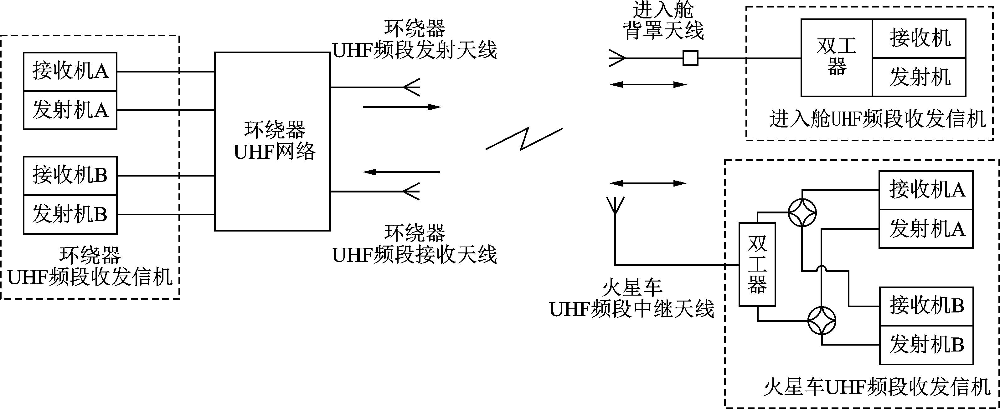
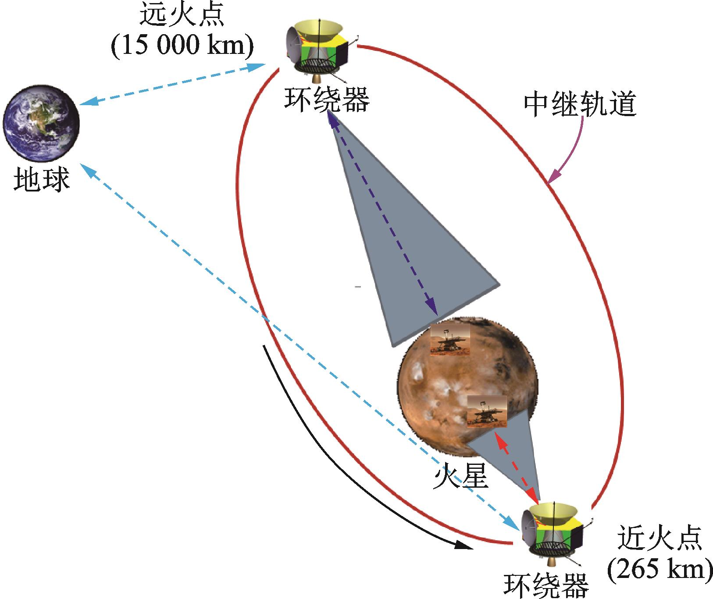

火星车系统

## 火星环境

1、磁场

2、风力

3、距离

4、加速

5、坐标

6、热

7、沙尘

8、登录冲击对系统和结构的影响

9、部件结构强度分析

20、组件固有频率计算和分析

21、热仿真研究

| 火星环境特点                                                 | 应对策略                                                     |
| ------------------------------------------------------------ | ------------------------------------------------------------ |
| 光照强度大约是月球表面的三分之一                             |                                                              |
| 距离地球最远距离长达4亿公里远                                | 自动导航                                                     |
| 火星的自转周期与地球接近，一个太阳日仅比地球长约40分钟，但火星的公转周期约是687天，所以火星每个季节的平均持续时间约是地球上的2倍。 | 自主休眠与唤醒模式                                           |
| 崎岖不平                                                     | 6 轮驱动                                                     |
| 秋季多发生沙尘天气，影响太阳板效率                           | 太阳翼的电池片是一种特殊的材料，叫超疏基材料；太阳的定向跟踪功能； |
| 重力为地球的                                                 |                                                              |
| 气压大约是地球大气的1%                                       |                                                              |
| 最高温度大约27摄氏度，晚上最低温度大约零下130摄氏度          | 纳米气凝胶保温                                               |
| 表面岩石由于侵蚀而导致的表层土壤坚硬、里层土壤松软           | 主动悬架设计                                                 |
| 近火点、远火点                                               |                                                              |

## 系统及功能建模

Arcadia 方法论

| 需求           | 任务及场景模型 | 功能模型 | 行为模式 | 架构模型 | 专业模型 |
| -------------- | -------------- | -------- | -------- | -------- | -------- |
| 运行场景分析   |                |          |          |          |          |
| 系统功能分析   |                |          |          |          |          |
| 逻辑架构定义   |                |          |          |          |          |
| 物理架构定义   |                |          |          |          |          |
| 专业设计及验证 |                |          |          |          |          |

系统架构是连接问题域和解决方案域的桥梁

## 系统定义

发射阶段

降落阶段

巡游阶段

核心部件

“祝融号”火星车由数管、供配电、测控数传、天线、热控、结构与机构、移动、工程测量、GNC、有效载荷等分系统组成，具有四大主要功能，一是能够承受整个任务过程中的力学、热、辐射等空间环境；二是落火后火星车与进入舱配合完成释放、分离任务；三是在火昼时完成火面感知、探测、移动等工作，在火夜时进入待机状态，也就是“一夜好梦”；四是能够适应火面环境，具有自主休眠唤醒能力。火星车还配置了导航地形相机、多光谱相机等6种科学载荷，可以进行科学探测；按任务要求，拥有90个火星日的设计寿命。

卫星

着陆平台

火星车

通信

火星车的超高频天线 -》中继卫星 -》大型卫星天线

操作性/运行分析

火星车外部对火星车的要求

定义各利益相关方的需求和环境

通过场景描述能力

活动的包含关系

分配活动到实体

操作性分析

1、优化火星探测随时间推移

2、执行火车活动和探测

需求

运行要求

1、着陆

2、移动

3、通讯

4、采集

功能要求

1、着陆准确

2、越障运行

3、拍照

非功能约束

成本

发射窗口

现有技术支持

祝融号

100 天 1 公里

## 系统分析

正规化的系统需求

OA  -> SA  -> LA -> PA

OA 数据流图 -> 系统任务 -> 指定角色能力 -> 功能场景/链 -> 功能接口 -> 系统分析架构

LA 功能流&组件 -> 从 LA 转换  -> 定义行为组件 -> 通过场景 定义物理行为 -> 定义行为交互接口 -> 物理架构图 -> 火星车

最终产品分解结构（EPBS）

结构

1、车身

2、立柱

3、车轮

4、定向天线

5、遥感桅杆

6、危险相机

7、

通讯

1、网络控制器

2、通讯控制器

软件

1、系统软件

2、通讯软件

操作

1、机械臂

2、转向器

3、钻探器

电脑

1、电脑系统

2、计算机控制系统

3、大气传感器

4、环境传感器

5、气象测量仪

科学仪器

1、辐射仪

2、陀螺仪

3、光谱仪

4、加速器

5、成像仪

6、显示器

7、WiFi 分离相机

8、表面成分探测仪

9、次表层探测雷达

10、表面磁场探测仪

11、多光谱相机

12、地形相机

13、氧化资源转化仪器（二氧化碳转化氧气）

显示

1、控制器

2、显示器

### 电气系统

### 操作系统

### 动力系统

能源管理

电能存储系统

太阳能

放射性同位素热点发电机

运动模式

火星车配备了先进的主动悬架，具有蠕动，抬轮，车体升降等多种运动模式

自主休眠模式（祝融号）

#### 驱动系统

车轮：六驱

连杆

越障/攀爬

### 载荷系统

图像系统

## 通信系统

超高频天线（UHF Antenna）

低增益天线：接收来自地球的控制信息

#### UHF频段中继通信系统设计

工作模式

火面巡视探测阶段，由火星车通过UHF频段收发信机和UHF频段中继天线与环绕器建立双向中继通信链路。具体工作模式详见

| 工作模式             | 码速率                                                       | 载波频率                                                     | 工作内容                                                     |
| -------------------- | ------------------------------------------------------------ | ------------------------------------------------------------ | ------------------------------------------------------------ |
| 分离及EDL过程通信    | 前向：2 kb/s（编码后）返向：2 kb/s（编码后）                 | 接收：444.6 MHz；发射：393.3 MHz                             | 传输进入舱遥测数据等内容                                     |
| 火星表面工作过程通信 | 前向：1~64 kb/s（编码后）返向：1、2、4、8、16、32、64、128、256、512、1 024、2 048 kb/s（编码后） | 接收：435.6、437.1、439.2、444.6 MHz；发射：404.4、401.585 625、397.5、393.3 MHz | 传输火星车有效载荷设备数据、工程参数、图像和器上遥测数据等内容 |

主要技术指标

通信体制

UHF频段中继系统采用曼彻斯特编码辅助残留载波BPSK调制的方式实现。通过采用小于π/2（弧度）的调制指数，使得信号频谱中出现离散（残留）的载波分量。同时，曼彻斯特编码功率谱密度在零频率处为零，调制信号与残留载波分量可以有效分离，通过精细滤波和窄带宽环路跟踪，实现对载波的提取跟踪。

针对残留载波调制的特点，利用科斯塔斯鉴相跟踪方式，将载波锁定在I支路，信息锁定在Q支路，避免解I、Q相位翻转的问题，减小了处理复杂度；通过多级滤波抽取模块，提取出各速率档抽头，将除载波以外的其他信息全部滤除，实现极低信噪比的跟踪；利用曼彻斯特编码的特点，将各速率抽头上的Q支路信号进行匹配相关和能量积分，通过正负能量累加判决，可在没有先验信息的情况下判断出当前传输数据的速率，实现通信码速率的自适应估计与解调

信道编码

UHF频段中继通信系统采用卷积码作为信道编码方式。卷积码采用CCSDS推荐的（7， 1/2）卷积码，在1×10-6的误码率情况下可取得约4.5 dB的信道编码增益。

中继通信协议

UHF频段中继通信系统双向通信采用CCSDS邻近空间链路协议（Proximity‑1）。火星探测任务的通信距离远，地面遥控指令时延大且弧段时间有限，无法实时控制，UHF频段中继通信的智能化和可靠性需求迫切，具体包括：需具备自主建立通信及结束通信的能力，从而摆脱对地面精确控制的依赖；需具备智能变更通信参数的能力，从而以紧贴信道的香农限进行通信，使通信弧段内传输的数据量最大；需具备自主错误重传的能力，确保前向指令和返向科学探测数据的正确性；具备重传跳出的能力，确保中继通信不中断。

（1）通信自主建立及自主结束设计

（2）通信速率自适应切换设计

（3）前返向高可靠通信设计

（4）重传跳出设计

3.3.4　码速率

针对EDL过程及环火中继轨道动态特性，探测器UHF频段中继通信系统前向支持7挡码速率，为1~64 kb/s（2*N*，*N*=0~6），返向支持12挡码速率，为1~2 048 kb/s（2*N*，*N*=0~11）。

在火星表面工作的近火段，环绕器通过UHF窄波束（±30°）实现对着陆巡视器的双向通信，并根据中继轨道变化返向码速率从1~2 048 kb/s自适应切换；在火星表面工作的远火段，通信码速率保持固定不变，前返向均为1 kb/s。

#### 通信链路设计与分析

UHF频段中继通信工作过程

（1）两器分离至环绕器抬轨

（2）环绕器抬轨完成至着陆巡视器火星大气进入

（3）EDL阶段（背罩分离前）

（4）EDL阶段（背罩分离后）

（5）火星表面工作阶段（环绕器中继轨道运行）

为保证稳定的中继通信弧段，中继轨道设计成天回归轨道，考虑到停泊轨道和遥感轨道的衔接，探测器标称中继轨道选择1天运行3圈的回归轨道，轨道周期约8.2 h。UHF频段中继通信链路的前向码速率为32 kb/s（编码后），返向码速率根据两器距离可在1~2 048 kb/s（编码后）间切换。近火通信弧段时长约10 min，由于两器距离较近，返向码速率峰值可达到2 048 kb/s（编码后），可用于下传工程遥测和大数据量载荷数据等。远火通信弧段通信时长较长，可达数个小时，但通信距离较远，导致期间UHF频段中继通信返向码速率降至系统最低值1 kb/s（编码后）。

落火后，两器最大通信距离可达15 000 km，由于两器UHF频段中继天线在不同的波束范围区域内天线增益不同，仅能在两器UHF频段中继天线±30°波束内实现最远15 000 km通信。近火通信弧段前向码速率保持32 kb/s，返向码速率在1~2 048 kb/s间切换；远火通信弧段前返向码速率保持1 kb/s。

火面工作阶段，UHF频段中继通信时机示意图

1、发送图像

2、发送坐标

3、指令接收

### 存储系统

图片保存

指令保存

### 导航系统

摄像头移动

移动控制

路径规划：

自动规划导航：障碍物检测、避障、越障

### 成像系统

目标检测

### 安全系统

1、加解密

### 数据保护系统

### 火星环境系统

## DFX

可靠性

可用性

可维护性

安全性

失效模式

1、外部天气：风力、雨

2、温度： -100度

3、熔断

4、重试

5、bit 翻转

6、热平衡

## 通信系统

## 核心组件

## 指令集

初始化指令

移动指令

转向指令

### 远程控制

1、批量发送，回传坐标

### 参考

[“天问一号”火星探测器UHF频段中继通信系统设计](https://jnuaa.nuaa.edu.cn/njhkht/article/html/202205007)