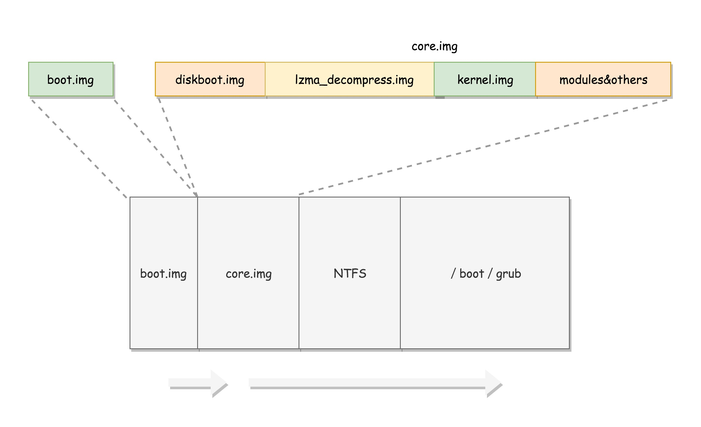

os-init

1、加电之后 CS 为 0XFFFF，IP 为 0X0000，JMP命令跳转到 0XFFFF0（处于 ROM 区域）执行 BIOS初始化工作，进行硬件自检。

2、由 grub2 install /dev/sda 将启动程序 boot.img（由 boot.S 编译而成的512 字节程序） 安装到 MBR。

3、将 boot.img 加载到内存中的 0x7c00 来运行

4、boot.img 加载 core.img

5、grub 内核加载：core.img 加载 diskboot.img，diskboot.img 依次加载 lzma_decompress.img, kernel.img

6、实模式到保护模式的切换

7、解压 kernel.img：kernel.img 对应的代码是 startup.S 以及一堆 c 文件

8、运行 kernel.img：在 startup.S 中会调用 grub_main，这是 grub kernel 的主函数。

9、grub_command_execute (“normal”, 0, 0)

10、 grub_normal_execute() 函数：这个函数中的 grub_show_menu() 会显示操作系统的列表。

11、选择启动项并执行（grub_menu_execute_entry()）： grub_cmd_linux() 函数会被调用，它会首先读取 Linux 内核镜像头部的一些数据结构，放到内存中的数据结构来，进行检查。如果检查通过，则会读取整个 Linux 内核镜像到内存。

12、启动内核：grub_command_execute (“boot”, 0, 0)

启动盘：第一扇区（也叫 MBR 扇区）的512 字节，以0XAA55结尾。

MBR 扇区：启动盘的第一个扇区。

core.img：由 lzma_decompress.img、diskboot.img、kernel.img 和一系列的模块组成

### 实模式到保护模式的转换

1、启用分段：内存里面建立段描述符表，将寄存器里面的段寄存器变成段选择子，指向某个段描述符

2、启用分页：将内存分成相等大小的块

3、打开 Gate A20：由 DATA32 call real_to_prot  完成

### Gate A20

8086 地址线20根 -> 可用内存 0 ~ FFFFF
寄存器却是16位，寻址模式为 segment(16位):offset(16位)， 最大范围变成 0FFFF0(左移了4位) + 0FFFF = 10FFEF
后果是多出来了 100000 ~ 10FFEF （访问这些地址时会回绕到 0 ~ FFEF）

80286 开始地址线变多，寻址范围大大增大，但是又必须兼容旧程序，8086在访问 100000 ~ 10FFEF时会回绕，但是 80286 不会 ，因为有第21根线的存在，会访问到实际的 100000 ~ 10FFEF 地址的内存。

Gate A20 开关：

1、实模式下 （存在的唯一理由是为了兼容8086）：

* 打开 -> 寻址100000 ~ 10FFEF会真正访问
* 关闭-> 回绕到 0 ~ FFEF

2、保护模式下：

* 打开 -> 可连续访问内存
* 关闭 -> 只能访问到奇数的1M段，即 00000-FFFFF, 200000-2FFFFF,300000-3FFFFF…