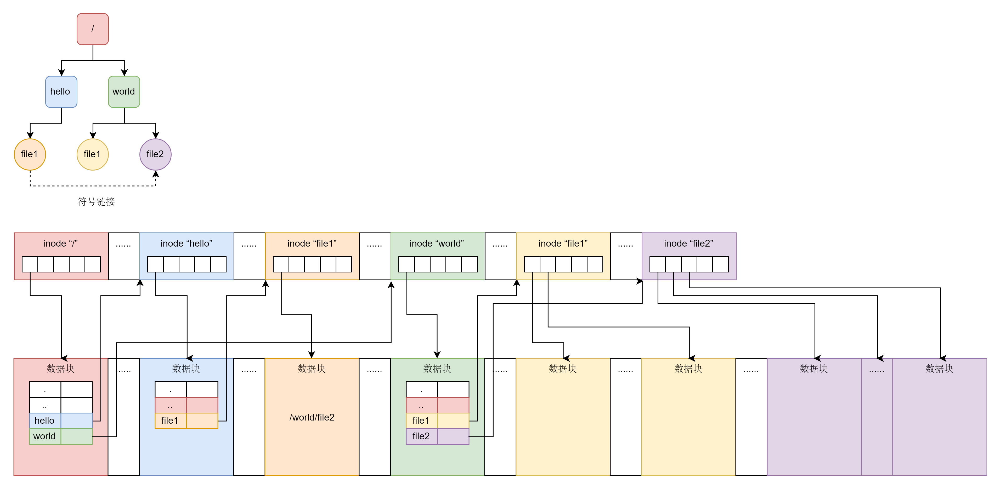

storage


## 文件系统


思考维度

1、文件系统组织形式

2、文件系统存储单元：块 4k（可配置）

3、文件系统的查询：索引结构 + 缓存

4、文件系统的数据结构


### 基本概念

1、块：文件在存储介质的基本单元，默认为 4k，在格式化磁盘的时候，可以配置

2、inode：文件索引。


### 逻辑链

磁盘文件基本单位为块

文件除了数据之外，还有文件的元信息，比如文件名，路径、权限、时间、类型等

为了有效操作（查询、保存、删除）块，引入了 inode


### 文件属性

stat 会直接返回它所指向的文件的属性

lstat 返回的就是这个符号链接的内容

fstat 则是通过文件描述符获取文件对应的属性。

```java
int stat(const char *pathname, struct stat *statbuf);
int fstat(int fd, struct stat *statbuf);
int lstat(const char *pathname, struct stat *statbuf);

struct stat {
  dev_t     st_dev;         /* ID of device containing file */
  ino_t     st_ino;         /* Inode number */
  mode_t    st_mode;        /* File type and mode */
  nlink_t   st_nlink;       /* Number of hard links */
  uid_t     st_uid;         /* User ID of owner */
  gid_t     st_gid;         /* Group ID of owner */
  dev_t     st_rdev;        /* Device ID (if special file) */
  off_t     st_size;        /* Total size, in bytes */
  blksize_t st_blksize;     /* Block size for filesystem I/O */
  blkcnt_t  st_blocks;      /* Number of 512B blocks allocated */
  struct timespec st_atim;  /* Time of last access */
  struct timespec st_mtim;  /* Time of last modification */
  struct timespec st_ctim;  /* Time of last status change */
};
```


### 文件系统



1、文件夹保存了文件夹下文件或文件夹的 inode

2、通过 inode 可以找到文件对应的数据块


#### 目录


当文件夹对应的 inode 没有设置了EXT4_INDEX_FL 时，采用上图保存；设置了EXT4_INDEX_FL时，采用下图保存。


#### Meta Block


1、文件系统中可以有多个元块组。

2、每个元块组包含 64 个块组，三个块组描述符表、三个超级块。

3、每个块组描述符表描述当前元块组的块组信息。三个元块组描述符主要是为了备份，因此完全相同。

4、每个超级块描述了整个文件系统。

4、每个块组包含超级块、块位图、inode位图、inode 列表、数据块。最多可保持 128M数据。

5、inode 位图大小为 4k。每创建一个文件就需要创建一个 inode。标记为每个文件对应 inode。

6、块位图大小为 4k。4 * 1024 * 8 = 2^15，如果每个数据块为 4k，那么每个块组 128M，每个元块组8GB。


### Ext4 文件系统

#### Extend


1、一个 i_block 包括一个 ext4_extent_header 和 4 个 ext4_extent。总大小为 4K。

2、extend_entry 分为 ext4_extent 和 ext4_extent_index。前者保存实际数据，后者保存索引，指向前者

3、除了根节点，其他都保存在一个 4k 的块里面。ext4_extent_header 12 字节。ext4_extent 12 字节，(4096-12)/12 = 340。每个 ext4_extent 能保持 128M。340 个 extent 可以保存 42.5GB。


### 软链接 vs 硬链接


1、软链接使用不同的 inode，硬链接使用同一 inode

2、inode 无法跨文件系统。因此，硬链接无法跨文件系统。而软链接可以跨文件系统。

3、删除硬链接时，文件也会被删除。而删除文件时，软链接并不会删除。


### 系统调用


```
do_sys_open-> do_filp_open->path_openat->do_last->lookup_open

dir_inode->i_op->creat
其中对于 ext4 文件系统：
ext4_create->ext4_new_inode_start_handle->ext4_new_inode。在 ext4_new_inode
```


## 思考题

1、inode位图的用途是啥？

2、block位图的用途是啥？

3、meta block 和 extend 的关系是啥？


## 附录

```c
struct ext4_inode {
	__le16	i_mode;		/* File mode */
	__le16	i_uid;		/* Low 16 bits of Owner Uid */
	__le32	i_size_lo;	/* Size in bytes */
	__le32	i_atime;	/* Access time */
	__le32	i_ctime;	/* Inode Change time */
	__le32	i_mtime;	/* Modification time */
	__le32	i_dtime;	/* Deletion Time */
	__le16	i_gid;		/* Low 16 bits of Group Id */
	__le16	i_links_count;	/* Links count */
	__le32	i_blocks_lo;	/* Blocks count */
	__le32	i_flags;	/* File flags */
...
	__le32	i_block[EXT4_N_BLOCKS];/* Pointers to blocks */
	__le32	i_generation;	/* File version (for NFS) */
	__le32	i_file_acl_lo;	/* File ACL */
	__le32	i_size_high;
...
};
```


超级块

```
struct ext4_super_block {
/*00*/	__le32	s_inodes_count;		/* Inodes count */
	__le32	s_blocks_count_lo;	/* Blocks count */
	__le32	s_r_blocks_count_lo;	/* Reserved blocks count */
	__le32	s_free_blocks_count_lo;	/* Free blocks count */
/*10*/	__le32	s_free_inodes_count;	/* Free inodes count */
	__le32	s_first_data_block;	/* First Data Block */
	__le32	s_log_block_size;	/* Block size */
...
/*20*/	__le32	s_blocks_per_group;	/* # Blocks per group */
	__le32	s_clusters_per_group;	/* # Clusters per group */
	__le32	s_inodes_per_group;	/* # Inodes per group */
	__le32	s_mtime;		/* Mount time */
/*30*/	__le32	s_wtime;		/* Write time */
...
	__le16	s_magic;		/* Magic signature */
	__le16	s_state;		/* File system state */
...
	__le16  s_inode_size;		/* size of inode structure */

/*150*/	__le32	s_blocks_count_hi;	/* Blocks count */
	__le32	s_r_blocks_count_hi;	/* Reserved blocks count */
	__le32	s_free_blocks_count_hi;	/* Free blocks count */
};
```


块组

```c
struct ext4_group_desc
{
	__le32	bg_block_bitmap_lo;	/* Blocks bitmap block */
	__le32	bg_inode_bitmap_lo;	/* Inodes bitmap block */
	__le32	bg_inode_table_lo;	/* Inodes table block */
	__le16	bg_free_blocks_count_lo;/* Free blocks count */
	__le16	bg_free_inodes_count_lo;/* Free inodes count */
	__le16	bg_used_dirs_count_lo;	/* Directories count */
	__le16	bg_flags;		/* EXT4_BG_flags (INODE_UNINIT, etc) */
	__le32  bg_exclude_bitmap_lo;   /* Exclude bitmap for snapshots */
	__le16  bg_block_bitmap_csum_lo;/* crc32c(s_uuid+grp_num+bbitmap) LE */
	__le16  bg_inode_bitmap_csum_lo;/* crc32c(s_uuid+grp_num+ibitmap) LE */
	__le16  bg_itable_unused_lo;	/* Unused inodes count */
	__le16  bg_checksum;		/* crc16(sb_uuid+group+desc) */
	__le32	bg_block_bitmap_hi;	/* Blocks bitmap block MSB */
	__le32	bg_inode_bitmap_hi;	/* Inodes bitmap block MSB */
	__le32	bg_inode_table_hi;	/* Inodes table block MSB */
	__le16	bg_free_blocks_count_hi;/* Free blocks count MSB */
	__le16	bg_free_inodes_count_hi;/* Free inodes count MSB */
	__le16	bg_used_dirs_count_hi;	/* Directories count MSB */
	__le16  bg_itable_unused_hi;    /* Unused inodes count MSB */
	__le32  bg_exclude_bitmap_hi;   /* Exclude bitmap block MSB */
	__le16  bg_block_bitmap_csum_hi;/* crc32c(s_uuid+grp_num+bbitmap) BE */
	__le16  bg_inode_bitmap_csum_hi;/* crc32c(s_uuid+grp_num+ibitmap) BE */
	__u32   bg_reserved;
};
```


```c
struct ext4_extent_header {
	__le16	eh_magic;	/* probably will support different formats */
	__le16	eh_entries;	/* number of valid entries */
	__le16	eh_max;		/* capacity of store in entries */
	__le16	eh_depth;	/* has tree real underlying blocks? */
	__le32	eh_generation;	/* generation of the tree */
};

/*
 * This is the extent on-disk structure.
 * It's used at the bottom of the tree.
 */
struct ext4_extent {
	__le32	ee_block;	/* first logical block extent covers */
	__le16	ee_len;		/* number of blocks covered by extent */
	__le16	ee_start_hi;	/* high 16 bits of physical block */
	__le32	ee_start_lo;	/* low 32 bits of physical block */
};

/*
 * This is index on-disk structure.
 * It's used at all the levels except the bottom.
 */
struct ext4_extent_idx {
	__le32	ei_block;	/* index covers logical blocks from 'block' */
	__le32	ei_leaf_lo;	/* pointer to the physical block of the next *
				 * level. leaf or next index could be there */
	__le16	ei_leaf_hi;	/* high 16 bits of physical block */
	__u16	ei_unused;
};
```