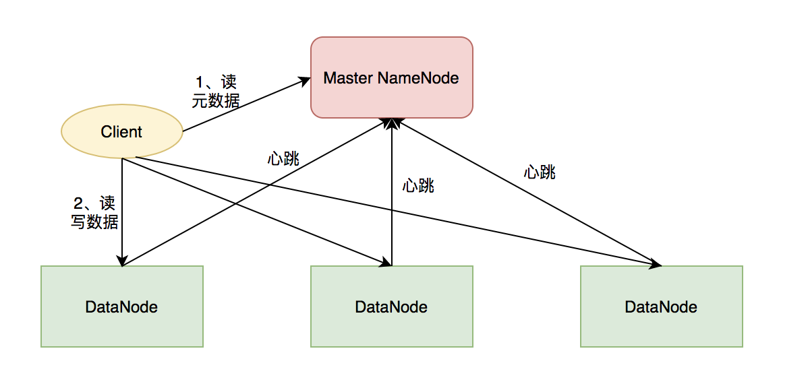
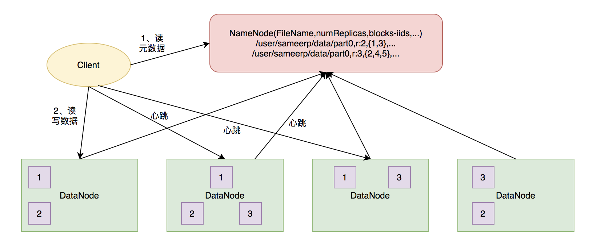

HDFS


## 术语

- fsimage ：保存的是上个检查点的HDFS的元信息
- edits ：保存的是从上个检查点开始发生的HDFS元信息状态改变信息
- fstime：保存了最后一个检查点的时间戳

## 背景


RAID 只能解决单机的高可用

HDFS 解决了跨机器的高可用

## 业务场景

21世纪是大数据爆发时代，随着信息数量以爆炸式增长，传统的数据库和计算引擎已经跟不上数据增长的速度以及业务对海量数据处理效率的要求，“数据”的价值逐步得到体现和重视，“数据资产”毫无疑问将是数字经济下越来越重要的一项资产，也将是全球经济竞争的重要领域。数字经济时代的数据主要有四个特点： 

- **Volume**：数据体量大， 数据量已经从TB（1024GB=1TB）级别跃升到PB（1024TB=1PB）、EB（1024PB=1EB）乃至ZB(1024EB=1ZB)级别，随着“物联网”的到来，传感器的大范围使用，数据增长空间更加巨大
- **Variety**：数据的多样性，随着互联网时代的崛起，数据来源有了更多的形式，丰富的数据应用场景产生了各种结构化数据、半结构化数据已经非结构数据
- **Velocity**：数据处理效率，海量的技术意味着对数据处理计算能力提出更高的要求，人们对数据响应速度要求越来越高，趋向实时或准实时响应
- **Value**：数据价值，海量的数据本身价值很低，如何从海量的数据里面提取出有价值的信息成为数据应用的大方向，通过各种指标的提取使得数据具象化，典型的应用如 用户画像、音乐推荐系统、电商推荐系统等

当前面临的挑战

1、如何存储大数据

2、如何快速存储与读取大数据

3、如何安全可靠存储大数据

4、已有的商业大数据系统费用昂贵，且可扩展性不足。

基于以上挑战，因此，设计了 HDFS 分布式文件系统，为 Hadoop 提供大数据存储能力。


## 约束与限制

### 硬件失效是常态

在一个上百台机器的集群中，硬件失效是常态，因此，检测异常，快速恢复是核心目标之一

### 流式访问数据集

1、不是运行在通用的文件系统上

2、用于批处理任务而不是交互式任务

3、关注高吞吐量而不是低延迟

### 大数据集

针对大文件，一般至少为 TB 级别，不适合小于 64M 的小文件，单节点支持上百万文件

假设 HDFS 中块的大小为 64MB，备份数量为 3，—般情况下，一条元数据记录占用 200B 的内存。那么，对于 1GB 的大文件，将占用 1GB/64MB x 3 个文件块；对于 1024 个 1MB 的小文件，则占用 1024 x3 个文件块。可以看到，存储同等大小的文件，单个文件越小，所需的元数据信息越大，占用的内存越大，因此 HDFS 适合存储超大文件。

### 简单的一致性

1、一次写多次读

2、写只支持追加写和切片


### 移动计算比移动数据更廉价


### 设计决策

#### 为什么元数据用单独的服务器，而不是存储在数据节点？

对于大规模机器，元数据同步会造成非常大的流量消耗，流量成为系统瓶颈。

#### 数据块的选择

hdfs默认数据块大小为64MB，磁盘块一般为512B，hdfs块为何如此之大呢？块增大可以减少寻址时间与文件传输时间的比例，若寻址时间为10ms，磁盘传输速率为100MB/s，那么寻址与传输比仅为1%。当然，磁盘块太大也不好，因为一个MapReduce通常以一个块作为输入，块过大会导致整体任务数量过小，降低作业处理速度。

一般来说，一条元信息记录会占用200byte内存空间。假设块大小为64MB，备份数量是3 ，那么一个1GB大小的文件将占用1024/64\*3=48个文件块。如果块大小为1MB大小的文件，则会占用1024*3=3072个文件块（多个文件不能放到一个块中）。我们可以发现，如果文件越小，存储同等大小文件所需要的元信息就越多，所以，Hadoop更喜欢大文件。

hdfs按块存储还有如下好处：

1. 文件可以任意大，也不用担心单个结点磁盘容量小于文件的情况
2. 简化了文件子系统的设计，子系统只存储文件块数据，而文件元数据则交由其它系统（NameNode）管理
3. 有利于备份和提高系统可用性，因为可以以块为单位进行备份，hdfs默认备份数量为3。
4. 有利于负载均衡

## 总体架构

​                                        

### 架构分析

#### 性能

支持压缩

缓存


#### 可用性

快照


DataNode

1、数据复制：数据块会复制3 份，如果 DataNode 挂了，NameNode 取出该节点的数据库块发送给其他 DataNode

2、故障检测：如果 DataNode 中磁盘坏了，节点正常，尽快通知 NameNode

3、数据节点：心跳包，故障检测

NameNode

1、HA：持久化元数据。	

2、snapshot

3、日志


#### 可靠性

文件的数据块采用多副本机制，并且副本要跨机柜


#### 隐私性

不涉及

#### 韧性

#### 安全

ACL

#### 可扩展性

提供插件化机制

#### 可伸缩性

1、可以通过增加服务器的方式扩展容量

#### 一致性

文件创建后，不能保证立即在 NameNode可见，即使文件刷新并存储，文件长度依然可能为 0

当写入超过一个块之后，新的 reader 可以看见第一个块，reader不能看见正在写入的块

sync 可以强制将缓存与数据同步，当 sync 执行返回时，当前数据对所有 reader 可见且一致。sync 会导致额外的开销

## 详细设计


### 核心功能

1、写文件

2、读文件


### 关键设计

数据存储


数据可靠性设计


数据可伸缩性设计


高性能读取与写入

1、文件分块

2、并行读取


#### RackAware机架感知功能：

1、若client为DataNode节点，那存储block时，规则为：副本1存储在同client的节点上；副本2存储在不同机架节点上；副本3同第副本2机架的另外一个节点上；其它副本随机挑选。

2、若client不为DataNode节点，那存储block时，规则为：副本1随机选择一个节点；副本2存储在不同于副本1的机架节点；副本3同副本2所在机架的另一个节点；其它副本随机挑选。


#### **元信息的持久化**

在NameNode中存放元信息的文件是 **fsimage**。在系统运行期间所有对元信息的操作都保存在内存中并被持久化到另一个文件**edits**中。并且edits文件和fsimage文件会被SecondaryNameNode周期性的合并。


#### 单点问题

- 将hadoop元数据写入到本地文件系统的同时再实时同步到一个远程挂载的网络文件系统（NFS）。
- 运行一个secondary NameNode，它的作用是与NameNode进行交互，定期通过编辑日志文件合并命名空间镜像，当NameNode发生故障时它会通过自己合并的命名空间镜像副本来恢复。需要注意的是secondaryNameNode保存的状态总是滞后于NameNode，所以这种方式难免会导致丢失部分数据（后面会详细介绍）。


#### 数据合并

SecondaryNameNode的角色就是定期的合并edits和fsimage文件，我们来看一下合并的步骤：

1. 合并之前告知NameNode把所有的操作写到新的edites文件并将其命名为edits.new。
2. SecondaryNameNode从NameNode请求fsimage和edits文件
3. SecondaryNameNode把fsimage和edits文件合并成新的fsimage文件
4. NameNode从SecondaryNameNode获取合并好的新的fsimage并将旧的替换掉，并把edits用第一步创建的edits.new文件替换掉
5. 更新fstime文件中的检查点


#### 安全模式

当 Hadoop的NameNode节点启动时，会进入安全模式阶段。在此阶段，DataNode会向NameNode上传它们数据块的列表，让 NameNode得到块的位置信息，并对每个文件对应的数据块副本进行统计。当最小副本条件满足时，即一定比例的数据块都达到最小副本数，系统就会退出安全模式，而这需要一定的延迟时间。当最小副本条件未达到要求时，就会对副本数不足的数据块安排DataNode进行复制，直至达到最小副本数。而在安全模式下，系统会处于只读状态，NameNode不会处理任何块的复制和删除命令


#### 通信协议

所有的HDFS中的沟通协议都是基于tcp/ip协议，一个客户端通过指定的tcp端口与NameNode机器建立连接，并通过ClientProtocol协议与NameNode交互。而DataNode则通过DataNode Protocol协议与NameNode进行沟通。HDFS的RCP(远程过程调用)对ClientProtocol和DataNode Protocol做了封装。按照HDFS的设计，NameNode不会主动发起任何请求，只会被动接受来自客户端或DataNode的请求。


#### 心跳机制

可以允许DataNode失败。DataNode会定期（默认3秒）的向NameNode发送心跳，若NameNode在指定时间间隔内没有收到心跳，它就认为此节点已经失败。此时，NameNode把失败节点的数据（从另外的副本节点获取）备份到另外一个健康的节点。这保证了集群始终维持指定的副本数。


#### 数据校验机制

可以检测到数据块损坏。在读取数据块时，HDFS会对数据块和保存的校验和文件匹配，如果发现不匹配，NameNode同样会重新备份损坏的数据块。


在海量数据处理过程中，主要限制因素是节点之间的带宽。衡量两个节点之间的带宽往往很难实现，在这里hadoop采取了一个简单的方法，它把网络拓扑看成是一棵树，连个节点的距离=它们到最近共同祖先距离的总和，而树的层次可以这么划分：

同一节点中的进程
同一机架上的不同节点
同一数据中心不同机架
不同数据中心的节点
若数据中心d1中一个机架r1中一个节点n1表示为d1/r1/n1,则：

```
distance(d1/r1/n1,d1/r1/n1)=0;
distance(d1/r1/n1,d1/r1/n2)=2;
distance(d1/r1/n1,d1/r2/n3)=4;
distance(d1/r1/n1,d2/r3/n4)=6;
```


### 设计规范


## 质量设计

限制

1、不适合小文件

2、文件操作只支持 append


## 演进规划

### 升级


##逻辑视图

### L0 视图





Client：客户端

1、文件切分。文件上传HDFS时，Client按照Block大小切分文件，然后进行存储

2、与NameNode交互，获取文件位置信息

3、与DataNode交互，读取或写入数据

4、Client提供一些命令管理和访问HDFS

NameNode：Master(管理者)

1、管理HDFS的名称空间

2、管理数据块(Block)映射信息

3、配置副本策略

4、处理客户端读写请求

DataNode：

1、存储实际的数据块

2、执行数据块的读/写操作

3、保持与namenode的通信，执行namenode的调度指令（创建、删除、和复制等操作）

4、通过心跳定期向NameNode发送所存储文件块列表信息。

5、与其它DataNode通信，复制块以实现冗余。

Secondary NameNode：并非NameNode的热备，当NN停止服务时，它并不能马上替换NN并提供服务

1、辅助NN，分担其工作量

2、定期合并fsimage和fsedits，并推送给NN

3、在紧急情况下，可辅助恢复NN

### L1 视图





文件以分块（默认 64M）的方式存储，每个分块存储在不同的节点，每个分块有多个副本（默认 3个）

**DataNode**

保存文件的数据块。数据块以文件的形式存储在磁盘上，包括数据块本身，已经一个元数据块（数据块的长度，块数据校验和，时间戳） 。

DataNode 启动后向 NameNode 注册，周期性（1 小时）向 NameNode 上报所有块信息。

心跳每 3 秒一次，心跳返回结果带有 NameNode 给该 DataNode 的命令，如复制数据块到另外一台机器，删除某个数据块。如果超过 10 分钟没有收到 DataNode 的心跳，认为节点不可用

DataNode 可以在集群运行过程中安全地加入和退出

**NameNode**

存储文件的元数据，包括文件名称，文件目录结构，文件属性（生成时间、副本数、文件权限）以及每个文件的块列表以及块所在的 DataNode。

对文件可以进行创建、删除、重命名。文件创建、写入和关闭后不能修改文件内容。

NameNode保存了数据块与DataNode的映射关系，读取文件时，会采用就近原则。

NameNode 管理数据块的复制。DataNode定期向 NameNode 发送心跳和报告数据块信息。心跳消息表明数据节点工作正常，数据块信息包含该 DataNode 的所有数据块信息。

**Client**

客户端先从 NameNode 读取文件的元数据，然后，到文件的各个 DataNode 读取具体的文件内容。


### L2 视图


### HDFS 2.0


采用HA（高可用）的方案，相对于HDFS 1.0来说，Namenode会区分两种状态，active和standby，正常工作的时候时候由active Namenode对外提供服务，standby Namenode则会从journalnode同步元数据，保证和active保持元数据一致，当active Namenode出现故障或者宕机的时候，standby会自动切换为新的active Namenode对外提供服务，并且HA对外提供了统一的访问名称，对于用户来说，不管访问的Namenode是active状态还是standby状态都是无感知的。

此外HDFS 2.0通过**federation（联邦）**机制解决了内存受限的问题，采用了建仓库的办法，也就是federation机制，一般适用于1000+规模的集群，小公司基本是用不上。

### HDFS 3.0架构

HDFS 3.0在架构上相对于HDFS 2.0没什么大的调整，HDFS 2.0只支持至多两个Namenode，而HDFS 3.0在2.0的基础上增加了多个Namenode的支持，提供集群可用性。主要聚焦提升底层数据存储优化，降低数据开销的成本，采用纠错码技术提高集群的容错性。


## 运行视图


### 读数据流程


1、首先调用FileSystem的open方法获取一个DistributedFileSystem实例。

2、DistributedFileSystem通过RPC(远程过程调用)获得文件的第一批block的locations，同一个block按照重复数返回多个locations，这些locations按照Hadoop拓扑结构排序，按照就近原则进行排序。

3、前两步结束后会返回一个FSDataInputStream对象，通过调用read方法时，该对象会找出离客户端最近的DataNode并连接。

4、数据从DataNode源源不断地流向客户端。

5、如果第一个block块数据读取完成，就会关闭指向第一个block块的DataNode连接，接着读取下一个block块。

6、如果第一批blocks读取完成，FSDataInputStream会向NN获取下一批blocks的locations，然后重复4、5步骤，直到所有blocks读取完成，这时就会关闭所有的流。

注：

故障标记：当FSDataInputStream与DataNode通信时遇到错误，它会选取另一个较近的DataNode，并为出故障的DataNode做标记以免重复向其读取数据。

数据校验：FSDataInputStream还会对读取的数据块进行校验和确认，发现块损坏时也会重新读取并通知NameNode。

### 写数据流程


1、客户端在向NameNode请求之前，先调用DistributedFileSystem的create方法，创建一个新文件，写入文件数据到本地文件系统的一个临时文件，待临时文件达到块大小时开始向NameNode请求DataNode信息

2、DistributedFileSystem通过RPC(远程过程调用)调用NameNode，去创建一个没有blocks关联的新文件。创建前，NameNode会进行各种校验（如文件是否存在，客户端是否有创建权限等），NameNode会为创建文件写一条记录到本地磁盘的EditLog，返回给客户端一个数据块及其对应DataNode的地址列表（列表中包含副本存放的地址）；若不通过会向客户端抛出IOException。

3、前两步结束后会返回一个FSDataOutputStream对象，客户端开始写数据到FSDataOutputStream，FSDataOutputStream会把数据切成一个个小packet，然后排成data queue。

4、DataStreamer 会去处理接受 data queue，它先问询 NameNode 这个新的 block 最适合存储的在哪几个DataNode里，比如重复数是3，那么就找到3个最适合的 DataNode，把它们排成一个 pipeline。DataStreamer 把 packet 按队列输出到管道的第一个 DataNode 中，第一个 DataNode又把 packet 输出到第二个 DataNode 中，以此类推。

5、DFSOutputStream 还有一个队列叫 ack queue，也是由 packet 组成，等待收到DataNode的响应，当pipeline中的所有DataNode都表示已经收到的时候，这时akc queue才会把对应的packet包移除掉。

6、客户端完成写数据后，调用close方法关闭写入流。

7、DataStreamer 把剩余的包都刷到 pipeline 里，然后等待 ack 信息，收到最后一个 ack 后，通知 NameNode 把文件标示为已完成。


#### 删除过程

```
1. 一开始删除文件，NameNode只是重命名被删除的文件到/trash目录，因为重命名操作只是元信息的变动，所以整个过程非常快。在/trash中文件会被保留一定间隔的时间（可配置，默认是6小时），在这期间，文件可以很容易的恢复，恢复只需要将文件从/trash移出即可。
2. 当指定的时间到达，NameNode将会把文件从命名空间中删除
3. 标记删除的文件块释放空间，HDFS文件系统显示空间增加
```


## 参考

http://bigdata.it168.com/a2018/0525/3205/000003205248.shtml

https://blog.csdn.net/suifeng3051/article/details/48548341