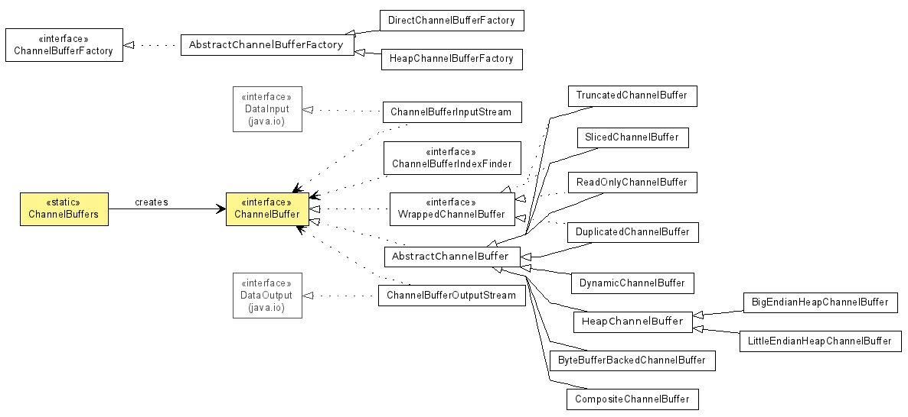
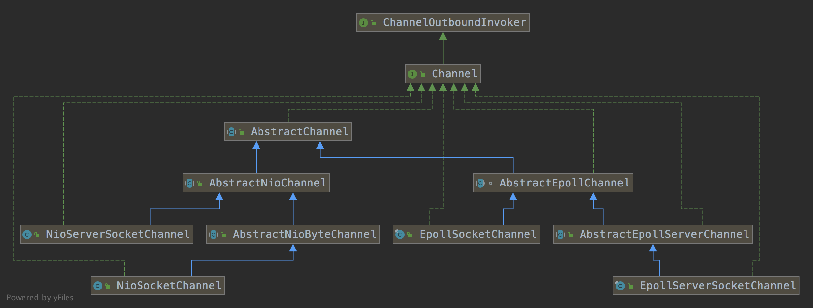

# netty

## 设计目标

1、高性能

基于 NIO 的 Reactor 模式异步事件驱动框架

2、高扩展

支持各种编解码：基于长度、基于换行符、基于 TLV、自定义等。

支持各种协议：http，websocket，http2，tcp，自定义。

3、易用

Promise 模式

Buffer 扩展

## 数据模型

EventLoopGroup：包括多个EventLoop（接口为 EventExecutor，而 EventLoop 实现了 EventExecutor）。

EventLoop：包含一个 selector 和很多个 channel，当 selector 收到连接事件之后，就将建立 fd:channel 的映射关系。EventLoop 属于 EventLoopGroup 的成员

Channel ：包含一个 ChannelPipeline，将具体 Channel 相关的操作委托给 ChannelPipeline

ChannelPipeline：包含多个 ChannelContext，将不同的ChannelContext通过链表串联起来。这里的 channelcontext 支持动态热插拔。

ChannelContext：包括一个 Executor 和 一个ChannelHandler。如果 executor 不为空，ChannelHandler 的执行由 executor 来执行，如果 executor 为空，channelHandler 执行由 EventLoopGroup 的 executor 来执行

ChannelHandler：Channel 相关操作。包括 ChannelInboundHandler 和 ChannelOutboundHandler。

思考题

1、Bootstrap 在初始化时候，为什么仅初始化 childHandler，而不需要初始化 parentHandler？

2、ChannelInitializer 完成通道初始化之后，为什么要将自己从流水线删除

3、各个 ChannelHander 是如何串联起来的？

4、inboundhandler和outboundHandler哪个可以截断，哪个不可用截断？

事件

ChannelInboundHandler

* handlerAdded：当 handler 加入 pipeline 后调用

* channelRegistered：当channel与EventLoop 绑定的时候被调用
* channelActive：
* channelRead：每次有有数据读入，通道可读。
* channelReadComplete：每次数据读取完成
* channelInactive：连接不是 ESTABLISH 状态或者连接已经关闭时。
* channelUnregistered：当channel与 EventLoop 解绑的时候被调用
* handlerRemoved：handler 从 pipeline 中删除

ChannelOutboundHandler

##特性

##数据模型
###buffer

## Channel

Channel 是如何接收到请求的？

Channel 与 EventLoop 的关系

Channel 与 Pipeline 的关系

核心类图

