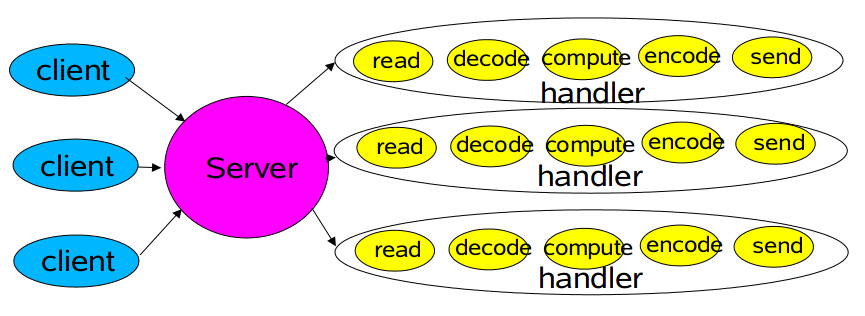
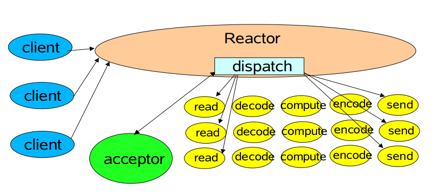
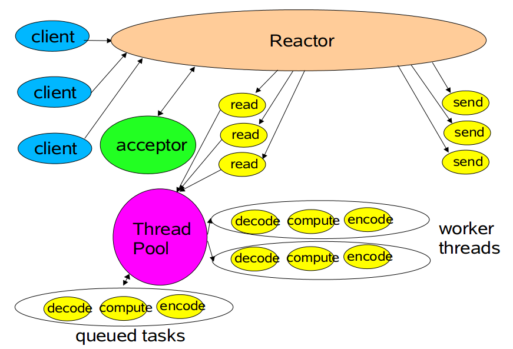
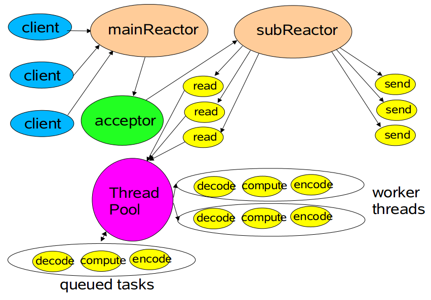

# Reactor 模式

本章图参考自[这里](http://gee.cs.oswego.edu/dl/cpjslides/nio.pdf)

##传统服务设计

##Reactor 模式

###单线程版本

###多线程版本

###组合 Reactor

Reactor分成两部分，mainReactor负责监听server socket，accept新连接，并将建立的socket分派给subReactor。subReactor负责多路分离已连接的socket，读写网 络数据，对业务处理功能，其扔给worker线程池完成。

##Netty 的模式

还有一种Reactor模型的变种没说，那就是组合 Reactor 去掉线程池，这也 是Netty NIO 的默认模式。在实现上，Netty 中的 Boss 类充当 mainReactor，NioWorker 类充当 subReactor（默认 NioWorker 的个数是 2* Runtime.getRuntime().availableProcessors()）。在处理新来的请求 时，NioWorker读完已收到的数据到ChannelBuffer中，之后触发ChannelPipeline中的ChannelHandler流。

