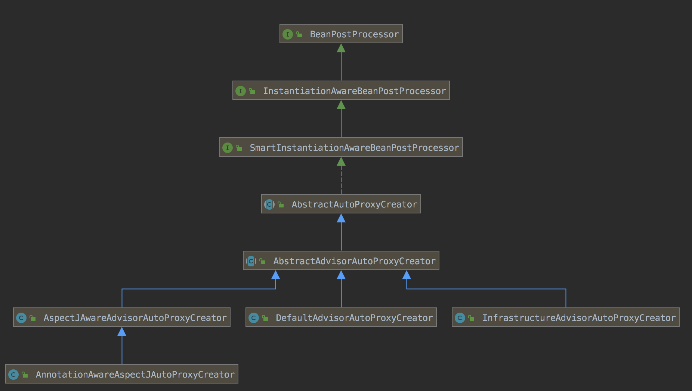

spring-aop-create


### 核心堆栈

```
postProcessBeforeInstantiation
	createProxy
			ProxyFactory.getProxy
					ProxyCreatorSupport.createAopProxy
						AopProxyFactory.createAopProxy
							DefaultAopProxyFactory.createAopProxy
```


### 类结构




### 注册

```java
@Target({ElementType.TYPE})
@Retention(RetentionPolicy.RUNTIME)
@Documented
@Import({AspectJAutoProxyRegistrar.class})
public @interface EnableAspectJAutoProxy {
    boolean proxyTargetClass() default false;

    boolean exposeProxy() default false;
}

class AspectJAutoProxyRegistrar implements ImportBeanDefinitionRegistrar {
    AspectJAutoProxyRegistrar() {
    }

    public void registerBeanDefinitions(AnnotationMetadata importingClassMetadata, BeanDefinitionRegistry registry) {
        AopConfigUtils.registerAspectJAnnotationAutoProxyCreatorIfNecessary(registry);
        AnnotationAttributes enableAspectJAutoProxy = AnnotationConfigUtils.attributesFor(importingClassMetadata, EnableAspectJAutoProxy.class);
        if (enableAspectJAutoProxy != null) {
            if (enableAspectJAutoProxy.getBoolean("proxyTargetClass")) {
                AopConfigUtils.forceAutoProxyCreatorToUseClassProxying(registry);
            }

            if (enableAspectJAutoProxy.getBoolean("exposeProxy")) {
                AopConfigUtils.forceAutoProxyCreatorToExposeProxy(registry);
            }
        }

    }
}

public abstract class AopConfigUtils {
	@Nullable
	public static BeanDefinition registerAspectJAnnotationAutoProxyCreatorIfNecessary(BeanDefinitionRegistry registry) {
		return registerAspectJAnnotationAutoProxyCreatorIfNecessary(registry, null);
	}

	@Nullable
	public static BeanDefinition registerAspectJAnnotationAutoProxyCreatorIfNecessary(
			BeanDefinitionRegistry registry, @Nullable Object source) {

		return registerOrEscalateApcAsRequired(AnnotationAwareAspectJAutoProxyCreator.class, registry, source);
	}
  
  private static BeanDefinition registerOrEscalateApcAsRequired(
			Class<?> cls, BeanDefinitionRegistry registry, @Nullable Object source) {

		Assert.notNull(registry, "BeanDefinitionRegistry must not be null");

		if (registry.containsBeanDefinition(AUTO_PROXY_CREATOR_BEAN_NAME)) {
			BeanDefinition apcDefinition = registry.getBeanDefinition(AUTO_PROXY_CREATOR_BEAN_NAME);
			if (!cls.getName().equals(apcDefinition.getBeanClassName())) {
				int currentPriority = findPriorityForClass(apcDefinition.getBeanClassName());
				int requiredPriority = findPriorityForClass(cls);
				if (currentPriority < requiredPriority) {
					apcDefinition.setBeanClassName(cls.getName());
				}
			}
			return null;
		}

		RootBeanDefinition beanDefinition = new RootBeanDefinition(cls);
		beanDefinition.setSource(source);
		beanDefinition.getPropertyValues().add("order", Ordered.HIGHEST_PRECEDENCE);
		beanDefinition.setRole(BeanDefinition.ROLE_INFRASTRUCTURE);
		registry.registerBeanDefinition(AUTO_PROXY_CREATOR_BEAN_NAME, beanDefinition);
		return beanDefinition;
	}
}
```


### 初始化时机

```java
public interface BeanPostProcessor {
    @Nullable
    default Object postProcessBeforeInitialization(Object bean, String beanName) throws BeansException {
        return bean;
    }

    @Nullable
    default Object postProcessAfterInitialization(Object bean, String beanName) throws BeansException {
        return bean;
    }
}

public interface InstantiationAwareBeanPostProcessor extends BeanPostProcessor {
    @Nullable
    default Object postProcessBeforeInstantiation(Class<?> beanClass, String beanName) throws BeansException {
        return null;
    }

    default boolean postProcessAfterInstantiation(Object bean, String beanName) throws BeansException {
        return true;
    }

    default PropertyValues postProcessProperties(PropertyValues pvs, Object bean, String beanName) throws BeansException {
        return null;
    }

    /** @deprecated */
    @Deprecated
    @Nullable
    default PropertyValues postProcessPropertyValues(PropertyValues pvs, PropertyDescriptor[] pds, Object bean, String beanName) throws BeansException {
        return pvs;
    }
}
```


在 Spring Bean 初始化的过程中，在 postProcessBeforeInstantiation 和 postProcessAfterInitialization 中通过 createProxy 创建代理类

```java
public abstract class AbstractAutoProxyCreator extends ProxyProcessorSupport
		implements SmartInstantiationAwareBeanPostProcessor, BeanFactoryAware {
  @Override
	public Object postProcessBeforeInstantiation(Class<?> beanClass, String beanName) {
		Object cacheKey = getCacheKey(beanClass, beanName);
		TargetSource targetSource = getCustomTargetSource(beanClass, beanName);
		if (targetSource != null) {
			if (StringUtils.hasLength(beanName)) {
				this.targetSourcedBeans.add(beanName);
			}
			Object[] specificInterceptors = getAdvicesAndAdvisorsForBean(beanClass, beanName, targetSource);
			Object proxy = createProxy(beanClass, beanName, specificInterceptors, targetSource);
			this.proxyTypes.put(cacheKey, proxy.getClass());
			return proxy;
		}

		return null;
	}
	
  @Override
	public Object postProcessAfterInitialization(@Nullable Object bean, String beanName) {
		if (bean != null) {
			Object cacheKey = getCacheKey(bean.getClass(), beanName);
			if (this.earlyProxyReferences.remove(cacheKey) != bean) {
				return wrapIfNecessary(bean, beanName, cacheKey);
			}
		}
		return bean;
	}
  
	protected Object wrapIfNecessary(Object bean, String beanName, Object cacheKey) {
		// Create proxy if we have advice.
		Object[] specificInterceptors = getAdvicesAndAdvisorsForBean(bean.getClass(), beanName, null);
		if (specificInterceptors != DO_NOT_PROXY) {
			this.advisedBeans.put(cacheKey, Boolean.TRUE);
			Object proxy = createProxy(
					bean.getClass(), beanName, specificInterceptors, new SingletonTargetSource(bean));
			this.proxyTypes.put(cacheKey, proxy.getClass());
			return proxy;
		}

		this.advisedBeans.put(cacheKey, Boolean.FALSE);
		return bean;
	}  
}
```


### 创建代理类 createProxy

```java
	protected Object createProxy(Class<?> beanClass, @Nullable String beanName,
			@Nullable Object[] specificInterceptors, TargetSource targetSource) {

		if (this.beanFactory instanceof ConfigurableListableBeanFactory) {
			AutoProxyUtils.exposeTargetClass((ConfigurableListableBeanFactory) this.beanFactory, beanName, beanClass);
		}

		ProxyFactory proxyFactory = new ProxyFactory();
		proxyFactory.copyFrom(this);

		if (!proxyFactory.isProxyTargetClass()) {
			if (shouldProxyTargetClass(beanClass, beanName)) {
				proxyFactory.setProxyTargetClass(true);
			}
			else {
				evaluateProxyInterfaces(beanClass, proxyFactory);
			}
		}

		Advisor[] advisors = buildAdvisors(beanName, specificInterceptors);
		proxyFactory.addAdvisors(advisors);
		proxyFactory.setTargetSource(targetSource);
		customizeProxyFactory(proxyFactory);

		proxyFactory.setFrozen(this.freezeProxy);
		if (advisorsPreFiltered()) {
			proxyFactory.setPreFiltered(true);
		}

		return proxyFactory.getProxy(getProxyClassLoader());
	}
```


### 工厂类创建代理类

Spring 中 AOP的生成核心是 AopProxy

```java
public class ProxyFactory extends ProxyCreatorSupport {
	public Object getProxy(@Nullable ClassLoader classLoader) {
		return createAopProxy().getProxy(classLoader);
	}
}

public class ProxyCreatorSupport extends AdvisedSupport {
	private AopProxyFactory aopProxyFactory;
  
  public ProxyCreatorSupport() {
		this.aopProxyFactory = new DefaultAopProxyFactory();
	}
  
	public ProxyCreatorSupport(AopProxyFactory aopProxyFactory) {
		this.aopProxyFactory = aopProxyFactory;
	}
  
	public AopProxyFactory getAopProxyFactory() {
		return this.aopProxyFactory;
	}

	protected final synchronized AopProxy createAopProxy() {
		if (!this.active) {
			activate();
		}
		return getAopProxyFactory().createAopProxy(this);
	}
}

public interface AopProxy {
    Object getProxy();

    Object getProxy(@Nullable ClassLoader var1);
}

public interface AopProxyFactory {
    AopProxy createAopProxy(AdvisedSupport var1) throws AopConfigException;
}
```

实现类包括CglibAopProxy（ObjenesisCglibAopProxy），JdkDynamicAopProxy。


#### DefaultAopProxyFactory

```java
public class DefaultAopProxyFactory implements AopProxyFactory, Serializable {
    public DefaultAopProxyFactory() {
    }

    public AopProxy createAopProxy(AdvisedSupport config) throws AopConfigException {
        if (!config.isOptimize() && !config.isProxyTargetClass() && !this.hasNoUserSuppliedProxyInterfaces(config)) {
            return new JdkDynamicAopProxy(config);
        } else {
            Class<?> targetClass = config.getTargetClass();
            if (targetClass == null) {
                throw new AopConfigException("TargetSource cannot determine target class: Either an interface or a target is required for proxy creation.");
            } else {
                return (AopProxy)(!targetClass.isInterface() && !Proxy.isProxyClass(targetClass) ? new ObjenesisCglibAopProxy(config) : new JdkDynamicAopProxy(config));
            }
        }
    }

    private boolean hasNoUserSuppliedProxyInterfaces(AdvisedSupport config) {
        Class<?>[] ifcs = config.getProxiedInterfaces();
        return ifcs.length == 0 || ifcs.length == 1 && SpringProxy.class.isAssignableFrom(ifcs[0]);
    }
}
```


#### JdkDynamicAopProxy

```java
final class JdkDynamicAopProxy implements AopProxy, InvocationHandler, Serializable {
		public Object getProxy() {
        return this.getProxy(ClassUtils.getDefaultClassLoader());
    }

    public Object getProxy(@Nullable ClassLoader classLoader) {
        Class<?>[] proxiedInterfaces = AopProxyUtils.completeProxiedInterfaces(this.advised, true);
        this.findDefinedEqualsAndHashCodeMethods(proxiedInterfaces);
        return Proxy.newProxyInstance(classLoader, proxiedInterfaces, this);
    }
```


#### CglibAopProxy

核心是 getCallbacks 里面的 DynamicAdvisedInterceptor，获取代理类的拦截方法，这样在执行方法时，会执行对应的代理方法。具体参考 DynamicAdvisedInterceptor 的 invoke 方法

```java
class CglibAopProxy implements AopProxy, Serializable {
		public Object getProxy() {
        return this.getProxy((ClassLoader)null);
    }

    public Object getProxy(@Nullable ClassLoader classLoader) {
        Class<?> rootClass = this.advised.getTargetClass();
        Class<?> proxySuperClass = rootClass;
        int x;
        // 增加接口
        if (rootClass.getName().contains("$$")) {
            proxySuperClass = rootClass.getSuperclass();
            Class<?>[] additionalInterfaces = rootClass.getInterfaces();
            Class[] var5 = additionalInterfaces;
            int var6 = additionalInterfaces.length;

            for(x = 0; x < var6; ++x) {
                Class<?> additionalInterface = var5[x];
                this.advised.addInterface(additionalInterface);
            }
        }

        this.validateClassIfNecessary(proxySuperClass, classLoader);
        // 创建增强类
        Enhancer enhancer = this.createEnhancer();
        if (classLoader != null) {
            enhancer.setClassLoader(classLoader);
            if (classLoader instanceof SmartClassLoader && ((SmartClassLoader)classLoader).isClassReloadable(proxySuperClass)) {
                enhancer.setUseCache(false);
            }
        }

        enhancer.setSuperclass(proxySuperClass);
        enhancer.setInterfaces(AopProxyUtils.completeProxiedInterfaces(this.advised));
        enhancer.setNamingPolicy(SpringNamingPolicy.INSTANCE);
        enhancer.setStrategy(new ClassLoaderAwareGeneratorStrategy(classLoader));
        // 设置拦截器链
        Callback[] callbacks = this.getCallbacks(rootClass);
        Class<?>[] types = new Class[callbacks.length];

        for(x = 0; x < types.length; ++x) {
            types[x] = callbacks[x].getClass();
        }

        enhancer.setCallbackFilter(new CglibAopProxy.ProxyCallbackFilter(this.advised.getConfigurationOnlyCopy(), this.fixedInterceptorMap, this.fixedInterceptorOffset));
        enhancer.setCallbackTypes(types);
        return this.createProxyClassAndInstance(enhancer, callbacks);
    }

    protected Object createProxyClassAndInstance(Enhancer enhancer, Callback[] callbacks) {
        enhancer.setInterceptDuringConstruction(false);
        enhancer.setCallbacks(callbacks);
        return this.constructorArgs != null && this.constructorArgTypes != null ? enhancer.create(this.constructorArgTypes, this.constructorArgs) : enhancer.create();
    }

	private Callback[] getCallbacks(Class<?> rootClass) throws Exception {
		// Parameters used for optimization choices...
		boolean exposeProxy = this.advised.isExposeProxy();
		boolean isFrozen = this.advised.isFrozen();
		boolean isStatic = this.advised.getTargetSource().isStatic();

		// Choose an "aop" interceptor (used for AOP calls).
    // 拦截器方法
		Callback aopInterceptor = new DynamicAdvisedInterceptor(this.advised);

		// Choose a "straight to target" interceptor. (used for calls that are
		// unadvised but can return this). May be required to expose the proxy.
		Callback targetInterceptor;
		if (exposeProxy) {
			targetInterceptor = (isStatic ?
					new StaticUnadvisedExposedInterceptor(this.advised.getTargetSource().getTarget()) :
					new DynamicUnadvisedExposedInterceptor(this.advised.getTargetSource()));
		}
		else {
			targetInterceptor = (isStatic ?
					new StaticUnadvisedInterceptor(this.advised.getTargetSource().getTarget()) :
					new DynamicUnadvisedInterceptor(this.advised.getTargetSource()));
		}

		// Choose a "direct to target" dispatcher (used for
		// unadvised calls to static targets that cannot return this).
		Callback targetDispatcher = (isStatic ?
				new StaticDispatcher(this.advised.getTargetSource().getTarget()) : new SerializableNoOp());

		Callback[] mainCallbacks = new Callback[] {
				aopInterceptor,  // for normal advice
				targetInterceptor,  // invoke target without considering advice, if optimized
				new SerializableNoOp(),  // no override for methods mapped to this
				targetDispatcher, this.advisedDispatcher,
				new EqualsInterceptor(this.advised),
				new HashCodeInterceptor(this.advised)
		};

		Callback[] callbacks;

		// If the target is a static one and the advice chain is frozen,
		// then we can make some optimizations by sending the AOP calls
		// direct to the target using the fixed chain for that method.
		if (isStatic && isFrozen) {
			Method[] methods = rootClass.getMethods();
			Callback[] fixedCallbacks = new Callback[methods.length];
			this.fixedInterceptorMap = new HashMap<>(methods.length);

			// TODO: small memory optimization here (can skip creation for methods with no advice)
			for (int x = 0; x < methods.length; x++) {
				Method method = methods[x];
				List<Object> chain = this.advised.getInterceptorsAndDynamicInterceptionAdvice(method, rootClass);
				fixedCallbacks[x] = new FixedChainStaticTargetInterceptor(
						chain, this.advised.getTargetSource().getTarget(), this.advised.getTargetClass());
				this.fixedInterceptorMap.put(method, x);
			}

			// Now copy both the callbacks from mainCallbacks
			// and fixedCallbacks into the callbacks array.
			callbacks = new Callback[mainCallbacks.length + fixedCallbacks.length];
			System.arraycopy(mainCallbacks, 0, callbacks, 0, mainCallbacks.length);
			System.arraycopy(fixedCallbacks, 0, callbacks, mainCallbacks.length, fixedCallbacks.length);
			this.fixedInterceptorOffset = mainCallbacks.length;
		}
		else {
			callbacks = mainCallbacks;
		}
		return callbacks;
	}
}
```


### Cglib 代理执行

```java
@Override
public Object intercept(Object proxy, Method method, Object[] args, MethodProxy methodProxy) throws Throwable {
   Object oldProxy = null;
   boolean setProxyContext = false;
   Object target = null;
   TargetSource targetSource = this.advised.getTargetSource();
   try {
      if (this.advised.exposeProxy) {
         // Make invocation available if necessary.
         oldProxy = AopContext.setCurrentProxy(proxy);
         setProxyContext = true;
      }
      // Get as late as possible to minimize the time we "own" the target, in case it comes from a pool...
      target = targetSource.getTarget();
      Class<?> targetClass = (target != null ? target.getClass() : null);
      //获取方法的拦截器
      List<Object> chain = this.advised.getInterceptorsAndDynamicInterceptionAdvice(method, targetClass);
      Object retVal;
      // 如果没有，直接执行方法
      if (chain.isEmpty() && Modifier.isPublic(method.getModifiers())) {
         Object[] argsToUse = AopProxyUtils.adaptArgumentsIfNecessary(method, args);
         retVal = methodProxy.invoke(target, argsToUse);
      }
      else {
         // 执行代理
         retVal = new CglibMethodInvocation(proxy, target, method, args, targetClass, chain, methodProxy).proceed();
      }
      retVal = processReturnType(proxy, target, method, retVal);
      return retVal;
   }
   finally {
      if (target != null && !targetSource.isStatic()) {
         targetSource.releaseTarget(target);
      }
      if (setProxyContext) {
         // Restore old proxy.
         AopContext.setCurrentProxy(oldProxy);
      }
   }
}

	private static class CglibMethodInvocation extends ReflectiveMethodInvocation {
		private final MethodProxy methodProxy;

		public CglibMethodInvocation(Object proxy, @Nullable Object target, Method method,
				Object[] arguments, @Nullable Class<?> targetClass,
				List<Object> interceptorsAndDynamicMethodMatchers, MethodProxy methodProxy) {
			super(proxy, target, method, arguments, targetClass, interceptorsAndDynamicMethodMatchers);

      // 只有 public 方法才可以代理
			this.methodProxy = (Modifier.isPublic(method.getModifiers()) &&
					method.getDeclaringClass() != Object.class && !AopUtils.isEqualsMethod(method) &&
					!AopUtils.isHashCodeMethod(method) && !AopUtils.isToStringMethod(method) ?
					methodProxy : null);
		}

		@Override
		public Object proceed() throws Throwable {
			try {
				return super.proceed();
			}
		}

		/**
		 * Gives a marginal performance improvement versus using reflection to
		 * invoke the target when invoking public methods.
		 */
		@Override
		protected Object invokeJoinpoint() throws Throwable {
			if (this.methodProxy != null) {
				return this.methodProxy.invoke(this.target, this.arguments);
			}
			else {
				return super.invokeJoinpoint();
			}
		}
	}
```