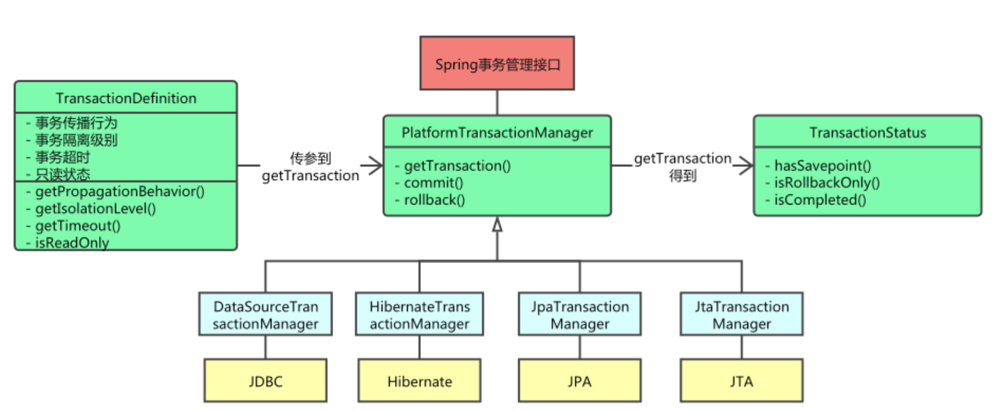

spring-aop-transactional




### 注解解析

事务管理在系统开发中是不可缺少的一部分，`Spring`提供了很好事务管理机制，主要分为`编程式事务`和`声明式事务`两种。

**编程式事务**：是指在代码中手动的管理事务的提交、回滚等操作，代码侵入性比较强，如下示例：

```java
try {
    //TODO something
     transactionManager.commit(status);
} catch (Exception e) {
    transactionManager.rollback(status);
    thrownew InvoiceApplyException("异常失败");
}
```

**声明式事务**：声明式事务也有两种实现方式，一是基于`TX`和`AOP`的xml配置文件方式，二种就是基于@Transactional 注解了。


@Transactional是声明式事务的注解，可以被标记在类上、接口、方法上。

- **作用于类**：当把`@Transactional 注解放在类上时，表示所有该类的`public方法都配置相同的事务属性信息。
- **作用于方法**：当类配置了`@Transactional`，方法也配置了`@Transactional`，方法的事务会覆盖类的事务配置信息。
- **作用于接口**：不推荐这种使用方法，因为一旦标注在Interface上并且配置了Spring AOP 使用CGLib动态代理，将会导致`@Transactional`注解失效

@Transactional的参数说明

**isolation**

事务的隔离级别，默认是Isolation.DEFAULT。

**propagation**

代表事务的传播行为，默认值为Propagation.REQUIRED。

**timeout**

事务的超时时间，单位为秒。

**readOnly**

该属性用于设置当前事务是否为只读事务，设置为true表示只读，false则表示可读写，默认值为false。如果一个事务只涉及到只读，可以设置为true。

**rollbackFor 属性**

用于指定能够触发事务回滚的异常类型，可以指定多个异常类型。

默认是在RuntimeException和Error上回滚。

**noRollbackFor**

抛出指定的异常类型，不回滚事务，也可以指定多个异常类型。


```java
	protected TransactionAttribute computeTransactionAttribute(Method method, @Nullable Class<?> targetClass) {
		// Don't allow no-public methods as required.
		if (allowPublicMethodsOnly() && !Modifier.isPublic(method.getModifiers())) {
			return null;
		}

		// The method may be on an interface, but we need attributes from the target class.
		// If the target class is null, the method will be unchanged.
		Method specificMethod = AopUtils.getMostSpecificMethod(method, targetClass);

		// First try is the method in the target class.
		TransactionAttribute txAttr = findTransactionAttribute(specificMethod);
		if (txAttr != null) {
			return txAttr;
		}

		// Second try is the transaction attribute on the target class.
		txAttr = findTransactionAttribute(specificMethod.getDeclaringClass());
		if (txAttr != null && ClassUtils.isUserLevelMethod(method)) {
			return txAttr;
		}

		if (specificMethod != method) {
			// Fallback is to look at the original method.
			txAttr = findTransactionAttribute(method);
			if (txAttr != null) {
				return txAttr;
			}
			// Last fallback is the class of the original method.
			txAttr = findTransactionAttribute(method.getDeclaringClass());
			if (txAttr != null && ClassUtils.isUserLevelMethod(method)) {
				return txAttr;
			}
		}
		return null;
	}

```


### 事务注册

```java
@Target(ElementType.TYPE)
@Retention(RetentionPolicy.RUNTIME)
@Documented
@Import(TransactionManagementConfigurationSelector.class)
public @interface EnableTransactionManagement {
}

public class TransactionManagementConfigurationSelector extends AdviceModeImportSelector<EnableTransactionManagement> {
	@Override
	protected String[] selectImports(AdviceMode adviceMode) {
		switch (adviceMode) {
			case PROXY:
				return new String[] {AutoProxyRegistrar.class.getName(),
						ProxyTransactionManagementConfiguration.class.getName()};
			case ASPECTJ:
				return new String[] {determineTransactionAspectClass()};
			default:
				return null;
		}
	}

	private String determineTransactionAspectClass() {
		return (ClassUtils.isPresent("javax.transaction.Transactional", getClass().getClassLoader()) ?
				TransactionManagementConfigUtils.JTA_TRANSACTION_ASPECT_CONFIGURATION_CLASS_NAME :
				TransactionManagementConfigUtils.TRANSACTION_ASPECT_CONFIGURATION_CLASS_NAME);
	}
}

public abstract class AbstractFallbackTransactionAttributeSource implements TransactionAttributeSource {
  
	public TransactionAttribute getTransactionAttribute(Method method, @Nullable Class<?> targetClass) {
		if (method.getDeclaringClass() == Object.class) {
			return null;
		}

		// First, see if we have a cached value.
		Object cacheKey = getCacheKey(method, targetClass);
		TransactionAttribute cached = this.attributeCache.get(cacheKey);
		if (cached != null) {
			// Value will either be canonical value indicating there is no transaction attribute,
			// or an actual transaction attribute.
			if (cached == NULL_TRANSACTION_ATTRIBUTE) {
				return null;
			}
			else {
				return cached;
			}
		}
		else {
			// We need to work it out.
			TransactionAttribute txAttr = computeTransactionAttribute(method, targetClass);
			// Put it in the cache.
			if (txAttr == null) {
				this.attributeCache.put(cacheKey, NULL_TRANSACTION_ATTRIBUTE);
			}
			else {
				String methodIdentification = ClassUtils.getQualifiedMethodName(method, targetClass);
				if (txAttr instanceof DefaultTransactionAttribute) {
					((DefaultTransactionAttribute) txAttr).setDescriptor(methodIdentification);
        }
				this.attributeCache.put(cacheKey, txAttr);
			}
			return txAttr;
		}
	}
  
  protected TransactionAttribute computeTransactionAttribute(Method method, @Nullable Class<?> targetClass) {
		// Don't allow no-public methods as required.
		if (allowPublicMethodsOnly() && !Modifier.isPublic(method.getModifiers())) {
			return null;
		}

		// The method may be on an interface, but we need attributes from the target class.
		// If the target class is null, the method will be unchanged.
		Method specificMethod = AopUtils.getMostSpecificMethod(method, targetClass);
      
    //查看方法中是否存在事务声明
		// First try is the method in the target class.
		TransactionAttribute txAttr = findTransactionAttribute(specificMethod);
		if (txAttr != null) {
			return txAttr;
		}

		// Second try is the transaction attribute on the target class.
		txAttr = findTransactionAttribute(specificMethod.getDeclaringClass());
		if (txAttr != null && ClassUtils.isUserLevelMethod(method)) {
			return txAttr;
		}
    //如果存在接口，则到接口中去寻找
		if (specificMethod != method) {
			// Fallback is to look at the original method.
			txAttr = findTransactionAttribute(method);
			if (txAttr != null) {
				return txAttr;
			}
			// Last fallback is the class of the original method.
			txAttr = findTransactionAttribute(method.getDeclaringClass());
			if (txAttr != null && ClassUtils.isUserLevelMethod(method)) {
				return txAttr;
			}
		}
		return null;
	}
}

public class AnnotationTransactionAttributeSource extends AbstractFallbackTransactionAttributeSource
		implements Serializable {

	@Override
	protected TransactionAttribute findTransactionAttribute(Class<?> clazz) {
		return determineTransactionAttribute(clazz);
	}

	@Override
	protected TransactionAttribute findTransactionAttribute(Method method) {
		return determineTransactionAttribute(method);
	}

	protected TransactionAttribute determineTransactionAttribute(AnnotatedElement element) {
		for (TransactionAnnotationParser parser : this.annotationParsers) {
			TransactionAttribute attr = parser.parseTransactionAnnotation(element);
			if (attr != null) {
				return attr;
			}
		}
		return null;
	}
}
```


@Transactional 注解解析

```java
public interface TransactionAnnotationParser {
	default boolean isCandidateClass(Class<?> targetClass) {
		return true;
	}
	TransactionAttribute parseTransactionAnnotation(AnnotatedElement element);
}

class SpringTransactionAnnotationParser implements TransactionAnnotationParser, Serializable {
		public TransactionAttribute parseTransactionAnnotation(AnnotatedElement element) {
		AnnotationAttributes attributes = AnnotatedElementUtils.findMergedAnnotationAttributes(
				element, Transactional.class, false, false);
		if (attributes != null) {
			return parseTransactionAnnotation(attributes);
		}
		else {
			return null;
		}
	}

	public TransactionAttribute parseTransactionAnnotation(Transactional ann) {
		return parseTransactionAnnotation(AnnotationUtils.getAnnotationAttributes(ann, false, false));
	}

	protected TransactionAttribute parseTransactionAnnotation(AnnotationAttributes attributes) {
		RuleBasedTransactionAttribute rbta = new RuleBasedTransactionAttribute();

		Propagation propagation = attributes.getEnum("propagation");
		rbta.setPropagationBehavior(propagation.value());
		Isolation isolation = attributes.getEnum("isolation");
		rbta.setIsolationLevel(isolation.value());
		rbta.setTimeout(attributes.getNumber("timeout").intValue());
		rbta.setReadOnly(attributes.getBoolean("readOnly"));
		rbta.setQualifier(attributes.getString("value"));

		List<RollbackRuleAttribute> rollbackRules = new ArrayList<>();
		for (Class<?> rbRule : attributes.getClassArray("rollbackFor")) {
			rollbackRules.add(new RollbackRuleAttribute(rbRule));
		}
		for (String rbRule : attributes.getStringArray("rollbackForClassName")) {
			rollbackRules.add(new RollbackRuleAttribute(rbRule));
		}
		for (Class<?> rbRule : attributes.getClassArray("noRollbackFor")) {
			rollbackRules.add(new NoRollbackRuleAttribute(rbRule));
		}
		for (String rbRule : attributes.getStringArray("noRollbackForClassName")) {
			rollbackRules.add(new NoRollbackRuleAttribute(rbRule));
		}
		rbta.setRollbackRules(rollbackRules);

		return rbta;
	}
}
```


### 事务执行

1、实现接口 MethodInterceptor

2、执行方法

3、根据配置回滚或者提交

```java
class TransactionInterceptor extends TransactionAspectSupport implements MethodInterceptor {
    public Object invoke(MethodInvocation invocation) throws Throwable {
        Class<?> targetClass = invocation.getThis() != null ? AopUtils.getTargetClass(invocation.getThis()) : null;
        Method var10001 = invocation.getMethod();
        invocation.getClass();
        return this.invokeWithinTransaction(var10001, targetClass, invocation::proceed);
    }
}

    protected Object invokeWithinTransaction(Method method, @Nullable Class<?> targetClass, TransactionAspectSupport.InvocationCallback invocation) throws Throwable {
        TransactionAttributeSource tas = this.getTransactionAttributeSource();
        TransactionAttribute txAttr = tas != null ? tas.getTransactionAttribute(method, targetClass) : null;
        TransactionManager tm = this.determineTransactionManager(txAttr);
        if (this.reactiveAdapterRegistry != null && tm instanceof ReactiveTransactionManager) {
				// Reactive 事务处理
        } else {
            PlatformTransactionManager ptm = this.asPlatformTransactionManager(tm);
            String joinpointIdentification = this.methodIdentification(method, targetClass, txAttr);
            Object retVal;
            if (txAttr != null && ptm instanceof CallbackPreferringPlatformTransactionManager) {
              // 支持异步的事务，暂不关注
            } else {
                TransactionAspectSupport.TransactionInfo txInfo = this.createTransactionIfNecessary(ptm, txAttr, joinpointIdentification);

                try {
                    // 被事务包装的方法
                    retVal = invocation.proceedWithInvocation();
                } catch (Throwable var18) {
                    // 是否需要回滚还是提交
                    this.completeTransactionAfterThrowing(txInfo, var18);
                    throw var18;
                } finally {
                    this.cleanupTransactionInfo(txInfo);
                }

                if (vavrPresent && TransactionAspectSupport.VavrDelegate.isVavrTry(retVal)) {
                    TransactionStatus status = txInfo.getTransactionStatus();
                    if (status != null && txAttr != null) {
                        retVal = TransactionAspectSupport.VavrDelegate.evaluateTryFailure(retVal, txAttr, status);
                    }
                }

                this.commitTransactionAfterReturning(txInfo);
                return retVal;
            }
        }
    }

    protected void clearTransactionManagerCache() {
        this.transactionManagerCache.clear();
        this.beanFactory = null;
    }
```


### 事务回滚机制

事务的回滚方式只要实现 TransactionAttribute 接口即可。

```java
public interface TransactionAttribute extends TransactionDefinition {
    @Nullable
    String getQualifier();

    boolean rollbackOn(Throwable var1);
}
```

当前支持的事务回滚机制

1、DefaultTransactionAttribute：如果是 Error 或者 RuntimeException 执行回滚

2、RuleBasedTransactionAttribute：检查异常深度，Thrawable 最深。以最深的异常为准。如果没有定义规则，则默认使用DefaultTransactionAttribute的回滚规则。

建议方式

```java
@Transactional(rollbackFor = Exception.class)
```


### 事务失效原因

事务被正确执行的条件：

1、数据库引擎支持事务

2、注解所在的类被加载为 Bean

3、注解所在的方法为 public。默认行为，实际可配置。private, final, static 方法都不支持

4、没有被自调用

5、数据源增加了事务管理器：Spring Boot 引入 jbdc 或 jpa 包，默认开启事务注解。若未引入这两个包，需要使用 @EnableTransactionManagement 进行配置

6、Transactional 的传播设置正确

7、异常配置正确。建议 @Transactional(rollbackFor = Exception.class)

```java

@Service //1、Bean被 Spring 管理
public class OrderServiceImpl implements OrderService {
    @Transactional(rollbackFor = Exception.class)
    public void update(Order order) {
        try {
          	((OrderService) AopContext.currentProxy()).updateOrder(order);
        } catch (Exception ex) {
            //异常处理
            throw new Exception(ex);
        }
    }

    @Transactional // 增加了注解，并且注解传播类型正确
    @Transactional(propagation = Propagation.REQUIRES_NEW) // 注解传播类型错误
    public void updateOrder(Order order) { // 方法为 public
        // update order
    }

}

@Bean
public PlatformTransactionManager transactionManager(DataSource dataSource) {
    return new DataSourceTransactionManager(dataSource); //没配置事务管理器
}
```


自调用如何解决

1、配置类增加

```
@EnableAspectJAutoProxy(exposeProxy = true)
```

2、 ((Service) AopContext.currentProxy()).test(b);

### 事务传播机制

```java
public interface TransactionDefinition {
    int PROPAGATION_REQUIRED = 0;
    int PROPAGATION_SUPPORTS = 1;
    int PROPAGATION_MANDATORY = 2;
    int PROPAGATION_REQUIRES_NEW = 3;
    int PROPAGATION_NOT_SUPPORTED = 4;
    int PROPAGATION_NEVER = 5;
    int PROPAGATION_NESTED = 6;
    int ISOLATION_DEFAULT = -1;
    int ISOLATION_READ_UNCOMMITTED = 1;
    int ISOLATION_READ_COMMITTED = 2;
    int ISOLATION_REPEATABLE_READ = 4;
    int ISOLATION_SERIALIZABLE = 8;
    int TIMEOUT_DEFAULT = -1;
}
```

Propagation.REQUIRED：如果存在一个事务，则支持当前事务。如果没有事务则开启一个新的事务。比如A方法内部调用了B方法，此时B方法将会使用A方法的事务。

Propagation.MANDATORY：支持当前事务，如果当前没有事务，就抛出异常。

Propagation.NEVER：以非事务方式执行，如果当前存在事务，则抛出异常。

Propagation.NOT_SUPPORTED：以非事务方式执行操作，如果当前存在事务，就把当前事务挂起。

Propagation.REQUIRES_NEW：新建事务，如果当前存在事务，把当前事务挂起。比如A方法使用默认的事务传播属性，B方法使用REQUIRES_NEW，此时A方法在内部调用B方法，一旦A方法出现异常，A方法中的事务回滚了，但是B方法并没有回滚，因为A和B方法使用的不是同一个事务，B方法新建了一个事务。

Propagation.NESTED：支持当前事务，新增Savepoint点，也就是在进入子事务之前，父事务建立一个回滚点，与当前事务同步提交或回滚。子事务是父事务的一部分，在父事务还未提交时，子事务一定没有提交。嵌套事务一个非常重要的概念就是内层事务依赖于外层事务。外层事务失败时，会回滚内层事务所做的动作。而内层事务操作失败并不会引起外层事务的回滚。


### 参考

[一口气说出 6种 @Transactional 注解失效场景](https://mp.weixin.qq.com/s?src=11&timestamp=1603808582&ver=2670&signature=dx4dolUOPTe5KuPgX*MYHm-oJxVFTxESXys*PtDW5L3dvwQPx-kvyf95jvuiVjPiSBSlU8vkCTrFE3vwlX1BvSBxhmpsWcqmT-DPKQKbw2uAQoqwmA6Jxu6C7zMF4hyE&new=1)