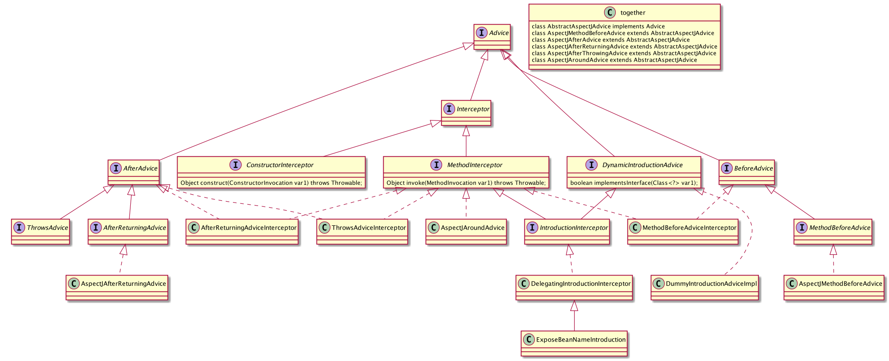
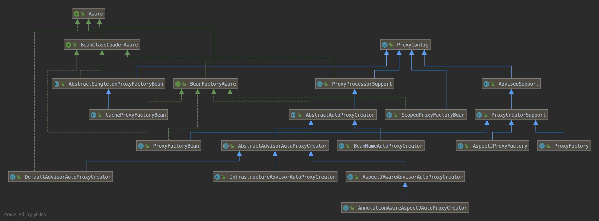

spring-aop

https://blog.csdn.net/javazejian/article/details/54561302

https://blog.csdn.net/javazejian/article/details/56267036

<https://www.iteye.com/blogs/subjects/springaop>


### 问题

1. 如何为 bean 筛选合适的通知器（Advisor）
2. 代理对象生成的过程
3. 拦截器的调用过程

### 缘起

减少侵入性

热插拔


### 定义

AOP，面向切面编程，是对OOP的补充。从网上看到的一句话：`这种在运行时，动态的将代码切入到类的指定方法或者指定位置上的编程思想，就是面向切面的编程。`这是其中的一种方式，在运行时动态添加。还有另外一种是在编译代码的时候，将代码切入到指定的方法或者位置上去，这是静态添加的方式。

### 使用

我们在实际的业务中都会有一些公共逻辑，比如日志的记录，事务的管理等等，而如果每次都把日志和事务的代码手动写到业务逻辑前后，重复代码就相当可怕，而如果这些额外代码有修改，必须要每个都修改，这是相当不明智的。AOP可以帮我们解决这些问题。

### 实现

其实AOP本身并不能帮我们解决那些问题，AOP就是一种思想，而帮我们解决的是具体的AOP的实现，比如aspectj，jboss AOP，以及我们最熟悉的Spring AOP，Spring AOP在Spring1.0的时候是自己实现的AOP框架，在2.0之后就开始集成了aspectj。现在我们所说的Spring AOP就是Spring加Aspectj这种方式。

### AOP的相关概念

对于AOP中相关的概念，我们接触更多的还是Spring AOP，这里主要是以Spring AOP的概念来说明：

- Aspect，切面，一个关注点的模块化，这个关注点可能会横切多个对象。
- JoinPoint，连接点，在程序执行过程中某个特定的点，比如某方法调用的时候或者处理异常的时候。在Spring AOP中，一个连接点总是表示一个方法的执行。
- Advice，通知，在切面的某个特定的连接点上执行的动作。（Marker Interface）
- Pointcut，切点，匹配连接点的断言。通知和一个切入点表达式关联，并在满足这个切入点的连接点上运行（例如，当执行某个特定名称的方法时）。Pointcut表达式如何和 JoinPoint 匹配是AOP的核心：Spring缺省使用AspectJ切入点语法。

上面是关于AOP中几个基本概念的定义，下面看下有关我们使用时的一些概念：

- Target Object，目标对象，被一个或者多个切面所通知的对象。也就是我们业务中实际要进行增强的业务对象。
- AOP Proxy，AOP代理，AOP框架创建的对象。也就是被增强之后的对象。
- Weaving，织入，把切面连接到其它的应用程序类型或者对象上，并创建一个被通知的对象。就是把切面作用到目标对象，然后产生一个代理对象的过程。

还有另外一个概念，是给类声明额外方法的概念：

- Introduction，引介，用来给一个类型声明额外的方法或属性。就是我可以不用实现另外一个接口，就能使用那个接口的方法。

### 通知类型

Advice是通知，也就是在切面的某个连接点上要执行的动作，也就是我们要编写的增强功能的代码。通知也分为好几种类型，分别有不同作用：

- 前置通知（Before advice）：在某连接点之前执行的通知，但这个通知不能阻止连接点之前的执行流程（除非它抛出一个异常）。
- 后置通知（After returning advice）：在某连接点正常完成后执行的通知：例如，一个方法没有抛出任何异常，正常返回。
- 异常通知（After throwing advice）：在方法抛出异常退出时执行的通知。
- 最终通知（After (finally) advice）：当某连接点退出的时候执行的通知（不论是正常返回还是异常退出）。
- 环绕通知（Around Advice）：包围一个连接点的通知，如方法调用。这是最强大的一种通知类型。环绕通知可以在方法调用前后完成自定义的行为。它也会选择是否继续执行连接点或直接返回它自己的返回值或抛出异常来结束执行。

#### 例子

切点

方法一

```java
@After(value="execution(* com.test.dao.UserDao.addUser(...))")
public void after()
{
  System.out.println("最终通知");
}
```


方法二

```java

@Pointcut("call(* *.*(..))")
void anyCall() {}

@Pointcut("call(* *.*(int)) && args(i) && target(callee)")
void anyCall(int i, Foo callee) {}

@Pointcut("")
protected abstract void anyCall();


@After(value="myPointcut()")
public void afterDemo(){
    System.out.println("最终通知....");
}
```

PointCut 的约束
1. 不能有方法体

2. 返回 void

3. 不能声明 throws

4. 方法的 modifiers 和参数必须匹配

   

通配符

`..`：匹配方法定义中的任意数量的参数，此外还匹配类定义中的任意数量包

`+`：匹配给定类的任意子类

`*`：匹配任意数量的字符


within

```java
@Pointcur("within(com.lwx.dao..*)") //dao 包及其子包中的所有类的所有方法

@Pointcur("within(com.lwx.dao.UserDaoImpl)") //UserDaoImpl 所有方法

@Pointcut("within(com.lwx.dao.UserDaoImpl+)") //UserDaoImpl类及其子类中所有方法

@Pointcut("within(com.lwx.dao.UserDao+)") //实现UserDao接口的类的所有方法
```


方法签名

```java
//scope ：方法作用域，如public,private,protect
//returnt-type：方法返回值类型
//fully-qualified-class-name：方法所在类的完全限定名称
//parameters 方法参数
execution(<scope> <return-type> <fully-qualified-class-name>.*(parameters))
```


其他指示符


bean：Spring AOP扩展的，AspectJ没有对于指示符，用于匹配特定名称的Bean对象的执行方法；

```java
//匹配名称中带有后缀Service的Bean。
@Pointcut("bean(*Service)")
private void myPointcut1(){}
```


this ：用于匹配当前AOP代理对象类型的执行方法；请注意是AOP代理对象的类型匹配，这样就可能包括引入接口也类型匹配

```java
//匹配了任意实现了UserDao接口的代理对象的方法进行过滤
@Pointcut("this(com.zejian.spring.springAop.dao.UserDao)")
private void myPointcut2(){}
```


target ：用于匹配当前目标对象类型的执行方法

```

//匹配了任意实现了UserDao接口的目标对象的方法进行过滤
@Pointcut("target(com.zejian.spring.springAop.dao.UserDao)")
private void myPointcut3(){}

```


@within：用于匹配所以持有指定注解类型内的方法；请注意与within是有区别的， within是用于匹配指定类型内的方法执行；

```
/匹配使用了MarkerAnnotation注解的类(注意是类)
@Pointcut("@within(com.zejian.spring.annotation.MarkerAnnotation)")
private void myPointcut4(){}
```


@annotation(com.zejian.spring.MarkerMethodAnnotation) : 根据所应用的注解进行方法过滤

```
//匹配使用了MarkerAnnotation注解的方法(注意是方法)
@Pointcut("@annotation(com.zejian.spring.annotation.MarkerAnnotation)")
private void myPointcut5(){}
```


target ：用于匹配当前目标对象类型的执行方法；

```
//匹配使用了MarkerAnnotation注解的类(注意是类)
@Pointcut("@within(com.zejian.spring.annotation.MarkerAnnotation)")
private void myPointcut4(){}
```


切点指示符可以使用运算符语法进行表达式的混编，如and、or、not（或者&&、||、！）

### AOP原理


上面说到了AOP可以在编译时候将代码织入到指定的方法或者属性上，或者在运行的时候动态的将代码切入到指定的方法或者属性中，这描述了AOP应该要做的事情，其实也基本算是它的原理了，AOP实现的关键就是创建AOP代理，代理有静态代理和动态代理之分，其中aspectj为静态代理，Spring AOP是动态代理，这里把静态和运行时动态的分开说。

### AspectJ编译时增强

aspectj编译时增强，既是静态代理增强，也就是会在编译阶段生成代理，将代码织入到Java的字节码中去。

### Spring AOP的运行时增强

Spring AOP是基于代理机制的，并且Spring AOP使用的是动态代理增强，动态代理不会改变类的字节码，而是动态的生成代理对象。Spring AOP的动态代理机制有两种方式：JDK动态代理和CGLIB动态代理。

Spring AOP 与ApectJ 的目的一致，都是为了统一处理横切业务，但与AspectJ不同的是，Spring AOP 并不尝试提供完整的AOP功能(即使它完全可以实现)，Spring AOP 更注重的是与Spring IOC容器的结合，并结合该优势来解决横切业务的问题，因此在AOP的功能完善方面，相对来说AspectJ具有更大的优势，同时,Spring注意到AspectJ在AOP的实现方式上依赖于特殊编译器(ajc编译器)，因此Spring很机智回避了这点，转向采用动态代理技术的实现原理来构建Spring AOP的内部机制（动态织入），这是与AspectJ（静态织入）最根本的区别。

在AspectJ 1.5后，引入@Aspect形式的注解风格的开发，Spring也非常快地跟进了这种方式，因此Spring 2.0后便使用了与AspectJ一样的注解。请注意，Spring 只是使用了与 AspectJ 5 一样的注解，但仍然没有使用 AspectJ 的编译器，底层依是动态代理技术的实现，因此并不依赖于 AspectJ 的编译器。


### JDK动态代理

JDK动态代理需要被代理的类必须实现一个接口，通过使用反射来接受被代理的类。

### CGLIB动态代理

CGLIB动态代理可以不用需要被代理类必须实现接口，被代理类可以是一个类。

### Spring AOP

上面说到了Spring AOP中使用的是动态代理机制，同时也分为两种代理机制：JDK动态代理和CGLIB动态代理，这可以在源码中看到，在DefaultAopProxyFactory的createAopProxy中可看到：

```java
public AopProxy createAopProxy(AdvisedSupport advisedSupport) throws AopConfigException {
	//可以看到这里有条件是没有实现接口
    boolean useCglib = advisedSupport.getOptimize() || advisedSupport.getProxyTargetClass() || advisedSupport.getProxiedInterfaces().length == 0;
    if (useCglib) {
        return CglibProxyFactory.createCglibProxy(advisedSupport);
    }
    else {
        // Depends on whether we have expose proxy or frozen or static ts
        return new JdkDynamicAopProxy(advisedSupport);
    }
}
```

对于接口的代理使用的JDK动态代理，而对于类的代理使用的是CGLIB动态代理。

### AOP的使用场景

AOP适用于具有横切逻辑的应用，比如性能监控，日志记录，缓存，事务管理，访问控制等。


### Advice




```java
public void addAdvice(int pos, Advice advice) throws AopConfigException {
	//只能处理实现了AOP联盟的接口的拦截器
    if (advice instanceof Interceptor && !(advice instanceof MethodInterceptor)) {
        throw new AopConfigException(getClass().getName() + " only handles AOP Alliance MethodInterceptors");
    }
	//IntroductionInfo接口类型，表示引介信息
    if (advice instanceof IntroductionInfo) {
    	//不需要IntroductionAdvisor
        addAdvisor(pos, new DefaultIntroductionAdvisor(advice, (IntroductionInfo) advice));
    }
    //动态引介增强的处理
    else if (advice instanceof DynamicIntroductionAdvice) {
        //需要IntroductionAdvisor
        throw new AopConfigException("DynamicIntroductionAdvice may only be added as part of IntroductionAdvisor");
    }
    else {
    	//添加增强器，需要先把我们的增强包装成增强器，然后添加
        addAdvisor(pos, new DefaultPointcutAdvisor(advice));
    }
}
```


### 概览




### 属性说明


```java
public abstract class AbstractAutoProxyCreator extends ProxyProcessorSupport
		implements SmartInstantiationAwareBeanPostProcessor, BeanFactoryAware {

	/**
	 * Convenience constant for subclasses: Return value for "do not proxy".
	 * @see #getAdvicesAndAdvisorsForBean
	 */
	@Nullable
	protected static final Object[] DO_NOT_PROXY = null;

	/**
	 * Convenience constant for subclasses: Return value for
	 * "proxy without additional interceptors, just the common ones".
	 * @see #getAdvicesAndAdvisorsForBean
	 */
	protected static final Object[] PROXY_WITHOUT_ADDITIONAL_INTERCEPTORS = new Object[0];

	/** Default is global AdvisorAdapterRegistry. */
	private AdvisorAdapterRegistry advisorAdapterRegistry = GlobalAdvisorAdapterRegistry.getInstance();

	/**
	 * Indicates whether or not the proxy should be frozen. Overridden from super
	 * to prevent the configuration from becoming frozen too early.
	 */
	private boolean freezeProxy = false;

	/** Default is no common interceptors. */
	private String[] interceptorNames = new String[0];

	private boolean applyCommonInterceptorsFirst = true;

	private TargetSourceCreator[] customTargetSourceCreators;

	private BeanFactory beanFactory;

	private final Set<String> targetSourcedBeans;

	private final Map<Object, Object> earlyProxyReferences;

  //key 为类的唯一标志，value 为代理类
	private final Map<Object, Class<?>> proxyTypes;

  // key 为类，value 为该类是否需要 AOP
	private final Map<Object, Boolean> advisedBeans;
}
```


```java
public class BeanFactoryAspectJAdvisorsBuilder {

	private final ListableBeanFactory beanFactory;

	private final AspectJAdvisorFactory advisorFactory;

	@Nullable
	private volatile List<String> aspectBeanNames;

  // 所有增强的 Advisor，以 aspectBeanName 为 key
	private final Map<String, List<Advisor>> advisorsCache;

  // 
	private final Map<String, MetadataAwareAspectInstanceFactory> aspectFactoryCache;
}
```


## 创建 AOP 动态代理

创建 AOP 代理的主流程

1. 检查是否需要处理

2. 找到需要增强的方法

   2.1 找到有 AspectJ 注解的类。

3. 创建代理类

```java
	@Override
	public Object postProcessBeforeInstantiation(Class<?> beanClass, String beanName) {
		Object cacheKey = getCacheKey(beanClass, beanName);

    //1. 检查是否需要处理
		if (!StringUtils.hasLength(beanName) || !this.targetSourcedBeans.contains(beanName)) {
      //已经处理过
			if (this.advisedBeans.containsKey(cacheKey)) {
				return null;
			}
      //排除
      //1. Advice，Pointcut，Advisor，AopInfrastructureBean, beanName
      //以 .ORIGINAL 结尾的类
			if (isInfrastructureClass(beanClass) || shouldSkip(beanClass, beanName)) {
				this.advisedBeans.put(cacheKey, Boolean.FALSE);
				return null;
			}
		}

		// Create proxy here if we have a custom TargetSource.
		// Suppresses unnecessary default instantiation of the target bean:
		// The TargetSource will handle target instances in a custom fashion.
		TargetSource targetSource = getCustomTargetSource(beanClass, beanName);
		if (targetSource != null) {
			if (StringUtils.hasLength(beanName)) {
				this.targetSourcedBeans.add(beanName);
			}
      //2. 找到需要增强的方法
			Object[] specificInterceptors = getAdvicesAndAdvisorsForBean(beanClass, beanName, targetSource);
      //3. 创建代理类
			Object proxy = createProxy(beanClass, beanName, specificInterceptors, targetSource);
			this.proxyTypes.put(cacheKey, proxy.getClass());
			return proxy;
		}

		return null;
	}


```


### 找到增强的方法

这里以 AbstractAdvisorAutoProxyCreator 为例

#### getAdvicesAndAdvisorsForBean

```java
  protected Object[] getAdvicesAndAdvisorsForBean(
      Class<?> beanClass, String beanName, @Nullable TargetSource targetSource) {
   
   //找到合格的Advisor
   List<Advisor> advisors = findEligibleAdvisors(beanClass, beanName);
   if (advisors.isEmpty()) {
      return DO_NOT_PROXY;
   }
   return advisors.toArray();
  }

	protected List<Advisor> findEligibleAdvisors(Class<?> beanClass, String beanName) {
    // 找到候选 advisor
		List<Advisor> candidateAdvisors = findCandidateAdvisors();
    // 
		List<Advisor> eligibleAdvisors = findAdvisorsThatCanApply(candidateAdvisors, beanClass, beanName);
		extendAdvisors(eligibleAdvisors);
		if (!eligibleAdvisors.isEmpty()) {
			eligibleAdvisors = sortAdvisors(eligibleAdvisors);
		}
		return eligibleAdvisors;
	}

  // 找到满足条件（继承 Advice 和  Around, Before, After, AfterReturning, AfterThrowing）的 Advisor
	protected List<Advisor> findCandidateAdvisors() {
		Assert.state(this.advisorRetrievalHelper != null, "No BeanFactoryAdvisorRetrievalHelper available");
		return this.advisorRetrievalHelper.findAdvisorBeans();
	}

  // 找到满足条件（继承 Advice 和  Around, Before, After, AfterReturning, AfterThrowing）的 Advisor
	public List<Advisor> findAdvisorBeans() {
		// Determine list of advisor bean names, if not cached already.
		String[] advisorNames = this.cachedAdvisorBeanNames;
    // 1. 继承 Advisor 的 Bean
		if (advisorNames == null) {
			// Do not initialize FactoryBeans here: We need to leave all regular beans
			// uninitialized to let the auto-proxy creator apply to them!
			advisorNames = BeanFactoryUtils.beanNamesForTypeIncludingAncestors(
					this.beanFactory, Advisor.class, true, false);
			this.cachedAdvisorBeanNames = advisorNames;
		}
		if (advisorNames.length == 0) {
			return new ArrayList<>();
		}

		List<Advisor> advisors = new ArrayList<>();
		for (String name : advisorNames) {
			if (isEligibleBean(name)) {
				if (this.beanFactory.isCurrentlyInCreation(name)) {
					if (logger.isTraceEnabled()) {
						logger.trace("Skipping currently created advisor '" + name + "'");
					}
				}
				else {
					try {
            // 2. Bean 对应的 Advisor
						advisors.add(this.beanFactory.getBean(name, Advisor.class));
					}
					catch (BeanCreationException ex) {
						Throwable rootCause = ex.getMostSpecificCause();
						if (rootCause instanceof BeanCurrentlyInCreationException) {
							BeanCreationException bce = (BeanCreationException) rootCause;
							String bceBeanName = bce.getBeanName();
							if (bceBeanName != null && this.beanFactory.isCurrentlyInCreation(bceBeanName)) {
								if (logger.isTraceEnabled()) {
									logger.trace("Skipping advisor '" + name +
											"' with dependency on currently created bean: " + ex.getMessage());
								}
								// Ignore: indicates a reference back to the bean we're trying to advise.
								// We want to find advisors other than the currently created bean itself.
								continue;
							}
						}
						throw ex;
					}
				}
			}
		}
		return advisors;
	}
```


#### findCandidateAdvisors

```java
	@Override
	protected List<Advisor> findCandidateAdvisors() {
		// Add all the Spring advisors found according to superclass rules.
		List<Advisor> advisors = super.findCandidateAdvisors();
		// Build Advisors for all AspectJ aspects in the bean factory.
    // 找到所有有 AspectJ 注解的 bean，找到 Around, Before, After, AfterReturning, AfterThrowing 方法对应的 Advisor
		if (this.aspectJAdvisorsBuilder != null) {
			advisors.addAll(this.aspectJAdvisorsBuilder.buildAspectJAdvisors());
		}
		return advisors;
	}
	
  // 找到所有有 AspectJ 注解的 bean，找到 Around, Before, After, AfterReturning, AfterThrowing 方法对应的 Advisor
	public List<Advisor> buildAspectJAdvisors() {
		List<String> aspectNames = this.aspectBeanNames;

    //1. 如果 aspectNames 为空，找到 aspectNames
		if (aspectNames == null) {
			synchronized (this) {
				aspectNames = this.aspectBeanNames;
				if (aspectNames == null) {
					List<Advisor> advisors = new ArrayList<>();
					aspectNames = new ArrayList<>();
          // 1.1 获取所有的 beanName
					String[] beanNames = BeanFactoryUtils.beanNamesForTypeIncludingAncestors(
							this.beanFactory, Object.class, true, false);
					for (String beanName : beanNames) {
            // 1.2 不合格的类过滤掉(由子类自定义)
						if (!isEligibleBean(beanName)) {
							continue;
						}
						// We must be careful not to instantiate beans eagerly as in this case they
						// would be cached by the Spring container but would not have been weaved.
						Class<?> beanType = this.beanFactory.getType(beanName);
						if (beanType == null) {
							continue;
						}
            // 1.3 如果存在 Aspect 注解
						if (this.advisorFactory.isAspect(beanType)) {
							aspectNames.add(beanName);
							AspectMetadata amd = new AspectMetadata(beanType, beanName);
              // 1.3.1 如果是单例 Bean，加入缓存并返回
							if (amd.getAjType().getPerClause().getKind() == PerClauseKind.SINGLETON) {
								MetadataAwareAspectInstanceFactory factory =
										new BeanFactoryAspectInstanceFactory(this.beanFactory, beanName);
                // 1.3.1.1 解析 AspectJ 增强的 advisor
								List<Advisor> classAdvisors = this.advisorFactory.getAdvisors(factory);
                // 1.3.1.2 加入缓存
								if (this.beanFactory.isSingleton(beanName)) {
									this.advisorsCache.put(beanName, classAdvisors);
								}
								else {
									this.aspectFactoryCache.put(beanName, factory);
								}
								advisors.addAll(classAdvisors);
							}
              // 1.3.2 如果是非单例的 Bean，加入缓存并返回
							else {
								// Per target or per this.
								if (this.beanFactory.isSingleton(beanName)) {
									throw new IllegalArgumentException("Bean with name '" + beanName +
											"' is a singleton, but aspect instantiation model is not singleton");
								}
								MetadataAwareAspectInstanceFactory factory =
										new PrototypeAspectInstanceFactory(this.beanFactory, beanName);
                //1.3.2.1
								this.aspectFactoryCache.put(beanName, factory);
								advisors.addAll(this.advisorFactory.getAdvisors(factory));
							}
						}
					}
					this.aspectBeanNames = aspectNames;
					return advisors;
				}
			}
      
      if (aspectNames.isEmpty()) {
        return Collections.emptyList();
      }
      //2. 从缓存中找到 aspectNames 对应的 advisor，并返回
      List<Advisor> advisors = new ArrayList<>();
      for (String aspectName : aspectNames) {
        List<Advisor> cachedAdvisors = this.advisorsCache.get(aspectName);
        if (cachedAdvisors != null) {
          advisors.addAll(cachedAdvisors);
        }
        else {
          MetadataAwareAspectInstanceFactory factory = this.aspectFactoryCache.get(aspectName);
          advisors.addAll(this.advisorFactory.getAdvisors(factory));
        }
      }
      return advisors;  
		}
    
  // 找到 Around, Before, After, AfterReturning, AfterThrowing 的方法
	public List<Advisor> getAdvisors(MetadataAwareAspectInstanceFactory aspectInstanceFactory) {
		Class<?> aspectClass = aspectInstanceFactory.getAspectMetadata().getAspectClass();
		String aspectName = aspectInstanceFactory.getAspectMetadata().getAspectName();
		validate(aspectClass);

		// We need to wrap the MetadataAwareAspectInstanceFactory with a decorator
		// so that it will only instantiate once.
		MetadataAwareAspectInstanceFactory lazySingletonAspectInstanceFactory =
				new LazySingletonAspectInstanceFactoryDecorator(aspectInstanceFactory);

		List<Advisor> advisors = new ArrayList<>();
    // 1. 找到不含有 Pointcut 注解方法
		for (Method method : getAdvisorMethods(aspectClass)) {
      //2. 有 Pointcut, Around, Before, After, AfterReturning, AfterThrowing 注解的方法，并生成对应的 Advisor()
			Advisor advisor = getAdvisor(method, lazySingletonAspectInstanceFactory, advisors.size(), aspectName);
			if (advisor != null) {
				advisors.add(advisor);
			}
		}

		// If it's a per target aspect, emit the dummy instantiating aspect.
		if (!advisors.isEmpty() && lazySingletonAspectInstanceFactory.getAspectMetadata().isLazilyInstantiated()) {
			Advisor instantiationAdvisor = new SyntheticInstantiationAdvisor(lazySingletonAspectInstanceFactory);
			advisors.add(0, instantiationAdvisor);
		}

		// Find introduction fields.
    // 获取 DeclareParents 注解
		for (Field field : aspectClass.getDeclaredFields()) {
			Advisor advisor = getDeclareParentsAdvisor(field);
			if (advisor != null) {
				advisors.add(advisor);
			}
		}

		return advisors;
	}

  // 方法不包括 Pointcut 注解的方法
	private List<Method> getAdvisorMethods(Class<?> aspectClass) {
		final List<Method> methods = new ArrayList<>();
		ReflectionUtils.doWithMethods(aspectClass, method -> {
			// Exclude pointcuts
			if (AnnotationUtils.getAnnotation(method, Pointcut.class) == null) {
				methods.add(method);
			}
		});
    // 按照 Around, Before, After, AfterReturning, AfterThrowing 的顺序排序
		methods.sort(METHOD_COMPARATOR);
		return methods;
	}

	public Advisor getAdvisor(Method candidateAdviceMethod, MetadataAwareAspectInstanceFactory aspectInstanceFactory,
			int declarationOrderInAspect, String aspectName) {

		validate(aspectInstanceFactory.getAspectMetadata().getAspectClass());

    //方法有 Pointcut, Around, Before, After, AfterReturning, AfterThrowing 进行封装
		AspectJExpressionPointcut expressionPointcut = getPointcut(
				candidateAdviceMethod, aspectInstanceFactory.getAspectMetadata().getAspectClass());
		if (expressionPointcut == null) {
			return null;
		}
    
    // 生成注解对应的 Advisor
		return new InstantiationModelAwarePointcutAdvisorImpl(expressionPointcut, candidateAdviceMethod,
				this, aspectInstanceFactory, declarationOrderInAspect, aspectName);
	}
    
  //对方法有 Around, Before, After, AfterReturning, AfterThrowing 注解类进行封装（被注解的类，被注解的方法，注解表达式，beanFactory）。
	private AspectJExpressionPointcut getPointcut(Method candidateAdviceMethod, Class<?> candidateAspectClass) {
    // 方法有 Pointcut, Around, Before, After, AfterReturning, AfterThrowing 注解
		AspectJAnnotation<?> aspectJAnnotation =
				AbstractAspectJAdvisorFactory.findAspectJAnnotationOnMethod(candidateAdviceMethod);
		if (aspectJAnnotation == null) {
			return null;
		}

		AspectJExpressionPointcut ajexp =
				new AspectJExpressionPointcut(candidateAspectClass, new String[0], new Class<?>[0]);
		ajexp.setExpression(aspectJAnnotation.getPointcutExpression());
		if (this.beanFactory != null) {
			ajexp.setBeanFactory(this.beanFactory);
		}
		return ajexp;
	}
    
  // 找到 ASPECTJ_ANNOTATION_CLASSES 中任一注解
	protected static AspectJAnnotation<?> findAspectJAnnotationOnMethod(Method method) {
    // private static final Class<?>[] ASPECTJ_ANNOTATION_CLASSES = new Class<?>[] { Pointcut.class, Around.class, Before.class, After.class, AfterReturning.class, AfterThrowing.class}
		for (Class<?> clazz : ASPECTJ_ANNOTATION_CLASSES) {
			AspectJAnnotation<?> foundAnnotation = findAnnotation(method, (Class<Annotation>) clazz);
			if (foundAnnotation != null) {
				return foundAnnotation;
			}
		}
		return null;
	}

	@Nullable
	private static <A extends Annotation> AspectJAnnotation<A> findAnnotation(Method method, Class<A> toLookFor) {
		A result = AnnotationUtils.findAnnotation(method, toLookFor);
		if (result != null) {
			return new AspectJAnnotation<>(result);
		}
		else {
			return null;
		}
	}    
    
	public InstantiationModelAwarePointcutAdvisorImpl(AspectJExpressionPointcut declaredPointcut,
			Method aspectJAdviceMethod, AspectJAdvisorFactory aspectJAdvisorFactory,
			MetadataAwareAspectInstanceFactory aspectInstanceFactory, int declarationOrder, String aspectName) {

		this.declaredPointcut = declaredPointcut;
		this.declaringClass = aspectJAdviceMethod.getDeclaringClass();
		this.methodName = aspectJAdviceMethod.getName();
		this.parameterTypes = aspectJAdviceMethod.getParameterTypes();
		this.aspectJAdviceMethod = aspectJAdviceMethod;
		this.aspectJAdvisorFactory = aspectJAdvisorFactory;
		this.aspectInstanceFactory = aspectInstanceFactory;
		this.declarationOrder = declarationOrder;
		this.aspectName = aspectName;

		if (aspectInstanceFactory.getAspectMetadata().isLazilyInstantiated()) {
			// Static part of the pointcut is a lazy type.
			Pointcut preInstantiationPointcut = Pointcuts.union(
					aspectInstanceFactory.getAspectMetadata().getPerClausePointcut(), this.declaredPointcut);

			// Make it dynamic: must mutate from pre-instantiation to post-instantiation state.
			// If it's not a dynamic pointcut, it may be optimized out
			// by the Spring AOP infrastructure after the first evaluation.
			this.pointcut = new PerTargetInstantiationModelPointcut(
					this.declaredPointcut, preInstantiationPointcut, aspectInstanceFactory);
			this.lazy = true;
		}
		else {
			// A singleton aspect.
			this.pointcut = this.declaredPointcut;
			this.lazy = false;
			this.instantiatedAdvice = instantiateAdvice(this.declaredPointcut);
		}
	}    
    
	private Advice instantiateAdvice(AspectJExpressionPointcut pointcut) {
		Advice advice = this.aspectJAdvisorFactory.getAdvice(this.aspectJAdviceMethod, pointcut,
				this.aspectInstanceFactory, this.declarationOrder, this.aspectName);
		return (advice != null ? advice : EMPTY_ADVICE);
	}
    
	public Advice getAdvice(Method candidateAdviceMethod, AspectJExpressionPointcut expressionPointcut,
			MetadataAwareAspectInstanceFactory aspectInstanceFactory, int declarationOrder, String aspectName) {

		Class<?> candidateAspectClass = aspectInstanceFactory.getAspectMetadata().getAspectClass();
		validate(candidateAspectClass);

		AspectJAnnotation<?> aspectJAnnotation =
				AbstractAspectJAdvisorFactory.findAspectJAnnotationOnMethod(candidateAdviceMethod);
		if (aspectJAnnotation == null) {
			return null;
		}

		// If we get here, we know we have an AspectJ method.
		// Check that it's an AspectJ-annotated class
		if (!isAspect(candidateAspectClass)) {
			throw new AopConfigException("Advice must be declared inside an aspect type: " +
					"Offending method '" + candidateAdviceMethod + "' in class [" +
					candidateAspectClass.getName() + "]");
		}

		if (logger.isDebugEnabled()) {
			logger.debug("Found AspectJ method: " + candidateAdviceMethod);
		}

		AbstractAspectJAdvice springAdvice;

    // 根据注解类型创建对应的类
		switch (aspectJAnnotation.getAnnotationType()) {
			case AtPointcut:
				if (logger.isDebugEnabled()) {
					logger.debug("Processing pointcut '" + candidateAdviceMethod.getName() + "'");
				}
				return null;
			case AtAround:
				springAdvice = new AspectJAroundAdvice(
						candidateAdviceMethod, expressionPointcut, aspectInstanceFactory);
				break;
			case AtBefore:
				springAdvice = new AspectJMethodBeforeAdvice(
						candidateAdviceMethod, expressionPointcut, aspectInstanceFactory);
				break;
			case AtAfter:
				springAdvice = new AspectJAfterAdvice(
						candidateAdviceMethod, expressionPointcut, aspectInstanceFactory);
				break;
			case AtAfterReturning:
				springAdvice = new AspectJAfterReturningAdvice(
						candidateAdviceMethod, expressionPointcut, aspectInstanceFactory);
				AfterReturning afterReturningAnnotation = (AfterReturning) aspectJAnnotation.getAnnotation();
				if (StringUtils.hasText(afterReturningAnnotation.returning())) {
					springAdvice.setReturningName(afterReturningAnnotation.returning());
				}
				break;
			case AtAfterThrowing:
				springAdvice = new AspectJAfterThrowingAdvice(
						candidateAdviceMethod, expressionPointcut, aspectInstanceFactory);
				AfterThrowing afterThrowingAnnotation = (AfterThrowing) aspectJAnnotation.getAnnotation();
				if (StringUtils.hasText(afterThrowingAnnotation.throwing())) {
					springAdvice.setThrowingName(afterThrowingAnnotation.throwing());
				}
				break;
			default:
				throw new UnsupportedOperationException(
						"Unsupported advice type on method: " + candidateAdviceMethod);
		}

		// Now to configure the advice...
		springAdvice.setAspectName(aspectName);
		springAdvice.setDeclarationOrder(declarationOrder);
		String[] argNames = this.parameterNameDiscoverer.getParameterNames(candidateAdviceMethod);
		if (argNames != null) {
			springAdvice.setArgumentNamesFromStringArray(argNames);
		}
		springAdvice.calculateArgumentBindings();

		return springAdvice;
	}    
```


#### findAdvisorsThatCanApply

```java
	protected List<Advisor> findAdvisorsThatCanApply(
			List<Advisor> candidateAdvisors, Class<?> beanClass, String beanName) {

		ProxyCreationContext.setCurrentProxiedBeanName(beanName);
		try {
			return AopUtils.findAdvisorsThatCanApply(candidateAdvisors, beanClass);
		}
		finally {
			ProxyCreationContext.setCurrentProxiedBeanName(null);
		}
	}
 
  // 找到继承 IntroductionAdvisor 和 PointcutAdvisor 的 Advisor
	public static List<Advisor> findAdvisorsThatCanApply(List<Advisor> candidateAdvisors, Class<?> clazz) {
		if (candidateAdvisors.isEmpty()) {
			return candidateAdvisors;
		}
		List<Advisor> eligibleAdvisors = new ArrayList<>();
		for (Advisor candidate : candidateAdvisors) {
			if (candidate instanceof IntroductionAdvisor && canApply(candidate, clazz)) {
				eligibleAdvisors.add(candidate);
			}
		}
		boolean hasIntroductions = !eligibleAdvisors.isEmpty();
		for (Advisor candidate : candidateAdvisors) {
			if (candidate instanceof IntroductionAdvisor) {
				// already processed
				continue;
			}
			if (canApply(candidate, clazz, hasIntroductions)) {
				eligibleAdvisors.add(candidate);
			}
		}
		return eligibleAdvisors;
	}

	public static boolean canApply(Advisor advisor, Class<?> targetClass, boolean hasIntroductions) {
		if (advisor instanceof IntroductionAdvisor) {
			return ((IntroductionAdvisor) advisor).getClassFilter().matches(targetClass);
		}
		else if (advisor instanceof PointcutAdvisor) {
			PointcutAdvisor pca = (PointcutAdvisor) advisor;
			return canApply(pca.getPointcut(), targetClass, hasIntroductions);
		}
		else {
			// It doesn't have a pointcut so we assume it applies.
			return true;
		}
	}

	public static boolean canApply(Pointcut pc, Class<?> targetClass, boolean hasIntroductions) {
		Assert.notNull(pc, "Pointcut must not be null");
		if (!pc.getClassFilter().matches(targetClass)) {
			return false;
		}

		MethodMatcher methodMatcher = pc.getMethodMatcher();
		if (methodMatcher == MethodMatcher.TRUE) {
			// No need to iterate the methods if we're matching any method anyway...
			return true;
		}

		IntroductionAwareMethodMatcher introductionAwareMethodMatcher = null;
		if (methodMatcher instanceof IntroductionAwareMethodMatcher) {
			introductionAwareMethodMatcher = (IntroductionAwareMethodMatcher) methodMatcher;
		}

		Set<Class<?>> classes = new LinkedHashSet<>();
		if (!Proxy.isProxyClass(targetClass)) {
			classes.add(ClassUtils.getUserClass(targetClass));
		}
		classes.addAll(ClassUtils.getAllInterfacesForClassAsSet(targetClass));

		for (Class<?> clazz : classes) {
			Method[] methods = ReflectionUtils.getAllDeclaredMethods(clazz);
			for (Method method : methods) {
				if (introductionAwareMethodMatcher != null ?
						introductionAwareMethodMatcher.matches(method, targetClass, hasIntroductions) :
						methodMatcher.matches(method, targetClass)) {
					return true;
				}
			}
		}

		return false;
	}
```


#### createProxy

```java
	protected Object createProxy(Class<?> beanClass, @Nullable String beanName,
			@Nullable Object[] specificInterceptors, TargetSource targetSource) {

		if (this.beanFactory instanceof ConfigurableListableBeanFactory) {
			AutoProxyUtils.exposeTargetClass((ConfigurableListableBeanFactory) this.beanFactory, beanName, beanClass);
		}

		ProxyFactory proxyFactory = new ProxyFactory();
    //拷贝属性
		proxyFactory.copyFrom(this);

		if (!proxyFactory.isProxyTargetClass()) {
			if (shouldProxyTargetClass(beanClass, beanName)) {
				proxyFactory.setProxyTargetClass(true);
			}
			else {
				evaluateProxyInterfaces(beanClass, proxyFactory);
			}
		}

    // 公共拦截器和注解解析的拦截器
		Advisor[] advisors = buildAdvisors(beanName, specificInterceptors);
		proxyFactory.addAdvisors(advisors);
		proxyFactory.setTargetSource(targetSource);
    
    // 子类定制
		customizeProxyFactory(proxyFactory);

		proxyFactory.setFrozen(this.freezeProxy);
    // 子类定制
		if (advisorsPreFiltered()) {
			proxyFactory.setPreFiltered(true);
		}

		return proxyFactory.getProxy(getProxyClassLoader());
	}

  // 公共拦截器和注解解析的拦截器
	protected Advisor[] buildAdvisors(@Nullable String beanName, @Nullable Object[] specificInterceptors) {
		// Handle prototypes correctly...
		Advisor[] commonInterceptors = resolveInterceptorNames();

		List<Object> allInterceptors = new ArrayList<>();
		if (specificInterceptors != null) {
			allInterceptors.addAll(Arrays.asList(specificInterceptors));
			if (commonInterceptors.length > 0) {
				if (this.applyCommonInterceptorsFirst) {
					allInterceptors.addAll(0, Arrays.asList(commonInterceptors));
				}
				else {
					allInterceptors.addAll(Arrays.asList(commonInterceptors));
				}
			}
		}
		if (logger.isTraceEnabled()) {
			int nrOfCommonInterceptors = commonInterceptors.length;
			int nrOfSpecificInterceptors = (specificInterceptors != null ? specificInterceptors.length : 0);
			logger.trace("Creating implicit proxy for bean '" + beanName + "' with " + nrOfCommonInterceptors +
					" common interceptors and " + nrOfSpecificInterceptors + " specific interceptors");
		}

		Advisor[] advisors = new Advisor[allInterceptors.size()];
		for (int i = 0; i < allInterceptors.size(); i++) {
			advisors[i] = this.advisorAdapterRegistry.wrap(allInterceptors.get(i));
		}
		return advisors;
	}

  // 公共拦截器
	private Advisor[] resolveInterceptorNames() {
		BeanFactory bf = this.beanFactory;
		ConfigurableBeanFactory cbf = (bf instanceof ConfigurableBeanFactory ? (ConfigurableBeanFactory) bf : null);
		List<Advisor> advisors = new ArrayList<>();
		for (String beanName : this.interceptorNames) {
			if (cbf == null || !cbf.isCurrentlyInCreation(beanName)) {
				Assert.state(bf != null, "BeanFactory required for resolving interceptor names");
				Object next = bf.getBean(beanName);
				advisors.add(this.advisorAdapterRegistry.wrap(next));
			}
		}
		return advisors.toArray(new Advisor[0]);
	}

	public Advisor wrap(Object adviceObject) throws UnknownAdviceTypeException {
		if (adviceObject instanceof Advisor) {
			return (Advisor) adviceObject;
		}
		if (!(adviceObject instanceof Advice)) {
			throw new UnknownAdviceTypeException(adviceObject);
		}
		Advice advice = (Advice) adviceObject;
		if (advice instanceof MethodInterceptor) {
			// So well-known it doesn't even need an adapter.
			return new DefaultPointcutAdvisor(advice);
		}
		for (AdvisorAdapter adapter : this.adapters) {
			// Check that it is supported.
			if (adapter.supportsAdvice(advice)) {
				return new DefaultPointcutAdvisor(advice);
			}
		}
		throw new UnknownAdviceTypeException(advice);
	}
```


```java
	public Object getProxy(@Nullable ClassLoader classLoader) {
		return createAopProxy().getProxy(classLoader);
	}
	
	protected final synchronized AopProxy createAopProxy() {
		if (!this.active) {
			activate();
		}
		return getAopProxyFactory().createAopProxy(this);
	}
	
  // 两种代理，
	public AopProxy createAopProxy(AdvisedSupport config) throws AopConfigException {
		if (config.isOptimize() || config.isProxyTargetClass() || hasNoUserSuppliedProxyInterfaces(config)) {
			Class<?> targetClass = config.getTargetClass();
			if (targetClass == null) {
				throw new AopConfigException("TargetSource cannot determine target class: " +
						"Either an interface or a target is required for proxy creation.");
			}
			if (targetClass.isInterface() || Proxy.isProxyClass(targetClass)) {
				return new JdkDynamicAopProxy(config);
			}
			return new ObjenesisCglibAopProxy(config);
		}
		else {
			return new JdkDynamicAopProxy(config);
		}
	}

	/**
	 * Determine whether the supplied {@link AdvisedSupport} has only the
	 * {@link org.springframework.aop.SpringProxy} interface specified
	 * (or no proxy interfaces specified at all).
	 */
	private boolean hasNoUserSuppliedProxyInterfaces(AdvisedSupport config) {
		Class<?>[] ifcs = config.getProxiedInterfaces();
		return (ifcs.length == 0 || (ifcs.length == 1 && SpringProxy.class.isAssignableFrom(ifcs[0])));
	}

	
```


#### cglib 的 getProxy

```java
	public Object getProxy() {
		return getProxy(null);
	}

	@Override
	public Object getProxy(@Nullable ClassLoader classLoader) {
		if (logger.isTraceEnabled()) {
			logger.trace("Creating CGLIB proxy: " + this.advised.getTargetSource());
		}

		try {
			Class<?> rootClass = this.advised.getTargetClass();
			Assert.state(rootClass != null, "Target class must be available for creating a CGLIB proxy");

			Class<?> proxySuperClass = rootClass;
      // 1. 类名包含 "$$"
			if (ClassUtils.isCglibProxyClass(rootClass)) {
				proxySuperClass = rootClass.getSuperclass();
				Class<?>[] additionalInterfaces = rootClass.getInterfaces();
				for (Class<?> additionalInterface : additionalInterfaces) {
					this.advised.addInterface(additionalInterface);
				}
			}

			// Validate the class, writing log messages as necessary.
			validateClassIfNecessary(proxySuperClass, classLoader);

			// 2. 配置 CGLIB Enhancer...
			Enhancer enhancer = createEnhancer();
			if (classLoader != null) {
				enhancer.setClassLoader(classLoader);
				if (classLoader instanceof SmartClassLoader &&
						((SmartClassLoader) classLoader).isClassReloadable(proxySuperClass)) {
					enhancer.setUseCache(false);
				}
			}
			enhancer.setSuperclass(proxySuperClass);
			enhancer.setInterfaces(AopProxyUtils.completeProxiedInterfaces(this.advised));
			enhancer.setNamingPolicy(SpringNamingPolicy.INSTANCE);
			enhancer.setStrategy(new ClassLoaderAwareUndeclaredThrowableStrategy(classLoader));

      // 3. 生成拦截器
			Callback[] callbacks = getCallbacks(rootClass);
			Class<?>[] types = new Class<?>[callbacks.length];
			for (int x = 0; x < types.length; x++) {
				types[x] = callbacks[x].getClass();
			}
			// fixedInterceptorMap only populated at this point, after getCallbacks call above
			enhancer.setCallbackFilter(new ProxyCallbackFilter(
					this.advised.getConfigurationOnlyCopy(), this.fixedInterceptorMap, this.fixedInterceptorOffset));
			enhancer.setCallbackTypes(types);

			// 4. 生成代理类
			return createProxyClassAndInstance(enhancer, callbacks);
		}
		catch (CodeGenerationException | IllegalArgumentException ex) {
			throw new AopConfigException("Could not generate CGLIB subclass of " + this.advised.getTargetClass() +
					": Common causes of this problem include using a final class or a non-visible class",
					ex);
		}
		catch (Throwable ex) {
			// TargetSource.getTarget() failed
			throw new AopConfigException("Unexpected AOP exception", ex);
		}
	}

	private Callback[] getCallbacks(Class<?> rootClass) throws Exception {
		// Parameters used for optimization choices...
		boolean exposeProxy = this.advised.isExposeProxy();
		boolean isFrozen = this.advised.isFrozen();
		boolean isStatic = this.advised.getTargetSource().isStatic();

		// Choose an "aop" interceptor (used for AOP calls).
		Callback aopInterceptor = new DynamicAdvisedInterceptor(this.advised);

		// Choose a "straight to target" interceptor. (used for calls that are
		// unadvised but can return this). May be required to expose the proxy.
		Callback targetInterceptor;
		if (exposeProxy) {
			targetInterceptor = (isStatic ?
					new StaticUnadvisedExposedInterceptor(this.advised.getTargetSource().getTarget()) :
					new DynamicUnadvisedExposedInterceptor(this.advised.getTargetSource()));
		}
		else {
			targetInterceptor = (isStatic ?
					new StaticUnadvisedInterceptor(this.advised.getTargetSource().getTarget()) :
					new DynamicUnadvisedInterceptor(this.advised.getTargetSource()));
		}

		// Choose a "direct to target" dispatcher (used for
		// unadvised calls to static targets that cannot return this).
		Callback targetDispatcher = (isStatic ?
				new StaticDispatcher(this.advised.getTargetSource().getTarget()) : new SerializableNoOp());

		Callback[] mainCallbacks = new Callback[] {
				aopInterceptor,  // for normal advice
				targetInterceptor,  // invoke target without considering advice, if optimized
				new SerializableNoOp(),  // no override for methods mapped to this
				targetDispatcher, this.advisedDispatcher,
				new EqualsInterceptor(this.advised),
				new HashCodeInterceptor(this.advised)
		};

		Callback[] callbacks;

		// If the target is a static one and the advice chain is frozen,
		// then we can make some optimizations by sending the AOP calls
		// direct to the target using the fixed chain for that method.
		if (isStatic && isFrozen) {
			Method[] methods = rootClass.getMethods();
			Callback[] fixedCallbacks = new Callback[methods.length];
			this.fixedInterceptorMap = new HashMap<>(methods.length);

			// TODO: small memory optimization here (can skip creation for methods with no advice)
			for (int x = 0; x < methods.length; x++) {
				List<Object> chain = this.advised.getInterceptorsAndDynamicInterceptionAdvice(methods[x], rootClass);
				fixedCallbacks[x] = new FixedChainStaticTargetInterceptor(
						chain, this.advised.getTargetSource().getTarget(), this.advised.getTargetClass());
				this.fixedInterceptorMap.put(methods[x].toString(), x);
			}

			// Now copy both the callbacks from mainCallbacks
			// and fixedCallbacks into the callbacks array.
			callbacks = new Callback[mainCallbacks.length + fixedCallbacks.length];
			System.arraycopy(mainCallbacks, 0, callbacks, 0, mainCallbacks.length);
			System.arraycopy(fixedCallbacks, 0, callbacks, mainCallbacks.length, fixedCallbacks.length);
			this.fixedInterceptorOffset = mainCallbacks.length;
		}
		else {
			callbacks = mainCallbacks;
		}
		return callbacks;
	}

	protected Object createProxyClassAndInstance(Enhancer enhancer, Callback[] callbacks) {
		enhancer.setInterceptDuringConstruction(false);
		enhancer.setCallbacks(callbacks);
		return (this.constructorArgs != null && this.constructorArgTypes != null ?
				enhancer.create(this.constructorArgTypes, this.constructorArgs) :
				enhancer.create());
	}
```


#### Jdk 的 getProxy

```java
	@Override
	public Object getProxy() {
		return getProxy(ClassUtils.getDefaultClassLoader());
	}

	@Override
	public Object getProxy(@Nullable ClassLoader classLoader) {
		if (logger.isTraceEnabled()) {
			logger.trace("Creating JDK dynamic proxy: " + this.advised.getTargetSource());
		}
		Class<?>[] proxiedInterfaces = AopProxyUtils.completeProxiedInterfaces(this.advised, true);
		findDefinedEqualsAndHashCodeMethods(proxiedInterfaces);
		return Proxy.newProxyInstance(classLoader, proxiedInterfaces, this);
	}

	static Class<?>[] completeProxiedInterfaces(AdvisedSupport advised, boolean decoratingProxy) {
		Class<?>[] specifiedInterfaces = advised.getProxiedInterfaces();
		if (specifiedInterfaces.length == 0) {
			// No user-specified interfaces: check whether target class is an interface.
			Class<?> targetClass = advised.getTargetClass();
			if (targetClass != null) {
				if (targetClass.isInterface()) {
					advised.setInterfaces(targetClass);
				}
				else if (Proxy.isProxyClass(targetClass)) {
					advised.setInterfaces(targetClass.getInterfaces());
				}
				specifiedInterfaces = advised.getProxiedInterfaces();
			}
		}
		boolean addSpringProxy = !advised.isInterfaceProxied(SpringProxy.class);
		boolean addAdvised = !advised.isOpaque() && !advised.isInterfaceProxied(Advised.class);
		boolean addDecoratingProxy = (decoratingProxy && !advised.isInterfaceProxied(DecoratingProxy.class));
		int nonUserIfcCount = 0;
		if (addSpringProxy) {
			nonUserIfcCount++;
		}
		if (addAdvised) {
			nonUserIfcCount++;
		}
		if (addDecoratingProxy) {
			nonUserIfcCount++;
		}
		Class<?>[] proxiedInterfaces = new Class<?>[specifiedInterfaces.length + nonUserIfcCount];
		System.arraycopy(specifiedInterfaces, 0, proxiedInterfaces, 0, specifiedInterfaces.length);
		int index = specifiedInterfaces.length;
		if (addSpringProxy) {
			proxiedInterfaces[index] = SpringProxy.class;
			index++;
		}
		if (addAdvised) {
			proxiedInterfaces[index] = Advised.class;
			index++;
		}
		if (addDecoratingProxy) {
			proxiedInterfaces[index] = DecoratingProxy.class;
		}
		return proxiedInterfaces;
	}

	public Object invoke(Object proxy, Method method, Object[] args) throws Throwable {
		Object oldProxy = null;
		boolean setProxyContext = false;

		TargetSource targetSource = this.advised.targetSource;
		Object target = null;

		try {
			if (!this.equalsDefined && AopUtils.isEqualsMethod(method)) {
				// The target does not implement the equals(Object) method itself.
				return equals(args[0]);
			}
			else if (!this.hashCodeDefined && AopUtils.isHashCodeMethod(method)) {
				// The target does not implement the hashCode() method itself.
				return hashCode();
			}
			else if (method.getDeclaringClass() == DecoratingProxy.class) {
				// There is only getDecoratedClass() declared -> dispatch to proxy config.
				return AopProxyUtils.ultimateTargetClass(this.advised);
			}
			else if (!this.advised.opaque && method.getDeclaringClass().isInterface() &&
					method.getDeclaringClass().isAssignableFrom(Advised.class)) {
				// Service invocations on ProxyConfig with the proxy config...
				return AopUtils.invokeJoinpointUsingReflection(this.advised, method, args);
			}

			Object retVal;

			if (this.advised.exposeProxy) {
				// Make invocation available if necessary.
				oldProxy = AopContext.setCurrentProxy(proxy);
				setProxyContext = true;
			}

			// Get as late as possible to minimize the time we "own" the target,
			// in case it comes from a pool.
			target = targetSource.getTarget();
			Class<?> targetClass = (target != null ? target.getClass() : null);

			// Get the interception chain for this method.
      // 拦截器链
			List<Object> chain = this.advised.getInterceptorsAndDynamicInterceptionAdvice(method, targetClass);

			// Check whether we have any advice. If we don't, we can fallback on direct
			// reflective invocation of the target, and avoid creating a MethodInvocation.
			if (chain.isEmpty()) {
				// We can skip creating a MethodInvocation: just invoke the target directly
				// Note that the final invoker must be an InvokerInterceptor so we know it does
				// nothing but a reflective operation on the target, and no hot swapping or fancy proxying.
				Object[] argsToUse = AopProxyUtils.adaptArgumentsIfNecessary(method, args);
				retVal = AopUtils.invokeJoinpointUsingReflection(target, method, argsToUse);
			}
			else {
				// We need to create a method invocation...
				MethodInvocation invocation =
						new ReflectiveMethodInvocation(proxy, target, method, args, targetClass, chain);
				// Proceed to the joinpoint through the interceptor chain.
				retVal = invocation.proceed();
			}

			// Massage return value if necessary.
			Class<?> returnType = method.getReturnType();
			if (retVal != null && retVal == target &&
					returnType != Object.class && returnType.isInstance(proxy) &&
					!RawTargetAccess.class.isAssignableFrom(method.getDeclaringClass())) {
				// Special case: it returned "this" and the return type of the method
				// is type-compatible. Note that we can't help if the target sets
				// a reference to itself in another returned object.
				retVal = proxy;
			}
			else if (retVal == null && returnType != Void.TYPE && returnType.isPrimitive()) {
				throw new AopInvocationException(
						"Null return value from advice does not match primitive return type for: " + method);
			}
			return retVal;
		}
		finally {
			if (target != null && !targetSource.isStatic()) {
				// Must have come from TargetSource.
				targetSource.releaseTarget(target);
			}
			if (setProxyContext) {
				// Restore old proxy.
				AopContext.setCurrentProxy(oldProxy);
			}
		}
	}

	public Object proceed() throws Throwable {
		//	We start with an index of -1 and increment early.
		if (this.currentInterceptorIndex == this.interceptorsAndDynamicMethodMatchers.size() - 1) {
			return invokeJoinpoint();
		}

    // 下一个拦截器
		Object interceptorOrInterceptionAdvice =
				this.interceptorsAndDynamicMethodMatchers.get(++this.currentInterceptorIndex);
		if (interceptorOrInterceptionAdvice instanceof InterceptorAndDynamicMethodMatcher) {
			// Evaluate dynamic method matcher here: static part will already have
			// been evaluated and found to match.
			InterceptorAndDynamicMethodMatcher dm =
					(InterceptorAndDynamicMethodMatcher) interceptorOrInterceptionAdvice;
			Class<?> targetClass = (this.targetClass != null ? this.targetClass : this.method.getDeclaringClass());
			if (dm.methodMatcher.matches(this.method, targetClass, this.arguments)) {
				return dm.interceptor.invoke(this);
			}
			else {
				// Dynamic matching failed.
				// Skip this interceptor and invoke the next in the chain.
				return proceed();
			}
		}
		else {
			// It's an interceptor, so we just invoke it: The pointcut will have
			// been evaluated statically before this object was constructed.
			return ((MethodInterceptor) interceptorOrInterceptionAdvice).invoke(this);
		}
	}

  // 实现了 MethodInterceptor 接口
	private static class DynamicAdvisedInterceptor implements MethodInterceptor, Serializable {

		private final AdvisedSupport advised;

		public DynamicAdvisedInterceptor(AdvisedSupport advised) {
			this.advised = advised;
		}

		@Override
		@Nullable
		public Object intercept(Object proxy, Method method, Object[] args, MethodProxy methodProxy) throws Throwable {
			Object oldProxy = null;
			boolean setProxyContext = false;
			Object target = null;
			TargetSource targetSource = this.advised.getTargetSource();
			try {
				if (this.advised.exposeProxy) {
					// Make invocation available if necessary.
					oldProxy = AopContext.setCurrentProxy(proxy);
					setProxyContext = true;
				}
				// Get as late as possible to minimize the time we "own" the target, in case it comes from a pool...
				target = targetSource.getTarget();
				Class<?> targetClass = (target != null ? target.getClass() : null);
				List<Object> chain = this.advised.getInterceptorsAndDynamicInterceptionAdvice(method, targetClass);
				Object retVal;
				// Check whether we only have one InvokerInterceptor: that is,
				// no real advice, but just reflective invocation of the target.
        // 拦截器为空，直接调用原方法
				if (chain.isEmpty() && Modifier.isPublic(method.getModifiers())) {
					// We can skip creating a MethodInvocation: just invoke the target directly.
					// Note that the final invoker must be an InvokerInterceptor, so we know
					// it does nothing but a reflective operation on the target, and no hot
					// swapping or fancy proxying.
					Object[] argsToUse = AopProxyUtils.adaptArgumentsIfNecessary(method, args);
          // 调用被拦截方法
					retVal = methodProxy.invoke(target, argsToUse);
				}
        // 拦截器不为空
				else {
					// We need to create a method invocation...
          // 调用 proceed 方法
					retVal = new CglibMethodInvocation(proxy, target, method, args, targetClass, chain, methodProxy).proceed();
				}
				retVal = processReturnType(proxy, target, method, retVal);
				return retVal;
			}
			finally {
				if (target != null && !targetSource.isStatic()) {
					targetSource.releaseTarget(target);
				}
				if (setProxyContext) {
					// Restore old proxy.
					AopContext.setCurrentProxy(oldProxy);
				}
			}
		}

		@Override
		public boolean equals(Object other) {
			return (this == other ||
					(other instanceof DynamicAdvisedInterceptor &&
							this.advised.equals(((DynamicAdvisedInterceptor) other).advised)));
		}

		/**
		 * CGLIB uses this to drive proxy creation.
		 */
		@Override
		public int hashCode() {
			return this.advised.hashCode();
		}
	}

	private static class CglibMethodInvocation extends ReflectiveMethodInvocation {

		@Nullable
		private final MethodProxy methodProxy;

		public CglibMethodInvocation(Object proxy, @Nullable Object target, Method method,
				Object[] arguments, @Nullable Class<?> targetClass,
				List<Object> interceptorsAndDynamicMethodMatchers, MethodProxy methodProxy) {

			super(proxy, target, method, arguments, targetClass, interceptorsAndDynamicMethodMatchers);

			// Only use method proxy for public methods not derived from java.lang.Object
			this.methodProxy = (Modifier.isPublic(method.getModifiers()) &&
					method.getDeclaringClass() != Object.class && !AopUtils.isEqualsMethod(method) &&
					!AopUtils.isHashCodeMethod(method) && !AopUtils.isToStringMethod(method) ?
					methodProxy : null);
		}

		/**
		 * Gives a marginal performance improvement versus using reflection to
		 * invoke the target when invoking public methods.
		 */
		@Override
		protected Object invokeJoinpoint() throws Throwable {
			if (this.methodProxy != null) {
				return this.methodProxy.invoke(this.target, this.arguments);
			}
			else {
				return super.invokeJoinpoint();
			}
		}
	}

	public Object proceed() throws Throwable {
		//	We start with an index of -1 and increment early.
		if (this.currentInterceptorIndex == this.interceptorsAndDynamicMethodMatchers.size() - 1) {
      // 反射调用原方法
			return invokeJoinpoint();
		}

    // 当前拦截器
		Object interceptorOrInterceptionAdvice =
				this.interceptorsAndDynamicMethodMatchers.get(++this.currentInterceptorIndex);
		if (interceptorOrInterceptionAdvice instanceof InterceptorAndDynamicMethodMatcher) {
			// Evaluate dynamic method matcher here: static part will already have
			// been evaluated and found to match.
			InterceptorAndDynamicMethodMatcher dm =
					(InterceptorAndDynamicMethodMatcher) interceptorOrInterceptionAdvice;
			Class<?> targetClass = (this.targetClass != null ? this.targetClass : this.method.getDeclaringClass());
			if (dm.methodMatcher.matches(this.method, targetClass, this.arguments)) {
				return dm.interceptor.invoke(this);
			}
			else {
				// Dynamic matching failed.
				// Skip this interceptor and invoke the next in the chain.
				return proceed();
			}
		}
		else {
			// It's an interceptor, so we just invoke it: The pointcut will have
			// been evaluated statically before this object was constructed.
			return ((MethodInterceptor) interceptorOrInterceptionAdvice).invoke(this);
		}
    
	/**
	 * Invoke the joinpoint using reflection.
	 * Subclasses can override this to use custom invocation.
	 * @return the return value of the joinpoint
	 * @throws Throwable if invoking the joinpoint resulted in an exception
	 */
	@Nullable
	protected Object invokeJoinpoint() throws Throwable {
		return AopUtils.invokeJoinpointUsingReflection(this.target, this.method, this.arguments);
	}    
```


### AOP 静态代理


#### doProxy

```java

class LoadTimeWeaverBeanDefinitionParser extends AbstractSingleBeanDefinitionParser {

	/**
	 * The bean name of the internally managed AspectJ weaving enabler.
	 * @since 4.3.1
	 */
	public static final String ASPECTJ_WEAVING_ENABLER_BEAN_NAME =
			"org.springframework.context.config.internalAspectJWeavingEnabler";

	private static final String ASPECTJ_WEAVING_ENABLER_CLASS_NAME =
			"org.springframework.context.weaving.AspectJWeavingEnabler";

	private static final String DEFAULT_LOAD_TIME_WEAVER_CLASS_NAME =
			"org.springframework.context.weaving.DefaultContextLoadTimeWeaver";

	private static final String WEAVER_CLASS_ATTRIBUTE = "weaver-class";

	private static final String ASPECTJ_WEAVING_ATTRIBUTE = "aspectj-weaving";


	@Override
	protected String getBeanClassName(Element element) {
		if (element.hasAttribute(WEAVER_CLASS_ATTRIBUTE)) {
			return element.getAttribute(WEAVER_CLASS_ATTRIBUTE);
		}
		return DEFAULT_LOAD_TIME_WEAVER_CLASS_NAME;
	}

	@Override
	protected String resolveId(Element element, AbstractBeanDefinition definition, ParserContext parserContext) {
		return ConfigurableApplicationContext.LOAD_TIME_WEAVER_BEAN_NAME;
	}

	@Override
	protected void doParse(Element element, ParserContext parserContext, BeanDefinitionBuilder builder) {
		builder.setRole(BeanDefinition.ROLE_INFRASTRUCTURE);

		if (isAspectJWeavingEnabled(element.getAttribute(ASPECTJ_WEAVING_ATTRIBUTE), parserContext)) {
			if (!parserContext.getRegistry().containsBeanDefinition(ASPECTJ_WEAVING_ENABLER_BEAN_NAME)) {
				RootBeanDefinition def = new RootBeanDefinition(ASPECTJ_WEAVING_ENABLER_CLASS_NAME);
				parserContext.registerBeanComponent(
						new BeanComponentDefinition(def, ASPECTJ_WEAVING_ENABLER_BEAN_NAME));
			}

			if (isBeanConfigurerAspectEnabled(parserContext.getReaderContext().getBeanClassLoader())) {
				new SpringConfiguredBeanDefinitionParser().parse(element, parserContext);
			}
		}
	}

	protected boolean isAspectJWeavingEnabled(String value, ParserContext parserContext) {
		if ("on".equals(value)) {
			return true;
		}
		else if ("off".equals(value)) {
			return false;
		}
		else {
			// Determine default...
			ClassLoader cl = parserContext.getReaderContext().getBeanClassLoader();
			return (cl != null && cl.getResource(AspectJWeavingEnabler.ASPECTJ_AOP_XML_RESOURCE) != null);
		}
	}

	protected boolean isBeanConfigurerAspectEnabled(@Nullable ClassLoader beanClassLoader) {
		return ClassUtils.isPresent(SpringConfiguredBeanDefinitionParser.BEAN_CONFIGURER_ASPECT_CLASS_NAME,
				beanClassLoader);
	}

}
	
	class SpringConfiguredBeanDefinitionParser implements BeanDefinitionParser {

	/**
	 * The bean name of the internally managed bean configurer aspect.
	 */
	public static final String BEAN_CONFIGURER_ASPECT_BEAN_NAME =
			"org.springframework.context.config.internalBeanConfigurerAspect";

	static final String BEAN_CONFIGURER_ASPECT_CLASS_NAME =
			"org.springframework.beans.factory.aspectj.AnnotationBeanConfigurerAspect";


	@Override
	public BeanDefinition parse(Element element, ParserContext parserContext) {
		if (!parserContext.getRegistry().containsBeanDefinition(BEAN_CONFIGURER_ASPECT_BEAN_NAME)) {
			RootBeanDefinition def = new RootBeanDefinition();
			def.setBeanClassName(BEAN_CONFIGURER_ASPECT_CLASS_NAME);
			def.setFactoryMethodName("aspectOf");
			def.setRole(BeanDefinition.ROLE_INFRASTRUCTURE);
			def.setSource(parserContext.extractSource(element));
			parserContext.registerBeanComponent(new BeanComponentDefinition(def, BEAN_CONFIGURER_ASPECT_BEAN_NAME));
		}
		return null;
	}

}

	protected boolean isAspectJWeavingEnabled(String value, ParserContext parserContext) {
		if ("on".equals(value)) {
			return true;
		}
		else if ("off".equals(value)) {
			return false;
		}
		else {
			// Determine default...
			ClassLoader cl = parserContext.getReaderContext().getBeanClassLoader();
			return (cl != null && cl.getResource(AspectJWeavingEnabler.ASPECTJ_AOP_XML_RESOURCE) != null);
		}
	}
	
```


LoadTimeWeaver 注册

```
	protected void prepareBeanFactory(ConfigurableListableBeanFactory beanFactory) {
		// Tell the internal bean factory to use the context's class loader etc.
		beanFactory.setBeanClassLoader(getClassLoader());
		beanFactory.setBeanExpressionResolver(new StandardBeanExpressionResolver(beanFactory.getBeanClassLoader()));
		beanFactory.addPropertyEditorRegistrar(new ResourceEditorRegistrar(this, getEnvironment()));

		// Configure the bean factory with context callbacks.
		beanFactory.addBeanPostProcessor(new ApplicationContextAwareProcessor(this));
		beanFactory.ignoreDependencyInterface(EnvironmentAware.class);
		beanFactory.ignoreDependencyInterface(EmbeddedValueResolverAware.class);
		beanFactory.ignoreDependencyInterface(ResourceLoaderAware.class);
		beanFactory.ignoreDependencyInterface(ApplicationEventPublisherAware.class);
		beanFactory.ignoreDependencyInterface(MessageSourceAware.class);
		beanFactory.ignoreDependencyInterface(ApplicationContextAware.class);

		// BeanFactory interface not registered as resolvable type in a plain factory.
		// MessageSource registered (and found for autowiring) as a bean.
		beanFactory.registerResolvableDependency(BeanFactory.class, beanFactory);
		beanFactory.registerResolvableDependency(ResourceLoader.class, this);
		beanFactory.registerResolvableDependency(ApplicationEventPublisher.class, this);
		beanFactory.registerResolvableDependency(ApplicationContext.class, this);

		// Register early post-processor for detecting inner beans as ApplicationListeners.
		beanFactory.addBeanPostProcessor(new ApplicationListenerDetector(this));

		// Detect a LoadTimeWeaver and prepare for weaving, if found.
		if (beanFactory.containsBean(LOAD_TIME_WEAVER_BEAN_NAME)) {
			beanFactory.addBeanPostProcessor(new LoadTimeWeaverAwareProcessor(beanFactory));
			// Set a temporary ClassLoader for type matching.
			beanFactory.setTempClassLoader(new ContextTypeMatchClassLoader(beanFactory.getBeanClassLoader()));
		}

		// Register default environment beans.
		if (!beanFactory.containsLocalBean(ENVIRONMENT_BEAN_NAME)) {
			beanFactory.registerSingleton(ENVIRONMENT_BEAN_NAME, getEnvironment());
		}
		if (!beanFactory.containsLocalBean(SYSTEM_PROPERTIES_BEAN_NAME)) {
			beanFactory.registerSingleton(SYSTEM_PROPERTIES_BEAN_NAME, getEnvironment().getSystemProperties());
		}
		if (!beanFactory.containsLocalBean(SYSTEM_ENVIRONMENT_BEAN_NAME)) {
			beanFactory.registerSingleton(SYSTEM_ENVIRONMENT_BEAN_NAME, getEnvironment().getSystemEnvironment());
		}
	}
```


AspectJWeavingEnabler 中的 LoadTimeWeaver 被设置为 DefaultContextLoadTimeWeaver

DefaultContextLoadTimeWeaver 中的 loadTimeWeaver 被设置为 InstrumentationLoadTimeWeaver

```java
public class AspectJWeavingEnabler
		implements BeanFactoryPostProcessor, BeanClassLoaderAware, LoadTimeWeaverAware, Ordered {

	/**
	 * The {@code aop.xml} resource location.
	 */
	public static final String ASPECTJ_AOP_XML_RESOURCE = "META-INF/aop.xml";


	@Nullable
	private ClassLoader beanClassLoader;

	@Nullable
	private LoadTimeWeaver loadTimeWeaver;


	@Override
	public void setBeanClassLoader(ClassLoader classLoader) {
		this.beanClassLoader = classLoader;
	}

	@Override
	public void setLoadTimeWeaver(LoadTimeWeaver loadTimeWeaver) {
		this.loadTimeWeaver = loadTimeWeaver;
	}

	@Override
	public int getOrder() {
		return HIGHEST_PRECEDENCE;
	}

	@Override
	public void postProcessBeanFactory(ConfigurableListableBeanFactory beanFactory) throws BeansException {
		enableAspectJWeaving(this.loadTimeWeaver, this.beanClassLoader);
	}


	/**
	 * Enable AspectJ weaving with the given {@link LoadTimeWeaver}.
	 * @param weaverToUse the LoadTimeWeaver to apply to (or {@code null} for a default weaver)
	 * @param beanClassLoader the class loader to create a default weaver for (if necessary)
	 */
	public static void enableAspectJWeaving(
			@Nullable LoadTimeWeaver weaverToUse, @Nullable ClassLoader beanClassLoader) {

		if (weaverToUse == null) {
			if (InstrumentationLoadTimeWeaver.isInstrumentationAvailable()) {
				weaverToUse = new InstrumentationLoadTimeWeaver(beanClassLoader);
			}
			else {
				throw new IllegalStateException("No LoadTimeWeaver available");
			}
		}
		weaverToUse.addTransformer(
				new AspectJClassBypassingClassFileTransformer(new ClassPreProcessorAgentAdapter()));
	}
}
```


JDK proxy vs Cglib proxy 

1. 如果 optimise 为 true，并且目标类没有实现接口，用 cglib 代理
2. 如果 proxy-target-class 为 true，并且目标类没有实现接口，用 cglib 代理
3. 如果配置没有 代理接口或有一个 SpringProxy 的代理接口，并且目标类没有实现接口，用 cglib 代理
4. 其余使用  JDK 代理


[AOP概念，原理，应用介绍](http://cxis.me/2017/04/12/AOP概念，原理，应用介绍/)

[Spring中AOP的配置从1.0到5.0的演进](http://cxis.me/2017/04/10/Spring中AOP的配置从1.0到5.0的演进/)

http://aopalliance.sourceforge.net/