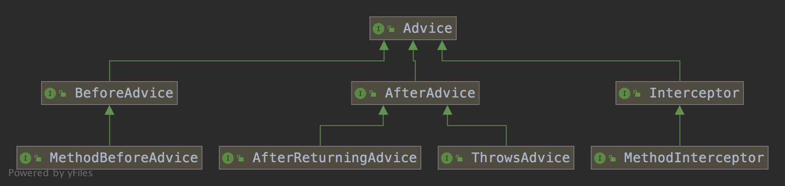

spring-aop

https://blog.csdn.net/javazejian/article/details/54561302

https://blog.csdn.net/javazejian/article/details/56267036

<https://www.iteye.com/blogs/subjects/springaop>


### 问题

1. 如何为 bean 筛选合适的通知器（Advisor）
2. 代理对象生成的过程
3. 拦截器的调用过程

### 缘起

减少侵入性

热插拔


### 定义

AOP是面向切面编程的简称，是一种编程思想，是对OOP的补充。其思想是动态的将代码切入到类的指定方法或者指定位置。

### 实现

AOP就是一种思想，而帮我们解决的是具体的AOP的实现，比如aspectj，jboss AOP，以及我们最熟悉的Spring AOP（Spring AOP在Spring1.0的时候是自己实现的AOP框架，在2.0之后就开始集成了aspectj）等。现在我们所说的Spring AOP就是Spring加Aspectj这种方式。

### AOP的相关概念

对于AOP中相关的概念，我们接触更多的还是Spring AOP，这里主要是以Spring AOP的概念来说明：

- Aspect，切面，一个关注点的模块化，这个关注点可能会横切多个对象。
- JoinPoint，连接点，在程序执行过程中某个特定的点，比如某方法调用的时候或者处理异常的时候。在Spring AOP中，一个连接点总是表示一个方法的执行。
- Advice，通知，在切面的某个特定的连接点上执行的动作。（Marker Interface）
- Pointcut，切点，匹配连接点的断言。通知和一个切入点表达式关联，并在满足这个切入点的连接点上运行（例如，当执行某个特定名称的方法时）。Pointcut表达式如何和 JoinPoint 匹配是AOP的核心：Spring缺省使用AspectJ切入点语法。

上面是关于AOP中几个基本概念的定义，下面看下有关我们使用时的一些概念：

- Target Object，目标对象，被一个或者多个切面所通知的对象。也就是我们业务中实际要进行增强的业务对象。
- AOP Proxy，AOP代理，AOP框架创建的对象。也就是被增强之后的对象。
- Weaving，织入，把切面连接到其它的应用程序类型或者对象上，并创建一个被通知的对象。就是把切面作用到目标对象，然后产生一个代理对象的过程。

还有另外一个概念，是给类声明额外方法的概念：

- Introduction，引介，用来给一个类型声明额外的方法或属性。就是我可以不用实现另外一个接口，就能使用那个接口的方法。

### Advice

Advice是通知，也就是在切面的某个连接点上要执行的动作，也就是我们要编写的增强功能的代码。通知也分为好几种类型，分别有不同作用：

- 前置通知（Before advice）：在某连接点之前执行的通知，但这个通知不能阻止连接点之前的执行流程（除非它抛出一个异常）。
- 后置通知（After returning advice）：在某连接点正常完成后执行的通知：例如，一个方法没有抛出任何异常，正常返回。
- 异常通知（After throwing advice）：在方法抛出异常退出时执行的通知。
- 最终通知（After (finally) advice）：当某连接点退出的时候执行的通知（不论是正常返回还是异常退出）。
- 环绕通知（Around Advice）：包围一个连接点的通知，如方法调用。这是最强大的一种通知类型。环绕通知可以在方法调用前后完成自定义的行为。它也会选择是否继续执行连接点或直接返回它自己的返回值或抛出异常来结束执行。


ReflectiveAspectJAdvisorFactory 是 AspectJ 对 AOP 的主要实现。





#### before advice


```java
public class MethodBeforeAdviceInterceptor implements MethodInterceptor, BeforeAdvice, Serializable {

	private final MethodBeforeAdvice advice;

	public MethodBeforeAdviceInterceptor(MethodBeforeAdvice advice) {
		Assert.notNull(advice, "Advice must not be null");
		this.advice = advice;
	}

  // 拦截器实现的关键
	@Override
	public Object invoke(MethodInvocation mi) throws Throwable {
		this.advice.before(mi.getMethod(), mi.getArguments(), mi.getThis());
		return mi.proceed();
	}

}
```


#### after advice


AfterReturningAdviceInterceptor 是  AfterAdvice 的主要实现

```java
public class AfterReturningAdviceInterceptor implements MethodInterceptor, AfterAdvice, Serializable {
	private final AfterReturningAdvice advice;

	public AfterReturningAdviceInterceptor(AfterReturningAdvice advice) {
		Assert.notNull(advice, "Advice must not be null");
		this.advice = advice;
	}

  // 先执行方法，后执行拦截器
	@Override
	public Object invoke(MethodInvocation mi) throws Throwable {
		Object retVal = mi.proceed();
		this.advice.afterReturning(retVal, mi.getMethod(), mi.getArguments(), mi.getThis());
		return retVal;
	}

}
```


ThrowAdviceInterceptor 是 ThrowAdvice 的主要实现

```java
	@Override
	public Object invoke(MethodInvocation mi) throws Throwable {
		try {
			return mi.proceed();
		}
		catch (Throwable ex) {
			Method handlerMethod = getExceptionHandler(ex);
			if (handlerMethod != null) {
				invokeHandlerMethod(mi, ex, handlerMethod);
			}
			throw ex;
		}
	}
```

注：

> AfterThrowing 的 ex 类型不一致

#### 例子

切点

方法一

```java
@After(value="execution(* com.test.dao.UserDao.addUser(...))")
public void after(JoinPoint joinPoint) {
  	MethodSignature signature = (MethodSignature)joinPoint.getSigature();
    Method method = signature.getMethod();
  	System.out.println("最终通知");
}
```


方法二

```java

@Pointcut("call(* *.*(..))")
void anyCall() {}

@Pointcut("call(* *.*(int)) && args(i) && target(callee)")
void anyCall(int i, Foo callee) {}

@Pointcut("")
protected abstract void anyCall();


@After(value="myPointcut()")
public void afterDemo(){
    System.out.println("最终通知....");
}
```

PointCut 的约束
1. 不能有方法体

2. 返回 void

3. 不能声明 throws

4. 方法的 modifiers 和参数必须匹配

   

通配符

`..`：匹配方法定义中的任意数量的参数，此外还匹配类定义中的任意数量包

`+`：匹配给定类的任意子类

`*`：匹配任意数量的字符

within

```java
@Pointcut("within(com.lwx.dao..*)") //dao 包及其子包中的所有类的所有方法

@Pointcut("within(com.lwx.dao.UserDaoImpl)") //UserDaoImpl 所有方法

@Pointcut("within(com.lwx.dao.UserDaoImpl+)") //UserDaoImpl类及其子类中所有方法

@Pointcut("within(com.lwx.dao.UserDao+)") //实现UserDao接口的类的所有方法
```


方法签名

```java
//scope ：方法作用域，如public,private,protect
//returnt-type：方法返回值类型
//fully-qualified-class-name：方法所在类的完全限定名称
//parameters 方法参数
execution(<scope> <return-type> <fully-qualified-class-name>.*(parameters))
```


其他指示符

bean：Spring AOP扩展的，AspectJ没有对于指示符，用于匹配特定名称的Bean对象的执行方法；

```java
//匹配名称中带有后缀Service的Bean。
@Pointcut("bean(*Service)")
private void myPointcut1(){}
```


this ：用于匹配当前AOP代理对象类型的执行方法；请注意是AOP代理对象的类型匹配，这样就可能包括引入接口也类型匹配

```java
//匹配了任意实现了UserDao接口的代理对象的方法进行过滤
@Pointcut("this(com.zejian.spring.springAop.dao.UserDao)")
private void myPointcut2(){}
```


target ：用于匹配当前目标对象类型的执行方法

```java
//匹配了任意实现了UserDao接口的目标对象的方法进行过滤
@Pointcut("target(com.zejian.spring.springAop.dao.UserDao)")
private void myPointcut3(){}
```


@within：用于匹配所以持有指定注解类型内的方法；请注意与within是有区别的， within是用于匹配指定类型内的方法执行；

```java
//匹配使用了MarkerAnnotation注解的类(注意是类)
@Pointcut("@within(com.zejian.spring.annotation.MarkerAnnotation)")
private void myPointcut4(){}
```


@annotation(com.zejian.spring.MarkerMethodAnnotation) : 根据所应用的注解进行方法过滤

```java
//匹配使用了MarkerAnnotation注解的方法(注意是方法)
@Pointcut("@annotation(com.zejian.spring.annotation.MarkerAnnotation)")
private void myPointcut5(){}
```


target ：用于匹配当前目标对象类型的执行方法；

```java
//匹配使用了MarkerAnnotation注解的类(注意是类)
@Pointcut("@within(com.zejian.spring.annotation.MarkerAnnotation)")
private void myPointcut4(){}
```


切点指示符可以使用运算符语法进行表达式的混编，如and、or、not（或者&&、||、！）


### Joinpoint


核心是  ReflectiveMethodInvocation

1、如果有拦截器方法，先执行拦截器方法

2、通过反射执行被拦截方法

```java
	public Object proceed() throws Throwable {
    // 递归结束条件，遍历到最后一个元素	
		if (this.currentInterceptorIndex == this.interceptorsAndDynamicMethodMatchers.size() - 1) {
			return invokeJoinpoint();
		}

		Object interceptorOrInterceptionAdvice =
				this.interceptorsAndDynamicMethodMatchers.get(++this.currentInterceptorIndex);
		if (interceptorOrInterceptionAdvice instanceof InterceptorAndDynamicMethodMatcher) {
			InterceptorAndDynamicMethodMatcher dm =
					(InterceptorAndDynamicMethodMatcher) interceptorOrInterceptionAdvice;
			Class<?> targetClass = (this.targetClass != null ? this.targetClass : this.method.getDeclaringClass());
      // 如果匹配，就执行拦截器方法
			if (dm.methodMatcher.matches(this.method, targetClass, this.arguments)) {
				return dm.interceptor.invoke(this);
			}
			else {
				// Dynamic matching failed.
				// Skip this interceptor and invoke the next in the chain.
				return proceed();
			}
		}
		else {
      // 执行 MethodInterceptor 的 invoke 方法
			return ((MethodInterceptor) interceptorOrInterceptionAdvice).invoke(this);
		}
	}
```


其中 InterceptorAndDynamicMethodMatcher 为

```java
class InterceptorAndDynamicMethodMatcher {
	final MethodInterceptor interceptor;

	final MethodMatcher methodMatcher;

	public InterceptorAndDynamicMethodMatcher(MethodInterceptor interceptor, MethodMatcher methodMatcher) {
		this.interceptor = interceptor;
		this.methodMatcher = methodMatcher;
	}
}
```


### Pointcut

比较简单，略过不提


### PointcutAdvisor 


其中

1、AbstractPointcutAdvisor 增加对 Order 的支持

2、AbstractGenericPointcutAdvisor 支持设置 Advice

3、DefaultPointcutAdvisor 支持设置 Pointcut

4、AspectJExpressionPointcutAdvisor 支持 Pointcut 使用 AspectJExpressionPointcut

5、AbstractBeanFactoryPointcutAdvisor 支持 Advice 从 Bean 中读取

6、DefaultBeanFactoryPointcutAdvisor 支持设置 Pointcut

7、AspectJPointcutAdvisor 支持设置 Order、Pointcut和 Advice，其中 Advice 为 AbstractAspectJAdvice。


AbstractAspectJAdvice 类图如下：


### IntroductionAdvisor


### AdviceAdaptor

实现 Advice 到 MethodInceptor 的适配


其中 xxxxAdviceAdapter 将 advice 转换为 MethodInterceptor

```java
class MethodBeforeAdviceAdapter implements AdvisorAdapter, Serializable {

	@Override
	public boolean supportsAdvice(Advice advice) {
		return (advice instanceof MethodBeforeAdvice);
	}

	@Override
	public MethodInterceptor getInterceptor(Advisor advisor) {
		MethodBeforeAdvice advice = (MethodBeforeAdvice) advisor.getAdvice();
		return new MethodBeforeAdviceInterceptor(advice);
	}
}
```


AdviceAdaptor 的主要注册在 DefaultAdvisorAdapterRegistry


### AOP原理

AOP实现的关键就是创建AOP代理，代理有静态代理和动态代理之分，其中aspectj为静态代理，Spring AOP是动态代理。

#### 静态代理

AspectJ

#### 动态代理

Spring AOP：JDK动态代理和CGLIB动态代理

> 在AspectJ 1.5后，引入@Aspect形式的注解风格的开发，Spring也非常快地跟进了这种方式，因此Spring 2.0后便使用了与AspectJ一样的注解。请注意，Spring 只是使用了与 AspectJ 5 一样的注解，但仍然没有使用 AspectJ 的编译器，底层依旧是动态代理技术的实现，因此并不依赖于 AspectJ 的编译器。


## Spring  AOP


### 核心流程

1、通过 XML 或注解的方式注册到 Spring Bean

2、Bean 初始化时创建对应的代理类（注入相关代理方法）。

3、执行类的方法时，通过代理类执行相应方法


### Spring AOP 代理的注册

XML 方式：略

注解方式


#### 注解解析

```java
public interface ParameterNameDiscoverer {
    String[] getParameterNames(Method var1);
    String[] getParameterNames(Constructor<?> var1);
}

	private static class AspectJAnnotationParameterNameDiscoverer implements ParameterNameDiscoverer {
		@Override
		@Nullable
		public String[] getParameterNames(Method method) {
			if (method.getParameterCount() == 0) {
				return new String[0];
			}
			AspectJAnnotation<?> annotation = findAspectJAnnotationOnMethod(method);
			if (annotation == null) {
				return null;
			}
			StringTokenizer nameTokens = new StringTokenizer(annotation.getArgumentNames(), ",");
			if (nameTokens.countTokens() > 0) {
				String[] names = new String[nameTokens.countTokens()];
				for (int i = 0; i < names.length; i++) {
					names[i] = nameTokens.nextToken();
				}
				return names;
			}
			else {
				return null;
			}
		}

		@Override
		@Nullable
		public String[] getParameterNames(Constructor<?> ctor) {
			throw new UnsupportedOperationException("Spring AOP cannot handle constructor advice");
		}
	}
```

通过反射的方式找到 包含 Pointcut，Around，After，Before，AfterReturning，AfterThrowing 的类型

```java
public abstract class AbstractAspectJAdvisorFactory implements AspectJAdvisorFactory {
  
  private static final Class<?>[] ASPECTJ_ANNOTATION_CLASSES = new Class<?>[] {
			Pointcut.class, Around.class, Before.class, After.class, AfterReturning.class, AfterThrowing.class};
  
  protected final ParameterNameDiscoverer parameterNameDiscoverer = new AspectJAnnotationParameterNameDiscoverer();
  
  @Override
	public boolean isAspect(Class<?> clazz) {
		return (hasAspectAnnotation(clazz) && !compiledByAjc(clazz));
	}

	private boolean hasAspectAnnotation(Class<?> clazz) {
		return (AnnotationUtils.findAnnotation(clazz, Aspect.class) != null);
	}
  
	protected static AspectJAnnotation<?> findAspectJAnnotationOnMethod(Method method) {
		for (Class<?> clazz : ASPECTJ_ANNOTATION_CLASSES) {
			AspectJAnnotation<?> foundAnnotation = findAnnotation(method, (Class<Annotation>) clazz);
			if (foundAnnotation != null) {
				return foundAnnotation;
			}
		}
		return null;
	}

	@Nullable
	private static <A extends Annotation> AspectJAnnotation<A> findAnnotation(Method method, Class<A> toLookFor) {
		A result = AnnotationUtils.findAnnotation(method, toLookFor);
		if (result != null) {
			return new AspectJAnnotation<>(result);
		}
		else {
			return null;
		}
	}
  
  protected enum AspectJAnnotationType {
		AtPointcut, AtAround, AtBefore, AtAfter, AtAfterReturning, AtAfterThrowing
	}
  
	protected static class AspectJAnnotation<A extends Annotation> {

		private static final String[] EXPRESSION_ATTRIBUTES = new String[] {"pointcut", "value"};

		private static Map<Class<?>, AspectJAnnotationType> annotationTypeMap = new HashMap<>(8);

		static {
			annotationTypeMap.put(Pointcut.class, AspectJAnnotationType.AtPointcut);
			annotationTypeMap.put(Around.class, AspectJAnnotationType.AtAround);
			annotationTypeMap.put(Before.class, AspectJAnnotationType.AtBefore);
			annotationTypeMap.put(After.class, AspectJAnnotationType.AtAfter);
			annotationTypeMap.put(AfterReturning.class, AspectJAnnotationType.AtAfterReturning);
			annotationTypeMap.put(AfterThrowing.class, AspectJAnnotationType.AtAfterThrowing);
		}

		private final A annotation;

		private final AspectJAnnotationType annotationType;

		private final String pointcutExpression;

		private final String argumentNames;

		public AspectJAnnotation(A annotation) {
			this.annotation = annotation;
			this.annotationType = determineAnnotationType(annotation);
			try {
				this.pointcutExpression = resolveExpression(annotation);
				Object argNames = AnnotationUtils.getValue(annotation, "argNames");
				this.argumentNames = (argNames instanceof String ? (String) argNames : "");
			}
			catch (Exception ex) {
				throw new IllegalArgumentException(annotation + " is not a valid AspectJ annotation", ex);
			}
		}

    // 从 annotationTypeMap 中查找
		private AspectJAnnotationType determineAnnotationType(A annotation) {
			AspectJAnnotationType type = annotationTypeMap.get(annotation.annotationType());
			if (type != null) {
				return type;
			}
			throw new IllegalStateException("Unknown annotation type: " + annotation);
		}

    // 解析 pointcut 和 name 属性
		private String resolveExpression(A annotation) {
			for (String attributeName : EXPRESSION_ATTRIBUTES) {
				Object val = AnnotationUtils.getValue(annotation, attributeName);
				if (val instanceof String) {
					String str = (String) val;
					if (!str.isEmpty()) {
						return str;
					}
				}
			}
			throw new IllegalStateException("Failed to resolve expression: " + annotation);
		}

		public AspectJAnnotationType getAnnotationType() {
			return this.annotationType;
		}

		public A getAnnotation() {
			return this.annotation;
		}

		public String getPointcutExpression() {
			return this.pointcutExpression;
		}

		public String getArgumentNames() {
			return this.argumentNames;
		}
	}  
}
```


1、AnnotationConfigApplicationContext 会扫描包含 PointCut 注解的所有方法。

2、对这些方法生成代理类。

相关的类

```
AspectJAdvisorFactory
AbstractAspectJAdvisorFactory
ReflectiveAspectJAdvisorFactory


AspectJAnnotationType
BeanFactoryAspectJAdvisorsBuilder
ProxyCreatorSupport
```


解析过程

```java
BeanFactoryAspectJAdvisorsBuilder.buildAspectJAdvisors()
		AspectJAdvisorFactory.getAdvisors
				ReflectiveAspectJAdvisorFactory.getAdvisors
```


```java
	protected enum AspectJAnnotationType {
		AtPointcut, AtAround, AtBefore, AtAfter, AtAfterReturning, AtAfterThrowing
	}

	protected static class AspectJAnnotation<A extends Annotation> {
		private static final String[] EXPRESSION_ATTRIBUTES = new String[] {"pointcut", "value"};
		private static Map<Class<?>, AspectJAnnotationType> annotationTypeMap = new HashMap<>(8);
		static {
			annotationTypeMap.put(Pointcut.class, AspectJAnnotationType.AtPointcut);
			annotationTypeMap.put(Around.class, AspectJAnnotationType.AtAround);
			annotationTypeMap.put(Before.class, AspectJAnnotationType.AtBefore);
			annotationTypeMap.put(After.class, AspectJAnnotationType.AtAfter);
			annotationTypeMap.put(AfterReturning.class, AspectJAnnotationType.AtAfterReturning);
			annotationTypeMap.put(AfterThrowing.class, AspectJAnnotationType.AtAfterThrowing);
		}

		private final A annotation;

		private final AspectJAnnotationType annotationType;

		private final String pointcutExpression;

		private final String argumentNames;

		public AspectJAnnotation(A annotation) {
			this.annotation = annotation;
			this.annotationType = determineAnnotationType(annotation);
			try {
				this.pointcutExpression = resolveExpression(annotation);
				Object argNames = AnnotationUtils.getValue(annotation, "argNames");
				this.argumentNames = (argNames instanceof String ? (String) argNames : "");
			}
			catch (Exception ex) {
				throw new IllegalArgumentException(annotation + " is not a valid AspectJ annotation", ex);
			}
		}

		private AspectJAnnotationType determineAnnotationType(A annotation) {
			AspectJAnnotationType type = annotationTypeMap.get(annotation.annotationType());
			if (type != null) {
				return type;
			}
			throw new IllegalStateException("Unknown annotation type: " + annotation);
		}

		private String resolveExpression(A annotation) {
			for (String attributeName : EXPRESSION_ATTRIBUTES) {
				Object val = AnnotationUtils.getValue(annotation, attributeName);
				if (val instanceof String) {
					String str = (String) val;
					if (!str.isEmpty()) {
						return str;
					}
				}
			}
			throw new IllegalStateException("Failed to resolve expression: " + annotation);
		}
	}
```


### Spring AOP 代理生成

参考 spring-aop-create.md

### Spring Aop 代理的执行

参考  spring-aop-run.md

### AOP的使用场景

我们在实际的业务中都会有一些公共逻辑，比如日志的记录，事务的管理等等，而如果每次都把日志和事务的代码手动写到业务逻辑前后，重复代码就相当可怕，而如果这些额外代码有修改，必须要每个都修改，这是相当不明智的。AOP可以帮我们解决这些问题。

AOP适用于具有横切逻辑的应用，比如性能监控，日志记录，缓存，事务管理，访问控制等。

Authentication 权限

Caching 缓存

Context passing 内容传递

Error handling 错误处理

Lazy loading　懒加载

Debugging　　调试

logging, tracing, profiling and monitoring　记录跟踪　优化　校准

Performance optimization　性能优化

Persistence　　持久化

Resource pooling　资源池

Synchronization　同步

Transactions 事务

### Advice


```java
public void addAdvice(int pos, Advice advice) throws AopConfigException {
	//只能处理实现了AOP联盟的接口的拦截器
    if (advice instanceof Interceptor && !(advice instanceof MethodInterceptor)) {
        throw new AopConfigException(getClass().getName() + " only handles AOP Alliance MethodInterceptors");
    }
	//IntroductionInfo接口类型，表示引介信息
    if (advice instanceof IntroductionInfo) {
    	//不需要IntroductionAdvisor
        addAdvisor(pos, new DefaultIntroductionAdvisor(advice, (IntroductionInfo) advice));
    }
    //动态引介增强的处理
    else if (advice instanceof DynamicIntroductionAdvice) {
        //需要IntroductionAdvisor
        throw new AopConfigException("DynamicIntroductionAdvice may only be added as part of IntroductionAdvisor");
    }
    else {
    	//添加增强器，需要先把我们的增强包装成增强器，然后添加
        addAdvisor(pos, new DefaultPointcutAdvisor(advice));
    }
}
```


### Aop 失效的原因及解决办法


1、AopContext.currentProxy() 

```java
AsyncAopService service = (AsyncAopService) AopContext.currentProxy();
//获取代理对象
service.sendMsg(result);
//通过代理对象调用sendMsg，做异步增强
```


### 概览


### 属性说明


```java
public abstract class AbstractAutoProxyCreator extends ProxyProcessorSupport
		implements SmartInstantiationAwareBeanPostProcessor, BeanFactoryAware {

	/**
	 * Convenience constant for subclasses: Return value for "do not proxy".
	 * @see #getAdvicesAndAdvisorsForBean
	 */
	@Nullable
	protected static final Object[] DO_NOT_PROXY = null;

	/**
	 * Convenience constant for subclasses: Return value for
	 * "proxy without additional interceptors, just the common ones".
	 * @see #getAdvicesAndAdvisorsForBean
	 */
	protected static final Object[] PROXY_WITHOUT_ADDITIONAL_INTERCEPTORS = new Object[0];

	/** Default is global AdvisorAdapterRegistry. */
	private AdvisorAdapterRegistry advisorAdapterRegistry = GlobalAdvisorAdapterRegistry.getInstance();

	/**
	 * Indicates whether or not the proxy should be frozen. Overridden from super
	 * to prevent the configuration from becoming frozen too early.
	 */
	private boolean freezeProxy = false;

	/** Default is no common interceptors. */
	private String[] interceptorNames = new String[0];

	private boolean applyCommonInterceptorsFirst = true;

	private TargetSourceCreator[] customTargetSourceCreators;

	private BeanFactory beanFactory;

	private final Set<String> targetSourcedBeans;

	private final Map<Object, Object> earlyProxyReferences;

  //key 为类的唯一标志，value 为代理类
	private final Map<Object, Class<?>> proxyTypes;

  // key 为类，value 为该类是否需要 AOP
	private final Map<Object, Boolean> advisedBeans;
}
```


```java
public class BeanFactoryAspectJAdvisorsBuilder {

	private final ListableBeanFactory beanFactory;

	private final AspectJAdvisorFactory advisorFactory;

	@Nullable
	private volatile List<String> aspectBeanNames;

  // 所有增强的 Advisor，以 aspectBeanName 为 key
	private final Map<String, List<Advisor>> advisorsCache;

  // 
	private final Map<String, MetadataAwareAspectInstanceFactory> aspectFactoryCache;
}
```


### 找到增强的方法

这里以 AbstractAdvisorAutoProxyCreator 为例

#### getAdvicesAndAdvisorsForBean

```java
  protected Object[] getAdvicesAndAdvisorsForBean(
      Class<?> beanClass, String beanName, @Nullable TargetSource targetSource) {
   
   //找到合格的Advisor
   List<Advisor> advisors = findEligibleAdvisors(beanClass, beanName);
   if (advisors.isEmpty()) {
      return DO_NOT_PROXY;
   }
   return advisors.toArray();
  }

	protected List<Advisor> findEligibleAdvisors(Class<?> beanClass, String beanName) {
    // 找到候选 advisor
		List<Advisor> candidateAdvisors = findCandidateAdvisors();
    // 
		List<Advisor> eligibleAdvisors = findAdvisorsThatCanApply(candidateAdvisors, beanClass, beanName);
		extendAdvisors(eligibleAdvisors);
		if (!eligibleAdvisors.isEmpty()) {
			eligibleAdvisors = sortAdvisors(eligibleAdvisors);
		}
		return eligibleAdvisors;
	}

  // 找到满足条件（继承 Advice 和  Around, Before, After, AfterReturning, AfterThrowing）的 Advisor
	protected List<Advisor> findCandidateAdvisors() {
		Assert.state(this.advisorRetrievalHelper != null, "No BeanFactoryAdvisorRetrievalHelper available");
		return this.advisorRetrievalHelper.findAdvisorBeans();
	}

  // 找到满足条件（继承 Advice 和  Around, Before, After, AfterReturning, AfterThrowing）的 Advisor
	public List<Advisor> findAdvisorBeans() {
		// Determine list of advisor bean names, if not cached already.
		String[] advisorNames = this.cachedAdvisorBeanNames;
    // 1. 继承 Advisor 的 Bean
		if (advisorNames == null) {
			// Do not initialize FactoryBeans here: We need to leave all regular beans
			// uninitialized to let the auto-proxy creator apply to them!
			advisorNames = BeanFactoryUtils.beanNamesForTypeIncludingAncestors(
					this.beanFactory, Advisor.class, true, false);
			this.cachedAdvisorBeanNames = advisorNames;
		}
		if (advisorNames.length == 0) {
			return new ArrayList<>();
		}

		List<Advisor> advisors = new ArrayList<>();
		for (String name : advisorNames) {
			if (isEligibleBean(name)) {
				if (this.beanFactory.isCurrentlyInCreation(name)) {
					if (logger.isTraceEnabled()) {
						logger.trace("Skipping currently created advisor '" + name + "'");
					}
				}
				else {
					try {
            // 2. Bean 对应的 Advisor
						advisors.add(this.beanFactory.getBean(name, Advisor.class));
					}
					catch (BeanCreationException ex) {
						Throwable rootCause = ex.getMostSpecificCause();
						if (rootCause instanceof BeanCurrentlyInCreationException) {
							BeanCreationException bce = (BeanCreationException) rootCause;
							String bceBeanName = bce.getBeanName();
							if (bceBeanName != null && this.beanFactory.isCurrentlyInCreation(bceBeanName)) {
								if (logger.isTraceEnabled()) {
									logger.trace("Skipping advisor '" + name +
											"' with dependency on currently created bean: " + ex.getMessage());
								}
								// Ignore: indicates a reference back to the bean we're trying to advise.
								// We want to find advisors other than the currently created bean itself.
								continue;
							}
						}
						throw ex;
					}
				}
			}
		}
		return advisors;
	}
```


#### findCandidateAdvisors

```java
	@Override
	protected List<Advisor> findCandidateAdvisors() {
		// Add all the Spring advisors found according to superclass rules.
		List<Advisor> advisors = super.findCandidateAdvisors();
		// Build Advisors for all AspectJ aspects in the bean factory.
    // 找到所有有 AspectJ 注解的 bean，找到 Around, Before, After, AfterReturning, AfterThrowing 方法对应的 Advisor
		if (this.aspectJAdvisorsBuilder != null) {
			advisors.addAll(this.aspectJAdvisorsBuilder.buildAspectJAdvisors());
		}
		return advisors;
	}
	
  // 找到所有有 AspectJ 注解的 bean，找到 Around, Before, After, AfterReturning, AfterThrowing 方法对应的 Advisor
	public List<Advisor> buildAspectJAdvisors() {
		List<String> aspectNames = this.aspectBeanNames;

    //1. 如果 aspectNames 为空，找到 aspectNames
		if (aspectNames == null) {
			synchronized (this) {
				aspectNames = this.aspectBeanNames;
				if (aspectNames == null) {
					List<Advisor> advisors = new ArrayList<>();
					aspectNames = new ArrayList<>();
          // 1.1 获取所有的 beanName
					String[] beanNames = BeanFactoryUtils.beanNamesForTypeIncludingAncestors(
							this.beanFactory, Object.class, true, false);
					for (String beanName : beanNames) {
            // 1.2 不合格的类过滤掉(由子类自定义)
						if (!isEligibleBean(beanName)) {
							continue;
						}
						// We must be careful not to instantiate beans eagerly as in this case they
						// would be cached by the Spring container but would not have been weaved.
						Class<?> beanType = this.beanFactory.getType(beanName);
						if (beanType == null) {
							continue;
						}
            // 1.3 如果存在 Aspect 注解
						if (this.advisorFactory.isAspect(beanType)) {
							aspectNames.add(beanName);
							AspectMetadata amd = new AspectMetadata(beanType, beanName);
              // 1.3.1 如果是单例 Bean，加入缓存并返回
							if (amd.getAjType().getPerClause().getKind() == PerClauseKind.SINGLETON) {
								MetadataAwareAspectInstanceFactory factory =
										new BeanFactoryAspectInstanceFactory(this.beanFactory, beanName);
                // 1.3.1.1 解析 AspectJ 增强的 advisor
								List<Advisor> classAdvisors = this.advisorFactory.getAdvisors(factory);
                // 1.3.1.2 加入缓存
								if (this.beanFactory.isSingleton(beanName)) {
									this.advisorsCache.put(beanName, classAdvisors);
								}
								else {
									this.aspectFactoryCache.put(beanName, factory);
								}
								advisors.addAll(classAdvisors);
							}
              // 1.3.2 如果是非单例的 Bean，加入缓存并返回
							else {
								// Per target or per this.
								if (this.beanFactory.isSingleton(beanName)) {
									throw new IllegalArgumentException("Bean with name '" + beanName +
											"' is a singleton, but aspect instantiation model is not singleton");
								}
								MetadataAwareAspectInstanceFactory factory =
										new PrototypeAspectInstanceFactory(this.beanFactory, beanName);
                //1.3.2.1
								this.aspectFactoryCache.put(beanName, factory);
								advisors.addAll(this.advisorFactory.getAdvisors(factory));
							}
						}
					}
					this.aspectBeanNames = aspectNames;
					return advisors;
				}
			}
      
      if (aspectNames.isEmpty()) {
        return Collections.emptyList();
      }
      //2. 从缓存中找到 aspectNames 对应的 advisor，并返回
      List<Advisor> advisors = new ArrayList<>();
      for (String aspectName : aspectNames) {
        List<Advisor> cachedAdvisors = this.advisorsCache.get(aspectName);
        if (cachedAdvisors != null) {
          advisors.addAll(cachedAdvisors);
        }
        else {
          MetadataAwareAspectInstanceFactory factory = this.aspectFactoryCache.get(aspectName);
          advisors.addAll(this.advisorFactory.getAdvisors(factory));
        }
      }
      return advisors;  
		}
    
  // 找到 Around, Before, After, AfterReturning, AfterThrowing 的方法
	public List<Advisor> getAdvisors(MetadataAwareAspectInstanceFactory aspectInstanceFactory) {
		Class<?> aspectClass = aspectInstanceFactory.getAspectMetadata().getAspectClass();
		String aspectName = aspectInstanceFactory.getAspectMetadata().getAspectName();
		validate(aspectClass);

		// We need to wrap the MetadataAwareAspectInstanceFactory with a decorator
		// so that it will only instantiate once.
		MetadataAwareAspectInstanceFactory lazySingletonAspectInstanceFactory =
				new LazySingletonAspectInstanceFactoryDecorator(aspectInstanceFactory);

		List<Advisor> advisors = new ArrayList<>();
    // 1. 找到不含有 Pointcut 注解方法
		for (Method method : getAdvisorMethods(aspectClass)) {
      //2. 有 Pointcut, Around, Before, After, AfterReturning, AfterThrowing 注解的方法，并生成对应的 Advisor()
			Advisor advisor = getAdvisor(method, lazySingletonAspectInstanceFactory, advisors.size(), aspectName);
			if (advisor != null) {
				advisors.add(advisor);
			}
		}

		// If it's a per target aspect, emit the dummy instantiating aspect.
		if (!advisors.isEmpty() && lazySingletonAspectInstanceFactory.getAspectMetadata().isLazilyInstantiated()) {
			Advisor instantiationAdvisor = new SyntheticInstantiationAdvisor(lazySingletonAspectInstanceFactory);
			advisors.add(0, instantiationAdvisor);
		}

		// Find introduction fields.
    // 获取 DeclareParents 注解
		for (Field field : aspectClass.getDeclaredFields()) {
			Advisor advisor = getDeclareParentsAdvisor(field);
			if (advisor != null) {
				advisors.add(advisor);
			}
		}

		return advisors;
	}

  // 方法不包括 Pointcut 注解的方法
	private List<Method> getAdvisorMethods(Class<?> aspectClass) {
		final List<Method> methods = new ArrayList<>();
		ReflectionUtils.doWithMethods(aspectClass, method -> {
			// Exclude pointcuts
			if (AnnotationUtils.getAnnotation(method, Pointcut.class) == null) {
				methods.add(method);
			}
		});
    // 按照 Around, Before, After, AfterReturning, AfterThrowing 的顺序排序
		methods.sort(METHOD_COMPARATOR);
		return methods;
	}

	public Advisor getAdvisor(Method candidateAdviceMethod, MetadataAwareAspectInstanceFactory aspectInstanceFactory,
			int declarationOrderInAspect, String aspectName) {

		validate(aspectInstanceFactory.getAspectMetadata().getAspectClass());

    //方法有 Pointcut, Around, Before, After, AfterReturning, AfterThrowing 进行封装
		AspectJExpressionPointcut expressionPointcut = getPointcut(
				candidateAdviceMethod, aspectInstanceFactory.getAspectMetadata().getAspectClass());
		if (expressionPointcut == null) {
			return null;
		}
    
    // 生成注解对应的 Advisor
		return new InstantiationModelAwarePointcutAdvisorImpl(expressionPointcut, candidateAdviceMethod,
				this, aspectInstanceFactory, declarationOrderInAspect, aspectName);
	}
    
  //对方法有 Around, Before, After, AfterReturning, AfterThrowing 注解类进行封装（被注解的类，被注解的方法，注解表达式，beanFactory）。
	private AspectJExpressionPointcut getPointcut(Method candidateAdviceMethod, Class<?> candidateAspectClass) {
    // 方法有 Pointcut, Around, Before, After, AfterReturning, AfterThrowing 注解
		AspectJAnnotation<?> aspectJAnnotation =
				AbstractAspectJAdvisorFactory.findAspectJAnnotationOnMethod(candidateAdviceMethod);
		if (aspectJAnnotation == null) {
			return null;
		}

		AspectJExpressionPointcut ajexp =
				new AspectJExpressionPointcut(candidateAspectClass, new String[0], new Class<?>[0]);
		ajexp.setExpression(aspectJAnnotation.getPointcutExpression());
		if (this.beanFactory != null) {
			ajexp.setBeanFactory(this.beanFactory);
		}
		return ajexp;
	}
    
  // 找到 ASPECTJ_ANNOTATION_CLASSES 中任一注解
	protected static AspectJAnnotation<?> findAspectJAnnotationOnMethod(Method method) {
    // private static final Class<?>[] ASPECTJ_ANNOTATION_CLASSES = new Class<?>[] { Pointcut.class, Around.class, Before.class, After.class, AfterReturning.class, AfterThrowing.class}
		for (Class<?> clazz : ASPECTJ_ANNOTATION_CLASSES) {
			AspectJAnnotation<?> foundAnnotation = findAnnotation(method, (Class<Annotation>) clazz);
			if (foundAnnotation != null) {
				return foundAnnotation;
			}
		}
		return null;
	}

	@Nullable
	private static <A extends Annotation> AspectJAnnotation<A> findAnnotation(Method method, Class<A> toLookFor) {
		A result = AnnotationUtils.findAnnotation(method, toLookFor);
		if (result != null) {
			return new AspectJAnnotation<>(result);
		}
		else {
			return null;
		}
	}    
    
	public InstantiationModelAwarePointcutAdvisorImpl(AspectJExpressionPointcut declaredPointcut,
			Method aspectJAdviceMethod, AspectJAdvisorFactory aspectJAdvisorFactory,
			MetadataAwareAspectInstanceFactory aspectInstanceFactory, int declarationOrder, String aspectName) {

		this.declaredPointcut = declaredPointcut;
		this.declaringClass = aspectJAdviceMethod.getDeclaringClass();
		this.methodName = aspectJAdviceMethod.getName();
		this.parameterTypes = aspectJAdviceMethod.getParameterTypes();
		this.aspectJAdviceMethod = aspectJAdviceMethod;
		this.aspectJAdvisorFactory = aspectJAdvisorFactory;
		this.aspectInstanceFactory = aspectInstanceFactory;
		this.declarationOrder = declarationOrder;
		this.aspectName = aspectName;

		if (aspectInstanceFactory.getAspectMetadata().isLazilyInstantiated()) {
			// Static part of the pointcut is a lazy type.
			Pointcut preInstantiationPointcut = Pointcuts.union(
					aspectInstanceFactory.getAspectMetadata().getPerClausePointcut(), this.declaredPointcut);

			// Make it dynamic: must mutate from pre-instantiation to post-instantiation state.
			// If it's not a dynamic pointcut, it may be optimized out
			// by the Spring AOP infrastructure after the first evaluation.
			this.pointcut = new PerTargetInstantiationModelPointcut(
					this.declaredPointcut, preInstantiationPointcut, aspectInstanceFactory);
			this.lazy = true;
		}
		else {
			// A singleton aspect.
			this.pointcut = this.declaredPointcut;
			this.lazy = false;
			this.instantiatedAdvice = instantiateAdvice(this.declaredPointcut);
		}
	}    
    
	private Advice instantiateAdvice(AspectJExpressionPointcut pointcut) {
		Advice advice = this.aspectJAdvisorFactory.getAdvice(this.aspectJAdviceMethod, pointcut,
				this.aspectInstanceFactory, this.declarationOrder, this.aspectName);
		return (advice != null ? advice : EMPTY_ADVICE);
	}
    
	public Advice getAdvice(Method candidateAdviceMethod, AspectJExpressionPointcut expressionPointcut,
			MetadataAwareAspectInstanceFactory aspectInstanceFactory, int declarationOrder, String aspectName) {

		Class<?> candidateAspectClass = aspectInstanceFactory.getAspectMetadata().getAspectClass();
		validate(candidateAspectClass);

		AspectJAnnotation<?> aspectJAnnotation =
				AbstractAspectJAdvisorFactory.findAspectJAnnotationOnMethod(candidateAdviceMethod);
		if (aspectJAnnotation == null) {
			return null;
		}

		// If we get here, we know we have an AspectJ method.
		// Check that it's an AspectJ-annotated class
		if (!isAspect(candidateAspectClass)) {
			throw new AopConfigException("Advice must be declared inside an aspect type: " +
					"Offending method '" + candidateAdviceMethod + "' in class [" +
					candidateAspectClass.getName() + "]");
		}

		if (logger.isDebugEnabled()) {
			logger.debug("Found AspectJ method: " + candidateAdviceMethod);
		}

		AbstractAspectJAdvice springAdvice;

    // 根据注解类型创建对应的类
		switch (aspectJAnnotation.getAnnotationType()) {
			case AtPointcut:
				if (logger.isDebugEnabled()) {
					logger.debug("Processing pointcut '" + candidateAdviceMethod.getName() + "'");
				}
				return null;
			case AtAround:
				springAdvice = new AspectJAroundAdvice(
						candidateAdviceMethod, expressionPointcut, aspectInstanceFactory);
				break;
			case AtBefore:
				springAdvice = new AspectJMethodBeforeAdvice(
						candidateAdviceMethod, expressionPointcut, aspectInstanceFactory);
				break;
			case AtAfter:
				springAdvice = new AspectJAfterAdvice(
						candidateAdviceMethod, expressionPointcut, aspectInstanceFactory);
				break;
			case AtAfterReturning:
				springAdvice = new AspectJAfterReturningAdvice(
						candidateAdviceMethod, expressionPointcut, aspectInstanceFactory);
				AfterReturning afterReturningAnnotation = (AfterReturning) aspectJAnnotation.getAnnotation();
				if (StringUtils.hasText(afterReturningAnnotation.returning())) {
					springAdvice.setReturningName(afterReturningAnnotation.returning());
				}
				break;
			case AtAfterThrowing:
				springAdvice = new AspectJAfterThrowingAdvice(
						candidateAdviceMethod, expressionPointcut, aspectInstanceFactory);
				AfterThrowing afterThrowingAnnotation = (AfterThrowing) aspectJAnnotation.getAnnotation();
				if (StringUtils.hasText(afterThrowingAnnotation.throwing())) {
					springAdvice.setThrowingName(afterThrowingAnnotation.throwing());
				}
				break;
			default:
				throw new UnsupportedOperationException(
						"Unsupported advice type on method: " + candidateAdviceMethod);
		}

		// Now to configure the advice...
		springAdvice.setAspectName(aspectName);
		springAdvice.setDeclarationOrder(declarationOrder);
		String[] argNames = this.parameterNameDiscoverer.getParameterNames(candidateAdviceMethod);
		if (argNames != null) {
			springAdvice.setArgumentNamesFromStringArray(argNames);
		}
		springAdvice.calculateArgumentBindings();

		return springAdvice;
	}    
```


#### findAdvisorsThatCanApply

```java
	protected List<Advisor> findAdvisorsThatCanApply(
			List<Advisor> candidateAdvisors, Class<?> beanClass, String beanName) {

		ProxyCreationContext.setCurrentProxiedBeanName(beanName);
		try {
			return AopUtils.findAdvisorsThatCanApply(candidateAdvisors, beanClass);
		}
		finally {
			ProxyCreationContext.setCurrentProxiedBeanName(null);
		}
	}
 
  // 找到继承 IntroductionAdvisor 和 PointcutAdvisor 的 Advisor
	public static List<Advisor> findAdvisorsThatCanApply(List<Advisor> candidateAdvisors, Class<?> clazz) {
		if (candidateAdvisors.isEmpty()) {
			return candidateAdvisors;
		}
		List<Advisor> eligibleAdvisors = new ArrayList<>();
		for (Advisor candidate : candidateAdvisors) {
			if (candidate instanceof IntroductionAdvisor && canApply(candidate, clazz)) {
				eligibleAdvisors.add(candidate);
			}
		}
		boolean hasIntroductions = !eligibleAdvisors.isEmpty();
		for (Advisor candidate : candidateAdvisors) {
			if (candidate instanceof IntroductionAdvisor) {
				// already processed
				continue;
			}
			if (canApply(candidate, clazz, hasIntroductions)) {
				eligibleAdvisors.add(candidate);
			}
		}
		return eligibleAdvisors;
	}

	public static boolean canApply(Advisor advisor, Class<?> targetClass, boolean hasIntroductions) {
		if (advisor instanceof IntroductionAdvisor) {
			return ((IntroductionAdvisor) advisor).getClassFilter().matches(targetClass);
		}
		else if (advisor instanceof PointcutAdvisor) {
			PointcutAdvisor pca = (PointcutAdvisor) advisor;
			return canApply(pca.getPointcut(), targetClass, hasIntroductions);
		}
		else {
			// It doesn't have a pointcut so we assume it applies.
			return true;
		}
	}

	public static boolean canApply(Pointcut pc, Class<?> targetClass, boolean hasIntroductions) {
		Assert.notNull(pc, "Pointcut must not be null");
		if (!pc.getClassFilter().matches(targetClass)) {
			return false;
		}

		MethodMatcher methodMatcher = pc.getMethodMatcher();
		if (methodMatcher == MethodMatcher.TRUE) {
			// No need to iterate the methods if we're matching any method anyway...
			return true;
		}

		IntroductionAwareMethodMatcher introductionAwareMethodMatcher = null;
		if (methodMatcher instanceof IntroductionAwareMethodMatcher) {
			introductionAwareMethodMatcher = (IntroductionAwareMethodMatcher) methodMatcher;
		}

		Set<Class<?>> classes = new LinkedHashSet<>();
		if (!Proxy.isProxyClass(targetClass)) {
			classes.add(ClassUtils.getUserClass(targetClass));
		}
		classes.addAll(ClassUtils.getAllInterfacesForClassAsSet(targetClass));

		for (Class<?> clazz : classes) {
			Method[] methods = ReflectionUtils.getAllDeclaredMethods(clazz);
			for (Method method : methods) {
				if (introductionAwareMethodMatcher != null ?
						introductionAwareMethodMatcher.matches(method, targetClass, hasIntroductions) :
						methodMatcher.matches(method, targetClass)) {
					return true;
				}
			}
		}

		return false;
	}
```


JDK proxy vs Cglib proxy 

1. 如果 optimise 为 true，并且目标类没有实现接口，用 cglib 代理
2. 如果 proxy-target-class 为 true，并且目标类没有实现接口，用 cglib 代理
3. 如果配置没有 代理接口或有一个 SpringProxy 的代理接口，并且目标类没有实现接口，用 cglib 代理
4. 其余使用  JDK 代理


##  问题

1、代理和 AOP 的区别

2、Spring AOP 和 AspectJ 的关系？

| 类型   | Spring AOP  | AspectJ                            |
| ------ | ----------- | ---------------------------------- |
| 时机   | 运行时      | 编译前、编译后、加载前             |
| 范围   | spring bean | 任意类                             |
| 织入点 | 方法        | 方法、构造函数、属性、对象初始化等 |


[AOP概念，原理，应用介绍](http://cxis.me/2017/04/12/AOP概念，原理，应用介绍/)

[Spring中AOP的配置从1.0到5.0的演进](http://cxis.me/2017/04/10/Spring中AOP的配置从1.0到5.0的演进/)

http://aopalliance.sourceforge.net/