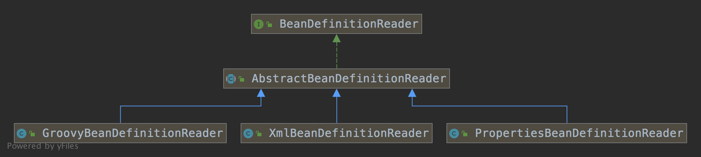
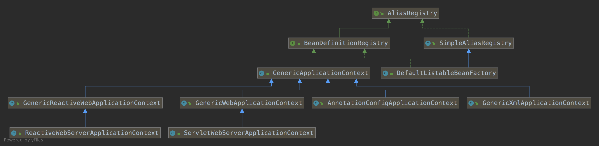
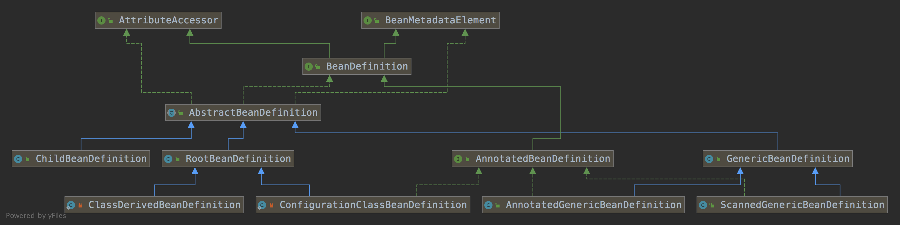

spring-bean-lifecycle


resource：bean 读取方式

scanner：扫描包

reader：读 bean。注解方式、xml 方式、properties 方式、groovy 方式	

BeanNameGenerator：bean 名生成器

beanDefinition：bean 定义

RootBeanDefinition: 根 Bean 定义

registry：注册 bean

实例化 bean：InstantiationAwareBeanPostProcessor

InstantiationStrategy：实例化策略。cglib、反射

设置 bean 属性

PropertyValues：属性设置

初始化 bean：InitializingBean 


​	

## BeanDefinitionReader





本质是从各个资源读取 BeanDefinition


```
AnnotationMetadata -> AnnotatedGenericBeanDefinition -> BeanDefinitionHolder -> ConfigurationClassBeanDefinitionReader
```


## BeanDefinitionRegistry




核心实现是 DefaultListableBeanFactory，GenericApplicationContext及其子类将 bean 的注册委托给DefaultListableBeanFactory


注册：本质是将 beanName 和 Bean 注册到一个 map 结构 beanDefinitionMap 中


## BeanDefinition





合并 BeanDefinition：ConfigurableBeanFactory#getMergedBeanDefinition，将合并后的 RootBeanDefinition 保存在 mergedBeanDefinitions。


### 核心实现

```java
	protected RootBeanDefinition getMergedLocalBeanDefinition(String beanName) throws BeansException {
		// Quick check on the concurrent map first, with minimal locking.
		RootBeanDefinition mbd = this.mergedBeanDefinitions.get(beanName);
		if (mbd != null && !mbd.stale) {
			return mbd;
		}
    // 根据 beanName 和 BeanDefinition 生成 RootBeanDefinition
		return getMergedBeanDefinition(beanName, getBeanDefinition(beanName));
	}

	protected RootBeanDefinition getMergedBeanDefinition(String beanName, BeanDefinition bd)
			throws BeanDefinitionStoreException {
		return getMergedBeanDefinition(beanName, bd, null);
	}

	protected RootBeanDefinition getMergedBeanDefinition(
			String beanName, BeanDefinition bd, @Nullable BeanDefinition containingBd)
			throws BeanDefinitionStoreException {

		synchronized (this.mergedBeanDefinitions) {
			RootBeanDefinition mbd = null;
			RootBeanDefinition previous = null;

			if (containingBd == null) {
				mbd = this.mergedBeanDefinitions.get(beanName);
			}

			if (mbd == null || mbd.stale) {
				previous = mbd;
        // 没有父类的 BeanDefinition
				if (bd.getParentName() == null) {
					if (bd instanceof RootBeanDefinition) {
						mbd = ((RootBeanDefinition) bd).cloneBeanDefinition();
					}
					else {
						mbd = new RootBeanDefinition(bd);
					}
				}
				else {
					// 有父类的类BeanDefinition
					BeanDefinition pbd;
					try {
						String parentBeanName = transformedBeanName(bd.getParentName());
						if (!beanName.equals(parentBeanName)) {
              // 递归查找父类的 RootBeanDefinition
							pbd = getMergedBeanDefinition(parentBeanName);
						}
						else {
							BeanFactory parent = getParentBeanFactory();
							if (parent instanceof ConfigurableBeanFactory) {
								pbd = ((ConfigurableBeanFactory) parent).getMergedBeanDefinition(parentBeanName);
							}
							else {
								throw new NoSuchBeanDefinitionException(parentBeanName,
										"Parent name '" + parentBeanName + "' is equal to bean name '" + beanName +
										"': cannot be resolved without an AbstractBeanFactory parent");
							}
						}
					}
					catch (NoSuchBeanDefinitionException ex) {
						throw new BeanDefinitionStoreException(bd.getResourceDescription(), beanName,
								"Could not resolve parent bean definition '" + bd.getParentName() + "'", ex);
					}
          // 根据父类 BeanDefinition 创建当前类的 RootBeanDefinition
					mbd = new RootBeanDefinition(pbd);
          // 当前类覆盖父类的属性及配置
					mbd.overrideFrom(bd);
				}

				if (!StringUtils.hasLength(mbd.getScope())) {
					mbd.setScope(SCOPE_SINGLETON);
				}

				if (containingBd != null && !containingBd.isSingleton() && mbd.isSingleton()) {
					mbd.setScope(containingBd.getScope());
				}

				if (containingBd == null && isCacheBeanMetadata()) {
          // 所有的类的 RootBeanDefinition 都保存在 mergedBeanDefinitions
					this.mergedBeanDefinitions.put(beanName, mbd);
				}
			}
			if (previous != null) {
				copyRelevantMergedBeanDefinitionCaches(previous, mbd);
			}
			return mbd;
		}
	}
```

 

## 实例化 Bean

将 RootBeanDefinition 转换为 Java Class。 核心实现在：resolveBeanClass