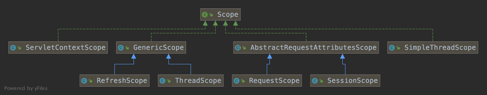

spring-bean-scope


## 目的

控制 Bean 的实例化范围


## 设计





| 类型              | 对象                | 实现说明                                            |
| ----------------- | ------------------- | --------------------------------------------------- |
| @Singleton        |                     | 一个 BeanFactory 有且仅有一个实例                   |
| @Prototype        |                     | 每次依赖查找和依赖注入生成新 Bean 对象              |
| @RequestScope     | RequestScope        | 保存在 RequestAttributes中，范围 request            |
| @SessionScope     | SessionScope        | 保存在 RequestAttributes中，范围 session，线程安全  |
| @ApplicationScope | ServletContextScope | 保存在 ServletContextScope                          |
| Thread            | SimpleThreadScope   | ThreadLocal 的方式存储。每个 Thread 维护一个 map    |
| @RefreshScope     | RefreshScope        | bean + Runnable 保存在 Lock + ConcurrenntHashMap 中 |
| Thread            | ThreadScope         | bean + Runnable 保存在 Lock + ThreadLocal 中        |


注意点：

Spring 容器没有办法管理 prototype Bean 的完整生命周期，也没有办法记录实例的存 

在。销毁回调方法将不会执行，可以利用 BeanPostProcessor 进行清扫工作。 

​	

## 原理解析

1.当容器启动的时候，`GenericScope`会自己把自己注册到scope中（`ConfigurableBeanFactory#registerScope`）（`GenericScope`）

2.然后当自定义的Bean（被`@RefreshScope`修饰）注册的时候，会被容器读取到其作用域为refresh。(`AnnotatedBeanDefinitionReader#doRegisterBean`)

> 通过上面三步，一个带有`@RefreshScope`的自定义Bean就被注册到容器中来，其作用域为refresh。

3.当我们后续进行以来查找的时候，会绕过`Singleton`和`Prototype`分支，进入最后一个分支，通过调用Scope接口的`get()`获取到该refresh作用域的实例。（`AbstractBeanFactory.doGetBean`）


## RefreshScope

背景知识

1、当我们使用cglib动态代理调用目标方法时，当方法被private修饰时，this为动态代理对象。当方法被public或者protected修饰时，this为目标对象。

2、使用 `@RefreshScope` 注解的 bean，不仅会生成一个`beanName`的bean，默认情况下同时会生成 `scopedTarget.beanName`的 bean。

3、使用 `@RefreshScope` 注解的会生成一个代理对象，通过这个代理对象来调用名为`scopedTarget.beanName`的 bean

4、`@RefreshScope`不能单独使用，需要和其他其他bean注解结合使用

5、刷新操作会导致原来的名为`scopedTarget.beanName`的bean被清除，再次使用会新生成新的名为`scopedTarget.beanName`的bean，但原来的代理对象不会变动

```java
@Target({ ElementType.TYPE, ElementType.METHOD })
@Retention(RetentionPolicy.RUNTIME)
@Scope("refresh")
@Documented
public @interface RefreshScope {
 /**
  * @see Scope#proxyMode()
  */
 ScopedProxyMode proxyMode() default ScopedProxyMode.TARGET_CLASS;

}
```


### @RefreshScope 实现流程

- 需要动态刷新的类标注`@RefreshScope` 注解。

- `@RefreshScope` 注解标注了`@Scope` 注解，并默认了`ScopedProxyMode.TARGET_CLASS;` 属性，此属性的功能就是再创建一个代理，在每次调用的时候都用它来调用`GenericScope get` 方法来获取对象。

- 如属性发生变更

- - 调用 `ContextRefresher refresh() -->> RefreshScope refreshAll()` 进行缓存清理方法调用；
  - 发送刷新事件通知，`GenericScope` 真正的清理方法`destroy()` 实现清理缓存。

- 在下一次使用对象的时候，会调用`GenericScope get(String name, ObjectFactory objectFactory)` 方法创建一个新的对象，并存入缓存`BeanLifecycleWrapperCache`中，此时新对象因为Spring 的装配机制就是新的属性了。


### @RefreshScope使用注意事项

- `@RefreshScope`作用的类，不能是final类，否则启动时会报错。
- `@RefreshScope`不能单独使用，需要和其他其他bean注解结合使用，如：`@Controller`、`@Service`、`@Component`、`@Repository`、`@Configuration`等。
- `@RefreshScope` 最好不要修饰在 `@Scheduled`、`listener`、`Timmer`等类中,因为配置的刷新会导致原来的对象被清除，需要重新使用对象才能出发生成新对象（但因为对象没了，又没法重新使用对象，死循环）


### @RefreshScope 使用方法

方法一：private方法获取动态值，将RefreshScope的proxyMode改为ScopedProxyMode.DEFAULT或者ScopedProxyMode.NO

方法二：public/protected 方法获取动态值，将RefreshScope的proxyMode改为ScopedProxyMode.TARGET_CLASS

方法三：动态值所属类增加 @ConfigurationProperties

参考

1、聊聊使用@RefreshScope与nacos2整合踩到的坑


> `@ConfigurationProperties`有`ConfigurationPropertiesRebinder`这个监听器，监听着`EnvironmentChangeEvent`事件。当发生`EnvironmentChange`事件后，会重新构造原来的加了`@ConfigurationProperties`注解的Bean对象。这个是Spring Cloud的默认实现。