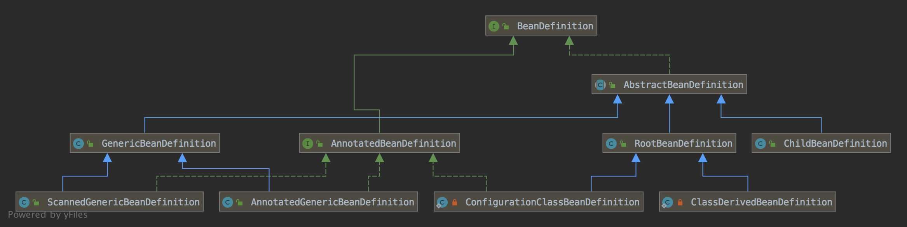

spring-bean

https://www.cnblogs.com/dengpengbo/p/11087958.html

https://www.jianshu.com/p/bcad005b6d8a

https://blog.csdn.net/javazejian/article/details/54561302

https://blog.csdn.net/javazejian/article/details/56267036

https://www.jianshu.com/p/f9acae180f81

https://www.zhangjianbing.com/archives/24/

https://www.zhangjianbing.com/archives/4/

https://www.zhangjianbing.com/archives/9/

https://blog.csdn.net/haponchang/article/details/90258053

https://blog.csdn.net/haponchang/article/details/90258033

https://blog.csdn.net/haponchang/article/details/90258053

https://blog.csdn.net/haponchang/article/details/90258070

http://tianxiaobo.com/categories/java-framework/spring/

https://www.cnblogs.com/123-shen/p/SpringBoot.html

https://www.cnblogs.com/jpfss/p/11152006.html

https://www.cnblogs.com/java-chen-hao/category/1480619.html

https://www.cnblogs.com/java-chen-hao/p/11187414.html

https://www.cnblogs.com/java-chen-hao/p/11589856.html

https://mp.weixin.qq.com/s?__biz=Mzg5MzUxNjk2Ng==&mid=2247483756&idx=1&sn=d94ae129c4960c29cebb94e58e603718&chksm=c02ceca5f75b65b37502e3d17501b6a70d3c332dd6d3e826f7501438ece5dd9734b9c8f409a9&scene=21#wechat_redirect

https://mp.weixin.qq.com/s?__biz=Mzg5MzUxNjk2Ng==&mid=2247483743&idx=1&sn=8d94f9999997034348e0a39d1a051a5a&chksm=c02cec96f75b658053ef5f6839a6268817ea4ee5f857bc61585faf2f649496cf8eeb364dfc3f&scene=21#wechat_redirect

## 最佳实践

Aware

Capable

BeanWrapper

Environment

### BeanDifinition

#### 定义 Spring Bean

Beandifiniton 是 Spring framework 中定义 Bean 的配置元信息接口：包含

1. Bean 实例化对象的属性，比如名称，父 Bean、依赖、构造器、属性
2. 初始化 Bean 的属性：是否延迟初始化、作用域（Scope）、是否 Audowired、是否是 Primary、角色
3. Bean 的生命周期：FactoryBean、FactoryMethod、initMethod、DestoryMethod。

| 属性                | 说明                                                         |
| ------------------- | ------------------------------------------------------------ |
| ParentName          | 父 Bean 的名称，GenericBean 有 Parent，RootBean 没有 Parent  |
| ClassName           | Bean 的全类名                                                |
| DependOn            | Set the names of the beans that this bean depends on being initialized. The bean factory will guarantee that these beans get initialized first. Note that dependencies are normally expressed through bean properties or constructor arguments. This property should just be necessary for other kinds of dependencies like statics (*ugh*) or database preparation on startup. |
| ConstructorArgument | Bean 构造器参数                                              |
| PropertyValues      | Bean 属性值                                                  |
| Attribute           | Bean 属性                                                    |
| Description         | Bean 的描述                                                  |
| Scope               | 比如 Singleton，Prototype                                    |
| LazyInit            | 是否延迟初始化，默认 false                                   |
| AutowireCandidate   | 是否 Autowire。Set whether this bean is a candidate for getting autowired into some other bean. Note that this flag is designed to only affect type-based autowiring. It does not affect explicit references by name, which will get resolved even if the specified bean is not marked as an autowire candidate. As a consequence, autowiring by name will nevertheless inject a bean if the name matches. |
| Primary             | 是否是 Autowire主要的初始化的 Bean。在有多个候选 Bean 出现冲突的时候使用，标记为 true 的 Bean 被选中。 |
| FactoryBean         | 创建这个 Bean 的工厂 Bean                                    |
| FactoryMethod       | 工厂方法                                                     |
| InitMethod          | 初始化方法                                                   |
| DestoryMethod       | 销毁方法                                                     |
| Role                | 包括 ROLE_APPLICATION，ROLE_SUPPORT，ROLE_INFRASTRUCTURE     |

AbstractBeanDefinition 还增加了如下属性

| 属性                         | 说明                                                         |
| ---------------------------- | ------------------------------------------------------------ |
| MethodOverrides              | 方法覆盖                                                     |
| DependencyCheck              | 依赖检查，默认DEPENDENCY_CHECK_NONE                          |
| qualifiers                   |                                                              |
| InstanceSupplier             | 解析构造器用 lenient mode ，默认为 True。如果设置会覆盖构造器和 Factory method 创建 Bean |
| NonPublicAccessAllowed       | 是否允许访问非 public 的构造器和方法。默认为 True            |
| LenientConstructorResolution |                                                              |
| EnforceInitMethod            | 默认 false                                                   |
| EnforceDestroyMethod         | 默认 false                                                   |
| Synthetic                    |                                                              |
| Resource                     | BeanDefinition 的数据来源，这里将所有来源抽象为 Resource     |
| autowireMode                 | 默认 AUTOWIRE_NO                                             |

autowireMode 包括

1. AUTOWIRE_NO
2. AUTOWIRE_BY_NAME
3. AUTOWIRE_AUTODETECT：如果 Bean 有无参构造函数，AUTOWIRE_BY_TYPE，否则为 AUTOWIRE_CONSTRUCTOR。
4. AUTOWIRE_CONSTRUCTOR
5. AUTOWIRE_BY_TYPE

DependencyCheck包括

1. DEPENDENCY_CHECK_NONE
2. DEPENDENCY_CHECK_OBJECTS：当 Bean 有无参构造函数，且 dependencyCheck 不为0.
3. DEPENDENCY_CHECK_SIMPLE
4. DEPENDENCY_CHECK_ALL

#### BeanDefinition 元数据构建

BeanDefinitionBuilder

AbstractBeanDefinition 及派生类

#### 命名 Spring Bean

Spring Bean 的名称有两种生成方式，

1. 基于配置的建议指定 name 或 id，如果不指定会生成默认的 id
2. 基于注解建议不指定 Bean 名称或 id

#### Spring Bean 别名

别名的用处

1. 场景化命名
2. 复用现有的 BeanDefinition

#### 注册 Spring Bean

1. XML 配置元信息  `<bean name="">`
2. Java 注解配置元信息 @Bean @Component @Import
3. Java API 配置元信息
   * 命名方式：BeanDefinitionRegistry#registerBeanDefinition
   * 非命名方式：BeanDefinitionReaderUtils#registerWithGenerateName
   * 配置类方式：AnnotatedBeanDefinitionReader#register

#### 实例化 Spring  Bean

常规方法

1. 通过构造器（配置元信息：XML，Java 注解和 Java API）
2. 通过静态工厂方法（配置元信息：XML 和 Java API）factoryMethod
3. 通过 Bean 工厂方法（配置元信息：XML 和 Java API）
4. 通过 FactoryBean （配置元信息：XML，Java 注解和 Java API）

特殊方法

1. 通过 ServiceLoaderFactoryBean（配置元信息：XML，Java 注解和 Java API）
2. 通过 AutowireCapableBeanFactory#createBean()
3. 通过 BeanDefinitionRegistry#registerBeanDefinition

BeanDefinition -> Spring Bean

初始化 Spring Bean

延迟初始化 Spring Bean

销毁 Spring Bean

垃圾回收 Spring Bean

疑问：

RuntimeBeanReference 的作用是啥？

Attribute与 PropertyValue 的区别是啥？

InstanceSupplier 的作用是啥？

Specify a callback for creating an instance of the bean, as an alternative to a declaratively specified factory method.
If such a callback is set, it will override any other constructor or factory method metadata. However, bean property population and potential annotation-driven injection will still apply as usual.

lenient mode 是啥意思？

Synthetic是啥意思？
