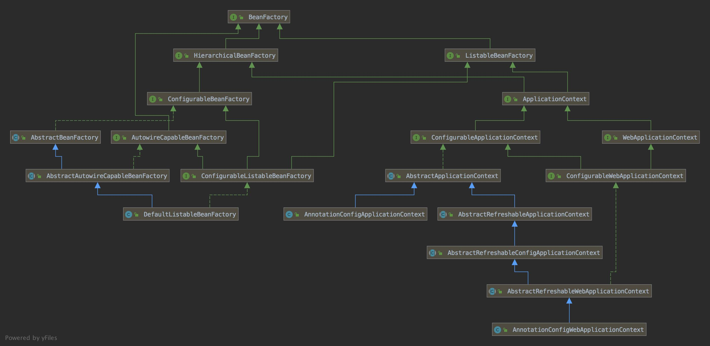
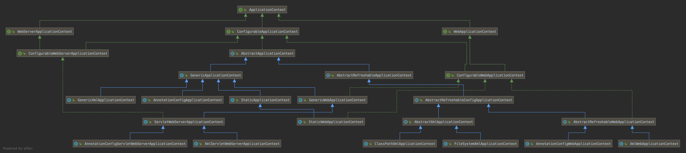
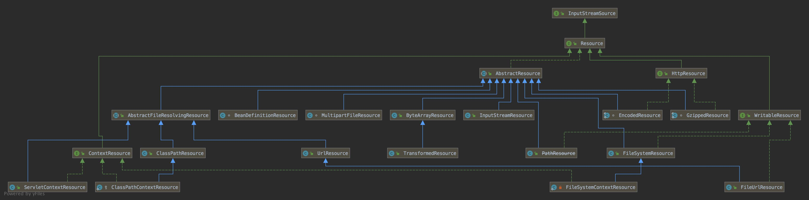
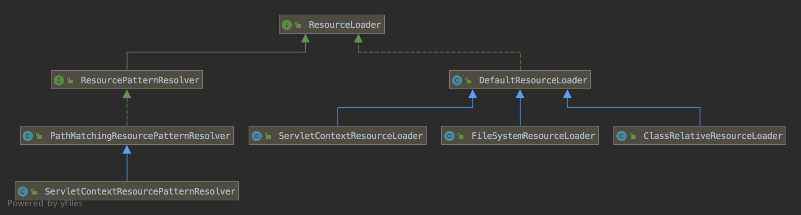
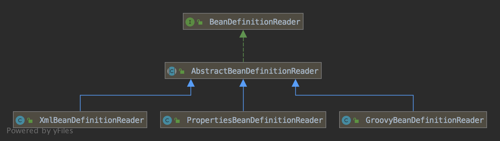

### 问题

1. 支持哪几种格式定义 Bean ？
2. Bean 相互依赖如何解决？ ObjectFactory
3. Bean 之间继承如何解决？
4. BeanFactory 和 FactoryBean 的关系
5. 循环依赖解决了那种Bean的循环依赖问题？如何解决的？
6. prototype 类型的 Bean 如何解决循环依赖？


https://www.cnblogs.com/wangjiming/p/11669091.html

### 体系结构

#### BeanFactory



1. 整个体系以 BeanFactory 和 ApplicationContext 为核心
2. BeanFactory：定义了获取一个 Bean 的基本操作，提供了 IoC 容器的基本功能
3. ApplicationContext 提供了 IoC 的高级功能。提供了 MessageSource，ApplicationEventPublisher等。
4. HierarchicalBeanFactory：定义了 BeanFactory 之间的关系
5. DefaultListableBeanFactory 提供了 IoC 容器所有的重要功能

#### ApplicationContext




#### Resource



支持各种 Resource。

UrlResource

ClassPathResource

ClassPathContextResource

ServletContextResource

FilesystemResource

FileUrlResource

GzipResource


#### ResourceLoader




```java
	public Resource getResource(String location) {
		Assert.notNull(location, "Location must not be null");

		for (ProtocolResolver protocolResolver : this.protocolResolvers) {
			Resource resource = protocolResolver.resolve(location, this);
			if (resource != null) {
				return resource;
			}
		}

		if (location.startsWith("/")) {
			return getResourceByPath(location);
		}
		else if (location.startsWith(CLASSPATH_URL_PREFIX)) {
			return new ClassPathResource(location.substring(CLASSPATH_URL_PREFIX.length()), getClassLoader());
		}
		else {
			try {
				// Try to parse the location as a URL...
				URL url = new URL(location);
				return (ResourceUtils.isFileURL(url) ? new FileUrlResource(url) : new UrlResource(url));
			}
			catch (MalformedURLException ex) {
				// No URL -> resolve as resource path.
				return getResourceByPath(location);
			}
		}
	}
```


如果以 “/” 开头，得到 ClassPathContextResource 或 FileSystemContextResource

如果以“classpath:” 开头，得到 ClassPathResource

如果是 file, vfsfile, vfs 开头，得到 FileUrlResource

其余用 UrlResource

其中 PathMatchingResourcepatterResolver 使用代理模式。实际上仍然用地 DefaultResourceLoader


#### BeanDefinition


#### BeanDefinitionReader



支持 Xml，Properties 两种读取 BeanDefinition 的方法。


配置文件 -> BeanDefinition -> 合并为 RootBeanDefinition -> BeanWrapper


### 对象属性


#### DefaultSingletonBeanRegistry

```java
public class DefaultSingletonBeanRegistry extends SimpleAliasRegistry implements SingletonBeanRegistry {

	/** Cache of singleton objects: bean name to bean instance. */
	private final Map<String, Object> singletonObjects = new ConcurrentHashMap<>(256);

	/** Cache of singleton factories: bean name to ObjectFactory. */
	private final Map<String, ObjectFactory<?>> singletonFactories  = new HashMap<>(16);

	/** Cache of early singleton objects: bean name to bean instance. */
  // BeanName 对应的 ObjectFactory 从 singletonFactories 删除之后，调用 ObjectFactory 的 getObject 方法，之后 Bean 加入 earlySingletonObjects
	private final Map<String, Object> earlySingletonObjects = new HashMap<>(16);

	/** Set of registered singletons, containing the bean names in registration order. */
	private final Set<String> registeredSingletons = new LinkedHashSet<>(256);

	/** Names of beans that are currently in creation. */
	private final Set<String> singletonsCurrentlyInCreation =
			Collections.newSetFromMap(new ConcurrentHashMap<>(16));

	/** Names of beans currently excluded from in creation checks. */
	private final Set<String> inCreationCheckExclusions =
			Collections.newSetFromMap(new ConcurrentHashMap<>(16));

	/** List of suppressed Exceptions, available for associating related causes. */
	@Nullable
	private Set<Exception> suppressedExceptions;

	/** Flag that indicates whether we're currently within destroySingletons. */
	private boolean singletonsCurrentlyInDestruction = false;

	/** Disposable bean instances: bean name to disposable instance. */
	private final Map<String, Object> disposableBeans = new LinkedHashMap<>();

	/** Map between containing bean names: bean name to Set of bean names that the bean contains. */
	private final Map<String, Set<String>> containedBeanMap = new ConcurrentHashMap<>(16);

	/** Map between dependent bean names: bean name to Set of dependent bean names. */
	private final Map<String, Set<String>> dependentBeanMap = new ConcurrentHashMap<>(64);

	/** Map between depending bean names: bean name to Set of bean names for the bean's dependencies. */
	private final Map<String, Set<String>> dependenciesForBeanMap = new ConcurrentHashMap<>(64);
}
```


#### AbstractBeanFactory

```java
public abstract class AbstractBeanFactory extends FactoryBeanRegistrySupport implements ConfigurableBeanFactory {

	/** Parent bean factory, for bean inheritance support. */
	@Nullable
	private BeanFactory parentBeanFactory;

	/** ClassLoader to resolve bean class names with, if necessary. */
	@Nullable
	private ClassLoader beanClassLoader = ClassUtils.getDefaultClassLoader();

	/** ClassLoader to temporarily resolve bean class names with, if necessary. */
	@Nullable
	private ClassLoader tempClassLoader;

	/** Whether to cache bean metadata or rather reobtain it for every access. */
	private boolean cacheBeanMetadata = true;

	/** Resolution strategy for expressions in bean definition values. */
	@Nullable
	private BeanExpressionResolver beanExpressionResolver;

	/** Spring ConversionService to use instead of PropertyEditors. */
	@Nullable
	private ConversionService conversionService;

	/** Custom PropertyEditorRegistrars to apply to the beans of this factory. */
	private final Set<PropertyEditorRegistrar> propertyEditorRegistrars;

	/** Custom PropertyEditors to apply to the beans of this factory. */
	private final Map<Class<?>, Class<? extends PropertyEditor>> customEditors;

	/** A custom TypeConverter to use, overriding the default PropertyEditor mechanism. */
	@Nullable
	private TypeConverter typeConverter;

	/** String resolvers to apply e.g. to annotation attribute values. */
	private final List<StringValueResolver> embeddedValueResolvers;

	/** BeanPostProcessors to apply in createBean. */
  // 保存 Bean 的 PostProcessor。这里的 BeanPostProcessor 可以是多种。
	private final List<BeanPostProcessor> beanPostProcessors = new CopyOnWriteArrayList<>();

	/** Indicates whether any InstantiationAwareBeanPostProcessors have been registered. */
	private volatile boolean hasInstantiationAwareBeanPostProcessors;

	/** Indicates whether any DestructionAwareBeanPostProcessors have been registered. */
	private volatile boolean hasDestructionAwareBeanPostProcessors;

	/** Map from scope identifier String to corresponding Scope. */
	private final Map<String, Scope> scopes = new LinkedHashMap<>(8);

	/** Security context used when running with a SecurityManager. */
	@Nullable
	private SecurityContextProvider securityContextProvider;

	/** Map from bean name to merged RootBeanDefinition. */
	private final Map<String, RootBeanDefinition> mergedBeanDefinitions = new ConcurrentHashMap<>(256);

	/** Names of beans that have already been created at least once. */
	private final Set<String> alreadyCreated = Collections.newSetFromMap(new ConcurrentHashMap<>(256));

	/** Names of beans that are currently in creation. */
	private final ThreadLocal<Object> prototypesCurrentlyInCreation =
			new NamedThreadLocal<>("Prototype beans currently in creation");
}
```


#### RootBeanDefinition

```java
public class RootBeanDefinition extends AbstractBeanDefinition {
	@Nullable
	private BeanDefinitionHolder decoratedDefinition;

	@Nullable
	private AnnotatedElement qualifiedElement;

	boolean allowCaching = true;

	boolean isFactoryMethodUnique = false;

	@Nullable
	volatile ResolvableType targetType;

	/** Package-visible field for caching the determined Class of a given bean definition. */
	//
	volatile Class<?> resolvedTargetType;

	/** Package-visible field for caching the return type of a generically typed factory method. */
	@Nullable
	volatile ResolvableType factoryMethodReturnType;

	/** Package-visible field for caching a unique factory method candidate for introspection. */
	@Nullable
	volatile Method factoryMethodToIntrospect;

	/** Common lock for the four constructor fields below. */
	final Object constructorArgumentLock = new Object();

	// 缓存类的构造函数或工厂方法
	Executable resolvedConstructorOrFactoryMethod;

	// 构造函数或参数是否已经解析
	boolean constructorArgumentsResolved = false;

	/** Package-visible field for caching fully resolved constructor arguments. */
	@Nullable
	Object[] resolvedConstructorArguments;

	/** Package-visible field for caching partly prepared constructor arguments. */
	@Nullable
	Object[] preparedConstructorArguments;

	/** Common lock for the two post-processing fields below. */
	final Object postProcessingLock = new Object();

	/** Package-visible field that indicates MergedBeanDefinitionPostProcessor having been applied. */
  // MergedBeanDefinitionPostProcessor 类型的 BeanPostProcessor 是否已经被调用
	boolean postProcessed = false;

	/** Package-visible field that indicates a before-instantiation post-processor having kicked in. */
	@Nullable
	volatile Boolean beforeInstantiationResolved;

	@Nullable
	private Set<Member> externallyManagedConfigMembers;

	@Nullable
	private Set<String> externallyManagedInitMethods;

	@Nullable
	private Set<String> externallyManagedDestroyMethods;
}
```


```java
public abstract class AbstractAutowireCapableBeanFactory extends AbstractBeanFactory
		implements AutowireCapableBeanFactory {

	/** Strategy for creating bean instances. */
	private InstantiationStrategy instantiationStrategy = new CglibSubclassingInstantiationStrategy();

	/** Resolver strategy for method parameter names. */
	@Nullable
	private ParameterNameDiscoverer parameterNameDiscoverer = new DefaultParameterNameDiscoverer();

	/** Whether to automatically try to resolve circular references between beans. */
  //是否允许自动解决循环依赖
	private boolean allowCircularReferences = true;

	/**
	 * Whether to resort to injecting a raw bean instance in case of circular reference,
	 * even if the injected bean eventually got wrapped.
	 */
	private boolean allowRawInjectionDespiteWrapping = false;

	/**
	 * Dependency types to ignore on dependency check and autowire, as Set of
	 * Class objects: for example, String. Default is none.
	 */
	private final Set<Class<?>> ignoredDependencyTypes = new HashSet<>();

	/**
	 * Dependency interfaces to ignore on dependency check and autowire, as Set of
	 * Class objects. By default, only the BeanFactory interface is ignored.
	 */
	private final Set<Class<?>> ignoredDependencyInterfaces = new HashSet<>();

	/**
	 * The name of the currently created bean, for implicit dependency registration
	 * on getBean etc invocations triggered from a user-specified Supplier callback.
	 */
	private final NamedThreadLocal<String> currentlyCreatedBean = new NamedThreadLocal<>("Currently created bean");

	/** Cache of unfinished FactoryBean instances: FactoryBean name to BeanWrapper. */
	private final ConcurrentMap<String, BeanWrapper> factoryBeanInstanceCache = new ConcurrentHashMap<>();

	/** Cache of candidate factory methods per factory class. */
	private final ConcurrentMap<Class<?>, Method[]> factoryMethodCandidateCache = new ConcurrentHashMap<>();

	/** Cache of filtered PropertyDescriptors: bean Class to PropertyDescriptor array. */
	private final ConcurrentMap<Class<?>, PropertyDescriptor[]> filteredPropertyDescriptorsCache =
			new ConcurrentHashMap<>();
}
```


```java
abstract class AbstractBeanDefinition extends BeanMetadataAttributeAccessor
		implements BeanDefinition, Cloneable {
   
  // beanName 对应的 Class 或 beanName，可能为 Class 或 String。
  // 如果为 Class，则为 ClassUtils.forName(className, classLoader)
	private volatile Object beanClass;

	@Nullable
	private String scope = SCOPE_DEFAULT;

	private boolean abstractFlag = false;

	private boolean lazyInit = false;

	private int autowireMode = AUTOWIRE_NO;

	private int dependencyCheck = DEPENDENCY_CHECK_NONE;

	@Nullable
	private String[] dependsOn;

	private boolean autowireCandidate = true;

	private boolean primary = false;

	private final Map<String, AutowireCandidateQualifier> qualifiers = new LinkedHashMap<>();

	// 实例化 Bean 的 Supplier
	private Supplier<?> instanceSupplier;

	private boolean nonPublicAccessAllowed = true;

	private boolean lenientConstructorResolution = true;

	@Nullable
	private String factoryBeanName;

	@Nullable
	private String factoryMethodName;

	@Nullable
	private ConstructorArgumentValues constructorArgumentValues;

	@Nullable
	private MutablePropertyValues propertyValues;

	@Nullable
	private MethodOverrides methodOverrides;

	@Nullable
	private String initMethodName;

	@Nullable
	private String destroyMethodName;

	private boolean enforceInitMethod = true;

	private boolean enforceDestroyMethod = true;

	private boolean synthetic = false;

	private int role = BeanDefinition.ROLE_APPLICATION;

	@Nullable
	private String description;

	@Nullable
	private Resource resource;
}
```


### IoC 容器

ResourceLoader：定义加载 Resource 的方式。

Resource ：对各种形式定义 BeanDefinition 的抽象，比如 FileSystem，URL，classPath，将各种读取配置的方式统一转换为 InputStream

BeanDefinition：Java类结构在 Ioc的映射

BeanDefinitionReader：从 Resource 读取BeanDefinition 

BeanDefinitionRegistry ：注册 BeanDefinition 的方式

ClassPathBeanDefinitionScanner：扫描 classpath，通过过滤器（默认的过滤器是扫描 Component 注解的类）过滤出满足条件的类， 


首先 resource 在外部表现事实上为 location，location 为 String。

ResourceLoader 通过解析 location，得到不同类型的 Resource

BeanDefinitionReader 加载 Resource 得到 BeanDefinition

BeanDefinitionRegistry 注册 BeanDefinition 到内存


#### 包扫描

1. 根据 basePakage 构造扫描路径： classpath*com/example
2. 遍历扫描路径，用 PathMatcher  检查是否匹配，用 DefaultResourceLoader 加载 Resource
3. 设置 AbstractBeanDefinition 和 AnnotatedBeanDefinition  特有的属性
4. 将 BeanDefinition 注册到 registry
5. 对于注解类型 bean，注册响应的 PostProcessor


```java
	public int scan(String... basePackages) {
		int beanCountAtScanStart = this.registry.getBeanDefinitionCount();

    // 扫描包 basePackages，过滤之后，并初始化，最后注册满足条件的 BeanDefinition
		doScan(basePackages);

		// 对于注解类型 bean，注册响应的 PostProcessor
		if (this.includeAnnotationConfig) {
			AnnotationConfigUtils.registerAnnotationConfigProcessors(this.registry);
		}

		return (this.registry.getBeanDefinitionCount() - beanCountAtScanStart);
	}
	
	protected Set<BeanDefinitionHolder> doScan(String... basePackages) {
		Assert.notEmpty(basePackages, "At least one base package must be specified");
		Set<BeanDefinitionHolder> beanDefinitions = new LinkedHashSet<>();
		for (String basePackage : basePackages) {
      //1. 扫描 basePackage 找到满足条件的 BeanDefinition
			Set<BeanDefinition> candidates = findCandidateComponents(basePackage);
			for (BeanDefinition candidate : candidates) {
				ScopeMetadata scopeMetadata = this.scopeMetadataResolver.resolveScopeMetadata(candidate);
				candidate.setScope(scopeMetadata.getScopeName());
				String beanName = this.beanNameGenerator.generateBeanName(candidate, this.registry);
        // 设置 AbstractBeanDefinition 特有的属性
				if (candidate instanceof AbstractBeanDefinition) {
					postProcessBeanDefinition((AbstractBeanDefinition) candidate, beanName);
				}
        // 设置 AnnotatedBeanDefinition 特有的属性
				if (candidate instanceof AnnotatedBeanDefinition) {
					AnnotationConfigUtils.processCommonDefinitionAnnotations((AnnotatedBeanDefinition) candidate);
				}
        //检查兼容性
				if (checkCandidate(beanName, candidate)) {
					BeanDefinitionHolder definitionHolder = new BeanDefinitionHolder(candidate, beanName);
					definitionHolder =
							AnnotationConfigUtils.applyScopedProxyMode(scopeMetadata, definitionHolder, this.registry);
					beanDefinitions.add(definitionHolder);
          // 2. 将 bean 注册到 registry
					registerBeanDefinition(definitionHolder, this.registry);
				}
			}
		}
		return beanDefinitions;
	}

	private Set<BeanDefinition> scanCandidateComponents(String basePackage) {
		Set<BeanDefinition> candidates = new LinkedHashSet<>();
		try {
      //1. 根据 basePakage 构造扫描路径： classpath*com/example:
			String packageSearchPath = ResourcePatternResolver.CLASSPATH_ALL_URL_PREFIX +
					resolveBasePackage(basePackage) + '/' + this.resourcePattern;
      //2. 遍历 packageSearchPath，找到对应的 resource
			Resource[] resources = getResourcePatternResolver().getResources(packageSearchPath);
			boolean traceEnabled = logger.isTraceEnabled();
			boolean debugEnabled = logger.isDebugEnabled();
      // 过滤 resource 找到对应的 BeanDefinition
			for (Resource resource : resources) {
				if (traceEnabled) {
					logger.trace("Scanning " + resource);
				}
				if (resource.isReadable()) {
					try {
						MetadataReader metadataReader = getMetadataReaderFactory().getMetadataReader(resource);
            // 检查 resource 是否与 filter 匹配。如果与 excludeFilter 匹配，返回 false，与 includeFilter 匹配，返回 true
						if (isCandidateComponent(metadataReader)) {
							ScannedGenericBeanDefinition sbd = new ScannedGenericBeanDefinition(metadataReader);
							sbd.setResource(resource);
							sbd.setSource(resource);
              // 满足如下两个条件
              // 1. 顶层类或内部类 
              // 2.1. abstract && Lookup 注解 
              // 2.2. 不是 interface 和 abstract
							if (isCandidateComponent(sbd)) {
								if (debugEnabled) {
									logger.debug("Identified candidate component class: " + resource);
								}
								candidates.add(sbd);
							}
							else {
								if (debugEnabled) {
									logger.debug("Ignored because not a concrete top-level class: " + resource);
								}
							}
						}
						else {
							if (traceEnabled) {
								logger.trace("Ignored because not matching any filter: " + resource);
							}
						}
					}
					catch (Throwable ex) {
						throw new BeanDefinitionStoreException(
								"Failed to read candidate component class: " + resource, ex);
					}
				}
				else {
					if (traceEnabled) {
						logger.trace("Ignored because not readable: " + resource);
					}
				}
			}
		}
		catch (IOException ex) {
			throw new BeanDefinitionStoreException("I/O failure during classpath scanning", ex);
		}
		return candidates;
	}
```


### IoC 容器的启动

#### Resource 的定位

通过 ResourceLoader 获取 Resource，Resource 是对各种形式定义 BeanDefinition 的抽象

#### BeanDefinition 的加载

将用户定义好的 Bean 转换成 IoC 容器的数据结构 BeanDefinition。BeanDefinition 是 POJO 对象在 IoC 容器的映射。IoC 容器通过管理 BeanDefinition 来管理Bean。

#### 注册 BeanDefinition

BeanDefinitionRegistry 将 BeanDefinition 注册到 IoC 容器。


#### 启动流程分析

整个容器的启动由  AbstractApplicationContext 的 refresh 来完成。

```java
	public void refresh() throws BeansException, IllegalStateException {
		synchronized (this.startupShutdownMonitor) {
			// 准备刷新上下文环境
			prepareRefresh();

			// 由子类来实现 refreshBeanFactory 和 getBeanFactory 方法来完成
			ConfigurableListableBeanFactory beanFactory = obtainFreshBeanFactory();

			// beanFactory 部分属性设置
			prepareBeanFactory(beanFactory);

			try {
				// beanFactory 的 post-processing，默认什么也不做，子类可以扩展。
				postProcessBeanFactory(beanFactory);

				// 调用 beanFactory 后置处理器
				invokeBeanFactoryPostProcessors(beanFactory);

				// 注册拦截 Bean 处理器，用于拦截 Bean 的创建
				registerBeanPostProcessors(beanFactory);

				// 初始化消息源，不同语言的消息体，国际化处理
				initMessageSource();

				// 初始化消息广播器
				initApplicationEventMulticaster();

				// 默认什么也不做，子类可以扩展
				onRefresh();

				// 注册 Listener，并处理部分 earlyApplicationEvents 中的事件
				registerListeners();

				// 设置部分属性，并初始化 non-lazy-init 的单例 Bean
				finishBeanFactoryInitialization(beanFactory);

				// 开始生命周期管理器
				finishRefresh();
			}

			catch (BeansException ex) {
				if (logger.isWarnEnabled()) {
					logger.warn("Exception encountered during context initialization - " +
							"cancelling refresh attempt: " + ex);
				}

				// Destroy already created singletons to avoid dangling resources.
				destroyBeans();

				// Reset 'active' flag.
				cancelRefresh(ex);

				// Propagate exception to caller.
				throw ex;
			}

			finally {
				// Reset common introspection caches in Spring's core, since we
				// might not ever need metadata for singleton beans anymore...
				resetCommonCaches();
			}
		}
	}
```


其中 refreshBeanFactory，closeBeanFactory，getBeanFactory 是抽象方法，由子类来实现。

```java
protected abstract void refreshBeanFactory() throws BeansException, IllegalStateException;
protected abstract void closeBeanFactory();
public abstract ConfigurableListableBeanFactory getBeanFactory() throws IllegalStateException;
```


#### refreshBeanFactory

其中 AbstractRefreshableApplicationContext 实现了 refreshBeanFactory，refreshBeanFactory 的核心在于加载 BeanDefinition 的 loadBeanDefinitions

```java
	protected DefaultListableBeanFactory createBeanFactory() {
		return new DefaultListableBeanFactory(getInternalParentBeanFactory());
	}

  @Override
	protected final void refreshBeanFactory() throws BeansException {
    // 1. 关闭已有的 beanFactory
		if (hasBeanFactory()) {
			destroyBeans();
			closeBeanFactory();
		}
		try {
      // 2. 创建 DefaultListableBeanFactory
			DefaultListableBeanFactory beanFactory = createBeanFactory();
			beanFactory.setSerializationId(getId());
      // 设置相关属性，暂且可以忽略
			customizeBeanFactory(beanFactory);
      // 3. 加载并注册 BeanDefinition
			loadBeanDefinitions(beanFactory);
			synchronized (this.beanFactoryMonitor) {
				this.beanFactory = beanFactory;
			}
		}
		catch (IOException ex) {
			throw new ApplicationContextException("I/O error parsing bean definition source for " + getDisplayName(), ex);
		}
	}

	protected abstract void loadBeanDefinitions(DefaultListableBeanFactory beanFactory)
			throws BeansException, IOException;
```


BeanDefinition 的加载通过实现 BeanDefinitionReader 的如下 4 个接口来实现

```java
int loadBeanDefinitions(Resource resource) throws BeanDefinitionStoreException;
int loadBeanDefinitions(Resource... resources) throws BeanDefinitionStoreException;
int loadBeanDefinitions(String location) throws BeanDefinitionStoreException;
int loadBeanDefinitions(String... locations) throws BeanDefinitionStoreException;
```


#### 加载 BeanDefinition

支持注解、xml 两种方式加载

  

##### 注解方式加载

```java
	public void register(Class<?>... annotatedClasses) {
		Assert.notEmpty(annotatedClasses, "At least one annotated class must be specified");
		Collections.addAll(this.annotatedClasses, annotatedClasses);
	}

	public void scan(String... basePackages) {
		Assert.notEmpty(basePackages, "At least one base package must be specified");
		Collections.addAll(this.basePackages, basePackages);
	}

	protected void loadBeanDefinitions(DefaultListableBeanFactory beanFactory) {
    // 获取 
		AnnotatedBeanDefinitionReader reader = getAnnotatedBeanDefinitionReader(beanFactory);
    // 从 classpath 扫描 BeanDefinition 的扫描器
		ClassPathBeanDefinitionScanner scanner = getClassPathBeanDefinitionScanner(beanFactory);
    
		BeanNameGenerator beanNameGenerator = getBeanNameGenerator();
		if (beanNameGenerator != null) {
			reader.setBeanNameGenerator(beanNameGenerator);
			scanner.setBeanNameGenerator(beanNameGenerator);
			beanFactory.registerSingleton(AnnotationConfigUtils.CONFIGURATION_BEAN_NAME_GENERATOR, beanNameGenerator);
		}

		ScopeMetadataResolver scopeMetadataResolver = getScopeMetadataResolver();
		if (scopeMetadataResolver != null) {
			reader.setScopeMetadataResolver(scopeMetadataResolver);
			scanner.setScopeMetadataResolver(scopeMetadataResolver);
		}

    // 通过 register 调用的类，通过 reader.register 进行注册 beanFactory
		if (!this.annotatedClasses.isEmpty()) {
			if (logger.isDebugEnabled()) {
				logger.debug("Registering annotated classes: [" +
						StringUtils.collectionToCommaDelimitedString(this.annotatedClasses) + "]");
			}
			reader.register(ClassUtils.toClassArray(this.annotatedClasses));
		}

    // 通过 scan 调用的路径，通过 scanner.scan 进行注册到 beanFactory
		if (!this.basePackages.isEmpty()) {
			if (logger.isDebugEnabled()) {
				logger.debug("Scanning base packages: [" +
						StringUtils.collectionToCommaDelimitedString(this.basePackages) + "]");
			}
			scanner.scan(StringUtils.toStringArray(this.basePackages));
		}

    // 通过 setConfigLocations 设置的路径，先用 reader.register 进行注册，如果找不到，则使用 scanner.scan 注册到 beanFactory
		String[] configLocations = getConfigLocations();
		if (configLocations != null) {
			for (String configLocation : configLocations) {
				try {
					Class<?> clazz = ClassUtils.forName(configLocation, getClassLoader());
					if (logger.isTraceEnabled()) {
						logger.trace("Registering [" + configLocation + "]");
					}
					reader.register(clazz);
				}
				catch (ClassNotFoundException ex) {
					if (logger.isTraceEnabled()) {
						logger.trace("Could not load class for config location [" + configLocation +
								"] - trying package scan. " + ex);
					}
					int count = scanner.scan(configLocation);
					if (count == 0 && logger.isDebugEnabled()) {
						logger.debug("No annotated classes found for specified class/package [" + configLocation + "]");
					}
				}
			}
		}
	}


```


AnnotatedBeanDefinitionReader 的 register

```java
	public void register(Class<?>... annotatedClasses) {
		for (Class<?> annotatedClass : annotatedClasses) {
			registerBean(annotatedClass);
		}
	}

	public void registerBean(Class<?> annotatedClass) {
		doRegisterBean(annotatedClass, null, null, null);
	}

	<T> void doRegisterBean(Class<T> annotatedClass, @Nullable Supplier<T> instanceSupplier, @Nullable String name,
			@Nullable Class<? extends Annotation>[] qualifiers, BeanDefinitionCustomizer... definitionCustomizers) {

		AnnotatedGenericBeanDefinition abd = new AnnotatedGenericBeanDefinition(annotatedClass);
		if (this.conditionEvaluator.shouldSkip(abd.getMetadata())) {
			return;
		}

		abd.setInstanceSupplier(instanceSupplier);
		ScopeMetadata scopeMetadata = this.scopeMetadataResolver.resolveScopeMetadata(abd);
		abd.setScope(scopeMetadata.getScopeName());
		String beanName = (name != null ? name : this.beanNameGenerator.generateBeanName(abd, this.registry));

		AnnotationConfigUtils.processCommonDefinitionAnnotations(abd);
		if (qualifiers != null) {
			for (Class<? extends Annotation> qualifier : qualifiers) {
				if (Primary.class == qualifier) {
					abd.setPrimary(true);
				}
				else if (Lazy.class == qualifier) {
					abd.setLazyInit(true);
				}
				else {
					abd.addQualifier(new AutowireCandidateQualifier(qualifier));
				}
			}
		}
		for (BeanDefinitionCustomizer customizer : definitionCustomizers) {
			customizer.customize(abd);
		}

		BeanDefinitionHolder definitionHolder = new BeanDefinitionHolder(abd, beanName);
		definitionHolder = AnnotationConfigUtils.applyScopedProxyMode(scopeMetadata, definitionHolder, this.registry);
		BeanDefinitionReaderUtils.registerBeanDefinition(definitionHolder, this.registry);
	}
```


ClassPathBeanDefinitionScanner 的 scan

```java
	public int scan(String... basePackages) {
		int beanCountAtScanStart = this.registry.getBeanDefinitionCount();

		doScan(basePackages);

		// Register annotation config processors, if necessary.
		if (this.includeAnnotationConfig) {
			AnnotationConfigUtils.registerAnnotationConfigProcessors(this.registry);
		}

		return (this.registry.getBeanDefinitionCount() - beanCountAtScanStart);
	}
	
	protected Set<BeanDefinitionHolder> doScan(String... basePackages) {
		Assert.notEmpty(basePackages, "At least one base package must be specified");
		Set<BeanDefinitionHolder> beanDefinitions = new LinkedHashSet<>();
		for (String basePackage : basePackages) {
			Set<BeanDefinition> candidates = findCandidateComponents(basePackage);
			for (BeanDefinition candidate : candidates) {
				ScopeMetadata scopeMetadata = this.scopeMetadataResolver.resolveScopeMetadata(candidate);
				candidate.setScope(scopeMetadata.getScopeName());
				String beanName = this.beanNameGenerator.generateBeanName(candidate, this.registry);
				if (candidate instanceof AbstractBeanDefinition) {
					postProcessBeanDefinition((AbstractBeanDefinition) candidate, beanName);
				}
				if (candidate instanceof AnnotatedBeanDefinition) {
					AnnotationConfigUtils.processCommonDefinitionAnnotations((AnnotatedBeanDefinition) candidate);
				}
				if (checkCandidate(beanName, candidate)) {
					BeanDefinitionHolder definitionHolder = new BeanDefinitionHolder(candidate, beanName);
					definitionHolder =
							AnnotationConfigUtils.applyScopedProxyMode(scopeMetadata, definitionHolder, this.registry);
					beanDefinitions.add(definitionHolder);
					registerBeanDefinition(definitionHolder, this.registry);
				}
			}
		}
		return beanDefinitions;
	}
```


##### XML方式 加载

```java
	protected void loadBeanDefinitions(DefaultListableBeanFactory beanFactory) throws BeansException, IOException {
		// Create a new XmlBeanDefinitionReader for the given BeanFactory.
		XmlBeanDefinitionReader beanDefinitionReader = new XmlBeanDefinitionReader(beanFactory);

		// Configure the bean definition reader with this context's
		// resource loading environment.
		beanDefinitionReader.setEnvironment(this.getEnvironment());
		beanDefinitionReader.setResourceLoader(this);
		beanDefinitionReader.setEntityResolver(new ResourceEntityResolver(this));

		// Allow a subclass to provide custom initialization of the reader,
		// then proceed with actually loading the bean definitions.
		initBeanDefinitionReader(beanDefinitionReader);
		loadBeanDefinitions(beanDefinitionReader);
	}
	
	protected void initBeanDefinitionReader(XmlBeanDefinitionReader reader) {
		reader.setValidating(this.validating);
	}
	
	protected void loadBeanDefinitions(XmlBeanDefinitionReader reader) throws BeansException, IOException {
		Resource[] configResources = getConfigResources();
		if (configResources != null) {
			reader.loadBeanDefinitions(configResources);
		}
		String[] configLocations = getConfigLocations();
		if (configLocations != null) {
			reader.loadBeanDefinitions(configLocations);
		}
	}
	
	public int loadBeanDefinitions(Resource... resources) throws BeanDefinitionStoreException {
		Assert.notNull(resources, "Resource array must not be null");
		int count = 0;
		for (Resource resource : resources) {
			count += loadBeanDefinitions(resource);
		}
		return count;
	}
  
	public int loadBeanDefinitions(String location) throws BeanDefinitionStoreException {
		return loadBeanDefinitions(location, null);
	}  
```


### 依赖注入

参考 spring-createbean


### 问题答案

#### BeanFactory 和 FactoryBean 的关系

BeanFactory 是一个 Factory，用于创建对象的 IoC 容器

FactoryBean 是一个 Bean，但是是一个特殊的 Bean。用于产生和修饰对象生成的工厂Bean。与普通 Bean 不同的是，在容器中，FactoryBean 以 & 开头。

### 附录