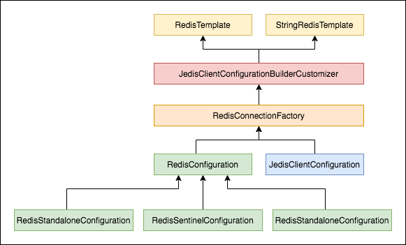

## Spring Cache


Spring 3.1 之后引入了基于注释（annotation）的缓存（cache）技术，它本质上不是一个具体的缓存实现方案（如EHCache或者Redis），而是一个对缓存使用的抽象，通过在既有代码中添加少量它定义的各种annotation，即能够达到缓存方法的返回对象的效果。


特性

1、缓存的抽象

2、支持主流缓存

3、支持 SpEL 表达式


1、支持多个 cacheName，每个 cacheName 可以绑定一个 RedisCacheConfiguration

2、


### 主要的类

```java
public interface CachingConfigurer {
    CacheManager cacheManager();
    CacheResolver cacheResolver();
    KeyGenerator keyGenerator();
    CacheErrorHandler errorHandler();
}
public interface CacheManager {
   Cache getCache(String name);
   Collection<String> getCacheNames();
}
@FunctionalInterface
public interface CacheResolver {
	Collection<? extends Cache> resolveCaches(CacheOperationInvocationContext<?> context);
}
@FunctionalInterface
public interface KeyGenerator {
	Object generate(Object target, Method method, Object... params);
}
public interface CacheErrorHandler {
	void handleCacheGetError(RuntimeException exception, Cache cache, Object key);
	void handleCachePutError(RuntimeException exception, Cache cache, Object key, @Nullable Object value);
	void handleCacheEvictError(RuntimeException exception, Cache cache, Object key);
	void handleCacheClearError(RuntimeException exception, Cache cache);
}
```


### 注解

```java
@Target(ElementType.TYPE)
@Retention(RetentionPolicy.RUNTIME)
@Documented
public @interface CacheConfig {
	String[] cacheNames() default {};
	String keyGenerator() default "";
	String cacheManager() default "";
	String cacheResolver() default "";
}


```


### Spring Cache 实现过程分析

1．spring.factories

（1）我们都知道当引入 SpringBoot 的时候就会多一个 spring-boot-autoconfigure 的 jar，而此 Jar 里面 auto config 和加载很多相关的类。可以通过打开其包下面的 spring.factories文件，可以看到SpringBoot会默认加载org.springframework.boot.autoconfigure.cache. CacheAutoConfiguration配置文件。

（2）spring-boot-starter-cache这个jar还会帮我们加载Spring Cache所需要的其他jar包，如spring-context和spring-context-support，是Spring Cache的核心jar包。


初始化 CacheManager

```java
@Configuration(proxyBeanMethods = false)
@ConditionalOnClass(CacheManager.class)
@ConditionalOnBean(CacheAspectSupport.class)
@ConditionalOnMissingBean(value = CacheManager.class, name = "cacheResolver")
@EnableConfigurationProperties(CacheProperties.class)
@AutoConfigureAfter({ CouchbaseAutoConfiguration.class, HazelcastAutoConfiguration.class,
      HibernateJpaAutoConfiguration.class, RedisAutoConfiguration.class })
@Import({ CacheConfigurationImportSelector.class, CacheManagerEntityManagerFactoryDependsOnPostProcessor.class })
public class CacheAutoConfiguration {

   @Bean
   @ConditionalOnMissingBean
   public CacheManagerCustomizers cacheManagerCustomizers(ObjectProvider<CacheManagerCustomizer<?>> customizers) {
      return new CacheManagerCustomizers(customizers.orderedStream().collect(Collectors.toList()));
   }
}
```

1、通过@Conditional来判断是否满足条件进而加载Cache的配置文件。

2、预留了很多定义和扩展的口子，如Reids。

3、寻找默认的@cache 的处理方法。


### 加载配置类

根据 CacheType 加载对应的 CacheConfiguration。详细参考 CacheConfigurations

```java
static class CacheConfigurationImportSelector implements ImportSelector {
   @Override
   public String[] selectImports(AnnotationMetadata importingClassMetadata) {
      CacheType[] types = CacheType.values();
      String[] imports = new String[types.length];
      for (int i = 0; i < types.length; i++) {
         imports[i] = CacheConfigurations.getConfigurationClass(types[i]);
      }
      return imports;
   }
}

public enum CacheType {
	GENERIC,
	JCACHE,
	EHCACHE,
	HAZELCAST,
	INFINISPAN,
	COUCHBASE,
	REDIS,
	CAFFEINE,
	SIMPLE,
	NONE
}

final class CacheConfigurations {
	private static final Map<CacheType, Class<?>> MAPPINGS;
	static {
		Map<CacheType, Class<?>> mappings = new EnumMap<>(CacheType.class);
		mappings.put(CacheType.GENERIC, GenericCacheConfiguration.class);
		mappings.put(CacheType.EHCACHE, EhCacheCacheConfiguration.class);
		mappings.put(CacheType.HAZELCAST, HazelcastCacheConfiguration.class);
		mappings.put(CacheType.INFINISPAN, InfinispanCacheConfiguration.class);
		mappings.put(CacheType.JCACHE, JCacheCacheConfiguration.class);
		mappings.put(CacheType.COUCHBASE, CouchbaseCacheConfiguration.class);
		mappings.put(CacheType.REDIS, RedisCacheConfiguration.class);
		mappings.put(CacheType.CAFFEINE, CaffeineCacheConfiguration.class);
		mappings.put(CacheType.SIMPLE, SimpleCacheConfiguration.class);
		mappings.put(CacheType.NONE, NoOpCacheConfiguration.class);
		MAPPINGS = Collections.unmodifiableMap(mappings);
	}

	private CacheConfigurations() {
	}

	static String getConfigurationClass(CacheType cacheType) {
		Class<?> configurationClass = MAPPINGS.get(cacheType);
		Assert.state(configurationClass != null, () -> "Unknown cache type " + cacheType);
		return configurationClass.getName();
	}

	static CacheType getType(String configurationClassName) {
		for (Map.Entry<CacheType, Class<?>> entry : MAPPINGS.entrySet()) {
			if (entry.getValue().getName().equals(configurationClassName)) {
				return entry.getKey();
			}
		}
		throw new IllegalStateException("Unknown configuration class " + configurationClassName);
	}
}
```


### 开启缓存配置

```java
@Target(ElementType.TYPE)
@Retention(RetentionPolicy.RUNTIME)
@Documented
@Import(CachingConfigurationSelector.class)
public @interface EnableCaching {
   boolean proxyTargetClass() default false;
   AdviceMode mode() default AdviceMode.PROXY;
   int order() default Ordered.LOWEST_PRECEDENCE;
}
```


```java
public class CachingConfigurationSelector extends AdviceModeImportSelector<EnableCaching> {
	@Override
	public String[] selectImports(AdviceMode adviceMode) {
		switch (adviceMode) {
			case PROXY:
				return getProxyImports();
			case ASPECTJ:
				return getAspectJImports();
			default:
				return null;
		}
	}
}

public class ProxyCachingConfiguration extends AbstractCachingConfiguration {
   @Bean(name = CacheManagementConfigUtils.CACHE_ADVISOR_BEAN_NAME)
   @Role(BeanDefinition.ROLE_INFRASTRUCTURE)
   public BeanFactoryCacheOperationSourceAdvisor cacheAdvisor() {
      BeanFactoryCacheOperationSourceAdvisor advisor = new BeanFactoryCacheOperationSourceAdvisor();
      advisor.setCacheOperationSource(cacheOperationSource());
      advisor.setAdvice(cacheInterceptor());
      if (this.enableCaching != null) {
         advisor.setOrder(this.enableCaching.<Integer>getNumber("order"));
      }
      return advisor;
   }

   @Bean
   @Role(BeanDefinition.ROLE_INFRASTRUCTURE)
   public CacheOperationSource cacheOperationSource() {
      return new AnnotationCacheOperationSource();
   }

   @Bean
   @Role(BeanDefinition.ROLE_INFRASTRUCTURE)
   public CacheInterceptor cacheInterceptor() {
      CacheInterceptor interceptor = new CacheInterceptor();
      interceptor.configure(this.errorHandler, this.keyGenerator, this.cacheResolver, this.cacheManager);
      interceptor.setCacheOperationSource(cacheOperationSource());
      return interceptor;
   }

}
```


## 实例

1、增加依赖

```xml
    <dependencies>
        <dependency>
            <groupId>org.springframework.boot</groupId>
            <artifactId>spring-boot-starter-data-redis</artifactId>
            <version>2.3.2.RELEASE</version>
        </dependency>
        <dependency>
            <groupId>org.springframework.boot</groupId>
            <artifactId>spring-boot-starter-cache</artifactId>
            <version>2.3.2.RELEASE</version>
        </dependency>
    </dependencies>
```

2、配置

3、添加 @EnableCaching

4、


## 可扩展性

1、自定义CacheResolver

2、自定义 CacheManager

3、自定义 KeyGenerator

4、自定义 CacheErrorHandler


## Spring Data Redis

### 初始化

一旦当我们使用Spring Boot，其实任何一个starter都会引入spring-boot-autoconfigure的jar包，然后autoconfigure就会做很多事情。

我们用Spring Boot都知道starter的原理（spring-boot-autoconfigure.jar包里面的spring.factories定义了Spring Boot默认加载的AutoConfiguration），因此，打开spring.factories文件可以找到Spring自动加载了三个Configuration类。

```
org.springframework.boot.autoconfigure.EnableAutoConfiguration=\
org.springframework.boot.autoconfigure.data.redis.RedisAutoConfiguration,\
org.springframework.boot.autoconfigure.data.redis.RedisReactiveAutoConfiguration,\
org.springframework.boot.autoconfigure.data.redis.RedisRepositoriesAutoConfiguration,\
```




RedisAutoConfiguration

```java
@Configuration(
    proxyBeanMethods = false
)
@ConditionalOnClass({RedisOperations.class})
@EnableConfigurationProperties({RedisProperties.class})
@Import({LettuceConnectionConfiguration.class, JedisConnectionConfiguration.class})
public class RedisAutoConfiguration {
    public RedisAutoConfiguration() {
    }

    @Bean
    @ConditionalOnMissingBean(
        name = {"redisTemplate"}
    )
    public RedisTemplate<Object, Object> redisTemplate(RedisConnectionFactory redisConnectionFactory) throws UnknownHostException {
        RedisTemplate<Object, Object> template = new RedisTemplate();
        template.setConnectionFactory(redisConnectionFactory);
        return template;
    }

    @Bean
    @ConditionalOnMissingBean
    public StringRedisTemplate stringRedisTemplate(RedisConnectionFactory redisConnectionFactory) throws UnknownHostException {
        StringRedisTemplate template = new StringRedisTemplate();
        template.setConnectionFactory(redisConnectionFactory);
        return template;
    }
}
```


redis 依赖 RedisConnectionFactory 初始化 StringRedisTemplate 和 RedisTemplate。其中 RedisConnectionFactory 依赖 LettuceConnectionConfiguration 或 JedisConnectionConfiguration。


1、初始化 RedisConnectionFactory 

```java
@ConditionalOnClass({ GenericObjectPool.class, JedisConnection.class, Jedis.class })
class JedisConnectionConfiguration extends RedisConnectionConfiguration {

	@Bean
	@ConditionalOnMissingBean(RedisConnectionFactory.class)
	JedisConnectionFactory redisConnectionFactory(
			ObjectProvider<JedisClientConfigurationBuilderCustomizer> builderCustomizers) throws UnknownHostException {
		return createJedisConnectionFactory(builderCustomizers);
	}

	private JedisConnectionFactory createJedisConnectionFactory(
			ObjectProvider<JedisClientConfigurationBuilderCustomizer> builderCustomizers) {
		JedisClientConfiguration clientConfiguration = getJedisClientConfiguration(builderCustomizers);
    // 哨兵模式
		if (getSentinelConfig() != null) {
			return new JedisConnectionFactory(getSentinelConfig(), clientConfiguration);
		}
    // 集群模式
		if (getClusterConfiguration() != null) {
			return new JedisConnectionFactory(getClusterConfiguration(), clientConfiguration);
		}
    // 默认池化连接
		return new JedisConnectionFactory(getStandaloneConfig(), clientConfiguration);
	}
```


### 示例

1、引入依赖

2、配置 spring.redis

3、依赖注入

4、使用


#### 自定义 序列化


#### 自定义 KeyGenerator


## 参考

https://docs.spring.io/spring-data/data-redis/docs/current/reference/html/#reference

## 附录


### Lettuce vs jedis

|                                                              |                                                              |                                                              |
| :----------------------------------------------------------- | :----------------------------------------------------------- | :----------------------------------------------------------- |
| Supported Feature                                            | Lettuce                                                      | Jedis                                                        |
| Standalone Connections                                       | X                                                            | X                                                            |
| [Master/Replica Connections](https://docs.spring.io/spring-data/data-redis/docs/current/reference/html/#redis:write-to-master-read-from-replica) | X                                                            |                                                              |
| [Redis Sentinel](https://docs.spring.io/spring-data/data-redis/docs/current/reference/html/#redis:sentinel) | Master Lookup, Sentinel Authentication, Replica Reads        | Master Lookup                                                |
| [Redis Cluster](https://docs.spring.io/spring-data/data-redis/docs/current/reference/html/#cluster) | Cluster Connections, Cluster Node Connections, Replica Reads | Cluster Connections, Cluster Node Connections                |
| Transport Channels                                           | TCP, OS-native TCP (epoll, kqueue), Unix Domain Sockets      | TCP                                                          |
| Connection Pooling                                           | X (using `commons-pool2`)                                    | X (using `commons-pool2`)                                    |
| Other Connection Features                                    | Singleton-connection sharing for non-blocking commands       | Pipelining and Transactions mutually exclusive. Cannot use server/connection commands in pipeline/transactions. |
| SSL Support                                                  | X                                                            | X                                                            |
| [Pub/Sub](https://docs.spring.io/spring-data/data-redis/docs/current/reference/html/#pubsub) | X                                                            | X                                                            |
| [Pipelining](https://docs.spring.io/spring-data/data-redis/docs/current/reference/html/#pipeline) | X                                                            | X (Pipelining and Transactions mutually exclusive)           |
| [Transactions](https://docs.spring.io/spring-data/data-redis/docs/current/reference/html/#tx) | X                                                            | X (Pipelining and Transactions mutually exclusive)           |
| Datatype support                                             | Key, String, List, Set, Sorted Set, Hash, Server, Stream, Scripting, Geo, HyperLogLog | Key, String, List, Set, Sorted Set, Hash, Server, Scripting, Geo, HyperLogLog |
| [Reactive (non-blocking) API](https://docs.spring.io/spring-data/data-redis/docs/current/reference/html/#redis:reactive) | X                                                            |                                                              |