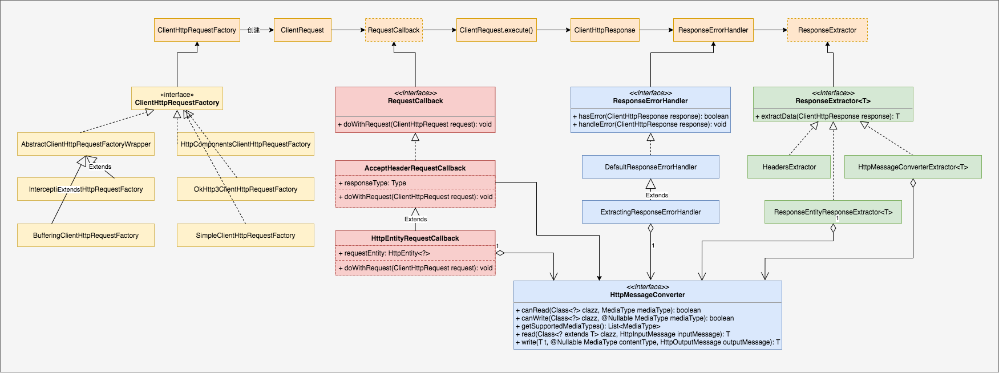
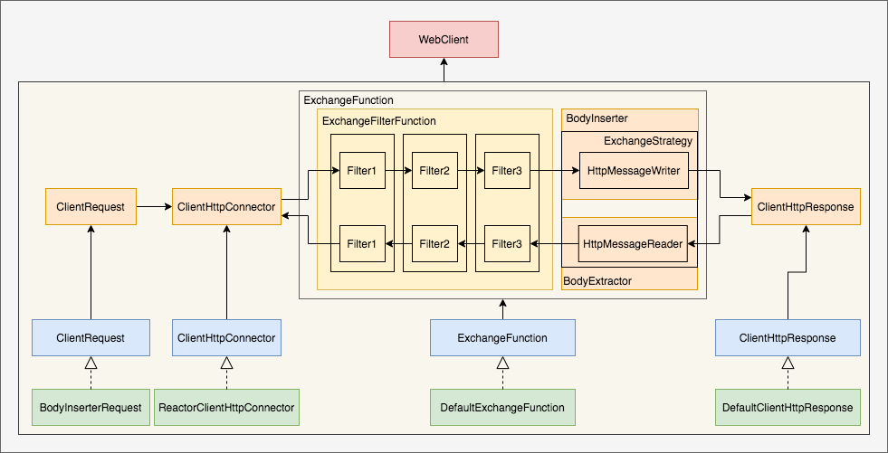

## 背景

spring 原生支持两种 web client。

* RestTemplate：支持同步和异步（AsyncRestTemplate）。底层可以是 jdk httpclient，apache httpclient，ok httpclient。

* WebClient：支持同步和异步。底层是 jetty 或 reactor-netty

从 Spring 5.0 开始，AsyncResTemplate 的 API 已经是 Deprecated。RestTemplate 也不再增加新特性。统一推荐使用 WebClient。

## 范围

 org.springframework.web.client

 org.springframework.http.client


## RestTemplate



其中：

* RequestFactoryCustomizer：设置三个属性：connectTimeout，readTimeout，bufferRequestBody
* ClientHttpRequestFactory：创建 ClientHttpRequest。当前默认支持 Java 内置 Http 客户端（不建议使用），okHttp 客户端，apache http 客户端。
* RequestCallback：请求的拦截处理。包括设置 Http 头，设置请求 Body
* ResponseErrorHandler：响应错误处理
* HttpMessageConverter：实现发送 Http 请求和接受Http应答时，进行 Java 对象与 Http 消息的转换。
* ClientHttpRequestInterceptor：请求拦截器
* UriTemplateHandler：url 模板，处理 url 中有变量的情况


所有核心实现为如下代码片段

```java
protected <T> T doExecute(URI url, @Nullable HttpMethod method, @Nullable RequestCallback requestCallback,
      @Nullable ResponseExtractor<T> responseExtractor) throws RestClientException {
   ClientHttpResponse response = null;
   try {
      // 通过 ClientHttpRequestFactory 创建 ClientHttpRequest
      ClientHttpRequest request = createRequest(url, method);
      // 执行请求前回调，修改 Header 或者设置请求 body
      if (requestCallback != null) {
         requestCallback.doWithRequest(request);
      }
      // 执行请求，返回应答
      response = request.execute();
      // 错误处理执行器
      handleResponse(url, method, response);
      // 
      return (responseExtractor != null ? responseExtractor.extractData(response) : null);
   }
   catch (IOException ex) {
      String resource = url.toString();
      String query = url.getRawQuery();
      resource = (query != null ? resource.substring(0, resource.indexOf('?')) : resource);
      throw new ResourceAccessException("I/O error on " + method.name() +
            " request for \"" + resource + "\": " + ex.getMessage(), ex);
   }
   finally {
      if (response != null) {
         response.close();
      }
   }
}
```


### 扩展性

1、扩展 ClientHttpRequestFactory：实现支持新类型的Http客户端

2、RequestCallback：默认不需要扩展。对请求发送前进行处理，在 ClientHttpRequestInterceptor 之前进行处理。一般情况下不建议进行扩展。如果要扩展，就只能使用 execute API

3、ClientHttpRequestInterceptor：请求发送前对请求进行处理。


## WebClient


### 功能特性

底层依赖 Reactor-Netty，Jetty


### 核心代码



其中

* WebClient 是整个客户端的门面

* ClientRequest：请求对象
* ClientHttpConnector：负责连接的发送与应答接受
* ExchangeFunction：默认实现了filter 执行和请求发送，应答接受
* ExchangeFilterFunction：过滤器，可以在请求发送前和收到应答后进行拦截
* ExchangeStrategies：对编解码进行配置
* BodyInserter：对Java 对象（作为请求体）转换为 Http 消息，底层依赖 HttpMessageWriter
* BodyExtrattor：将Http应答体转换为 Java 对象
* ClientHttpResponse：应答对象


DefaultWebClientBuilder#build

```java
public WebClient build() {
	ExchangeFunction exchange = (this.exchangeFunction == null ?
			ExchangeFunctions.create(getOrInitConnector(), initExchangeStrategies()) :
			this.exchangeFunction);
	ExchangeFunction filteredExchange = (this.filters != null ? this.filters.stream()
			.reduce(ExchangeFilterFunction::andThen)
			.map(filter -> filter.apply(exchange))
			.orElse(exchange) : exchange);
	return new DefaultWebClient(filteredExchange, initUriBuilderFactory(),
			this.defaultHeaders != null ? unmodifiableCopy(this.defaultHeaders) : null,
			this.defaultCookies != null ? unmodifiableCopy(this.defaultCookies) : null,
			this.defaultRequest, new DefaultWebClientBuilder(this));
}
```
DefaultRequestBodyUriSpec#exchange

```java
		public ResponseSpec retrieve() 
			return new DefaultResponseSpec(exchange(), this::createRequest);
		}
		
    @Override
		public Mono<ClientResponse> exchange() {
			ClientRequest request = (this.inserter != null ?
					initRequestBuilder().body(this.inserter).build() :
					initRequestBuilder().build());
			// 请求拦截器，发送请求，接受应答，应答拦截器
			return Mono.defer(() -> exchangeFunction.exchange(request)
					.checkpoint("Request to " + this.httpMethod.name() + " " + this.uri + " [DefaultWebClient]")
					.switchIfEmpty(NO_HTTP_CLIENT_RESPONSE_ERROR));
		}

		private ClientRequest.Builder initRequestBuilder() {
			if (defaultRequest != null) {
				defaultRequest.accept(this);
			}
			return ClientRequest.create(this.httpMethod, initUri())
					.headers(headers -> headers.addAll(initHeaders()))
					.cookies(cookies -> cookies.addAll(initCookies()))
					.attributes(attributes -> attributes.putAll(this.attributes));
		}
```


DefaultExchangeFunction#exchange

```java
	@Override
	public Mono<ClientResponse> exchange(ClientRequest clientRequest) {
		Assert.notNull(clientRequest, "ClientRequest must not be null");
		HttpMethod httpMethod = clientRequest.method();
		URI url = clientRequest.url();
		String logPrefix = clientRequest.logPrefix();

		return this.connector
        // 发送请求，接受应答
				.connect(httpMethod, url, httpRequest -> clientRequest.writeTo(httpRequest, this.strategies))
				.doOnRequest(n -> logRequest(clientRequest))
				.doOnCancel(() -> logger.debug(logPrefix + "Cancel signal (to close connection)"))
				.map(httpResponse -> {
					logResponse(httpResponse, logPrefix);
					return new DefaultClientResponse(
							httpResponse, this.strategies, logPrefix, httpMethod.name() + " " + url,
							() -> createRequest(clientRequest));
				});
	}
```


ReactorClientHttpConnector#connect

```java
	public Mono<ClientHttpResponse> connect(HttpMethod method, URI uri,
			Function<? super ClientHttpRequest, Mono<Void>> requestCallback) {

		if (!uri.isAbsolute()) {
			return Mono.error(new IllegalArgumentException("URI is not absolute: " + uri));
		}

		AtomicReference<ReactorClientHttpResponse> responseRef = new AtomicReference<>();

		return this.httpClient
				.request(io.netty.handler.codec.http.HttpMethod.valueOf(method.name()))
				.uri(uri.toString())
        // 发送请求
				.send((request, outbound) -> requestCallback.apply(adaptRequest(method, uri, request, outbound)))
        // 接受应答
				.responseConnection((response, connection) -> {
					responseRef.set(new ReactorClientHttpResponse(response, connection));
					return Mono.just((ClientHttpResponse) responseRef.get());
				})
				.next()
				.doOnCancel(() -> {
					ReactorClientHttpResponse response = responseRef.get();
					if (response != null) {
						response.releaseAfterCancel(method);
					}
				});
	}
```


### 扩展性

1、自定义 ExchangeFilterFunction 对请求和应答进行拦截


## 参考

https://docs.spring.io/spring-framework/docs/current/reference/html/web-reactive.html#webflux-client

https://github.com/bigbirditedu/webclient