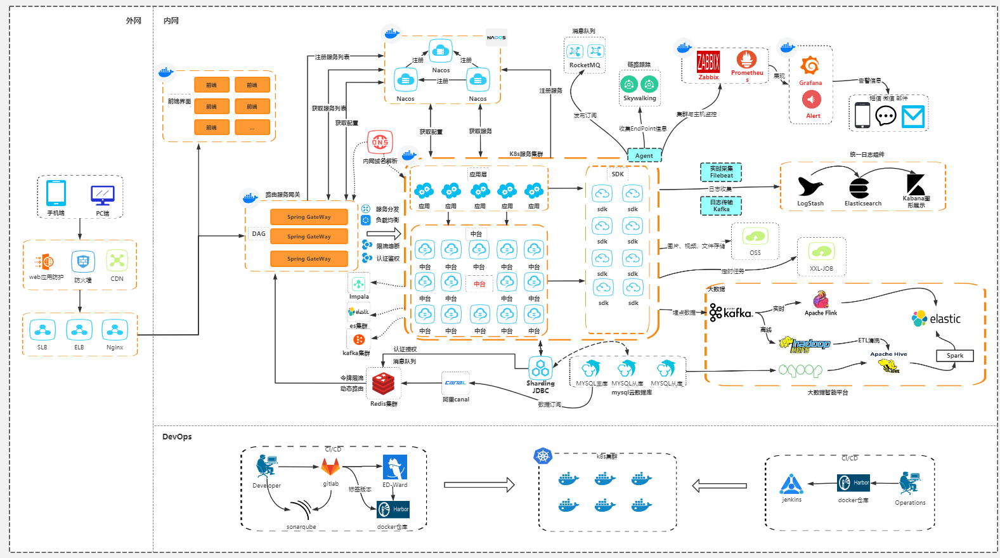
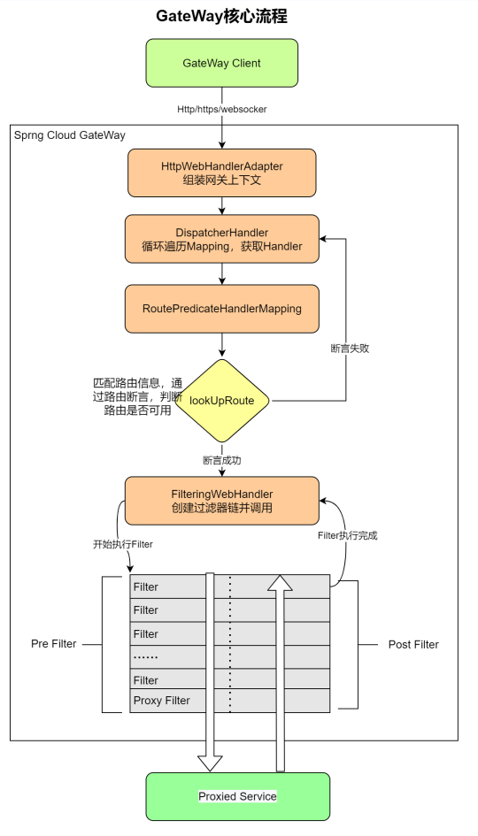

spring-cloud-gateway

网关对比

| 网关                 | 网络模型 | 框架    | 语言  | 性能 | 场景     | 备注             |
| -------------------- | -------- | ------- | ----- | ---- | -------- | ---------------- |
| Zuul 1.0             | 多线程   | Servlet | Java  | 低   | API 网关 | 性能低           |
| Zuul 2.0             | Reactor  | Netty   | Java  | 高   | API 网关 | 不成熟           |
| Spring Cloud Gateway | Reactor  | Netty   | Java  | 高   | API 网关 | 成熟             |
| Nginx lua            | Reactor  | Epoll   | C+Lua | 高   | 接入网关 | 与微服务适配不好 |
| Kong                 | Reactor  | Epoll   | C+Lua | 高   | API 网关 | 与微服务整合好   |
| Shenyu               |          |         |       |      |          |                  |
| Traefiik             |          |         | Go    |      |          |                  |

## 基本概念
路由（Route）是GateWay中最基本的组件之一，表示一个具体的路由信息载体，主要由下面几个部分组成：

id：路由唯一标识，区别于其他的route
url： 路由指向的目的地URL，客户端请求最终被转发到的微服务
order： 用于多个Route之间的排序，数值越小越靠前，匹配优先级越高
predicate：断言的作用是进行条件判断，只有断言为true，才执行路由
filter: 过滤器用于修改请求和响应信息

##  核心流程

### 核心处理流程

1、Gateway Client向 Spring Cloud Gateway发送请求
2、请求首先会被 HttpWebHandlerAdapter进行提取组装成网关上下文
3、然后网关的上下文会传递到 DispatcherHandler，它负责将请求分发给 RoutePredicateHandlerMapping
4、RoutePredicateHandlerMapping负责路由查找，并根据路由断言判断路由是否可用
5、如果过断言成功，由FilteringWebHandler创建过滤器链并调用
6、通过特定于请求的 Fliter链运行请求，Filter被虚线分隔的原因是Filter可以在发送代理请求之前（pre）和之后（post）运行逻辑
7、执行所有pre过滤器逻辑。然后进行代理请求。发出代理请求后，将运行“post”过滤器逻辑。
8、处理完毕之后将 Response返回到 Gateway客户端

### Route

### Predicate

Predicate 来源于 Java 8，是 Java 8 中引入的一个函数，Predicate 接受一个输入参数，返回一个布尔值结果。该接口包含多种默认方法来将 Predicate 组合成其他复杂的逻辑（比如：与，或，非）。可以用于接口请求参数校验、判断新老数据是否有变化需要进行更新操作。

在 Spring Cloud Gateway 中 Spring 利用 Predicate 的特性实现了各种路由匹配规则，有通过 Header、请求参数等不同的条件来进行作为条件匹配到对应的路由。

### Filter过滤器

- Filter在pre类型的过滤器可以做参数效验、权限效验、流量监控、日志输出、协议转换等。
- Filter在post类型的过滤器可以做响应内容、响应头的修改、日志输出、流量监控等

## 最佳实践

1、动态路由

2、全局异常处理

3、Redis保存路由

4、使用Nacos数据源动态加载和刷新路由配置

4、基于网关+nacos配置中心实现灰度路由

## 参考

https://juejin.cn/column/7029575116639961101  原理分析比较好

https://muxiaonong.blog.csdn.net/article/details/125236660

https://www.jianshu.com/p/6bcce3be33db 例子可以参考

https://www.jianshu.com/p/95a0beaecbac 案例可以参考

