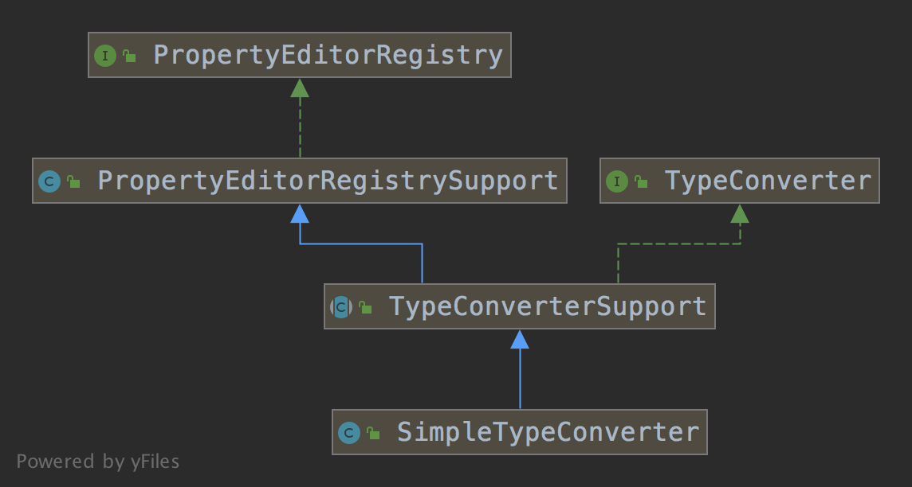
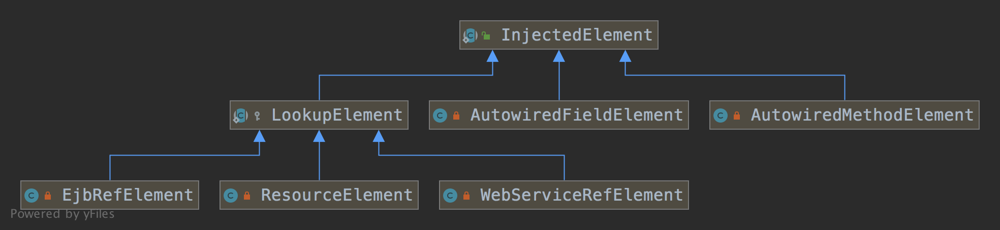
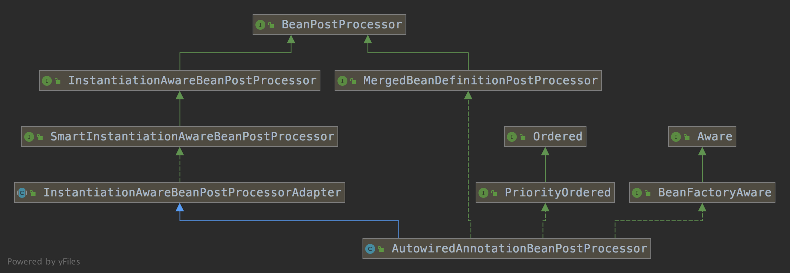
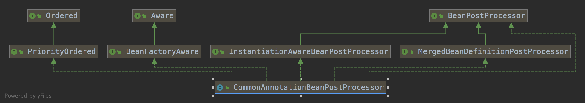

spring-denpendency-injects


#依赖注入


## 基础类型依赖注入

| 类型                   | 实例                                                         | 注入方式 |
| ---------------------- | ------------------------------------------------------------ | -------- |
| 原生类型               | boolean、byte、char、short、int、float、long、double         |          |
| 标量类型               | Number、Character、Boolean、Enum、Locale、Charset、Currency、 Properties、UUID |          |
| 常规类型               | Object、String、TimeZone、Calendar、Optional 等              |          |
| Spring 类型            | Resource、InputSource、Formatter 等                          |          |
| 数组类型(Array)        | 原生类型、标量类型、常规类型、Spring 类型                    |          |
| 集合类型（Collection） | Collection:List、Set(SortedSet、NavigableSet、EnumSet)、Map:Properties |          |


## 类类型依赖注入

| 类型       | 方式                                               |
| ---------- | -------------------------------------------------- |
| 构造器注入 | 手动模式：注解、xml、API；自动模式：byType         |
| Setter     | 手动模式：注解、xml、API；自动模式：byType、byName |
| 字段注入   | @Autowired、@Resource、@Inject                     |
| 方法注入   | @Autowired、@Resource、@Inject、@Bean              |

## 接口回调注入

实现 Aware 接口

| 內建接口                       | 说明                                                     |
| ------------------------------ | -------------------------------------------------------- |
| BeanFactoryAware               | 获取 IoC 容器 - BeanFactory                              |
| ApplicationContextAware        | 获取 Spring 应用上下文 - ApplicationContext 对象         |
| EnvironmentAware               | 获取 Environment 对象                                    |
| ResourceLoaderAware            | 获取资源加载器 对象 - ResourceLoader                     |
| BeanClassLoaderAware           | 获取加载当前 Bean Class 的 ClassLoader                   |
| BeanNameAware                  | 获取当前 Bean 的名称                                     |
| MessageSourceAware             | 获取 MessageSource 对象，用于 Spring 国际化              |
| ApplicationEventPublisherAware | 获取 ApplicationEventPublishAware 对象，用于 Spring 事件 |
| EmbeddedValueResolverAware     | 获取 StringValueResolver 对象，用于占位符处理            |


## Qualifier注解

1、通过 Bean名称限定：在注入的 Bean 增加 @Qualifier，通过指定Bean 的 name 来限定注入哪个 bean

2、通过分组限定：通过方法注入，在方法增加继承Qualifier的自定义注解，在注入的时候指定该自定义注解。

## 延迟注入

| 类型                  | 方式                       | API                                   |
| --------------------- | -------------------------- | ------------------------------------- |
| ObjectFactory         | 单一类型注入、集合类型注入 | 只能通过 get 方法来查找单一或集合类型 |
| ObjectProvider（推荐) | 单一类型注入、集合类型注入 |                                       |


# 原理分析

依赖注入的入口 DefaultListableBeanFactory 的 resolveDependency


### 元数据查找

查找类型

@Autowired

@Value

@Inject

查找条件

1、非 static 属性

2、所有非抽象方法，

3、非static 方法

4、有参数构造器


### 注入实现

#### 核心对象













#### 主流程

1、初始化元信息（DependencyDescriptor）

2、依赖查找：根据不同的类型注入，从 BeanFactory 找到匹配的 Bean

2.1、Optional 类型

2.2、ObjectFactory 或 ObjectProvider 类型

2.3、Provide 类型

2.4、基础类型：根据@Value 注解解析并返回。

2.5、集合类型：对每一个Bean 采用单一类型过滤并返回。

2.6、单一类型：找到匹配类型的所有 Bean，并根据如下条件过滤

2.6.1、如果包含 @Lazy 直接创建代理对象返回

2.6.2、如果包含 @Qualifiier，根据 name 找到匹配的 Bean，返回

2.6.3、如果包含 @Primary，找到含有 @Primary 注解的 Bean，返回

2.6.4、如果包含 @Priority，找到优先级最高的 Bean，返回

2.6.5、如果包含 @Ordered，找到优先级最高的 Bean，返回

2.6.6、如果注解包含 name属性，根据 name 找到匹配的 Bean，返回

2.6.7、如果注解包含 alias，根据 name 找到匹配的 Bean，返回

3、依赖注入：反射方式注入方法或属性


### 核心源码

#### 主流程

```java
	public PropertyValues postProcessProperties(PropertyValues pvs, Object bean, String beanName) {
    // 1、找到类的方法和属性包含 @Autowired @Value @Inject注解
		InjectionMetadata metadata = findAutowiringMetadata(beanName, bean.getClass(), pvs);
		try {
      // 2、遍历注解的方法和属性，
      // 3、通过反射注入
			metadata.inject(bean, beanName, pvs);
		}
		return pvs;
	}

  public Object resolveDependency(DependencyDescriptor descriptor, @Nullable String requestingBeanName,
			@Nullable Set<String> autowiredBeanNames, @Nullable TypeConverter typeConverter) throws BeansException {

		descriptor.initParameterNameDiscovery(getParameterNameDiscoverer());
    // Optional类型
		if (Optional.class == descriptor.getDependencyType()) {
			return createOptionalDependency(descriptor, requestingBeanName);
		}
    // ObjectFactory 或 ObjectProvider 直接 new DependencyObjectProvider 对象返回
		else if (ObjectFactory.class == descriptor.getDependencyType() ||
				ObjectProvider.class == descriptor.getDependencyType()) {
			return new DependencyObjectProvider(descriptor, requestingBeanName);
		}
    // javax.inject.Provider 类型
		else if (javaxInjectProviderClass == descriptor.getDependencyType()) {
			return new Jsr330Factory().createDependencyProvider(descriptor, requestingBeanName);
		}
		else {
      // 如果是 @Lazy 则 result 不为空，result为代理对象
			Object result = getAutowireCandidateResolver().getLazyResolutionProxyIfNecessary(
					descriptor, requestingBeanName);
			if (result == null) {
        // 其他类型解析
				result = doResolveDependency(descriptor, requestingBeanName, autowiredBeanNames, typeConverter);
			}
			return result;
		}
	}

	public Object doResolveDependency(DependencyDescriptor descriptor, @Nullable String beanName,
			@Nullable Set<String> autowiredBeanNames, @Nullable TypeConverter typeConverter) throws BeansException {

		InjectionPoint previousInjectionPoint = ConstructorResolver.setCurrentInjectionPoint(descriptor);
		try {
			Class<?> type = descriptor.getDependencyType();
      // @Value 注解，基本类型
			Object value = getAutowireCandidateResolver().getSuggestedValue(descriptor);
			if (value != null) {
				if (value instanceof String) {
					String strVal = resolveEmbeddedValue((String) value);
					BeanDefinition bd = (beanName != null && containsBean(beanName) ?
							getMergedBeanDefinition(beanName) : null);
					value = evaluateBeanDefinitionString(strVal, bd);
				}
				TypeConverter converter = (typeConverter != null ? typeConverter : getTypeConverter());
				try {
          // 类型转换
					return converter.convertIfNecessary(value, type, descriptor.getTypeDescriptor());
				}
				catch (UnsupportedOperationException ex) {
					// A custom TypeConverter which does not support TypeDescriptor resolution...
					return (descriptor.getField() != null ?
							converter.convertIfNecessary(value, type, descriptor.getField()) :
							converter.convertIfNecessary(value, type, descriptor.getMethodParameter()));
				}
			}

      // 解析集合类型，包括Stream、数组、Collection、Map(Key 必须为 String)
			Object multipleBeans = resolveMultipleBeans(descriptor, beanName, autowiredBeanNames, typeConverter);
			if (multipleBeans != null) {
				return multipleBeans;
			}

      // 单一类型找到匹配类型的 Bean。
      // 如果有 @Qualifier 注解，匹配的只有一个，matchingBeans 只有一个元素。
			Map<String, Object> matchingBeans = findAutowireCandidates(beanName, type, descriptor);
			if (matchingBeans.isEmpty()) {
				if (isRequired(descriptor)) {
					raiseNoMatchingBeanFound(type, descriptor.getResolvableType(), descriptor);
				}
				return null;
			}

			String autowiredBeanName;
			Object instanceCandidate;

      // 找到匹配当前的最佳bean
			if (matchingBeans.size() > 1) {
        // 依次解析 @Primary @Priority、@Ordered、@Alias
				autowiredBeanName = determineAutowireCandidate(matchingBeans, descriptor);
				if (autowiredBeanName == null) {
					if (isRequired(descriptor) || !indicatesMultipleBeans(type)) {
						return descriptor.resolveNotUnique(descriptor.getResolvableType(), matchingBeans);
					}
					else {
						return null;
					}
				}
				instanceCandidate = matchingBeans.get(autowiredBeanName);
			}
			else {
				// We have exactly one match.
				Map.Entry<String, Object> entry = matchingBeans.entrySet().iterator().next();
				autowiredBeanName = entry.getKey();
				instanceCandidate = entry.getValue();
			}

			if (autowiredBeanNames != null) {
				autowiredBeanNames.add(autowiredBeanName);
			}
			if (instanceCandidate instanceof Class) {
        // 实例化 Bean
				instanceCandidate = descriptor.resolveCandidate(autowiredBeanName, type, this);
			}
			Object result = instanceCandidate;
			if (result instanceof NullBean) {
				if (isRequired(descriptor)) {
					raiseNoMatchingBeanFound(type, descriptor.getResolvableType(), descriptor);
				}
				result = null;
			}
			if (!ClassUtils.isAssignableValue(type, result)) {
				throw new BeanNotOfRequiredTypeException(autowiredBeanName, type, instanceCandidate.getClass());
			}
			return result;
		}
		finally {
			ConstructorResolver.setCurrentInjectionPoint(previousInjectionPoint);
		}
	}

```


#### 单一类型

```java
protected Map<String, Object> findAutowireCandidates(
		@Nullable String beanName, Class<?> requiredType, DependencyDescriptor descriptor) {

// 根据类型找到候选的 Bean 名称
	String[] candidateNames = BeanFactoryUtils.beanNamesForTypeIncludingAncestors(
			this, requiredType, true, descriptor.isEager());
	Map<String, Object> result = new LinkedHashMap<>(candidateNames.length);
// 内部类
	for (Map.Entry<Class<?>, Object> classObjectEntry : this.resolvableDependencies.entrySet()) {
		Class<?> autowiringType = classObjectEntry.getKey();
		if (autowiringType.isAssignableFrom(requiredType)) {
			Object autowiringValue = classObjectEntry.getValue();
			autowiringValue = AutowireUtils.resolveAutowiringValue(autowiringValue, requiredType);
			if (requiredType.isInstance(autowiringValue)) {
				result.put(ObjectUtils.identityToString(autowiringValue), autowiringValue);
				break;
			}
		}
	}

	for (String candidate : candidateNames) {
  // 不是自引用，并且满足候选。这里包含 Qualifier 的解析。如果有 @Qualifier 注解，匹配的只有一个，result 只有一个元素。
		if (!isSelfReference(beanName, candidate) && isAutowireCandidate(candidate, descriptor)) {
			addCandidateEntry(result, candidate, descriptor, requiredType);
		}
	}
	if (result.isEmpty()) {
		boolean multiple = indicatesMultipleBeans(requiredType);
		// Consider fallback matches if the first pass failed to find anything...
		DependencyDescriptor fallbackDescriptor = descriptor.forFallbackMatch();
		for (String candidate : candidateNames) {
			if (!isSelfReference(beanName, candidate) && isAutowireCandidate(candidate, fallbackDescriptor) &&
					(!multiple || getAutowireCandidateResolver().hasQualifier(descriptor))) {
				addCandidateEntry(result, candidate, descriptor, requiredType);
			}
		}
		if (result.isEmpty() && !multiple) {
			// Consider self references as a final pass...
			// but in the case of a dependency collection, not the very same bean itself.
			for (String candidate : candidateNames) {
				if (isSelfReference(beanName, candidate) &&
						(!(descriptor instanceof MultiElementDescriptor) || !beanName.equals(candidate)) &&
						isAutowireCandidate(candidate, fallbackDescriptor)) {
					addCandidateEntry(result, candidate, descriptor, requiredType);
				}
			}
		}
	}
	return result;
}
```


#### Optional 类型

与单一类的 Bean 区别在于 DependencyDescriptor 不一样，唯一的区别是 require 为 false。

```java
private Optional<?> createOptionalDependency(
      DependencyDescriptor descriptor, @Nullable String beanName, final Object... args) {

   DependencyDescriptor descriptorToUse = new NestedDependencyDescriptor(descriptor) {
      @Override
      public boolean isRequired() {
         return false;
      }
      @Override
      public Object resolveCandidate(String beanName, Class<?> requiredType, BeanFactory beanFactory) {
         return (!ObjectUtils.isEmpty(args) ? beanFactory.getBean(beanName, args) :
               super.resolveCandidate(beanName, requiredType, beanFactory));
      }
   };
   Object result = doResolveDependency(descriptorToUse, beanName, null, null);
   return (result instanceof Optional ? (Optional<?>) result : Optional.ofNullable(result));
}
```


#### 集合类型 

```java
private Object resolveMultipleBeans(DependencyDescriptor descriptor, @Nullable String beanName,
      @Nullable Set<String> autowiredBeanNames, @Nullable TypeConverter typeConverter) {

   final Class<?> type = descriptor.getDependencyType();

   if (descriptor instanceof StreamDependencyDescriptor) {
      Map<String, Object> matchingBeans = findAutowireCandidates(beanName, type, descriptor);
      if (autowiredBeanNames != null) {
         autowiredBeanNames.addAll(matchingBeans.keySet());
      }
      Stream<Object> stream = matchingBeans.keySet().stream()
            .map(name -> descriptor.resolveCandidate(name, type, this))
            .filter(bean -> !(bean instanceof NullBean));
      if (((StreamDependencyDescriptor) descriptor).isOrdered()) {
         stream = stream.sorted(adaptOrderComparator(matchingBeans));
      }
      return stream;
   }
   else if (type.isArray()) {
      Class<?> componentType = type.getComponentType();
      ResolvableType resolvableType = descriptor.getResolvableType();
      Class<?> resolvedArrayType = resolvableType.resolve(type);
      if (resolvedArrayType != type) {
         componentType = resolvableType.getComponentType().resolve();
      }
      if (componentType == null) {
         return null;
      }
      // 利用单一类型的解析
      Map<String, Object> matchingBeans = findAutowireCandidates(beanName, componentType,
            new MultiElementDescriptor(descriptor));
      if (matchingBeans.isEmpty()) {
         return null;
      }
      if (autowiredBeanNames != null) {
         autowiredBeanNames.addAll(matchingBeans.keySet());
      }
      TypeConverter converter = (typeConverter != null ? typeConverter : getTypeConverter());
      // result 转换为数组
      Object result = converter.convertIfNecessary(matchingBeans.values(), resolvedArrayType);
      if (result instanceof Object[]) {
         Comparator<Object> comparator = adaptDependencyComparator(matchingBeans);
         if (comparator != null) {
            Arrays.sort((Object[]) result, comparator);
         }
      }
      return result;
   }
   else if (Collection.class.isAssignableFrom(type) && type.isInterface()) {
      Class<?> elementType = descriptor.getResolvableType().asCollection().resolveGeneric();
      if (elementType == null) {
         return null;
      }
      // 利用单一类型的解析
      Map<String, Object> matchingBeans = findAutowireCandidates(beanName, elementType,
            new MultiElementDescriptor(descriptor));
      if (matchingBeans.isEmpty()) {
         return null;
      }
      if (autowiredBeanNames != null) {
         autowiredBeanNames.addAll(matchingBeans.keySet());
      }
      TypeConverter converter = (typeConverter != null ? typeConverter : getTypeConverter());
      Object result = converter.convertIfNecessary(matchingBeans.values(), type);
      if (result instanceof List) {
         Comparator<Object> comparator = adaptDependencyComparator(matchingBeans);
         if (comparator != null) {
            ((List<?>) result).sort(comparator);
         }
      }
      return result;
   }
   else if (Map.class == type) {
      ResolvableType mapType = descriptor.getResolvableType().asMap();
      Class<?> keyType = mapType.resolveGeneric(0);
      if (String.class != keyType) {
         return null;
      }
      Class<?> valueType = mapType.resolveGeneric(1);
      if (valueType == null) {
         return null;
      }
      Map<String, Object> matchingBeans = findAutowireCandidates(beanName, valueType,
            new MultiElementDescriptor(descriptor));
      if (matchingBeans.isEmpty()) {
         return null;
      }
      if (autowiredBeanNames != null) {
         autowiredBeanNames.addAll(matchingBeans.keySet());
      }
      return matchingBeans;
   }
   else {
      return null;
   }
}
```


DependencyDescriptor
TypeConverter


### Autowire 机制


### Inject 机制

相同点

都在 AutowiredAnnotationBeanPostProcessor 处理，功能完全一样。

区别如下

1、同时存在，优先解析 Autowired 注解。

2、Autowired 可以用于 ElementType.PARAMETER 和 ElementType.ANNOTATION_TYPE，Inject 不行


#### 属性注入 

参考 AutowiredFieldElement

```java
		protected void inject(Object bean, @Nullable String beanName, @Nullable PropertyValues pvs) throws Throwable {
			Field field = (Field) this.member;
			Object value;
			if (this.cached) {
				value = resolvedCachedArgument(beanName, this.cachedFieldValue);
			}
			else {
				DependencyDescriptor desc = new DependencyDescriptor(field, this.required);
				desc.setContainingClass(bean.getClass());
				Set<String> autowiredBeanNames = new LinkedHashSet<>(1);
				TypeConverter typeConverter = beanFactory.getTypeConverter();
				try {
					value = beanFactory.resolveDependency(desc, beanName, autowiredBeanNames, typeConverter);
				}
				synchronized (this) {
					if (!this.cached) {
						if (value != null || this.required) {
							this.cachedFieldValue = desc;
							registerDependentBeans(beanName, autowiredBeanNames);
							if (autowiredBeanNames.size() == 1) {
								String autowiredBeanName = autowiredBeanNames.iterator().next();
								if (beanFactory.containsBean(autowiredBeanName) &&
										beanFactory.isTypeMatch(autowiredBeanName, field.getType())) {
									this.cachedFieldValue = new ShortcutDependencyDescriptor(
											desc, autowiredBeanName, field.getType());
								}
							}
						}
						else {
							this.cachedFieldValue = null;
						}
						this.cached = true;
					}
				}
			}
			if (value != null) {
				ReflectionUtils.makeAccessible(field);
				field.set(bean, value);
			}
		}
```


### Qualifier 机制


```java
protected boolean checkQualifiers(BeanDefinitionHolder bdHolder, Annotation[] annotationsToSearch) {
   if (ObjectUtils.isEmpty(annotationsToSearch)) {
      return true;
   }
   SimpleTypeConverter typeConverter = new SimpleTypeConverter();
   for (Annotation annotation : annotationsToSearch) {
      Class<? extends Annotation> type = annotation.annotationType();
      boolean checkMeta = true;
      boolean fallbackToMeta = false;
      // 包含 @Qualifier 注解
      if (isQualifier(type)) {
         if (!checkQualifier(bdHolder, annotation, typeConverter)) {
            fallbackToMeta = true;
         }
         else {
            checkMeta = false;
         }
      }
      // 检测某个注解的元数据是否有 @Qualifier
      if (checkMeta) {
         boolean foundMeta = false;
         for (Annotation metaAnn : type.getAnnotations()) {
            Class<? extends Annotation> metaType = metaAnn.annotationType();
            if (isQualifier(metaType)) {
               foundMeta = true;
               // Only accept fallback match if @Qualifier annotation has a value...
               // Otherwise it is just a marker for a custom qualifier annotation.
               if ((fallbackToMeta && StringUtils.isEmpty(AnnotationUtils.getValue(metaAnn))) ||
                     !checkQualifier(bdHolder, metaAnn, typeConverter)) {
                  return false;
               }
            }
         }
         if (fallbackToMeta && !foundMeta) {
            return false;
         }
      }
   }
   return true;
}
```


### 优先级机制

条件：同一 Bean 的多个实现类

时机：到找到多个匹配类型的 Bean，需要找到唯一匹配的 Bean，这个时候有两种机制

1、primary 机制：找到有 @Primary 的候选 Bean

2、priority 机制：根据 	找到优先级最高的 Bean

3、名称匹配机制：找到 name 匹配的 Bean

4、别名机制：找到别名匹配的 Bean


```java
protected String determineAutowireCandidate(Map<String, Object> candidates, DependencyDescriptor descriptor) {
   Class<?> requiredType = descriptor.getDependencyType();
   // Primary 机制
   String primaryCandidate = determinePrimaryCandidate(candidates, requiredType);
   if (primaryCandidate != null) {
      return primaryCandidate;
   }
   // @Priority @Ordered  
   String priorityCandidate = determineHighestPriorityCandidate(candidates, requiredType);
   if (priorityCandidate != null) {
      return priorityCandidate;
   }
   // Fallback
   for (Map.Entry<String, Object> entry : candidates.entrySet()) {
      String candidateName = entry.getKey();
      Object beanInstance = entry.getValue();
      // 匹配名称或别名
      if ((beanInstance != null && this.resolvableDependencies.containsValue(beanInstance)) ||
            matchesBeanName(candidateName, descriptor.getDependencyName())) {
         return candidateName;
      }
   }
   return null;
}
```


### @Primary 机制

如果某个 Bean 的实现有 Primary 注解，则优先选。

```java
protected String determinePrimaryCandidate(Map<String, Object> candidates, Class<?> requiredType) {
   String primaryBeanName = null;
   for (Map.Entry<String, Object> entry : candidates.entrySet()) {
      String candidateBeanName = entry.getKey();
      Object beanInstance = entry.getValue();
      if (isPrimary(candidateBeanName, beanInstance)) {
         if (primaryBeanName != null) {
            boolean candidateLocal = containsBeanDefinition(candidateBeanName);
            boolean primaryLocal = containsBeanDefinition(primaryBeanName);
            if (candidateLocal && primaryLocal) {
               throw new NoUniqueBeanDefinitionException(requiredType, candidates.size(),
                     "more than one 'primary' bean found among candidates: " + candidates.keySet());
            }
            else if (candidateLocal) {
               primaryBeanName = candidateBeanName;
            }
         }
         else {
            primaryBeanName = candidateBeanName;
         }
      }
   }
   return primaryBeanName;
}
```


#### 优先级机制

1、实现PriorityOrdered接口或者使用@Priority注解的Bean

2、实现Ordered接口或者使用@Order注解的Bean

无论是实现接口的方式还是使用注解的方式，值设置的越小则优先级越高。

```java
protected String determineHighestPriorityCandidate(Map<String, Object> candidates, Class<?> requiredType) {
   String highestPriorityBeanName = null;
   Integer highestPriority = null;
   for (Map.Entry<String, Object> entry : candidates.entrySet()) {
      String candidateBeanName = entry.getKey();
      Object beanInstance = entry.getValue();
      if (beanInstance != null) {
         Integer candidatePriority = getPriority(beanInstance);
         if (candidatePriority != null) {
            if (highestPriorityBeanName != null) {
               if (candidatePriority.equals(highestPriority)) {
                  throw new NoUniqueBeanDefinitionException(requiredType, candidates.size(),
                        "Multiple beans found with the same priority ('" + highestPriority +
                        "') among candidates: " + candidates.keySet());
               }
               // 值越低，优先级越高，与 @Order 保持一直
               else if (candidatePriority < highestPriority) {
                  highestPriorityBeanName = candidateBeanName;
                  highestPriority = candidatePriority;
               }
            }
            else {
               highestPriorityBeanName = candidateBeanName;
               highestPriority = candidatePriority;
            }
         }
      }
   }
   return highestPriorityBeanName;
}
```

### Lazy 机制

在依赖解析的时候不立即实例化的 Bean，而注入代理类，在真正调用的时候才进行实例化。

```java
public class ContextAnnotationAutowireCandidateResolver extends QualifierAnnotationAutowireCandidateResolver {

	@Override
	@Nullable
	public Object getLazyResolutionProxyIfNecessary(DependencyDescriptor descriptor, @Nullable String beanName) {
		return (isLazy(descriptor) ? buildLazyResolutionProxy(descriptor, beanName) : null);
	}

  // Lazy 的条件
	protected boolean isLazy(DependencyDescriptor descriptor) {
		for (Annotation ann : descriptor.getAnnotations()) {
			Lazy lazy = AnnotationUtils.getAnnotation(ann, Lazy.class);
			if (lazy != null && lazy.value()) {
				return true;
			}
		}
		MethodParameter methodParam = descriptor.getMethodParameter();
		if (methodParam != null) {
			Method method = methodParam.getMethod();
			if (method == null || void.class == method.getReturnType()) {
				Lazy lazy = AnnotationUtils.getAnnotation(methodParam.getAnnotatedElement(), Lazy.class);
				if (lazy != null && lazy.value()) {
					return true;
				}
			}
		}
		return false;
	}

  // 创建代理对象
	protected Object buildLazyResolutionProxy(final DependencyDescriptor descriptor, final @Nullable String beanName) {
		Assert.state(getBeanFactory() instanceof DefaultListableBeanFactory,
				"BeanFactory needs to be a DefaultListableBeanFactory");
		final DefaultListableBeanFactory beanFactory = (DefaultListableBeanFactory) getBeanFactory();
		TargetSource ts = new TargetSource() {
			@Override
			public Class<?> getTargetClass() {
				return descriptor.getDependencyType();
			}
			@Override
			public boolean isStatic() {
				return false;
			}
			@Override
			public Object getTarget() {
				Object target = beanFactory.doResolveDependency(descriptor, beanName, null, null);
				if (target == null) {
					Class<?> type = getTargetClass();
					if (Map.class == type) {
						return Collections.emptyMap();
					}
					else if (List.class == type) {
						return Collections.emptyList();
					}
					else if (Set.class == type || Collection.class == type) {
						return Collections.emptySet();
					}
					throw new NoSuchBeanDefinitionException(descriptor.getResolvableType(),
							"Optional dependency not present for lazy injection point");
				}
				return target;
			}
			@Override
			public void releaseTarget(Object target) {
			}
		};
		ProxyFactory pf = new ProxyFactory();
		pf.setTargetSource(ts);
		Class<?> dependencyType = descriptor.getDependencyType();
		if (dependencyType.isInterface()) {
			pf.addInterface(dependencyType);
		}
		return pf.getProxy(beanFactory.getBeanClassLoader());
	}
}
```


### ObjectProvider（ObjectFactory） 机制

在依赖注入的时候，创建一个 DependencyObjectProvider 对象，真正的注入是在调用 getObject 对象的时候。


## 避坑指南


1、Bean 注入的时候，如果是 Collections 类型集合，必须为接口。

比如 

```java
List<User> users // 正常注入

ArrayList<User> userArrayList; // 抛异常
```

2、注入不支持static 


## 面试题

1、请简单说明依赖注入的过程

2、依赖注入的集合类型可以是 List 么？可以是 ArrayList 么？可以是 @Queue 么？


## 参考

Spring 编程思想

https://blog.csdn.net/u013202238/article/details/107879726