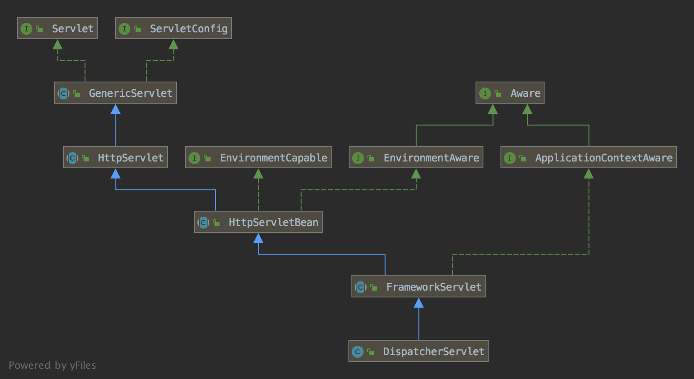
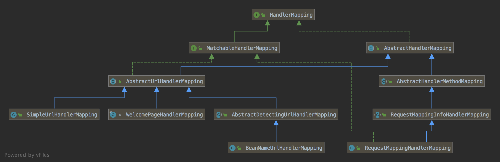
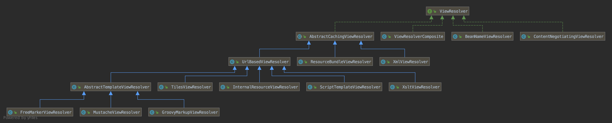

Spring 初始化

### Servlet





### 初始化

1、HttpServletBean 目的是通过  Servlet 的配置可以修改属性

2、FrameworkServlet 初始化了 webApplicationContext

3、DispatcherServlet  初始化 9 大组件。

### 运行态

1、HttpServletBean 没有任何动作

2、FrameworkServlet 请求前后的处理。比如初始化 LocaleContextHolder，RequestContextHolder，发布ServletRequestHandledEvent事件

3、DispatcherServlet 编排9 大组件，处理请求并应答


## 最佳实践

了解了 Spring  MVC 的处理主流程，对业务开发有啥好处呢？

1、善用 HandlerInterceptor，可以在请求前设置一些属性，在 Controller 方便获取。

2、统一异常处理

3、监听事件 ServletRequestHandledEvent 就可以记录接口日志和耗时

4、使用 LocaleContextHolder 可以方便获取 Locale	

5、使用 RequestContextHolder 可以非常方便获取 request，response，sessoin 对象。

6、flashMap 用户解决重定向问题

7、LocalResolve

8、ThemeResolve


常见的误区

1、将 Request 注入

2、在每个接口打印请求日志


## 附录

### 初始化

#### HttpServletBean

```java
public abstract class HttpServletBean extends HttpServlet implements EnvironmentCapable, EnvironmentAware {
	@Nullable
	private ConfigurableEnvironment environment;

	private final Set<String> requiredProperties = new HashSet<>(4);

	protected final void addRequiredProperty(String property) {
		this.requiredProperties.add(property);
	}

	/**
	 * Return the {@link Environment} associated with this servlet.
	 * <p>If none specified, a default environment will be initialized via
	 * {@link #createEnvironment()}.
	 */
	@Override
	public ConfigurableEnvironment getEnvironment() {
		if (this.environment == null) {
			this.environment = createEnvironment();
		}
		return this.environment;
	}


	protected ConfigurableEnvironment createEnvironment() {
		return new StandardServletEnvironment();
	}

	@Override
	public final void init() throws ServletException {
		PropertyValues pvs = new ServletConfigPropertyValues(getServletConfig(), this.requiredProperties);
		if (!pvs.isEmpty()) {
			try {
        // 转换为 BeanWrapper 从而可以被 Spring 的方式进行 init-param 的值注入
				BeanWrapper bw = PropertyAccessorFactory.forBeanPropertyAccess(this);
				ResourceLoader resourceLoader = new ServletContextResourceLoader(getServletContext());
        // 自定义的属性编辑器，遇到 Resource 类型的属性，可以用 ResourceEditor 进行解析
				bw.registerCustomEditor(Resource.class, new ResourceEditor(resourceLoader, getEnvironment()));
				initBeanWrapper(bw);
				bw.setPropertyValues(pvs, true);
			}
		}

		// 子类实现
		initServletBean();
	}


	protected void initBeanWrapper(BeanWrapper bw) throws BeansException {
	}

  // 子类覆写该方法来实现自己的逻辑
	protected void initServletBean() throws ServletException {
	}
}
```


#### FrameworkServlet

```java
public abstract class FrameworkServlet extends HttpServletBean implements ApplicationContextAware {

  // 仅仅初始化了 WebApplicationContext
	@Override
	protected final void initServletBean() throws ServletException {
		try {
      // 初始化 webApplicationContext
			this.webApplicationContext = initWebApplicationContext();
      // 由子类扩展
			initFrameworkServlet();
		}
	}

	protected WebApplicationContext initWebApplicationContext() {
		WebApplicationContext rootContext =
				WebApplicationContextUtils.getWebApplicationContext(getServletContext());
		WebApplicationContext wac = null;

    // 第一种初始化方法
		if (this.webApplicationContext != null) {
			wac = this.webApplicationContext;
			if (wac instanceof ConfigurableWebApplicationContext) {
				ConfigurableWebApplicationContext cwac = (ConfigurableWebApplicationContext) wac;
				if (!cwac.isActive()) {
					if (cwac.getParent() == null) {
						cwac.setParent(rootContext);
					}
					configureAndRefreshWebApplicationContext(cwac);
				}
			}
		}
    // 第二种初始化方法
		if (wac == null) {
			wac = findWebApplicationContext();
		}
    // 第三种初始化方法
		if (wac == null) {
			wac = createWebApplicationContext(rootContext);
		}

		if (!this.refreshEventReceived) {
			synchronized (this.onRefreshMonitor) {
        // 子类自定义
				onRefresh(wac);
			}
		}

		if (this.publishContext) {
			String attrName = getServletContextAttributeName();
			getServletContext().setAttribute(attrName, wac);
		}

		return wac;
	}

	@Nullable
	protected WebApplicationContext findWebApplicationContext() {
		String attrName = getContextAttribute();
		if (attrName == null) {
			return null;
		}
		WebApplicationContext wac =
				WebApplicationContextUtils.getWebApplicationContext(getServletContext(), attrName);
		return wac;
	}

	protected WebApplicationContext createWebApplicationContext(@Nullable ApplicationContext parent) {
		Class<?> contextClass = getContextClass();
    // 反射初始化
		ConfigurableWebApplicationContext wac =
				(ConfigurableWebApplicationContext) BeanUtils.instantiateClass(contextClass);
		wac.setEnvironment(getEnvironment());
		wac.setParent(parent);
		String configLocation = getContextConfigLocation();
		if (configLocation != null) {
			wac.setConfigLocation(configLocation);
		}
		configureAndRefreshWebApplicationContext(wac);
		return wac;
	}

	protected void configureAndRefreshWebApplicationContext(ConfigurableWebApplicationContext wac) {
		if (ObjectUtils.identityToString(wac).equals(wac.getId())) {
			if (this.contextId != null) {
				wac.setId(this.contextId);
			}
			else {
				wac.setId(ConfigurableWebApplicationContext.APPLICATION_CONTEXT_ID_PREFIX +
						ObjectUtils.getDisplayString(getServletContext().getContextPath()) + '/' + getServletName());
			}
		}

		wac.setServletContext(getServletContext());
		wac.setServletConfig(getServletConfig());
		wac.setNamespace(getNamespace());
		wac.addApplicationListener(new SourceFilteringListener(wac, new ContextRefreshListener()));

		ConfigurableEnvironment env = wac.getEnvironment();
		if (env instanceof ConfigurableWebEnvironment) {
			((ConfigurableWebEnvironment) env).initPropertySources(getServletContext(), getServletConfig());
		}

		postProcessWebApplicationContext(wac);
		applyInitializers(wac);
		wac.refresh();
	}  
  
	protected void applyInitializers(ConfigurableApplicationContext wac) {
		String globalClassNames = getServletContext().getInitParameter(ContextLoader.GLOBAL_INITIALIZER_CLASSES_PARAM);
		if (globalClassNames != null) {
			for (String className : StringUtils.tokenizeToStringArray(globalClassNames, INIT_PARAM_DELIMITERS)) {
				this.contextInitializers.add(loadInitializer(className, wac));
			}
		}

		if (this.contextInitializerClasses != null) {
			for (String className : StringUtils.tokenizeToStringArray(this.contextInitializerClasses, INIT_PARAM_DELIMITERS)) {
				this.contextInitializers.add(loadInitializer(className, wac));
			}
		}

		AnnotationAwareOrderComparator.sort(this.contextInitializers);
		for (ApplicationContextInitializer<ConfigurableApplicationContext> initializer : this.contextInitializers) {
			initializer.initialize(wac);
		}
	}

	@SuppressWarnings("unchecked")
	private ApplicationContextInitializer<ConfigurableApplicationContext> loadInitializer(
			String className, ConfigurableApplicationContext wac) {
		try {
			Class<?> initializerClass = ClassUtils.forName(className, wac.getClassLoader());
			Class<?> initializerContextClass =
					GenericTypeResolver.resolveTypeArgument(initializerClass, ApplicationContextInitializer.class);
			return BeanUtils.instantiateClass(initializerClass, ApplicationContextInitializer.class);
		}
	}
  
  protected void onRefresh(ApplicationContext context) {
		// For subclasses: do nothing by default.
	}
}
```


#### DispatcherServlet

```java
public class DispatcherServlet extends FrameworkServlet {
	static {
		// Load default strategy implementations from properties file.
		// This is currently strictly internal and not meant to be customized
		// by application developers.
		try {
			ClassPathResource resource = new ClassPathResource(DEFAULT_STRATEGIES_PATH, DispatcherServlet.class);
			defaultStrategies = PropertiesLoaderUtils.loadProperties(resource);
		}
		catch (IOException ex) {
			throw new IllegalStateException("Could not load '" + DEFAULT_STRATEGIES_PATH + "': " + ex.getMessage());
		}
	}
	
  protected void initStrategies(ApplicationContext context) {
    this.initMultipartResolver(context);
    this.initLocaleResolver(context);
    this.initThemeResolver(context);
    this.initHandlerMappings(context);
    this.initHandlerAdapters(context);
    this.initHandlerExceptionResolvers(context);
    this.initRequestToViewNameTranslator(context);
    this.initViewResolvers(context);
    this.initFlashMapManager(context);
  }
	
	private void initMultipartResolver(ApplicationContext context) {
		this.multipartResolver = context.getBean(MULTIPART_RESOLVER_BEAN_NAME, MultipartResolver.class);
	}
  
  private void initLocaleResolver(ApplicationContext context) {
		this.localeResolver = context.getBean(LOCALE_RESOLVER_BEAN_NAME, LocaleResolver.class);
	}
	
	private void initThemeResolver(ApplicationContext context) {
		this.themeResolver = context.getBean(THEME_RESOLVER_BEAN_NAME, ThemeResolver.class);
	}
	
	private void initHandlerMappings(ApplicationContext context) {
		this.handlerMappings = null;

		if (this.detectAllHandlerMappings) {
			// Find all HandlerMappings in the ApplicationContext, including ancestor contexts.
			Map<String, HandlerMapping> matchingBeans =
					BeanFactoryUtils.beansOfTypeIncludingAncestors(context, HandlerMapping.class, true, false);
			if (!matchingBeans.isEmpty()) {
				this.handlerMappings = new ArrayList<>(matchingBeans.values());
				// We keep HandlerMappings in sorted order.
				AnnotationAwareOrderComparator.sort(this.handlerMappings);
			}
		}
		else {
			try {
				HandlerMapping hm = context.getBean(HANDLER_MAPPING_BEAN_NAME, HandlerMapping.class);
				this.handlerMappings = Collections.singletonList(hm);
			}
			catch (NoSuchBeanDefinitionException ex) {
				// Ignore, we'll add a default HandlerMapping later.
			}
		}

		// Ensure we have at least one HandlerMapping, by registering
		// a default HandlerMapping if no other mappings are found.
		if (this.handlerMappings == null) {
			this.handlerMappings = getDefaultStrategies(context, HandlerMapping.class);
			if (logger.isTraceEnabled()) {
				logger.trace("No HandlerMappings declared for servlet '" + getServletName() +
						"': using default strategies from DispatcherServlet.properties");
			}
		}
	}
  
	private void initHandlerAdapters(ApplicationContext context) {
		this.handlerAdapters = null;

		if (this.detectAllHandlerAdapters) {
			// Find all HandlerAdapters in the ApplicationContext, including ancestor contexts.
			Map<String, HandlerAdapter> matchingBeans =
					BeanFactoryUtils.beansOfTypeIncludingAncestors(context, HandlerAdapter.class, true, false);
			if (!matchingBeans.isEmpty()) {
				this.handlerAdapters = new ArrayList<>(matchingBeans.values());
				// We keep HandlerAdapters in sorted order.
				AnnotationAwareOrderComparator.sort(this.handlerAdapters);
			}
		}
		else {
			try {
				HandlerAdapter ha = context.getBean(HANDLER_ADAPTER_BEAN_NAME, HandlerAdapter.class);
				this.handlerAdapters = Collections.singletonList(ha);
			}
			catch (NoSuchBeanDefinitionException ex) {
				// Ignore, we'll add a default HandlerAdapter later.
			}
		}

		// Ensure we have at least some HandlerAdapters, by registering
		// default HandlerAdapters if no other adapters are found.
		if (this.handlerAdapters == null) {
			this.handlerAdapters = getDefaultStrategies(context, HandlerAdapter.class);
			if (logger.isTraceEnabled()) {
				logger.trace("No HandlerAdapters declared for servlet '" + getServletName() +
						"': using default strategies from DispatcherServlet.properties");
			}
		}
	}
  
	private void initHandlerExceptionResolvers(ApplicationContext context) {
		this.handlerExceptionResolvers = null;

		if (this.detectAllHandlerExceptionResolvers) {
			// Find all HandlerExceptionResolvers in the ApplicationContext, including ancestor contexts.
			Map<String, HandlerExceptionResolver> matchingBeans = BeanFactoryUtils
					.beansOfTypeIncludingAncestors(context, HandlerExceptionResolver.class, true, false);
			if (!matchingBeans.isEmpty()) {
				this.handlerExceptionResolvers = new ArrayList<>(matchingBeans.values());
				// We keep HandlerExceptionResolvers in sorted order.
				AnnotationAwareOrderComparator.sort(this.handlerExceptionResolvers);
			}
		}
		else {
			try {
				HandlerExceptionResolver her =
						context.getBean(HANDLER_EXCEPTION_RESOLVER_BEAN_NAME, HandlerExceptionResolver.class);
				this.handlerExceptionResolvers = Collections.singletonList(her);
			}
			catch (NoSuchBeanDefinitionException ex) {
				// Ignore, no HandlerExceptionResolver is fine too.
			}
		}

		// Ensure we have at least some HandlerExceptionResolvers, by registering
		// default HandlerExceptionResolvers if no other resolvers are found.
		if (this.handlerExceptionResolvers == null) {
			this.handlerExceptionResolvers = getDefaultStrategies(context, HandlerExceptionResolver.class);
			if (logger.isTraceEnabled()) {
				logger.trace("No HandlerExceptionResolvers declared in servlet '" + getServletName() +
						"': using default strategies from DispatcherServlet.properties");
			}
		}
	}
  
	private void initRequestToViewNameTranslator(ApplicationContext context) {
		this.viewNameTranslator =
					context.getBean(REQUEST_TO_VIEW_NAME_TRANSLATOR_BEAN_NAME, RequestToViewNameTranslator.class);
	}

 	private void initViewResolvers(ApplicationContext context) {
		this.viewResolvers = null;

		if (this.detectAllViewResolvers) {
			// Find all ViewResolvers in the ApplicationContext, including ancestor contexts.
			Map<String, ViewResolver> matchingBeans =
					BeanFactoryUtils.beansOfTypeIncludingAncestors(context, ViewResolver.class, true, false);
			if (!matchingBeans.isEmpty()) {
				this.viewResolvers = new ArrayList<>(matchingBeans.values());
				// We keep ViewResolvers in sorted order.
				AnnotationAwareOrderComparator.sort(this.viewResolvers);
			}
		}
		else {
			try {
				ViewResolver vr = context.getBean(VIEW_RESOLVER_BEAN_NAME, ViewResolver.class);
				this.viewResolvers = Collections.singletonList(vr);
			}
			catch (NoSuchBeanDefinitionException ex) {
				// Ignore, we'll add a default ViewResolver later.
			}
		}

		// Ensure we have at least one ViewResolver, by registering
		// a default ViewResolver if no other resolvers are found.
		if (this.viewResolvers == null) {
			this.viewResolvers = getDefaultStrategies(context, ViewResolver.class);
			if (logger.isTraceEnabled()) {
				logger.trace("No ViewResolvers declared for servlet '" + getServletName() +
						"': using default strategies from DispatcherServlet.properties");
			}
		}
	}

	private void initFlashMapManager(ApplicationContext context) {
		this.flashMapManager = context.getBean(FLASH_MAP_MANAGER_BEAN_NAME, FlashMapManager.class);
	}

	protected <T> T getDefaultStrategy(ApplicationContext context, Class<T> strategyInterface) {
		List<T> strategies = getDefaultStrategies(context, strategyInterface);
		if (strategies.size() != 1) {
			throw new BeanInitializationException(
					"DispatcherServlet needs exactly 1 strategy for interface [" + strategyInterface.getName() + "]");
		}
		return strategies.get(0);
	}

	@SuppressWarnings("unchecked")
	protected <T> List<T> getDefaultStrategies(ApplicationContext context, Class<T> strategyInterface) {
		String key = strategyInterface.getName();
		String value = defaultStrategies.getProperty(key);
		if (value != null) {
			String[] classNames = StringUtils.commaDelimitedListToStringArray(value);
			List<T> strategies = new ArrayList<>(classNames.length);
			for (String className : classNames) {
				try {
					Class<?> clazz = ClassUtils.forName(className, DispatcherServlet.class.getClassLoader());
					Object strategy = createDefaultStrategy(context, clazz);
					strategies.add((T) strategy);
				}
				catch (ClassNotFoundException ex) {
					throw new BeanInitializationException(
							"Could not find DispatcherServlet's default strategy class [" + className +
							"] for interface [" + key + "]", ex);
				}
				catch (LinkageError err) {
					throw new BeanInitializationException(
							"Unresolvable class definition for DispatcherServlet's default strategy class [" +
							className + "] for interface [" + key + "]", err);
				}
			}
			return strategies;
		}
		else {
			return new LinkedList<>();
		}
	}
  
	protected Object createDefaultStrategy(ApplicationContext context, Class<?> clazz) {
		return context.getAutowireCapableBeanFactory().createBean(clazz);
	}
}
```


### 运行态

#### HttpServlet.java

```java
public abstract class HttpServlet extends GenericServlet {
    private static final long serialVersionUID = 1L;
    private static final String METHOD_DELETE = "DELETE";
    private static final String METHOD_HEAD = "HEAD";
    private static final String METHOD_GET = "GET";
    private static final String METHOD_OPTIONS = "OPTIONS";
    private static final String METHOD_POST = "POST";
    private static final String METHOD_PUT = "PUT";
    private static final String METHOD_TRACE = "TRACE";
    private static final String HEADER_IFMODSINCE = "If-Modified-Since";
    private static final String HEADER_LASTMOD = "Last-Modified";
    private static final String LSTRING_FILE = "javax.servlet.http.LocalStrings";
    private static final ResourceBundle lStrings = ResourceBundle.getBundle("javax.servlet.http.LocalStrings");

    public HttpServlet() {
    }

    protected void service(HttpServletRequest req, HttpServletResponse resp) throws ServletException, IOException {
        String method = req.getMethod();
        long lastModified;
        if (method.equals("GET")) {
            lastModified = this.getLastModified(req);
            if (lastModified == -1L) {
                this.doGet(req, resp);
            } else {
                long ifModifiedSince;
                try {
                    ifModifiedSince = req.getDateHeader("If-Modified-Since");
                } catch (IllegalArgumentException var9) {
                    ifModifiedSince = -1L;
                }

                if (ifModifiedSince < lastModified / 1000L * 1000L) {
                    this.maybeSetLastModified(resp, lastModified);
                    this.doGet(req, resp);
                } else {
                    resp.setStatus(304);
                }
            }
        } else if (method.equals("HEAD")) {
            lastModified = this.getLastModified(req);
            this.maybeSetLastModified(resp, lastModified);
            this.doHead(req, resp);
        } else if (method.equals("POST")) {
            this.doPost(req, resp);
        } else if (method.equals("PUT")) {
            this.doPut(req, resp);
        } else if (method.equals("DELETE")) {
            this.doDelete(req, resp);
        } else if (method.equals("OPTIONS")) {
            this.doOptions(req, resp);
        } else if (method.equals("TRACE")) {
            this.doTrace(req, resp);
        } else {
            String errMsg = lStrings.getString("http.method_not_implemented");
            Object[] errArgs = new Object[]{method};
            errMsg = MessageFormat.format(errMsg, errArgs);
            resp.sendError(501, errMsg);
        }
    }

    public void service(ServletRequest req, ServletResponse res) throws ServletException, IOException {
        HttpServletRequest request;
        HttpServletResponse response;
        try {
            request = (HttpServletRequest)req;
            response = (HttpServletResponse)res;
        } catch (ClassCastException var6) {
            throw new ServletException(lStrings.getString("http.non_http"));
        }
        this.service(request, response);
    }
}
```

##### 执行流程

1、一个默认的实现

#### FrameworkServlet

```java
public abstract class FrameworkServlet extends HttpServletBean implements ApplicationContextAware {

	@Override
	protected void service(HttpServletRequest request, HttpServletResponse response)
			throws ServletException, IOException {

		HttpMethod httpMethod = HttpMethod.resolve(request.getMethod());
		if (httpMethod == HttpMethod.PATCH || httpMethod == null) {
			processRequest(request, response);
		}
		else {
			super.service(request, response);
		}
	}
  
	protected final void processRequest(HttpServletRequest request, HttpServletResponse response)
			throws ServletException, IOException {

		long startTime = System.currentTimeMillis();
		Throwable failureCause = null;

		LocaleContext previousLocaleContext = LocaleContextHolder.getLocaleContext();
		LocaleContext localeContext = buildLocaleContext(request);

		RequestAttributes previousAttributes = RequestContextHolder.getRequestAttributes();
		ServletRequestAttributes requestAttributes = buildRequestAttributes(request, response, previousAttributes);

		WebAsyncManager asyncManager = WebAsyncUtils.getAsyncManager(request);
		asyncManager.registerCallableInterceptor(FrameworkServlet.class.getName(), new RequestBindingInterceptor());

		initContextHolders(request, localeContext, requestAttributes);

		try {
			doService(request, response);
		}
		catch (ServletException | IOException ex) {
			failureCause = ex;
			throw ex;
		}
		catch (Throwable ex) {
			failureCause = ex;
			throw new NestedServletException("Request processing failed", ex);
		}

		finally {
			resetContextHolders(request, previousLocaleContext, previousAttributes);
			if (requestAttributes != null) {
				requestAttributes.requestCompleted();
			}
			logResult(request, response, failureCause, asyncManager);
			publishRequestHandledEvent(request, response, startTime, failureCause);
		}
	}

	protected abstract void doService(HttpServletRequest request, HttpServletResponse response)
			throws Exception;
}
```

##### 执行流程

1、请求前的处理

2、请求处理（由子类实现）

3、请求后的处理

#### DispatcherServlet

```java
public class DispatcherServlet extends FrameworkServlet {

	@Override
	protected void doService(HttpServletRequest request, HttpServletResponse response) throws Exception {
		Map<String, Object> attributesSnapshot = null;
		if (WebUtils.isIncludeRequest(request)) {
			attributesSnapshot = new HashMap<>();
			Enumeration<?> attrNames = request.getAttributeNames();
			while (attrNames.hasMoreElements()) {
				String attrName = (String) attrNames.nextElement();
				if (this.cleanupAfterInclude || attrName.startsWith(DEFAULT_STRATEGIES_PREFIX)) {
					attributesSnapshot.put(attrName, request.getAttribute(attrName));
				}
			}
		}

		// Make framework objects available to handlers and view objects.
		request.setAttribute(WEB_APPLICATION_CONTEXT_ATTRIBUTE, getWebApplicationContext());
		request.setAttribute(LOCALE_RESOLVER_ATTRIBUTE, this.localeResolver);
		request.setAttribute(THEME_RESOLVER_ATTRIBUTE, this.themeResolver);
		request.setAttribute(THEME_SOURCE_ATTRIBUTE, getThemeSource());

		if (this.flashMapManager != null) {
			FlashMap inputFlashMap = this.flashMapManager.retrieveAndUpdate(request, response);
			if (inputFlashMap != null) {
				request.setAttribute(INPUT_FLASH_MAP_ATTRIBUTE, Collections.unmodifiableMap(inputFlashMap));
			}
			request.setAttribute(OUTPUT_FLASH_MAP_ATTRIBUTE, new FlashMap());
			request.setAttribute(FLASH_MAP_MANAGER_ATTRIBUTE, this.flashMapManager);
		}

		try {
			doDispatch(request, response);
		}
		finally {
			if (!WebAsyncUtils.getAsyncManager(request).isConcurrentHandlingStarted()) {
				// Restore the original attribute snapshot, in case of an include.
				if (attributesSnapshot != null) {
					restoreAttributesAfterInclude(request, attributesSnapshot);
				}
			}
		}
	}
	
	protected void doDispatch(HttpServletRequest request, HttpServletResponse response) throws Exception {
		HttpServletRequest processedRequest = request;
		HandlerExecutionChain mappedHandler = null;
		boolean multipartRequestParsed = false;

		WebAsyncManager asyncManager = WebAsyncUtils.getAsyncManager(request);

		try {
			ModelAndView mv = null;
			Exception dispatchException = null;

			try {
				processedRequest = checkMultipart(request);
				multipartRequestParsed = (processedRequest != request);

				// 1. 根据 HttpServletRequest 找到 HandlerExecutionChain
				mappedHandler = getHandler(processedRequest);
				if (mappedHandler == null) {
					noHandlerFound(processedRequest, response);
					return;
				}

				// 2. 根据 HandlerExecutionChain 找到对应的 HandlerAdapter
				HandlerAdapter ha = getHandlerAdapter(mappedHandler.getHandler());

				// Process last-modified header, if supported by the handler.
				String method = request.getMethod();
				boolean isGet = "GET".equals(method);
				if (isGet || "HEAD".equals(method)) {
					long lastModified = ha.getLastModified(request, mappedHandler.getHandler());
					if (new ServletWebRequest(request, response).checkNotModified(lastModified) && isGet) {
						return;
					}
				}
        // 3. 请求处理前的操作
				if (!mappedHandler.applyPreHandle(processedRequest, response)) {
					return;
				}

				// 4. 事实的 Handler
				mv = ha.handle(processedRequest, response, mappedHandler.getHandler());

				if (asyncManager.isConcurrentHandlingStarted()) {
					return;
				}

        // 5. 请求后的处理
				applyDefaultViewName(processedRequest, mv);
				mappedHandler.applyPostHandle(processedRequest, response, mv);
			}
			catch (Exception ex) {
				dispatchException = ex;
			}
			catch (Throwable err) {
				// As of 4.3, we're processing Errors thrown from handler methods as well,
				// making them available for @ExceptionHandler methods and other scenarios.
				dispatchException = new NestedServletException("Handler dispatch failed", err);
			}
			processDispatchResult(processedRequest, response, mappedHandler, mv, dispatchException);
		}
		catch (Exception ex) {
			triggerAfterCompletion(processedRequest, response, mappedHandler, ex);
		}
		catch (Throwable err) {
			triggerAfterCompletion(processedRequest, response, mappedHandler,
					new NestedServletException("Handler processing failed", err));
		}
		finally {
			if (asyncManager.isConcurrentHandlingStarted()) {
				// Instead of postHandle and afterCompletion
				if (mappedHandler != null) {
					mappedHandler.applyAfterConcurrentHandlingStarted(processedRequest, response);
				}
			}
			else {
				// Clean up any resources used by a multipart request.
				if (multipartRequestParsed) {
					cleanupMultipart(processedRequest);
				}
			}
		}
	}	
	
}
```

##### 执行流程

1. 用户请求发送到前端控制器DispatcherServlet。
2. 前端控制器DispatcherServlet接收到请求后，DispatcherServlet会使用HandlerMapping来处理，HandlerMapping会查找到具体进行处理请求的Handler对象。
3. HandlerMapping找到对应的Handler之后，并不是返回一个Handler原始对象，而是一个Handler执行链，在这个执行链中包括了拦截器和处理请求的Handler。HandlerMapping返回一个执行链给DispatcherServlet。
4. DispatcherServlet接收到执行链之后，会调用Handler适配器去执行Handler。
5. Handler适配器执行完成Handler（也就是我们写的Controller）之后会得到一个ModelAndView，并返回给DispatcherServlet。
6. DispatcherServlet接收到Handler适配器返回的ModelAndView之后，会根据其中的视图名调用视图解析器。
7. 视图解析器根据逻辑视图名解析成一个真正的View视图，并返回给DispatcherServlet。
8. DispatcherServlet接收到视图之后，会根据上面的ModelAndView中的model来进行视图中数据的填充，也就是所谓的视图渲染。
9. 渲染完成之后，DispatcherServlet就可以将结果返回给用户了。


#### HandlerExecutionChain

```java
    boolean applyPreHandle(HttpServletRequest request, HttpServletResponse response) throws Exception {
        HandlerInterceptor[] interceptors = this.getInterceptors();
        if (!ObjectUtils.isEmpty(interceptors)) {
            for(int i = 0; i < interceptors.length; this.interceptorIndex = i++) {
                HandlerInterceptor interceptor = interceptors[i];
                if (!interceptor.preHandle(request, response, this.handler)) {
                    this.triggerAfterCompletion(request, response, (Exception)null);
                    return false;
                }
            }
        }

        return true;
    }

    void applyPostHandle(HttpServletRequest request, HttpServletResponse response, @Nullable ModelAndView mv) throws Exception {
        HandlerInterceptor[] interceptors = this.getInterceptors();
        if (!ObjectUtils.isEmpty(interceptors)) {
            for(int i = interceptors.length - 1; i >= 0; --i) {
                HandlerInterceptor interceptor = interceptors[i];
                interceptor.postHandle(request, response, this.handler, mv);
            }
        }

    }
```


#### [HandleMapping](spring-handlemapping.md)

将 HttpServletRequest 转换为 HandlerExecutionChain，其中 HandlerExecutionChain 包括 Handler 和 Interceptor



```java
	protected HandlerExecutionChain getHandler(HttpServletRequest request) throws Exception {
		if (this.handlerMappings != null) {
			for (HandlerMapping mapping : this.handlerMappings) {
				HandlerExecutionChain handler = mapping.getHandler(request);
				if (handler != null) {
					return handler;
				}
			}
		}
		return null;
	}
```


#### ModelAndView




如果没有 view，创建默认的 ViewName

```java
private void applyDefaultViewName(HttpServletRequest request, @Nullable ModelAndView mv) throws Exception {
    if (mv != null && !mv.hasView()) {
        String defaultViewName = this.getDefaultViewName(request);
        if (defaultViewName != null) {
            mv.setViewName(defaultViewName);
        }
    }

}
```


```java
   private void processDispatchResult(HttpServletRequest request, HttpServletResponse response, @Nullable HandlerExecutionChain mappedHandler, @Nullable ModelAndView mv, @Nullable Exception exception) throws Exception {
        boolean errorView = false;

        if (mv != null && !mv.wasCleared()) {
            //渲染
            this.render(mv, request, response);
            if (errorView) {
                WebUtils.clearErrorRequestAttributes(request);
            }
        } else if (this.logger.isTraceEnabled()) {
            this.logger.trace("No view rendering, null ModelAndView returned.");
        }

        if (!WebAsyncUtils.getAsyncManager(request).isConcurrentHandlingStarted()) {
            if (mappedHandler != null) {
                mappedHandler.triggerAfterCompletion(request, response, (Exception)null);
            }

        }
    }

   protected void render(ModelAndView mv, HttpServletRequest request, HttpServletResponse response) throws Exception {
        Locale locale = this.localeResolver != null ? this.localeResolver.resolveLocale(request) : request.getLocale();
        response.setLocale(locale);
        String viewName = mv.getViewName();
        View view;
        if (viewName != null) {
            view = this.resolveViewName(viewName, mv.getModelInternal(), locale, request);
            if (view == null) {
                throw new ServletException("Could not resolve view with name '" + mv.getViewName() + "' in servlet with name '" + this.getServletName() + "'");
            }
        } else {
            view = mv.getView();
            if (view == null) {
                throw new ServletException("ModelAndView [" + mv + "] neither contains a view name nor a View object in servlet with name '" + this.getServletName() + "'");
            }
        }

        try {
            if (mv.getStatus() != null) {
                response.setStatus(mv.getStatus().value());
            }

            view.render(mv.getModelInternal(), request, response);
        } catch (Exception var8) {
            if (this.logger.isDebugEnabled()) {
                this.logger.debug("Error rendering view [" + view + "]", var8);
            }

            throw var8;
        }
    }
```


AbstractCachingViewResolver

```java
	@Override
	@Nullable
	public View resolveViewName(String viewName, Locale locale) throws Exception {
		if (!isCache()) {
			return createView(viewName, locale);
		}
		else {
			Object cacheKey = getCacheKey(viewName, locale);
			View view = this.viewAccessCache.get(cacheKey);
			if (view == null) {
				synchronized (this.viewCreationCache) {
					view = this.viewCreationCache.get(cacheKey);
					if (view == null) {
						// Ask the subclass to create the View object.
						view = createView(viewName, locale);
						if (view == null && this.cacheUnresolved) {
							view = UNRESOLVED_VIEW;
						}
						if (view != null) {
							this.viewAccessCache.put(cacheKey, view);
							this.viewCreationCache.put(cacheKey, view);
						}
					}
				}
			}
			else {
				if (logger.isTraceEnabled()) {
					logger.trace(formatKey(cacheKey) + "served from cache");
				}
			}
			return (view != UNRESOLVED_VIEW ? view : null);
		}
	}

	@Nullable
	protected View createView(String viewName, Locale locale) throws Exception {
		return loadView(viewName, locale);
	}

	protected abstract View loadView(String viewName, Locale locale) throws Exception;
```


UrlBasedViewResolver

```java
	@Override
	protected View createView(String viewName, Locale locale) throws Exception {
		// If this resolver is not supposed to handle the given view,
		// return null to pass on to the next resolver in the chain.
		if (!canHandle(viewName, locale)) {
			return null;
		}

		//  如果以 redirect: 开头，那么重定向
		if (viewName.startsWith(REDIRECT_URL_PREFIX)) {
			String redirectUrl = viewName.substring(REDIRECT_URL_PREFIX.length());
			RedirectView view = new RedirectView(redirectUrl,
					isRedirectContextRelative(), isRedirectHttp10Compatible());
			String[] hosts = getRedirectHosts();
			if (hosts != null) {
				view.setHosts(hosts);
			}
			return applyLifecycleMethods(REDIRECT_URL_PREFIX, view);
		}

		// 如果以 forward 开头，那么转发
		if (viewName.startsWith(FORWARD_URL_PREFIX)) {
			String forwardUrl = viewName.substring(FORWARD_URL_PREFIX.length());
			InternalResourceView view = new InternalResourceView(forwardUrl);
			return applyLifecycleMethods(FORWARD_URL_PREFIX, view);
		}

		// Else fall back to superclass implementation: calling loadView.
		return super.createView(viewName, locale);
	}

	protected boolean canHandle(String viewName, Locale locale) {
		String[] viewNames = getViewNames();
		return (viewNames == null || PatternMatchUtils.simpleMatch(viewNames, viewName));
	}

	protected View applyLifecycleMethods(String viewName, AbstractUrlBasedView view) {
		ApplicationContext context = getApplicationContext();
		if (context != null) {
			Object initialized = context.getAutowireCapableBeanFactory().initializeBean(view, viewName);
			if (initialized instanceof View) {
				return (View) initialized;
			}
		}
		return view;
	}

	@Override
	protected View loadView(String viewName, Locale locale) throws Exception {
		AbstractUrlBasedView view = buildView(viewName);
		View result = applyLifecycleMethods(viewName, view);
		return (view.checkResource(locale) ? result : null);
	}

```

