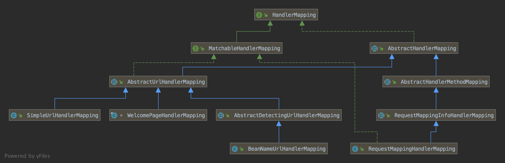

spring-handermapping


基于 spring 5.2.5.RELEASE


问题

1、拦截器有哪些类型？

3、如何实现可扩展的方式初始化拦截器

3、如何实现可扩展的方式初始化 Handler

### 接口

```java
public interface HandlerMapping {
  HandlerExecutionChain getHandler(HttpServletRequest request) throws Exception;
}

public class HandlerExecutionChain {
  // 核心属性一、Handler
	private final Object handler;

  // 由interceptorList转换而来
	private HandlerInterceptor[] interceptors;

  // 核心属性二、拦截器
	private List<HandlerInterceptor> interceptorList;

	private int interceptorIndex = -1;
}
```

从接口来看，HandlerMapping 的职责很明确，将 HttpServletRequest 转换为 HandlerExecutionChain。其中HandlerExecutionChain 包含两部分

1、Handler

2、interceptorList

因此，本质是初始化 Handler 和 Interceptors

作为框架从设计的角度思考，Handler 和 Interceptors 都应该是可扩展的。那么，Spring 是如何实现的呢？


**Handler 的可扩展性设计**

Handler 的作用是进行请求的处理，有且只有一个。

可扩展性包括

1、构造函数参数

2、默认实现

3、暴露接口（getHandlerInternal）给子类去实现自己的 Handler，如果没有找到就使用 默认的 Handler


**如何初始化 Handler**

1、解析出 Request 的 url，遍历 urlPattern 找到匹配的 Handler


**如何初始化 Interceptors**

参考Interceptors 的可扩展性设计


**Interceptors 的可扩展性设计**

Interceptors 作用是handler 处理前和处理后进行一些处理，其实也是 Handler 的一种可扩展性体现

1、构造函数参数

2、通过扫描 Bean 的方式

3、通过暴露接口（extendInterceptors）方式

4、通过方法（setInterceptors）的方式


### 结构




### 原理

优先级


#### AbstractHandlerMapping

```java
public abstract class AbstractHandlerMapping extends WebApplicationObjectSupport
		implements HandlerMapping, Ordered, BeanNameAware {
  // Handler可扩展性2：默认处理
	private Object defaultHandler;

  // url 匹配
	private UrlPathHelper urlPathHelper = new UrlPathHelper();

  // 路径匹配，默认是 ANT 语法
	private PathMatcher pathMatcher = new AntPathMatcher();

	private final List<Object> interceptors = new ArrayList<>();

  // 保存所有的拦截器
	private final List<HandlerInterceptor> adaptedInterceptors = new ArrayList<>();
	
	private int order = Ordered.LOWEST_PRECEDENCE;

	@Override
	protected void initApplicationContext() throws BeansException {
		extendInterceptors(this.interceptors);
		detectMappedInterceptors(this.adaptedInterceptors);
		initInterceptors();
	}
  
  // Interceptors可扩展性2：暴露接口
  protected void extendInterceptors(List<Object> interceptors) {
	}
	
  // Interceptors可扩展性3：找到所有 MappedInterceptor 类型的 Bean
	protected void detectMappedInterceptors(List<HandlerInterceptor> mappedInterceptors) {
		mappedInterceptors.addAll(
				BeanFactoryUtils.beansOfTypeIncludingAncestors(
						obtainApplicationContext(), MappedInterceptor.class, true, false).values());
	}
	
	protected void initInterceptors() {
		if (!this.interceptors.isEmpty()) {
			for (int i = 0	; i < this.interceptors.size(); i++) {
				Object interceptor = this.interceptors.get(i);
				if (interceptor == null) {
					throw new IllegalArgumentException("Entry number " + i + " in interceptors array is null");
				}
				this.adaptedInterceptors.add(adaptInterceptor(interceptor));
			}
		}
	}
	
	@Override
	@Nullable
	public final HandlerExecutionChain getHandler(HttpServletRequest request) throws Exception {
		Object handler = getHandlerInternal(request);
		if (handler == null) {
			handler = getDefaultHandler();
		}
		if (handler == null) {
			return null;
		}
		// 如果handler 为 String，找到对应的 Bean
		if (handler instanceof String) {
			String handlerName = (String) handler;
			handler = obtainApplicationContext().getBean(handlerName);
		}
		HandlerExecutionChain executionChain = getHandlerExecutionChain(handler, request);
		return executionChain;
	}
  
  // Handler可扩展性3：通过暴露 getHandlerInternal
  protected abstract Object getHandlerInternal(HttpServletRequest request) throws Exception;
	
	protected HandlerExecutionChain getHandlerExecutionChain(Object handler, HttpServletRequest request) {
		HandlerExecutionChain chain = (handler instanceof HandlerExecutionChain ?
				(HandlerExecutionChain) handler : new HandlerExecutionChain(handler));
    // 找到路径
		String lookupPath = this.urlPathHelper.getLookupPathForRequest(request, LOOKUP_PATH);
		for (HandlerInterceptor interceptor : this.adaptedInterceptors) {
      // MappedInterceptor 类型的拦截器
			if (interceptor instanceof MappedInterceptor) {
				MappedInterceptor mappedInterceptor = (MappedInterceptor) interceptor;
				// 检查 mappedInterceptor 是否与 lookupPath 匹配
				if (mappedInterceptor.matches(lookupPath, this.pathMatcher)) {
					chain.addInterceptor(mappedInterceptor.getInterceptor());
				}
			}
			else {
				chain.addInterceptor(interceptor);
			}
		}
		return chain;
	}
  
  // Interceptors可扩展性4：通过方法 setInterceptors
  public void setInterceptors(Object... interceptors) {
		this.interceptors.addAll(Arrays.asList(interceptors));
	}
}
```


**如何初始化Handler**

Handler 实现优先使用子类的 Handler，找不到使用默认的 Handler。

**如何初始化 Interceptors**

Interceptors 包括两部分：

1、HandlerInterceptor：所有请求通用的；

2、MappedInterceptor 与具体 url 匹配才使用的。

**Interceptors的扩展性设计**

​      1）通过找到实现 MappedInterceptor

​      2）通过 setInterceptors

​      3）通过实现 extendInterceptors 


#### AbstractUrlHandlerMapping

每个请求进来，都需要找到对应的 Handler，最直观的方法是根据 url 找到对应的 handler。那么 url 和 hander 的映射关系（handlerMap）怎么初始化呢？

1、通过扫描所有的 Bean

2、手动指定

另外，每个请求的 url 可能与 已经注册的 handerMap 的多个匹配，这个时候就需要找最佳匹配。

基于以上思考，我们看下 AbstractUrlHandlerMapping 及其子类是如何实现的


问题：

1、如何初始化 handlerMap?  registerHandler

2、url 可以与多个 urlpattern 匹配，如何解决？ 遍历

3、如果 urlPattern 中包含变量如何解决？ 设置 request 属性

```java
public abstract class AbstractUrlHandlerMapping extends AbstractHandlerMapping implements MatchableHandlerMapping {

  // 注册 url 和 Handler
  protected void registerHandler(String[] urlPaths, String beanName) throws BeansException, IllegalStateException {
		Assert.notNull(urlPaths, "URL path array must not be null");
		for (String urlPath : urlPaths) {
			registerHandler(urlPath, beanName);
		}
	}
  
  protected void registerHandler(String urlPath, Object handler) throws BeansException, IllegalStateException {
		Object resolvedHandler = handler;
		if (!this.lazyInitHandlers && handler instanceof String) {
			String handlerName = (String) handler;
			ApplicationContext applicationContext = obtainApplicationContext();
			if (applicationContext.isSingleton(handlerName)) {
				resolvedHandler = applicationContext.getBean(handlerName);
			}
		}

		Object mappedHandler = this.handlerMap.get(urlPath);
		if (mappedHandler != null) {
			if (mappedHandler != resolvedHandler) {
				throw new IllegalStateException(
						"Cannot map " + getHandlerDescription(handler) + " to URL path [" + urlPath +
						"]: There is already " + getHandlerDescription(mappedHandler) + " mapped.");
			}
		}
		else {
      // 初始化 RootHandler
			if (urlPath.equals("/")) {
				setRootHandler(resolvedHandler);
			}
      // 初始化 defaultHandler
			else if (urlPath.equals("/*")) {
				setDefaultHandler(resolvedHandler);
			}
      // 初始化其他 Handler
			else {
				this.handlerMap.put(urlPath, resolvedHandler);
			}
		}
	}
	
  protected Object getHandlerInternal(HttpServletRequest request) throws Exception {
		String lookupPath = getUrlPathHelper().getLookupPathForRequest(request);
		request.setAttribute(LOOKUP_PATH, lookupPath);
		Object handler = lookupHandler(lookupPath, request);
		if (handler == null) {
			Object rawHandler = null;
			if ("/".equals(lookupPath)) {
				rawHandler = getRootHandler();
			}
			if (rawHandler == null) {
				rawHandler = getDefaultHandler();
			}
			if (rawHandler != null) {
				if (rawHandler instanceof String) {
					String handlerName = (String) rawHandler;
					rawHandler = obtainApplicationContext().getBean(handlerName);
				}
				validateHandler(rawHandler, request);
				handler = buildPathExposingHandler(rawHandler, lookupPath, lookupPath, null);
			}
		}
		return handler;
	}
  
	protected Object lookupHandler(String urlPath, HttpServletRequest request) throws Exception {
		//情况一、url直接匹配
		Object handler = this.handlerMap.get(urlPath);
		if (handler != null) {
			// Bean name or resolved handler?
			if (handler instanceof String) {
				String handlerName = (String) handler;
				handler = obtainApplicationContext().getBean(handlerName);
			}
			validateHandler(handler, request);
			return buildPathExposingHandler(handler, urlPath, urlPath, null);
		}

		//情况二、无法直接匹配，通过遍历所有的 urlPattern 检查是否匹配，有多个满足条件的urlPattern，找到最佳匹配
		List<String> matchingPatterns = new ArrayList<>();
		for (String registeredPattern : this.handlerMap.keySet()) {
			if (getPathMatcher().match(registeredPattern, urlPath)) {
				matchingPatterns.add(registeredPattern);
			}
			else if (useTrailingSlashMatch()) {
				if (!registeredPattern.endsWith("/") && getPathMatcher().match(registeredPattern + "/", urlPath)) {
					matchingPatterns.add(registeredPattern + "/");
				}
			}
		}

		String bestMatch = null;
		Comparator<String> patternComparator = getPathMatcher().getPatternComparator(urlPath);
		if (!matchingPatterns.isEmpty()) {
			matchingPatterns.sort(patternComparator);
			bestMatch = matchingPatterns.get(0);
		}
		if (bestMatch != null) {
			handler = this.handlerMap.get(bestMatch);
			if (handler == null) {
				if (bestMatch.endsWith("/")) {
					handler = this.handlerMap.get(bestMatch.substring(0, bestMatch.length() - 1));
				}
				if (handler == null) {
					throw new IllegalStateException(
							"Could not find handler for best pattern match [" + bestMatch + "]");
				}
			}
      // String 转换为 Bean
			if (handler instanceof String) {
				String handlerName = (String) handler;
				handler = obtainApplicationContext().getBean(handlerName);
			}
			validateHandler(handler, request);
			String pathWithinMapping = getPathMatcher().extractPathWithinPattern(bestMatch, urlPath);

			Map<String, String> uriTemplateVariables = new LinkedHashMap<>();
			for (String matchingPattern : matchingPatterns) {
				if (patternComparator.compare(bestMatch, matchingPattern) == 0) {
					Map<String, String> vars = getPathMatcher().extractUriTemplateVariables(matchingPattern, urlPath);
					Map<String, String> decodedVars = getUrlPathHelper().decodePathVariables(request, vars);
					uriTemplateVariables.putAll(decodedVars);
				}
			}
			return buildPathExposingHandler(handler, bestMatch, pathWithinMapping, uriTemplateVariables);
		}

		// No handler found...
		return null;
	}  
}
```


**初始化**

1、RootHandler的初始化：主要作为根路径的 Handler，通过 registerHandler 初始化。

2、handlerMap的初始化： urlPattern 与 Handler 的映射，通过 registerHandler 将 url 与 handler 加入 HandlerMap。


**Handler 的初始化**

1、匹配查询：从 handlerMap 中通过 url 找到 Handler。其中 url 包括三种

2.1、请求的 url 与handlerMap的 url 完全匹配

2.2、请求的 url 与handlerMap的 url Pattern 匹配，此时存在多个匹配的可能性，因此需要查找最佳匹配。对于最佳匹配，url 中可能有变量，需要对变量进行处理。

2、如果是根路径，初始化 RootHandler

3、最后使用默认的Handler


####  SimpleUrlHandlerMapping

实现很简单：

1、所有的 url 以 "/" 开始

2、将 urlMap 注册到 AbstractUrlHandlerMapping 的 handlerMap


```java
public class SimpleUrlHandlerMapping extends AbstractUrlHandlerMapping {
  public void initApplicationContext() throws BeansException {
		super.initApplicationContext();
		registerHandlers(this.urlMap);
	}
	
	protected void registerHandlers(Map<String, Object> urlMap) throws BeansException {
		if (urlMap.isEmpty()) {
			logger.trace("No patterns in " + formatMappingName());
		}
		else {
			urlMap.forEach((url, handler) -> {
				// Prepend with slash if not already present.
				if (!url.startsWith("/")) {
					url = "/" + url;
				}
				// Remove whitespace from handler bean name.
				if (handler instanceof String) {
					handler = ((String) handler).trim();
				}
				registerHandler(url, handler);
			});
			}
		}
	}
}
```


#### AbstractDetectingUrlHandlerMapping

实现很简单：通过遍历所有的 Bean，找到 Bean 中的 url，注册到  AbstractUrlHandlerMapping 的 handlerMap

```java
public abstract class AbstractDetectingUrlHandlerMapping extends AbstractUrlHandlerMapping {
	public void initApplicationContext() throws ApplicationContextException {
		super.initApplicationContext();
		detectHandlers();
	}
	
	protected void detectHandlers() throws BeansException {
		ApplicationContext applicationContext = obtainApplicationContext();
		// 找到所有 Bean
		String[] beanNames = (this.detectHandlersInAncestorContexts ?
				BeanFactoryUtils.beanNamesForTypeIncludingAncestors(applicationContext, Object.class) :
				applicationContext.getBeanNamesForType(Object.class));

		for (String beanName : beanNames) {
      // 找到 Bean 中的 url，由子类实现	
			String[] urls = determineUrlsForHandler(beanName);
			if (!ObjectUtils.isEmpty(urls)) {
				registerHandler(urls, beanName);
			}
		}
	}
  
  // 子类扩展
  protected abstract String[] determineUrlsForHandler(String beanName);
}
```

AbstractDetectingUrlHandlerMapping 的子类包括 AbstractControllerUrlHandlerMapping、ControllerClassNameUrlHandlerMapping、ControllerBeanNameUrlHandlerMapping、BeanNameUrlHandlerMapping，实现都很简单，不再分析。


#### AbstractDetectingUrlHandlerMapping

核心：根据请求的 url 找到对应的方法（HandlerMethod）

涉及两方面

1、初始化  url 与 HandlerMethod 关系

2、根据 url 查找 HandlerMethod


初始化  url 与 HandlerMethod 关系

1、遍历所有的 Bean，保存 T -> HandlerMethod 的映射关系，保存 url -> T 的映射关系


```java
public abstract class AbstractHandlerMethodMapping<T> extends AbstractHandlerMapping implements InitializingBean {
  
  private HandlerMethodMappingNamingStrategy<T> namingStrategy;

	private final MappingRegistry mappingRegistry = new MappingRegistry();

	@Override
	public void afterPropertiesSet() {
		initHandlerMethods();
	}

	protected void initHandlerMethods() {
		for (String beanName : getCandidateBeanNames()) {
			if (!beanName.startsWith(SCOPED_TARGET_NAME_PREFIX)) {
				processCandidateBean(beanName);
			}
		}
		handlerMethodsInitialized(getHandlerMethods());
	}
  
  protected void processCandidateBean(String beanName) {
		Class<?> beanType = obtainApplicationContext().getType(beanName);
    // 可扩展点，比如类包括 RequestMapping 或 Controller 注解
		if (beanType != null && isHandler(beanType)) {
			detectHandlerMethods(beanName);
		}
	}
  
	protected void detectHandlerMethods(Object handler) {
		Class<?> handlerType = (handler instanceof String ?
				obtainApplicationContext().getType((String) handler) : handler.getClass());
		if (handlerType != null) {
			Class<?> userType = ClassUtils.getUserClass(handlerType);
      // 找到所有方法
			Map<Method, T> methods = MethodIntrospector.selectMethods(userType,
					(MethodIntrospector.MetadataLookup<T>) method -> {
              // 扩展点，由子类实现。
							return getMappingForMethod(method, userType);
					});
      // 初始化 mappingRegistry 的 url->T 和 T->HandlerMethod的关系
			methods.forEach((method, mapping) -> {
				Method invocableMethod = AopUtils.selectInvocableMethod(method, userType);
				registerHandlerMethod(handler, invocableMethod, mapping);
			});
		}
	}  
  
  protected void registerHandlerMethod(Object handler, Method method, T mapping) {
		this.mappingRegistry.register(mapping, handler, method);
	}
  
  protected abstract boolean isHandler(Class<?> beanType);
  
  protected abstract T getMappingForMethod(Method method, Class<?> handlerType);
  
  protected abstract Set<String> getMappingPathPatterns(T mapping);
  
  protected abstract T getMatchingMapping(T mapping, HttpServletRequest request);
    
  @Override
	protected HandlerMethod getHandlerInternal(HttpServletRequest request) throws Exception {
		String lookupPath = getUrlPathHelper().getLookupPathForRequest(request);
		request.setAttribute(LOOKUP_PATH, lookupPath);
		this.mappingRegistry.acquireReadLock();
		try {
			HandlerMethod handlerMethod = lookupHandlerMethod(lookupPath, request);
			return (handlerMethod != null ? handlerMethod.createWithResolvedBean() : null);
		}
		finally {
			this.mappingRegistry.releaseReadLock();
		}
	}
  
  	protected HandlerMethod lookupHandlerMethod(String lookupPath, HttpServletRequest request) throws Exception {
		List<Match> matches = new ArrayList<>();
		List<T> directPathMatches = this.mappingRegistry.getMappingsByUrl(lookupPath);
    // url 精确匹配
		if (directPathMatches != null) {
			addMatchingMappings(directPathMatches, matches, request);
		}
		if (matches.isEmpty()) {
			// 模糊匹配
			addMatchingMappings(this.mappingRegistry.getMappings().keySet(), matches, request);
		}
		if (!matches.isEmpty()) {
      // 多个匹配，找到第一个匹配
			Match bestMatch = matches.get(0);
			request.setAttribute(BEST_MATCHING_HANDLER_ATTRIBUTE, bestMatch.handlerMethod);
			handleMatch(bestMatch.mapping, lookupPath, request);
			return bestMatch.handlerMethod;
		}
		else {
			return handleNoMatch(this.mappingRegistry.getMappings().keySet(), lookupPath, request);
		}
	}
  
  private void addMatchingMappings(Collection<T> mappings, List<Match> matches, HttpServletRequest request) {
		for (T mapping : mappings) {
      // 可扩展点
			T match = getMatchingMapping(mapping, request);
			if (match != null) {
				matches.add(new Match(match, this.mappingRegistry.getMappings().get(mapping)));
			}
		}
	}
  
  protected void handleMatch(T mapping, String lookupPath, HttpServletRequest request) {
		request.setAttribute(HandlerMapping.PATH_WITHIN_HANDLER_MAPPING_ATTRIBUTE, lookupPath);
	}
  
  protected abstract T getMatchingMapping(T mapping, HttpServletRequest request);
  
  class MappingRegistry {
		private final Map<T, MappingRegistration<T>> registry = new HashMap<>();
    
		private final Map<T, HandlerMethod> mappingLookup = new LinkedHashMap<>();

		private final MultiValueMap<String, T> urlLookup = new LinkedMultiValueMap<>();

		private final Map<String, List<HandlerMethod>> nameLookup = new ConcurrentHashMap<>();

		public void register(T mapping, Object handler, Method method) {
			try {
				HandlerMethod handlerMethod = createHandlerMethod(handler, method);
				this.mappingLookup.put(mapping, handlerMethod);

				List<String> directUrls = getDirectUrls(mapping);
				for (String url : directUrls) {
					this.urlLookup.add(url, mapping);
				}

				String name = null;
				if (getNamingStrategy() != null) {
					name = getNamingStrategy().getName(handlerMethod, mapping);
					addMappingName(name, handlerMethod);
				}

				this.registry.put(mapping, new MappingRegistration<>(mapping, handlerMethod, directUrls, name));
			}
		}
}
```


#### RequestMappingHandlerMapping

````java
public class RequestMappingHandlerMapping extends RequestMappingInfoHandlerMapping
		implements MatchableHandlerMapping, EmbeddedValueResolverAware {
	@Override
	protected boolean isHandler(Class<?> beanType) {
		return (AnnotatedElementUtils.hasAnnotation(beanType, Controller.class) ||
				AnnotatedElementUtils.hasAnnotation(beanType, RequestMapping.class));
	}
  
  protected RequestMappingInfo getMappingForMethod(Method method, Class<?> handlerType) {
		RequestMappingInfo info = createRequestMappingInfo(method);
		if (info != null) {
			RequestMappingInfo typeInfo = createRequestMappingInfo(handlerType);
			if (typeInfo != null) {
				info = typeInfo.combine(info);
			}
			String prefix = getPathPrefix(handlerType);
			if (prefix != null) {
				info = RequestMappingInfo.paths(prefix).options(this.config).build().combine(info);
			}
		}
		return info;
	}
  
  private RequestMappingInfo createRequestMappingInfo(AnnotatedElement element) {
		RequestMapping requestMapping = AnnotatedElementUtils.findMergedAnnotation(element, RequestMapping.class);
		RequestCondition<?> condition = (element instanceof Class ?
        // 扩展点
				getCustomTypeCondition((Class<?>) element) : getCustomMethodCondition((Method) element));
		return (requestMapping != null ? createRequestMappingInfo(requestMapping, condition) : null);
	}
  
  protected RequestMappingInfo createRequestMappingInfo(
			RequestMapping requestMapping, @Nullable RequestCondition<?> customCondition) {
		RequestMappingInfo.Builder builder = RequestMappingInfo
				.paths(resolveEmbeddedValuesInPatterns(requestMapping.path()))
				.methods(requestMapping.method())
				.params(requestMapping.params())
				.headers(requestMapping.headers())
				.consumes(requestMapping.consumes())
				.produces(requestMapping.produces())
				.mappingName(requestMapping.name());
		if (customCondition != null) {
			builder.customCondition(customCondition);
		}
		return builder.options(this.config).build();
	}
}
````


### 示例

最佳实践

1、针对特定 url 的拦截器，可以通过 Bean 的方式实现 MappedInterceptor