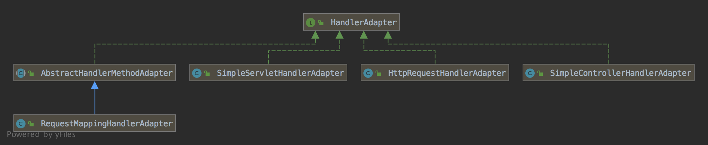

spring-handeradapter


## 接口

```java
public interface HandlerAdapter {
	boolean supports(Object handler);
	ModelAndView handle(HttpServletRequest request, HttpServletResponse response, Object handler) throws Exception;
	long getLastModified(HttpServletRequest request, Object handler);
}

// 典型模板模式的使用
public abstract class AbstractHandlerMethodAdapter extends WebContentGenerator implements HandlerAdapter, Ordered {
	@Override
	public final boolean supports(Object handler) {
    // HandlerMethod 的子类和子类自定义扩展
		return (handler instanceof HandlerMethod && supportsInternal((HandlerMethod) handler));
	}
  
	protected abstract boolean supportsInternal(HandlerMethod handlerMethod);
  
  public final ModelAndView handle(HttpServletRequest request, HttpServletResponse response, Object handler) throws Exception {
    return this.handleInternal(request, response, (HandlerMethod)handler);
  }
  
  // 子类实现
  protected abstract ModelAndView handleInternal(HttpServletRequest var1, HttpServletResponse var2, HandlerMethod var3) throws Exception;
}	
```


## 结构



## 设计

WebDataBinderFactory

创建 WebDataBinder，用户实现参数和 String 之间的转换。	


```

```


InitBinder


SessionAttribute


ParameterNameDiscoverer


WebBindingInitializer


ModelAttribute


HttpMessageConverter


HandlerMethodArgumentResolver


HandlerMethodReturnValueHandler


ModelAndViewResolver


ContentNegotiationManager


CallableProcessingInterceptor


## 实现

1、将 HttpServletRequest，HttpServletResponse 封装为 ServletWebRequest 请求

2、创建并初始化 ServletInvocableHandlerMethod

3、创建并初始化 ModelView 容器

4、调用方法

4.1、解析参数

4.2、调用对应类的方法

4.3、解析返回值

5、结果封装为ModelAndView并返回


### 主流程

```java
public class RequestMappingHandlerAdapter extends AbstractHandlerMethodAdapter implements BeanFactoryAware, InitializingBean {
    protected ModelAndView handleInternal(HttpServletRequest request, HttpServletResponse response, HandlerMethod handlerMethod) throws Exception {    
        this.checkRequest(request);
        ModelAndView mav;
        if (this.synchronizeOnSession) {
            HttpSession session = request.getSession(false);
            if (session != null) {
                Object mutex = WebUtils.getSessionMutex(session);
                synchronized(mutex) {
                    mav = this.invokeHandlerMethod(request, response, handlerMethod);
                }
            } else {
                mav = this.invokeHandlerMethod(request, response, handlerMethod);
            }
        } else {
            mav = this.invokeHandlerMethod(request, response, handlerMethod);
        }
        if (!response.containsHeader("Cache-Control")) {
            if (this.getSessionAttributesHandler(handlerMethod).hasSessionAttributes()) {
                this.applyCacheSeconds(response, this.cacheSecondsForSessionAttributeHandlers);
            } else {
                this.prepareResponse(response);
            }
        }
        return mav;
    }
  
	protected ModelAndView invokeHandlerMethod(HttpServletRequest request,
			HttpServletResponse response, HandlerMethod handlerMethod) throws Exception {
    // 创建 web 请求
		ServletWebRequest webRequest = new ServletWebRequest(request, response);
		try {
			WebDataBinderFactory binderFactory = getDataBinderFactory(handlerMethod);
      // 模型工厂
			ModelFactory modelFactory = getModelFactory(handlerMethod, binderFactory);
      // 创建方法调用对象
			ServletInvocableHandlerMethod invocableMethod = createInvocableHandlerMethod(handlerMethod);
			if (this.argumentResolvers != null) {
        // 设置参数解析器
				invocableMethod.setHandlerMethodArgumentResolvers(this.argumentResolvers);
			}
			if (this.returnValueHandlers != null) {
        // 设置返回值处理器
				invocableMethod.setHandlerMethodReturnValueHandlers(this.returnValueHandlers);
			}
			invocableMethod.setDataBinderFactory(binderFactory);
			invocableMethod.setParameterNameDiscoverer(this.parameterNameDiscoverer);
      // 创建 ModelView 容器
			ModelAndViewContainer mavContainer = new ModelAndViewContainer();
			mavContainer.addAllAttributes(RequestContextUtils.getInputFlashMap(request));
			modelFactory.initModel(webRequest, mavContainer, invocableMethod);
			mavContainer.setIgnoreDefaultModelOnRedirect(this.ignoreDefaultModelOnRedirect);s

      // 调用方法
			invocableMethod.invokeAndHandle(webRequest, mavContainer);
			if (asyncManager.isConcurrentHandlingStarted()) {
				return null;
			}
      // 封装为 ModelAndView
			return getModelAndView(mavContainer, modelFactory, webRequest);
		}
		finally {
			webRequest.requestCompleted();
		}
	}	

    private ModelAndView getModelAndView(ModelAndViewContainer mavContainer, ModelFactory modelFactory, NativeWebRequest webRequest) throws Exception {
        modelFactory.updateModel(webRequest, mavContainer);
        if (mavContainer.isRequestHandled()) {
            return null;
        } else {
            ModelMap model = mavContainer.getModel();
            ModelAndView mav = new ModelAndView(mavContainer.getViewName(), model, mavContainer.getStatus());
            return mav;
        }
    }
}


public class ServletInvocableHandlerMethod extends InvocableHandlerMethod {
   //返回值处理器
   private HandlerMethodReturnValueHandlerComposite returnValueHandlers;
  
   public void invokeAndHandle(ServletWebRequest webRequest, ModelAndViewContainer mavContainer, Object... providedArgs) throws Exception {
        // 解析参数，并调用对应类的方法
        Object returnValue = this.invokeForRequest(webRequest, mavContainer, providedArgs);
        this.setResponseStatus(webRequest);
        if (returnValue == null) {
            if (this.isRequestNotModified(webRequest) || this.getResponseStatus() != null || mavContainer.isRequestHandled()) {
                this.disableContentCachingIfNecessary(webRequest);
                mavContainer.setRequestHandled(true);
                return;
            }
        } else if (StringUtils.hasText(this.getResponseStatusReason())) {
            mavContainer.setRequestHandled(true);
            return;
        }
        mavContainer.setRequestHandled(false);
        try {
            // 返回值处理
            this.returnValueHandlers.handleReturnValue(returnValue, this.getReturnValueType(returnValue), mavContainer, webRequest);
        }
    }
}


public class InvocableHandlerMethod extends HandlerMethod {
    private WebDataBinderFactory dataBinderFactory;
    // 参数解析器
    private HandlerMethodArgumentResolverComposite resolvers = new HandlerMethodArgumentResolverComposite();
    // 参数名称发现器
    private ParameterNameDiscoverer parameterNameDiscoverer = new DefaultParameterNameDiscoverer();

    @Nullable
    public Object invokeForRequest(NativeWebRequest request, @Nullable ModelAndViewContainer mavContainer, Object... providedArgs) throws Exception {
        Object[] args = this.getMethodArgumentValues(request, mavContainer, providedArgs);
        return this.doInvoke(args);
    }

    protected Object[] getMethodArgumentValues(NativeWebRequest request, @Nullable ModelAndViewContainer mavContainer, Object... providedArgs) throws Exception {
        MethodParameter[] parameters = this.getMethodParameters();
        if (ObjectUtils.isEmpty(parameters)) {
            return EMPTY_ARGS;
        } else {
            Object[] args = new Object[parameters.length];
            // 遍历所有参数
            for(int i = 0; i < parameters.length; ++i) {
                MethodParameter parameter = parameters[i];
                parameter.initParameterNameDiscovery(this.parameterNameDiscoverer);
                args[i] = findProvidedArgument(parameter, providedArgs);
                if (args[i] == null) {
                    // 参数解析器解析HTTP参数为Java对象
                    args[i] = this.resolvers.resolveArgument(parameter, mavContainer, request, this.dataBinderFactory);
                }
            }

            return args;
        }
    }

    protected Object doInvoke(Object... args) throws Exception {
        ReflectionUtils.makeAccessible(this.getBridgedMethod());
        try {	
            return this.getBridgedMethod().invoke(this.getBean(), args);
        }
    }
}
```


### 参数解析

参数类型

1、request 相关

2、cookie

3、session

4、FlashMap

5、SessionAttributes

6、ModelAttribute


```java
	private List<HandlerMethodArgumentResolver> getDefaultArgumentResolvers() {
		List<HandlerMethodArgumentResolver> resolvers = new ArrayList<>();

		// 基于注解的参数解析
		resolvers.add(new RequestParamMethodArgumentResolver(getBeanFactory(), false));
		resolvers.add(new RequestParamMapMethodArgumentResolver());
		resolvers.add(new PathVariableMethodArgumentResolver());
		resolvers.add(new PathVariableMapMethodArgumentResolver());
		resolvers.add(new MatrixVariableMethodArgumentResolver());
		resolvers.add(new MatrixVariableMapMethodArgumentResolver());
		resolvers.add(new ServletModelAttributeMethodProcessor(false));
		resolvers.add(new RequestResponseBodyMethodProcessor(getMessageConverters(), this.requestResponseBodyAdvice));
		resolvers.add(new RequestPartMethodArgumentResolver(getMessageConverters(), this.requestResponseBodyAdvice));
		resolvers.add(new RequestHeaderMethodArgumentResolver(getBeanFactory()));
		resolvers.add(new RequestHeaderMapMethodArgumentResolver());
		resolvers.add(new ServletCookieValueMethodArgumentResolver(getBeanFactory()));
		resolvers.add(new ExpressionValueMethodArgumentResolver(getBeanFactory()));
		resolvers.add(new SessionAttributeMethodArgumentResolver());
		resolvers.add(new RequestAttributeMethodArgumentResolver());

		// 基于类型的参数解析
		resolvers.add(new ServletRequestMethodArgumentResolver());
		resolvers.add(new ServletResponseMethodArgumentResolver());
		resolvers.add(new HttpEntityMethodProcessor(getMessageConverters(), this.requestResponseBodyAdvice));
		resolvers.add(new RedirectAttributesMethodArgumentResolver());
		resolvers.add(new ModelMethodProcessor());
		resolvers.add(new MapMethodProcessor());
		resolvers.add(new ErrorsMethodArgumentResolver());
		resolvers.add(new SessionStatusMethodArgumentResolver());
		resolvers.add(new UriComponentsBuilderMethodArgumentResolver());

		// 自定义解析
		if (getCustomArgumentResolvers() != null) {
			resolvers.addAll(getCustomArgumentResolvers());
		}

		// 解析所有
		resolvers.add(new RequestParamMethodArgumentResolver(getBeanFactory(), true));
		resolvers.add(new ServletModelAttributeMethodProcessor(true));

		return resolvers;
	}
```


####  WebDataBinderFactory

```java
	private WebDataBinderFactory getDataBinderFactory(HandlerMethod handlerMethod) throws Exception {
		Class<?> handlerType = handlerMethod.getBeanType();
		Set<Method> methods = this.initBinderCache.get(handlerType);
		if (methods == null) {
      // @InitBinder 的方法
			methods = MethodIntrospector.selectMethods(handlerType, INIT_BINDER_METHODS);
			this.initBinderCache.put(handlerType, methods);
		}
		List<InvocableHandlerMethod> initBinderMethods = new ArrayList<>();
		// @ControllerAdvice 并且 @InitBinder 注解的方法
		this.initBinderAdviceCache.forEach((controllerAdviceBean, methodSet) -> {
			if (controllerAdviceBean.isApplicableToBeanType(handlerType)) {
				Object bean = controllerAdviceBean.resolveBean();
				for (Method method : methodSet) {
					initBinderMethods.add(createInitBinderMethod(bean, method));
				}
			}
		});
		for (Method method : methods) {
			Object bean = handlerMethod.getBean();
			initBinderMethods.add(createInitBinderMethod(bean, method));
		}
		return createDataBinderFactory(initBinderMethods);
	}

	protected InitBinderDataBinderFactory createDataBinderFactory(List<InvocableHandlerMethod> binderMethods)
			throws Exception {

		return new ServletRequestDataBinderFactory(binderMethods, getWebBindingInitializer());
	}	
```

先添加全局的 @InitBinder 方法，后添加类的 @InitBinder 方法


### 方法调用


```java
	public void invokeAndHandle(ServletWebRequest webRequest, ModelAndViewContainer mavContainer,
			Object... providedArgs) throws Exception {

		Object returnValue = invokeForRequest(webRequest, mavContainer, providedArgs);
		setResponseStatus(webRequest);

		if (returnValue == null) {
			if (isRequestNotModified(webRequest) || getResponseStatus() != null || mavContainer.isRequestHandled()) {
				disableContentCachingIfNecessary(webRequest);
				mavContainer.setRequestHandled(true);
				return;
			}
		}
		else if (StringUtils.hasText(getResponseStatusReason())) {
			mavContainer.setRequestHandled(true);
			return;
		}

		mavContainer.setRequestHandled(false);
		Assert.state(this.returnValueHandlers != null, "No return value handlers");
		try {
			this.returnValueHandlers.handleReturnValue(
					returnValue, getReturnValueType(returnValue), mavContainer, webRequest);
		}
		catch (Exception ex) {
			if (logger.isTraceEnabled()) {
				logger.trace(formatErrorForReturnValue(returnValue), ex);
			}
			throw ex;
		}
	}

	public Object invokeForRequest(NativeWebRequest request, @Nullable ModelAndViewContainer mavContainer,
			Object... providedArgs) throws Exception {

		Object[] args = getMethodArgumentValues(request, mavContainer, providedArgs);
		return doInvoke(args);
	}

	protected Object[] getMethodArgumentValues(NativeWebRequest request, @Nullable ModelAndViewContainer mavContainer,
			Object... providedArgs) throws Exception {

		MethodParameter[] parameters = getMethodParameters();
		if (ObjectUtils.isEmpty(parameters)) {
			return EMPTY_ARGS;
		}

		Object[] args = new Object[parameters.length];
		for (int i = 0; i < parameters.length; i++) {
			MethodParameter parameter = parameters[i];
			parameter.initParameterNameDiscovery(this.parameterNameDiscoverer);
			args[i] = findProvidedArgument(parameter, providedArgs);
			if (args[i] != null) {
				continue;
			}
			if (!this.resolvers.supportsParameter(parameter)) {
				throw new IllegalStateException(formatArgumentError(parameter, "No suitable resolver"));
			}
			try {
				args[i] = this.resolvers.resolveArgument(parameter, mavContainer, request, this.dataBinderFactory);
			}
		}
		return args;
	}

	protected Object doInvoke(Object... args) throws Exception {
		ReflectionUtils.makeAccessible(getBridgedMethod());
		try {
			return getBridgedMethod().invoke(getBean(), args);
		}
	}
```


### 解析返回值


```

```


#### ModelAttribute


#### ModelFactory

```java
	private ModelFactory getModelFactory(HandlerMethod handlerMethod, WebDataBinderFactory binderFactory) {
		SessionAttributesHandler sessionAttrHandler = getSessionAttributesHandler(handlerMethod);
    // @ModelAttribute 并且没有 @RequestMapping 注解的方法
		Class<?> handlerType = handlerMethod.getBeanType();
		Set<Method> methods = this.modelAttributeCache.get(handlerType);
		if (methods == null) {
			methods = MethodIntrospector.selectMethods(handlerType, MODEL_ATTRIBUTE_METHODS);
			this.modelAttributeCache.put(handlerType, methods);
		}
		List<InvocableHandlerMethod> attrMethods = new ArrayList<>();
		// @ControllerAdvice 和 @ModelAttribute 并且没有 @RequestMapping 注解的方法
		this.modelAttributeAdviceCache.forEach((controllerAdviceBean, methodSet) -> {
			if (controllerAdviceBean.isApplicableToBeanType(handlerType)) {
				Object bean = controllerAdviceBean.resolveBean();
				for (Method method : methodSet) {
					attrMethods.add(createModelAttributeMethod(binderFactory, bean, method));
				}
			}
		});
		for (Method method : methods) {
			Object bean = handlerMethod.getBean();
			attrMethods.add(createModelAttributeMethod(binderFactory, bean, method));
		}
		return new ModelFactory(attrMethods, binderFactory, sessionAttrHandler);
	}
```

先添加全局的 @ModelAttribute 方法，后添加类的 @ModelAttribute 方法


## 最佳实践


@InitBinder

1、注册校验器

2、注册参数编辑器：日期编辑器、数字编辑器


@ControllerAdvice

1、初始化 ModelAttribute

2、初始化 InitBinder

3、处理异常


@ResponseBodyAdvice

条件

1、返回值类型为 HttpEntity

2、返回值的方法有 @ResponseBodyAdvice

方法

1、实现 ResponseBodyAdvice 接口并添加 @ControllerAdvice

2、注册到 RequestMappingHandlerAdapter


@SessionAttribute

1、分页 

2、下拉列表参数


## 附录

### AbstractHandlerMethodAdapter

```java
public abstract class AbstractHandlerMethodAdapter extends WebContentGenerator implements HandlerAdapter, Ordered {
	@Override
	public final boolean supports(Object handler) {
		return (handler instanceof HandlerMethod && supportsInternal((HandlerMethod) handler));
	}
  
  protected abstract boolean supportsInternal(HandlerMethod handlerMethod);
  
  
  @Override
	public final ModelAndView handle(HttpServletRequest request, HttpServletResponse response, Object handler)
			throws Exception {

		return handleInternal(request, response, (HandlerMethod) handler);
	}
  
  protected abstract ModelAndView handleInternal(HttpServletRequest request,
			HttpServletResponse response, HandlerMethod handlerMethod) throws Exception;
}
```


```java
public class RequestMappingHandlerAdapter extends AbstractHandlerMethodAdapter
		implements BeanFactoryAware, InitializingBean {

	/**
	 * MethodFilter that matches {@link InitBinder @InitBinder} methods.
	 */
	public static final MethodFilter INIT_BINDER_METHODS = method ->
			AnnotatedElementUtils.hasAnnotation(method, InitBinder.class);

	/**
	 * MethodFilter that matches {@link ModelAttribute @ModelAttribute} methods.
	 */
	public static final MethodFilter MODEL_ATTRIBUTE_METHODS = method ->
			(!AnnotatedElementUtils.hasAnnotation(method, RequestMapping.class) &&
					AnnotatedElementUtils.hasAnnotation(method, ModelAttribute.class));


	@Nullable
	private List<HandlerMethodArgumentResolver> customArgumentResolvers;

	@Nullable
	private HandlerMethodArgumentResolverComposite argumentResolvers;

	@Nullable
	private HandlerMethodArgumentResolverComposite initBinderArgumentResolvers;

	@Nullable
	private List<HandlerMethodReturnValueHandler> customReturnValueHandlers;

	@Nullable
	private HandlerMethodReturnValueHandlerComposite returnValueHandlers;

	@Nullable
	private List<ModelAndViewResolver> modelAndViewResolvers;

	private ContentNegotiationManager contentNegotiationManager = new ContentNegotiationManager();

	private List<HttpMessageConverter<?>> messageConverters;

	private List<Object> requestResponseBodyAdvice = new ArrayList<>();

	@Nullable
	private WebBindingInitializer webBindingInitializer;

	private AsyncTaskExecutor taskExecutor = new SimpleAsyncTaskExecutor("MvcAsync");

	@Nullable
	private Long asyncRequestTimeout;

	private CallableProcessingInterceptor[] callableInterceptors = new CallableProcessingInterceptor[0];

	private DeferredResultProcessingInterceptor[] deferredResultInterceptors = new DeferredResultProcessingInterceptor[0];

	private ReactiveAdapterRegistry reactiveAdapterRegistry = ReactiveAdapterRegistry.getSharedInstance();

	private boolean ignoreDefaultModelOnRedirect = false;

	private int cacheSecondsForSessionAttributeHandlers = 0;

	private boolean synchronizeOnSession = false;

	private SessionAttributeStore sessionAttributeStore = new DefaultSessionAttributeStore();

	private ParameterNameDiscoverer parameterNameDiscoverer = new DefaultParameterNameDiscoverer();

	private ConfigurableBeanFactory beanFactory;


	private final Map<Class<?>, SessionAttributesHandler> sessionAttributesHandlerCache = new ConcurrentHashMap<>(64);

	private final Map<Class<?>, Set<Method>> initBinderCache = new ConcurrentHashMap<>(64);

	private final Map<ControllerAdviceBean, Set<Method>> initBinderAdviceCache = new LinkedHashMap<>();

	private final Map<Class<?>, Set<Method>> modelAttributeCache = new ConcurrentHashMap<>(64);

	private final Map<ControllerAdviceBean, Set<Method>> modelAttributeAdviceCache = new LinkedHashMap<>();

  public void afterPropertiesSet() {
    // 初始化 modelAttributeAdviceCache、modelAttributeAdviceCache、requestResponseBodyAdviceBeans
		initControllerAdviceCache();

    // 初始化 argumentResolvers
		if (this.argumentResolvers == null) {
			List<HandlerMethodArgumentResolver> resolvers = getDefaultArgumentResolvers();
			this.argumentResolvers = new HandlerMethodArgumentResolverComposite().addResolvers(resolvers);
		}
    // 初始化 initBinderArgumentResolvers
		if (this.initBinderArgumentResolvers == null) {
			List<HandlerMethodArgumentResolver> resolvers = getDefaultInitBinderArgumentResolvers();
			this.initBinderArgumentResolvers = new HandlerMethodArgumentResolverComposite().addResolvers(resolvers);
		}
    // 初始化 returnValueHandlers
		if (this.returnValueHandlers == null) {
			List<HandlerMethodReturnValueHandler> handlers = getDefaultReturnValueHandlers();
			this.returnValueHandlers = new HandlerMethodReturnValueHandlerComposite().addHandlers(handlers);
		}
	}

	private void initControllerAdviceCache() {
		if (getApplicationContext() == null) {
			return;
		}

		List<ControllerAdviceBean> adviceBeans = ControllerAdviceBean.findAnnotatedBeans(getApplicationContext());

		List<Object> requestResponseBodyAdviceBeans = new ArrayList<>();

		for (ControllerAdviceBean adviceBean : adviceBeans) {
			Class<?> beanType = adviceBean.getBeanType();
			if (beanType == null) {
				throw new IllegalStateException("Unresolvable type for ControllerAdviceBean: " + adviceBean);
			}
      // 初始化 modelAttributeAdviceCache，有 ModelAttribute 注解没有 RequestMapping 注解
			Set<Method> attrMethods = MethodIntrospector.selectMethods(beanType, MODEL_ATTRIBUTE_METHODS);
			if (!attrMethods.isEmpty()) {
				this.modelAttributeAdviceCache.put(adviceBean, attrMethods);
			}
      // 初始化 modelAttributeAdviceCache 查找有 InitBinder 注解的方法
			Set<Method> binderMethods = MethodIntrospector.selectMethods(beanType, INIT_BINDER_METHODS);
			if (!binderMethods.isEmpty()) {
				this.initBinderAdviceCache.put(adviceBean, binderMethods);
			}
      // 初始化 requestResponseBodyAdviceBeans，实现了 ResponseBodyAdvice 和 ResponseBodyAdvice 接口
			if (RequestBodyAdvice.class.isAssignableFrom(beanType) || ResponseBodyAdvice.class.isAssignableFrom(beanType)) {
				requestResponseBodyAdviceBeans.add(adviceBean);
			}
		}

    // @ControllerAdvice、@ResponseBodyAdvice、@RequestBody 注解的方式放在前面
		if (!requestResponseBodyAdviceBeans.isEmpty()) {
			this.requestResponseBodyAdvice.addAll(0, requestResponseBodyAdviceBeans);	
		}
	}
```

