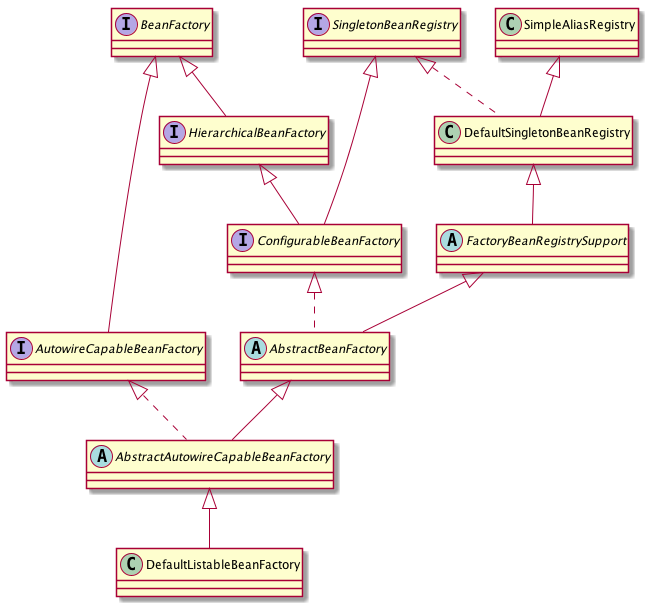

spring-ioc


[http://cxis.me/2019/02/22/Spring%E4%B8%AD%E6%89%A9%E5%B1%95%E7%82%B9%E6%B1%87%E6%80%BB/](http://cxis.me/2019/02/22/Spring中扩展点汇总/)

[http://cxis.me/2017/02/10/Spring%E4%B8%ADIOC%E5%AE%B9%E5%99%A8%E7%9A%84%E5%88%9D%E5%A7%8B%E5%8C%96%E8%BF%87%E7%A8%8B/](http://cxis.me/2017/02/10/Spring中IOC容器的初始化过程/)

http://cxis.me/archives/page/9/


问题

1. singleton 类 Person 属性包含一个 prototype 属性的成员 name，如何实现getName()每次都重新生成一个实例？ lookmethod, ApplicationContextAware
2. AOP与 IOC 是如何建立联系的？AOP 就是在 bean 实例后期间将切面逻辑织入 bean 实例中的，AOP 也正是通过 BeanPostProcessor 和 IOC 容器建立起了联系


### 前言

当面对需要创建和连接对象的复杂应用程序时，传统的编程方式往往会导致代码难以维护和扩展。在这样的背景下，控制反转（IOC）设计模式开始出现并得到越来越广泛的认可。

IOC 最早的概念最早出现在 1996 年的《Pattern-Oriented Software Architecture: A System of Patterns》一书中，但当时还没有与之对应的实现框架。随着 Java 技术的不断发展，越来越多的开发者开始意识到 IOC 的优势和重要性，并逐渐发展出了一些基于 IOC 的实现框架。

2002 年，Spring Framework 发布了第一个稳定版本。Spring 是一个轻量级、开放源代码的 Java 框架，主要用于企业级应用的开发。它包含了 IOC 容器、AOP（Aspect-Oriented Programming，面向切面编程）功能等模块，具有非常强大的灵活性和可扩展性，成为了一个非常成功的开源项目。

除了 Spring，其他的 IOC 框架也在陆续涌现。例如 Google Guice、Apache Hivemind 等，它们各自具有独特的特点和优势。同时，IOC 技术也越来越广泛地应用于各种语言和平台中，例如 .NET 平台上的 ASP.NET Core 等。

总的来说，IOC 设计模式已经成为了现代软件开发中必不可少的一部分。通过使用 IOC，可以将应用程序的控制权从代码中解耦出来，提高代码的可维护性、可测试性和灵活性，使得应用程序更易于扩展和修改。


### 缘起

```java
public interface LoginService {
    String login(String userName);
}

public class LoginServiceImpl implements LoginService {
    public String login(String userName){
        return "success";
    }
}

public class LoginController {
  
  	public LoginService loginService = new LoginServiceImpl();
  
    public String login(String userName){
        return loginService.login(userName);
    }
}
```


对于 `public LoginService loginService = new LoginServiceImpl();`  必须通过 `new LoginServiceImpl()` 来实现，当更改实现的时候，需要重新修改代码。由于 Java 反射，如果能够通过注解（配置文件）+反射的方式将对象实例化做了，那么就带来了解耦、非侵入的好处。

比如

```java
package com.springdemo.service;

public interface LoginService {
    String login(String userName);
}

package com.springdemo.service.impl;


public class LoginServiceImpl implements LoginService {
    @Override
    public String login(String userName){
        return "success";
    }
}


package com.springdemo.controller;

public class LoginController {
  
    @Autowired
  	public LoginService loginService;
  
    public String login(String userName){
        return loginService.login(userName);
    }
}
```

通过反射扫描注解 Autowired，找到对象，查询实现该接口的类，即可完成实例化。

这就是 IoC 的驱动。


### 什么是 IOC

IOC 是 Inversion of Control（控制反转）的缩写，是一种设计模式，用于将程序中对象之间的依赖关系从代码中解耦出来。在 IOC 模式中，应用程序的控制权被反转，由容器来管理和注入对象之间的依赖关系，而不是由代码直接实例化和管理这些对象。通过使用 IOC，可以提高代码的可维护性、可测试性和灵活性，使得应用程序更易于扩展和修改。常见的 IOC 容器包括 Spring 等。


### Ioc 发展简介

1. wikipedia 简介

1983 年 Richard E.Sweet 在《The Mesa Pragramming Environment》 中提出 Hollywood Principle 

1988

1996

2004

2005，Martin Fowler 在《InverssionOfControl》对 IoC 做出进一步说明

注：深入的概念理解阅读相关 paper

### IoC 主要实现策略

参考 wikipedia Inversion of control

参考《Expert On-on-One J2EE Development without EJB》

### IoC 容器的职责

通用职责

依赖处理

* 依赖注入

* 依赖查找：名称、类型查找、类型转换

生命周期管理

* 容器
* 托管资源（Java Bean 或其他资源）

配置

* 容器
* 外部化配置
* 托管资源（Java Bean 或其他资源）

### IoC 容器的实现

Java SE

* Java Beans
* Java ServiceLoader SPI
* JNDI（Java Naming and Directory Interface)

Java EE

* EJB
* Servlet：Model2

开源实现

* Apache Avalon
* PicoContainer
* Google Guice
* Spring Framework

### 传统 IoC 容器的实现

Java Beans（java.bean） 作为 IoC 容器

特性

* 依赖查找
* 生命周期配置
* 配置元信息
* 事件
* 自定义
* 资源管理
* 持久化

规范

Introspector

### 轻量级 IoC 容器

1. 可以管理应用代码
2. 快速启动
3. 不需要认识特定的部署步骤
4. 在绝多数场景有最小化的内存占用和最小 API 依赖


优点

1. 封装单体容器
2. 最大化代码重用
3. 更大程度上的面向对象设计
4. 更高的生产率
5. 更好测试


#### 依赖查找

根据 Bean 类型查找

单个 Bean 对象

集合 Bean 查找


依赖注入

依赖来源

配置元信息

IoC 容器

Spring 应用上下文

容器生命周期


### 依赖查找

支持注解和 xml 配置两种方式，具体方式是策略问题。而真正实现是同一套代码，解析配置（解析注解）找到对应的 class 签名并实例化。

查找方式：

1、根据名称

实时查找

```
public class Order {
    private Product product;

    @Autowired
    public Order(Product productFactory) {
        this.productFactory = productFactory;
    }

    public Product getProduct() {
        return productFactory.getObject();
    }
}
```


延时查找

```java
public class Order {
    private ObjectFactory<Product> productFactory;

    @Autowired
    public Order(ObjectFactory<Product> productFactory) {
        this.productFactory = productFactory;
    }

    public Product getProduct() {
        return productFactory.getObject();
    }
}
```


2、根据类型

单个Bean 对象

集合 Bean 对象

#### 实例

1.定义Bean

com/example/spring/ioc/Hello.java

```java
package com.example.spring.ioc;

import lombok.Data;

/**
 * @author ： liuwenxue
 * @date ：2020/01/26 09:19
 * @description :
 * @path : rest.com.example.Hello
 * @modifiedBy ：
 */
@Data
public class Hello {
    String content;
}
```


2.xml 配置

resource/spring-ioc.xml

```xml
<?xml version="1.0" encoding="UTF-8"?>
<beans xmlns="http://www.springframework.org/schema/beans"
       xmlns:xsi="http://www.w3.org/2001/XMLSchema-instance"
       xsi:schemaLocation="http://www.springframework.org/schema/beans http://www.springframework.org/schema/beans/spring-beans.xsd">
    <bean id="hello" class="com.example.spring.ioc.Hello">
        <property name="content" value="hello"/>
    </bean>
</beans>
```


3.注解配置

```java
package com.example.spring.ioc;

import org.springframework.context.annotation.Bean;
import org.springframework.context.annotation.Configuration;
import rest.com.example.Hello;

/**
* @author liuwenxue
* @date 2020-02-22
*/
@Configuration
public class BeanConfiguration {

    @Bean
    rest.com.example.Hello hello() {
        return new Hello();
    }
}
```

@Configuration注解标明BeanConfiguration类，使得BeanConfiguration类替代了xml文件，也就是说注解@Configuration等价于＜beans＞标签。在该类中，每个使用注解@Bean的公共方法对应着一个＜bean＞标签的定义，即@Bean等价于＜bean＞标签。这种基于java的注解配置方式是在spring3.0中引入的。


4.测试

```java
public class ApplicationTest {

   /**
     *  依赖查找
     */
    @Test
    public void testBeanLookup() {
        List<BeanFactory> beanFactories = new ArrayList<>();
        // xml classpath
        beanFactories.add(getApplicationContextByXmlClassPath());
        // xml filesystem
        beanFactories.add(getApplicationContextByXmlFileSystem());
        // annotation
        beanFactories.add(getApplicationContextByAnnotation());
        for (BeanFactory beanFactory : beanFactories) {
            List<Hello> hellos = new ArrayList<>();
            System.out.println("get bean with " + beanFactory.getClass().getName());
            //by name
            hellos.add((Hello) beanFactory.getBean("hello"));
            //by type
            hellos.add(beanFactory.getBean(Hello.class));
            //lazy by name
            ObjectFactory<Hello> objectFactoryByType = (ObjectFactory<Hello>) beanFactory.getBean(ObjectFactory.class);
            hellos.add(objectFactoryByType.getObject());
            //lazy by type
            ObjectFactory<Hello> objectFactoryByName = (ObjectFactory<Hello>) beanFactory.getBean("objectFactory");
            hellos.add(objectFactoryByName.getObject());

            for (Hello hello : hellos)  {
                hello.setContent("hello spring");
                System.out.println("hello -> " + hello);
            }

            ObjectFactory objectFactory = objectFactoryByName;
            System.out.println("collection bean factory");
            if (objectFactory instanceof ListableBeanFactory) {
                ListableBeanFactory listableBeanFactory = (ListableBeanFactory) objectFactoryByName;
                listableBeanFactory.getBeansOfType(Hello.class).entrySet().forEach(
                        entry -> System.out.println(entry.getKey() + ":" + entry.getValue())
                );
            }

            System.out.println("collection factory with annotation");
            if (objectFactory instanceof ListableBeanFactory) {
                ListableBeanFactory listableBeanFactory = (ListableBeanFactory) objectFactoryByName;
                listableBeanFactory.getBeansWithAnnotation(Super.class).entrySet().forEach(
                        entry -> System.out.println(entry.getKey() + ":" + entry.getValue())
                );
            }
        }
    }
}
```

现在已经知道如何找到对应的类了，并实例化。具体如何实例化？


### 依赖注入

注入方式

1. 根据名称

2. 根据类型

   单个 Bean 对象

   集合 Bean 对象

3. 注入容器内建 Bean 对象

4. 注入非 Bean 对象

5. 注入类型

   实时注入

   延时注入

#### 实例


1.定义对象

com/example/spring/ioc/Hello.java

```java
package com.example.spring.ioc;

import lombok.Data;

/**
 * @author ： liuwenxue
 * @date ：2020/01/26 09:19
 * @description :
 * @path : rest.com.example.Hello
 * @modifiedBy ：
 */
@Data
public class Hello {
    String content;
}
```

com/example/spring/ioc/HelloRepository.java

```java
import lombok.Data;
import org.springframework.beans.factory.BeanFactory;
import org.springframework.beans.factory.ObjectFactory;
import org.springframework.beans.factory.annotation.Autowired;
import org.springframework.context.ApplicationContext;

import java.util.List;

/**
* @author liuwenxue
* @date 2020-02-22
*
* 对比有与没有注解的区别
*/
@Data
public class HelloRepository {
    /**
     * 定义 Bean
     */
    @Autowired
    private List<Hello> hellos;

    /**
     *  内建非 Bean
     */
    @Autowired
    private BeanFactory beanFactory;

    /**
     *  内建 Bean
     */
    @Autowired
    private ObjectFactory<Hello> objectFactory;

    /**
     *  内建 Bean
     */
    @Autowired
    private ObjectFactory<ApplicationContext> objectFactoryApplication;
}
```


2.xml 配置

resource/spring-inject.xml

```xml
<?xml version="1.0" encoding="UTF-8"?>
<beans xmlns="http://www.springframework.org/schema/beans"
       xmlns:xsi="http://www.w3.org/2001/XMLSchema-instance" xmlns:mvc="http://www.springframework.org/schema/mvc"
       xmlns:util="http://www.springframework.org/schema/util" xmlns:ref="http://www.springframework.org/schema/beans"
       xsi:schemaLocation="http://www.springframework.org/schema/beans http://www.springframework.org/schema/beans/spring-beans.xsd http://www.springframework.org/schema/util http://www.springframework.org/schema/util/spring-util.xsd http://www.springframework.org/schema/mvc http://www.springframework.org/schema/mvc/spring-mvc.xsd">

    <bean id="hello" class="com.example.spring.ioc.Hello">
        <property name="content" value="hello"/>
    </bean>

    <bean id="helloRepository" class="com.example.spring.ioc.HelloRepository" autowire="byType">
        <!-- same as autowire
        <property name="hellos">
            <util:list>
                <ref bean="hello"/>
            </util:list>
        </property>
        -->
    </bean>
</beans>
```


3.注解配置

```java
@Configuration
public class BeanConfiguration {

    @Bean
    Hello hello() {
        return new Hello();
    }

    @Bean
    HelloRepository helloRepository() {
        return new HelloRepository();
    }

}
```


4.测试

```java
public class ApplicationTest {
		@Test
    public void testBeanInject() {
        List<BeanFactory> beanFactories = new ArrayList<>();
        // xml classpath
        beanFactories.add(getApplicationContextByXmlClassPath());
        beanFactories.add(getApplicationContextByAnnotation());
        for (BeanFactory beanFactory : beanFactories) {
            List<HelloRepository> hellos = new ArrayList<>();
            System.out.println("get bean with " + beanFactory.getClass().getName());
            //by name
            hellos.add((HelloRepository) beanFactory.getBean("helloRepository"));

            // 依赖注入是成功的
            for (HelloRepository hello : hellos)  {
                System.out.println("hello -> " + hello);
                System.out.println("hello.getBeanFactory()-> " + hello.getBeanFactory());
                System.out.println("hello.getBeanFactory() == beanFactory is " + Boolean.valueOf(hello.getBeanFactory() == beanFactory));
                System.out.println("hello.getObjectFactory()-> " + hello.getObjectFactory());
                System.out.println("hello.getObjectFactory().getObject()-> " + hello.getObjectFactory().getObject());
                System.out.println("hello.getObjectFactoryApplicationContext()-> " + hello.getObjectFactoryApplication());
                System.out.println("hello.getObjectFactoryApplicationContext().getObject()-> " + hello.getObjectFactoryApplication().getObject());
                System.out.println("hello.getObjectFactoryApplicationContext ==  beanFactory is " + Boolean.valueOf(hello.getObjectFactoryApplication().getObject() == beanFactory));
            }
            // 依赖查找是失败的
            //System.out.println("hello -> " + beanFactory.getBean(BeanFactory.class));
        }
    }
    }
```


### 依赖来源

1、自定义 Bean：业务 Bean

2、容器内建 Bean 对象：Environment

3、容器内建依赖：BeanFactory


### 配置元信息

#### Bean 定义配置

基于 XML 文件

基于 Properties 文件：@PropertySource注解和PropertySourcesPlaceholderConfigurer类来加载和解析properties文件中的配置信息

基于 Java 注解：@Bean @Configuration @Service @Component

基于 Java API：通过 ApplicationContext 的 register 方法实现

#### IoC 容器配置

基于 XML 文件

基于 Java 注解

基于 Java API

#### 外部化属性配置

基于 Java 注解

@Value


### BeanFactory vs ApplicationContext

BeanFactory 和 ApplicationContext 是 Spring Framework 的两个核心接口。

BeanFactory 是 Spring 的基础设施，提供了完整的 Bean 实例化、配置和管理并提供了基本的面向 Spring 的概念和 API。

ApplicationContext 是 BeanFactory 的子接口，提供了更加强大的功能，包括国际化支持、事件传播、更高级的资源管理等。

其区别在于，ApplicationContext 对 BeanFactory 进行了扩展，拥有更多的企业级功能。

1、AOP：在 AOP 的扩展中，ApplicationContext 实现了自动代理创建和管理，使用 AspectJ 注解和切点表达式进行切面编程，并支持各种 AOP 代理类型。此外，它还提供了 AOP 代理生命周期管理，包括实例化、初始化、代理创建和销毁。

2、国际化：在国际化的扩展中，通过使用 MessageSource 接口来支持不同语言环境下的信息资源管理。可以轻松地添加一个 message properties 文件，根据当前用户的语言环境提供相应的消息。

3、事件： 在事件的扩展中，提供了事件监听器的注册、事件发布、事件监听器的移除等一系列功能，使得我们可以在应用程序中轻松地实现事件驱动模型。

4、应用上下文：在实现特定任务的应用程序上下文实现的扩展主要是针对不同场景提供了特定的 ApplicationContext 实现，例如 Web 应用场景下的 WebApplicationContext，在不同场景下提供了不同的配置和功能支持，方便开发人员进行快速开发。同时也支持开发人员自定义实现以满足特定的业务需求。

5、配置元信息：支持将配置元数据存储在 XML、Java 注解、Java 代码、属性文件中，并提供了多种方式来装载、解析和管理这些配置元数据。它还支持基于环境的配置，使得应用程序可以适应不同的运行环境。

6、资源管理：在资源管理上，可以统一管理应用程序中的资源文件，比如获取类路径下的文件或者 URL、以及访问 JNDI 数据源。此外，ApplicationContext 还提供了对资源文件的监听和缓存机制，以保证资源的有效性和高效性。

7、注解：在注解方面，ApplicationContext 可以扫描标记了特定注解的类，例如 `@Component`、`@Service`、`@Controller` 和 `@Repository` 等等，然后将这些类作为 Spring bean 进行管理。使用这种方式可以在应用程序中更加方便地使用自动装配和依赖注入。

8、Environment 抽象：ApplicationContext 提供了访问环境（Environment）和属性源（property sources）的方法和工具，这使得在应用程序中可以方便地访问属性、配置和其他环境相关的信息。通过 Environment，可以获取属性文件、操作系统变量和其他属性源中的属性值，并且可以根据不同的配置文件创建不同的 ApplicationContext 实例。同时，AnnotationConfigApplicationContext 和 XmlWebApplicationContext 都提供了 setEnvironment() 方法，用于自定义 Environment 实例，以满足不同的环境需求。

从源码实现上， ApplicationContext 组合了 BeanFactory。

### 对象实例化


#### setter 方法


#### 构造函数

在constructor模式下，存在单个实例则优先按类型进行参数匹配（无论名称是否匹配），当存在多个类型相同实例时，按名称优先匹配，如果没有找到对应名称，则注入失败，此时可以使用autowire-candidate=”false” 过滤来解决。

问题

1. 循环依赖问题


自动装配

1. byTpye(根据类型)
2. byName(根据名称)
3. constructor(根据构造函数)。


问题：

1. 多个实现类


Bean

所谓Bean的作用域是指spring容器创建Bean后的生存周期即由创建到销毁的整个过程。之前我们所创建的所有Bean其作用域都是Singleton，这是Spring默认的，在这样的作用域下，每一个Bean的实例只会被创建一次，而且Spring容器在整个应用程序生存期中都可以使用该实例。因此之前的代码中spring容器创建Bean后，通过代码获取的bean，无论多少次，都是同一个Bean的实例。我们可使用＜bean＞标签的scope属性来指定一个Bean的作用域，如下：


### prototype

除了Singleton外还有另外一种比较常用的作用域，prototype，它代表每次获取Bean实例时都会新创建一个实例对象

Singleton外还有另外一种比较常用的作用域，prototype，它代表每次获取Bean实例时都会新创建一个实例对象，类似new操作符。 


希望的是每次getBean(“accountService”)处理的都是一个新的accountDao实例对象，但是由于accountService的依赖是在Bean被创建时注入的，而且accountService是一个Singleton，整个生存周期中只会创建一次，因此它所依赖的accountDao实例对象也只会被注入一次，此后不会再注入任何新的accountDao实例对象。为了解决这种困境，只能放弃使用依赖注入的功能，使用代码实现，如下：通过实现ApplicationContextAware接口，重写setApplicationContext，

一般情况下，对有状态的bean应该使用prototype作用域，而对无状态的bean则应该使用singleton作用域。所谓有状态就是该bean有保存信息的能力，不能共享，否则会造成线程安全问题，而无状态则不保存信息，是线程安全的，可以共享，spring中大部分bean都是Singleton，整个生命周期过程只会存在一个。


### 注解原理

- IOC容器初始化入口是在构造方法中调用refresh开始的。
- 通过ResourceLoader来完成资源文件位置的定位，DefaultResourceLoader是默认的实现，同时上下文本身就给除了ResourceLoader的实现。
- 创建的IOC容器是DefaultListableBeanFactory。
- IOC对Bean的管理和依赖注入功能的实现是通过对其持有的BeanDefinition进行相关操作来完成的。
- 通过BeanDefinitionReader来完成定义信息的解析和Bean信息的注册。
- XmlBeanDefinitionReader是BeanDefinitionReader的实现了，通过它来解析xml配置中的bean定义。
- 实际的处理过程是委托给BeanDefinitionParserDelegate来完成的。得到Bean的定义信息，这些信息在Spring中使用BeanDefinition对象来表示。
- BeanDefinition的注册是由BeanDefinitionRegistry实现的registerBeanDefiition方法进行的。内部使用ConcurrentHashMap来保存BeanDefiition。
- 


```java
    public Resource getResource(String location) {
        Assert.notNull(location, "Location must not be null");
        Iterator var2 = this.protocolResolvers.iterator();

        Resource resource;
        do {
            if (!var2.hasNext()) {
                if (location.startsWith("/")) {
                    return this.getResourceByPath(location);
                }

                if (location.startsWith("classpath:")) {
                    return new ClassPathResource(location.substring("classpath:".length()), this.getClassLoader());
                }

                try {
                    URL url = new URL(location);
                    return (Resource)(ResourceUtils.isFileURL(url) ? new FileUrlResource(url) : new UrlResource(url));
                } catch (MalformedURLException var5) {
                    return this.getResourceByPath(location);
                }
            }

            ProtocolResolver protocolResolver = (ProtocolResolver)var2.next();
            resource = protocolResolver.resolve(location, this);
        } while(resource == null);

        return resource;
    }

    protected Resource getResourceByPath(String path) {
        return new DefaultResourceLoader.ClassPathContextResource(path, this.getClassLoader());
    }

    protected static class ClassPathContextResource extends ClassPathResource implements ContextResource {
        public ClassPathContextResource(String path, @Nullable ClassLoader classLoader) {
            super(path, classLoader);
        }

        public String getPathWithinContext() {
            return this.getPath();
        }

        public Resource createRelative(String relativePath) {
            String pathToUse = StringUtils.applyRelativePath(this.getPath(), relativePath);
            return new DefaultResourceLoader.ClassPathContextResource(pathToUse, this.getClassLoader());
        }
    }
```


### BeanFactory中Bean的生命周期

1. 容器寻找Bean的定义信息，并将其实例化。
2. 使用依赖注入，Spring按照Bean定义信息配置Bean的所有属性。
3. 如果Bean实现了BeanNameAware接口，工厂调用Bean的setBeanName()方法传递Bean的id。
4. 如果实现了BeanFactoryAware接口，工厂调用setBeanFactory()方法传入工厂自身。
5. 如果BeanPostProcessor和Bean关联，那么它们的postProcessBeforeInitialization()方法将被调用。（需要手动进行注册！）
6. 如果Bean实现了InitializingBean接口，则会回调该接口的afterPropertiesSet()方法。
7. 如果Bean指定了init-method方法，就会调用init-method方法。
8. 如果BeanPostProcessor和Bean关联，那么它的postProcessAfterInitialization()方法将被调用。（需要手动注册！）
9. 现在Bean已经可以使用了。
   1. scope为singleton的Bean缓存在Spring IOC容器中。
   2. scope为prototype的Bean生命周期交给客户端。
10. 销毁。
    1. 如果Bean实现了DisposableBean接口，destory()方法将会被调用。
    2. 如果配置了destory-method方法，就调用这个方法。


#### ApplicationContext中Bean的生命周期

1. 容器寻找Bean的定义信息，并将其实例化。会对scope为singleton且非懒加载的bean进行实例化
2. 使用依赖注入，Spring按照Bean定义信息配置Bean的所有属性。
3. 如果Bean实现了BeanNameAware接口，工厂调用Bean的setBeanName()方法传递Bean的id。
4. 如果实现了BeanFactoryAware接口，工厂调用setBeanFactory()方法传入工厂自身。
5. 如果实现了ApplicationContextAware接口，会调用该接口的setApplicationContext()方法，传入该Bean的ApplicationContext，这样该Bean就获得了自己所在的ApplicationContext。
6. 如果Bean实现了BeanPostProcessor接口，则调用postProcessBeforeInitialization()方法。
7. 如果Bean实现了InitializingBean接口，则会回调该接口的afterPropertiesSet()方法。
8. 如果Bean制定了init-method方法，就会调用init-method方法。
9. 如果Bean实现了BeanPostProcessor接口，则调用postProcessAfterInitialization()方法。
10. 现在Bean已经可以使用了。
    1. scope为singleton的Bean缓存在Spring IOC容器中。
       1. scope为prototype的Bean生命周期交给客户端。
11. 销毁。
    1. 如果Bean实现了DisposableBean接口，destory()方法将会被调用。
       1. 如果配置了destory-method方法，就调用这个方法。

### 两种容器中的不同之处

1. BeanFactory容器中不会调用ApplicationContext接口的setApplicationContext()方法。
2. BeanFactory中BeanPostProcessor接口的postProcessBeforeInitialzation()方法和postProcessAfterInitialization()方法不会自动调用，必须自己通过代码手动注册。
3. BeanFactory容器启动的时候，不会去实例化所有Bean,包括所有scope为singleton且非懒加载的Bean也是一样，而是在调用的时候去实例化。


## 源码分析


BeanFactory 的设计要素

1. HierarchicalBeanFactory：Bean 之间存在相互依赖关系，因此，需要一个接口表达类之间相互依赖关系。
2. BeanPostProcessor：bean 的扩展点，在 bean 的创建前后做一些处理。
3. bean 的创建方式：singleton，prototype
4. BeanFactory：bean 的生命周期，创建，销毁，查找


Bean 的依赖关系




### 单例


```java
public abstract class AbstractBeanFactory extends FactoryBeanRegistrySupport implements ConfigurableBeanFactory {
    //父工厂
    private BeanFactory parentBeanFactory;
    @Nullable
    private ClassLoader beanClassLoader = ClassUtils.getDefaultClassLoader();
    @Nullable
    private ClassLoader tempClassLoader;
    private boolean cacheBeanMetadata = true;
    @Nullable
    private BeanExpressionResolver beanExpressionResolver;
    @Nullable
    private ConversionService conversionService;
    private final Set<PropertyEditorRegistrar> propertyEditorRegistrars = new LinkedHashSet(4);
    private final Map<Class<?>, Class<? extends PropertyEditor>> customEditors = new HashMap(4);
    @Nullable
    private TypeConverter typeConverter;
    private final List<StringValueResolver> embeddedValueResolvers = new CopyOnWriteArrayList();
    private final List<BeanPostProcessor> beanPostProcessors = new CopyOnWriteArrayList();
    private volatile boolean hasInstantiationAwareBeanPostProcessors;
    private volatile boolean hasDestructionAwareBeanPostProcessors;
    private final Map<String, Scope> scopes = new LinkedHashMap(8);
    @Nullable
    private SecurityContextProvider securityContextProvider;
  
    // 正在合并的 Bean，一旦加入 alreadyCreated，就会从当前 Map 中删除
    private final Map<String, RootBeanDefinition> mergedBeanDefinitions = new ConcurrentHashMap(256);
  
    // 已经创建的 Bean
    private final Set<String> alreadyCreated ;
  
    //当 Prototype 类型的 Bean 创建完成前加入，创建完成之后删除。
    private final ThreadLocal<Object> prototypesCurrentlyInCreation;
}  


public class DefaultSingletonBeanRegistry extends SimpleAliasRegistry implements SingletonBeanRegistry {
    // 已经完成创建的 Bean
    private final Map<String, Object> singletonObjects;
  
    // 创建 Bean 的工厂，当 Bean 处于创建或者已经完成创建，对应的 bean 会删除。
    private final Map<String, ObjectFactory<?>> singletonFactories;
  
  	// 正在创建的 Bean，还没有创建完成
    private final Map<String, Object> earlySingletonObjects;
  
  	// 已经注册的 Bean
    private final Set<String> registeredSingletons;
  
    // 正在创建的 Bean
    private final Set<String> singletonsCurrentlyInCreation;
    private final Set<String> inCreationCheckExclusions;
    
    private Set<Exception> suppressedExceptions;
    private boolean singletonsCurrentlyInDestruction = false;
    private final Map<String, Object> disposableBeans;
    private final Map<String, Set<String>> containedBeanMap;
  
    //key 为 bean，value 为 bean 依赖的 bean。
    private final Map<String, Set<String>> dependentBeanMap;
    //key 为 bean，value 为依赖 bean 的 bean。与 dependentBeanMap 正好相反。
    private final Map<String, Set<String>> dependenciesForBeanMap;
}
```


### 不同 Scope 的 Bean

Spring 默认支持 singleton 和 prototype 类型的 Bean。可以通过 registerScope 和 配置文件支持扩展其他 scope 的 bean。当前 spring 还支持 request、session。在多线程下，有时候需要通过 request 和 session 类型的 bean 解决多线程下数据共享问题。

### 循环依赖的判断

```java
    private boolean isDependent(String beanName, String dependentBeanName, @Nullable Set<String> alreadySeen) {
        if (alreadySeen != null && ((Set)alreadySeen).contains(beanName)) {
            return false;
        } else {
            String canonicalName = this.canonicalName(beanName);
            Set<String> dependentBeans = (Set)this.dependentBeanMap.get(canonicalName);
            if (dependentBeans == null) {
                return false;
            } else if (dependentBeans.contains(dependentBeanName)) {
                return true;
            } else {
                Iterator var6 = dependentBeans.iterator();

                String transitiveDependency;
                do {
                    if (!var6.hasNext()) {
                        return false;
                    }

                    transitiveDependency = (String)var6.next();
                    if (alreadySeen == null) {
                        alreadySeen = new HashSet();
                    }

                    ((Set)alreadySeen).add(beanName);
                } while(!this.isDependent(transitiveDependency, dependentBeanName, (Set)alreadySeen));

                return true;
            }
        }
    }
```

​	