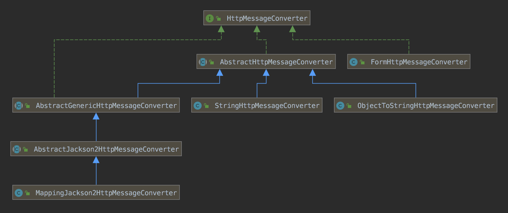

## Http 消息

请求消息

```java
public interface HttpMessage {
	HttpHeaders getHeaders();
}
```


请求接口

```java
public interface HttpInputMessage extends HttpMessage {
	InputStream getBody() throws IOException;
}
```


响应接口

```java
public interface HttpOutputMessage extends HttpMessage {
   OutputStream getBody() throws IOException;
}
```


## 消息转换器

HttpMessageConverter 是 Spring MVC 中将 Java 对象 和 HttpMessage 进行相互转换的转换器。


```java
public interface HttpMessageConverter<T> {
    // 当前转换器是否能将HTTP报文转换为对象类型
    boolean canRead(Class<?> clazz, MediaType mediaType);

    // 当前转换器是否能将对象类型转换为HTTP报文
    boolean canWrite(Class<?> clazz, MediaType mediaType);

    // 转换器能支持的HTTP媒体类型
    List<MediaType> getSupportedMediaTypes();

    // 转换HTTP报文为特定类型
    T read(Class<? extends T> clazz, HttpInputMessage inputMessage)
            throws IOException, HttpMessageNotReadableException;

    // 将特定类型对象转换为HTTP报文
    void write(T t, MediaType contentType, HttpOutputMessage outputMessage)
            throws IOException, HttpMessageNotWritableException;
}
```


## 常见实现



| 资源                                                         | 转换器                                   |
| ------------------------------------------------------------ | ---------------------------------------- |
| Resource                                                     | ResourceHttpMessageConverter             |
| BufferedImage                                                | BufferedImageHttpMessageConverter        |
| XML                                                          | SourceHttpMessageConverter               |
| 读写 application/x-www-form-urlencoded 类型资源。写multipart/form-data和multipart/mixed类型资源。 | FormHttpMessageConverter                 |
| text/plain                                                   | ObjectToStringHttpMessageConverter       |
| text/plain                                                   | StringHttpMessageConverter               |
| application/octet-stream                                     | ByteArrayHttpMessageConverter            |
| Google Protocol Buffers                                      | ProtobufHttpMessageConverter             |
| Google Protocol Buffers                                      | ProtobufJsonFormatHttpMessageConverter   |
| ResourceRegion                                               | ResourceRegionHttpMessageConverter       |
| Atom和RSS Feed                                               | AbstractWireFeedHttpMessageConverter     |
| Atom Feed                                                    | AtomFeedHttpMessageConverter             |
| Rss Feed                                                     | RssChannelHttpMessageConverter           |
| XML                                                          | AbstractJaxb2HttpMessageConverter        |
| XML                                                          | Jaxb2RootElementHttpMessageConverter     |
| XML                                                          | Jaxb2CollectionHttpMessageConverter      |
| XML                                                          | MarshallingHttpMessageConverter          |
| application/json                                             | AbstractJsonHttpMessageConverter         |
| application/json                                             | JsonbHttpMessageConverter                |
| application/json                                             | GsonHttpMessageConverter                 |
| application/x-jackson-smile                                  | MappingJackson2SmileHttpMessageConverter |
| application/json                                             | MappingJackson2HttpMessageConverter      |
| application/cbor                                             | MappingJackson2CborHttpMessageConverter  |
| application/xml、text/xml、application/*+xml                 | MappingJackson2XmlHttpMessageConverter   |

StringHttpMessageConverter和ObjectToStringHttpMessageConverter配合使用


## 附录

核心源码

```java
public abstract class AbstractHttpMessageConverter<T> implements HttpMessageConverter<T> {
  
  private List<MediaType> supportedMediaTypes = Collections.emptyList();
  
  private Charset defaultCharset;
  
  protected abstract boolean supports(Class<?> clazz);

	@Override
	public boolean canRead(Class<?> clazz, @Nullable MediaType mediaType) {
		return supports(clazz) && canRead(mediaType);
	}

	protected boolean canRead(@Nullable MediaType mediaType) {
		if (mediaType == null) {
			return true;
		}
		for (MediaType supportedMediaType : getSupportedMediaTypes()) {
			if (supportedMediaType.includes(mediaType)) {
				return true;
			}
		}
		return false;
	}

	@Override
	public boolean canWrite(Class<?> clazz, @Nullable MediaType mediaType) {
		return supports(clazz) && canWrite(mediaType);
	}

	protected boolean canWrite(@Nullable MediaType mediaType) {
		if (mediaType == null || MediaType.ALL.equalsTypeAndSubtype(mediaType)) {
			return true;
		}
		for (MediaType supportedMediaType : getSupportedMediaTypes()) {
			if (supportedMediaType.isCompatibleWith(mediaType)) {
				return true;
			}
		}
		return false;
	}

	@Override
	public final void write(final T t, @Nullable MediaType contentType, HttpOutputMessage outputMessage)
			throws IOException, HttpMessageNotWritableException {

		final HttpHeaders headers = outputMessage.getHeaders();
		addDefaultHeaders(headers, t, contentType);

		if (outputMessage instanceof StreamingHttpOutputMessage) {
			StreamingHttpOutputMessage streamingOutputMessage = (StreamingHttpOutputMessage) outputMessage;
			streamingOutputMessage.setBody(outputStream -> writeInternal(t, new HttpOutputMessage() {
				@Override
				public OutputStream getBody() {
					return outputStream;
				}
				@Override
				public HttpHeaders getHeaders() {
					return headers;
				}
			}));
		}
		else {
			writeInternal(t, outputMessage);
			outputMessage.getBody().flush();
		}
	}

  // 子类实现
	protected abstract void writeInternal(T t, HttpOutputMessage outputMessage)
			throws IOException, HttpMessageNotWritableException;

	@Override
	public final T read(Class<? extends T> clazz, HttpInputMessage inputMessage)
			throws IOException, HttpMessageNotReadableException {
		return readInternal(clazz, inputMessage);
	}

  // 子类实现
	protected abstract T readInternal(Class<? extends T> clazz, HttpInputMessage inputMessage)
			throws IOException, HttpMessageNotReadableException;

}

public interface GenericHttpMessageConverter<T> extends HttpMessageConverter<T> {
	boolean canRead(Type type, @Nullable Class<?> contextClass, @Nullable MediaType mediaType);

	T read(Type type, @Nullable Class<?> contextClass, HttpInputMessage inputMessage)
			throws IOException, HttpMessageNotReadableException;

	boolean canWrite(@Nullable Type type, Class<?> clazz, @Nullable MediaType mediaType);

  void write(T t, @Nullable Type type, @Nullable MediaType contentType, HttpOutputMessage outputMessage)
			throws IOException, HttpMessageNotWritableException;
}
```

