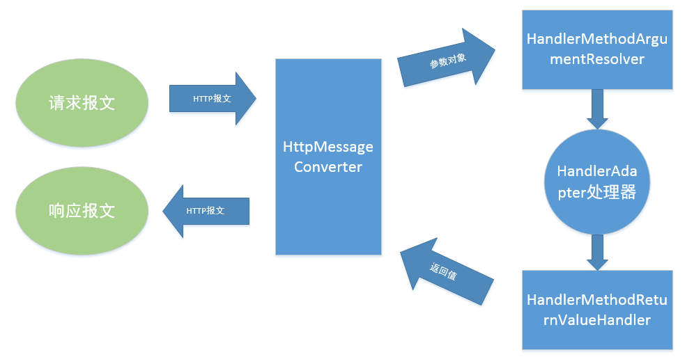
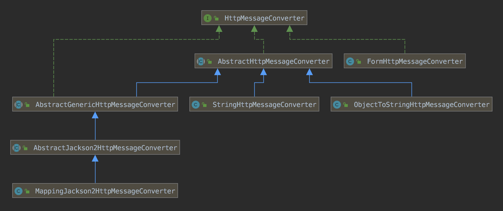
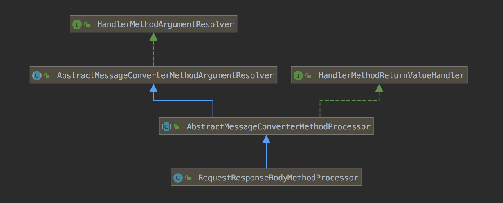

相信你 N 次在代码中写下了 @ResponseBody，可是否层级关注过ResponseBody 到底有什么用？它的底层原理是啥？参见如下分析




### 处理器适配器

1、将 HttpServletRequest，HttpServletResponse 封装为 ServletWebRequest 请求

2、创建并初始化 ServletInvocableHandlerMethod

3、创建并初始化 ModelView 容器

4、调用方法（解析参数，调用对应类的方法，解析返回值）

5、结果封装为ModelAndView并返回

```java
public interface HandlerAdapter {
    boolean supports(Object var1);
  	//整个 HTTP 处理的最核心，接收 HttpServletRequest，HttpServletResponse，返回ModelAndView
    ModelAndView handle(HttpServletRequest var1, HttpServletResponse var2, Object var3) throws Exception;

    long getLastModified(HttpServletRequest var1, Object var2);
}

// 典型模板模式的使用
public abstract class AbstractHandlerMethodAdapter extends WebContentGenerator implements HandlerAdapter, Ordered {
    @Nullable
    public final ModelAndView handle(HttpServletRequest request, HttpServletResponse response, Object handler) throws Exception {
        return this.handleInternal(request, response, (HandlerMethod)handler);
    }
  
  	@Nullable
    protected abstract ModelAndView handleInternal(HttpServletRequest var1, HttpServletResponse var2, HandlerMethod var3) throws Exception;
}

public class RequestMappingHandlerAdapter extends AbstractHandlerMethodAdapter implements BeanFactoryAware, InitializingBean {

    protected ModelAndView handleInternal(HttpServletRequest request, HttpServletResponse response, HandlerMethod handlerMethod) throws Exception {    
        this.checkRequest(request);
        ModelAndView mav;
        if (this.synchronizeOnSession) {
            HttpSession session = request.getSession(false);
            if (session != null) {
                Object mutex = WebUtils.getSessionMutex(session);
                synchronized(mutex) {
                    mav = this.invokeHandlerMethod(request, response, handlerMethod);
                }
            } else {
                mav = this.invokeHandlerMethod(request, response, handlerMethod);
            }
        } else {
            mav = this.invokeHandlerMethod(request, response, handlerMethod);
        }
        if (!response.containsHeader("Cache-Control")) {
            if (this.getSessionAttributesHandler(handlerMethod).hasSessionAttributes()) {
                this.applyCacheSeconds(response, this.cacheSecondsForSessionAttributeHandlers);
            } else {
                this.prepareResponse(response);
            }
        }
        return mav;
    }
}

    @Nullable
    protected ModelAndView invokeHandlerMethod(HttpServletRequest request, HttpServletResponse response, HandlerMethod handlerMethod) throws Exception {
        // 创建 web 请求
        ServletWebRequest webRequest = new ServletWebRequest(request, response);

        ModelAndView var15;
        try {
            WebDataBinderFactory binderFactory = this.getDataBinderFactory(handlerMethod);
            // 模型工厂
            ModelFactory modelFactory = this.getModelFactory(handlerMethod, binderFactory);
          
            // 创建方法调用对象
            ServletInvocableHandlerMethod invocableMethod = this.createInvocableHandlerMethod(handlerMethod);
            if (this.argumentResolvers != null) {
               // 设置参数解析器
              invocableMethod.setHandlerMethodArgumentResolvers(this.argumentResolvers);
            }

            if (this.returnValueHandlers != null) {
              // 设置返回值处理器
                invocableMethod.setHandlerMethodReturnValueHandlers(this.returnValueHandlers);
            }

            invocableMethod.setDataBinderFactory(binderFactory);
            invocableMethod.setParameterNameDiscoverer(this.parameterNameDiscoverer);
            // 创建 ModelView 容器
            ModelAndViewContainer mavContainer = new ModelAndViewContainer();
            mavContainer.addAllAttributes(RequestContextUtils.getInputFlashMap(request));
            modelFactory.initModel(webRequest, mavContainer, invocableMethod);
            mavContainer.setIgnoreDefaultModelOnRedirect(this.ignoreDefaultModelOnRedirect);
            Object result;
            // 调用方法
            invocableMethod.invokeAndHandle(webRequest, mavContainer, new Object[0]);
            // 封装为 ModelAndView
            var15 = this.getModelAndView(mavContainer, modelFactory, webRequest);
        } finally {
            webRequest.requestCompleted();
        }

        return var15;
    }

    private ModelAndView getModelAndView(ModelAndViewContainer mavContainer, ModelFactory modelFactory, NativeWebRequest webRequest) throws Exception {
        modelFactory.updateModel(webRequest, mavContainer);
        if (mavContainer.isRequestHandled()) {
            return null;
        } else {
            ModelMap model = mavContainer.getModel();
            ModelAndView mav = new ModelAndView(mavContainer.getViewName(), model, mavContainer.getStatus());
            return mav;
        }
    }
}


public class ServletInvocableHandlerMethod extends InvocableHandlerMethod {
   //返回值处理器
   private HandlerMethodReturnValueHandlerComposite returnValueHandlers;
  
   public void invokeAndHandle(ServletWebRequest webRequest, ModelAndViewContainer mavContainer, Object... providedArgs) throws Exception {
        // 解析参数，并调用对应类的方法
        Object returnValue = this.invokeForRequest(webRequest, mavContainer, providedArgs);
        this.setResponseStatus(webRequest);
        if (returnValue == null) {
            if (this.isRequestNotModified(webRequest) || this.getResponseStatus() != null || mavContainer.isRequestHandled()) {
                this.disableContentCachingIfNecessary(webRequest);
                mavContainer.setRequestHandled(true);
                return;
            }
        } else if (StringUtils.hasText(this.getResponseStatusReason())) {
            mavContainer.setRequestHandled(true);
            return;
        }
        mavContainer.setRequestHandled(false);
        try {
            // 返回值处理
            this.returnValueHandlers.handleReturnValue(returnValue, this.getReturnValueType(returnValue), mavContainer, webRequest);
        }
    }
}


public class InvocableHandlerMethod extends HandlerMethod {
    private WebDataBinderFactory dataBinderFactory;
    // 参数解析器
    private HandlerMethodArgumentResolverComposite resolvers = new HandlerMethodArgumentResolverComposite();
    // 参数名称发现器
    private ParameterNameDiscoverer parameterNameDiscoverer = new DefaultParameterNameDiscoverer();

    @Nullable
    public Object invokeForRequest(NativeWebRequest request, @Nullable ModelAndViewContainer mavContainer, Object... providedArgs) throws Exception {
        Object[] args = this.getMethodArgumentValues(request, mavContainer, providedArgs);
        return this.doInvoke(args);
    }

    protected Object[] getMethodArgumentValues(NativeWebRequest request, @Nullable ModelAndViewContainer mavContainer, Object... providedArgs) throws Exception {
        MethodParameter[] parameters = this.getMethodParameters();
        if (ObjectUtils.isEmpty(parameters)) {
            return EMPTY_ARGS;
        } else {
            Object[] args = new Object[parameters.length];
            // 遍历所有参数
            for(int i = 0; i < parameters.length; ++i) {
                MethodParameter parameter = parameters[i];
                parameter.initParameterNameDiscovery(this.parameterNameDiscoverer);
                args[i] = findProvidedArgument(parameter, providedArgs);
                if (args[i] == null) {
                    // 参数解析器解析HTTP参数为Java对象
                    args[i] = this.resolvers.resolveArgument(parameter, mavContainer, request, this.dataBinderFactory);
                }
            }

            return args;
        }
    }

    @Nullable
    protected Object doInvoke(Object... args) throws Exception {
        ReflectionUtils.makeAccessible(this.getBridgedMethod());
        try {
            return this.getBridgedMethod().invoke(this.getBean(), args);
        }
    }
```

注：从简化代码的角度，对非核心逻辑进行了删除。


### 请求参数处理

#### 初始化

```java
public class RequestMappingHandlerAdapter extends AbstractHandlerMethodAdapter implements BeanFactoryAware, InitializingBean {
    public void afterPropertiesSet() {
        this.initControllerAdviceCache();
        List handlers;
        if (this.argumentResolvers == null) {
            handlers = this.getDefaultArgumentResolvers();
            this.argumentResolvers = (new HandlerMethodArgumentResolverComposite()).addResolvers(handlers);
        }

        if (this.initBinderArgumentResolvers == null) {
            handlers = this.getDefaultInitBinderArgumentResolvers();
            this.initBinderArgumentResolvers = (new HandlerMethodArgumentResolverComposite()).addResolvers(handlers);
        }

        if (this.returnValueHandlers == null) {
            handlers = this.getDefaultReturnValueHandlers();
            this.returnValueHandlers = (new HandlerMethodReturnValueHandlerComposite()).addHandlers(handlers);
        }

    }

		private List<HandlerMethodArgumentResolver> getDefaultArgumentResolvers() {
        List<HandlerMethodArgumentResolver> resolvers = new ArrayList();
        // RequestParam 注解
        resolvers.add(new RequestParamMethodArgumentResolver(this.getBeanFactory(), false));
        resolvers.add(new RequestParamMapMethodArgumentResolver());
        // PathVariable 注解
        resolvers.add(new PathVariableMethodArgumentResolver());
        resolvers.add(new PathVariableMapMethodArgumentResolver());
        // MatrixVariable 注解
        resolvers.add(new MatrixVariableMethodArgumentResolver());
        resolvers.add(new MatrixVariableMapMethodArgumentResolver());
        // ModelAttribute 注解
        resolvers.add(new ServletModelAttributeMethodProcessor(false));
        // RequestBody, ResponseBody 注解
        resolvers.add(new RequestResponseBodyMethodProcessor(this.getMessageConverters(), this.requestResponseBodyAdvice));
        // RequestPart 注解
        resolvers.add(new RequestPartMethodArgumentResolver(this.getMessageConverters(), this.requestResponseBodyAdvice));
        // RequestHeader 注解
        resolvers.add(new RequestHeaderMethodArgumentResolver(this.getBeanFactory()));
        resolvers.add(new RequestHeaderMapMethodArgumentResolver());
        // CookieValue 注解	
        resolvers.add(new ServletCookieValueMethodArgumentResolver(this.getBeanFactory()));
        // Value 注解	
        resolvers.add(new ExpressionValueMethodArgumentResolver(this.getBeanFactory()));
        // SessionAttribute 注解
        resolvers.add(new SessionAttributeMethodArgumentResolver());
        // RequestAttribute 注解
        resolvers.add(new RequestAttributeMethodArgumentResolver());
        resolvers.add(new ServletRequestMethodArgumentResolver());
        resolvers.add(new ServletResponseMethodArgumentResolver());
        // HttpEntity 或 RequestEntity 对象
        resolvers.add(new HttpEntityMethodProcessor(this.getMessageConverters(), this.requestResponseBodyAdvice));
        // RedirectAttributes 及其子类
        resolvers.add(new RedirectAttributesMethodArgumentResolver());
        // Model 及其子类
        resolvers.add(new ModelMethodProcessor());
        // Map 及其子类
        resolvers.add(new MapMethodProcessor());
        // Errors 及其子类
        resolvers.add(new ErrorsMethodArgumentResolver());
        // SessionStatus 对象
        resolvers.add(new SessionStatusMethodArgumentResolver());
        // UriComponentsBuilder 或 ServletUriComponentsBuilder
        resolvers.add(new UriComponentsBuilderMethodArgumentResolver());
        if (this.getCustomArgumentResolvers() != null) {
            resolvers.addAll(this.getCustomArgumentResolvers());
        }

        resolvers.add(new RequestParamMethodArgumentResolver(this.getBeanFactory(), true));
        // ModelAttribute 注解相关
        resolvers.add(new ServletModelAttributeMethodProcessor(true));
        return resolvers;
    }

    private List<HandlerMethodArgumentResolver> getDefaultInitBinderArgumentResolvers() {
        List<HandlerMethodArgumentResolver> resolvers = new ArrayList();
        resolvers.add(new RequestParamMethodArgumentResolver(this.getBeanFactory(), false));
        resolvers.add(new RequestParamMapMethodArgumentResolver());
        resolvers.add(new PathVariableMethodArgumentResolver());
        resolvers.add(new PathVariableMapMethodArgumentResolver());
        resolvers.add(new MatrixVariableMethodArgumentResolver());
        resolvers.add(new MatrixVariableMapMethodArgumentResolver());
        resolvers.add(new ExpressionValueMethodArgumentResolver(this.getBeanFactory()));
        resolvers.add(new SessionAttributeMethodArgumentResolver());
        resolvers.add(new RequestAttributeMethodArgumentResolver());
        resolvers.add(new ServletRequestMethodArgumentResolver());
        resolvers.add(new ServletResponseMethodArgumentResolver());
        if (this.getCustomArgumentResolvers() != null) {
            resolvers.addAll(this.getCustomArgumentResolvers());
        }

        resolvers.add(new RequestParamMethodArgumentResolver(this.getBeanFactory(), true));
        return resolvers;
    }


}
```


#### 通用参数解析器

```java
// 参数解析器
public interface HandlerMethodArgumentResolver {
    boolean supportsParameter(MethodParameter var1);

    @Nullable
    Object resolveArgument(MethodParameter var1, @Nullable ModelAndViewContainer var2, NativeWebRequest var3, @Nullable WebDataBinderFactory var4) throws Exception;
}


public abstract class AbstractMessageConverterMethodArgumentResolver implements HandlerMethodArgumentResolver {
    // 消息转换器
  	protected final List<HttpMessageConverter<?>> messageConverters;
  
    protected <T> Object readWithMessageConverters(HttpInputMessage inputMessage, MethodParameter parameter, Type targetType) throws IOException, HttpMediaTypeNotSupportedException, HttpMessageNotReadableException {
        boolean noContentType = false;
        //请求内容类型
        MediaType contentType = inputMessage.getHeaders().getContentType();
        if (contentType == null) {
            noContentType = true;
            //默认值
            contentType = MediaType.APPLICATION_OCTET_STREAM;
        }

        Class<?> contextClass = parameter.getContainingClass();
        Class<T> targetClass = targetType instanceof Class ? (Class)targetType : null;
        if (targetClass == null) {
            ResolvableType resolvableType = ResolvableType.forMethodParameter(parameter);
            targetClass = resolvableType.resolve();
        }

        HttpMethod httpMethod = inputMessage instanceof HttpRequest ? ((HttpRequest)inputMessage).getMethod() : null;
        Object body = NO_VALUE;

        AbstractMessageConverterMethodArgumentResolver.EmptyBodyCheckingHttpInputMessage message;
        // 遍历所有的 
        try {
            label94: {
                message = new AbstractMessageConverterMethodArgumentResolver.EmptyBodyCheckingHttpInputMessage(inputMessage);
                Iterator var11 = this.messageConverters.iterator();

                HttpMessageConverter converter;
                Class converterType;
                GenericHttpMessageConverter genericConverter;
                while(true) {
                    if (!var11.hasNext()) {
                        break label94;
                    }
                    converter = (HttpMessageConverter)var11.next();
                    converterType = converter.getClass();
                    genericConverter = converter instanceof GenericHttpMessageConverter ? (GenericHttpMessageConverter)converter : null;
                    // 找到可用读取 contentType 的转换器
                    if (genericConverter != null) {
                        if (genericConverter.canRead(targetType, contextClass, contentType)) {
                            break;
                        }
                    } else if (targetClass != null && converter.canRead(targetClass, contentType)) {
                        break;
                    }
                }

                if (message.hasBody()) {
                    // 解析前的处理
                    HttpInputMessage msgToUse = this.getAdvice().beforeBodyRead(message, parameter, targetType, converterType);
                    // 将 Http 转换为 Java 对象
                    body = genericConverter != null ? genericConverter.read(targetType, contextClass, msgToUse) : converter.read(targetClass, msgToUse);
                    // 解析后的处理
                    body = this.getAdvice().afterBodyRead(body, msgToUse, parameter, targetType, converterType);
                } else {
                    body = this.getAdvice().handleEmptyBody((Object)null, message, parameter, targetType, converterType);
                }
            }
        } catch (IOException var17) {
            throw new HttpMessageNotReadableException("I/O error while reading input message", var17, inputMessage);
        }

        if (body != NO_VALUE) {
            LogFormatUtils.traceDebug(this.logger, (traceOn) -> {
                String formatted = LogFormatUtils.formatValue(body, !traceOn);
                return "Read \"" + contentType + "\" to [" + formatted + "]";
            });
            return body;
        } else if (httpMethod != null && SUPPORTED_METHODS.contains(httpMethod) && (!noContentType || message.hasBody())) {
            throw new HttpMediaTypeNotSupportedException(contentType, this.allSupportedMediaTypes);
        } else {
            return null;
        }
    }
```


#### RequestParam 解析

```java
public class RequestParamMethodArgumentResolver extends AbstractNamedValueMethodArgumentResolver implements UriComponentsContributor {
    private static final TypeDescriptor STRING_TYPE_DESCRIPTOR = TypeDescriptor.valueOf(String.class);
    private final boolean useDefaultResolution;

    public boolean supportsParameter(MethodParameter parameter) {
        if (parameter.hasParameterAnnotation(RequestParam.class)) {
            if (!Map.class.isAssignableFrom(parameter.nestedIfOptional().getNestedParameterType())) {
                return true;
            } else {
                RequestParam requestParam = (RequestParam)parameter.getParameterAnnotation(RequestParam.class);
                return requestParam != null && StringUtils.hasText(requestParam.name());
            }
        } else if (parameter.hasParameterAnnotation(RequestPart.class)) {
            return false;
        } else {
            parameter = parameter.nestedIfOptional();
            if (MultipartResolutionDelegate.isMultipartArgument(parameter)) {
                return true;
            } else {
                return this.useDefaultResolution ? BeanUtils.isSimpleProperty(parameter.getNestedParameterType()) : false;
            }
        }
    }
  
     protected Object resolveName(String name, MethodParameter parameter, NativeWebRequest request) throws Exception {
        HttpServletRequest servletRequest = (HttpServletRequest)request.getNativeRequest(HttpServletRequest.class);
        Object arg;
        if (servletRequest != null) {
            arg = MultipartResolutionDelegate.resolveMultipartArgument(name, parameter, servletRequest);
            if (arg != MultipartResolutionDelegate.UNRESOLVABLE) {
                return arg;
            }
        }

        arg = null;
        MultipartRequest multipartRequest = (MultipartRequest)request.getNativeRequest(MultipartRequest.class);
        if (multipartRequest != null) {
            List<MultipartFile> files = multipartRequest.getFiles(name);
            if (!files.isEmpty()) {
                arg = files.size() == 1 ? files.get(0) : files;
            }
        }

        if (arg == null) {
            String[] paramValues = request.getParameterValues(name);
            if (paramValues != null) {
                arg = paramValues.length == 1 ? paramValues[0] : paramValues;
            }
        }

        return arg;
    }
}
```


 

### 返回值处理

#### 初始化

```java
    private List<HandlerMethodReturnValueHandler> getDefaultReturnValueHandlers() {
        List<HandlerMethodReturnValueHandler> handlers = new ArrayList();
        // ModelAndView 及其子类
        handlers.add(new ModelAndViewMethodReturnValueHandler());
        // Model 及其子类
        handlers.add(new ModelMethodProcessor());
        // View 及其子类
        handlers.add(new ViewMethodReturnValueHandler());
        // ResponseEntity 及其子类
        handlers.add(new ResponseBodyEmitterReturnValueHandler(this.getMessageConverters(), this.reactiveAdapterRegistry, this.taskExecutor, this.contentNegotiationManager));
        // StreamingResponseBody 及其子类
        handlers.add(new StreamingResponseBodyReturnValueHandler());
        // 
        handlers.add(new HttpEntityMethodProcessor(this.getMessageConverters(), this.contentNegotiationManager, this.requestResponseBodyAdvice));
        handlers.add(new HttpHeadersReturnValueHandler());
        handlers.add(new CallableMethodReturnValueHandler());
        handlers.add(new DeferredResultMethodReturnValueHandler());
        handlers.add(new AsyncTaskMethodReturnValueHandler(this.beanFactory));
        handlers.add(new ModelAttributeMethodProcessor(false));
        handlers.add(new RequestResponseBodyMethodProcessor(this.getMessageConverters(), this.contentNegotiationManager, this.requestResponseBodyAdvice));
        handlers.add(new ViewNameMethodReturnValueHandler());
        // Map
        handlers.add(new MapMethodProcessor());
        if (this.getCustomReturnValueHandlers() != null) {
            handlers.addAll(this.getCustomReturnValueHandlers());
        }

        if (!CollectionUtils.isEmpty(this.getModelAndViewResolvers())) {
            handlers.add(new ModelAndViewResolverMethodReturnValueHandler(this.getModelAndViewResolvers()));
        } else {
            handlers.add(new ModelAttributeMethodProcessor(true));
        }

        return handlers;
    }
```


以 ResponseBody 为例

1、根据 returnType 找到对应的 Handler，调用  handleReturnValue

```java
@Target({ElementType.TYPE, ElementType.METHOD})
@Retention(RetentionPolicy.RUNTIME)
@Documented
public @interface ResponseBody {
}
```


#### 通用返回值解析器

```java
// 返回值处理器
public interface HandlerMethodReturnValueHandler {
    boolean supportsReturnType(MethodParameter var1);

    void handleReturnValue(@Nullable Object var1, MethodParameter var2, ModelAndViewContainer var3, NativeWebRequest var4) throws Exception;
}

public class HandlerMethodReturnValueHandlerComposite implements HandlerMethodReturnValueHandler {
    private final List<HandlerMethodReturnValueHandler> returnValueHandlers = new ArrayList();
  
    // 遍历所有的 returnValueHandlers，检查是否存在支持 returnType 的 returnType
    public boolean supportsReturnType(MethodParameter returnType) {
        return this.getReturnValueHandler(returnType) != null;
    }

    @Nullable
    private HandlerMethodReturnValueHandler getReturnValueHandler(MethodParameter returnType) {
        Iterator var2 = this.returnValueHandlers.iterator();
        HandlerMethodReturnValueHandler handler;
        do {
            if (!var2.hasNext()) {
                return null;
            }
            handler = (HandlerMethodReturnValueHandler)var2.next();
        } while(!handler.supportsReturnType(returnType));

        return handler;
    }
  
  
		public void handleReturnValue(@Nullable Object returnValue, MethodParameter returnType, ModelAndViewContainer mavContainer, NativeWebRequest webRequest) throws Exception {
        // 遍历所有的 HandlerMethodReturnValueHandler，根据 returnType 找到对应的 Handler
        HandlerMethodReturnValueHandler handler = this.selectHandler(returnValue, returnType);
        if (handler == null) {
            throw new IllegalArgumentException("Unknown return value type: " + returnType.getParameterType().getName());
        } else {
            // 处理返回值
            handler.handleReturnValue(returnValue, returnType, mavContainer, webRequest);
        }
    }

    // 遍历所有的 HandlerMethodReturnValueHandler，根据 returnType 找到对应的 Handler
    @Nullable
    private HandlerMethodReturnValueHandler selectHandler(@Nullable Object value, MethodParameter returnType) {
        Iterator var4 = this.returnValueHandlers.iterator();
				// 遍历所有返回值 handler，找到支持 returnType 的 handler
        HandlerMethodReturnValueHandler handler;
        do {
            if (!var4.hasNext()) {
                return null;
            }
            handler = (HandlerMethodReturnValueHandler)var4.next();
        // 每个 handler 都实现了 supportsReturnType 方法。
        } while(!handler.supportsReturnType(returnType));
        return handler;
    } 
}
```


#### 返回值为 Map

```java
public class MapMethodProcessor implements HandlerMethodReturnValueHandler {
    public boolean supportsReturnType(MethodParameter returnType) {
        return Map.class.isAssignableFrom(returnType.getParameterType());
    }

    public void handleReturnValue(@Nullable Object returnValue, MethodParameter returnType, ModelAndViewContainer mavContainer, NativeWebRequest webRequest) throws Exception {
        if (returnValue instanceof Map) {
            mavContainer.addAllAttributes((Map)returnValue);
        } else if (returnValue != null) {
            throw new UnsupportedOperationException("Unexpected return type: " + returnType.getParameterType().getName() + " in method: " + returnType.getMethod());
        }

    }
}
```


### 消息转换器




```java
public interface HttpMessageConverter<T> {
    // 当前转换器是否能将HTTP报文转换为对象类型
    boolean canRead(Class<?> clazz, MediaType mediaType);

    // 当前转换器是否能将对象类型转换为HTTP报文
    boolean canWrite(Class<?> clazz, MediaType mediaType);

    // 转换器能支持的HTTP媒体类型
    List<MediaType> getSupportedMediaTypes();

    // 转换HTTP报文为特定类型
    T read(Class<? extends T> clazz, HttpInputMessage inputMessage)
            throws IOException, HttpMessageNotReadableException;

    // 将特定类型对象转换为HTTP报文
    void write(T t, MediaType contentType, HttpOutputMessage outputMessage)
            throws IOException, HttpMessageNotWritableException;

}
```


#### 初始化

```java
   public RequestMappingHandlerAdapter() {
        this.messageConverters.add(new ByteArrayHttpMessageConverter());
        this.messageConverters.add(new StringHttpMessageConverter());

        try {
            this.messageConverters.add(new SourceHttpMessageConverter());
        } catch (Error var2) {
        }

        this.messageConverters.add(new AllEncompassingFormHttpMessageConverter());
    }
```


### 典型场景

#### RequestBody 和 ResponseBody 解析器



```java
public abstract class AbstractMessageConverterMethodProcessor extends AbstractMessageConverterMethodArgumentResolver implements HandlerMethodReturnValueHandler  {
		protected <T> void writeWithMessageConverters(@Nullable T value, MethodParameter returnType, ServletServerHttpRequest inputMessage, ServletServerHttpResponse outputMessage) throws IOException, HttpMediaTypeNotAcceptableException, HttpMessageNotWritableException {
        Object body;
        Class valueType;
        Object targetType;
        if (value instanceof CharSequence) {
            body = value.toString();
            valueType = String.class;
            targetType = String.class;
        } else {
            body = value;
            valueType = this.getReturnValueType(value, returnType);
            targetType = GenericTypeResolver.resolveType(this.getGenericType(returnType), returnType.getContainingClass());
        }

        if (this.isResourceType(value, returnType)) {
            outputMessage.getHeaders().set("Accept-Ranges", "bytes");
            if (value != null && inputMessage.getHeaders().getFirst("Range") != null && outputMessage.getServletResponse().getStatus() == 200) {
                Resource resource = (Resource)value;

                try {
                    List<HttpRange> httpRanges = inputMessage.getHeaders().getRange();
                    outputMessage.getServletResponse().setStatus(HttpStatus.PARTIAL_CONTENT.value());
                    body = HttpRange.toResourceRegions(httpRanges, resource);
                    valueType = body.getClass();
                    targetType = RESOURCE_REGION_LIST_TYPE;
                }
            }
        }

        MediaType selectedMediaType = null;
        // 找到 Content-Type
        MediaType contentType = outputMessage.getHeaders().getContentType();
        boolean isContentTypePreset = contentType != null && contentType.isConcrete();
        // 找到 MediaType 信息
        if (isContentTypePreset) {
            selectedMediaType = contentType;
        } else {
            HttpServletRequest request = inputMessage.getServletRequest();
            List<MediaType> acceptableTypes = this.getAcceptableMediaTypes(request);
            List<MediaType> producibleTypes = this.getProducibleMediaTypes(request, valueType, (Type)targetType);
            List<MediaType> mediaTypesToUse = new ArrayList();
            Iterator var15 = acceptableTypes.iterator();
 
            // 遍历 Accept 的 MediaType，检查是否与
            MediaType mediaType;
            while(var15.hasNext()) {
                mediaType = (MediaType)var15.next();
                Iterator var17 = producibleTypes.iterator();

                while(var17.hasNext()) {
                    MediaType producibleType = (MediaType)var17.next();
                    if (mediaType.isCompatibleWith(producibleType)) {
                        mediaTypesToUse.add(this.getMostSpecificMediaType(mediaType, producibleType));
                    }
                }
            }

            if (mediaTypesToUse.isEmpty()) {
                if (body != null) {
                    throw new HttpMediaTypeNotAcceptableException(producibleTypes);
                }
                return;
            }

            MediaType.sortBySpecificityAndQuality(mediaTypesToUse);
            var15 = mediaTypesToUse.iterator();

            while(var15.hasNext()) {
                mediaType = (MediaType)var15.next();
                if (mediaType.isConcrete()) {
                    selectedMediaType = mediaType;
                    break;
                }

                if (mediaType.isPresentIn(ALL_APPLICATION_MEDIA_TYPES)) {
                    selectedMediaType = MediaType.APPLICATION_OCTET_STREAM;
                    break;
                }
            }
        }

        HttpMessageConverter converter;
        GenericHttpMessageConverter genericConverter;
        // 找到消息转换器
        label159: {
            if (selectedMediaType != null) {
                selectedMediaType = selectedMediaType.removeQualityValue();
                Iterator var22 = this.messageConverters.iterator();

                while(var22.hasNext()) {
                    converter = (HttpMessageConverter)var22.next();
                    genericConverter = converter instanceof GenericHttpMessageConverter ? (GenericHttpMessageConverter)converter : null;
                    if (genericConverter != null) {
                        if (((GenericHttpMessageConverter)converter).canWrite((Type)targetType, valueType, selectedMediaType)) {
                            break label159;
                        }
                    } else if (converter.canWrite(valueType, selectedMediaType)) {
                        break label159;
                    }
                }
            }

            if (body != null) {
                Set<MediaType> producibleMediaTypes = (Set)inputMessage.getServletRequest().getAttribute(HandlerMapping.PRODUCIBLE_MEDIA_TYPES_ATTRIBUTE);
                if (!isContentTypePreset && CollectionUtils.isEmpty(producibleMediaTypes)) {
                    throw new HttpMediaTypeNotAcceptableException(this.allSupportedMediaTypes);
                }

                throw new HttpMessageNotWritableException("No converter for [" + valueType + "] with preset Content-Type '" + contentType + "'");
            }

            return;
        }
        
        // body 的处理
        body = this.getAdvice().beforeBodyWrite(body, returnType, selectedMediaType, converter.getClass(), inputMessage, outputMessage);
        if (body != null) {
            this.addContentDispositionHeader(inputMessage, outputMessage);
            if (genericConverter != null) {
                // 返回值写到客户端
                genericConverter.write(body, (Type)targetType, selectedMediaType, outputMessage);
            } else {
                // 返回值写到客户端
                converter.write(body, selectedMediaType, outputMessage);
            }
        }
    }
}


public class RequestResponseBodyMethodProcessor extends AbstractMessageConverterMethodProcessor {

		// 参数必须包含 RequestBody 注解
   	public boolean supportsParameter(MethodParameter parameter) {
        return parameter.hasParameterAnnotation(RequestBody.class);
    }

    // 返回值包括 ResponseBody 
    public boolean supportsReturnType(MethodParameter returnType) {
        return AnnotatedElementUtils.hasAnnotation(returnType.getContainingClass(), ResponseBody.class) || returnType.hasMethodAnnotation(ResponseBody.class);
    }
  
    // 解析参数 
    public Object resolveArgument(MethodParameter parameter, @Nullable ModelAndViewContainer mavContainer, NativeWebRequest webRequest, @Nullable WebDataBinderFactory binderFactory) throws Exception {
        parameter = parameter.nestedIfOptional();
        // 参数解析为对象
        Object arg = this.readWithMessageConverters(webRequest, parameter, parameter.getNestedGenericParameterType());
        String name = Conventions.getVariableNameForParameter(parameter);
        if (binderFactory != null) {
            WebDataBinder binder = binderFactory.createBinder(webRequest, arg, name);
            if (arg != null) {
                this.validateIfApplicable(binder, parameter);
                if (binder.getBindingResult().hasErrors() && this.isBindExceptionRequired(binder, parameter)) {
                    throw new MethodArgumentNotValidException(parameter, binder.getBindingResult());
                }
            }

            if (mavContainer != null) {
                mavContainer.addAttribute(BindingResult.MODEL_KEY_PREFIX + name, binder.getBindingResult());
            }
        }

        return this.adaptArgumentIfNecessary(arg, parameter);
    }


    protected <T> Object readWithMessageConverters(NativeWebRequest webRequest, MethodParameter parameter, Type paramType) throws IOException, HttpMediaTypeNotSupportedException, HttpMessageNotReadableException {
        HttpServletRequest servletRequest = (HttpServletRequest)webRequest.getNativeRequest(HttpServletRequest.class);
        ServletServerHttpRequest inputMessage = new ServletServerHttpRequest(servletRequest);
        Object arg = this.readWithMessageConverters(inputMessage, parameter, paramType);
        if (arg == null && this.checkRequired(parameter)) {
            throw new HttpMessageNotReadableException("Required request body is missing: " + parameter.getExecutable().toGenericString(), inputMessage);
        } else {
            return arg;
        }
    }  
  
    // 处理应答值
    public void handleReturnValue(@Nullable Object returnValue, MethodParameter returnType, ModelAndViewContainer mavContainer, NativeWebRequest webRequest) throws IOException, HttpMediaTypeNotAcceptableException, HttpMessageNotWritableException {
        mavContainer.setRequestHandled(true);
        ServletServerHttpRequest inputMessage = this.createInputMessage(webRequest);
        ServletServerHttpResponse outputMessage = this.createOutputMessage(webRequest);
        this.writeWithMessageConverters(returnValue, returnType, inputMessage, outputMessage);
    }
}
```


### ResponseBody

了解了返回值的处理，那么很自然的想法是，我们平时 spring 开发中经常用的 ResponseBody 是如何处理的呢？

ResponseBody

```java

```


在所有的 HandlerMethodReturnValueHandler 中，RequestResponseBodyMethodProcessor 与 ResponseBody 相关。原因是在 RequestResponseBodyMethodProcessor 中有如下代码

```java
public class RequestResponseBodyMethodProcessor extends AbstractMessageConverterMethodProcessor {

  	//参数为 RequestBody
		public boolean supportsParameter(MethodParameter parameter) {
        return parameter.hasParameterAnnotation(RequestBody.class);
    }
    
    //类或方法有 ResponseBody 注解
    public boolean supportsReturnType(MethodParameter returnType) {
        return AnnotatedElementUtils.hasAnnotation(returnType.getContainingClass(), ResponseBody.class) || returnType.hasMethodAnnotation(ResponseBody.class);
    }
}
```

也就是请求或应答中包含 RequestBody 的都由 RequestResponseBodyMethodProcessor 处理。RequestResponseBodyMethodProcessor 也有 handleReturnValue 方法，相信此刻，你已经急不可耐地想打开 IDEA 一看究竟。


###  总结

Spring 设计及非常灵活，将基于接口的编程体现得淋漓尽致

1、消息的转换器（HttpMessageConverter）：不同类型的消息使用不同的类，每个类实现其支持的消息类型，并支持在 Java 对象和 Http 消息之间进行转换。（策略模式）

2、请求参数解析器：对不同类型的参数使用不同的类。每个类实现其支持的方法参数类型，并将方法参数解析为对象

请求返回值处理器


### 参考

https://www.cnblogs.com/java-chen-hao/p/11187914.html

### 附录


