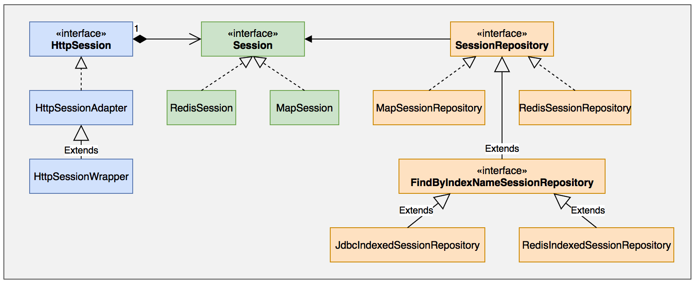
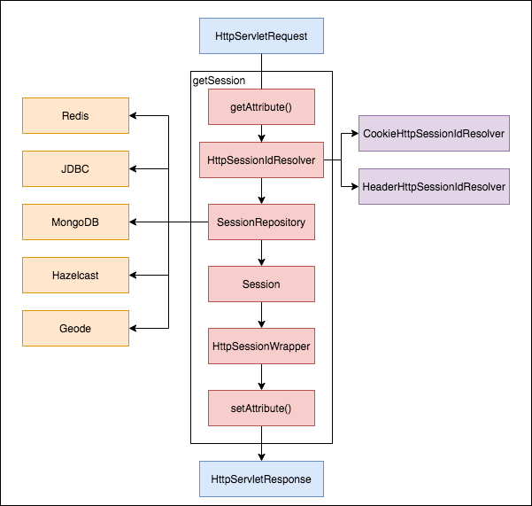

## Spring Session 架构及应用场景

#### 为什么要spring-session

在传统单机web应用中，一般使用tomcat/jetty等web容器时，用户的session都是由容器管理。浏览器使用cookie中记录sessionId，容器根据sessionId判断用户是否存在会话session。这里的限制是，session存储在web容器中，被单台服务器容器管理。

但是网站主键演变，分布式应用和集群是趋势（提高性能）。此时用户的请求可能被负载分发至不同的服务器，此时传统的web容器管理用户会话session的方式即行不通。除非集群或者分布式web应用能够共享session，尽管tomcat等支持这样做。但是这样存在以下两点问题：

1、需要侵入web容器，提高问题的复杂

2、web容器之间同步session，内存消耗大，同步有延迟。

基于这些，必须提供新的可靠的集群分布式/集群session的解决方案，突破traditional-session单机限制（即web容器session方式，下面简称traditional-session），spring-session应用而生。

spring-session的核心思想在于此：将session从web容器中剥离，存储在独立的存储服务器中。目前支持多种形式的session存储器：Redis、Database、MogonDB等。session的管理责任委托给spring-session承担。当request进入web容器，根据request获取session时，由spring-session负责存存储器中获取session，如果存在则返回，如果不存在则创建并持久化至存储器中。

#### SR340规范与spring-session的透明继承

JSR340是Java Servlet 3.1的规范提案，其中定义了大量的api，包括：servlet、servletRequest/HttpServletRequest/HttpServletRequestWrapper、servletResponse/HttpServletResponse/HttpServletResponseWrapper、Filter、Session等，是标准的web容器需要遵循的规约，如tomcat/jetty/weblogic等等。

在日常的应用开发中，develpers也在频繁的使用servlet-api，比如：

以下的方式获取请求的session：

```java
HttpServletRequest request = ... 
HttpSession session = request.getSession(false);
```

其中HttpServletRequest和HttpSession都是servlet规范中定义的接口，web容器实现的标准。那如果引入spring-session，要如何获取session？

1、遵循servlet规范，同样方式获取session，对应用代码无侵入且对于developers透明化

2、全新实现一套session规范，定义一套新的api和session管理机制

两种方案都可以实现，但是显然第一种更友好，且具有兼容性。spring-session正是第一种方案的实现。

实现第一种方案的关键点在于做到透明和兼容

1、接口适配：仍然使用HttpServletRequest获取session，获取到的session仍然是HttpSession类型——**适配器模式**

2、类型包装增强：Session不能存储在web容器内，要外化存储——**装饰模式**

让人兴奋的是，以上的需求在Servlet规范中的扩展性都是予以支持！Servlet规范中定义一系列的接口都是支持扩展，同时提供Filter支撑扩展点。建议阅读《JavaTM Servlet Specification》。

### Spring Session探索

主要从以下两个方面来说spring-session：

#### 特点

spring-session在无需绑定web容器的情况下提供对集群session的支持。并提供对以下情况的透明集成：

1、HttpSession：容许替换web容器的HttpSession

2、WebSocket：使用WebSocket通信时，提供Session的活跃

3、WebSession：容许替换webflux的webSession

#### 核心 API

spring session 核心 API 只有两个：

1、Session：session 对象

2、SessionRepository：session 的生命周期管理

```java
public interface Session {
  String getId();
	String changeSessionId();
	<T> T getAttribute(String attributeName);
	Set<String> getAttributeNames();
	void setAttribute(String attributeName, Object attributeValue);
	void removeAttribute(String attributeName);
	Instant getCreationTime();
	void setLastAccessedTime(Instant lastAccessedTime);
	Instant getLastAccessedTime();
	void setMaxInactiveInterval(Duration interval);
	Duration getMaxInactiveInterval();
	boolean isExpired();
}

public interface SessionRepository<S extends Session> {
	S createSession();
	void save(S session);
	S findById(String id);
	void deleteById(String id);
}
```


#### servlet session 与 spring-session 关系




#### webflux 与 spring session 的关系


## 基于 Servlet 的 Spring Session 实现


### 思考题

1、spring session 被保存了两次，为什么？


### 背景

在对 Servelt 的 session 管理中，通过过滤器 SessionRepositoryFilter 来实现。SessionRepositoryFilter是一个标准过滤器，符合Servlet的规范定义，用来修改包装请求和响应。SessionRepositoryFilter 的实现包括三部分

1、SessionRepositoryFilter 注册到 Filter 链

2、SessionRepositoryFilter 注册为 Bean

3、请求过程中获取 session

4、请求结束保存 session

### 1、注册到 Filter 链

通过 AbstractHttpSessionApplicationInitializer 应用启动的时候，将 SessionRepositoryFilter 注册到过滤器。

注册到 Filter 链的 Filter 为 DelegatingFilterProxy，DelegatingFilterProxy 从 WebApplicationContext 获取 SessionRepositoryFilter实例，那么，SessionRepositoryFilter 必须注册为 Spring Bean。

### 2、注册为 Bean

通过 @EnableSpringHttpSession 注解将 SessionRepositoryFilter 注册为 Bean。该注解导入 SpringHttpSessionConfiguration 配置类。SpringHttpSessionConfiguration 注册 Bean：

1、SessionRepositoryFilter

2、SessionEventHttpSessionListenerAdapter

作为使用者，必须提供的 Bean 为 SessionRepository 和 HttpSessionListener，可选提供 HttpSessionIdResolver 和 CookieSerializer

### 3、获取 Session

传统 Web 容器获取HttpSession方法是

```java
HttpServletRequest request = ...;
HttpSession session = request.getSession(true);
```

对应 spring session，SessionRepositoryRequestWrapper/SessionRepositoryResponseWrapper/HttpSessionWrapper 分别是 HttpServerletRequest/HttpServletResponse/HttpSession的包装器：包装原有的HttpServletRequest、HttpServletResponse，实现切换Session和透明继承HttpSession的关键之所在。

SessionRepositoryRequestWrapper 覆写了 HttpServletRequestWrapper 的 session 相关实现。其中，最关键的是 getSession 方法。

```java
	@Override
	protected void doFilterInternal(HttpServletRequest request, HttpServletResponse response, FilterChain filterChain)
			throws ServletException, IOException {
		request.setAttribute(SESSION_REPOSITORY_ATTR, this.sessionRepository);
    // 对请求进行包装，后续获取session，通过该 wrapper 实现
		SessionRepositoryRequestWrapper wrappedRequest = new SessionRepositoryRequestWrapper(request, response);
		// 对应答进行包装
    SessionRepositoryResponseWrapper wrappedResponse = new SessionRepositoryResponseWrapper(wrappedRequest,
				response);
		try {
			filterChain.doFilter(wrappedRequest, wrappedResponse);
		}
		finally {
      // 保存 session 中，并设置 session 到 response 头中
			wrappedRequest.commitSession();
		}
	}
```

**getSession**



1、从 request 的 CURRENT_SESSION_ATTR 属性中获取 HttpSessionWrapper，如果获取到，返回，否则继续下一步

2、httpSessionIdResolver 从 request 中解析 sessionId。其中 httpSessionIdResolver 支持 CookieHttpSessionIdResolver 和 HeaderHttpSessionIdResolver

3、从 sessionRepository 中根据 sessionId 查找 HttpSessionWrapper。如果找到，返回；否则继续下一步

4、通过 sessionRepository 创建 Session，并用 HttpSessionWrapper  包装，并保存到 request 的 attribte  属性 CURRENT_SESSION_ATTR 中，下次可以直接获取。

对应源码如下：

```java
private final class SessionRepositoryRequestWrapper extends HttpServletRequestWrapper {
   private final HttpServletResponse response;

   private S requestedSession;

   private boolean requestedSessionCached;

   private String requestedSessionId;

   private Boolean requestedSessionIdValid;

   private boolean requestedSessionInvalidated;

   private SessionRepositoryRequestWrapper(HttpServletRequest request, HttpServletResponse response) {
      super(request);
      this.response = response;
   }

   /**
    * 保存 session
    */
   private void commitSession() {
      // 从 request 的 CURRENT_SESSION_ATTR 属性中获取 HttpSessionWrapper，如果获取到，返回，否则继续下一步
      HttpSessionWrapper wrappedSession = getCurrentSession();
      if (wrappedSession == null) {
         if (isInvalidateClientSession()) {
            SessionRepositoryFilter.this.httpSessionIdResolver.expireSession(this, this.response);
         }
      }
      else {
         S session = wrappedSession.getSession();
         clearRequestedSessionCache();
         SessionRepositoryFilter.this.sessionRepository.save(session);
         String sessionId = session.getId();
         if (!isRequestedSessionIdValid() || !sessionId.equals(getRequestedSessionId())) {
            SessionRepositoryFilter.this.httpSessionIdResolver.setSessionId(this, this.response, sessionId);
         }
      }
   }

   @SuppressWarnings("unchecked")
   private HttpSessionWrapper getCurrentSession() {
      return (HttpSessionWrapper) getAttribute(CURRENT_SESSION_ATTR);
   }

   /**
    * 设置到属性 CURRENT_SESSION_ATTR 中
    */
   private void setCurrentSession(HttpSessionWrapper currentSession) {
      if (currentSession == null) {
         removeAttribute(CURRENT_SESSION_ATTR);
      }
      else {
         setAttribute(CURRENT_SESSION_ATTR, currentSession);
      }
   }

   @Override
   public HttpSessionWrapper getSession(boolean create) {
      // 从属性 CURRENT_SESSION_ATTR 中取
      HttpSessionWrapper currentSession = getCurrentSession();
      if (currentSession != null) {
         return currentSession;
      }
      // 从 sessionRepository 中根据 sessionId 查找 HttpSessionWrapper。如果找到，设置CURRENT_SESSION_ATTR 属性后，返回；否则继续下一步
      S requestedSession = getRequestedSession();
      if (requestedSession != null) {
         if (getAttribute(INVALID_SESSION_ID_ATTR) == null) {
            requestedSession.setLastAccessedTime(Instant.now());
            this.requestedSessionIdValid = true;
            currentSession = new HttpSessionWrapper(requestedSession, getServletContext());
            currentSession.markNotNew();
            setCurrentSession(currentSession);
            return currentSession;
         }
      }
      else {
         // session 过期时，会走到这里
         setAttribute(INVALID_SESSION_ID_ATTR, "true");
      }
      if (!create) {
         return null;
      }
      if (SessionRepositoryFilter.this.httpSessionIdResolver instanceof CookieHttpSessionIdResolver
            && this.response.isCommitted()) {
         throw new IllegalStateException("Cannot create a session after the response has been committed");
      }
      // 当 create 为 true 时，通过 sessionRepository 创建 Session，并用 HttpSessionWrapper  包装，并保存到 request 的 attribte  属性 CURRENT_SESSION_ATTR 中，下次可以直接获取。
      S session = SessionRepositoryFilter.this.sessionRepository.createSession();
      session.setLastAccessedTime(Instant.now());
      currentSession = new HttpSessionWrapper(session, getServletContext());
      setCurrentSession(currentSession);
      return currentSession;
   }

   @Override
   public HttpSessionWrapper getSession() {
      return getSession(true);
   }

   private S getRequestedSession() {
      if (!this.requestedSessionCached) {
         List<String> sessionIds = SessionRepositoryFilter.this.httpSessionIdResolver.resolveSessionIds(this);
         for (String sessionId : sessionIds) {
            if (this.requestedSessionId == null) {
               this.requestedSessionId = sessionId;
            }
            S session = SessionRepositoryFilter.this.sessionRepository.findById(sessionId);
            if (session != null) {
               this.requestedSession = session;
               this.requestedSessionId = sessionId;
               break;
            }
         }
         this.requestedSessionCached = true;
      }
      return this.requestedSession;
   }

   private void clearRequestedSessionCache() {
      this.requestedSessionCached = false;
      this.requestedSession = null;
      this.requestedSessionId = null;
   }
}
```


4、保存 Session

SessionRepositoryFilter在包装HttpServletRequest后，执行FilterChain中使用finally保证请求的Session始终session会被提交，此提交操作中将sesionId设置到response的head中并将session持久化至存储器中。

```java
		private void commitSession() {
			HttpSessionWrapper wrappedSession = getCurrentSession();
      // 如果当前session为空，则删除cookie中的相应的sessionId
			if (wrappedSession == null) {
				if (isInvalidateClientSession()) {
					SessionRepositoryFilter.this.httpSessionIdResolver.expireSession(this, this.response);
				}
			}
			else {
				S session = wrappedSession.getSession();
				clearRequestedSessionCache();
        // 持久化spring session至存储器
				SessionRepositoryFilter.this.sessionRepository.save(session);
				String sessionId = session.getId();
        // 如果是新创建spring session，sessionId到response的cookie
				if (!isRequestedSessionIdValid() || !sessionId.equals(getRequestedSessionId())) {
					SessionRepositoryFilter.this.httpSessionIdResolver.setSessionId(this, this.response, sessionId);
				}
			}
		}
```


详细参考 [这里](https://github.com/spring-projects/spring-session/issues/198) [这里](https://github.com/spring-projects/spring-session/issues/1183)

### 可扩展性

SessionRepositoryFilter 依赖 HttpSessionIdResolver，HttpSessionIdResolver 依赖 CookieSerializer。

HttpSessionIdResolver 和 CookieSerializer 都提供默认实现，用户可以自定义自己的实现。


## 基于 WebFlux 的 Session 实现分析

核心包括 Session 和  ReactiveSessionRepository  两个基类，核心是重写了 WebSession 和 WebSessionStore 的实现。整个 session 的管理，仍然依赖 WebSessionManager。

### @EnableSpringWebSession

初始化 WebSessionManager 和 WebSessionIdResolver

### 实现 WebSession

通过 ReactiveSessionRepository、 Session 和  Map 实现 WebSession 接口

```java
private class SpringSessionWebSession implements WebSession {

   private final S session;

   private final Map<String, Object> attributes;

   private AtomicReference<State> state = new AtomicReference<>();

   SpringSessionWebSession(S session, State state) {
      Assert.notNull(session, "session cannot be null");
      this.session = session;
      this.attributes = new SpringSessionMap(session);
      this.state.set(state);
   }

   @Override
   public String getId() {
      return this.session.getId();
   }

   @Override
   public Mono<Void> changeSessionId() {
      return Mono.defer(() -> {
         this.session.changeSessionId();
         return save();
      });
   }

   @Override
   public Map<String, Object> getAttributes() {
      return this.attributes;
   }

   @Override
   public void start() {
      this.state.compareAndSet(State.NEW, State.STARTED);
   }

   @Override
   public boolean isStarted() {
      State value = this.state.get();
      return (State.STARTED.equals(value) || (State.NEW.equals(value) && !getAttributes().isEmpty()));
   }

   @Override
   public Mono<Void> invalidate() {
      this.state.set(State.EXPIRED);
      return SpringSessionWebSessionStore.this.sessions.deleteById(this.session.getId());
   }

   @Override
   public Mono<Void> save() {
      return SpringSessionWebSessionStore.this.sessions.save(this.session);
   }

   @Override
   public boolean isExpired() {
      if (this.state.get().equals(State.EXPIRED)) {
         return true;
      }
      if (this.session.isExpired()) {
         this.state.set(State.EXPIRED);
         return true;
      }
      return false;
   }

   @Override
   public Instant getCreationTime() {
      return this.session.getCreationTime();
   }

   @Override
   public Instant getLastAccessTime() {
      return this.session.getLastAccessedTime();
   }

   @Override
   public Duration getMaxIdleTime() {
      return this.session.getMaxInactiveInterval();
   }

   @Override
   public void setMaxIdleTime(Duration maxIdleTime) {
      this.session.setMaxInactiveInterval(maxIdleTime);
   }
}
```


### 实现 WebSessionStore

 通过  ReactiveSessionRepository 实现 WebSessionStore 接口

```java
public class SpringSessionWebSessionStore<S extends Session> implements WebSessionStore {

	private final ReactiveSessionRepository<S> sessions;

	private Clock clock = Clock.system(ZoneOffset.UTC);

	public SpringSessionWebSessionStore(ReactiveSessionRepository<S> reactiveSessionRepository) {
		Assert.notNull(reactiveSessionRepository, "reactiveSessionRepository cannot be null");
		this.sessions = reactiveSessionRepository;
	}
  
	public void setClock(Clock clock) {
		Assert.notNull(clock, "clock cannot be null");
		this.clock = clock;
	}

	@Override
	public Mono<WebSession> createWebSession() {
		return this.sessions.createSession().map(this::createSession);
	}

	@Override
	public Mono<WebSession> updateLastAccessTime(WebSession session) {
		@SuppressWarnings("unchecked")
		SpringSessionWebSession springSessionWebSession = (SpringSessionWebSession) session;
		springSessionWebSession.session.setLastAccessedTime(this.clock.instant());
		return Mono.just(session);
	}

	@Override
	public Mono<WebSession> retrieveSession(String sessionId) {
		return this.sessions.findById(sessionId)
				.doOnNext((session) -> session.setLastAccessedTime(this.clock.instant())).map(this::existingSession);
	}

	@Override
	public Mono<Void> removeSession(String sessionId) {
		return this.sessions.deleteById(sessionId);
	}

	private SpringSessionWebSession createSession(S session) {
		return new SpringSessionWebSession(session, State.NEW);
	}

	private SpringSessionWebSession existingSession(S session) {
		return new SpringSessionWebSession(session, State.STARTED);
	}
}
```


## Spring Redis Sessionn


### 思考题

1、spring session 为 redis 实现的时候，是如何存储的？

2、redis 的过期存储无法做到及时性，spring session 如何解决这个问题的？

### 初始化

通过 @EnableRedisHttpSession 开启 Redis 对 spring session 的支持。这里通过导入 RedisHttpSessionConfiguration 注册了 Bean RedisIndexedSessionRepository 和RedisMessageListenerContainer，分别实现了 SessionRepository 和 HttpSessionListener。

#### EnableRedisHttpSession

```java
@Retention(RetentionPolicy.RUNTIME)
@Target(ElementType.TYPE)
@Documented
@Import(RedisHttpSessionConfiguration.class)
@Configuration(proxyBeanMethods = false)
public @interface EnableRedisHttpSession {
   // 默认 30 分钟
   int maxInactiveIntervalInSeconds() default MapSession.DEFAULT_MAX_INACTIVE_INTERVAL_SECONDS;

   // 用于区别不同的应用
   String redisNamespace() default RedisIndexedSessionRepository.DEFAULT_NAMESPACE;

   // 保持默认值即可，在异常场景下，可能导致数据丢失，从 session 的角度来说是可以接受的。
   FlushMode flushMode() default FlushMode.ON_SAVE;

   String cleanupCron() default RedisHttpSessionConfiguration.DEFAULT_CLEANUP_CRON;

   SaveMode saveMode() default SaveMode.ON_SET_ATTRIBUTE;
}
```

#### RedisHttpSessionConfiguration

```java
public class RedisHttpSessionConfiguration extends SpringHttpSessionConfiguration
      implements BeanClassLoaderAware, EmbeddedValueResolverAware, ImportAware {
  @Bean
	public RedisIndexedSessionRepository sessionRepository() {
    RedisTemplate<Object, Object> redisTemplate = createRedisTemplate();
		RedisIndexedSessionRepository sessionRepository = new RedisIndexedSessionRepository(redisTemplate);
		sessionRepository.setApplicationEventPublisher(this.applicationEventPublisher);
		if (this.indexResolver != null) {
			sessionRepository.setIndexResolver(this.indexResolver);
		}
		if (this.defaultRedisSerializer != null) {
			sessionRepository.setDefaultSerializer(this.defaultRedisSerializer);
		}
    // 来自@EnableRedisHttpSession 
		sessionRepository.setDefaultMaxInactiveInterval(this.maxInactiveIntervalInSeconds);
		if (StringUtils.hasText(this.redisNamespace)) {
			sessionRepository.setRedisKeyNamespace(this.redisNamespace);
		}
    // 来自@EnableRedisHttpSession 
		sessionRepository.setFlushMode(this.flushMode);
    // 来自@EnableRedisHttpSession 
		sessionRepository.setSaveMode(this.saveMode);
		int database = resolveDatabase();
		sessionRepository.setDatabase(database);
		this.sessionRepositoryCustomizers
				.forEach((sessionRepositoryCustomizer) -> sessionRepositoryCustomizer.customize(sessionRepository));
		return sessionRepository;
  }
  
  @Bean
	public RedisMessageListenerContainer springSessionRedisMessageListenerContainer(
			RedisIndexedSessionRepository sessionRepository) {
    RedisMessageListenerContainer container = new RedisMessageListenerContainer();
		container.setConnectionFactory(this.redisConnectionFactory);
		if (this.redisTaskExecutor != null) {
			container.setTaskExecutor(this.redisTaskExecutor);
		}
		if (this.redisSubscriptionExecutor != null) {
			container.setSubscriptionExecutor(this.redisSubscriptionExecutor);
		}
		container.addMessageListener(sessionRepository,
				Arrays.asList(new ChannelTopic(sessionRepository.getSessionDeletedChannel()),
						new ChannelTopic(sessionRepository.getSessionExpiredChannel())));
		container.addMessageListener(sessionRepository,
				Collections.singletonList(new PatternTopic(sessionRepository.getSessionCreatedChannelPrefix() + "*")));
		return container;
  }
  
  @Bean
	public InitializingBean enableRedisKeyspaceNotificationsInitializer() {
		return new EnableRedisKeyspaceNotificationsInitializer(this.redisConnectionFactory, this.configureRedisAction);
	}
  
  // 解析 @EnableRedisHttpSession 设置属性
  @Override
	@SuppressWarnings("deprecation")
	public void setImportMetadata(AnnotationMetadata importMetadata) {
		Map<String, Object> attributeMap = importMetadata
				.getAnnotationAttributes(EnableRedisHttpSession.class.getName());
		AnnotationAttributes attributes = AnnotationAttributes.fromMap(attributeMap);
		this.maxInactiveIntervalInSeconds = attributes.getNumber("maxInactiveIntervalInSeconds");
		String redisNamespaceValue = attributes.getString("redisNamespace");
		if (StringUtils.hasText(redisNamespaceValue)) {
			this.redisNamespace = this.embeddedValueResolver.resolveStringValue(redisNamespaceValue);
		}
		FlushMode flushMode = attributes.getEnum("flushMode");
		RedisFlushMode redisFlushMode = attributes.getEnum("redisFlushMode");
		if (flushMode == FlushMode.ON_SAVE && redisFlushMode != RedisFlushMode.ON_SAVE) {
			flushMode = redisFlushMode.getFlushMode();
		}
		this.flushMode = flushMode;
		this.saveMode = attributes.getEnum("saveMode");
		String cleanupCron = attributes.getString("cleanupCron");
		if (StringUtils.hasText(cleanupCron)) {
			this.cleanupCron = cleanupCron;
		}
	}
}
```


此时作为使用方，必须实现 

```
RedisConnectionFactory：redis 连接工厂
```

可选实现

```
SessionRepositoryCustomizer：对 RedisIndexedSessionRepository 进行修改，根据情况实现。
ConfigureRedisAction：
Executor：Bean 名称为 springSessionRedisTaskExecutor。默认是 SimpleAsyncTaskExecutor，建议自己实现
Executor：Bean 名称为 springSessionRedisSubscriptionExecutor。默认是 SimpleAsyncTaskExecutor，建议实现。
RedisSerializer：Bean 名称为 springSessionDefaultRedisSerializer，默认序列化是 JDK 序列化，因此建议实现。
```


### 创建 Session

RedisSession 组合 MapSession 避免在每次读属性的时候都查 redis。这个优化的思路类似二级缓存，MapSession 没有过期和容量控制，容易导致内存溢出。

```java
	public RedisSession createSession() {
		MapSession cached = new MapSession();
		if (this.defaultMaxInactiveInterval != null) {
			cached.setMaxInactiveInterval(Duration.ofSeconds(this.defaultMaxInactiveInterval));
		}
		RedisSession session = new RedisSession(cached, true);
		session.flushImmediateIfNecessary();
		return session;
	}
```


### 保存 Session

每次保存

1、{keynamespace}:sessions:{sessionId}: creationTime（单位ms）、lastAccessedTime（单位 ms）、 maxInactiveInterval（单位 sec） 等其他自定义属性（自定义属性以 sessionAttr: 为前缀）

2、spring:session:{sessionId} 的过期时间为 lastAccessedTime + maxInactiveInterval （注：由于使用了绝对时间，如果存在时间跳变，会有问题。）

```java
	@Override
	public void save(RedisSession session) {
		session.save();
		if (session.isNew) {
			String sessionCreatedKey = getSessionCreatedChannel(session.getId());
			this.sessionRedisOperations.convertAndSend(sessionCreatedKey, session.delta);
			session.isNew = false;
		}
	}

		private void save() {
			saveChangeSessionId();
			saveDelta();
		}

		private void saveDelta() {
			if (this.delta.isEmpty()) {
				return;
			}
			String sessionId = getId();
			getSessionBoundHashOperations(sessionId).putAll(this.delta);
      //...
			this.delta = new HashMap<>(this.delta.size());
			Long originalExpiration = (this.originalLastAccessTime != null)
					? this.originalLastAccessTime.plus(getMaxInactiveInterval()).toEpochMilli() : null;
		RedisIndexedSessionRepository.this.expirationPolicy.onExpirationUpdated(originalExpiration, this);
		}

		private void saveChangeSessionId() {
			String sessionId = getId();
			if (sessionId.equals(this.originalSessionId)) {
				return;
			}
			if (!this.isNew) {
				String originalSessionIdKey = getSessionKey(this.originalSessionId);
				String sessionIdKey = getSessionKey(sessionId);				
      RedisIndexedSessionRepository.this.sessionRedisOperations.rename(originalSessionIdKey,
							sessionIdKey);
				String originalExpiredKey = getExpiredKey(this.originalSessionId);
				String expiredKey = getExpiredKey(sessionId);
				RedisIndexedSessionRepository.this.sessionRedisOperations.rename(originalExpiredKey, expiredKey);
			}
			this.originalSessionId = sessionId;
		}
```


### 读取 Session


```java
	@Override
	public RedisSession findById(String id) {
		return getSession(id, false);
	}

  private RedisSession getSession(String id, boolean allowExpired) {
		Map<Object, Object> entries = getSessionBoundHashOperations(id).entries();
		if (entries.isEmpty()) {
			return null;
		}
		MapSession loaded = loadSession(id, entries);
		if (!allowExpired && loaded.isExpired()) {
			return null;
		}
		RedisSession result = new RedisSession(loaded, false);
		result.originalLastAccessTime = loaded.getLastAccessedTime();
		return result;
	}

	private MapSession loadSession(String id, Map<Object, Object> entries) {
		MapSession loaded = new MapSession(id);
		for (Map.Entry<Object, Object> entry : entries.entrySet()) {
			String key = (String) entry.getKey();
			if (RedisSessionMapper.CREATION_TIME_KEY.equals(key)) {
				loaded.setCreationTime(Instant.ofEpochMilli((long) entry.getValue()));
			}
			else if (RedisSessionMapper.MAX_INACTIVE_INTERVAL_KEY.equals(key)) {
				loaded.setMaxInactiveInterval(Duration.ofSeconds((int) entry.getValue()));
			}
			else if (RedisSessionMapper.LAST_ACCESSED_TIME_KEY.equals(key)) {
				loaded.setLastAccessedTime(Instant.ofEpochMilli((long) entry.getValue()));
			}
			else if (key.startsWith(RedisSessionMapper.ATTRIBUTE_PREFIX)) {
				loaded.setAttribute(key.substring(RedisSessionMapper.ATTRIBUTE_PREFIX.length()), entry.getValue());
			}
		}
		return loaded;
	}
```


### 删除 session

根据 sessionId 删除即可

```java
	public void deleteById(String sessionId) {
		String key = getSessionKey(sessionId);
		this.sessionRedisOperations.delete(key);
	}
```


### session 的过期

Redis的强大之处在于支持KeySpace Notifiction——键空间通知。即可以监视某个key的变化，如删除、更新、过期。当key发生上述行为是，以便可以接受到变化的通知做出相应的处理。Redis中处理key的过期有[两种方式](http://redis.cn/commands/expire.html)：

1、当访问时发现其过期

2、Redis后台逐步查找过期键

后台逐步查找过期键，无法保证key的过期时间抵达后立即生成过期事件。为了保证 key 过期能够立即通知，

**spring-session 处理方式**

1、 增加 spring:session:sessions:expires:${sessionId} 和 spring:session:expirations:1439245080000

2、 spring-session 中有个定时任务，每个整分钟都会查询相应的 spring:session:expirations:整分钟的时间戳 中的过期SessionId，

3、访问一次这个 sessionId，即 spring:session:sessions:expires:${sessionId}，以便能够让Redis及时的产生key过期事件——即Session过期事件。 

相关源码如下

```java
	void cleanExpiredSessions() {
		long now = System.currentTimeMillis();
		long prevMin = roundDownMinute(now);

		if (logger.isDebugEnabled()) {
			logger.debug("Cleaning up sessions expiring at " + new Date(prevMin));
		}

		String expirationKey = getExpirationKey(prevMin);
		Set<Object> sessionsToExpire = this.redis.boundSetOps(expirationKey).members();
		this.redis.delete(expirationKey);
		for (Object session : sessionsToExpire) {
			String sessionKey = getSessionKey((String) session);
			touch(sessionKey);
		}
	}

	/**
	 * By trying to access the session we only trigger a deletion if it the TTL is
	 * expired. This is done to handle
	 * https://github.com/spring-projects/spring-session/issues/93
	 * @param key the key
	 */
	private void touch(String key) {
		this.redis.hasKey(key);
	}
```


redis hash：key 为 `{namespace:spring:session}:sessions:{sessionId}`

redis set ：key 为 `{namespace:spring:session}:sessions:expirations:{expiration}` 其中 expiration 为 key 过期的当前分钟；value 为 `expires:{sessionId}` 的集合

redis set： key 为 `{namespace:spring:session}:sessions:expires:{sessionId}`  value 为空字符，过期时间为 MaxInactiveInterval

redis set：key 为 `{namespace:spring:session}:index:FindByIndexNameSessionRepository.PRINCIPAL_NAME_INDEX_NAME:{principalName}`  value 为 sessionId 集合


### session 事件机制

1、通过 ConfigureNotifyKeyspaceEventsAction 注册 redis 配置 notify-keyspace-events: Egx

2、每个实例的 RedisIndexedSessionRepository 实现 MessageListener，监听消息。

3、创建事件

3.1、RedisIndexedSessionRepository.save() 发布创建事件通过 pub/sub 发布`{namespace}:event:{database}:created:{sessionId}` 事件

3.2、RedisIndexedSessionRepository.onMessage()  接收 `{namespace}:event:{database}:created:{sessionId}` Redis 事件，发布 spring  SessionCreatedEvent 事件

4、删除事件：RedisIndexedSessionRepository.onMessage()  接收 channel  `__keyevent@ + this.database + __:del` Redis 事件，发布 spring  SessionDeletedEvent 事件

5、过期事件：RedisIndexedSessionRepository.onMessage()  接收 channel `__keyevent@ + this.database + __:expired` Redis 事件，发布 spring  SessionExpiredEvent 事件


### spring  boot 自动配置

SessionStoreMappings默认注册了Redis、MongoDB、JDBC、Hazelcast，通过 spring.session.store-type 决定使用哪种存储。 

1、自动配置类

SessionAutoConfiguration

RedisHttpSessionConfiguration

2、相关配置类

SessionProperties

RedisSessionProperties

