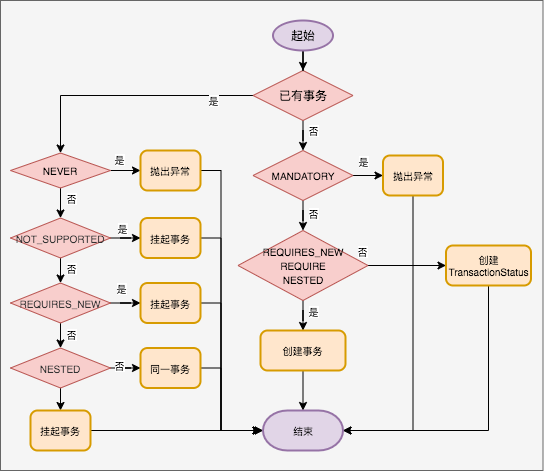

Spring-transactional


## 目标

理解 Spring 的工作原理

掌握 Spring 事务的最佳实践

## 疑问

1、Spring 事务注解是如何工作的？

2、动态数据源场景下如何保证事务注解如何工作？

3、为什么同一个类中，一个方法调用另一个加了事务注解@Transactional注解的方法，事务却没有生效？

4、事务失效的场景？

5、不需要事务管理的(只查询的)方法，如何操作？

6、如何控制事务嵌套事务的回滚？

## 背景知识

### 事务的 ACID

1. 原子性（Atomicity）：一个事务中的所有操作，要么全部完成，要么全部不完成，不会结束在中间某个环节。事务在执行过程中发生错误，会被回滚（Rollback）到事务开始前的状态，就像这个事务从来没有执行过一样。
2. 一致性（Consistency）：在事务开始之前和事务结束以后，数据库的完整性没有被破坏。
3. 事务隔离（Isolation）：数据库允许多个并发事务同时对其数据进行读写和修改，隔离性可以防止多个事务并发执行时由于交叉执行而导致数据的不一致。
4. 持久性（Durability）：事务处理结束后，对数据的修改就是永久的，即便系统故障也不会丢失。


### 事务的隔离级别

1. 未提交读（Read uncommitted），最低的隔离级别，允许“脏读”（dirty reads），事务可以看到其他事务“尚未提交”的修改。如果另一个事务回滚，那么当前事务读到的数据就是脏数据。
2. 读提交（read committed），一个事务可能会遇到不可重复读（Non Repeatable Read）的问题。不可重复读是指，在一个事务内，多次读同一数据，在这个事务还没有结束时，如果另一个事务恰好修改了这个数据，那么，在第一个事务中，两次读取的数据就可能不一致。
3. 可重复读（repeatable read），一个事务可能会遇到幻读（Phantom Read）的问题。幻读是指，在一个事务中，第一次查询某条记录，发现没有，但是，当试图更新这条不存在的记录时，竟然能成功，并且，再次读取同一条记录，它就神奇地出现了。
4. 串行化（Serializable），最严格的隔离级别，所有事务按照次序依次执行，因此，脏读、不可重复读、幻读都不会出现。虽然 Serializable 隔离级别下的事务具有最高的安全性，但是，由于事务是串行执行，所以效率会大大下降，应用程序的性能会急剧降低。如果没有特别重要的情景，一般都不会使用 Serializable 隔离级别。 

## Spring 事务

### 操作方式

| 维度 | 编程方式 | 注解方式 |
| ---- | -------- | -------- |
| 耦合 | 高       | 低       |
| 粒度 | 代码级别 | 方法级别 |

虽然注解的方式可以满足绝大多数场景，但是正确使用注解的前提是理解编程方式，注解只是将编程方式相关代码与业务做了解耦。


#### 注解方式

1、@EnableTransactionManagement

2、对应需要回滚的方法增加 @Transactional 注解

注意点：参考事务不生效的原因

#### 编程方式

略


### @Transactional 注解

```java
@Target({ElementType.TYPE, ElementType.METHOD})
@Retention(RetentionPolicy.RUNTIME)
@Inherited
@Documented
public @interface Transactional {
    @AliasFor("transactionManager")
    String value() default "";

    @AliasFor("value")
    String transactionManager() default "";

    Propagation propagation() default Propagation.REQUIRED;

    Isolation isolation() default Isolation.DEFAULT;

    int timeout() default -1;

    boolean readOnly() default false;

    Class<? extends Throwable>[] rollbackFor() default {};

    String[] rollbackForClassName() default {};

    Class<? extends Throwable>[] noRollbackFor() default {};

    String[] noRollbackForClassName() default {};
}
```


### 事务的传播行为

Spring事务有7种传播行为:

1、PROPAGATION_REQUIRED 支持当前事务，如果当前没有事务，就新建一个事务。这是最常见的选择。

2、PROPAGATION_SUPPORTS 支持当前事务，如果当前没有事务，就以非事务方式执行

3、PROPAGATION_MANDATORY 支持当前事务，如果当前没有事务，就抛出异常。

4、PROPAGATION_REQUIRES_NEW 新建事务，如果当前存在事务，把当前事务挂起。仅 JTA 事务管理器支持。

5、PROPAGATION_NOT_SUPPORTED 以非事务方式执行操作，如果当前存在事务，就把当前事务挂起。不是所有事务管理器都支持。比如 JDBC 就不支持。JTA 支持。

6、PROPAGATION_NEVER 以非事务方式执行，如果当前存在事务，则抛出异常。

7、PROPAGATION_NESTED 如果一个活动的事务存在，则运行在一个嵌套的事务中。如果没有活动事务, 则按PROPAGATION_REQUIRED 属性执行。不是所有的事务管理器都支持。其中JDBC、部分JTA事务管理器支持。



举例

A 类的方法 A 调用B 类的方法 B，其中方法 B 增加如下事务传播行为

| 传播行为      | A 类方法 A | B类方法 B             | 结果                        |
| ------------- | ---------- | --------------------- | --------------------------- |
| REQUIRED      | 处于事务   | REQUIRED类型事务      | A、B 为同一事务             |
| REQUIRED      | 没有事务   | REQUIRED类型事务      | A 没有事务，B 为新事务      |
| SUPPORTS      | 处于事务   | SUPPORTS类型事务      | A、B 处于同一事务           |
| SUPPORTS      | 没有事务   | SUPPORTS类型事务      | A、B 都没有事务             |
| MANDATORY     | 处于事务   | MANDATORY类型事务     | A、B 处于同一事务           |
| MANDATORY     | 没有事务   | MANDATORY类型事务     | 抛出异常                    |
| REQUIRES_NEW  | 处于事务   | REQUIRES_NEW类型事务  | 挂起 A 事务，B 为单独新事务 |
| REQUIRES_NEW  | 没有事务   | REQUIRES_NEW类型事务  | A 没有事务，B 为新事务      |
| NOT_SUPPORTED | 处于事务   | NOT_SUPPORTED类型事务 | A 挂起，B 以非事务执行      |
| NOT_SUPPORTED | 没有事务   | NOT_SUPPORTED类型事务 | A、B 都没有在事务中         |
| NEVER         | 处于事务   | NEVER类型事务         | 抛出异常                    |
| NEVER         | 没有事务   | NEVER类型事务         | A、B 都没有在事务中         |
| NESTED        | 处于事务   | NESTED类型事务        | B开启新事务 嵌套在 A 事务中 |
| NESTED        | 没有事务   | NESTED类型事务        | A 没有事务，B 为新事务      |

注：B不管在不在事务，B 未捕获的异常满足 A 的回滚条件，会导致 A 回滚


### 事务隔离级别

Spring事务有5种隔离级别

| 隔离级别                   | 行为                             | 脏读 | 重复读 | 幻读 |
| -------------------------- | -------------------------------- | ---- | ------ | ---- |
| ISOLATION_DEFAULT          | 数据库默认隔离级别               |      |        |      |
| ISOLATION_READ_UNCOMMITTED | 读取未提交的更改                 | 是   | 是     | 是   |
| ISOLATION_READ_COMMITTED   | 读取已经提交的事务更改           | 否   | 是     | 是   |
| ISOLATION_REPEATABLE_READ  | 对相同字段的多次读取的结果是一致 | 否   | 否     | 是   |
| ISOLATION_SERIALIZABLE     | 事务被处理为顺序执行             | 否   | 否     | 否   |


### Spring事务不生效原因

基于上面的逻辑，梳理出常见的事务不生效的原因有：

- 数据库引擎不支持事务（innoDb支持事务，myisam不支持事务）
- @Transcational注解作用在public方法上，如果是非public则事务失效。如果要用在非 public 方法上，可以开启 AspectJ 代理模式。
- 没有被Spring管理，即没有在service接口上面加@Service，这样也会失效。
- 类内部自调用（A 方法调用 @Transactional 注解的方法 B），AOP代理不生效。解决办法是AopContext.currentProxy()。
- 初始化时不生效，比如在@PostConstruct中。依赖IoC逻辑将proxy完全初始化以提供能力。
- 如果在加有事务的方法内，使用了try…catch…语句块对异常进行了捕获，而catch语句块没有throw new RuntimeExecption异常，事务也不会回滚。
- 事务内抛出的异常不满足回滚条件。默认是 RuntimeException 和 Error 回滚
- Spring团队建议在具体的类（或类的方法）上使用 @Transactional 注解，而不要使用在类所要实现的任何接口上。在接口上使用 @Transactional 注解，只能当你设置了基于接口的代理时它才生效。因为注解是 不能继承 的，这就意味着如果正在使用基于类的代理时，那么事务的设置将不能被基于类的代理所识别，而且对象也将不会被事务代理所包装 
- SpringBoot项目中使用多数据源切换时，TransactionManager类中加载的是否是当前数据源。
- Spring项目中，使用低层级的数据源访问方式时，检查数据源封装是否是Spring事务支持的代理类。 

* 如果通过Mybatis等操作数据库，Spring的事务超时是无效的。


## 最佳实践

1、显示设置事务的异常处理规则

2、避免长事务

3、不要多线程使用线程

```java
public class UserService {
    @Autowired
    private UserMapper userMapper;
    @Autowired
    private RoleService roleService;

    @Transactional
    public void add(UserModel userModel) throws Exception {
        userMapper.insertUser(userModel);
        new Thread(() -> {
            roleService.doOtherThing();
        }).start();
    }
}

@Service
public class RoleService {

    @Transactional
    public void doOtherThing() {
        System.out.println("保存role表数据");
    }
}
```


### 关键概念

1、PlatformTransactionManager

是Spring对于事务模型的抽象，它代表事务的整体执行过程。通常事务都应用在关系型数据库中，Spring对于事务的读写的模型做了更高层次的抽象，使得其可以应用在任何需要数据一致性的场景

2、TransactionDefinition

事务的元信息定义

3、TransactionStatus

事务分为逻辑事务和物理事务，逻辑事务是指代码中事务的操作；物理事务是通过数据库连接来获取相关的物理的连接以及相关的数据库的事务。TransactionStatus是用来描述当前逻辑事务的执行情况。

持有事务对象 ，使用JDBC 事务时 ，事务对象为 DataSourceTransactionObject，

对保存点的支持，可以在应用程序中 通过 设置保存点 ，在事务回滚时，回滚到 保存点，而不是回滚部分。

4、TransationSynchronization 事务同步接口

事务同步回调接口，在事务 周期的各个点 执行回调 方法。比如 挂起 ，继续，提交前后 ，完成前后 。用于 管理 应用程序在事务周期中绑定的资源。在Spring - Mybatis 整合时，正式Mybatis 正式利用了TransationSynchronization同步器，才让Mybatis  的事务管理交给了 Spring 事务来管理。

5、TransactionSynchronizationManager 事务同步管理器

在事务运行过程中，需要保存一些状态，比如 数据库连接，

```text
ThreadLocal<Map<Object, Object>> resources - 应用代码随事务的声明周期绑定的对象  
ThreadLocal<Set<TransactionSynchronization>> synchronizations-使用的同步器，用于应用扩展  
ThreadLocal<String> currentTransactionName-事务的名称  
ThreadLocal<Boolean> currentTransactionReadOnly-事务是否是只读  
ThreadLocal<Integer> currentTransactionIsolationLevel-事务的隔离级别  
ThreadLocal<Boolean> actualTransactionActive-是否实际的开启了事务，如果加入 到 别的事务，就不是实际开启事务。
```

6、SuspendedResourceHolder 挂起的资源持有对象

在挂起一个事务时，用于记录被挂起事务的运行时信息，这些信息就是TransactionSynchronizationManager中记录的事务信息。然后将这些信息 保存在 新的DefaultTransactionStatus对象中，便于内部事务运行结束后，恢复外层事务。

### Spring 事务的核心API

事务操作相关的API：

- Spring事务@Enanle模块驱动 - @EnableTranSactionManagement
- Spring事务注解 - @Transactional
- Spring事务事件监听器 - @TransactionalEventListener

事务抽象相关的API

- Spring平台事务管理器 - PlatformTransactionManager
- Spring事务定义 - TransactionDefinition
- Spring事务状态 - TransactionStatus
- Spring事务代理配置 - ProxyTransactionManagementConfiguration

AOP相关的API：

- Spring事务PointcutAdvisor实现 - BeanFactoryTransactionAttrubuteSourceAdvisor

- Spring事务MethodInterceptor实现 - TransactionInterceptor

- Spring事务属性源 - TransactionAttributeSource

  

### 基于代理的事务实现机制

1、初始化事务拦截器：ProxyTransactionManagementConfiguration

2、扫描所有的类，找到 @Transactional 注解的方法。

3.1、方法是公共方法

3.2、通过事务解析器解析方法上存在 @Transactional 注解（优先级更高）或者方法所在的类存在 @Transactional 注解。

3.3、以 map 的形式保存，key 为 method 和 targetClass，value 为 TransactionAttribute。

4、执行拦截器的 invok 方法

4.1、根据 method，targetClass，找到 TransactionAttribute

4.2、从IOC 容器中根据 PlatformTransactionManager 类型的实现类初始化事务管理器。

5、事务管理

5.1、事务开始：获取连接、设置事务隔离级别、激活事务、事务只读处理、事务超时设置、事务绑定线程

5.2、准备事务同步处理

5.3、事务挂起（可选）

5.3、执行方法

5.4、事务异常处理

5.5、事务正常处理

5.6、事务恢复


```java
	protected Object invokeWithinTransaction(Method method, Class<?> targetClass,
			final InvocationCallback invocation) throws Throwable {
		TransactionAttributeSource tas = getTransactionAttributeSource();
		final TransactionAttribute txAttr = (tas != null ? tas.getTransactionAttribute(method, targetClass) : null);
		final PlatformTransactionManager tm = determineTransactionManager(txAttr);
		final String joinpointIdentification = methodIdentification(method, targetClass, txAttr);

		if (txAttr == null || !(tm instanceof CallbackPreferringPlatformTransactionManager)) {
			// 创建事务
			TransactionInfo txInfo = createTransactionIfNecessary(tm, txAttr, joinpointIdentification);
			Object retVal = null;
			try {
        // 执行
				retVal = invocation.proceedWithInvocation();
			}
			catch (Throwable ex) {
				// 完成事务
				completeTransactionAfterThrowing(txInfo, ex);
				throw ex;
			}
			finally {
        // 删除事务信息
				cleanupTransactionInfo(txInfo);
			}
      // 提交事务
			commitTransactionAfterReturning(txInfo);
			return retVal;
		}
		else {
		}
	}
```


### 关键源码

1、TransactionAutoConfiguration：EnableTransactionManagement 的 proxyTargetClass 与 spring.aop.proxy-target-class 的值保持一致。

AnnotationTransactionAttributeSource：利用 TransactionAnnotationParser 读取类或方法上的Transactional 注解，然后将属性封装成一个 TransactionAttribute 并返回

- BeanFactoryTransactionAttributeSourceAdvisor：封装了实现事务所需的所有属性，包括 Pointcut，Advice，TransactionManager 以及一些其他的在 Transactional 注解中声明的属性；
- TransactionAttributeSourcePointcut：用于判断哪些 bean 需要织入当前的事务逻辑。这里可想而知，其判断的基本逻辑就是判断其方法或类声明上有没有使用 @Transactional 注解，如果使用了就是需要织入事务逻辑的 bean;

2、TransactionManagementConfigurationSelector：从 EnableTransactionManagement 初始化 TransactionManagementConfiguration。包括三种 ProxyTransactionManagementConfiguration、AspectJJtaTransactionManagementConfiguration、AspectJTransactionManagementConfiguration。代理模式为 ProxyTransactionManagementConfiguration。

3、AbstractTransactionManagementConfiguration：检查是否有 EnableTransactionManagement 注解。根据 TransactionManagementConfigurer 初始化事务处理器

4、ProxyTransactionManagementConfiguration：基于 Proxy 的事务管理配置。初始化 TransactionAttributeSource、TransactionInterceptor

5、AbstractFallbackTransactionAttributeSource#getTransactionAttribute：找到方法对应的 @Transactional 注解元信息。

5.1、AbstractFallbackTransactionAttributeSource#computeTransactionAttribute 扫描方法及方法所在的类中 Transactional 注解

5.1.1、TransactionAttributeSource：利用 TransactionAnnotationParser 初始化 TransactionAttribute。

5.1.2、AnnotationTransactionAttributeSource#determineTransactionAttribute ：初始化事务管理器

5.1.2、TransactionAnnotationParser：解析 @Transactional 中的配置，初始化为TransactionAttribute。包括三个实现类 SpringTransactionAnnotationParser、JtaTransactionAnnotationParser、Ejb3TransactionAnnotationParser。包括 SpringTransactionAnnotationParser 和 JtaTransactionAnnotationParser 初始化为RuleBasedTransactionAttribute、Ejb3TransactionAnnotationParser初始化为Ejb3TransactionAttribute、

6、TransactionInterceptor：事务拦截器用于处理事务。

6.1、TransactionAspectSupport#invokeWithinTransaction

6.1.2 AbstractPlatformTransactionManager#getTransaction 事务传播机制

6.1.3 TransactionAspectSupport#completeTransactionAfterThrowing 事务回滚机制

### 多数据源要点

1、事务开始时，通过AOP机制，生成一个代理connection对象，并将其放入DataSource实例的某个与DataSourceTransactionManager相关的某处容器中。在接下来的整个事务中，客户代码都应该使用该connection连接数据库，执行所有数据库命令[不使用该connection连接数据库执行的数据库命令，在本事务回滚的时候得不到回滚]
2、事务结束时，回滚在第1步骤中得到的代理connection对象上执行的数据库命令，然后关闭该代理connection对象

根据上面所述，我们所使用的客户代码应该具有如下能力：
1、每次执行数据库命令的时候
如果在事务的上下文环境中，那么不直接创建新的connection对象，而是尝试从DataSource实例的某个与DataSourceTransactionManager相关的某处容器中获取connection对象；

在非事务的上下文环境中，直接创建新的connection对象
2、每次执行完数据库命令的时候
如果在事务的上下文环境中，那么不直接关闭connection对象，因为在整个事务中都需要使用该connection对象，而只是释放本次数据库命令对该connection对象的持有；

在非事务的上下文环境中，直接关闭该connection对象

## 参考

https://www.jianshu.com/p/2449cd914e3c

[REQUIRES_NEW导致死锁案例](https://blog.csdn.net/weixin_43716742/article/details/124433561)

https://blog.51cto.com/u_13270164/3053236

https://blog.csdn.net/weixin_43716742/article/details/124475860

https://www.jianshu.com/p/a4229aa79ace

https://blog.csdn.net/Zong_0915/article/details/123990243 原理解析