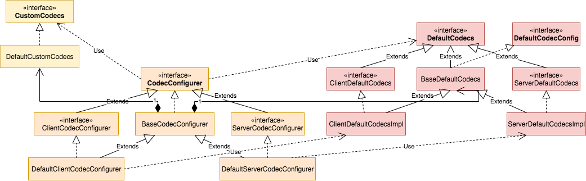
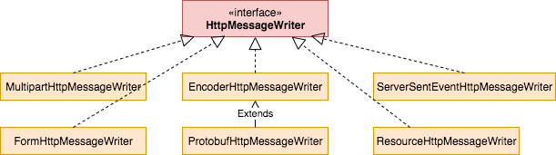
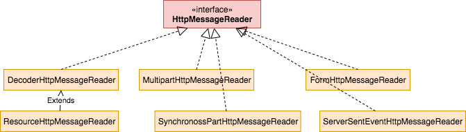

spring-webflux-writer-and-reader


HttpMessageWriter 和 HttpMessageReader 用于 Java 和 HttpMessage 的转换。通过 SPI 的方式通过修改 CodecConfigure.properties 文件进行自定义配置。默认

* http server 默认依赖 DefaultServerCodecConfigurer 进行初始化

* webclient 默认依赖 DefaultClientCodecConfigurer 进行初始化


## Codec

Codec 的目标是初始化 HttpMessagreWriter 和 HttpMessageReader。

```java
public interface CodecConfigurer {
	DefaultCodecs defaultCodecs();

	CustomCodecs customCodecs();

	void registerDefaults(boolean registerDefaults);

	List<HttpMessageReader<?>> getReaders();

	List<HttpMessageWriter<?>> getWriters();

	CodecConfigurer clone();
```





其中

* DefaultCodecs：默认的编码。比如 Json、Xml 相关

* CustomCodecs：自定义编码，提供扩展

* CodecConfigure：关联 CustomCodecs 和 DefaultCodecs

* ClientCodecConfigurer：客户端编码。

* ServerCodecConfigurer：服务端编码。

* DefaultClientCodecConfigurer：依赖 ClientDefaultCodecsImpl

* DefaultServerCodecConfigurer：依赖 ServerDefaultCodecsImpl

  

## HttpMessageWriter

### 接口

将 Java 对象写入 HttpMessage，底层依赖 Encoder 进行编码、

```java
public interface HttpMessageWriter<T> {
	List<MediaType> getWritableMediaTypes();

	boolean canWrite(ResolvableType elementType, @Nullable MediaType mediaType);

	Mono<Void> write(Publisher<? extends T> inputStream, ResolvableType elementType,
			@Nullable MediaType mediaType, ReactiveHttpOutputMessage message, Map<String, Object> hints);

	default Mono<Void> write(Publisher<? extends T> inputStream, ResolvableType actualType,
			ResolvableType elementType, @Nullable MediaType mediaType, ServerHttpRequest request,
			ServerHttpResponse response, Map<String, Object> hints) {
		return write(inputStream, elementType, mediaType, response, hints);
	}
}
```


### 类图




1、EncoderHttpMessageWriter：通用的委托 Encoder 进行编码。默认支持ByteArrayEncoder、ByteBufferEncoder、DataBufferEncoder、ProtobufEncoder、Jackson2JsonEncoder、Jackson2SmileEncoder、Jaxb2XmlEncoder。

2、ProtobufHttpMessageWriter： protobuf 协议

3、ResourceHttpMessageWriter：Resource 类型的数据，依赖 ResourceEncoder

4、MultipartHttpMessageWriter：写 Java 对象到 multipart/form-data、multipart/mixe、multipart/related 类型的 HttpMessage

5、ServerSentEventHttpMessageWriter：写 Java 对象 text/event-stream 类型的 HttpMessage

## HttpMessageReader

### 接口

根据 mediaType 将 HttpMessage 读取为 Mono 或 Flux 对象。底层依赖 Decoder 进行解码。

```java
public interface HttpMessageReader<T> {
	List<MediaType> getReadableMediaTypes();

	boolean canRead(ResolvableType elementType, @Nullable MediaType mediaType);

	Flux<T> read(ResolvableType elementType, ReactiveHttpInputMessage message, Map<String, Object> hints);

	Mono<T> readMono(ResolvableType elementType, ReactiveHttpInputMessage message, Map<String, Object> hints);

	default Flux<T> read(ResolvableType actualType, ResolvableType elementType, ServerHttpRequest request,
			ServerHttpResponse response, Map<String, Object> hints) {

		return read(elementType, request, hints);
	}

	default Mono<T> readMono(ResolvableType actualType, ResolvableType elementType, ServerHttpRequest request,
			ServerHttpResponse response, Map<String, Object> hints) {

		return readMono(elementType, request, hints);
	}
}
```


### 类图





1、DecoderHttpMessageReader：依赖 Decoder，进行对象转换。默认 Decoder 包括 ByteArrayDecoder、ByteBufferDecoder、DataBufferDecoder、StringDecoder、ProtobufDecoder、Jackson2JsonDecoder、Jackson2SmileDecoder、Jaxb2XmlDecoder。

2、FormHttpMessageReader：读取 application/x-www-form-urlencoded 类型的 HttpMessage

3、MultipartHttpMessageReader：读取 multipart/form-data、multipart/mixe、multipart/related 类型的 HttpMessage

4、ServerSentEventHttpMessageReader：读取 text/event-stream 类型的 HttpMessage

5、SynchronossPartHttpMessageReader：读取多个 multipart/form-data、multipart/mixe、multipart/related 类型 HttpMessage

6、ResourceHttpMessageReader：读取文件名


### 核心源码

1、CodecConfigurerFactory#create

2、BaseDefaultCodecs#getTypedWriters

3、BaseDefaultCodecs#getTypedReaders


### 扩展性

通过实现 CustomCodecs 自定义扩展。

