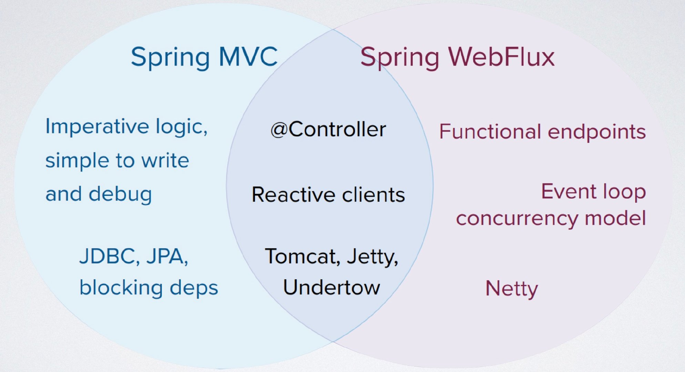

spring webflux


## Spring WebFlux VS Spring MVC


### 技术栈




Spring WebFlux 建立在 Project Reactor、Netty 之上

### 场景


| 维度         | Spring WebFlux | Spring MVC |
| ------------ | -------------- | ---------- |
| 对性能要求   | 高             | 低         |
| 业务复杂度   | 低             | 高         |
| 团队技术能力 | 高             | 正常       |


## 源码导读


### 初始化

ReactiveWebServerApplicationContext#createWebServer

NettyReactiveWebServerFactory

HttpHandlerAutoConfiguration

WebFluxAutoConfiguration

WebFluxConfigurationSupport

RouterFunctionMapping#afterPropertiesSet()

AbstractHandlerMethodMapping#afterPropertiesSet()

RequestMappingHandlerAdapter#afterPropertiesSet()	


### 运行

HttpWebHandlerAdapter#handle()

WebHttpHandlerBuilder#build()


## 参考

https://www.cnblogs.com/crazymakercircle/p/14302103.html

https://github.com/jittagornp/spring-boot-reactive-example


## Http Client


```java
@Override
public Mono<ClientResponse> exchange() {
   ClientRequest request = (this.inserter != null ?
         initRequestBuilder().body(this.inserter).build() :
         initRequestBuilder().build());
   return Mono.defer(() -> exchangeFunction.exchange(request)
         .checkpoint("Request to " + this.httpMethod.name() + " " + this.uri + " [DefaultWebClient]")
         .switchIfEmpty(NO_HTTP_CLIENT_RESPONSE_ERROR));
}
```


DefaultExchangeFunction#exchange

```java
		@Override
		public ResponseSpec retrieve() {
			return new DefaultResponseSpec(exchange(), this::createRequest);
		}

    @Override
    public Mono<ClientResponse> exchange(ClientRequest clientRequest) {
       Assert.notNull(clientRequest, "ClientRequest must not be null");
       HttpMethod httpMethod = clientRequest.method();
       URI url = clientRequest.url();
       String logPrefix = clientRequest.logPrefix();

       return this.connector
             .connect(httpMethod, url, httpRequest -> clientRequest.writeTo(httpRequest, this.strategies))
             .doOnRequest(n -> logRequest(clientRequest))
             .doOnCancel(() -> logger.debug(logPrefix + "Cancel signal (to close connection)"))
             .map(httpResponse -> {
                logResponse(httpResponse, logPrefix);
                return new DefaultClientResponse(
                      httpResponse, this.strategies, logPrefix, httpMethod.name() + " " + url,
                      () -> createRequest(clientRequest));
             });
    }
```


```java
public class DispatcherHandler implements WebHandler, ApplicationContextAware {
	private List<HandlerMapping> handlerMappings;

	private List<HandlerAdapter> handlerAdapters;

	private List<HandlerResultHandler> resultHandlers;

		@Override
	public void setApplicationContext(ApplicationContext applicationContext) {
		initStrategies(applicationContext);
	}

	protected void initStrategies(ApplicationContext context) {
		Map<String, HandlerMapping> mappingBeans = BeanFactoryUtils.beansOfTypeIncludingAncestors(
				context, HandlerMapping.class, true, false);

		ArrayList<HandlerMapping> mappings = new ArrayList<>(mappingBeans.values());
		AnnotationAwareOrderComparator.sort(mappings);
		this.handlerMappings = Collections.unmodifiableList(mappings);

		Map<String, HandlerAdapter> adapterBeans = BeanFactoryUtils.beansOfTypeIncludingAncestors(
				context, HandlerAdapter.class, true, false);

		this.handlerAdapters = new ArrayList<>(adapterBeans.values());
		AnnotationAwareOrderComparator.sort(this.handlerAdapters);

		Map<String, HandlerResultHandler> beans = BeanFactoryUtils.beansOfTypeIncludingAncestors(
				context, HandlerResultHandler.class, true, false);

		this.resultHandlers = new ArrayList<>(beans.values());
		AnnotationAwareOrderComparator.sort(this.resultHandlers);
	}


	@Override
	public Mono<Void> handle(ServerWebExchange exchange) {
		if (this.handlerMappings == null) {
			return createNotFoundError();
		}
		return Flux.fromIterable(this.handlerMappings)
				.concatMap(mapping -> mapping.getHandler(exchange))
				.next()
				.switchIfEmpty(createNotFoundError())
				.flatMap(handler -> invokeHandler(exchange, handler))
				.flatMap(result -> handleResult(exchange, result));
	}
}
```


初始化

```java
public static WebHttpHandlerBuilder applicationContext(ApplicationContext context) {
   WebHttpHandlerBuilder builder = new WebHttpHandlerBuilder(
         context.getBean(WEB_HANDLER_BEAN_NAME, WebHandler.class), context);

   List<WebFilter> webFilters = context
         .getBeanProvider(WebFilter.class)
         .orderedStream()
         .collect(Collectors.toList());
   builder.filters(filters -> filters.addAll(webFilters));
   List<WebExceptionHandler> exceptionHandlers = context
         .getBeanProvider(WebExceptionHandler.class)
         .orderedStream()
         .collect(Collectors.toList());
   builder.exceptionHandlers(handlers -> handlers.addAll(exceptionHandlers));

   try {
      builder.sessionManager(
            context.getBean(WEB_SESSION_MANAGER_BEAN_NAME, WebSessionManager.class));
   }
   catch (NoSuchBeanDefinitionException ex) {
      // Fall back on default
   }

   try {
      builder.codecConfigurer(
            context.getBean(SERVER_CODEC_CONFIGURER_BEAN_NAME, ServerCodecConfigurer.class));
   }
   catch (NoSuchBeanDefinitionException ex) {
      // Fall back on default
   }

   try {
      builder.localeContextResolver(
            context.getBean(LOCALE_CONTEXT_RESOLVER_BEAN_NAME, LocaleContextResolver.class));
   }
   catch (NoSuchBeanDefinitionException ex) {
      // Fall back on default
   }

   try {
      builder.localeContextResolver(
            context.getBean(LOCALE_CONTEXT_RESOLVER_BEAN_NAME, LocaleContextResolver.class));
   }
   catch (NoSuchBeanDefinitionException ex) {
      // Fall back on default
   }

   try {
      builder.forwardedHeaderTransformer(
            context.getBean(FORWARDED_HEADER_TRANSFORMER_BEAN_NAME, ForwardedHeaderTransformer.class));
   }
   catch (NoSuchBeanDefinitionException ex) {
      // Fall back on default
   }

   return builder;
}
```


```java
public interface HandlerAdapter {
   boolean supports(Object handler);

   Mono<HandlerResult> handle(ServerWebExchange exchange, Object handler);
}

public interface HandlerMapping {
	Mono<Object> getHandler(ServerWebExchange exchange);
}

public interface HandlerResultHandler {
	boolean supports(HandlerResult result);

	Mono<Void> handleResult(ServerWebExchange exchange, HandlerResult result);
}

public class HandlerResult {
	private final Object handler;

	private final Object returnValue;

	private final ResolvableType returnType;

	private final BindingContext bindingContext;

	private Function<Throwable, Mono<HandlerResult>> exceptionHandler;
}
```