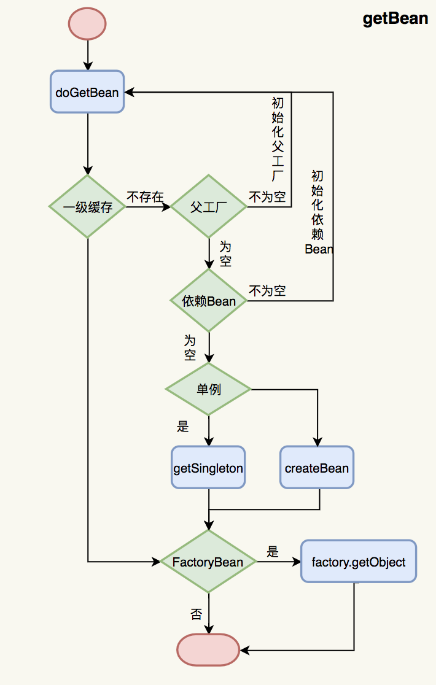

spring-循环依赖


### 构造器注入

```java
@Service
public class A {
    public A(B b) {
    }
}
@Service
public class B {
    public B(A a) {
    }
}
```


如果有循环依赖，抛出异常 BeanCurrentlyInCreationException。无解，只能重新整理依赖关系，避免循环依赖。

根本原因：Spring 解决循环依赖，依赖 Bean 初始化的中间态，而构造器注入的 Bean 是必须已经实例化的。

### Filed 注入

```java
@Service
public class A {
    @Autowired
    private B b;
}

@Service
public class B {
    @Autowired
    private A a;
}
```


### Setter 注入

同 Filed 注入


### prototype 注入

如果两个 Bean 都是 prototype 的，那么，就不存在循环依赖问题。

```java
@Scope(ConfigurableBeanFactory.SCOPE_PROTOTYPE)
@Service
public class A {
    @Autowired
    private B b;
}

@Scope(ConfigurableBeanFactory.SCOPE_PROTOTYPE)
@Service
public class B {
    @Autowired
    private A a;
}
```


如果一个单例的 Bean 依赖了一个 prototype 的 Bean 就会报循环依赖的错误。

```java
@Scope(ConfigurableBeanFactory.SCOPE_PROTOTYPE)
@Service
public class A {
    @Autowired
    private B b;
}

@Service
public class B {
    @Autowired
    private A a;
}
```


总结


### 附录




### 原理分析

问题

1、对象的初始化主流程是啥？

2、对象时如何依次放入各级缓存的？

放入三级缓存：getBean

放入二级缓存：getSingleton

放入一级缓存：

3、对象又是如何从缓存中读取的？

getSingleton


整个流程如下：

1. 使用`context.getBean(A.class)`，旨在获取容器内的单例A(若A不存在，就会走A这个Bean的创建流程)，显然初次获取A是不存在的，因此走**A的创建之路~**
2. `实例化`A（注意此处仅仅是实例化），并将它放进`缓存`（此时A已经实例化完成，已经可以被引用了）
3. `初始化`A：`@Autowired`依赖注入B（此时需要去容器内获取B）
4. 为了完成依赖注入B，会通过`getBean(B)`去容器内找B。但此时B在容器内不存在，就走向**B的创建之路~**
5. `实例化`B，并将其放入缓存。（此时B也能够被引用了）
6. `初始化`B，`@Autowired`依赖注入A（此时需要去容器内获取A）
7. `此处重要`：初始化B时会调用`getBean(A)`去容器内找到A，上面我们已经说过了此时候因为A已经实例化完成了并且放进了缓存里，所以这个时候去看缓存里是已经存在A的引用了的，所以`getBean(A)`能够正常返回
8. **B初始化成功**（此时已经注入A成功了，已成功持有A的引用了），return（注意此处return相当于是返回最上面的`getBean(B)`这句代码，回到了初始化A的流程中~）。
9. 因为B实例已经成功返回了，因此最终**A也初始化成功**
10. **到此，B持有的已经是初始化完成的A，A持有的也是初始化完成的B**


#### 整体流程

```java
public abstract class AbstractBeanFactory extends FactoryBeanRegistrySupport implements ConfigurableBeanFactory {
		public Object getBean(String name) throws BeansException {
        return this.doGetBean(name, (Class)null, (Object[])null, false);
    }

    public <T> T getBean(String name, Class<T> requiredType) throws BeansException {
        return this.doGetBean(name, requiredType, (Object[])null, false);
    }

    public Object getBean(String name, Object... args) throws BeansException {
        return this.doGetBean(name, (Class)null, args, false);
    }

    public <T> T getBean(String name, @Nullable Class<T> requiredType, @Nullable Object... args) throws BeansException {
        return this.doGetBean(name, requiredType, args, false);
    }

    protected <T> T doGetBean(String name, @Nullable Class<T> requiredType, @Nullable Object[] args, boolean typeCheckOnly) throws BeansException {
        String beanName = this.transformedBeanName(name);
        Object sharedInstance = this.getSingleton(beanName);
        Object bean;
        if (sharedInstance != null && args == null) {
            bean = this.getObjectForBeanInstance(sharedInstance, name, beanName, (RootBeanDefinition)null);
        } else {
            // 用 BeanFactory 创建 Bean
            BeanFactory parentBeanFactory = this.getParentBeanFactory();
            if (parentBeanFactory != null && !this.containsBeanDefinition(beanName)) {
                String nameToLookup = this.originalBeanName(name);
                if (parentBeanFactory instanceof AbstractBeanFactory) {
                    return ((AbstractBeanFactory)parentBeanFactory).doGetBean(nameToLookup, requiredType, args, typeCheckOnly);
                }
                if (args != null) {
                    return parentBeanFactory.getBean(nameToLookup, args);
                }
                if (requiredType != null) {
                    return parentBeanFactory.getBean(nameToLookup, requiredType);
                }
                return parentBeanFactory.getBean(nameToLookup);
            }

            if (!typeCheckOnly) {
                this.markBeanAsCreated(beanName);
            }

            try {
                RootBeanDefinition mbd = this.getMergedLocalBeanDefinition(beanName);
                this.checkMergedBeanDefinition(mbd, beanName, args);
                String[] dependsOn = mbd.getDependsOn();
                String[] var11;
                // 解决依赖 Bean
                if (dependsOn != null) {
                    var11 = dependsOn;
                    int var12 = dependsOn.length;
                    for(int var13 = 0; var13 < var12; ++var13) {
                        String dep = var11[var13];
                        this.registerDependentBean(dep, beanName);
                        this.getBean(dep);
                    }
                }

                if (mbd.isSingleton()) {
                    // 用 createBean 创建的 beanFactory 创建 Bean，加入一级缓存，从二级和三级缓存删除
                    sharedInstance = this.getSingleton(beanName, () -> {
                        try {
                            // 核心子流程
                            return this.createBean(beanName, mbd, args);
                        } catch (BeansException var5) {
                        }
                    });
                    bean = this.getObjectForBeanInstance(sharedInstance, name, beanName, mbd);
                } else if (mbd.isPrototype()) {
                    var11 = null;
                    Object prototypeInstance;
                    try {
                        this.beforePrototypeCreation(beanName);
                        // 核心子流程
                        prototypeInstance = this.createBean(beanName, mbd, args);
                    } finally {
                        this.afterPrototypeCreation(beanName);
                    }
                    bean = this.getObjectForBeanInstance(prototypeInstance, name, beanName, mbd);
                } else {
                    String scopeName = mbd.getScope();
                    Scope scope = (Scope)this.scopes.get(scopeName);
                    try {
                        Object scopedInstance = scope.get(beanName, () -> {
                            this.beforePrototypeCreation(beanName);
                            Object var4;
                            try {
                                // 核心子流程
                                var4 = this.createBean(beanName, mbd, args);
                            } finally {
                                this.afterPrototypeCreation(beanName);
                            }
                            return var4;
                        });
                        bean = this.getObjectForBeanInstance(scopedInstance, name, beanName, mbd);
                    } catch (IllegalStateException var23) {
                    }
                }
            } catch (BeansException var26) {
            }
        }

        if (requiredType != null && !requiredType.isInstance(bean)) {
            try {
                T convertedBean = this.getTypeConverter().convertIfNecessary(bean, requiredType);
                if (convertedBean == null) {
                    throw new BeanNotOfRequiredTypeException(name, requiredType, bean.getClass());
                } else {
                    return convertedBean;
                }
            } catch (TypeMismatchException var25) {
            }
        } else {
            return bean;
        }
    }
}
```


#### createBean 子流程

```java
protected Object createBean(String beanName, RootBeanDefinition mbd, @Nullable Object[] args) throws BeanCreationException {
    if (this.logger.isTraceEnabled()) {
        this.logger.trace("Creating instance of bean '" + beanName + "'");
    }

    RootBeanDefinition mbdToUse = mbd;
    Class<?> resolvedClass = this.resolveBeanClass(mbd, beanName, new Class[0]);
    if (resolvedClass != null && !mbd.hasBeanClass() && mbd.getBeanClassName() != null) {
        mbdToUse = new RootBeanDefinition(mbd);
        mbdToUse.setBeanClass(resolvedClass);
    }

    try {
        mbdToUse.prepareMethodOverrides();
    } catch (BeanDefinitionValidationException var9) {
    }

    Object beanInstance;
    try {
        beanInstance = this.resolveBeforeInstantiation(beanName, mbdToUse);
        if (beanInstance != null) {
            return beanInstance;
        }
    } catch (Throwable var10) {
    }

    try {
        // 核心子流程
        beanInstance = this.doCreateBean(beanName, mbdToUse, args);
        if (this.logger.isTraceEnabled()) {
            this.logger.trace("Finished creating instance of bean '" + beanName + "'");
        }

        return beanInstance;
    } catch (ImplicitlyAppearedSingletonException | BeanCreationException var7) {
    }
}
```


#### doCreateBean 子流程

```java
	protected Object doCreateBean(String beanName, RootBeanDefinition mbd, @Nullable Object[] args) throws BeanCreationException {
    BeanWrapper instanceWrapper = null;
    if (mbd.isSingleton()) {
        instanceWrapper = (BeanWrapper)this.factoryBeanInstanceCache.remove(beanName);
    }

    if (instanceWrapper == null) {
        instanceWrapper = this.createBeanInstance(beanName, mbd, args);
    }

    Object bean = instanceWrapper.getWrappedInstance();
    Class<?> beanType = instanceWrapper.getWrappedClass();
    if (beanType != NullBean.class) {
        mbd.resolvedTargetType = beanType;
    }

    synchronized(mbd.postProcessingLock) {
        if (!mbd.postProcessed) {
            try {
                this.applyMergedBeanDefinitionPostProcessors(mbd, beanType, beanName);
            } catch (Throwable var17) {
                throw new BeanCreationException(mbd.getResourceDescription(), beanName, "Post-processing of merged bean definition failed", var17);
            }

            mbd.postProcessed = true;
        }
    }

    boolean earlySingletonExposure = mbd.isSingleton() && this.allowCircularReferences && this.isSingletonCurrentlyInCreation(beanName);
    if (earlySingletonExposure) {
        // 给 Bean 创建 BeanFactory，此时 Bean 加入三级缓存, 关注点
        this.addSingletonFactory(beanName, () -> {
            return this.getEarlyBeanReference(beanName, mbd, bean);
        });
    }

    Object exposedObject = bean;
    try {
        // 设置 Bean 的属性值
        this.populateBean(beanName, mbd, instanceWrapper);
        // 1、根据 exposedObject 设置 exposedObject 的 BeanName, BeanClassLoader, BeanFactory
        // 2、调用 exposedObject 的 postProcessBeforeInitialization 方法
        // 3、调用 exposedObject 的 初始化方法
        // 4、调用 exposedObject 的 postProcessAfterInitialization 方法
        exposedObject = this.initializeBean(beanName, exposedObject, mbd);
    } catch (Throwable var18) {
        // 抛出异常
    }

    if (earlySingletonExposure) {
        Object earlySingletonReference = this.getSingleton(beanName, false);
        // ...
    }

    try {
        this.registerDisposableBeanIfNecessary(beanName, bean, mbd);
        return exposedObject;
    } catch (BeanDefinitionValidationException var16) {
    }
}
```


#### getSingleton

```java
public class DefaultSingletonBeanRegistry extends SimpleAliasRegistry implements SingletonBeanRegistry {
    // 一级缓存：完全初始化好的 Bean
    private final Map<String, Object> singletonObjects = new ConcurrentHashMap(256);
    // 三级缓存：存放 Bean 的工厂对象，用于解决循环依赖
    private final Map<String, ObjectFactory<?>> singletonFactories = new HashMap(16);
    // 二级缓存：Bean 仅仅调用完构造函数，还没有注入属性依赖，此时可以被其他 Bean 引用
    private final Map<String, Object> earlySingletonObjects = new HashMap(16);
    private final Set<String> registeredSingletons = new LinkedHashSet(256);
    // 开始创建存入，创建完成删除
    private final Set<String> singletonsCurrentlyInCreation = Collections.newSetFromMap(new ConcurrentHashMap(16));
    // 
    private final Set<String> inCreationCheckExclusions = Collections.newSetFromMap(new ConcurrentHashMap(16));
    @Nullable
    private Set<Exception> suppressedExceptions;
    private boolean singletonsCurrentlyInDestruction = false;
    private final Map<String, Object> disposableBeans = new LinkedHashMap();
    private final Map<String, Set<String>> containedBeanMap = new ConcurrentHashMap(16);
    private final Map<String, Set<String>> dependentBeanMap = new ConcurrentHashMap(64);
    private final Map<String, Set<String>> dependenciesForBeanMap = new ConcurrentHashMap(64);

    public DefaultSingletonBeanRegistry() {
    }

    public void registerSingleton(String beanName, Object singletonObject) throws IllegalStateException {
        Assert.notNull(beanName, "Bean name must not be null");
        Assert.notNull(singletonObject, "Singleton object must not be null");
        synchronized(this.singletonObjects) {
            Object oldObject = this.singletonObjects.get(beanName);
            if (oldObject != null) {
                throw new IllegalStateException("Could not register object [" + singletonObject + "] under bean name '" + beanName + "': there is already object [" + oldObject + "] bound");
            } else {
                this.addSingleton(beanName, singletonObject);
            }
        }
    }

    // 加入一级缓存，从二级和三级缓存删除
    protected void addSingleton(String beanName, Object singletonObject) {
        synchronized(this.singletonObjects) {
            this.singletonObjects.put(beanName, singletonObject);
            this.singletonFactories.remove(beanName);
            this.earlySingletonObjects.remove(beanName);
            this.registeredSingletons.add(beanName);
        }
    }

    protected void addSingletonFactory(String beanName, ObjectFactory<?> singletonFactory) {
        Assert.notNull(singletonFactory, "Singleton factory must not be null");
        synchronized(this.singletonObjects) {
            if (!this.singletonObjects.containsKey(beanName)) {
                this.singletonFactories.put(beanName, singletonFactory);
                this.earlySingletonObjects.remove(beanName);
                this.registeredSingletons.add(beanName);
            }

        }
    }

    @Nullable
    public Object getSingleton(String beanName) {
        return this.getSingleton(beanName, true);
    }

    // 加入二级缓存
    protected Object getSingleton(String beanName, boolean allowEarlyReference) {
        Object singletonObject = this.singletonObjects.get(beanName);
        // 不在一级缓存
        if (singletonObject == null && this.isSingletonCurrentlyInCreation(beanName)) {
            synchronized(this.singletonObjects) {
                singletonObject = this.earlySingletonObjects.get(beanName);
                // 不在二级缓存
                if (singletonObject == null && allowEarlyReference) {
                    ObjectFactory<?> singletonFactory = (ObjectFactory)this.singletonFactories.get(beanName);
                    // 在三级缓存（此时已经调用构造函数）
                    if (singletonFactory != null) {
                        // Bean 工厂创建对象
                        singletonObject = singletonFactory.getObject();
                        // 加入二级缓存
                        this.earlySingletonObjects.put(beanName, singletonObject);
                        // 从三级缓存删除
                        this.singletonFactories.remove(beanName);
                    }
                }
            }
        }
        // 完全实例化或者调用完构造函数，但是没有注入属性，或者还没有 Bean 工厂
        return singletonObject;
    }
  
    public boolean isSingletonCurrentlyInCreation(String beanName) {
        return this.singletonsCurrentlyInCreation.contains(beanName);
    }

    public Object getSingleton(String beanName, ObjectFactory<?> singletonFactory) {
        synchronized(this.singletonObjects) {
            Object singletonObject = this.singletonObjects.get(beanName);
            if (singletonObject == null) {
                // 加入二级缓存
                this.beforeSingletonCreation(beanName);
                boolean newSingleton = false;
                try {
                    singletonObject = singletonFactory.getObject();
                    newSingleton = true;
                } finally {
                    // 从二级缓存删除		
                    this.afterSingletonCreation(beanName);
                }
                if (newSingleton) {
                    // 加入一级缓存，从二级和三级缓存删除
                    this.addSingleton(beanName, singletonObject);
                }
            }
            return singletonObject;
        }
    }

    public boolean isCurrentlyInCreation(String beanName) {
        Assert.notNull(beanName, "Bean name must not be null");
        return !this.inCreationCheckExclusions.contains(beanName) && this.isActuallyInCreation(beanName);
    }
}
```


