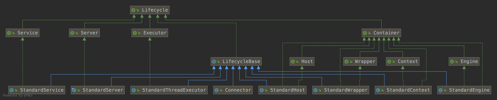

Tomcat 

https://blog.csdn.net/qq_14855971/article/details/108068030

[官网](https://tomcat.apache.org/download-80.cgi)


Tomcat 的价值

简化：避免了用户自己对网络通信和应用协议的感知。包括连接的管理，http 协议的转换。用户只需要关系 Request 和 Response 即可。

可扩展性：在实现上，通过组件化设计，提供了多个可扩展点，方便用户根据自己的需要进行扩展。


思考：从当前 ServiceMesh 的角度来思考，ServiceMesh 解决了服务之间的网络通信，Tomcat 抽象了 Java 语言下网络通信和应用协议的共性。


Web 容器 =  Servlet容器 + Http 服务器

Servlet 容器 = Servlet 接口 + Servlet 容器，Tomcat 是 Servlet 规范的一种实现。

## 架构


​	





其中：

1、Server：指的就是整个 Tomcat 服 务器，包含多组服务，负责管理和启动各个 Service；

2、Service：基于组件的 Web 服务， 包含 Connectors（可以是多个）、Container 两个核心组件，以及多个功能组件，各个 Service 之间是独立的；

2.1、Connector：Tomcat 与外部的连接器，监听固定端口接收外部请求，处理 Socket 连接，负责网络字节流与 Request 和 Response 对象的转化，传递给 Container，并将 Container 处理的结果返回给外部；

2.1.1、Endpoint：通信端点，即通信监听的接口，是具体的 Socket 接收和发送处理器，是对传输层的抽象，因此 `EndPoint`是用来实现 `TCP/IP` 协议数据读写的，本质调用操作系统的 socket 接口，创建 channel，根据 channel 创建 socketWrapper 。可以分别配置多个 Acceptor 和 Poller。每个 Acceptor 一个线程，每个 Poller 一个线程。

2.1.1.1、Acceptor：每个 Acceptor 一个线程，每个线程中，死循环接收socket连接，accept 获得socket对象，然后封装在NioChannel和SocketWrapper中，进一步将 SocketWrapper，NioChannel封装在PollerEvent对象中，并将PollerEvent对象压入events queue里，Poller 从 events queue 读取 PollerEvent。这里是个典型的生产者-消费者模式，Acceptor与Poller线程之间通过events queue通信，Acceptor是events queue的生产者， Poller是events queue的消费者。

2.1.1.2、Poller：每个 Poller 一个线程，Poller线程中维护了一个Selector对象，首先作为events queue的消费者， 从queue中取出PollerEvent对象，调用 PollerEvent 的 run 方法（此方法将channel以 OP_READ 事件注册到 Selector 中，然后主Selector执行select操作， 遍历出可以读数据的socket，并从Worker线程池中拿到可用的Worker线程，然后将socket传递给Worker）。

2.1.1.3、SocketProcessor：获取 handler 并执行 handler 的 process 方法 ; 

2.1.1.4、Handler：只有一个实现ConnectionHandler，主要是创建 Processor，并调用 Processor 的 process 方法。 最后通过 socket 获取合适应用层协议处理器，也就是调用 Http11Processor 组件来处理请求。Http11Processor 读取 Channel 的数据来生成 ServletRequest 对象，Http11Processor 并不是直接读取 Channel 的。

这是因为 Tomcat 支持同步非阻塞 I/O 模型和异步 I/O 模型，在 Java API 中，相应的 Channel 类也是不一样的，比如有 AsynchronousSocketChannel 和 SocketChannel，为了对 Http11Processor 屏蔽这些差异，Tomcat 设计了一个包装类叫作 SocketWrapper，Http11Processor 只调用 SocketWrapper 的方法去读写数据。

2.1.2、Processor：调用 processor 的  process 方法，Processor 的实现类包括Http11Processor或AjpProcessor。 实际调用 service 方法

2.1.3、Worker ：Worker线程拿到Poller传过来的socket后，将socket封装在SocketProcessor对象中。然后从Http11ConnectionHandler 中取出Http11NioProcessor对象，从Http11NioProcessor中调用CoyoteAdapter的逻辑。

2.1.4、Adapter：`CoyoteAdapter`负责将 `Tomcat Request` 转成 `ServletRequest`，再调用容器的 `Service`方法。

2.2、Container：Servlet 容器，内部有多层容器组成，用于管理 Servlet 生命周期，调用 servlet 相关方法处理 Request 请求；

2.2.1、Engine：Servlet 的顶层容器，包含一个或多个 Host 子容器；

2.2.2、Host：虚拟主机，负责 Web 应用的部署和 Context 的创建；

2.2.3、Context：Web 应用上下文，包含多个 Wrapper，负责 Web 配置的解析、管理所有的 Web 资源；

2.2.4、Wrapper：最底层的容器，是对 Servlet 的封装，负责 Servlet 实例的创建、执行和销毁。

2.3、Mapper：Mapper 组件的功能就是将用户请求的 URL 定位到一个 Servlet，它的工作原理是：Mapper组件里保存了 Web 应用的配置信息，其实就是容器组件与访问路径的映射关系，比如 Host容器里配置的域名、Context容器里的 Web应用路径，以及 Wrapper容器里 Servlet 映射的路径，你可以想象这些配置信息就是一个多层次的 Map。

详细参考 server.xml


#### 举例

假如有用户访问一个 URL，比如图中的http://user.shopping.com:8080/order/buy，Tomcat 如何将这个 URL 定位到一个 Servlet 呢？

首先根据协议和端口号确定 Service 和 Engine。Tomcat 默认的 HTTP 连接器监听 8080 端口、默认的 AJP 连接器监听 8009 端口。上面例子中的 URL 访问的是 8080 端口，因此这个请求会被 HTTP 连接器接收，而一个连接器是属于一个 Service 组件的，这样 Service 组件就确定了。我们还知道一个 Service 组件里除了有多个连接器，还有一个容器组件，具体来说就是一个 Engine 容器，因此 Service 确定了也就意味着 Engine 也确定了。
根据域名选定 Host。 Service 和 Engine 确定后，Mapper 组件通过 URL 中的域名去查找相应的 Host 容器，比如例子中的 URL 访问的域名是user.shopping.com，因此 Mapper 会找到 Host2 这个容器。
根据 URL 路径找到 Context 组件。 Host 确定以后，Mapper 根据 URL 的路径来匹配相应的 Web 应用的路径，比如例子中访问的是 /order，因此找到了 Context4 这个 Context 容器。
根据 URL 路径找到 Wrapper（Servlet）。 Context 确定后，Mapper 再根据 web.xml 中配置的 Servlet 映射路径来找到具体的 Wrapper 和 Servlet。
连接器中的 Adapter 会调用容器的 Service 方法来执行 Servlet，最先拿到请求的是 Engine 容器，Engine 容器对请求做一些处理后，会把请求传给自己子容器 Host 继续处理，依次类推，最后这个请求会传给 Wrapper 容器，Wrapper 会调用最终的 Servlet 来处理。那么这个调用过程具体是怎么实现的呢？答案是使用 Pipeline-Valve 管道。


## 生命周期管理


```
       	   	  start()
   -----------------------------
   |                           |
   | init()                    |
  NEW -»-- INITIALIZING        |
  | |           |              |     ------------------«-----------------------
  | |           |auto          |     |                                        |
  | |          \|/    start() \|/   \|/     auto          auto         stop() |
  | |      INITIALIZED --»-- STARTING_PREP --»- STARTING --»- STARTED --»---  |
  | |         |                                                            |  |
  | |destroy()|                                                            |  |
  | --»-----«--    ------------------------«--------------------------------  ^
  |     |          |                                                          |
  |     |         \|/          auto                 auto              start() |
  |     |     STOPPING_PREP ----»---- STOPPING ------»----- STOPPED -----»-----
  |    \|/                               ^                     |  ^
  |     |               stop()           |                     |  |
  |     |       --------------------------                     |  |
  |     |       |                                              |  |
  |     |       |    destroy()                       destroy() |  |
  |     |    FAILED ----»------ DESTROYING ---«-----------------  |
  |     |                        ^     |                          |
  |     |     destroy()          |     |auto                      |
  |     --------»-----------------    \|/                         |
  |                                 DESTROYED                     |
  |                                                               |
  |                            stop()                             |
  ----»-----------------------------»------------------------------
```


如上图是 Tomcat 生命周期管理图

Tomcat 为了方便管理组件和容器的生命周期，定义了从创建、启动、停止、销毁共 12 中状态，tomcat 生命周期管理了内部状态变化的规则控制，组件和容器只需实现相应的生命周期 方法即可完成各生命周期内的操作(initInternal、startInternal、stopInternal、 destroyInternal)。

此外，Tomcat 的生命周期管理引入了事件机制，在组件或容器的生命周期状态发生变化时会通 知事件监听器，监听器通过判断事件的类型来进行相应的操作。 事件监听器的添加可以在 server.xml 文件中进行配置;


### 启动过程

启动从 Tomcat 提供的 start.sh 脚本开始，shell 脚本会调用 Bootstrap 的 main 方法，实际调用了 Catalina 相应的  load、start、await、stop 方法。

init：加载类加载器，通过反射初始化 Catalina，调用  Catalina 的 load 方法

start：调用 server 的 start

await：死循环等待 shutdown 命令

stop：关闭连接


load 方法会通过 Digester 进行 config/server.xml 的解析，在解析的过程中会根据 xml 中的关系 和配置信息来创建容器，并设置相关的属性。接着 Catalina 会调用 StandardServer 的 init 和 start 方法进行容器的初始化和启动。

按照 xml 的配置关系，server 的子元素是 service，service 的子元素是顶层容器 Engine，每层容器有持有自己的子容器，而这些元素都实现了生命周期管理 的各个方法，因此就很容易的完成整个容器的启动、关闭等生命周期的管理。


### 销毁过程

通过 Catalina 的 await 方法会等待 shutdown 命令，收到后关闭服务。


### 等待处理请求


## 核心组件

### 配置

catalina.home：安装目录;

catalina.base：工作目录;默认值 user.dir


- Server.xml 配置 Host 元素，指定 appBase 属性，默认$catalina.base/webapps/
- Server.xml 配置 Context 元素，指定 docBase，元素，指定 web 应用的路径
- 自定义配置：在$catalina.base/EngineName/HostName/XXX.xml 配置 Context 元素

#### EngineConfig

主要打印启动和停止日志

#### HostConfig 

监听了 StandardHost 容器的事件，在 start 方法中解析上述配置文件：

- 扫描 appbase 路径下的所有文件夹和 war 包，解析各个应用的 META-INF/context.xml，并 创建 StandardContext，并将 Context 加入到 Host 的子容器中。
- 解析$catalina.base/EngineName/HostName/下的所有 Context 配置，找到相应 web 应 用的位置，解析各个应用的 META-INF/context.xml，并创建 StandardContext，并将 Context 加入到 Host 的子容器中。

注：

- HostConfig 并没有实际解析 Context.xml，而是在 ContextConfig 中进行的。
- HostConfig 中会定期检查 watched 资源文件(context.xml 配置文件)

#### ContextConfig 

解析 context.xml 顺序：

- 先解析全局的配置 config/context.xml
- 然后解析 Host 的默认配置 EngineName/HostName/context.xml.default
- 最后解析应用的 META-INF/context.xml

解析 web.xml 顺序：

- 先解析全局的配置 config/web.xml
- 然后解析 Host 的默认配置 EngineName/HostName/web.xml.default 接着解析应用的 MEB-INF/web.xml
- 扫描应用 WEB-INF/lib/下的 jar 文件，解析其中的 META-INF/web-fragment.xml 最后合并 xml 封装成 WebXml，并设置 Context

注：

- 扫描 web 应用和 jar 中的注解(Filter、Listener、Servlet)就是上述步骤中进行的。
- 容器的定期执行：backgroundProcess，由 ContainerBase 来实现的，并且只有在顶层容器 中才会开启线程。(backgroundProcessorDelay=10 标志位来控制)


## 连接器

### 需求

1、监听网络连接

2、接受网络连接请求

3、读取网络为字节流

4、解析字节流为应用层协议，生成 Tomcat Request

5、将 Tomcat Request 对象转成标准的 ServletRequest

6、调用 Servlet 容器，得到 ServletResponse

7、将 ServletResponse 转换成 Tomcat Response 对象

8、将响应字节流发送回浏览器


### 需求分析

对需求进行抽象后

1、连接处理

2、应用层协议解析

3、与Servlet 容器交互：Tomcat Request 与 ServletRequest， Tomcat Response 与 ServletResponse 的转换

#### 连接处理

Tomcat 支持的 I/O 模型有：

* NIO：非阻塞 I/O，采用 Java NIO 类库实现。

* NIO2：异步 I/O，采用 JDK 7 最新的 NIO2 类库实现。

* APR：采用 Apache 可移植运行库实现，是 C/C++ 编写的本地库。

#### 应用协议解析

Tomcat 支持的应用层协议有：

* HTTP/1.1：这是大部分 Web 应用采用的访问协议。

* AJP：用于和 Web 服务器集成（如 Apache）。

* HTTP/2：HTTP 2.0 大幅度的提升了 Web 性能。

#### 适配器


### 设计抽象

由于每种IO 模型可以支持不同的应用层协议，也就是不同的模型与协议有多种组合（），因此，考虑将每种组合用一个类来表示，将公共的逻辑抽象为抽象类，具体协议的处理有各个子类来实现。

因此，整个连接处理，分布对应 Endpoint、Processor和 Adapter


时序图


类图


连接器用 ProtocolHandler 接口来封装通信协议和 I/O 模型的差异，ProtocolHandler 内部又分为 EndPoint 和 Processor 模块，EndPoint 负责底层 Socket 通信，Proccesor 负责应用层协议解析。连接器通过适配器 Adapter 调用容器。

所以一个容器可能对接多个连接器。连接器对 Servlet 容器屏蔽了网络协议与 I/O 模型的区别，无论是 Http 还是 AJP，在容器中获取到的都是一个标准的 ServletRequest 对象。


NioEndPoint 连接器的初始化过程：

1、创建 PollerEvent队列、Buffer 队列、SocketProcessor 队列

2、创建线程池

3、创建 N 个 Poller，每个 Poller 一个线程

4、创建 M 个 Acceptor，每个 Acceptor 一个线程


连接器的处理过程：

1. 每个 Acceptor 线程监听网络端口。
2. 接受网络连接请求，将 SocketChannel 封装到 NioChannel（NioChannels 队列中取或新建）中，从 pollers 中轮询取一个 Poller。
3. 将 NioChannel 封装到 NioSocketWrapper 中，将NioChannel 和 NioSocketWrapper 一起通过 PollerEvent 放入Poller 的 events 队列中。
4. Poller 线程轮询从 events 队列读 PollerEvent 对象，调用 PollerEvent 的 run 方法，注册 socket 的读事件。
5. 客户端发送了请求，调用 Poller 的 processKey 处理。创建 SocketProcessor，将 SocketProcessor 加入 Executor 执行。
6. SocketProcessor 的 run 方法，调用 Handler 的 processor 方法处理。
7. Handler 的 processor 方法创建 Processor，调用 Processor.processor 方法，之后调用 Processor.service 处理请求。
8. 调用 Adapter 的 service 请求
9. 将 Tomcat Request 对象转成标准的 ServletRequest。
10. 调用 Servlet 容器，得到 ServletResponse。
11. 将 ServletResponse转成 Tomcat Response 对象。
12. 将 Tomcat Response 转成网络字节流。
13. 将响应字节流写回给浏览器。

从 Acceptor 的 run 方法开始看。


```
serverSock = ServerSocketChannel.open();
serverSock.socket().bind(addr,getAcceptCount());
serverSock.configureBlocking(true);
serverSock.accept();
```


### 容器

Tomcat 设计了 4 种容器，分别是 Engine、Host、Context 和 Wrapper。这 4 种容器不是平行关系，而是父子关系。

所有容器组件都实现了 Container 接口，因此组合模式可以使得用户对单容器对象和组合容器对象的使用具有一致性。这里单容器对象指的是最底层的 Wrapper，组合容器对象指的是上面的 Context、Host 或者 Engine。Container 接口定义如下：

```java
public interface Container extends Lifecycle {
    public void setName(String name);
    public Container getParent();
    public void setParent(Container container);
    public void addChild(Container child);
    public void removeChild(Container child);
    public Container findChild(String name);
}
```

连接器中的 Adapter 会调用容器的 Service 方法来执行 Servlet，最先拿到请求的是 Engine 容器，Engine 容器对请求做一些处理后，会把请求传给自己子容器 Host 继续处理，依次类推，最后这个请求会传给 Wrapper 容器，Wrapper 会调用最终的 Servlet 来处理。那么这个调用过程具体是怎么实现的呢？答案是使用 Pipeline-Valve 管道。

Pipeline-Valve 是责任链模式，责任链模式是指在一个请求处理的过程中有很多处理者依次对请求进行处理，每个处理者负责做自己相应的处理，处理完之后将再调用下一个处理者继续处理。

整个调用过程由连接器中的 Adapter 触发的，它会调用 Engine 的第一个 Valve：

// Calling the container

connector.getService().getContainer().getPipeline().getFirst().invoke(request, response);

Wrapper 容器的最后一个 Valve 会创建一个 Filter 链，并调用 doFilter() 方法，最终会调到 Servlet 的 service 方法。


配置示例

```xml
<Server port="8005" shutdown="SHUTDOWN"> // 顶层组件，可包含多个 Service，代表一个 Tomcat 实例
  // 顶层组件，包含一个 Engine ，多个连接器
  <Service name="Catalina">
    <Connector port="8080" protocol="HTTP/1.1" connectionTimeout="200" redirectPort="443"/>
    <!-- Define an AJP 1.3 Connector on port 8009 -->
    <Connector port="8009" protocol="AJP/1.3" redirectPort="8443" />  // 连接器
    // 容器组件：一个 Engine 处理 Service 所有请求，包含多个 Host
    <Engine name="Catalina" defaultHost="localhost">
      // 容器组件：处理指定Host下的客户端请求， 可包含多个 Context
      <Host name="localhost"  appBase="webapps"
            unpackWARs="true" autoDeploy="true">
        // 容器组件：处理特定 Context Web应用的所有客户端请求
        <Context></Context>
      </Host>
    </Engine>
  </Service>
</Server>
```


### Pipeline 机制

Container处理请求是使用Pipeline-Valve管道来处理的。Pipeline-Valve是责任链模式，责任链模式是指在一个请求处理的过程中有很多处理者依次对请求进行处理，每个处理者负责做自己相应的处理，处理完之后将处理后的请求返回，再让下一个处理着继续处理。

#### 概念

请求的链式调用是基于 Pipeline-Valve 责任链来完成的，这样的设计使得系统具有良好的可扩展性，如果需要扩展容器本身的功能，只需要增加相应的 Valve 即可。

1、Pipeline：可以理解为现实中的管道

2、Valve： 为管道中的阀门

3、Request 和 Response 对象：在管道中 经过各个阀门的处理和控制。

每个容器的管道中都有一个必不可少的 basic valve,其他的都是可选的,basic valve 在管道中最后调用,同时负责调用子容器的第一个 valve。

Valve 中主要的三个方法:setNext、getNext、invoke;valve 之间的关系是单向链式结构,本身 invoke 方法中会调用下一个 valve 的 invoke 方法。

各层容器对应的 basic valve 分别是 StandardEngineValve、StandardHostValve、 StandardContextValve、StandardWrapperValve。


#### 接口

```java
public interface Valve {
  public Valve getNext();
  public void setNext(Valve valve);
  public void invoke(Request request, Response response)
}

public interface Pipeline {
  public void addValve(Valve valve);
  public Valve getBasic();
  public void setBasic(Valve valve);
  public Valve getFirst();
}
```

Pipeline中有 addValve方法。Pipeline 中维护了 Valve链表，Valve可以插入到 Pipeline中，对请求做某些处理。我们还发现 Pipeline 中没有 invoke 方法，因为整个调用链的触发是 Valve 来完成的，Valve完成自己的处理后，调用 getNext.invoke() 来触发下一个 Valve 调用。


#### Pipeline-Valve和普通的责任链模式区别

区别主要有以下两点：

1）每个Pipeline都有特定的Valve，而且是在管道的最后一个执行，这个Valve叫做BaseValve，BaseValve是不可删除的；

2）在上层容器的管道的BaseValve中会调用下层容器的管道。


#### Valve 和 Filter的区别

它们的区别是：

| 维度   | Valve         | Filter                        |
| ------ | ------------- | ----------------------------- |
| 标准   | 私有机制      | 公有的标准                    |
| 耦合性 | 紧耦合        | 松耦合（所有 web 容器都支持） |
| 层次   | 容器级别      | web 应用级别                  |
| 粒度   | 所有 web 请求 | 某个 Web 应用                 |


#### 请求处理流程

```java
@Override
public void service(org.apache.coyote.Request req, org.apache.coyote.Response res) {
    // 省略其他代码
    // Calling the container
    connector.getService().getContainer().getPipeline().getFirst().invoke(
        request, response);
    ...
}
```

每个容器都有一个 Pipeline 对象，只要触发了这个 Pipeline 的第一个 Valve，这个容器里 Pipeline中的 Valve 就都会被调用到。但是，不同容器的 Pipeline 是怎么链式触发的呢，比如 Engine 中 Pipeline 需要调用下层容器 Host 中的 Pipeline。

这是因为 Pipeline中还有个 getBasic方法。这个 BasicValve处于 Valve链表的末端，它是 Pipeline中必不可少的一个 Valve，负责调用下层容器的 Pipeline 里的第一个 Valve。

（1）Connector在接收到请求后会首先调用最顶层容器的Pipeline来处理，这里的最顶层容器的Pipeline就是EnginePipeline（Engine的管道）；

（2）在Engine的管道中依次会执行EngineValve1、EngineValve2等等，最后会执行StandardEngineValve，在StandardEngineValve中会调用Host管道，然后再依次执行Host的HostValve1、HostValve2等，最后在执行StandardHostValve，然后再依次调用Context的管道和Wrapper的管道，最后执行到StandardWrapperValve。

（3）当执行到StandardWrapperValve的时候，会在StandardWrapperValve中创建FilterChain，并调用其doFilter方法来处理请求，这个FilterChain包含着我们配置的与请求相匹配的Filter和Servlet，其doFilter方法会依次调用所有的Filter的doFilter方法和Servlet的service方法，这样请求就得到了处理！

（4）当所有的Pipeline-Valve都执行完之后，并且处理完了具体的请求，这个时候就可以将返回的结果交给Connector了，Connector在通过Socket的方式将结果返回给客户端。


## 打破双亲委派

### Tomcat 的类加载机制

#### Java 的双亲委派

Java 的类加载，就是把字节码格式“.class”文件加载到 JVM 的方法区，并在 JVM 的堆区建立一个java.lang.Class对象的实例，用来封装 Java 类相关的数据和方法。

```java
public abstract class ClassLoader {

    //每个类加载器都有个父加载器
    private final ClassLoader parent;
  
    protected Class<?> loadClass(String name, boolean resolve)
        throws ClassNotFoundException
    {
        synchronized (getClassLoadingLock(name)) {
            // 是不是已经加载过了
            Class<?> c = findLoadedClass(name);
            if (c == null) {
                try {
                    // 父加载器不为空，调用父加载器的 loadClass（递归调用）
                    if (parent != null) {
                        c = parent.loadClass(name, false);
                    } else {
                        // 如果父加载器为空，查找是不是被Bootstrap加载器加载了
                        c = findBootstrapClassOrNull(name);
                    }
                } catch (ClassNotFoundException e) {
                }
                // 如果父加载器没加载成功，调用自己的findClass去加载
                if (c == null) {
                    c = findClass(name);
                }
            }
            if (resolve) {
                resolveClass(c);
            }
            return c;
        }
    }
    
    protected Class<?> findClass(String name){
        String path = name.replace('.', '/').concat(".class");
        Resource res = ucp.getResource(path, false);
        if (res != null) {
            try {
                 return defineClass(name, res);
            } catch (IOException e) {
                 throw new ClassNotFoundException(name, e);
            }
        } else {
            return null;
        }
       //1. 根据传入的类名name，到在特定目录下去寻找类文件，把.class文件读入内存
          ...
          
       //2. 调用defineClass将字节数组转成Class对象
       return defineClass(buf, off, len)；
    }
    
    protected final Class<?> defineClass(String name, byte[] b, int off, int len)
        throws ClassFormatError
    {
        return defineClass(name, b, off, len, null);
    }
  
    protected final Class<?> defineClass(String name, byte[] b, int off, int len,
                                         ProtectionDomain protectionDomain)
        throws ClassFormatError
    {
        protectionDomain = preDefineClass(name, protectionDomain);
        String source = defineClassSourceLocation(protectionDomain);
        Class<?> c = defineClass1(name, b, off, len, protectionDomain, source);
        postDefineClass(c, protectionDomain);
        return c;
    }
  
    private native Class<?> defineClass1(String name, byte[] b, int off, int len,
                                         ProtectionDomain pd, String source);
}
```

Java 默认的加载机制依赖重新实现 FindClass，如果要打破双亲委派，就需要重写 loadClass。


#### Tomcat 之 findClass

一个 Context 容器对应一个类加载器。Context 容器在启动过程中，会创建一个新的类加载器来加载新的类文件。

Tomcat 的自定义类加载器 `WebAppClassLoader`打破了双亲委托机制，它**首先自己尝试去加载某个类，如果找不到再代理给父类加载器**，其目的是优先加载 Web 应用自己定义的类。具体实现就是重写 `ClassLoader`的两个方法：`findClass`和 `loadClass`。

```java
public Class<?> findClass(String name) throws ClassNotFoundException {
    ...

    Class<?> clazz = null;
    try {
            //1. 先在 Web 应用目录下查找类
            clazz = findClassInternal(name);
    }  catch (RuntimeException e) {
           throw e;
       }

    if (clazz == null) {
    try {
            //2. 如果在本地目录没有找到，交给父加载器去查找
            clazz = super.findClass(name);
    }  catch (RuntimeException e) {
           throw e;
       }

    //3. 如果父类也没找到，抛出 ClassNotFoundException
    if (clazz == null) {
        throw new ClassNotFoundException(name);
     }

    return clazz;
}
```

1. 先在 Web 应用本地目录下查找要加载的类。
2. 如果没有找到，交给父加载器去查找，它的父加载器就是上面提到的系统类加载器 `AppClassLoader`。
3. 如何父加载器也没找到这个类，抛出 `ClassNotFound`异常。

#### Tomcat 之 loadClass 方法

再来看 Tomcat 类加载器的 `loadClass`方法的实现，同样我也去掉了一些细节：

```java
public Class<?> loadClass(String name, boolean resolve) throws ClassNotFoundException {

    synchronized (getClassLoadingLock(name)) {

        Class<?> clazz = null;

        //1. 先在本地 cache 查找该类是否已经加载过
        clazz = findLoadedClass0(name);
        if (clazz != null) {
            if (resolve)
                resolveClass(clazz);
            return clazz;
        }

        //2. 从系统类加载器的 cache 中查找是否加载过
        clazz = findLoadedClass(name);
        if (clazz != null) {
            if (resolve)
                resolveClass(clazz);
            return clazz;
        }

        // 3. 尝试用 ExtClassLoader 类加载器类加载，为什么？
        ClassLoader javaseLoader = getJavaseClassLoader();
        try {
            clazz = javaseLoader.loadClass(name);
            if (clazz != null) {		
                if (resolve)
                    resolveClass(clazz);
                return clazz;
            }
        } catch (ClassNotFoundException e) {
            // Ignore
        }

        boolean delegateLoad = delegate || filter(name, true);
        if (delegateLoad) {
          	clazz = Class.forName(name, false, parent);
                if (clazz != null) {
                    if (resolve)
                        resolveClass(clazz);
                    return clazz;
                }
        }
        // 4. 尝试在本地目录搜索 class 并加载
        try {
            clazz = findClass(name);
            if (clazz != null) {
                if (resolve)
                    resolveClass(clazz);
                return clazz;
            }
        } catch (ClassNotFoundException e) {
            // Ignore
        }

        // 5. 尝试用系统类加载器 (也就是 AppClassLoader) 来加载
        if (!delegateLoad) {	
            try { 
                clazz = Class.forName(name, false, parent);
                if (clazz != null) {
                    if (resolve)
                        resolveClass(clazz);
                    return clazz;
                }
            } catch (ClassNotFoundException e) {
                // Ignore
            }
       }

    //6. 上述过程都加载失败，抛出异常
    throw new ClassNotFoundException(name);
}
```

​	

主要有六个步骤：

1. 先在本地 Cache 查找该类是否已经加载过，也就是说 Tomcat 的类加载器是否已经加载过这个类。
2. 如果 Tomcat 类加载器没有加载过这个类，再看看系统类加载器是否加载过。
3. 如果都没有，就让**ExtClassLoader**去加载，这一步比较关键，目的 **防止 Web 应用自己的类覆盖 JRE 的核心类**。因为 Tomcat 需要打破双亲委托机制，假如 Web 应用里自定义了一个叫 Object 的类，如果先加载这个 Object 类，就会覆盖 JRE 里面的那个 Object 类，这就是为什么 Tomcat 的类加载器会优先尝试用 `ExtClassLoader`去加载，因为 `ExtClassLoader`会委托给 `BootstrapClassLoader`去加载，`BootstrapClassLoader`发现自己已经加载了 Object 类，直接返回给 Tomcat 的类加载器，这样 Tomcat 的类加载器就不会去加载 Web 应用下的 Object 类了，也就避免了覆盖 JRE 核心类的问题。
4. 如果 `ExtClassLoader`加载器加载失败，也就是说 `JRE`核心类中没有这类，那么就在本地 Web 应用目录下查找并加载。
5. 如果本地目录下没有这个类，说明不是 Web 应用自己定义的类，那么由系统类加载器去加载。这里请你注意，Web 应用是通过`Class.forName`调用交给系统类加载器的，因为`Class.forName`的默认加载器就是系统类加载器。在这步打破双亲委派机制。
6. 如果上述加载过程全部失败，抛出 `ClassNotFound`异常。

注：先加载本地目录下的类，之后加载系统类加载器，而不是 AppClassLoader，原因是 AppClassLoader 中如果同一类以及加载过了，就无法再加载，无法加载同一类的不同版本。


## 优化

很多优化配置都在 Endpoint 对象里面。


## Overview

[](https://github.com/c-rainstorm/blog/blob/master/res/tomcat-request-process-model.jpg)

- Connector 启动以后会启动一组线程用于不同阶段的请求处理过程。

1. `Acceptor` 线程组。用于接受新连接，并将新连接封装一下，选择一个 `Poller` 将新连接添加到 `Poller` 的事件队列中。
2. `Poller` 线程组。用于监听 Socket 事件，当 Socket 可读或可写等等时，将 Socket 封装一下添加到 `worker` 线程池的任务队列中。
3. `worker` 线程组。用于对请求进行处理，包括分析请求报文并创建 Request 对象，调用容器的 pipeline 进行处理。

- `Acceptor`、`Poller`、`worker` 所在的 `ThreadPoolExecutor` 都维护在 `NioEndpoint` 中。

## Connector Init and Start

[](https://github.com/c-rainstorm/blog/blob/master/res/tomcat-connector-start.png)

1. `initServerSocket()`，通过 `ServerSocketChannel.open()` 打开一个 ServerSocket，默认绑定到 8080 端口，默认的连接等待队列长度是 100， 当超过 100 个时会拒绝服务。我们可以通过配置 `conf/server.xml` 中 `Connector` 的 `acceptCount` 属性对其进行定制。
2. `createExecutor()` 用于创建 `Worker` 线程池。默认会启动 10 个 `Worker` 线程，Tomcat 处理请求过程中，Woker 最多不超过 200 个。我们可以通过配置 `conf/server.xml` 中 `Connector` 的 `minSpareThreads` 和 `maxThreads` 对这两个属性进行定制。
3. `Pollor` 用于检测已就绪的 Socket。 默认最多不超过 2 个，`Math.min(2,Runtime.getRuntime().availableProcessors());`。我们可以通过配置 `pollerThreadCount` 来定制。
4. `Acceptor` 用于接受新连接。默认是 1 个。我们可以通过配置 `acceptorThreadCount` 对其进行定制。

## Requtst Process

### Acceptor

[](https://github.com/c-rainstorm/blog/blob/master/res/tomcat-request-process-acceptor.png)

1. `Acceptor` 在启动后会阻塞在 `ServerSocketChannel.accept();` 方法处，当有新连接到达时，该方法返回一个 `SocketChannel`。
2. 配置完 Socket 以后将 Socket 封装到 `NioChannel` 中，并注册到 `Poller`,值的一提的是，我们一开始就启动了多个 `Poller` 线程，注册的时候，连接是公平的分配到每个 `Poller` 的。`NioEndpoint` 维护了一个 `Poller` 数组，当一个连接分配给 `pollers[index]` 时，下一个连接就会分配给 `pollers[(index+1)%pollers.length]`.
3. `addEvent()` 方法会将 Socket 添加到该 `Poller` 的 `PollerEvent` 队列中。到此 `Acceptor` 的任务就完成了。

### Poller

[](https://github.com/c-rainstorm/blog/blob/master/res/tomcat-request-process-poller.png)

1. `selector.select(1000)`。当 `Poller` 启动后因为 selector 中并没有已注册的 `Channel`，所以当执行到该方法时只能阻塞。所有的 `Poller` 共用一个 Selector，其实现类是 `sun.nio.ch.EPollSelectorImpl`
2. `events()` 方法会将通过 `addEvent()` 方法添加到事件队列中的 Socket 注册到 `EPollSelectorImpl`，当 Socket 可读时，`Poller` 才对其进行处理
3. `createSocketProcessor()` 方法将 Socket 封装到 `SocketProcessor` 中，`SocketProcessor` 实现了 `Runnable` 接口。`worker` 线程通过调用其 `run()` 方法来对 Socket 进行处理。
4. `execute(SocketProcessor)` 方法将 `SocketProcessor` 提交到线程池，放入线程池的 `workQueue` 中。`workQueue` 是 `BlockingQueue` 的实例。到此 `Poller` 的任务就完成了。

### Worker

[](https://github.com/c-rainstorm/blog/blob/master/res/tomcat-request-process-worker.png)

- `worker` 线程被创建以后就执行 `ThreadPoolExecutor` 的 `runWorker()` 方法，试图从 `workQueue` 中取待处理任务，但是一开始 `workQueue` 是空的，所以 `worker` 线程会阻塞在 `workQueue.take()` 方法。
- 当新任务添加到 `workQueue`后，`workQueue.take()` 方法会返回一个 `Runnable`，通常是 `SocketProcessor`,然后 `worker` 线程调用 `SocketProcessor` 的 `run()` 方法对 Socket 进行处理。
- `createProcessor()` 会创建一个 `Http11Processor`, 它用来解析 Socket，将 Socket 中的内容封装到 `Request` 中。注意这个 `Request` 是临时使用的一个类，它的全类名是 `org.apache.coyote.Request`，
- `postParseRequest()` 方法封装一下 Request，并处理一下映射关系(从 URL 映射到相应的 `Host`、`Context`、`Wrapper`)。

1. `CoyoteAdapter` 将 Rquest 提交给 `Container` 处理之前，并将 `org.apache.coyote.Request` 封装到 `org.apache.catalina.connector.Request`，传递给 `Container` 处理的 Request 是 `org.apache.catalina.connector.Request`。
2. `connector.getService().getMapper().map()`，用来在 `Mapper` 中查询 URL 的映射关系。映射关系会保留到 `org.apache.catalina.connector.Request` 中，`Container` 处理阶段 `request.getHost()` 是使用的就是这个阶段查询到的映射主机，以此类推 `request.getContext()`、`request.getWrapper()` 都是。

- `connector.getService().getContainer().getPipeline().getFirst().invoke()` 会将请求传递到 `Container` 处理，当然了 `Container` 处理也是在 `Worker` 线程中执行的，但是这是一个相对独立的模块，所以单独分出来一节。

### Container

[](https://github.com/c-rainstorm/blog/blob/master/res/tomcat-request-process-container.png)

- 需要注意的是，基本上每一个容器的 `StandardPipeline` 上都会有多个已注册的 `Valve`，我们只关注每个容器的 Basic Valve。其他 Valve 都是在 Basic Valve 前执行。
- `request.getHost().getPipeline().getFirst().invoke()` 先获取对应的 `StandardHost`，并执行其 pipeline。
- `request.getContext().getPipeline().getFirst().invoke()` 先获取对应的 `StandardContext`,并执行其 pipeline。
- `request.getWrapper().getPipeline().getFirst().invoke()` 先获取对应的 `StandardWrapper`，并执行其 pipeline。
- 最值得说的就是 `StandardWrapper` 的 Basic Valve，`StandardWrapperValve`

1. `allocate()` 用来加载并初始化 `Servlet`，值的一提的是 Servlet 并不都是单例的，当 Servlet 实现了 `SingleThreadModel` 接口后，`StandardWrapper` 会维护一组 Servlet 实例，这是享元模式。当然了 `SingleThreadModel`在 Servlet 2.4 以后就弃用了。
2. `createFilterChain()` 方法会从 `StandardContext` 中获取到所有的过滤器，然后将匹配 Request URL 的所有过滤器挑选出来添加到 `filterChain` 中。
3. `doFilter()` 执行过滤链,当所有的过滤器都执行完毕后调用 Servlet 的 `service()` 方法。


## 设计模式

LifecycleBase：状态模式、模板模式

Container：组合模式

CoyoteAdapter：适配器模式

责任链：Filter

观察者模式：


## 可复用的工具类

IntrospectionUtils：反射获取属性，设置属性


## 参考

https://juejin.cn/post/6844903473482317837


## 附录


### 启动优化

1、删除 webapp 下的默认应用 docs、example、host-manager、ROOT、manager

2、删除 webapps/XXX/lib 下不需要 jar

3、如果不需要 JSP，禁用 TLD

4、如果不需要，关闭 websocket

5、禁止 Servlet 注解扫描

6、配置 web-fragment 扫描

7、去掉不需要的 ajp

8、线程池的核心线程设置延迟初始化

9、如果前面有 nginx，去掉 access log

10、精确设置 MVC 的包扫描范围


### 性能优化

SocketProperties 的配置优化
